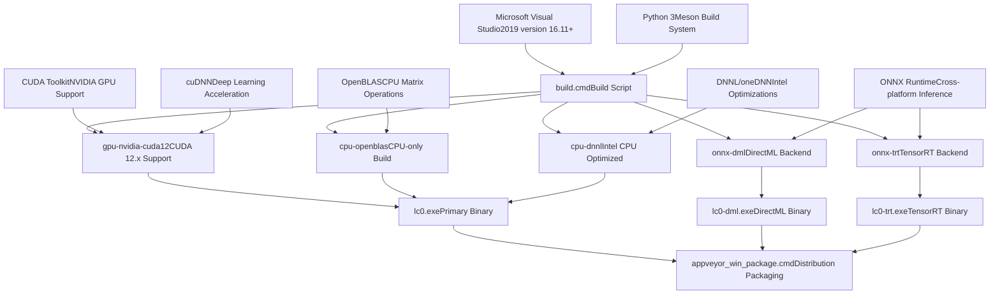
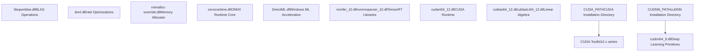
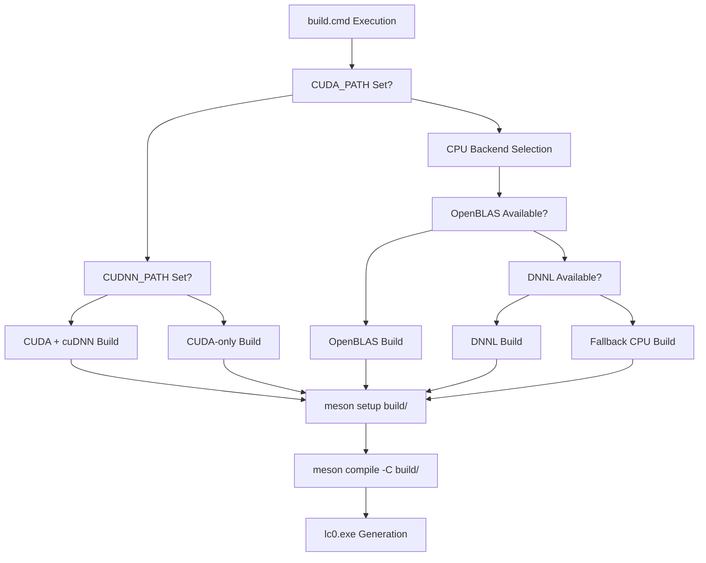
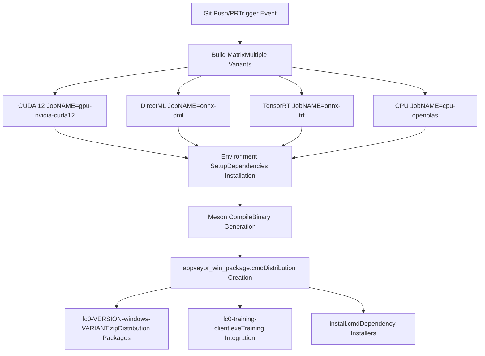
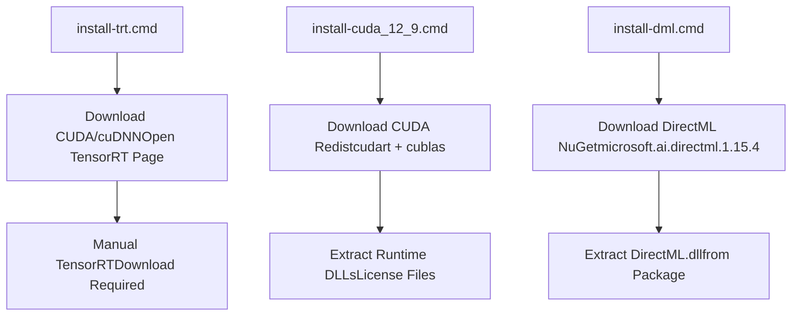

# Windows Build Process

Relevant source files

-   [CONTRIBUTING.md](https://github.com/LeelaChessZero/lc0/blob/b4e98c19/CONTRIBUTING.md)
-   [README.md](https://github.com/LeelaChessZero/lc0/blob/b4e98c19/README.md)
-   [dist/README-onnx-dml.txt](https://github.com/LeelaChessZero/lc0/blob/b4e98c19/dist/README-onnx-dml.txt)
-   [dist/README-onnx-trt.txt](https://github.com/LeelaChessZero/lc0/blob/b4e98c19/dist/README-onnx-trt.txt)
-   [dist/install-cuda\_12\_9.cmd](https://github.com/LeelaChessZero/lc0/blob/b4e98c19/dist/install-cuda_12_9.cmd)
-   [dist/install-dml.cmd](https://github.com/LeelaChessZero/lc0/blob/b4e98c19/dist/install-dml.cmd)
-   [dist/install-trt.cmd](https://github.com/LeelaChessZero/lc0/blob/b4e98c19/dist/install-trt.cmd)
-   [install\_openSUSE\_lc0.sh](https://github.com/LeelaChessZero/lc0/blob/b4e98c19/install_openSUSE_lc0.sh)
-   [openSUSE\_install.md](https://github.com/LeelaChessZero/lc0/blob/b4e98c19/openSUSE_install.md)
-   [pyproject.toml](https://github.com/LeelaChessZero/lc0/blob/b4e98c19/pyproject.toml)
-   [scripts/appveyor\_win\_package.cmd](https://github.com/LeelaChessZero/lc0/blob/b4e98c19/scripts/appveyor_win_package.cmd)

This document describes the Windows-specific build process for the Leela Chess Zero (lc0) engine, including prerequisites, build variants, packaging, and continuous integration workflows. For general build system architecture and cross-platform concepts, see [Build System Architecture](/LeelaChessZero/lc0/2.1-build-system-architecture). For Linux and macOS build processes, see [Linux and macOS Build Process](/LeelaChessZero/lc0/2.2-linux-and-macos-build-process).

## Build System Overview

The Windows build process utilizes the Meson build system with Microsoft Visual Studio as the primary compiler, integrated with AppVeyor for continuous integration. Multiple backend variants are supported, each requiring different dependencies and producing specialized binaries.


Sources: [README.md83-105](https://github.com/LeelaChessZero/lc0/blob/b4e98c19/README.md#L83-L105) [scripts/appveyor\_win\_package.cmd1-72](https://github.com/LeelaChessZero/lc0/blob/b4e98c19/scripts/appveyor_win_package.cmd#L1-L72)

## Prerequisites and Dependencies

### Core Requirements

| Component | Version | Purpose |
| --- | --- | --- |
| Microsoft Visual Studio | 2019 v16.11+ | C++20 compiler support |
| Python 3 | 3.7+ | Meson build system |
| Meson | Latest | Build system |
| Git | Any | Submodule management |

### Backend-Specific Dependencies

The build process supports multiple neural network backends, each with specific requirements:


Sources: [README.md87-94](https://github.com/LeelaChessZero/lc0/blob/b4e98c19/README.md#L87-L94) [scripts/appveyor\_win\_package.cmd14-25](https://github.com/LeelaChessZero/lc0/blob/b4e98c19/scripts/appveyor_win_package.cmd#L14-L25) [dist/install-cuda\_12\_9.cmd8-36](https://github.com/LeelaChessZero/lc0/blob/b4e98c19/dist/install-cuda_12_9.cmd#L8-L36)

## Build Variants and Backend Configuration

### Primary Build Variants

The AppVeyor CI system produces several distinct build variants:

| Variant | Binary | Backend | Use Case |
| --- | --- | --- | --- |
| `gpu-nvidia-cuda12` | `lc0.exe` | CUDA 12.x | NVIDIA GPU acceleration |
| `onnx-dml` | `lc0-dml.exe` | DirectML | Windows GPU (AMD/Intel/NVIDIA) |
| `onnx-trt` | `lc0-trt.exe` | TensorRT | NVIDIA GPU with TensorRT |
| `cpu-openblas` | `lc0.exe` | OpenBLAS | CPU-only execution |
| `cpu-dnnl` | `lc0.exe` | DNNL | Intel CPU optimizations |

### Backend Selection Logic


Sources: [README.md92-105](https://github.com/LeelaChessZero/lc0/blob/b4e98c19/README.md#L92-L105) [scripts/appveyor\_win\_package.cmd13-31](https://github.com/LeelaChessZero/lc0/blob/b4e98c19/scripts/appveyor_win_package.cmd#L13-L31)

## Build Process Workflow

### Manual Build Process

The standard Windows build follows these steps:

1.  **Environment Setup**

    ```
    set CUDA_PATH=C:\Program Files\NVIDIA GPU Computing Toolkit\CUDA\v12.x
    set CUDNN_PATH=C:\Program Files\NVIDIA GPU Computing Toolkit\CUDA\v12.x
    ```

2.  **Build Execution**

    -   Run `build.cmd` which prompts for build directory cleanup
    -   Generates Visual Studio solution in `build/lc0.sln`
    -   Option to build via command line or Visual Studio IDE
3.  **Output Generation**

    -   Primary binary: `build/lc0.exe`
    -   Backend-specific binaries: `build/lc0-dml.exe`, `build/lc0-trt.exe`

### AppVeyor CI Integration

The continuous integration process utilizes AppVeyor with a comprehensive build matrix:


Sources: [scripts/appveyor\_win\_package.cmd1-72](https://github.com/LeelaChessZero/lc0/blob/b4e98c19/scripts/appveyor_win_package.cmd#L1-L72) [README.md1-2](https://github.com/LeelaChessZero/lc0/blob/b4e98c19/README.md#L1-L2)

## Packaging and Distribution

### Package Creation Process

The `appveyor_win_package.cmd` script creates comprehensive distribution packages for each build variant:

#### Core Package Contents

| File Type | Source | Purpose |
| --- | --- | --- |
| `lc0.exe` | Build output | Main engine binary |
| `COPYING` | Repository root | GPL license |
| Neural network | Downloaded | Default network weights |
| `mimalloc-*.dll` | External dependency | Memory allocator |

#### Backend-Specific Additions

**CUDA Builds:**

-   CUDA runtime libraries (`cudart64_12.dll`, `cublas64_12.dll`)
-   cuDNN libraries when available
-   CUDA license files
-   Installation scripts for missing dependencies

**ONNX Builds:**

-   ONNX Runtime libraries (`onnxruntime.dll`)
-   Provider-specific DLLs (DirectML, TensorRT)
-   Backend installation scripts (`install-dml.cmd`, `install-trt.cmd`)

**CPU Builds:**

-   BLAS libraries (`libopenblas.dll`, `dnnl.dll`)
-   Third-party license files

### Installation Scripts

The distribution includes automated installation scripts for missing dependencies:


Sources: [dist/install-dml.cmd1-25](https://github.com/LeelaChessZero/lc0/blob/b4e98c19/dist/install-dml.cmd#L1-L25) [dist/install-cuda\_12\_9.cmd1-44](https://github.com/LeelaChessZero/lc0/blob/b4e98c19/dist/install-cuda_12_9.cmd#L1-L44) [dist/install-trt.cmd1-89](https://github.com/LeelaChessZero/lc0/blob/b4e98c19/dist/install-trt.cmd#L1-L89)

## Backend-Specific Build Considerations

### CUDA Backend

The CUDA backend requires careful version management and library compatibility:

-   **CUDA 12.x Series**: Primary target with runtime library dependencies
-   **cuDNN Integration**: Optional but recommended for performance
-   **Library Bundling**: Runtime DLLs included in distribution packages
-   **Fallback Mechanisms**: CPU fallback when CUDA unavailable

### ONNX Backends

Multiple ONNX execution providers are supported:

-   **DirectML**: Windows-native GPU acceleration for all vendors
-   **TensorRT**: NVIDIA-specific high-performance inference
-   **CPU Provider**: Fallback execution on CPU

### Memory Management

All Windows builds include `mimalloc` for improved memory allocation performance:

-   **mimalloc-override.dll**: Memory allocator replacement
-   **mimalloc-redirect.dll**: Dynamic loading support
-   **Performance Benefits**: Reduced memory fragmentation and improved allocation speed

Sources: [scripts/appveyor\_win\_package.cmd7-12](https://github.com/LeelaChessZero/lc0/blob/b4e98c19/scripts/appveyor_win_package.cmd#L7-L12) [dist/README-onnx-dml.txt1-39](https://github.com/LeelaChessZero/lc0/blob/b4e98c19/dist/README-onnx-dml.txt#L1-L39) [dist/README-onnx-trt.txt1-89](https://github.com/LeelaChessZero/lc0/blob/b4e98c19/dist/README-onnx-trt.txt#L1-L89)
