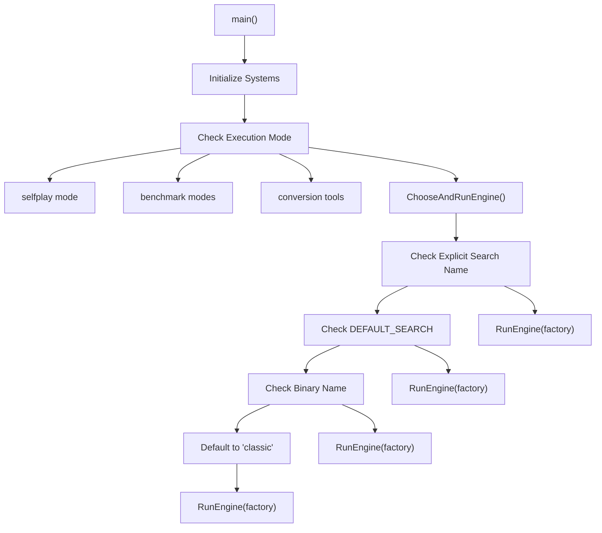
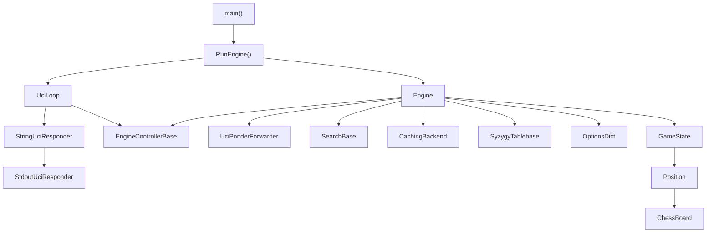
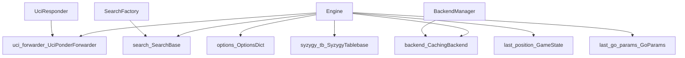
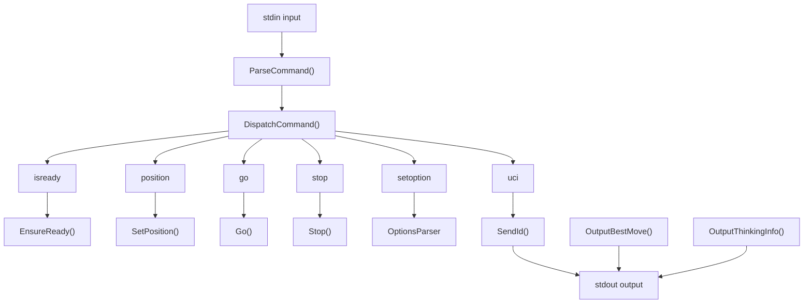
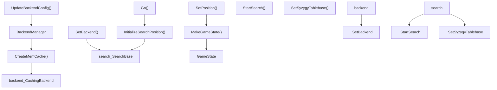
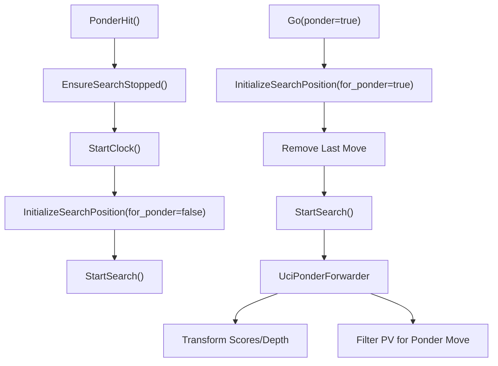
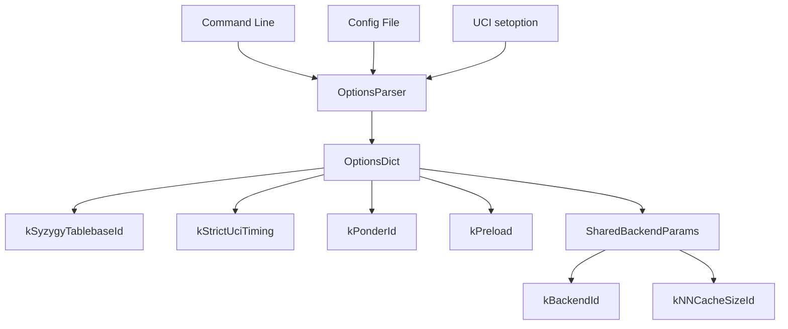

# Core Engine Architecture

Relevant source files

-   [src/chess/callbacks.h](https://github.com/LeelaChessZero/lc0/blob/b4e98c19/src/chess/callbacks.h)
-   [src/chess/uciloop.cc](https://github.com/LeelaChessZero/lc0/blob/b4e98c19/src/chess/uciloop.cc)
-   [src/chess/uciloop.h](https://github.com/LeelaChessZero/lc0/blob/b4e98c19/src/chess/uciloop.h)
-   [src/engine.cc](https://github.com/LeelaChessZero/lc0/blob/b4e98c19/src/engine.cc)
-   [src/engine.h](https://github.com/LeelaChessZero/lc0/blob/b4e98c19/src/engine.h)
-   [src/engine\_loop.cc](https://github.com/LeelaChessZero/lc0/blob/b4e98c19/src/engine_loop.cc)
-   [src/engine\_loop.h](https://github.com/LeelaChessZero/lc0/blob/b4e98c19/src/engine_loop.h)
-   [src/main.cc](https://github.com/LeelaChessZero/lc0/blob/b4e98c19/src/main.cc)
-   [src/selfplay/loop.cc](https://github.com/LeelaChessZero/lc0/blob/b4e98c19/src/selfplay/loop.cc)

This page describes the core engine architecture of Lc0, including the main entry points, engine controller, UCI protocol handling, and the coordination between different subsystems. The focus is on the high-level architectural components and their interactions.

For details about the neural network system, see [Neural Network System](/LeelaChessZero/lc0/6-neural-network-system). For search algorithm implementation, see [Search Algorithm](/LeelaChessZero/lc0/5-search-algorithm). For UCI protocol specifics, see [UCI Protocol Implementation](/LeelaChessZero/lc0/3.1-uci-protocol-implementation).

## System Overview

The Lc0 engine follows a modular architecture where the core engine serves as a coordinator between the UCI protocol layer, search algorithms, neural network backends, and chess game logic. The architecture supports multiple execution modes including standard UCI engine operation, self-play tournaments, and various utility tools.

## Main Entry Point and Engine Selection

The application starts in `main()` where it initializes core systems and determines which execution mode to use. The primary engine selection logic resides in `ChooseAndRunEngine()`.

### Engine Selection Flow

**Sources:** [src/main.cc44-75](https://github.com/LeelaChessZero/lc0/blob/b4e98c19/src/main.cc#L44-L75) [src/main.cc78-140](https://github.com/LeelaChessZero/lc0/blob/b4e98c19/src/main.cc#L78-L140)

## Core Engine Architecture Components

The engine architecture consists of several key layers that work together to provide UCI-compliant chess engine functionality.

### Architecture Overview

**Sources:** [src/engine\_loop.cc47-82](https://github.com/LeelaChessZero/lc0/blob/b4e98c19/src/engine_loop.cc#L47-L82) [src/engine.cc147-155](https://github.com/LeelaChessZero/lc0/blob/b4e98c19/src/engine.cc#L147-L155) [src/chess/uciloop.cc166-172](https://github.com/LeelaChessZero/lc0/blob/b4e98c19/src/chess/uciloop.cc#L166-L172)

## Engine Class Design

The `Engine` class implements `EngineControllerBase` and serves as the primary coordinator for all engine operations. It manages the lifecycle of searches, backend configurations, and game state.

### Engine Component Relationships

**Sources:** [src/engine.h40-87](https://github.com/LeelaChessZero/lc0/blob/b4e98c19/src/engine.h#L40-L87) [src/engine.cc147-155](https://github.com/LeelaChessZero/lc0/blob/b4e98c19/src/engine.cc#L147-L155)

## UCI Protocol Integration

The UCI protocol handling is implemented through a layered approach where `UciLoop` processes commands and delegates engine operations to `EngineControllerBase` implementations.

### UCI Command Flow

**Sources:** [src/chess/uciloop.cc174-250](https://github.com/LeelaChessZero/lc0/blob/b4e98c19/src/chess/uciloop.cc#L174-L250) [src/chess/uciloop.cc80-131](https://github.com/LeelaChessZero/lc0/blob/b4e98c19/src/chess/uciloop.cc#L80-L131)

## Engine Lifecycle and State Management

The engine manages several types of state and coordinates their updates across different operations.

### Engine State Management

| State Component | Type | Purpose | Update Triggers |
| --- | --- | --- | --- |
| `ponder_enabled_` | `bool` | Pondering support flag | `SetPosition()` |
| `strict_uci_timing_` | `bool` | UCI timing mode | `SetPosition()` |
| `last_position_` | `GameState` | Current game position | `SetPosition()`, `NewGame()` |
| `last_go_params_` | `GoParams` | Last search parameters | `Go()` |
| `backend_name_` | `string` | Active backend name | `UpdateBackendConfig()` |
| `previous_tb_paths_` | `string` | Tablebase paths | `EnsureSyzygyTablebasesLoaded()` |

**Sources:** [src/engine.h76-86](https://github.com/LeelaChessZero/lc0/blob/b4e98c19/src/engine.h#L76-L86) [src/engine.cc217-225](https://github.com/LeelaChessZero/lc0/blob/b4e98c19/src/engine.cc#L217-L225)

## Backend and Search Integration

The engine coordinates between the search algorithm and neural network backend through well-defined interfaces.

### Integration Flow

**Sources:** [src/engine.cc164-177](https://github.com/LeelaChessZero/lc0/blob/b4e98c19/src/engine.cc#L164-L177) [src/engine.cc215-225](https://github.com/LeelaChessZero/lc0/blob/b4e98c19/src/engine.cc#L215-L225) [src/engine.cc233-242](https://github.com/LeelaChessZero/lc0/blob/b4e98c19/src/engine.cc#L233-L242)

## Pondering Support

The engine includes sophisticated pondering support through the `UciPonderForwarder` class, which transforms search output for ponder mode.

### Ponder Implementation

**Sources:** [src/engine.cc91-145](https://github.com/LeelaChessZero/lc0/blob/b4e98c19/src/engine.cc#L91-L145) [src/engine.cc249-257](https://github.com/LeelaChessZero/lc0/blob/b4e98c19/src/engine.cc#L249-L257) [src/engine.cc200-213](https://github.com/LeelaChessZero/lc0/blob/b4e98c19/src/engine.cc#L200-L213)

## Configuration and Options Management

The engine uses a sophisticated options system that integrates configuration from multiple sources including command line, UCI options, and configuration files.

### Options Integration

**Sources:** [src/engine.cc41-72](https://github.com/LeelaChessZero/lc0/blob/b4e98c19/src/engine.cc#L41-L72) [src/engine\_loop.cc51-63](https://github.com/LeelaChessZero/lc0/blob/b4e98c19/src/engine_loop.cc#L51-L63)
