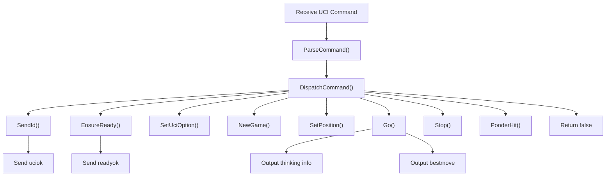
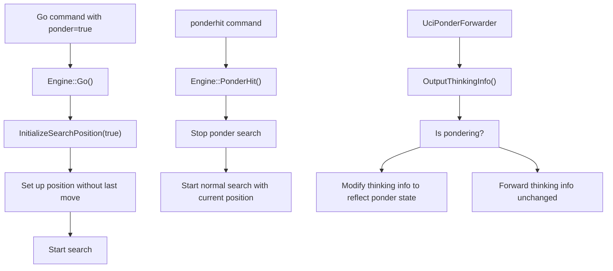
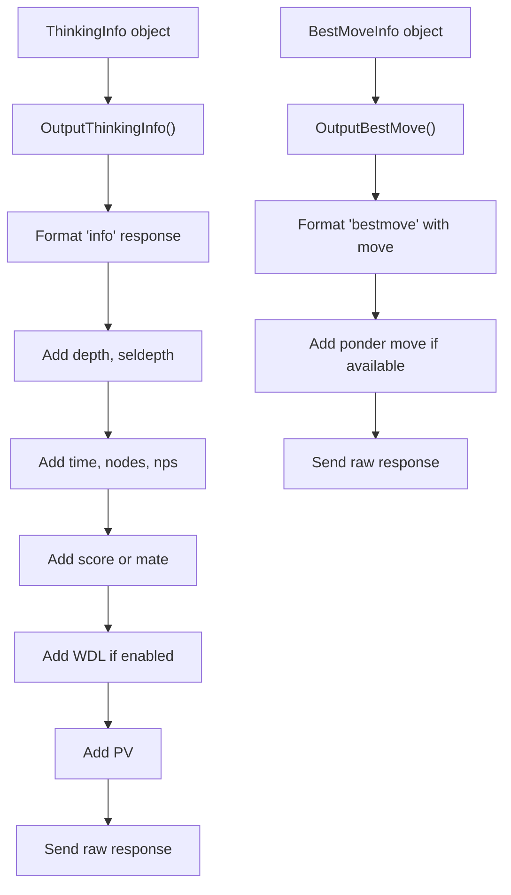
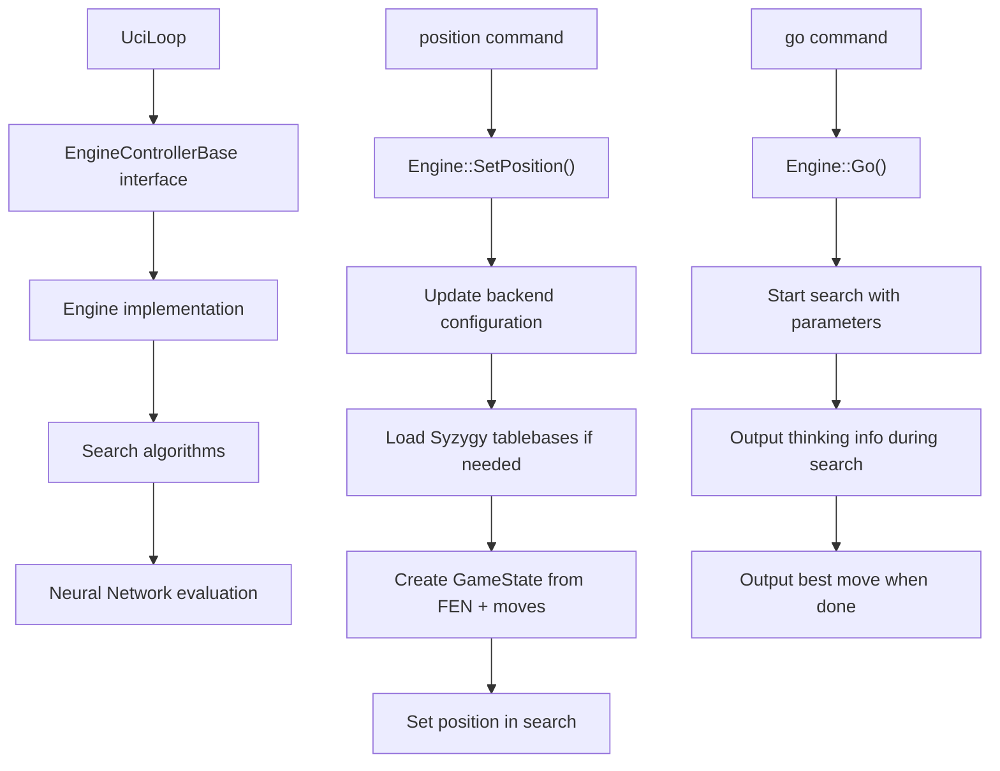
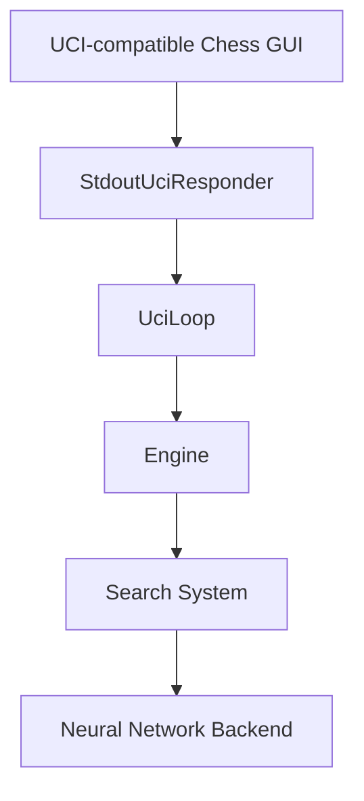
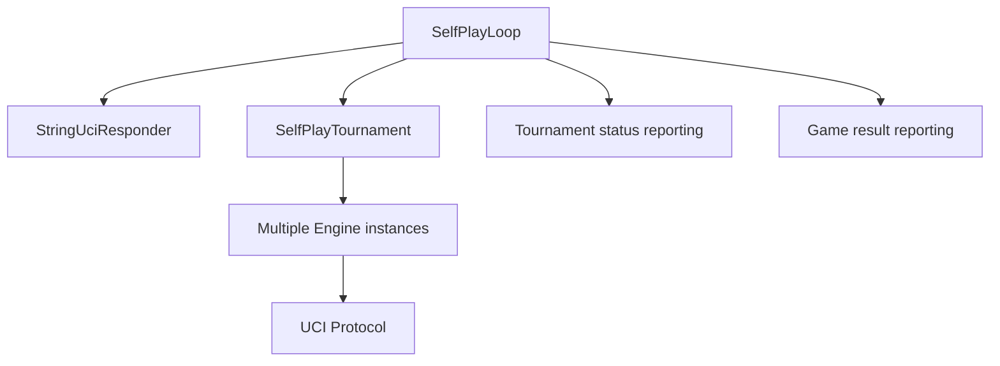

# UCI Protocol Implementation

Relevant source files

-   [src/chess/callbacks.h](https://github.com/LeelaChessZero/lc0/blob/b4e98c19/src/chess/callbacks.h)
-   [src/chess/uciloop.cc](https://github.com/LeelaChessZero/lc0/blob/b4e98c19/src/chess/uciloop.cc)
-   [src/chess/uciloop.h](https://github.com/LeelaChessZero/lc0/blob/b4e98c19/src/chess/uciloop.h)
-   [src/engine.cc](https://github.com/LeelaChessZero/lc0/blob/b4e98c19/src/engine.cc)
-   [src/engine.h](https://github.com/LeelaChessZero/lc0/blob/b4e98c19/src/engine.h)
-   [src/selfplay/loop.cc](https://github.com/LeelaChessZero/lc0/blob/b4e98c19/src/selfplay/loop.cc)

This document details how Leela Chess Zero (lc0) implements the Universal Chess Interface (UCI) protocol, which enables communication between the chess engine and user interfaces or other controlling processes. For information about engine configuration options, see [Configuration System](/LeelaChessZero/lc0/3.2-configuration-system).

## Overview of UCI Protocol

The Universal Chess Interface (UCI) is a text-based protocol that defines how chess engines communicate with user interfaces. Lc0 implements this protocol to allow seamless integration with UCI-compatible chess GUIs and to facilitate automated testing and tournaments.

Sources: [src/chess/uciloop.cc148-218](https://github.com/LeelaChessZero/lc0/blob/b4e98c19/src/chess/uciloop.cc#L148-L218) [src/engine.cc209-235](https://github.com/LeelaChessZero/lc0/blob/b4e98c19/src/engine.cc#L209-L235)

## UCI Protocol Implementation Architecture

The UCI implementation in Lc0 is organized around several key classes that work together to handle communication and process commands.

Sources: [src/chess/uciloop.h41-124](https://github.com/LeelaChessZero/lc0/blob/b4e98c19/src/chess/uciloop.h#L41-L124) [src/engine.h40-85](https://github.com/LeelaChessZero/lc0/blob/b4e98c19/src/engine.h#L40-L85) [src/chess/callbacks.h41-147](https://github.com/LeelaChessZero/lc0/blob/b4e98c19/src/chess/callbacks.h#L41-L147)

## Command Processing Flow

When a UCI command is received, it goes through several processing steps:

1.  The `UciLoop` class receives the command text
2.  The command is parsed into a command name and parameter map
3.  The appropriate method is called on the `EngineControllerBase` object
4.  The engine processes the command and may generate responses
5.  Responses are sent back through the `StringUciResponder`

Sources: [src/chess/uciloop.cc104-136](https://github.com/LeelaChessZero/lc0/blob/b4e98c19/src/chess/uciloop.cc#L104-L136) [src/chess/uciloop.cc147-218](https://github.com/LeelaChessZero/lc0/blob/b4e98c19/src/chess/uciloop.cc#L147-L218)

## Supported UCI Commands

Lc0 supports the standard UCI protocol commands:

| Command | Description | Implementation |
| --- | --- | --- |
| `uci` | Initialize the UCI protocol | Sends engine identity and available options |
| `isready` | Check if engine is ready | Ensures engine is ready and responds |
| `setoption name [name] value [value]` | Set engine option | Updates the specified engine option |
| `ucinewgame` | Prepare for a new game | Resets the engine state |
| `position [fen/startpos] moves ...` | Set the current position | Sets up the board position |
| `go [parameters]` | Start searching | Begins search with specified parameters |
| `stop` | Stop searching | Halts the current search |
| `ponderhit` | Opponent played the expected move | Converts ponder search into normal search |
| `quit` | Terminate the engine | Exits the UCI loop |

Sources: [src/chess/uciloop.cc69-70](https://github.com/LeelaChessZero/lc0/blob/b4e98c19/src/chess/uciloop.cc#L69-L70) [src/chess/uciloop.cc147-218](https://github.com/LeelaChessZero/lc0/blob/b4e98c19/src/chess/uciloop.cc#L147-L218)

## Go Parameters

The `go` command can include various parameters to control the search:

Sources: [src/chess/uciloop.h42-55](https://github.com/LeelaChessZero/lc0/blob/b4e98c19/src/chess/uciloop.h#L42-L55) [src/chess/uciloop.cc173-205](https://github.com/LeelaChessZero/lc0/blob/b4e98c19/src/chess/uciloop.cc#L173-L205)

## Response Handling

Lc0 sends two main types of responses to the UCI interface:

1.  **Thinking information** - Sent periodically during search using the `info` command
2.  **Best move** - Sent after search completion using the `bestmove` command

The engine implements these through the following structures:

Sources: [src/chess/callbacks.h42-55](https://github.com/LeelaChessZero/lc0/blob/b4e98c19/src/chess/callbacks.h#L42-L55) [src/chess/callbacks.h57-100](https://github.com/LeelaChessZero/lc0/blob/b4e98c19/src/chess/callbacks.h#L57-L100) [src/chess/uciloop.cc247-256](https://github.com/LeelaChessZero/lc0/blob/b4e98c19/src/chess/uciloop.cc#L247-L256) [src/chess/uciloop.cc258-294](https://github.com/LeelaChessZero/lc0/blob/b4e98c19/src/chess/uciloop.cc#L258-L294)

## Pondering Implementation

Pondering is a feature where the engine thinks during the opponent's time. Lc0 implements pondering through a specialized responder class called `UciPonderForwarder`:

Sources: [src/engine.cc84-138](https://github.com/LeelaChessZero/lc0/blob/b4e98c19/src/engine.cc#L84-L138) [src/engine.cc192-249](https://github.com/LeelaChessZero/lc0/blob/b4e98c19/src/engine.cc#L192-L249)

## UCI Response Formatting

The `StringUciResponder` class is responsible for formatting UCI responses according to the protocol specification:

Sources: [src/chess/uciloop.cc247-256](https://github.com/LeelaChessZero/lc0/blob/b4e98c19/src/chess/uciloop.cc#L247-L256) [src/chess/uciloop.cc258-294](https://github.com/LeelaChessZero/lc0/blob/b4e98c19/src/chess/uciloop.cc#L258-L294)

## Extension Features

Lc0 implements several extensions to the standard UCI protocol:

1.  **UCI\_Chess960**: Option for supporting Chess960 (Fischer Random Chess)
2.  **UCI\_ShowWDL**: Option to show win/draw/loss probabilities in engine output
3.  **UCI\_ShowMovesLeft**: Option to show estimated moves left to end of game
4.  **Player/Game ID extensions**: Additional fields in thinking info and best move info

Sources: [src/chess/uciloop.cc48-54](https://github.com/LeelaChessZero/lc0/blob/b4e98c19/src/chess/uciloop.cc#L48-L54) [src/chess/uciloop.cc227-231](https://github.com/LeelaChessZero/lc0/blob/b4e98c19/src/chess/uciloop.cc#L227-L231) [src/chess/callbacks.h48-54](https://github.com/LeelaChessZero/lc0/blob/b4e98c19/src/chess/callbacks.h#L48-L54) [src/chess/callbacks.h91-99](https://github.com/LeelaChessZero/lc0/blob/b4e98c19/src/chess/callbacks.h#L91-L99)

## Integration with Engine

The UCI protocol interfaces with the main engine through the `Engine` class, which implements the `EngineControllerBase` interface:

Sources: [src/engine.cc209-235](https://github.com/LeelaChessZero/lc0/blob/b4e98c19/src/engine.cc#L209-L235) [src/engine.cc140-171](https://github.com/LeelaChessZero/lc0/blob/b4e98c19/src/engine.cc#L140-L171)

## Error Handling

The UCI implementation includes error handling for invalid commands and parameters:

1.  Unknown commands throw an exception with "Unknown command: \[command\]"
2.  Invalid parameter values throw appropriate exceptions
3.  Missing required parameters are detected and reported

Sources: [src/chess/uciloop.cc86-88](https://github.com/LeelaChessZero/lc0/blob/b4e98c19/src/chess/uciloop.cc#L86-L88) [src/chess/uciloop.cc122-130](https://github.com/LeelaChessZero/lc0/blob/b4e98c19/src/chess/uciloop.cc#L122-L130) [src/chess/uciloop.cc166-168](https://github.com/LeelaChessZero/lc0/blob/b4e98c19/src/chess/uciloop.cc#L166-L168)

## Overall Communication Flow

Sources: [src/chess/uciloop.h41-124](https://github.com/LeelaChessZero/lc0/blob/b4e98c19/src/chess/uciloop.h#L41-L124) [src/chess/uciloop.cc139-145](https://github.com/LeelaChessZero/lc0/blob/b4e98c19/src/chess/uciloop.cc#L139-L145) [src/engine.h40-85](https://github.com/LeelaChessZero/lc0/blob/b4e98c19/src/engine.h#L40-L85)

## Self-Play and Tournament Mode

In addition to standard UCI protocol support, Lc0 includes a self-play mode that uses the UCI protocol internally for communication between components:

Sources: [src/selfplay/loop.h38-58](https://github.com/LeelaChessZero/lc0/blob/b4e98c19/src/selfplay/loop.h#L38-L58) [src/selfplay/loop.cc49-67](https://github.com/LeelaChessZero/lc0/blob/b4e98c19/src/selfplay/loop.cc#L49-L67)

This self-play functionality is used for generating training data and for testing the engine through internal tournaments.
