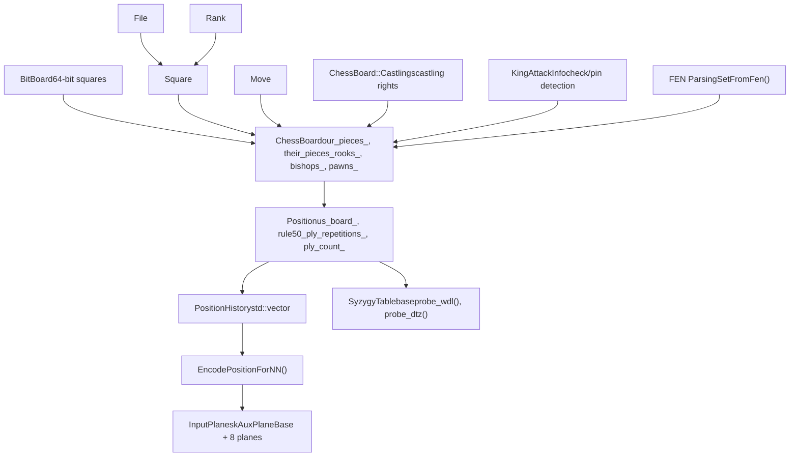
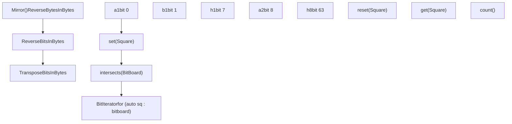
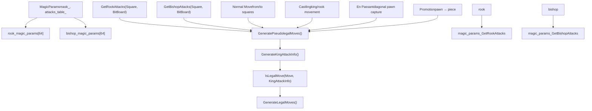
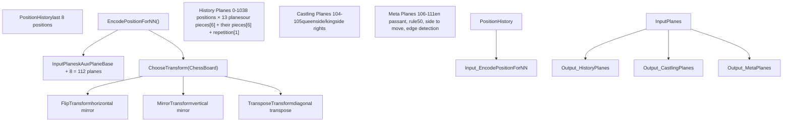
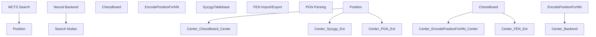

# Chess Representation

Relevant source files

-   [src/chess/bitboard.h](https://github.com/LeelaChessZero/lc0/blob/b4e98c19/src/chess/bitboard.h)
-   [src/chess/board.cc](https://github.com/LeelaChessZero/lc0/blob/b4e98c19/src/chess/board.cc)
-   [src/chess/board.h](https://github.com/LeelaChessZero/lc0/blob/b4e98c19/src/chess/board.h)
-   [src/chess/board\_test.cc](https://github.com/LeelaChessZero/lc0/blob/b4e98c19/src/chess/board_test.cc)
-   [src/chess/position.cc](https://github.com/LeelaChessZero/lc0/blob/b4e98c19/src/chess/position.cc)
-   [src/chess/position.h](https://github.com/LeelaChessZero/lc0/blob/b4e98c19/src/chess/position.h)
-   [src/chess/position\_test.cc](https://github.com/LeelaChessZero/lc0/blob/b4e98c19/src/chess/position_test.cc)
-   [src/neural/encoder.cc](https://github.com/LeelaChessZero/lc0/blob/b4e98c19/src/neural/encoder.cc)
-   [src/neural/encoder.h](https://github.com/LeelaChessZero/lc0/blob/b4e98c19/src/neural/encoder.h)
-   [src/neural/encoder\_test.cc](https://github.com/LeelaChessZero/lc0/blob/b4e98c19/src/neural/encoder_test.cc)
-   [src/syzygy/syzygy.cc](https://github.com/LeelaChessZero/lc0/blob/b4e98c19/src/syzygy/syzygy.cc)
-   [src/syzygy/syzygy.h](https://github.com/LeelaChessZero/lc0/blob/b4e98c19/src/syzygy/syzygy.h)
-   [src/syzygy/syzygy\_test.cc](https://github.com/LeelaChessZero/lc0/blob/b4e98c19/src/syzygy/syzygy_test.cc)
-   [src/utils/bititer.h](https://github.com/LeelaChessZero/lc0/blob/b4e98c19/src/utils/bititer.h)

This document covers the internal representation of chess positions, moves, and game states in the lc0 engine. It explains the core data structures and algorithms used to efficiently represent and manipulate chess positions for both search and neural network evaluation.

For information about move generation algorithms and bitboard operations, see [Bitboards and Move Generation](/LeelaChessZero/lc0/4.1-bitboards-and-move-generation). For details on position encoding for neural networks and game history management, see [Position Encoding and History](/LeelaChessZero/lc0/4.2-position-encoding-and-history). For endgame tablebase integration, see [Syzygy Tablebase Integration](/LeelaChessZero/lc0/4.3-syzygy-tablebase-integration).

## Core Representation Architecture

The chess representation system is built in layers, from low-level bitboard operations up to neural network input encoding:

Sources: [src/chess/board.h59-253](https://github.com/LeelaChessZero/lc0/blob/b4e98c19/src/chess/board.h#L59-L253) [src/chess/position.h38-90](https://github.com/LeelaChessZero/lc0/blob/b4e98c19/src/chess/position.h#L38-L90) [src/chess/bitboard.h40-162](https://github.com/LeelaChessZero/lc0/blob/b4e98c19/src/chess/bitboard.h#L40-L162) [src/neural/encoder.h34-68](https://github.com/LeelaChessZero/lc0/blob/b4e98c19/src/neural/encoder.h#L34-L68)

## BitBoard Foundation

The `BitBoard` class provides the fundamental 64-bit representation where each bit corresponds to a chess square:

Key characteristics:

-   **Square Mapping**: Square a1 = bit 0, h1 = bit 7, a2 = bit 8, h8 = bit 63
-   **Efficient Operations**: Bitwise AND/OR for piece interactions, population count for piece counting
-   **Iteration Support**: `BitIterator` allows range-based loops over set squares
-   **Board Transformations**: Support for mirroring and flipping for canonicalization

Sources: [src/chess/bitboard.h40-162](https://github.com/LeelaChessZero/lc0/blob/b4e98c19/src/chess/bitboard.h#L40-L162) [src/utils/bititer.h92-123](https://github.com/LeelaChessZero/lc0/blob/b4e98c19/src/utils/bititer.h#L92-L123)

## ChessBoard Class Structure

The `ChessBoard` class represents a complete chess position using multiple bitboards:

```mermaid
flowchart TD
    our_pieces_["our_pieces_BitBoard"]
    their_pieces_["their_pieces_BitBoard"]
    rooks_["rooks_BitBoard"]
    bishops_["bishops_BitBoard"]
    pawns_["pawns_BitBoard"]
    our_king_["our_king_Square"]
    their_king_["their_king_Square"]
    castlings_["castlings_Castlings"]
    flipped_["flipped_bool"]
    GeneratePseudolegalMoves["GeneratePseudolegalMoves()→ MoveList"]
    ApplyMove["ApplyMove(Move)→ bool"]
    IsUnderAttack["IsUnderAttack(Square)→ bool"]
    SetFromFen["SetFromFen(string_view)"]

    our --> pieces__GeneratePseudolegalMoves
    rooks --> _GeneratePseudolegalMoves
    bishops --> _GeneratePseudolegalMoves
    pawns --> _GeneratePseudolegalMoves
    our --> king__IsUnderAttack
    castlings --> _GeneratePseudolegalMoves
    GeneratePseudolegalMoves --> ApplyMove
    ApplyMove --> flipped_
```

Key design principles:

-   **Mirrored Representation**: `flipped_` indicates black to move; board is always from current player's perspective
-   **Overlapping Bitboards**: Queens are represented as `rooks_ & bishops_`, knights as remaining pieces
-   **Special En Passant Encoding**: Uses ranks 1 and 8 of `pawns_` bitboard for en passant flags

Sources: [src/chess/board.h59-253](https://github.com/LeelaChessZero/lc0/blob/b4e98c19/src/chess/board.h#L59-L253) [src/chess/board.cc54-68](https://github.com/LeelaChessZero/lc0/blob/b4e98c19/src/chess/board.cc#L54-L68)

## Position and Game Context

The `Position` class wraps `ChessBoard` with additional game state needed for proper chess rules:

```mermaid
flowchart TD
    us_board_["us_board_ChessBoard"]
    rule50_ply_["rule50_ply_int"]
    repetitions_["repetitions_int"]
    cycle_length_["cycle_length_int"]
    ply_count_["ply_count_int"]
    positions_["std::vectorpositions_"]
    Append["Append(Move)"]
    ComputeLastMoveRepetitions["ComputeLastMoveRepetitions()"]
    ComputeGameResult["ComputeGameResult()"]
    Checkmate["Checkmateno legal moves + in check"]
    Stalemate["Stalemateno legal moves + not in check"]
    FiftyMove["50-move rulerule50_ply >= 100"]
    Repetition["Threefold repetitionrepetitions >= 2"]

    us --> board__positions_
    rule50 --> ply__positions_
    repetitions --> _positions_
    positions --> _Append
    Append --> ComputeLastMoveRepetitions
    ComputeLastMoveRepetitions --> repetitions_
    positions --> _ComputeGameResult
    ComputeGameResult --> Checkmate
    ComputeGameResult --> Stalemate
    ComputeGameResult --> FiftyMove
    ComputeGameResult --> Repetition
```

Sources: [src/chess/position.h38-159](https://github.com/LeelaChessZero/lc0/blob/b4e98c19/src/chess/position.h#L38-L159) [src/chess/position.cc75-158](https://github.com/LeelaChessZero/lc0/blob/b4e98c19/src/chess/position.cc#L75-L158)

## Move Representation and Generation

Move generation and representation uses magic bitboards for efficient sliding piece attacks:

Sources: [src/chess/board.cc183-427](https://github.com/LeelaChessZero/lc0/blob/b4e98c19/src/chess/board.cc#L183-L427) [src/chess/board.cc429-574](https://github.com/LeelaChessZero/lc0/blob/b4e98c19/src/chess/board.cc#L429-L574) [src/chess/board.cc733-857](https://github.com/LeelaChessZero/lc0/blob/b4e98c19/src/chess/board.cc#L733-L857)

## Neural Network Encoding

The encoding system converts chess positions into neural network input planes:

Key encoding features:

-   **112 Total Planes**: 8 positions × 13 planes per position + 8 auxiliary planes
-   **Piece Encoding**: Separate planes for each piece type for both sides
-   **Canonicalization**: Board transformations to reduce input space for training
-   **Multiple Formats**: Support for different network input formats with varying features

Sources: [src/neural/encoder.cc134-337](https://github.com/LeelaChessZero/lc0/blob/b4e98c19/src/neural/encoder.cc#L134-L337) [src/neural/encoder.h38-68](https://github.com/LeelaChessZero/lc0/blob/b4e98c19/src/neural/encoder.h#L38-L68)

## Integration Points

The chess representation integrates with other engine components:

Sources: [src/chess/board.h255-257](https://github.com/LeelaChessZero/lc0/blob/b4e98c19/src/chess/board.h#L255-L257) [src/chess/position.h92-157](https://github.com/LeelaChessZero/lc0/blob/b4e98c19/src/chess/position.h#L92-L157) [src/syzygy/syzygy.h58-111](https://github.com/LeelaChessZero/lc0/blob/b4e98c19/src/syzygy/syzygy.h#L58-L111)
