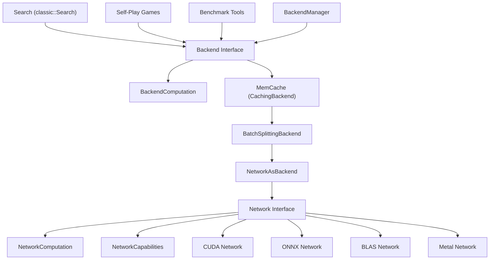
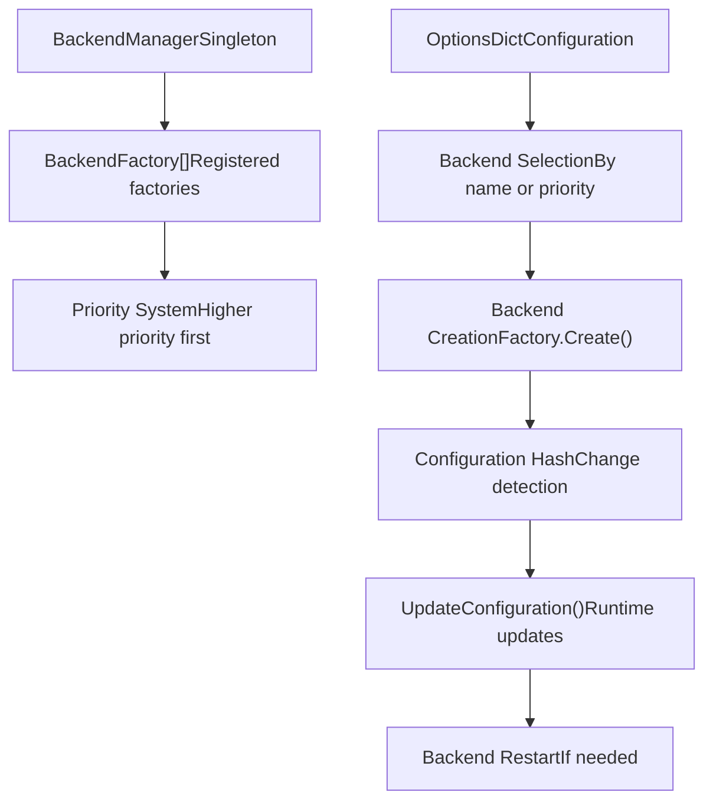

# Neural Network System

Relevant source files

-   [src/neural/backend.cc](https://github.com/LeelaChessZero/lc0/blob/b4e98c19/src/neural/backend.cc)
-   [src/neural/backend.h](https://github.com/LeelaChessZero/lc0/blob/b4e98c19/src/neural/backend.h)
-   [src/neural/batchsplit.cc](https://github.com/LeelaChessZero/lc0/blob/b4e98c19/src/neural/batchsplit.cc)
-   [src/neural/memcache.cc](https://github.com/LeelaChessZero/lc0/blob/b4e98c19/src/neural/memcache.cc)
-   [src/neural/memcache.h](https://github.com/LeelaChessZero/lc0/blob/b4e98c19/src/neural/memcache.h)
-   [src/neural/network.h](https://github.com/LeelaChessZero/lc0/blob/b4e98c19/src/neural/network.h)
-   [src/neural/shared\_params.cc](https://github.com/LeelaChessZero/lc0/blob/b4e98c19/src/neural/shared_params.cc)
-   [src/neural/shared\_params.h](https://github.com/LeelaChessZero/lc0/blob/b4e98c19/src/neural/shared_params.h)
-   [src/neural/wrapper.cc](https://github.com/LeelaChessZero/lc0/blob/b4e98c19/src/neural/wrapper.cc)
-   [src/tools/backendbench.cc](https://github.com/LeelaChessZero/lc0/blob/b4e98c19/src/tools/backendbench.cc)
-   [src/tools/benchmark.cc](https://github.com/LeelaChessZero/lc0/blob/b4e98c19/src/tools/benchmark.cc)
-   [src/tools/benchmark.h](https://github.com/LeelaChessZero/lc0/blob/b4e98c19/src/tools/benchmark.h)

## Purpose and Scope

The Neural Network System provides the infrastructure for neural network inference in Leela Chess Zero. This system abstracts neural network evaluation across multiple hardware backends (CUDA, ONNX, BLAS, etc.) and provides caching, batching, and performance optimization capabilities. The system bridges between the chess search algorithm and the underlying neural network implementations.

For information about specific backend implementations, see [CUDA and cuDNN Backend](/LeelaChessZero/lc0/6.3-cuda-and-cudnn-backend), [ONNX Integration](/LeelaChessZero/lc0/6.4-onnx-integration), and [XLA and HLO Support](/LeelaChessZero/lc0/6.5-xla-and-hlo-support). For details about network weight formats and loading, see [Weights Loading and Management](/LeelaChessZero/lc0/6.2-weights-loading-and-management). For search algorithm integration, see [Search Algorithm](/LeelaChessZero/lc0/5-search-algorithm).

## System Architecture

The neural network system is organized in multiple abstraction layers, each providing specific functionality while maintaining clean separation of concerns.

### Architecture Overview

Sources: [src/neural/backend.h89-135](https://github.com/LeelaChessZero/lc0/blob/b4e98c19/src/neural/backend.h#L89-L135) [src/neural/network.h116-127](https://github.com/LeelaChessZero/lc0/blob/b4e98c19/src/neural/network.h#L116-L127) [src/neural/wrapper.cc48-97](https://github.com/LeelaChessZero/lc0/blob/b4e98c19/src/neural/wrapper.cc#L48-L97) [src/neural/memcache.cc60-98](https://github.com/LeelaChessZero/lc0/blob/b4e98c19/src/neural/memcache.cc#L60-L98)

### Key Abstractions

The system provides two primary interfaces that serve different purposes:

| Interface | Purpose | Used By | Key Methods |
| --- | --- | --- | --- |
| `Network` | Raw neural network inference | Backend adapters | `NewComputation()`, `GetCapabilities()` |
| `Backend` | High-level evaluation interface | Search algorithms | `CreateComputation()`, `GetCachedEvaluation()` |

The `Backend` interface provides additional functionality like caching, configuration management, and batch optimization that the search algorithm requires, while `Network` focuses purely on neural network inference.

Sources: [src/neural/backend.h89-135](https://github.com/LeelaChessZero/lc0/blob/b4e98c19/src/neural/backend.h#L89-L135) [src/neural/network.h116-127](https://github.com/LeelaChessZero/lc0/blob/b4e98c19/src/neural/network.h#L116-L127)

## Evaluation Pipeline

The neural network evaluation follows a structured pipeline from chess positions to evaluation results.

### Evaluation Flow

```mermaid
flowchart TD
    EvalPos["EvalPosition{pos, legal_moves}"]
    Encoder["Position EncoderEncodePositionForNN()"]
    InputPlanes["InputPlanes112 planes × 64 squares"]
    BackendComp["BackendComputationAddInput()"]
    Cache["MemCacheHash lookup"]
    NetworkComp["NetworkComputationNeural inference"]
    RawOutput["Raw NN Output{q, d, m, policy}"]
    Softmax["Policy SoftmaxTemperature scaling"]
    EvalResult["EvalResult{q, d, m, p}"]

    EvalPos --> Encoder
    Encoder --> InputPlanes
    InputPlanes --> BackendComp
    BackendComp --> Cache
    Cache --> NetworkComp
    NetworkComp --> RawOutput
    RawOutput --> Softmax
    Softmax --> EvalResult
```

Sources: [src/neural/wrapper.cc108-131](https://github.com/LeelaChessZero/lc0/blob/b4e98c19/src/neural/wrapper.cc#L108-L131) [src/neural/memcache.cc112-148](https://github.com/LeelaChessZero/lc0/blob/b4e98c19/src/neural/memcache.cc#L112-L148) [src/neural/backend.h70-87](https://github.com/LeelaChessZero/lc0/blob/b4e98c19/src/neural/backend.h#L70-L87)

### Input and Output Formats

The system processes chess positions through a standardized encoding format:

**Input Format (`EvalPosition`)**:

-   `pos`: Span of chess positions (current + history)
-   `legal_moves`: Span of legal moves for policy evaluation

**Neural Network Input (`InputPlanes`)**:

-   112 input planes of 64 squares each
-   Each plane uses bitmask + value encoding for efficiency
-   Includes position history, repetition info, and metadata

**Output Format (`EvalResult`)**:

-   `q`: Position evaluation (-1 to +1)
-   `d`: Draw probability (if WDL head available)
-   `m`: Moves left estimate (if MLH head available)
-   `p`: Policy probabilities for legal moves

Sources: [src/neural/backend.h52-73](https://github.com/LeelaChessZero/lc0/blob/b4e98c19/src/neural/backend.h#L52-L73) [src/neural/network.h38-53](https://github.com/LeelaChessZero/lc0/blob/b4e98c19/src/neural/network.h#L38-L53)

## Backend Management and Selection

The `BackendManager` handles discovery, creation, and lifecycle management of neural network backends.

### Backend Factory System

Sources: [src/neural/backend.h127-135](https://github.com/LeelaChessZero/lc0/blob/b4e98c19/src/neural/backend.h#L127-L135) [src/neural/wrapper.cc174-193](https://github.com/LeelaChessZero/lc0/blob/b4e98c19/src/neural/wrapper.cc#L174-L193) [src/neural/backend.cc54-66](https://github.com/LeelaChessZero/lc0/blob/b4e98c19/src/neural/backend.cc#L54-L66)

The system supports runtime configuration updates through the `UpdateConfiguration()` method, which can either handle changes dynamically or request a backend restart if fundamental parameters have changed.

## Performance and Caching

### Memory Cache System

The `MemCache` layer provides hash-based caching of neural network evaluations to avoid redundant computation:

**Cache Implementation**:

-   Hash-keyed cache using position hash as key
-   Thread-safe with `HashKeyedCacheLock`
-   FIFO eviction policy when capacity exceeded
-   Configurable cache size via `NNCacheSize` parameter

**Cache Behavior**:

-   Immediate return for cache hits (`FETCHED_IMMEDIATELY`)
-   Queue for evaluation on cache miss (`ENQUEUED_FOR_EVAL`)
-   Automatic insertion of computed results

Sources: [src/neural/memcache.cc60-98](https://github.com/LeelaChessZero/lc0/blob/b4e98c19/src/neural/memcache.cc#L60-L98) [src/neural/memcache.cc112-148](https://github.com/LeelaChessZero/lc0/blob/b4e98c19/src/neural/memcache.cc#L112-L148)

### Batch Processing

The system optimizes throughput through intelligent batch processing:

**Batch Splitting**: The `BatchSplittingBackend` automatically manages batch sizes, splitting large batches that exceed backend limits and combining small batches for efficiency.

**Batch Optimization**: Backends report optimal batch sizes through `BackendAttributes`:

-   `recommended_batch_size`: Suggested size for best throughput
-   `maximum_batch_size`: Hard limit for single batch

Sources: [src/neural/batchsplit.cc33-93](https://github.com/LeelaChessZero/lc0/blob/b4e98c19/src/neural/batchsplit.cc#L33-L93) [src/neural/backend.h42-50](https://github.com/LeelaChessZero/lc0/blob/b4e98c19/src/neural/backend.h#L42-L50)

## Configuration System

### Shared Parameters

The neural network system uses a centralized configuration system for parameters common across backends:

| Parameter | Purpose | Default Value |
| --- | --- | --- |
| `PolicyTemperature` | Policy softmax temperature | 1.359 |
| `HistoryFill` | How to fill missing history | "fen\_only" |
| `WeightsFile` | Path to network weights | "<autodiscover>" |
| `Backend` | Backend selection | First available |
| `BackendOptions` | Backend-specific options | "" |
| `NNCacheSize` | Memory cache size | 2,000,000 |

Sources: [src/neural/shared\_params.h41-46](https://github.com/LeelaChessZero/lc0/blob/b4e98c19/src/neural/shared_params.h#L41-L46) [src/neural/shared\_params.cc68-84](https://github.com/LeelaChessZero/lc0/blob/b4e98c19/src/neural/shared_params.cc#L68-L84)

### Backend-Specific Configuration

Each backend can define additional configuration options through the `backend-opts` parameter. The system parses these options and validates that all specified options are consumed by the backend implementation.

Sources: [src/neural/wrapper.cc70-85](https://github.com/LeelaChessZero/lc0/blob/b4e98c19/src/neural/wrapper.cc#L70-L85) [src/neural/wrapper.cc183-191](https://github.com/LeelaChessZero/lc0/blob/b4e98c19/src/neural/wrapper.cc#L183-L191)
