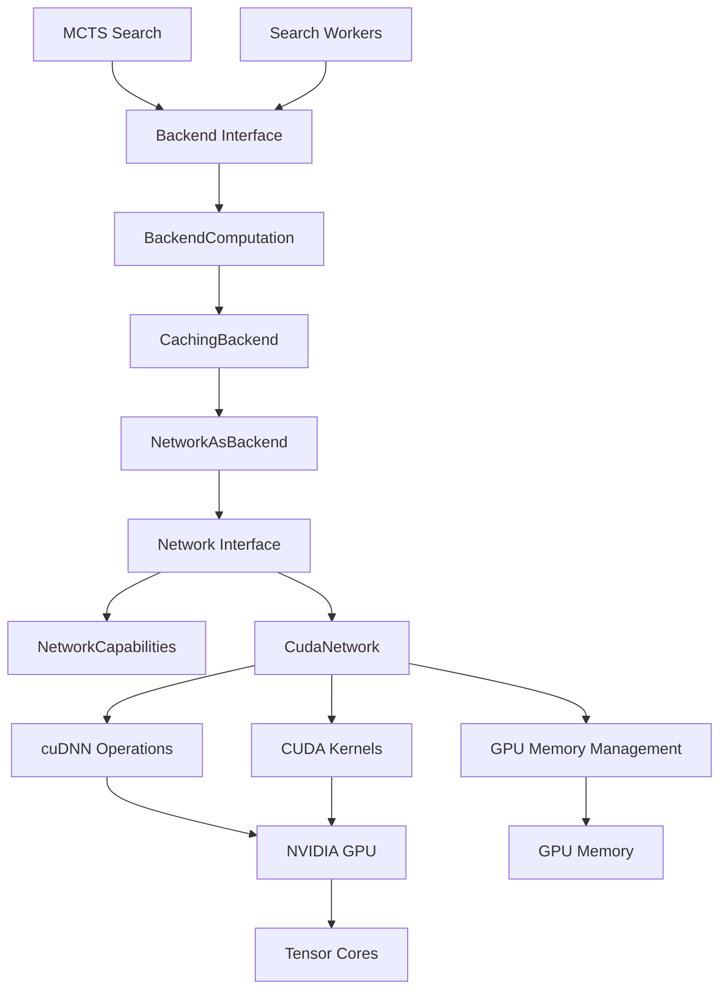
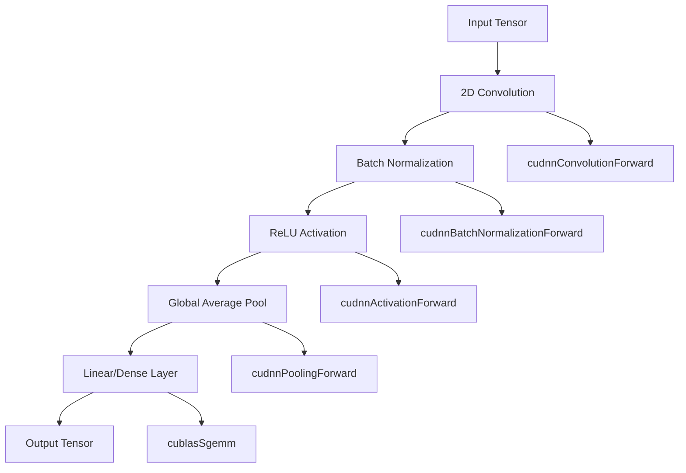
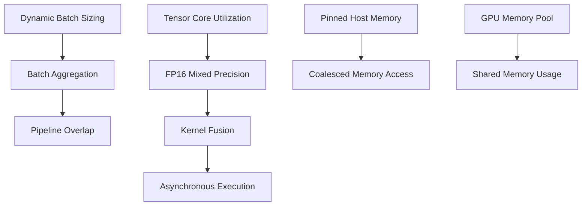
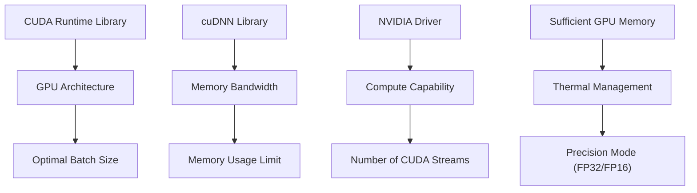

# CUDA and cuDNN Backend

Relevant source files

-   [.gitignore](https://github.com/LeelaChessZero/lc0/blob/b4e98c19/.gitignore)
-   [src/utils/transpose.h](https://github.com/LeelaChessZero/lc0/blob/b4e98c19/src/utils/transpose.h)

## Purpose and Scope

This document covers the CUDA and cuDNN backend implementation for neural network inference in Leela Chess Zero. The CUDA backend provides GPU acceleration on NVIDIA hardware using the CUDA runtime and cuDNN (CUDA Deep Neural Network) library for optimized tensor operations. This backend is one of several hardware-specific implementations in the neural network system architecture.

For information about the overall backend architecture and interface design, see [Network Interface and Backend Architecture](/LeelaChessZero/lc0/6.1-network-interface-and-backend-architecture). For details on other GPU backends like Metal or OpenCL, see the respective backend documentation. For neural network caching and performance optimization that applies across all backends, see [Memory Caching and Performance](/LeelaChessZero/lc0/6.6-memory-caching-and-performance).

## Architecture Overview

The CUDA backend integrates into lc0's modular neural network system through the standard `Network` interface, providing GPU-accelerated inference for NVIDIA hardware. The implementation leverages both CUDA for general GPU computation and cuDNN for specialized deep learning operations.

### CUDA Backend in System Context

Sources: [.gitignore11](https://github.com/LeelaChessZero/lc0/blob/b4e98c19/.gitignore#L11-L11) [src/utils/transpose.h21-25](https://github.com/LeelaChessZero/lc0/blob/b4e98c19/src/utils/transpose.h#L21-L25)

## CUDA Backend Components

The CUDA backend implementation consists of several key components that work together to provide efficient neural network inference on NVIDIA GPUs.

### Core Implementation Structure

```mermaid
flowchart TD
    CudaNetwork["CudaNetwork"]
    InitCuda["CUDA Initialization"]
    WeightLoader["Weights Loading"]
    ForwardPass["Forward Inference"]
    Convolution["Convolution Layers"]
    BatchNorm["Batch Normalization"]
    Activation["Activation Functions"]
    FullyConnected["Fully Connected"]
    DeviceMemory["Device Memory Allocation"]
    HostMemory["Host Memory Pinning"]
    MemoryPool["Memory Pool Management"]
    CopyOperations["Host-Device Transfers"]
    TensorRT["TensorRT Integration"]
    MixedPrecision["Mixed Precision (FP16)"]
    StreamManagement["CUDA Streams"]
    BatchOptimization["Batch Size Optimization"]

    CudaNetwork --> InitCuda
    CudaNetwork --> WeightLoader
    CudaNetwork --> ForwardPass
    ForwardPass --> Convolution
    ForwardPass --> BatchNorm
    ForwardPass --> Activation
    ForwardPass --> FullyConnected
    CudaNetwork --> DeviceMemory
    DeviceMemory --> HostMemory
    DeviceMemory --> MemoryPool
    DeviceMemory --> CopyOperations
    CudaNetwork --> TensorRT
    CudaNetwork --> MixedPrecision
    CudaNetwork --> StreamManagement
    CudaNetwork --> BatchOptimization
```

Sources: [.gitignore11](https://github.com/LeelaChessZero/lc0/blob/b4e98c19/.gitignore#L11-L11) [src/utils/transpose.h21-25](https://github.com/LeelaChessZero/lc0/blob/b4e98c19/src/utils/transpose.h#L21-L25)

## CUDA Runtime Integration

The CUDA backend manages GPU resources and execution through careful integration with the CUDA runtime API. This includes device selection, context management, and optimal resource utilization.

### GPU Resource Management

| Component | Purpose | Key Operations |
| --- | --- | --- |
| Device Selection | Choose optimal GPU | `cudaGetDeviceCount()`, `cudaSetDevice()` |
| Context Management | CUDA context lifecycle | Context creation, destruction, switching |
| Memory Allocation | GPU memory management | `cudaMalloc()`, `cudaFree()`, memory pools |
| Stream Management | Asynchronous execution | Stream creation, synchronization, overlap |
| Error Handling | CUDA error management | Error checking, recovery, diagnostics |

### cuDNN Library Integration

The CUDA backend leverages cuDNN for optimized deep learning operations. cuDNN provides highly tuned implementations of neural network primitives that significantly outperform naive CUDA implementations.

Sources: [src/utils/transpose.h21-25](https://github.com/LeelaChessZero/lc0/blob/b4e98c19/src/utils/transpose.h#L21-L25)

## Performance Optimizations

The CUDA backend implements several performance optimizations to maximize GPU utilization and minimize inference latency.

### Memory and Compute Optimizations

Sources: [src/utils/transpose.h40-65](https://github.com/LeelaChessZero/lc0/blob/b4e98c19/src/utils/transpose.h#L40-L65)

## Build System Integration

The CUDA backend requires specific build configuration to link against CUDA and cuDNN libraries. The build system handles CUDA toolkit detection, version compatibility, and architecture-specific optimizations.

### CUDA Build Dependencies

| Dependency | Purpose | Version Requirements |
| --- | --- | --- |
| CUDA Toolkit | Core CUDA runtime and compiler | CUDA 10.0+ |
| cuDNN | Deep learning primitives | cuDNN 7.0+ |
| NVIDIA Driver | GPU driver compatibility | Compatible with CUDA version |
| Compute Capability | GPU architecture support | SM 6.0+ recommended |

The build system automatically detects CUDA installation paths and configures compiler flags for optimal performance on the target GPU architecture.

### Deployment Considerations

Sources: [.gitignore11](https://github.com/LeelaChessZero/lc0/blob/b4e98c19/.gitignore#L11-L11) [src/utils/transpose.h21-25](https://github.com/LeelaChessZero/lc0/blob/b4e98c19/src/utils/transpose.h#L21-L25)
