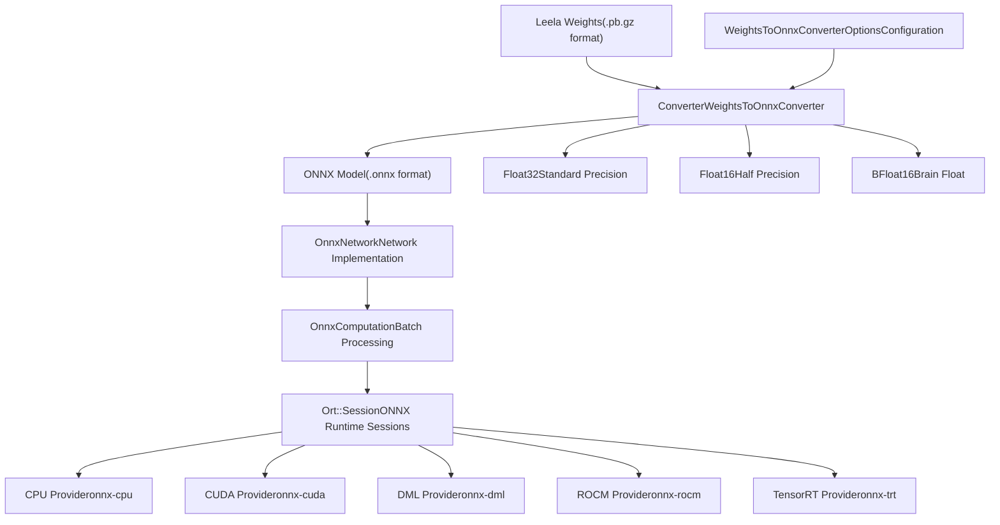
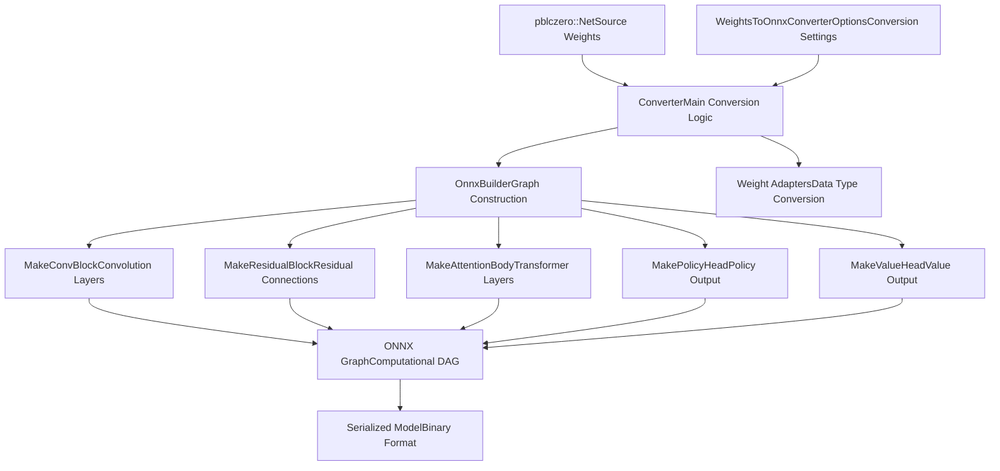
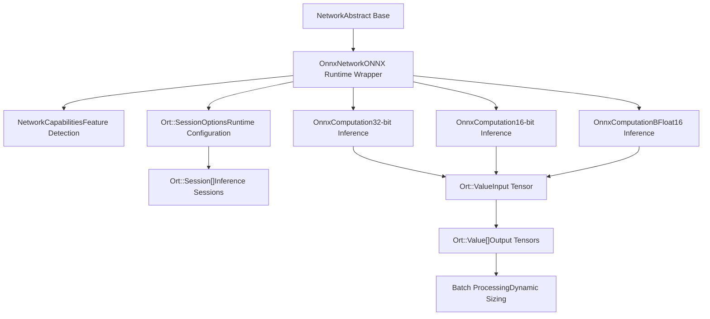
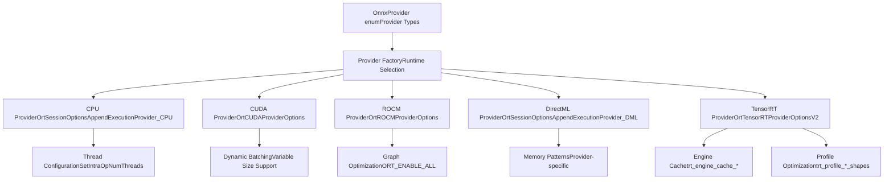
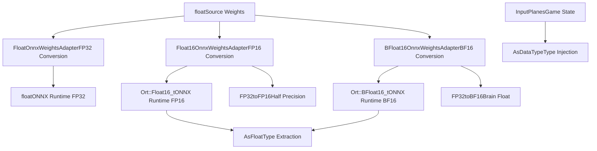
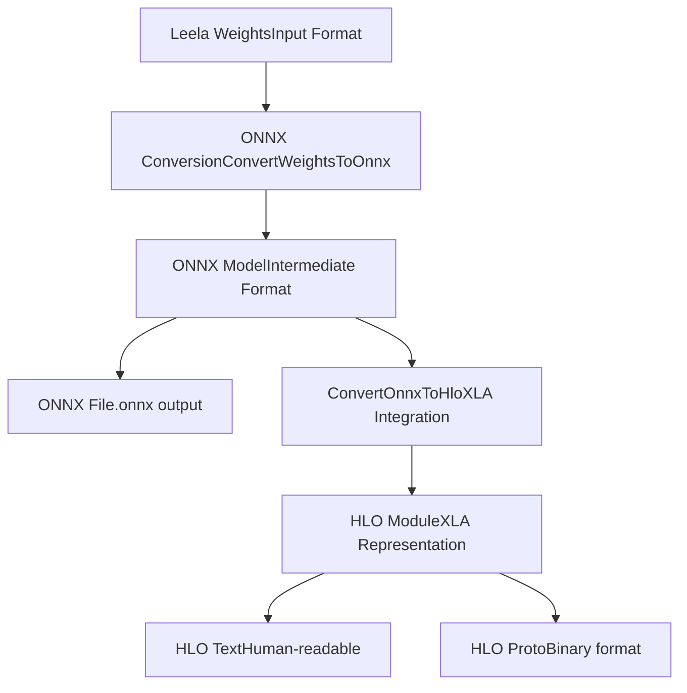

# ONNX Integration

Relevant source files

-   [src/neural/backends/network\_onnx.cc](https://github.com/LeelaChessZero/lc0/blob/b4e98c19/src/neural/backends/network_onnx.cc)
-   [src/neural/onnx/builder.cc](https://github.com/LeelaChessZero/lc0/blob/b4e98c19/src/neural/onnx/builder.cc)
-   [src/neural/onnx/builder.h](https://github.com/LeelaChessZero/lc0/blob/b4e98c19/src/neural/onnx/builder.h)
-   [src/neural/onnx/converter.cc](https://github.com/LeelaChessZero/lc0/blob/b4e98c19/src/neural/onnx/converter.cc)
-   [src/neural/onnx/converter.h](https://github.com/LeelaChessZero/lc0/blob/b4e98c19/src/neural/onnx/converter.h)
-   [src/tools/leela2onnx.cc](https://github.com/LeelaChessZero/lc0/blob/b4e98c19/src/tools/leela2onnx.cc)
-   [src/utils/bf16\_utils.h](https://github.com/LeelaChessZero/lc0/blob/b4e98c19/src/utils/bf16_utils.h)

The ONNX integration system provides cross-platform neural network inference capabilities for Leela Chess Zero by converting native Leela weight formats to ONNX models and executing them using ONNX Runtime. This system supports multiple hardware acceleration providers and data precision formats, enabling deployment across diverse computing environments from CPUs to specialized AI accelerators.

For information about other neural network backends, see [Network Interface and Backend Architecture](/LeelaChessZero/lc0/6.1-network-interface-and-backend-architecture). For details about weight loading and management, see [Weights Loading and Management](/LeelaChessZero/lc0/6.2-weights-loading-and-management).

## ONNX System Architecture

The ONNX integration consists of two primary subsystems: the conversion pipeline that transforms Leela weights into ONNX format, and the runtime backend that executes ONNX models using various hardware providers.

### ONNX Integration Overview

Sources: [src/neural/onnx/converter.h37-56](https://github.com/LeelaChessZero/lc0/blob/b4e98c19/src/neural/onnx/converter.h#L37-L56) [src/neural/backends/network\_onnx.cc86-137](https://github.com/LeelaChessZero/lc0/blob/b4e98c19/src/neural/backends/network_onnx.cc#L86-L137) [src/neural/backends/network\_onnx.cc59-60](https://github.com/LeelaChessZero/lc0/blob/b4e98c19/src/neural/backends/network_onnx.cc#L59-L60)

## Weight Conversion System

The conversion system transforms Leela's native protobuf weight format into ONNX computational graphs through the `Converter` class and associated builder utilities.

### Conversion Process Flow

Sources: [src/neural/onnx/converter.cc53-182](https://github.com/LeelaChessZero/lc0/blob/b4e98c19/src/neural/onnx/converter.cc#L53-L182) [src/neural/onnx/builder.cc39-58](https://github.com/LeelaChessZero/lc0/blob/b4e98c19/src/neural/onnx/builder.cc#L39-L58) [src/neural/onnx/converter.cc69](https://github.com/LeelaChessZero/lc0/blob/b4e98c19/src/neural/onnx/converter.cc#L69-L69)

### Conversion Configuration Options

The `WeightsToOnnxConverterOptions` struct provides extensive configuration for the conversion process:

| Option | Type | Purpose |
| --- | --- | --- |
| `data_type` | `DataType` | Precision format (Float32/Float16/BFloat16) |
| `opset` | `int` | ONNX operator set version (7-22) |
| `ir` | `int` | ONNX IR version (-1 for auto) |
| `batch_size` | `int` | Fixed batch size (-1 for dynamic) |
| `alt_mish` | `bool` | Alternative Mish activation implementation |
| `alt_layernorm` | `bool` | Alternative LayerNormalization implementation |
| `policy_head` | `string` | Policy head variant ("vanilla", "optimistic", "soft") |
| `value_head` | `string` | Value head variant ("winner", "q", "st") |

Sources: [src/neural/onnx/converter.h38-56](https://github.com/LeelaChessZero/lc0/blob/b4e98c19/src/neural/onnx/converter.h#L38-L56) [src/tools/leela2onnx.cc146-161](https://github.com/LeelaChessZero/lc0/blob/b4e98c19/src/tools/leela2onnx.cc#L146-L161)

## ONNX Runtime Backend

The runtime backend implements the `Network` interface using ONNX Runtime, providing hardware-accelerated inference across multiple providers.

### Runtime Architecture

Sources: [src/neural/backends/network\_onnx.cc86-137](https://github.com/LeelaChessZero/lc0/blob/b4e98c19/src/neural/backends/network_onnx.cc#L86-L137) [src/neural/backends/network\_onnx.cc63-84](https://github.com/LeelaChessZero/lc0/blob/b4e98c19/src/neural/backends/network_onnx.cc#L63-L84) [src/neural/backends/network\_onnx.cc139-162](https://github.com/LeelaChessZero/lc0/blob/b4e98c19/src/neural/backends/network_onnx.cc#L139-L162)

## Hardware Provider Support

The ONNX backend supports multiple execution providers for different hardware platforms, each with specific optimizations and capabilities.

### Provider Architecture

Sources: [src/neural/backends/network\_onnx.cc301-407](https://github.com/LeelaChessZero/lc0/blob/b4e98c19/src/neural/backends/network_onnx.cc#L301-L407) [src/neural/backends/network\_onnx.cc315-325](https://github.com/LeelaChessZero/lc0/blob/b4e98c19/src/neural/backends/network_onnx.cc#L315-L325) [src/neural/backends/network\_onnx.cc326-381](https://github.com/LeelaChessZero/lc0/blob/b4e98c19/src/neural/backends/network_onnx.cc#L326-L381)

### Provider Configuration Details

| Provider | Device Support | Threading | Batch Mode | Cache Support |
| --- | --- | --- | --- | --- |
| `onnx-cpu` | CPU | Multi-threaded | Dynamic | Memory only |
| `onnx-cuda` | NVIDIA GPU | GPU streams | Dynamic | Memory only |
| `onnx-dml` | DirectX GPUs | Sequential | Fixed (default 16) | Memory only |
| `onnx-rocm` | AMD GPU | Sequential | Dynamic | Memory only |
| `onnx-trt` | NVIDIA GPU | Sequential | Dynamic/Fixed | Engine + Timing |

Sources: [src/neural/backends/network\_onnx.cc516-523](https://github.com/LeelaChessZero/lc0/blob/b4e98c19/src/neural/backends/network_onnx.cc#L516-L523) [src/neural/backends/network\_onnx.cc420-424](https://github.com/LeelaChessZero/lc0/blob/b4e98c19/src/neural/backends/network_onnx.cc#L420-L424)

## Data Type and Precision Support

The ONNX integration supports multiple floating-point precisions with automatic conversion utilities and precision-specific optimizations.

### Data Type Conversion Pipeline

Sources: [src/neural/onnx/converter.cc197-227](https://github.com/LeelaChessZero/lc0/blob/b4e98c19/src/neural/onnx/converter.cc#L197-L227) [src/neural/backends/network\_onnx.cc173-183](https://github.com/LeelaChessZero/lc0/blob/b4e98c19/src/neural/backends/network_onnx.cc#L173-L183) [src/neural/backends/network\_onnx.cc216-224](https://github.com/LeelaChessZero/lc0/blob/b4e98c19/src/neural/backends/network_onnx.cc#L216-L224) [src/utils/bf16\_utils.h30-47](https://github.com/LeelaChessZero/lc0/blob/b4e98c19/src/utils/bf16_utils.h#L30-L47)

## Command-Line Conversion Tool

The `leela2onnx` tool provides a complete interface for converting Leela weights to ONNX format with extensive configuration options.

### Tool Configuration Matrix

| Parameter | Values | Default | Purpose |
| --- | --- | --- | --- |
| `--onnx-opset` | 7-22 | 17 | ONNX operator set version |
| `--onnx-data-type` | f32/f16/bf16 | f32 | Model precision |
| `--onnx-batch-size` | \-1 to 2048 | \-1 | Fixed vs dynamic batching |
| `--policy-head` | vanilla/optimistic/soft | vanilla | Policy head variant |
| `--value-head` | winner/q/st | winner | Value head variant |
| `--onnx2pytorch` | true/false | false | PyTorch compatibility mode |

Sources: [src/tools/leela2onnx.cc95-116](https://github.com/LeelaChessZero/lc0/blob/b4e98c19/src/tools/leela2onnx.cc#L95-L116) [src/tools/leela2onnx.cc146-161](https://github.com/LeelaChessZero/lc0/blob/b4e98c19/src/tools/leela2onnx.cc#L146-L161)

### Integration with XLA Pipeline

The conversion tool also supports generating XLA HLO representations for specialized accelerators:

Sources: [src/tools/leela2onnx.cc168-190](https://github.com/LeelaChessZero/lc0/blob/b4e98c19/src/tools/leela2onnx.cc#L168-L190) [src/neural/xla/onnx2hlo.h](https://github.com/LeelaChessZero/lc0/blob/b4e98c19/src/neural/xla/onnx2hlo.h)
