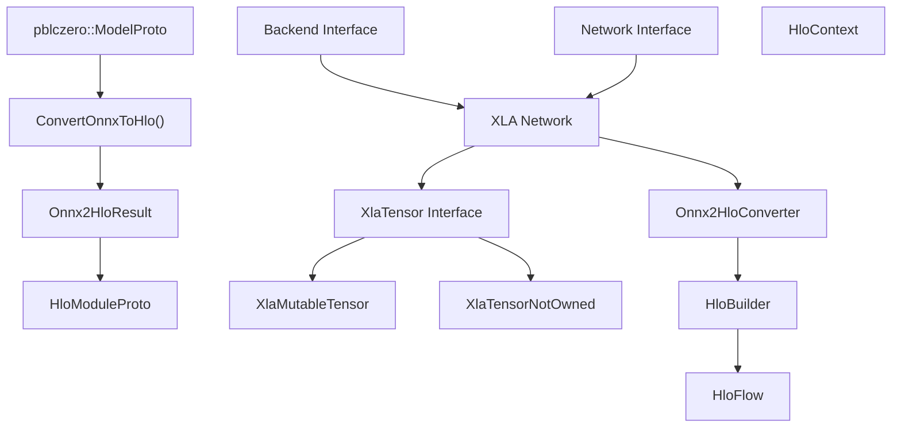
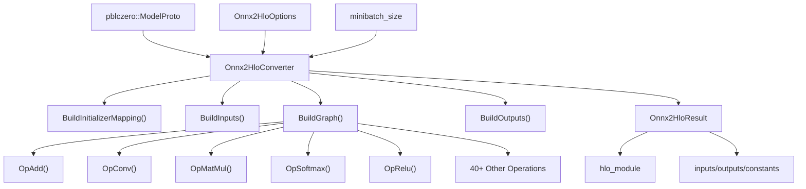
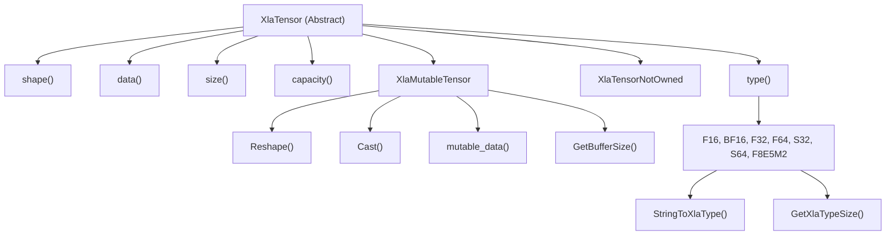
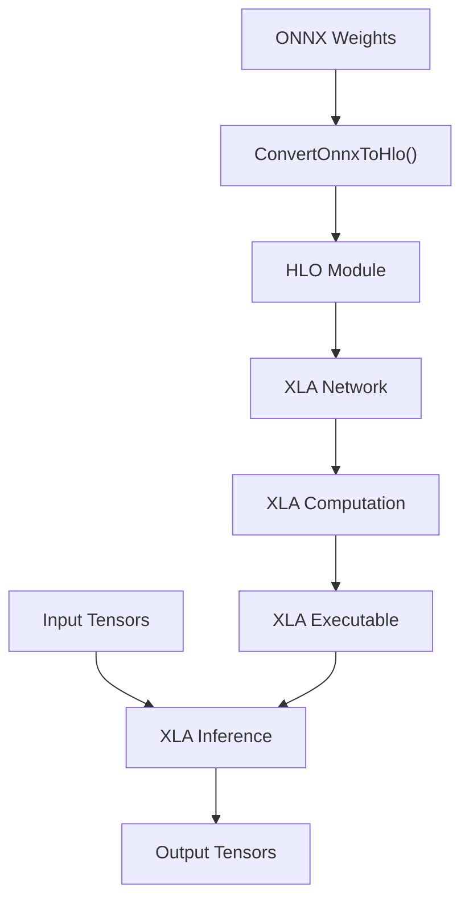

# XLA and HLO Support

Relevant source files

-   [src/neural/xla/onnx2hlo.cc](https://github.com/LeelaChessZero/lc0/blob/b4e98c19/src/neural/xla/onnx2hlo.cc)
-   [src/neural/xla/onnx2hlo.h](https://github.com/LeelaChessZero/lc0/blob/b4e98c19/src/neural/xla/onnx2hlo.h)
-   [src/neural/xla/xla\_tensor.cc](https://github.com/LeelaChessZero/lc0/blob/b4e98c19/src/neural/xla/xla_tensor.cc)
-   [src/neural/xla/xla\_tensor.h](https://github.com/LeelaChessZero/lc0/blob/b4e98c19/src/neural/xla/xla_tensor.h)

This document covers the XLA (Accelerated Linear Algebra) backend implementation in Leela Chess Zero, which provides neural network inference through Google's XLA compiler infrastructure. The XLA backend converts ONNX models to HLO (High Level Operations) format for optimized execution on various hardware platforms.

For general neural network backend architecture, see [Network Interface and Backend Architecture](/LeelaChessZero/lc0/6.1-network-interface-and-backend-architecture). For ONNX model support and conversion utilities, see [ONNX Integration](/LeelaChessZero/lc0/6.4-onnx-integration).

## Architecture Overview

The XLA support system consists of three main components: ONNX-to-HLO conversion, XLA tensor management, and HLO operation mapping. The system integrates with the broader neural network backend architecture to provide an alternative inference path optimized by XLA's compilation pipeline.

**XLA Backend System Architecture**

Sources: [src/neural/xla/onnx2hlo.h40-80](https://github.com/LeelaChessZero/lc0/blob/b4e98c19/src/neural/xla/onnx2hlo.h#L40-L80) [src/neural/xla/xla\_tensor.h65-139](https://github.com/LeelaChessZero/lc0/blob/b4e98c19/src/neural/xla/xla_tensor.h#L65-L139)

## ONNX to HLO Conversion System

The conversion system transforms ONNX neural network models into HLO format suitable for XLA compilation. The `Onnx2HloConverter` class handles the complex mapping between ONNX operations and HLO instructions.

**ONNX to HLO Conversion Flow**

Sources: [src/neural/xla/onnx2hlo.cc464-538](https://github.com/LeelaChessZero/lc0/blob/b4e98c19/src/neural/xla/onnx2hlo.cc#L464-L538) [src/neural/xla/onnx2hlo.h55-68](https://github.com/LeelaChessZero/lc0/blob/b4e98c19/src/neural/xla/onnx2hlo.h#L55-L68)

### Supported ONNX Operations

The converter supports a comprehensive set of ONNX operations mapped to HLO equivalents. Each operation is implemented as a method in the `Onnx2HloConverter` class:

| ONNX Operation | HLO Mapping | Implementation Method |
| --- | --- | --- |
| Add | Element-wise addition | `OpAdd()` |
| BatchNormalization | Normalization with scale/bias | `OpBatchNormalization()` |
| Conv | Convolution with padding | `OpConv()` |
| MatMul | Matrix multiplication | `OpMatMul()` |
| Relu | Maximum with zero | `OpRelu()` |
| Softmax | Exponential normalization | `OpSoftmax()` |
| Reshape | Tensor reshaping | `OpReshape()` |
| Transpose | Dimension permutation | `OpTranspose()` |

Sources: [src/neural/xla/onnx2hlo.cc467-507](https://github.com/LeelaChessZero/lc0/blob/b4e98c19/src/neural/xla/onnx2hlo.cc#L467-L507) [src/neural/xla/onnx2hlo.cc773-1690](https://github.com/LeelaChessZero/lc0/blob/b4e98c19/src/neural/xla/onnx2hlo.cc#L773-L1690)

### Conversion Options and Configuration

The conversion process is configured through `Onnx2HloOptions`:

-   **`max_inline_constant_size`**: Constants larger than this size become parameters instead of being inlined
-   **`io_type`**: Optional type enforcement for input/output tensors
-   **`debugging_allow_partial_result`**: Allows partial conversion results for debugging
-   **`outputs_override`**: Custom output node selection

Sources: [src/neural/xla/onnx2hlo.h40-53](https://github.com/LeelaChessZero/lc0/blob/b4e98c19/src/neural/xla/onnx2hlo.h#L40-L53)

## XLA Tensor System

The XLA tensor system provides abstractions for managing tensor data in XLA-compatible formats. The system supports both owned and non-owned tensor variants for different use cases.

**XLA Tensor Class Hierarchy**

Sources: [src/neural/xla/xla\_tensor.h65-139](https://github.com/LeelaChessZero/lc0/blob/b4e98c19/src/neural/xla/xla_tensor.h#L65-L139) [src/neural/xla/xla\_tensor.cc95-156](https://github.com/LeelaChessZero/lc0/blob/b4e98c19/src/neural/xla/xla_tensor.cc#L95-L156)

### Tensor Type Conversion

The `XlaMutableTensor::Cast()` method provides type conversion between different XLA numeric types. Currently supported conversions include:

-   **From F32**: F16, BF16, F8E5M2 using saturated conversion
-   **To F32**: F16, BF16, F8E5M2 with precision expansion

The conversion process uses specialized utility functions from the `utils/` directory for handling different floating-point formats.

Sources: [src/neural/xla/xla\_tensor.cc95-156](https://github.com/LeelaChessZero/lc0/blob/b4e98c19/src/neural/xla/xla_tensor.cc#L95-L156) [src/neural/xla/xla\_tensor.h43-63](https://github.com/LeelaChessZero/lc0/blob/b4e98c19/src/neural/xla/xla_tensor.h#L43-L63)

### Memory Management

`XlaMutableTensor` implements capacity-based memory management to support dynamic reshaping without reallocation:

-   **Capacity tracking**: Maintains buffer size separate from logical tensor size
-   **Reshape operations**: Reuses existing buffer when new size fits within capacity
-   **Type casting**: Allocates new buffer only when necessary based on type size requirements

Sources: [src/neural/xla/xla\_tensor.cc75-83](https://github.com/LeelaChessZero/lc0/blob/b4e98c19/src/neural/xla/xla_tensor.cc#L75-L83) [src/neural/xla/xla\_tensor.h125-129](https://github.com/LeelaChessZero/lc0/blob/b4e98c19/src/neural/xla/xla_tensor.h#L125-L129)

## HLO Operations and Constant Folding

The conversion system includes constant folding optimizations for operations that can be computed at compile-time. This reduces the complexity of the generated HLO and improves runtime performance.

**Constant Folding Operations**

```mermaid
flowchart TD
    CanConvertConstant["CanConvertConstant()"]
    OnnxTypeToXlaType["OnnxTypeToXlaType()"]
    OnnxTensorToXlaLiteral["OnnxTensorToXlaLiteral()"]
    ConstOpConvert["ConstOpConvert()"]
    ConstOpConcat["ConstOpConcat()"]
    ConstOpSlice["ConstOpSlice()"]
    ConstOpGather["ConstOpGather()"]
    ConstOpMul["ConstOpMul()"]
    ConstOpMax["ConstOpMax()"]
    ConstOpReduceProd["ConstOpReduceProd()"]
    ConstReshape["ConstReshape()"]
    LiteralToVector["LiteralToVector()"]
    LiteralOutInOp["LiteralOutInOp()"]
    LiteralOutInInOp["LiteralOutInInOp()"]
    FetchConstForType["FetchConstForType()"]
    FetchMutableForType["FetchMutableForType()"]

    ConstOpConvert --> LiteralOutInOp
    ConstOpConcat --> LiteralOutInOp
    ConstOpSlice --> LiteralOutInOp
    ConstOpGather --> LiteralOutInInOp
    ConstOpMul --> LiteralOutInInOp
    ConstOpMax --> LiteralOutInInOp
    ConstOpReduceProd --> LiteralOutInOp
    LiteralOutInOp --> FetchConstForType
    LiteralOutInOp --> FetchMutableForType
    LiteralOutInInOp --> FetchConstForType
    LiteralOutInInOp --> FetchMutableForType
    CanConvertConstant --> OnnxTypeToXlaType
    OnnxTensorToXlaLiteral --> OnnxTypeToXlaType
```

Sources: [src/neural/xla/onnx2hlo.cc47-462](https://github.com/LeelaChessZero/lc0/blob/b4e98c19/src/neural/xla/onnx2hlo.cc#L47-L462) [src/neural/xla/onnx2hlo.cc312-357](https://github.com/LeelaChessZero/lc0/blob/b4e98c19/src/neural/xla/onnx2hlo.cc#L312-L357)

### Constant Folding Strategy

The system applies constant folding when all inputs to an operation are compile-time constants:

1.  **Detection**: `AllInputsConstant()` checks if all node inputs are constants or initializers
2.  **Evaluation**: Constant operations are computed using template functions for type safety
3.  **Result**: Computed constant replaces the operation in the HLO graph

This optimization is particularly effective for shape operations, small arithmetic computations, and tensor manipulation operations that don't depend on runtime inputs.

Sources: [src/neural/xla/onnx2hlo.cc660-672](https://github.com/LeelaChessZero/lc0/blob/b4e98c19/src/neural/xla/onnx2hlo.cc#L660-L672) [src/neural/xla/onnx2hlo.cc997-1004](https://github.com/LeelaChessZero/lc0/blob/b4e98c19/src/neural/xla/onnx2hlo.cc#L997-L1004)

## Integration with Neural Network Backend

The XLA system integrates with the broader neural network backend architecture through the standard `Network` and `Backend` interfaces. The conversion from ONNX to HLO happens during model loading, with the resulting HLO module used for all subsequent inference operations.

**Backend Integration Flow**

Sources: [src/neural/xla/onnx2hlo.h70-78](https://github.com/LeelaChessZero/lc0/blob/b4e98c19/src/neural/xla/onnx2hlo.h#L70-L78) [src/neural/xla/onnx2hlo.cc510-538](https://github.com/LeelaChessZero/lc0/blob/b4e98c19/src/neural/xla/onnx2hlo.cc#L510-L538)

The XLA backend provides optimized inference through Google's XLA compiler, which can target various hardware platforms including CPUs, GPUs, and TPUs. The HLO intermediate representation enables advanced optimizations like operator fusion, memory layout optimization, and platform-specific code generation.
