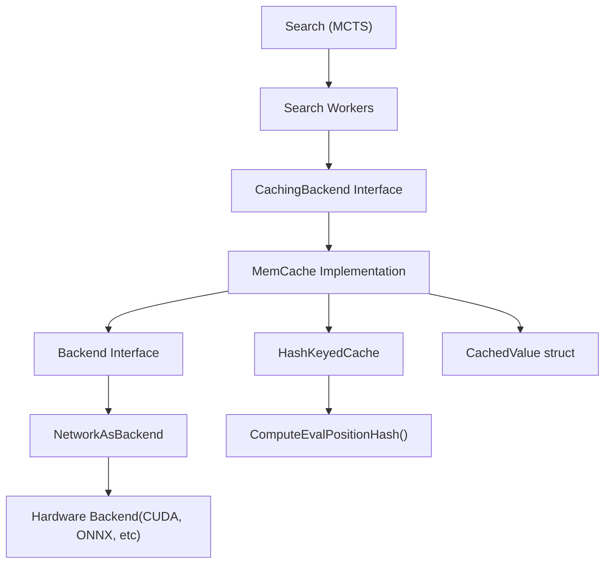
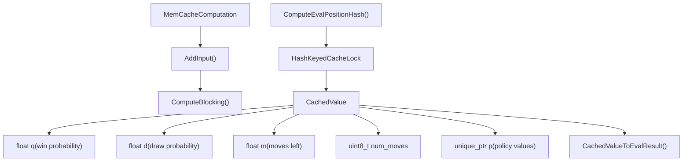
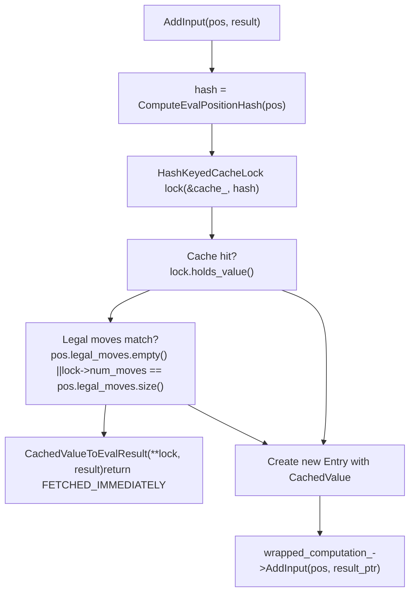
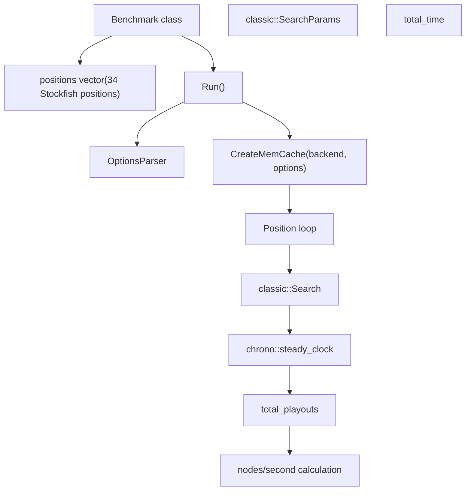
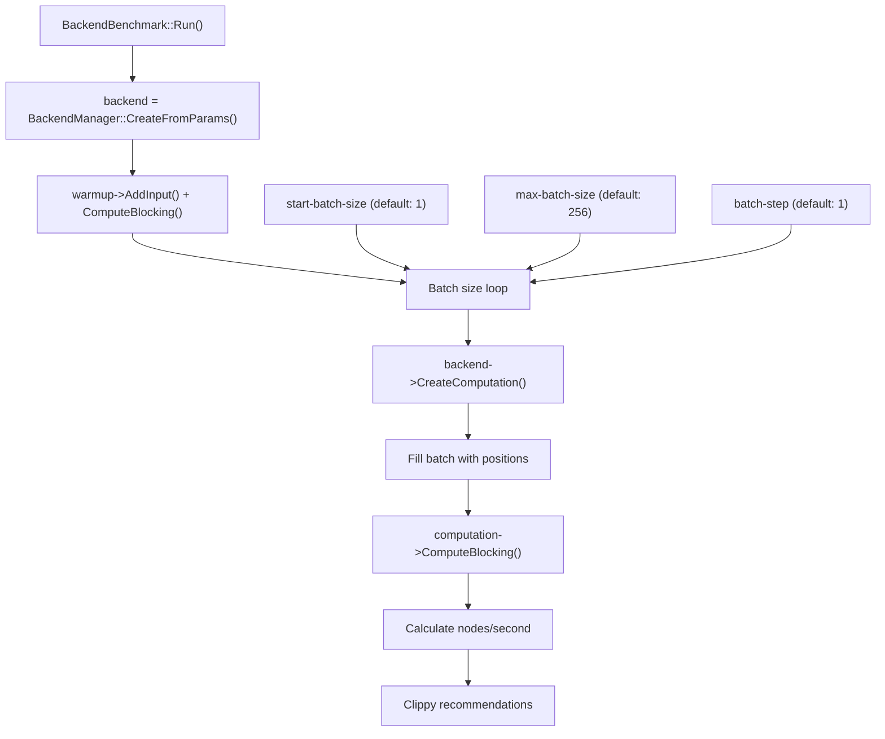
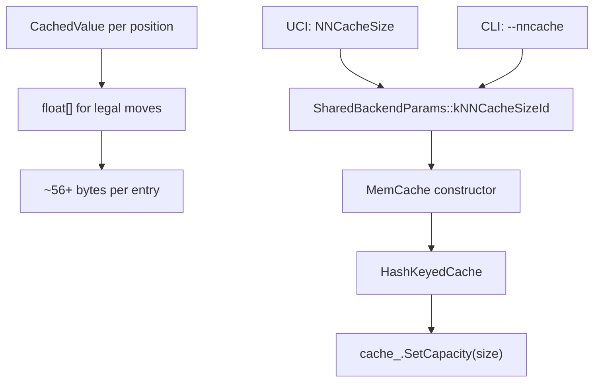

# Memory Caching and Performance

Relevant source files

-   [src/neural/backend.cc](https://github.com/LeelaChessZero/lc0/blob/b4e98c19/src/neural/backend.cc)
-   [src/neural/backend.h](https://github.com/LeelaChessZero/lc0/blob/b4e98c19/src/neural/backend.h)
-   [src/neural/batchsplit.cc](https://github.com/LeelaChessZero/lc0/blob/b4e98c19/src/neural/batchsplit.cc)
-   [src/neural/memcache.cc](https://github.com/LeelaChessZero/lc0/blob/b4e98c19/src/neural/memcache.cc)
-   [src/neural/memcache.h](https://github.com/LeelaChessZero/lc0/blob/b4e98c19/src/neural/memcache.h)
-   [src/neural/shared\_params.cc](https://github.com/LeelaChessZero/lc0/blob/b4e98c19/src/neural/shared_params.cc)
-   [src/neural/shared\_params.h](https://github.com/LeelaChessZero/lc0/blob/b4e98c19/src/neural/shared_params.h)
-   [src/neural/wrapper.cc](https://github.com/LeelaChessZero/lc0/blob/b4e98c19/src/neural/wrapper.cc)
-   [src/tools/backendbench.cc](https://github.com/LeelaChessZero/lc0/blob/b4e98c19/src/tools/backendbench.cc)
-   [src/tools/benchmark.cc](https://github.com/LeelaChessZero/lc0/blob/b4e98c19/src/tools/benchmark.cc)
-   [src/tools/benchmark.h](https://github.com/LeelaChessZero/lc0/blob/b4e98c19/src/tools/benchmark.h)

This document covers the neural network evaluation caching system and performance measurement tools in Leela Chess Zero. The memory cache significantly improves search performance by avoiding redundant neural network evaluations, while the benchmarking tools help optimize backend configuration and measure system performance.

For information about the underlying backend architecture that supports caching, see [Network Interface and Backend Architecture](/LeelaChessZero/lc0/6.1-network-interface-and-backend-architecture). For broader performance testing beyond neural networks, see [Benchmarking and Performance Testing](/LeelaChessZero/lc0/8.3-benchmarking-and-performance-testing).

## Neural Network Evaluation Caching

### Cache Architecture Overview

The memory caching system wraps neural network backends to provide transparent evaluation caching. When a position is evaluated, the result is stored in memory and retrieved on subsequent requests for the same position.

Sources: [src/neural/memcache.cc1-193](https://github.com/LeelaChessZero/lc0/blob/b4e98c19/src/neural/memcache.cc#L1-L193) [src/neural/memcache.h1-47](https://github.com/LeelaChessZero/lc0/blob/b4e98c19/src/neural/memcache.h#L1-L47) [src/neural/backend.h1-135](https://github.com/LeelaChessZero/lc0/blob/b4e98c19/src/neural/backend.h#L1-L135)

### Cache Implementation Details

The `MemCache` class implements the caching functionality by wrapping an existing backend and intercepting evaluation requests.

Sources: [src/neural/memcache.cc45-51](https://github.com/LeelaChessZero/lc0/blob/b4e98c19/src/neural/memcache.cc#L45-L51) [src/neural/memcache.cc41-43](https://github.com/LeelaChessZero/lc0/blob/b4e98c19/src/neural/memcache.cc#L41-L43) [src/neural/memcache.cc53-58](https://github.com/LeelaChessZero/lc0/blob/b4e98c19/src/neural/memcache.cc#L53-L58)

#### Position Hashing Strategy

The cache uses position hashing to identify equivalent positions:

| Component | Implementation | Location |
| --- | --- | --- |
| Hash Function | `ComputeEvalPositionHash()` | [src/neural/memcache.cc41-43](https://github.com/LeelaChessZero/lc0/blob/b4e98c19/src/neural/memcache.cc#L41-L43) |
| Hash Source | `pos.pos.back().Hash()` | [src/neural/memcache.cc42](https://github.com/LeelaChessZero/lc0/blob/b4e98c19/src/neural/memcache.cc#L42-L42) |
| Cache Key | 64-bit position hash | [src/neural/memcache.cc115-128](https://github.com/LeelaChessZero/lc0/blob/b4e98c19/src/neural/memcache.cc#L115-L128) |
| Collision Handling | Legal move count validation | [src/neural/memcache.cc122-124](https://github.com/LeelaChessZero/lc0/blob/b4e98c19/src/neural/memcache.cc#L122-L124) |

The current implementation uses only the current position hash, ignoring repetition history. This is noted as a potential area for improvement in the codebase comments.

Sources: [src/neural/memcache.cc38-43](https://github.com/LeelaChessZero/lc0/blob/b4e98c19/src/neural/memcache.cc#L38-L43)

#### Cache Hit and Miss Handling

The `MemCacheComputation::AddInput()` method implements the cache lookup logic:

Sources: [src/neural/memcache.cc112-140](https://github.com/LeelaChessZero/lc0/blob/b4e98c19/src/neural/memcache.cc#L112-L140)

## Performance Measurement Tools

### Search Benchmarking

The `Benchmark` class in [src/tools/benchmark.cc](https://github.com/LeelaChessZero/lc0/blob/b4e98c19/src/tools/benchmark.cc) provides comprehensive search performance testing using predefined chess positions.

Sources: [src/tools/benchmark.cc53-147](https://github.com/LeelaChessZero/lc0/blob/b4e98c19/src/tools/benchmark.cc#L53-L147) [src/tools/benchmark.h36-83](https://github.com/LeelaChessZero/lc0/blob/b4e98c19/src/tools/benchmark.h#L36-L83)

#### Benchmark Configuration Options

| Option | Purpose | Default | Range |
| --- | --- | --- | --- |
| `threads` | CPU worker threads | 2 | 1-128 |
| `nodes` | Node limit per position | \-1 (disabled) | \-1 to 999999999 |
| `movetime` | Time limit in milliseconds | 10000/500 | \-1 to 999999999 |
| `num-positions` | Number of test positions | 34/10 | 1-34 |
| `nncache` | Cache size | 200000 | 0 to 999999999 |

Sources: [src/tools/benchmark.cc41-69](https://github.com/LeelaChessZero/lc0/blob/b4e98c19/src/tools/benchmark.cc#L41-L69)

### Backend Benchmarking

The `BackendBenchmark` class focuses specifically on neural network backend throughput testing.

Sources: [src/tools/backendbench.cc78-186](https://github.com/LeelaChessZero/lc0/blob/b4e98c19/src/tools/backendbench.cc#L78-L186)

#### Clippy Performance Assistant

The backend benchmark includes an optional "Clippy" feature that provides batch size recommendations based on performance measurements:

| Time Control | Calculation | Recommendation Focus |
| --- | --- | --- |
| Bullet (1s/move) | `nps_ingame3 = (nps + best_nps3)^1.085 / 2` | Low latency |
| Rapid (15s/move) | `nps_ingame2 = (nps + best_nps2)^1.085 / 2` | Balanced throughput |
| Tournament (3min/move) | `nps_ingame = (nps + best_nps)^1.085 / 2` | Maximum throughput |

Sources: [src/tools/backendbench.cc139-182](https://github.com/LeelaChessZero/lc0/blob/b4e98c19/src/tools/backendbench.cc#L139-L182)

## Cache Configuration and Tuning

### Cache Size Configuration

The neural network cache size is controlled by the `nncache` parameter:

Sources: [src/neural/shared\_params.cc63-66](https://github.com/LeelaChessZero/lc0/blob/b4e98c19/src/neural/shared_params.cc#L63-L66) [src/neural/memcache.cc62-65](https://github.com/LeelaChessZero/lc0/blob/b4e98c19/src/neural/memcache.cc#L62-L65) [src/neural/memcache.cc91](https://github.com/LeelaChessZero/lc0/blob/b4e98c19/src/neural/memcache.cc#L91-L91)

### Cache Performance Characteristics

| Aspect | Implementation Detail | Performance Impact |
| --- | --- | --- |
| Cache Type | Hash-keyed with FIFO eviction | O(1) lookup, predictable memory usage |
| Thread Safety | `HashKeyedCacheLock` | Thread-safe concurrent access |
| Memory Efficiency | Variable-size policy arrays | Efficient storage for different position types |
| Hash Collision | Legal move count validation | Prevents incorrect cache hits |

Sources: [src/neural/memcache.cc117-128](https://github.com/LeelaChessZero/lc0/blob/b4e98c19/src/neural/memcache.cc#L117-L128) [src/utils/cache.h](https://github.com/LeelaChessZero/lc0/blob/b4e98c19/src/utils/cache.h)

### Performance Optimization Guidelines

Based on the benchmark results and cache implementation:

1.  **Cache Size**: Set `nncache` to balance memory usage with hit rate
2.  **Batch Size**: Use backend benchmark to find optimal batch size for hardware
3.  **Search Threads**: Match backend's `suggested_num_search_threads`
4.  **Memory Constraints**: Each cache entry requires ~56+ bytes plus policy array

The cache clearing behavior ensures consistency when backend configuration changes, maintaining correctness while preserving performance benefits.

Sources: [src/neural/memcache.cc75-85](https://github.com/LeelaChessZero/lc0/blob/b4e98c19/src/neural/memcache.cc#L75-L85) [src/neural/backend.h42-50](https://github.com/LeelaChessZero/lc0/blob/b4e98c19/src/neural/backend.h#L42-L50)
