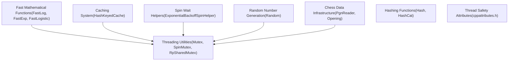
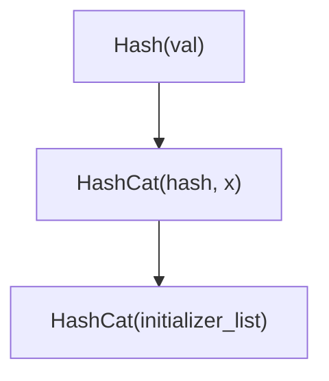
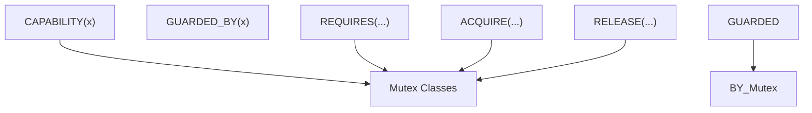
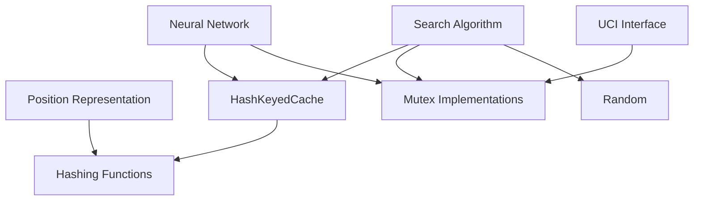

# Utilities and Infrastructure

Relevant source files

-   [src/chess/pgn.h](https://github.com/LeelaChessZero/lc0/blob/b4e98c19/src/chess/pgn.h)
-   [src/utils/cppattributes.h](https://github.com/LeelaChessZero/lc0/blob/b4e98c19/src/utils/cppattributes.h)
-   [src/utils/fastmath.h](https://github.com/LeelaChessZero/lc0/blob/b4e98c19/src/utils/fastmath.h)
-   [src/utils/mutex.h](https://github.com/LeelaChessZero/lc0/blob/b4e98c19/src/utils/mutex.h)
-   [src/utils/random.cc](https://github.com/LeelaChessZero/lc0/blob/b4e98c19/src/utils/random.cc)
-   [src/utils/random.h](https://github.com/LeelaChessZero/lc0/blob/b4e98c19/src/utils/random.h)
-   [src/utils/spinhelper.h](https://github.com/LeelaChessZero/lc0/blob/b4e98c19/src/utils/spinhelper.h)

This page documents the core utilities, mathematical functions, threading primitives, and infrastructure components that provide foundational support across the Leela Chess Zero codebase. These include fast mathematical approximations, thread synchronization primitives, caching mechanisms, random number generation, and chess data handling infrastructure. For information about specific subsystems like neural network components, see [Neural Network System](/LeelaChessZero/lc0/6-neural-network-system), or for search algorithm details, see [Search Algorithm](/LeelaChessZero/lc0/5-search-algorithm).

## Overview

The Leela Chess Zero (lc0) utilities and infrastructure provide foundational support for the chess engine's core functionality, with emphasis on performance-critical mathematical functions, thread safety, and efficient resource management. These components are used throughout the codebase to handle common computational tasks, data processing, and system coordination.

Sources: [src/utils/fastmath.h](https://github.com/LeelaChessZero/lc0/blob/b4e98c19/src/utils/fastmath.h) [src/utils/mutex.h](https://github.com/LeelaChessZero/lc0/blob/b4e98c19/src/utils/mutex.h) [src/utils/cache.h](https://github.com/LeelaChessZero/lc0/blob/b4e98c19/src/utils/cache.h) [src/utils/random.h](https://github.com/LeelaChessZero/lc0/blob/b4e98c19/src/utils/random.h) [src/chess/pgn.h](https://github.com/LeelaChessZero/lc0/blob/b4e98c19/src/chess/pgn.h) [src/utils/spinhelper.h](https://github.com/LeelaChessZero/lc0/blob/b4e98c19/src/utils/spinhelper.h) [src/utils/hashcat.h](https://github.com/LeelaChessZero/lc0/blob/b4e98c19/src/utils/hashcat.h) [src/utils/cppattributes.h](https://github.com/LeelaChessZero/lc0/blob/b4e98c19/src/utils/cppattributes.h)

## Thread Synchronization Utilities

Lc0 implements several thread synchronization primitives to handle concurrent access to shared resources. These are critical for ensuring thread safety in a high-performance chess engine.

### Mutex Implementations

The codebase provides several mutex implementations with different characteristics:

-   **Mutex**: Wrapper around `std::mutex` with clang thread safety annotations
-   **SharedMutex**: Wrapper around `std::shared_timed_mutex` for reader-writer lock functionality
-   **RpSharedMutex**: Reader-preference shared mutex based on fair shared mutex
-   **SpinMutex**: Low-overhead mutex for short critical sections, using atomic operations

Each mutex provides a corresponding `Lock` class that implements RAII-style locking, automatically releasing the lock when it goes out of scope.

Sources: [src/utils/mutex.h42-171](https://github.com/LeelaChessZero/lc0/blob/b4e98c19/src/utils/mutex.h#L42-L171)

### Spin Wait Helpers

The `SpinHelper` classes provide mechanisms for efficient busy-waiting in situations where traditional blocking would be too expensive.

The `ExponentialBackoffSpinHelper` implements an exponential backoff strategy to reduce CPU usage during spin-waiting, with configurable parameters for minimum and maximum iterations before sleeping.

Sources: [src/utils/spinhelper.h37-81](https://github.com/LeelaChessZero/lc0/blob/b4e98c19/src/utils/spinhelper.h#L37-L81)

## Caching Utilities

The caching system in Lc0 provides a way to store and efficiently retrieve computed results, significantly improving performance for repeated operations.

### HashKeyedCache

The `HashKeyedCache` is a thread-safe, hash-keyed cache with the following characteristics:

-   Takes ownership of values, which are deleted upon eviction
-   Uses FIFO (First In, First Out) eviction strategy
-   Requires pinning of items before use and unpinning after use
-   Handles collision resolution with linear probing

The `HashKeyedCacheLock` provides a convenient RAII wrapper for automatically pinning and unpinning cache items, simplifying cache usage and preventing memory leaks.

Sources: [src/utils/cache.h39-327](https://github.com/LeelaChessZero/lc0/blob/b4e98c19/src/utils/cache.h#L39-L327)

## Random Number Generation

The `Random` class provides a thread-safe singleton for generating random numbers with various distributions.

Key features:

-   Singleton pattern with `Random::Get()` for global access
-   Methods for generating different types of random values
-   Thread-safety through mutex protection
-   Support for various distributions including uniform, gamma, etc.

Sources: [src/utils/random.h37-63](https://github.com/LeelaChessZero/lc0/blob/b4e98c19/src/utils/random.h#L37-L63) [src/utils/random.cc31-74](https://github.com/LeelaChessZero/lc0/blob/b4e98c19/src/utils/random.cc#L31-L74)

## Hashing Utilities

Hashing functions are used throughout the codebase for creating hash keys for various data structures.

The key hashing functions are:

-   `Hash(uint64_t val)`: Scrambles a 64-bit value to produce a hash
-   `HashCat(uint64_t hash, uint64_t x)`: Appends a value to an existing hash
-   `HashCat(std::initializer_list<uint64_t> args)`: Combines multiple 64-bit values into a single hash

These functions are used for creating unique identifiers for caching, position evaluation, and other purposes throughout the engine.

Sources: [src/utils/hashcat.h35-51](https://github.com/LeelaChessZero/lc0/blob/b4e98c19/src/utils/hashcat.h#L35-L51)

## C++ Attributes for Thread Safety

The `cppattributes.h` file defines macros for thread safety annotations, which are used with clang to detect potential threading issues at compile time.

These attributes help enforce thread safety constraints by:

-   Marking mutex classes with `CAPABILITY` to define protection domains
-   Using `GUARDED_BY` to annotate data protected by a mutex
-   Specifying lock requirements with `REQUIRES`, `ACQUIRE`, and `RELEASE`

These annotations are conditionally compiled only when using clang and have no effect with other compilers.

Sources: [src/utils/cppattributes.h30-60](https://github.com/LeelaChessZero/lc0/blob/b4e98c19/src/utils/cppattributes.h#L30-L60)

## Integration with Core Systems

The utility classes are used extensively throughout the Leela Chess Zero codebase, providing support for key functionality in the main systems.

Sources: [src/utils/cache.h](https://github.com/LeelaChessZero/lc0/blob/b4e98c19/src/utils/cache.h) [src/utils/mutex.h](https://github.com/LeelaChessZero/lc0/blob/b4e98c19/src/utils/mutex.h) [src/utils/random.h](https://github.com/LeelaChessZero/lc0/blob/b4e98c19/src/utils/random.h) [src/utils/hashcat.h](https://github.com/LeelaChessZero/lc0/blob/b4e98c19/src/utils/hashcat.h)

## Performance Considerations

The utilities and infrastructure in Lc0 are designed with performance as a primary concern across mathematical computations, threading, and data processing:

| Component | Performance Characteristics | Use Cases |
| --- | --- | --- |
| `FastLog`, `FastExp` | ~10-20x faster than standard library | Neural network activation functions |
| `FastLogistic` | Optimized sigmoid with range safety | Probability computations in search |
| `SpinMutex` | Low overhead for short critical sections | Protecting small, frequently accessed data |
| `HashKeyedCache` | O(1) average lookup time | Storing computed results for reuse |
| `RpSharedMutex` | Reader preference optimization | Data structures with many readers, few writers |
| `PgnReader` | Streaming parser with compression | Processing large opening databases |

The utilities employ various performance optimizations:

-   **Mathematical functions**: Bit manipulation and polynomial approximations avoid expensive transcendental function calls
-   **Threading**: CPU-specific pause instructions in spin loops (`_mm_pause()` on x86)
-   **Synchronization**: Atomic operations for lightweight coordination
-   **Backoff strategies**: Exponential backoff to reduce contention
-   **Memory layout**: Cache-friendly data structures and memory access patterns
-   **Compression**: Built-in gzip support for reduced I/O overhead

Sources: [src/utils/fastmath.h42-106](https://github.com/LeelaChessZero/lc0/blob/b4e98c19/src/utils/fastmath.h#L42-L106) [src/utils/mutex.h127-135](https://github.com/LeelaChessZero/lc0/blob/b4e98c19/src/utils/mutex.h#L127-L135) [src/utils/spinhelper.h44-80](https://github.com/LeelaChessZero/lc0/blob/b4e98c19/src/utils/spinhelper.h#L44-L80) [src/utils/cache.h52-56](https://github.com/LeelaChessZero/lc0/blob/b4e98c19/src/utils/cache.h#L52-L56) [src/chess/pgn.h50-64](https://github.com/LeelaChessZero/lc0/blob/b4e98c19/src/chess/pgn.h#L50-L64)

## Testing

The utility classes include test cases to verify their correctness. For example, `hashcat_test.cc` tests the hash collision properties of the `HashCat` function.

Sources: [src/utils/hashcat\_test.cc33-39](https://github.com/LeelaChessZero/lc0/blob/b4e98c19/src/utils/hashcat_test.cc#L33-L39)
