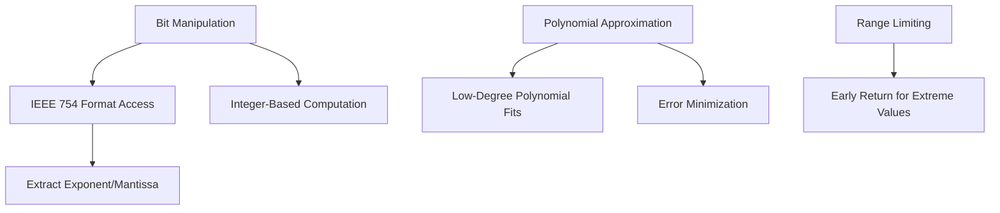
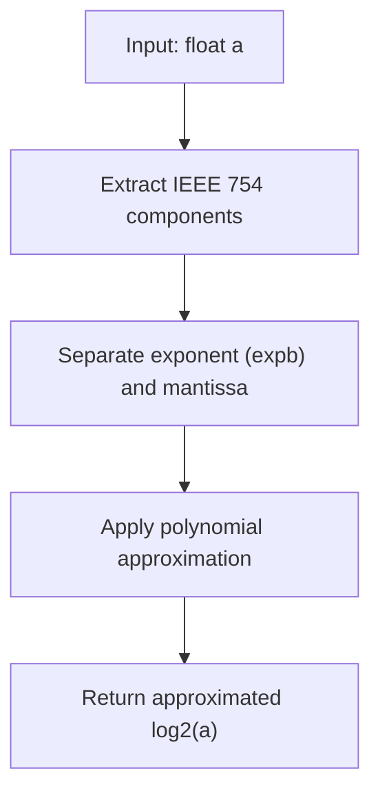
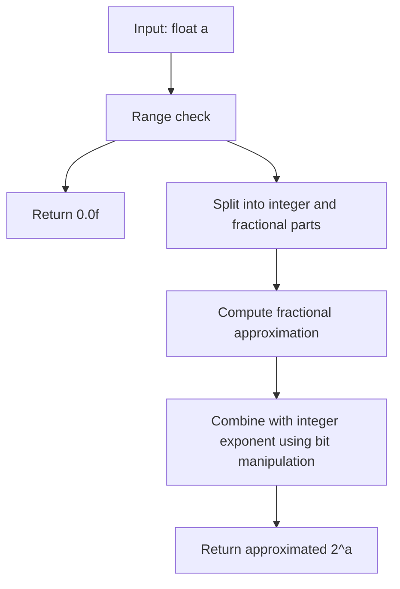
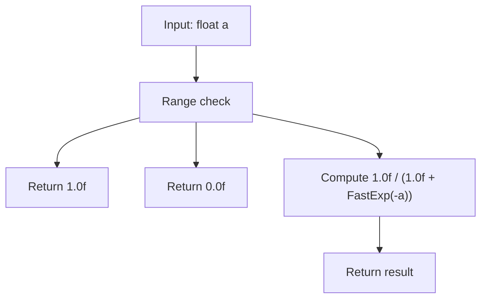
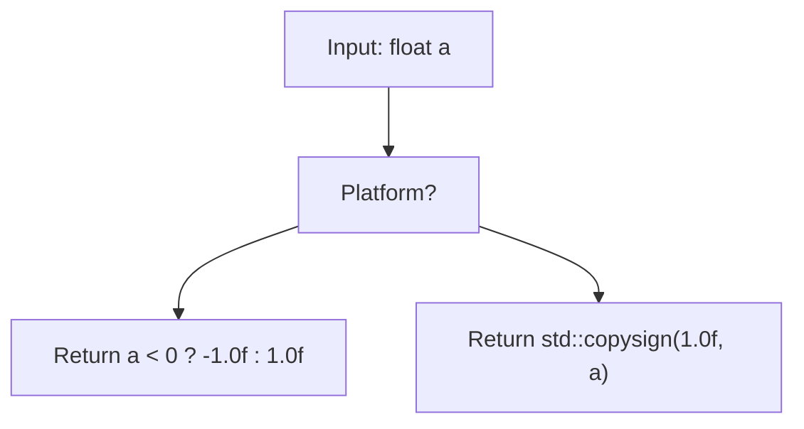
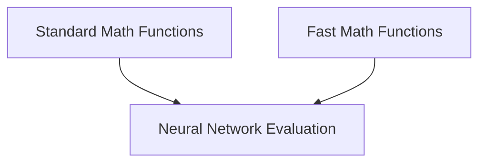
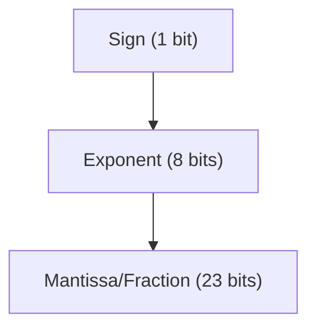

# Fast Mathematical Functions

Relevant source files

-   [src/utils/fastmath.h](https://github.com/LeelaChessZero/lc0/blob/b4e98c19/src/utils/fastmath.h)

## Purpose and Scope

This document details the optimized mathematical functions implemented in Leela Chess Zero to improve computational performance. These fast math functions provide efficient approximations of common mathematical operations like logarithms and exponentials, trading a small amount of precision for significant speed improvements in performance-critical code paths. This page focuses specifically on the mathematical approximation techniques used in the codebase and their implementation details.

For information about other utility functions, see [Utilities](/LeelaChessZero/lc0/8-utilities-and-infrastructure) and for threading-related optimizations, see [Threading and Synchronization](/LeelaChessZero/lc0/8.2-threading-and-synchronization).

## Overview of Fast Math Functions

Leela Chess Zero implements several optimized mathematical functions in the `lczero` namespace:

| Function | Purpose | Standard Equivalent |
| --- | --- | --- |
| `FastLog2` | Fast approximation of log₂(x) | `std::log2` |
| `FastExp2` | Fast approximation of 2ˣ | `std::exp2` |
| `FastLog` | Fast approximation of natural logarithm | `std::log` |
| `FastExp` | Fast approximation of eˣ | `std::exp` |
| `FastLogistic` | Fast sigmoid function 1/(1+e⁻ˣ) | `1.0f/(1.0f+std::exp(-x))` |
| `FastSign` | Fast implementation of sign function | `std::copysign` |

Sources: [src/utils/fastmath.h37-105](https://github.com/LeelaChessZero/lc0/blob/b4e98c19/src/utils/fastmath.h#L37-L105)

## Implementation Principles

The fast math functions in Lc0 use clever bit manipulation and polynomial approximations to achieve high performance while maintaining acceptable accuracy for the engine's needs.


Sources: [src/utils/fastmath.h42-78](https://github.com/LeelaChessZero/lc0/blob/b4e98c19/src/utils/fastmath.h#L42-L78)

## Fast Logarithm Functions

### FastLog2

The `FastLog2` function computes an approximation of log₂(x) by:

1.  Extracting the exponent and mantissa from the IEEE 754 floating-point representation
2.  Applying a polynomial approximation of the form: `log2(2^N*(1+f)) ≈ N+f*(1+k-k*f)`
3.  Tuning constants for optimal accuracy with 32-bit floating-point math


Implementation details:

```
FastLog2(a) = mantissa * (1.3465552f - 0.34655523f * mantissa) - 127 + exponent
```
Sources: [src/utils/fastmath.h42-52](https://github.com/LeelaChessZero/lc0/blob/b4e98c19/src/utils/fastmath.h#L42-L52)

### FastLog

The `FastLog` function computes the natural logarithm by using `FastLog2` and multiplying by the conversion factor ln(2):

```
FastLog(a) = 0.6931471805599453f * FastLog2(a)
```
Sources: [src/utils/fastmath.h80-83](https://github.com/LeelaChessZero/lc0/blob/b4e98c19/src/utils/fastmath.h#L80-L83)

## Fast Exponential Functions

### FastExp2

The `FastExp2` function computes an approximation of 2ˣ by:

1.  Separating the input into integer and fractional parts
2.  Applying a polynomial approximation for the fractional part: `2^(N+f) ≈ 2^N*(1+f*(1-k+k*f))`
3.  Setting the exponent bits directly in the IEEE 754 representation

The function includes range checking to prevent underflow/overflow.


Sources: [src/utils/fastmath.h59-78](https://github.com/LeelaChessZero/lc0/blob/b4e98c19/src/utils/fastmath.h#L59-L78)

### FastExp

The `FastExp` function computes eˣ by leveraging `FastExp2` with the appropriate conversion factor:

```
FastExp(a) = FastExp2(1.442695040f * a)
```
Where 1.442695040f is approximately equal to 1/ln(2).

Sources: [src/utils/fastmath.h86](https://github.com/LeelaChessZero/lc0/blob/b4e98c19/src/utils/fastmath.h#L86-L86)

## Logistic and Sign Functions

### FastLogistic

The logistic function (sigmoid) is implemented as a safeguarded version that uses `FastExp`:


The range checking prevents potential numerical issues with very large positive or negative inputs.

Sources: [src/utils/fastmath.h89-93](https://github.com/LeelaChessZero/lc0/blob/b4e98c19/src/utils/fastmath.h#L89-L93)

### FastSign

The `FastSign` function implements a faster version of the sign function, with platform-specific optimizations:


On Microsoft Visual C++ compiler, the function uses a simple comparison to avoid library calls that `std::copysign` might generate, while other compilers can use the standard function directly.

Sources: [src/utils/fastmath.h95-105](https://github.com/LeelaChessZero/lc0/blob/b4e98c19/src/utils/fastmath.h#L95-L105)

## Accuracy and Performance Considerations

The fast math functions sacrifice a small amount of accuracy for significant performance gains. The polynomial approximations are carefully tuned to minimize either maximum absolute error (for logarithmic functions) or maximum relative error (for exponential functions), depending on which metric is more important for the specific function.


For operations like neural network inference where the engine needs to evaluate thousands or millions of positions, these optimized functions provide a substantial performance boost with negligible impact on the quality of play.

Sources: [src/utils/fastmath.h50-51](https://github.com/LeelaChessZero/lc0/blob/b4e98c19/src/utils/fastmath.h#L50-L51) [src/utils/fastmath.h71-72](https://github.com/LeelaChessZero/lc0/blob/b4e98c19/src/utils/fastmath.h#L71-L72)

## Usage in the Codebase

These fast math functions are primarily used in performance-critical sections of the code, particularly:

1.  Neural network activation functions
2.  Search algorithm calculations
3.  Position evaluation normalization


By using these optimized functions in the most computationally intensive parts of the engine, Lc0 achieves better performance without sacrificing playing strength.

Sources: [src/utils/fastmath.h28-107](https://github.com/LeelaChessZero/lc0/blob/b4e98c19/src/utils/fastmath.h#L28-L107)

## Implementation Details and Bit Manipulation

The fast math functions make extensive use of IEEE 754 floating-point representation knowledge and bit manipulation to achieve their speed. For example, in `FastLog2` and `FastExp2`, the code directly accesses and modifies the exponent and mantissa parts of the floating-point numbers using memory copying and bitwise operations.


This direct manipulation of the binary representation allows for much faster computation than standard library functions, which must handle all edge cases and provide full precision.

Sources: [src/utils/fastmath.h43-48](https://github.com/LeelaChessZero/lc0/blob/b4e98c19/src/utils/fastmath.h#L43-L48) [src/utils/fastmath.h73-76](https://github.com/LeelaChessZero/lc0/blob/b4e98c19/src/utils/fastmath.h#L73-L76)

## Summary

The fast math functions in Leela Chess Zero provide efficient approximations of common mathematical operations, optimized for the specific needs of a neural network chess engine. By trading a small amount of precision for significant performance improvements, these functions contribute to the engine's ability to search deeper and evaluate positions more quickly.

These optimizations represent the careful balance between accuracy and speed that is essential in competitive chess engine development, where evaluating millions of positions per second is critical for strong play.

Sources: [src/utils/fastmath.h35-107](https://github.com/LeelaChessZero/lc0/blob/b4e98c19/src/utils/fastmath.h#L35-L107)
