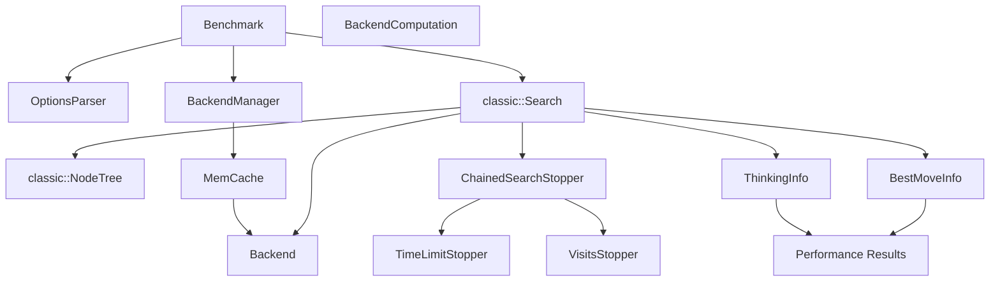
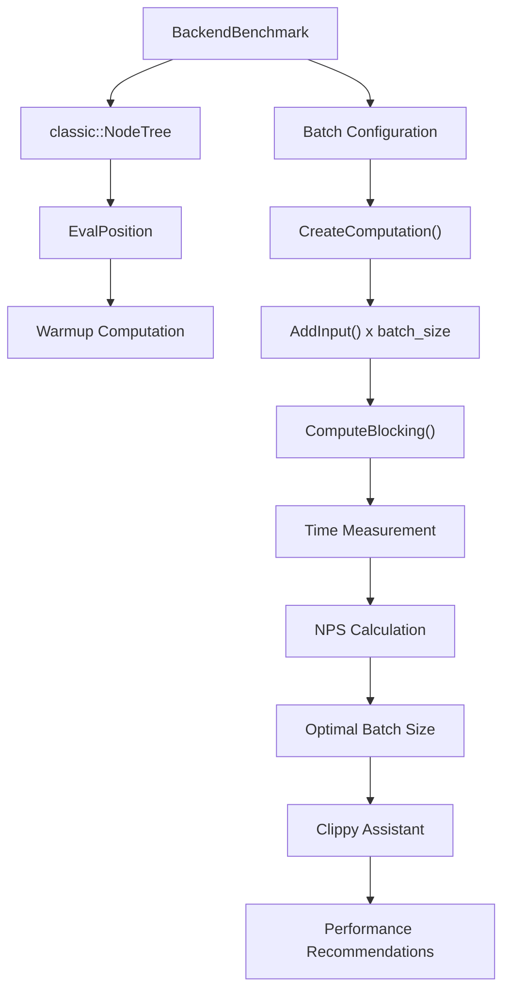
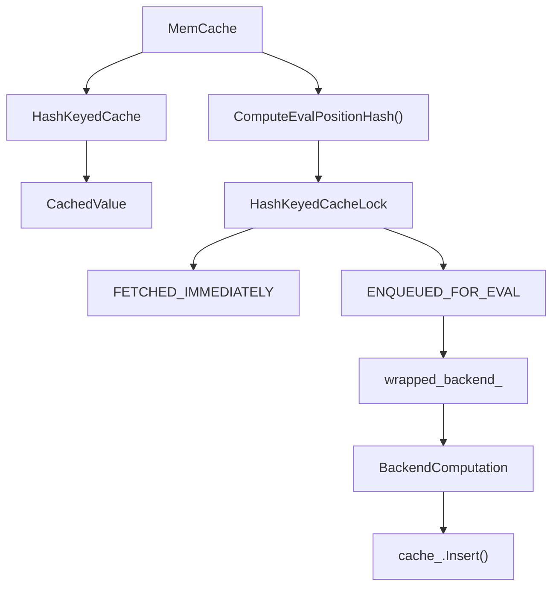
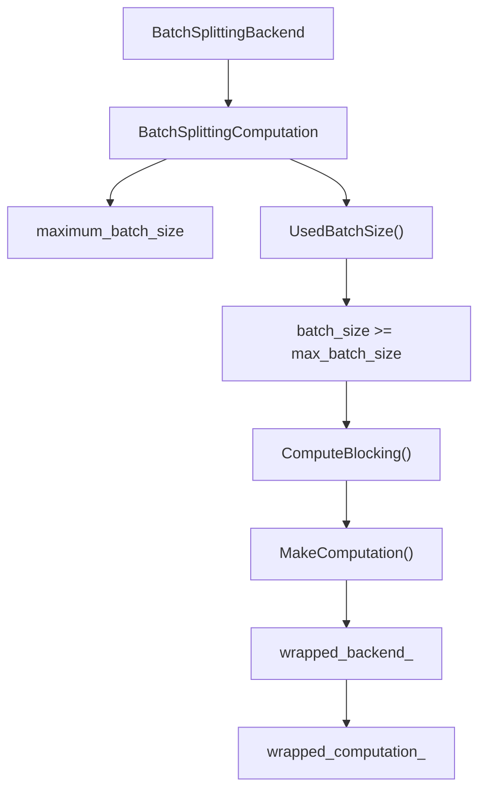
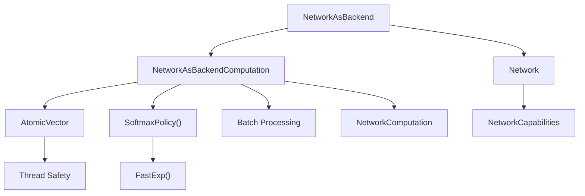

# Benchmarking and Performance Testing

Relevant source files

-   [src/neural/backend.cc](https://github.com/LeelaChessZero/lc0/blob/b4e98c19/src/neural/backend.cc)
-   [src/neural/backend.h](https://github.com/LeelaChessZero/lc0/blob/b4e98c19/src/neural/backend.h)
-   [src/neural/batchsplit.cc](https://github.com/LeelaChessZero/lc0/blob/b4e98c19/src/neural/batchsplit.cc)
-   [src/neural/memcache.cc](https://github.com/LeelaChessZero/lc0/blob/b4e98c19/src/neural/memcache.cc)
-   [src/neural/memcache.h](https://github.com/LeelaChessZero/lc0/blob/b4e98c19/src/neural/memcache.h)
-   [src/neural/shared\_params.cc](https://github.com/LeelaChessZero/lc0/blob/b4e98c19/src/neural/shared_params.cc)
-   [src/neural/shared\_params.h](https://github.com/LeelaChessZero/lc0/blob/b4e98c19/src/neural/shared_params.h)
-   [src/neural/wrapper.cc](https://github.com/LeelaChessZero/lc0/blob/b4e98c19/src/neural/wrapper.cc)
-   [src/tools/backendbench.cc](https://github.com/LeelaChessZero/lc0/blob/b4e98c19/src/tools/backendbench.cc)
-   [src/tools/benchmark.cc](https://github.com/LeelaChessZero/lc0/blob/b4e98c19/src/tools/benchmark.cc)
-   [src/tools/benchmark.h](https://github.com/LeelaChessZero/lc0/blob/b4e98c19/src/tools/benchmark.h)

This document covers the benchmarking and performance testing infrastructure in lc0, including search performance measurement, neural network backend optimization, and caching systems. For general engine configuration options, see [Configuration System](/LeelaChessZero/lc0/3.2-configuration-system). For neural network system architecture, see [Neural Network System](/LeelaChessZero/lc0/6-neural-network-system).

## Overview

The lc0 codebase includes comprehensive benchmarking tools to measure and optimize performance across different components:

-   **Search Benchmarking**: Measures overall engine performance in nodes per second
-   **Backend Benchmarking**: Tests neural network inference performance across different batch sizes
-   **Caching Systems**: Optimize performance through memory caching of evaluations
-   **Batch Management**: Optimize neural network utilization through intelligent batching

## Search Performance Benchmarking

The main search benchmark tool is implemented in the `Benchmark` class, which evaluates engine performance using standardized chess positions.

### Benchmark Tool Architecture

### Configuration Options

The benchmark tool accepts several configuration parameters defined in [src/tools/benchmark.cc43-50](https://github.com/LeelaChessZero/lc0/blob/b4e98c19/src/tools/benchmark.cc#L43-L50):

| Option | Description | Default |
| --- | --- | --- |
| `threads` | Number of CPU worker threads | 2 |
| `nodes` | Number of nodes to search | \-1 (unlimited) |
| `movetime` | Time allocation in milliseconds | 10000 (full) / 500 (short) |
| `fen` | Custom position FEN | "" (uses standard positions) |
| `num-positions` | Number of test positions | 34 (full) / 10 (short) |

### Benchmark Execution Flow

The `Benchmark::Run()` method [src/tools/benchmark.cc53-147](https://github.com/LeelaChessZero/lc0/blob/b4e98c19/src/tools/benchmark.cc#L53-L147) follows this process:

1.  **Setup**: Configure options and create backend with memory cache
2.  **Position Loop**: Iterate through test positions (same as Stockfish)
3.  **Search**: Run search with configured stoppers and time limits
4.  **Measurement**: Collect timing and node count data
5.  **Results**: Calculate total nodes per second across all positions

Sources: [src/tools/benchmark.cc1-162](https://github.com/LeelaChessZero/lc0/blob/b4e98c19/src/tools/benchmark.cc#L1-L162) [src/tools/benchmark.h1-86](https://github.com/LeelaChessZero/lc0/blob/b4e98c19/src/tools/benchmark.h#L1-L86)

## Neural Network Backend Benchmarking

The `BackendBenchmark` class provides specialized benchmarking for neural network inference performance, testing various batch sizes to find optimal configurations.

### Backend Benchmark Architecture

### Batch Size Optimization

The backend benchmark tests different batch sizes from `start-batch-size` to `max-batch-size` with configurable `batch-step` increments. The `Clippy` assistant [src/tools/backendbench.cc54-75](https://github.com/LeelaChessZero/lc0/blob/b4e98c19/src/tools/backendbench.cc#L54-L75) provides recommendations for different time controls:

-   **Bullet** (1s/move): Optimized for low latency
-   **Rapid** (15s/move): Balanced latency/throughput
-   **Tournament** (3min/move): Optimized for maximum throughput

Sources: [src/tools/backendbench.cc1-188](https://github.com/LeelaChessZero/lc0/blob/b4e98c19/src/tools/backendbench.cc#L1-L188)

## Performance Optimization Components

### Memory Caching System

The `MemCache` class implements neural network evaluation caching to avoid redundant computations.

The cache stores `CachedValue` structs containing:

-   `float q, d, m`: Value, draw, and move estimates
-   `uint8_t num_moves`: Number of legal moves
-   `std::unique_ptr<float[]> p`: Policy probabilities

Cache configuration is controlled by `SharedBackendParams::kNNCacheSizeId` [src/neural/shared\_params.cc63-66](https://github.com/LeelaChessZero/lc0/blob/b4e98c19/src/neural/shared_params.cc#L63-L66) with a default size of 2,000,000 positions.

Sources: [src/neural/memcache.cc1-194](https://github.com/LeelaChessZero/lc0/blob/b4e98c19/src/neural/memcache.cc#L1-L194) [src/neural/memcache.h1-47](https://github.com/LeelaChessZero/lc0/blob/b4e98c19/src/neural/memcache.h#L1-L47)

### Batch Splitting Backend

The `BatchSplittingBackend` automatically manages batch sizes to prevent exceeding backend limits.

The system automatically triggers computation when the batch reaches capacity [src/neural/batchsplit.cc72-77](https://github.com/LeelaChessZero/lc0/blob/b4e98c19/src/neural/batchsplit.cc#L72-L77) ensuring optimal utilization without overflow.

Sources: [src/neural/batchsplit.cc1-101](https://github.com/LeelaChessZero/lc0/blob/b4e98c19/src/neural/batchsplit.cc#L1-L101)

### Network-as-Backend Wrapper

The `NetworkAsBackend` class wraps neural networks to provide the standard backend interface with performance optimizations.

Key performance features include:

-   **Atomic Vector**: Thread-safe batch entry management [src/neural/wrapper.cc165](https://github.com/LeelaChessZero/lc0/blob/b4e98c19/src/neural/wrapper.cc#L165-L165)
-   **Fast Math**: Optimized `FastExp()` for softmax computation [src/neural/wrapper.cc148](https://github.com/LeelaChessZero/lc0/blob/b4e98c19/src/neural/wrapper.cc#L148-L148)
-   **Batch Attributes**: Configurable batch sizes via `BackendAttributes` [src/neural/wrapper.cc62-63](https://github.com/LeelaChessZero/lc0/blob/b4e98c19/src/neural/wrapper.cc#L62-L63)

Sources: [src/neural/wrapper.cc1-195](https://github.com/LeelaChessZero/lc0/blob/b4e98c19/src/neural/wrapper.cc#L1-L195) [src/neural/backend.h1-136](https://github.com/LeelaChessZero/lc0/blob/b4e98c19/src/neural/backend.h#L1-L136)

## Backend Attributes and Configuration

Performance characteristics are exposed through the `BackendAttributes` structure [src/neural/backend.h43-50](https://github.com/LeelaChessZero/lc0/blob/b4e98c19/src/neural/backend.h#L43-L50):

| Attribute | Description |
| --- | --- |
| `suggested_num_search_threads` | Recommended number of search threads |
| `recommended_batch_size` | Optimal batch size for this backend |
| `maximum_batch_size` | Maximum supported batch size |
| `runs_on_cpu` | Whether backend uses CPU resources |

Configuration updates are managed through `UpdateConfiguration()` methods that can return `UPDATE_OK` or `NEED_RESTART` depending on whether changes require backend recreation [src/neural/backend.h106-114](https://github.com/LeelaChessZero/lc0/blob/b4e98c19/src/neural/backend.h#L106-L114)

Sources: [src/neural/backend.h1-136](https://github.com/LeelaChessZero/lc0/blob/b4e98c19/src/neural/backend.h#L1-L136) [src/neural/backend.cc1-68](https://github.com/LeelaChessZero/lc0/blob/b4e98c19/src/neural/backend.cc#L1-L68) [src/neural/shared\_params.cc1-86](https://github.com/LeelaChessZero/lc0/blob/b4e98c19/src/neural/shared_params.cc#L1-L86)
