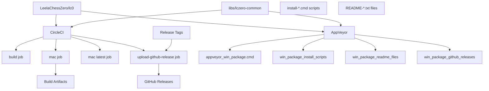
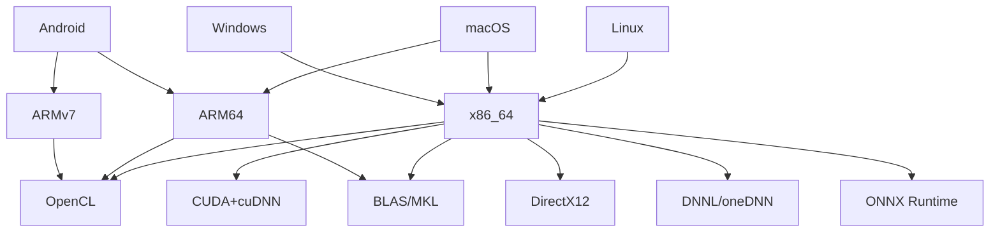
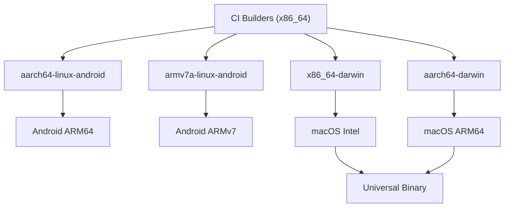

# Continuous Integration and Deployment

Relevant source files

-   [.circleci/Dockerfile](https://github.com/LeelaChessZero/lc0/blob/b4e98c19/.circleci/Dockerfile)
-   [.circleci/config.yml](https://github.com/LeelaChessZero/lc0/blob/b4e98c19/.circleci/config.yml)
-   [.clang-format](https://github.com/LeelaChessZero/lc0/blob/b4e98c19/.clang-format)
-   [.gitmodules](https://github.com/LeelaChessZero/lc0/blob/b4e98c19/.gitmodules)
-   [cross-files/x86\_64-darwin](https://github.com/LeelaChessZero/lc0/blob/b4e98c19/cross-files/x86_64-darwin)
-   [dist/README-onnx-dml.txt](https://github.com/LeelaChessZero/lc0/blob/b4e98c19/dist/README-onnx-dml.txt)
-   [dist/README-onnx-trt.txt](https://github.com/LeelaChessZero/lc0/blob/b4e98c19/dist/README-onnx-trt.txt)
-   [dist/install-cuda\_12\_9.cmd](https://github.com/LeelaChessZero/lc0/blob/b4e98c19/dist/install-cuda_12_9.cmd)
-   [dist/install-dml.cmd](https://github.com/LeelaChessZero/lc0/blob/b4e98c19/dist/install-dml.cmd)
-   [dist/install-trt.cmd](https://github.com/LeelaChessZero/lc0/blob/b4e98c19/dist/install-trt.cmd)
-   [scripts/appveyor\_win\_package.cmd](https://github.com/LeelaChessZero/lc0/blob/b4e98c19/scripts/appveyor_win_package.cmd)
-   [subprojects/protobuf.wrap](https://github.com/LeelaChessZero/lc0/blob/b4e98c19/subprojects/protobuf.wrap)

This page documents the continuous integration and deployment (CI/CD) system used by Leela Chess Zero (lc0) to automate building, testing, packaging, and releasing across multiple platforms and hardware configurations. The system handles both regular development builds and automated deployment of tagged releases to GitHub. For information about the build process itself, see [Building and Installation](/LeelaChessZero/lc0/2-building-and-installation).

## Overview

Leela Chess Zero uses a multi-platform CI/CD setup to ensure the codebase can be built correctly across various operating systems, hardware architectures, and with different neural network backends. The system automatically builds the project when changes are committed and deploys packaged binaries to GitHub releases for tagged versions.

### CI/CD Pipeline Architecture

Sources: [.circleci/config.yml1-148](https://github.com/LeelaChessZero/lc0/blob/b4e98c19/.circleci/config.yml#L1-L148) [scripts/appveyor\_win\_package.cmd1-72](https://github.com/LeelaChessZero/lc0/blob/b4e98c19/scripts/appveyor_win_package.cmd#L1-L72) [dist/install-dml.cmd1-25](https://github.com/LeelaChessZero/lc0/blob/b4e98c19/dist/install-dml.cmd#L1-L25) [dist/README-onnx-trt.txt1-89](https://github.com/LeelaChessZero/lc0/blob/b4e98c19/dist/README-onnx-trt.txt#L1-L89)

## CI Platforms

### CircleCI

CircleCI is used for building lc0 on Linux and macOS platforms. The CircleCI configuration defines four main jobs orchestrated through workflows:

#### Job Definitions

1.  **`build` Job**:

    -   Uses `nvidia/cuda:11.6.1-cudnn8-devel-ubuntu20.04` Docker image
    -   Installs build tools: `gcc-10`, `g++-10`, `clang-12`, `meson==0.63`, `ninja`
    -   Downloads ONNX Runtime 1.22.0 for Linux x64
    -   Builds with both GCC and Clang compilers using Meson
2.  **`mac` Job**:

    -   Runs on `macos.m1.medium.gen1` with Xcode 14.1.0
    -   Creates both x86\_64 and ARM64 builds using cross-compilation
    -   Produces universal binary with `lipo`
    -   Stores artifacts and persists to workspace for release uploads
3.  **`mac latest` Job**:

    -   Similar to `mac` but uses Xcode 16.4.0 for latest compatibility testing
    -   Only builds ARM64 variant
4.  **`upload-github-release` Job**:

    -   Downloads GitHub CLI and uploads macOS artifacts to GitHub releases
    -   Only runs for tagged releases matching pattern `/v[0-9]+(\.[0-9]+)*(\-.+)?/`

### CircleCI Build Process Flow

```mermaid
flowchart TD
    mac_checkout["checkout"]
    mac_submodules["git submodule update --init"]
    ispc_install["Install ispc-v1.21.0"]
    x86_build["meson build --cross-file cross-files/x86_64-darwin"]
    arm_build["meson build-arm --buildtype=release"]
    lipo_universal["lipo -create -o /tmp/lc0 build/lc0 build-arm/lc0"]
    store_artifacts["store_artifacts: path=/tmp/lc0"]
    persist_workspace["persist_to_workspace"]
    nvidia_cuda["nvidia/cuda:11.6.1-cudnn8-devel-ubuntu20.04"]
    build_tools["gcc-10, g++-10, clang-12, meson, ninja"]
    onnx_download["onnxruntime-linux-x64-1.22.0.tgz"]
    checkout["checkout"]
    submodules["git submodule update --init"]
    meson_gcc["meson build-gcc -Dgtest=false -Donnx_include=... -Donnx_libdir=..."]
    meson_clang["meson build-clang -Dgtest=false -Db_lto=false -Donnx_include=... -Donnx_libdir=..."]
    ninja_gcc["ninja -j 4 (build-gcc)"]
    ninja_clang["ninja -j 4 (build-clang)"]

    nvidia --> cuda_build_tools
    build --> tools_checkout
    checkout --> submodules
    submodules --> onnx_download
    onnx --> download_meson_gcc
    meson --> gcc_meson_clang
    meson --> clang_ninja_gcc
    ninja --> gcc_ninja_clang
    mac --> checkout_mac_submodules
    mac --> submodules_ispc_install
    ispc --> install_x86_build
    x86 --> build_arm_build
    arm --> build_lipo_universal
    lipo --> universal_store_artifacts
    store --> artifacts_persist_workspace
```

Sources: [.circleci/config.yml3-44](https://github.com/LeelaChessZero/lc0/blob/b4e98c19/.circleci/config.yml#L3-L44) [.circleci/config.yml45-88](https://github.com/LeelaChessZero/lc0/blob/b4e98c19/.circleci/config.yml#L45-L88) [.circleci/config.yml89-108](https://github.com/LeelaChessZero/lc0/blob/b4e98c19/.circleci/config.yml#L89-L108) [.circleci/config.yml109-129](https://github.com/LeelaChessZero/lc0/blob/b4e98c19/.circleci/config.yml#L109-L129)

### AppVeyor

AppVeyor is used for Windows and Android builds. The AppVeyor configuration is not directly visible in the provided files, but the packaging scripts reveal details about the build process:

1.  **Windows Build**:

    -   Creates packages for various backends (CUDA, OpenCL, BLAS, DNNL, DirectX, ONNX)
    -   Includes required DLLs and dependencies in the package
    -   Creates specialized packages based on build configuration
2.  **Android Build**:

    -   Builds for ARM64 (arm64-v8a) and ARMv7 (armeabi-v7a) architectures
    -   Uses cross-compilation with the Android NDK

Sources: [scripts/appveyor\_win\_package.cmd1-48](https://github.com/LeelaChessZero/lc0/blob/b4e98c19/scripts/appveyor_win_package.cmd#L1-L48) [scripts/appveyor\_android\_build.cmd1-8](https://github.com/LeelaChessZero/lc0/blob/b4e98c19/scripts/appveyor_android_build.cmd#L1-L8)

## Build Matrix

Leela Chess Zero is built across a complex matrix of configurations:

| Operating System | Architecture | Neural Network Backend | Compiler |
| --- | --- | --- | --- |
| Linux | x86\_64 | CUDA+cuDNN | GCC, Clang |
| Linux | x86\_64 | OpenCL | GCC, Clang |
| Linux | x86\_64 | BLAS | GCC, Clang |
| macOS | x86\_64 | BLAS | Clang |
| macOS | ARM64 | BLAS | Clang |
| Windows | x86\_64 | CUDA+cuDNN | MSVC |
| Windows | x86\_64 | OpenCL | MSVC |
| Windows | x86\_64 | DirectX12 | MSVC |
| Windows | x86\_64 | DNNL/oneDNN | MSVC |
| Windows | x86\_64 | ONNX | MSVC |
| Android | ARM64 | OpenCL | Clang |
| Android | ARMv7 | OpenCL | Clang |

This matrix ensures that lc0 can run on a wide variety of hardware and software configurations, maximizing compatibility and performance.

Sources: [.circleci/config.yml3-74](https://github.com/LeelaChessZero/lc0/blob/b4e98c19/.circleci/config.yml#L3-L74) [scripts/appveyor\_win\_package.cmd1-48](https://github.com/LeelaChessZero/lc0/blob/b4e98c19/scripts/appveyor_win_package.cmd#L1-L48) [cross-files/aarch64-linux-android1-25](https://github.com/LeelaChessZero/lc0/blob/b4e98c19/cross-files/aarch64-linux-android#L1-L25) [cross-files/armv7a-linux-android1-32](https://github.com/LeelaChessZero/lc0/blob/b4e98c19/cross-files/armv7a-linux-android#L1-L32)

## Cross-Compilation

Cross-compilation is an important aspect of the CI system, enabling builds for different architectures:

### Android Cross-Compilation

Android builds use cross-compilation files that define the target architecture, system, and toolchain:

-   **ARM64 Android**: Uses the aarch64-linux-android21-clang toolchain targeting API level 21
-   **ARMv7 Android**: Uses the armv7a-linux-androideabi21-clang toolchain targeting API level 21

The cross-compilation files specify:

-   Target machine properties (CPU, endianness)
-   Compiler and linker flags
-   Toolchain binaries (compiler, linker, etc.)

### macOS Cross-Compilation

For macOS, cross-compilation enables building for both Intel (x86\_64) and Apple Silicon (ARM64) architectures:

-   **x86\_64 macOS**: Specifies architecture-specific flags for x86\_64
-   **ARM64 macOS**: Specifies architecture-specific flags for ARM64 (arm64)

These cross-files enable the creation of universal binaries that run natively on both Intel and Apple Silicon Macs.

Sources: [cross-files/aarch64-linux-android1-25](https://github.com/LeelaChessZero/lc0/blob/b4e98c19/cross-files/aarch64-linux-android#L1-L25) [cross-files/armv7a-linux-android1-32](https://github.com/LeelaChessZero/lc0/blob/b4e98c19/cross-files/armv7a-linux-android#L1-L32) [cross-files/x86\_64-darwin1-28](https://github.com/LeelaChessZero/lc0/blob/b4e98c19/cross-files/x86_64-darwin#L1-L28) [cross-files/aarch64-darwin1-28](https://github.com/LeelaChessZero/lc0/blob/b4e98c19/cross-files/aarch64-darwin#L1-L28) [.circleci/config.yml70-72](https://github.com/LeelaChessZero/lc0/blob/b4e98c19/.circleci/config.yml#L70-L72)

## Release Packaging and Deployment

### Windows Packaging Process

The `appveyor_win_package.cmd` script handles comprehensive Windows package creation for different neural network backends. The script creates specialized packages based on build configuration variables (`%NAME%`, `%CUDA%`, `%OPENCL%`, etc.):

#### Package Creation Logic

### Automated Dependency Installation

The packaging system includes automated installation scripts for complex dependencies:

| Script | Purpose | Dependencies Downloaded |
| --- | --- | --- |
| `install-dml.cmd` | DirectML for ONNX-DML backend | `microsoft.ai.directml.1.15.4.nupkg` |
| `install-trt.cmd` | CUDA/cuDNN/TensorRT for ONNX-TRT | CUDA 12.9, cuDNN 9.11, TensorRT 10.12 |
| `install-cuda_12_9.cmd` | CUDA runtime for CUDA backend | CUDA runtime 12.9, cuBLAS 12.9 |

### GitHub Release Deployment

The CircleCI `upload-github-release` job handles automated deployment to GitHub releases:

```mermaid
flowchart TD
    tag_push["Tag Push (v[0-9]+...)"]
    workflow_filter["Workflow Filters"]
    attach_workspace["attach_workspace: at=/tmp/workspace"]
    install_gh["brew install gh"]
    verify_workspace["ls -lah /tmp/workspace"]
    rename_binary["mv /tmp/workspace/lc0 /tmp/lc0-$CIRCLE_TAG-macos_12.6.1"]
    gh_upload["gh release upload $CIRCLE_TAG /tmp/lc0-$CIRCLE_TAG-macos_12.6.1 --clobber --repo LeelaChessZero/lc0"]
    mac_job_complete["mac job completion"]
    branch_ignore["branches: ignore: /.*/"]

    tag --> push_workflow_filter
    workflow --> filter_mac_job_complete
    mac --> job_complete_attach_workspace
    attach --> workspace_install_gh
    install --> gh_verify_workspace
    verify --> workspace_rename_binary
    rename --> binary_gh_upload
    branch --> ignore_gh_upload
```

Sources: [scripts/appveyor\_win\_package.cmd1-72](https://github.com/LeelaChessZero/lc0/blob/b4e98c19/scripts/appveyor_win_package.cmd#L1-L72) [.circleci/config.yml109-147](https://github.com/LeelaChessZero/lc0/blob/b4e98c19/.circleci/config.yml#L109-L147) [dist/install-dml.cmd1-25](https://github.com/LeelaChessZero/lc0/blob/b4e98c19/dist/install-dml.cmd#L1-L25) [dist/install-trt.cmd1-89](https://github.com/LeelaChessZero/lc0/blob/b4e98c19/dist/install-trt.cmd#L1-L89) [dist/install-cuda\_12\_9.cmd1-44](https://github.com/LeelaChessZero/lc0/blob/b4e98c19/dist/install-cuda_12_9.cmd#L1-L44)

## Workflow Integration

The continuous integration workflow is triggered on each commit to the repository and for tagged releases:

1.  **Regular Commits**:

    -   CI builds the project to ensure it compiles correctly
    -   Tests are run to verify functionality
    -   No packages are published
2.  **Tagged Releases**:

    -   CI builds the project across all platforms
    -   Packages are created for each configuration
    -   Artifacts are uploaded to GitHub releases

This workflow ensures that the codebase remains buildable at all times and simplifies the release process by automating the creation of binary packages.

Sources: [.circleci/config.yml75-81](https://github.com/LeelaChessZero/lc0/blob/b4e98c19/.circleci/config.yml#L75-L81) [scripts/appveyor\_win\_package.cmd1-48](https://github.com/LeelaChessZero/lc0/blob/b4e98c19/scripts/appveyor_win_package.cmd#L1-L48)
