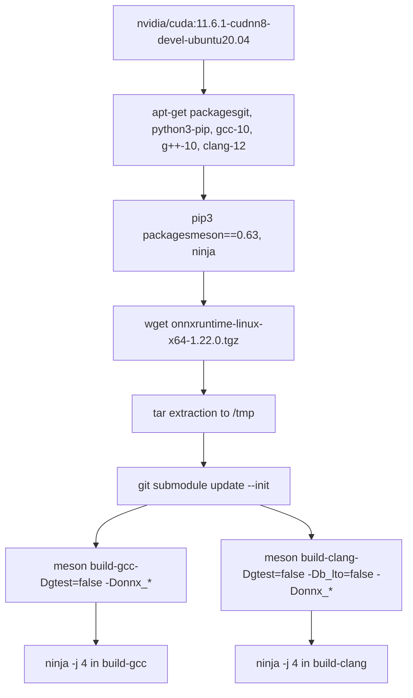
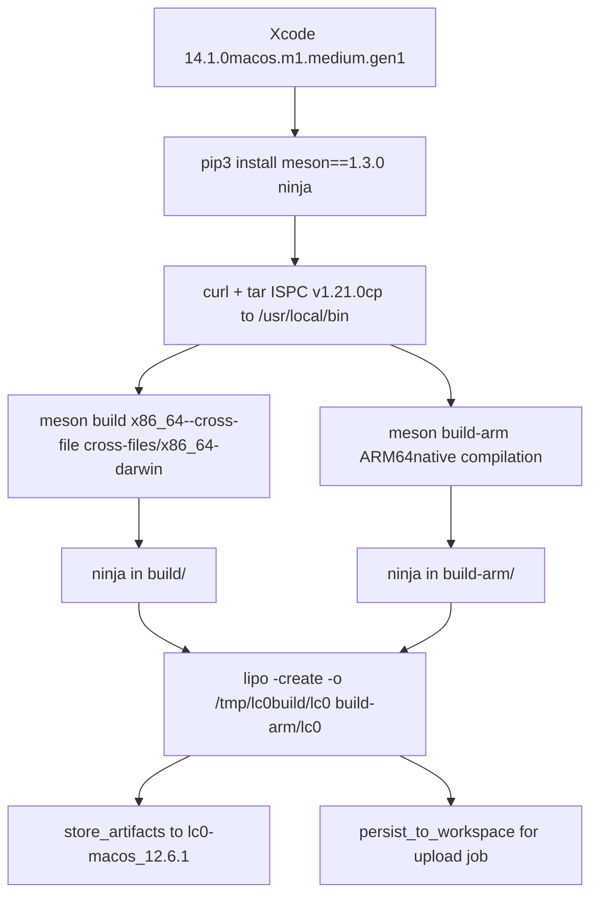
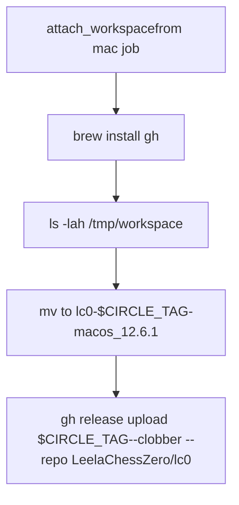
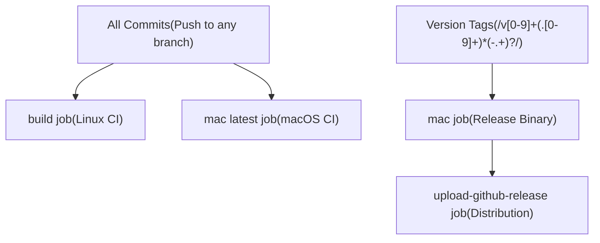

# CircleCI Workflows

Relevant source files

-   [.circleci/Dockerfile](https://github.com/LeelaChessZero/lc0/blob/b4e98c19/.circleci/Dockerfile)
-   [.circleci/config.yml](https://github.com/LeelaChessZero/lc0/blob/b4e98c19/.circleci/config.yml)
-   [.clang-format](https://github.com/LeelaChessZero/lc0/blob/b4e98c19/.clang-format)
-   [.gitmodules](https://github.com/LeelaChessZero/lc0/blob/b4e98c19/.gitmodules)
-   [cross-files/x86\_64-darwin](https://github.com/LeelaChessZero/lc0/blob/b4e98c19/cross-files/x86_64-darwin)
-   [subprojects/protobuf.wrap](https://github.com/LeelaChessZero/lc0/blob/b4e98c19/subprojects/protobuf.wrap)

This document covers the CircleCI-based continuous integration system for the Leela Chess Zero project. CircleCI handles automated building and testing for Linux and macOS platforms, including cross-compilation and release artifact generation. For Windows builds and packaging, see [Windows Build and Packaging](/LeelaChessZero/lc0/9.2-windows-build-and-packaging).

## Purpose and Architecture

The CircleCI workflows provide automated builds across multiple platforms and compilers, ensuring code quality and generating distribution artifacts. The system is configured via [.circleci/config.yml1-148](https://github.com/LeelaChessZero/lc0/blob/b4e98c19/.circleci/config.yml#L1-L148) and supports:

-   Linux builds with multiple compilers (GCC, Clang)
-   macOS universal binaries (x86\_64 + ARM64)
-   ONNX Runtime integration for cross-platform neural network inference
-   Automated GitHub release uploads for tagged versions

```mermaid
flowchart TD
    BuildJob["build(Linux)"]
    MacJob["mac(macOS Universal)"]
    MacLatestJob["mac latest(macOS ARM)"]
    UploadJob["upload-github-release(Release Artifacts)"]
    CudaDocker["nvidia/cuda:11.6.1-cudnn8-devel-ubuntu20.04"]
    MacOSXcode14["macOS Xcode 14.1.0M1 Medium"]
    MacOSXcode16["macOS Xcode 16.4.0M1 Medium"]
    Meson["meson build system"]
    Ninja["ninja build tool"]
    GCC["gcc-10/g++-10"]
    Clang["clang-12/clang++-12"]
    ISPC["Intel ISPC compiler"]
    OnnxRuntime["ONNX Runtime 1.22.0"]
    Submodules["lczero-common submodule"]
    CrossFiles["x86_64-darwin cross-file"]
    LinuxBinaries["Linux Binaries(GCC + Clang)"]
    UniversalBinary["macOS Universal Binary(x86_64 + ARM64)"]
    GitHubRelease["GitHub Release Assets"]

    BuildJob --> CudaDocker
    MacJob --> MacOSXcode14
    MacLatestJob --> MacOSXcode16
    BuildJob --> GCC
    BuildJob --> Clang
    MacJob --> ISPC
    BuildJob --> OnnxRuntime
    MacJob --> CrossFiles
    BuildJob --> Submodules
    MacJob --> Submodules
    BuildJob --> LinuxBinaries
    MacJob --> UniversalBinary
    UploadJob --> GitHubRelease
    MacJob --> UploadJob
```

Sources: [.circleci/config.yml1-148](https://github.com/LeelaChessZero/lc0/blob/b4e98c19/.circleci/config.yml#L1-L148)

## Job Definitions

### Linux Build Job

The `build` job executes Linux compilation using a CUDA-enabled Docker environment:

The job builds with both GCC 10 and Clang 12 compilers, configured with ONNX Runtime support at [.circleci/config.yml28](https://github.com/LeelaChessZero/lc0/blob/b4e98c19/.circleci/config.yml#L28-L28) and [.circleci/config.yml34](https://github.com/LeelaChessZero/lc0/blob/b4e98c19/.circleci/config.yml#L34-L34) The ONNX Runtime is downloaded from Microsoft's GitHub releases and extracted to `/tmp` for linking during the build process.

Sources: [.circleci/config.yml3-44](https://github.com/LeelaChessZero/lc0/blob/b4e98c19/.circleci/config.yml#L3-L44)

### macOS Build Jobs

Two macOS jobs handle different build scenarios:

#### Mac Job (Release Builds)

The `mac` job creates universal binaries for release distribution:

The job uses cross-compilation for x86\_64 via [cross-files/x86\_64-darwin1-28](https://github.com/LeelaChessZero/lc0/blob/b4e98c19/cross-files/x86_64-darwin#L1-L28) and native compilation for ARM64. The `lipo` command at [.circleci/config.yml76](https://github.com/LeelaChessZero/lc0/blob/b4e98c19/.circleci/config.yml#L76-L76) creates the final universal binary.

#### Mac Latest Job

The `mac latest` job provides continuous testing with the latest Xcode version (16.4.0) but only builds for ARM64 architecture at [.circleci/config.yml104-108](https://github.com/LeelaChessZero/lc0/blob/b4e98c19/.circleci/config.yml#L104-L108)

Sources: [.circleci/config.yml45-88](https://github.com/LeelaChessZero/lc0/blob/b4e98c19/.circleci/config.yml#L45-L88) [.circleci/config.yml89-108](https://github.com/LeelaChessZero/lc0/blob/b4e98c19/.circleci/config.yml#L89-L108) [cross-files/x86\_64-darwin1-28](https://github.com/LeelaChessZero/lc0/blob/b4e98c19/cross-files/x86_64-darwin#L1-L28)

### GitHub Release Upload Job

The `upload-github-release` job handles automated release artifact distribution:

This job runs only on version tags (matching `/v[0-9]+(\.[0-9]+)*(\-.+)?/`) and requires completion of the `mac` job as defined in the workflow filters at [.circleci/config.yml140-147](https://github.com/LeelaChessZero/lc0/blob/b4e98c19/.circleci/config.yml#L140-L147)

Sources: [.circleci/config.yml109-148](https://github.com/LeelaChessZero/lc0/blob/b4e98c19/.circleci/config.yml#L109-L148)

## Workflow Configuration

The CircleCI workflow orchestrates job execution with dependencies and filters:

| Job | Trigger | Dependencies | Artifacts |
| --- | --- | --- | --- |
| `build` | All commits | None | Linux binaries (not stored) |
| `mac latest` | All commits | None | None |
| `mac` | Version tags only | None | macOS universal binary |
| `upload-github-release` | Version tags only | `mac` job completion | GitHub release assets |

The workflow configuration at [.circleci/config.yml130-148](https://github.com/LeelaChessZero/lc0/blob/b4e98c19/.circleci/config.yml#L130-L148) ensures that release builds only occur for properly tagged versions, while continuous integration runs on every commit.

Sources: [.circleci/config.yml130-148](https://github.com/LeelaChessZero/lc0/blob/b4e98c19/.circleci/config.yml#L130-L148)

## Build Dependencies and Environment

### ONNX Runtime Integration

The Linux build integrates ONNX Runtime 1.22.0 for cross-platform neural network inference. The runtime is downloaded from Microsoft's GitHub releases at [.circleci/config.yml18-19](https://github.com/LeelaChessZero/lc0/blob/b4e98c19/.circleci/config.yml#L18-L19) and configured in both GCC and Clang builds via `-Donnx_include` and `-Donnx_libdir` parameters.

### Submodule Management

All jobs initialize the `lczero-common` submodule via `git submodule update --init` at [.circleci/config.yml22](https://github.com/LeelaChessZero/lc0/blob/b4e98c19/.circleci/config.yml#L22-L22) ensuring access to shared utilities and neural network components referenced in [.gitmodules1-4](https://github.com/LeelaChessZero/lc0/blob/b4e98c19/.gitmodules#L1-L4)

### Cross-Platform Toolchain

The macOS builds utilize Intel ISPC (Intel SPMD Program Compiler) version 1.21.0 for optimized parallel computation, downloaded and installed at [.circleci/config.yml59-61](https://github.com/LeelaChessZero/lc0/blob/b4e98c19/.circleci/config.yml#L59-L61) The x86\_64 cross-compilation uses the configuration defined in [cross-files/x86\_64-darwin1-28](https://github.com/LeelaChessZero/lc0/blob/b4e98c19/cross-files/x86_64-darwin#L1-L28)

Sources: [.circleci/config.yml16-22](https://github.com/LeelaChessZero/lc0/blob/b4e98c19/.circleci/config.yml#L16-L22) [.gitmodules1-4](https://github.com/LeelaChessZero/lc0/blob/b4e98c19/.gitmodules#L1-L4) [cross-files/x86\_64-darwin1-28](https://github.com/LeelaChessZero/lc0/blob/b4e98c19/cross-files/x86_64-darwin#L1-L28)
