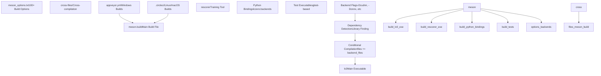

# 构建系统架构

相关源文件

-   [appveyor.yml](https://github.com/LeelaChessZero/lc0/blob/b4e98c19/appveyor.yml)
-   [meson.build](https://github.com/LeelaChessZero/lc0/blob/b4e98c19/meson.build)
-   [meson\_options.txt](https://github.com/LeelaChessZero/lc0/blob/b4e98c19/meson_options.txt)

本文档解释了 Leela Chess Zero 的构建系统架构，包括基于 Meson 的配置系统、后端选择矩阵和跨平台构建配置。这涵盖了如何配置和组织构建的结构方面，而不是分步构建说明（有关特定平台的构建步骤，请参阅 [Linux 和 macOS 构建过程](/LeelaChessZero/lc0/2.2-linux-and-macos-build-process) 和 [Windows 构建过程](/LeelaChessZero/lc0/2.3-windows-build-process)）。

## 核心构建系统设计

Leela Chess Zero 使用 Meson 作为其主要构建系统，提供具有广泛后端选择功能的跨平台构建配置。构建系统围绕模块化后端架构设计，允许根据可用硬件和依赖项选择性地编译神经网络加速后端。

### Meson 项目结构

来源：[meson.build17-19](https://github.com/LeelaChessZero/lc0/blob/b4e98c19/meson.build#L17-L19) [meson\_options.txt1-261](https://github.com/LeelaChessZero/lc0/blob/b4e98c19/meson_options.txt#L1-L261) [appveyor.yml1-192](https://github.com/LeelaChessZero/lc0/blob/b4e98c19/appveyor.yml#L1-L192)

## 后端选择架构

构建系统实现了一个基于矩阵的后端选择系统，其中可以同时启用多个神经网络加速后端。每个后端都有自己的依赖检测、编译标志和源文件包含逻辑。

### 后端检测与配置流程

来源：[meson.build261-777](https://github.com/LeelaChessZero/lc0/blob/b4e98c19/meson.build#L261-L777) [meson.build46-54](https://github.com/LeelaChessZero/lc0/blob/b4e98c19/meson.build#L46-L54)

## 构建选项矩阵

构建系统提供了按功能类别组织的 100 多个配置选项。这些选项控制后端选择、优化级别、交叉编译设置和构建目标。

| 类别 | 关键选项 | 默认值 | 目的 |
| --- | --- | --- | --- |
| **Backends** | `blas`, `cudnn`, `opencl`, `onnx`, `metal` | 不定 | 启用神经网络后端 |
| **BLAS Libraries** | `mkl`, `openblas`, `dnnl`, `accelerate` | 平台特定 | 选择 BLAS 实现 |
| **Optimization** | `native_arch`, `popcnt`, `f16c`, `pext` | `true` | CPU 指令优化 |
| **CUDA Settings** | `cc_cuda`, `native_cuda`, `nvcc_ccbin` | 自动检测 | CUDA 编译控制 |
| **Build Targets** | `lc0`, `rescorer`, `gtest`, `python_bindings` | 不定 | 选择要构建的内容 |
| **Cross-compilation** | Android, SYCL targets | 平台特定 | 目标平台配置 |

### 关键后端选项

```mermaid
flowchart TD
    gpu_backends["GPU Backendscudnn, opencl, metal, dx"]
    cpu_backends["CPU Backendsblas variants"]
    portable_backends["Portable Backendsonnx, xla"]
    experimental["Experimentalsycl, tensorflow"]
    mkl["Intel MKL-Dmkl=true"]
    openblas["OpenBLAS-Dopenblas=true"]
    dnnl["Intel DNNL-Ddnnl=true"]
    accelerate["Apple Accelerate-Daccelerate=true"]
    cudnn_opt["cuDNN-Dcudnn=true"]
    plain_cuda["CUDA-Dplain_cuda=true"]
    opencl_opt["OpenCL-Dopencl=true"]
    metal_opt["Metal-Dmetal=auto"]
    dx_opt["DirectX 12-Ddx=true"]

    cpu --> backends_mkl
    cpu --> backends_openblas
    cpu --> backends_dnnl
    cpu --> backends_accelerate
    gpu --> backends_cudnn_opt
    gpu --> backends_plain_cuda
    gpu --> backends_opencl_opt
    gpu --> backends_metal_opt
    gpu --> backends_dx_opt
```

来源：[meson\_options.txt46-261](https://github.com/LeelaChessZero/lc0/blob/b4e98c19/meson_options.txt#L46-L261) [meson.build297-422](https://github.com/LeelaChessZero/lc0/blob/b4e98c19/meson.build#L297-L422)

## 平台特定配置

构建系统通过条件编译、不同的依赖路径和平台特定的编译器标志来处理平台特定的需求。

### Windows 构建配置

```mermaid
flowchart TD
    host_check["host_machine.system() == 'windows'"]
    msvc_check["cc.get_id() == 'msvc'"]
    nominmax["add_project_arguments('-DNOMINMAX')"]
    utf8_charset["source-charset:utf-8"]
    vscrt_flags["Visual C++ Runtimeb_vscrt option"]
    filesystem_win["filesystem.win32.cc"]
    dx_native["DirectX 12Native on Windows"]
    cuda_windows["CUDAWindows-specific paths"]
    mimalloc_win["mimallocWindows MSVC linking"]
    gpu_nvidia["gpu-nvidia-cudnngpu-nvidia-cuda11/12"]
    cpu_variants["cpu-dnnlcpu-openblas"]
    onnx_variant["onnxwith gtest"]
    android_cross["androidcross-compilation"]

    host --> check_nominmax
    msvc --> check_utf8_charset
    msvc --> check_vscrt_flags
    host --> check_filesystem_win
    nominmax --> dx_native
    vscrt --> flags_cuda_windows
    vscrt --> flags_mimalloc_win
    dx --> native_gpu_nvidia
    cuda --> windows_gpu_nvidia
    mimalloc --> win_cpu_variants
```

来源：[meson.build34-41](https://github.com/LeelaChessZero/lc0/blob/b4e98c19/meson.build#L34-L41) [meson.build237-241](https://github.com/LeelaChessZero/lc0/blob/b4e98c19/meson.build#L237-L241) [appveyor.yml6-17](https://github.com/LeelaChessZero/lc0/blob/b4e98c19/appveyor.yml#L6-L17)

## 依赖管理与检测

构建系统实现了具有回退机制和跨平台库查找功能的健壮依赖检测。

### 库检测模式

```mermaid
flowchart TD
    pkg_config["pkg-config Detectiondependency()"]
    manual_search["Manual Library Searchcc.find_library()"]
    header_validation["Header Verificationcc.has_header()"]
    subproject_fallback["Subproject Fallbackwrap files"]
    option_paths["User-specified Paths*_libdirs, *_include options"]
    default_paths["Default System Paths/usr/lib, /opt/cuda, etc"]
    cache_paths["CI Cache PathsC:\cache on Windows"]
    lib_found["Library Found"]
    headers_found["Headers Found"]
    compilation_test["Test Compilation"]
    backend_enabled["Backend Enabled"]

    pkg --> config_manual_search
    manual --> search_header_validation
    header --> validation_subproject_fallback
    option --> paths_manual_search
    default --> paths_manual_search
    cache --> paths_manual_search
    manual --> search_lib_found
    header --> validation_headers_found
    lib --> found_compilation_test
    headers --> found_compilation_test
    compilation --> test_backend_enabled
```

来源：[meson.build280-622](https://github.com/LeelaChessZero/lc0/blob/b4e98c19/meson.build#L280-L622) [meson\_options.txt1-45](https://github.com/LeelaChessZero/lc0/blob/b4e98c19/meson_options.txt#L1-L45) [appveyor.yml56-103](https://github.com/LeelaChessZero/lc0/blob/b4e98c19/appveyor.yml#L56-L103)

## 文件组织与构建目标

构建系统将源文件组织成逻辑组，并创建具有共享组件的多个构建目标。

### 源文件组织

```mermaid
flowchart TD
    common_files["common_files[]Chess logic, Utils, Neural core"]
    main_files["files[]Engine, Search, Tools"]
    pb_files["pb_files[]Protobuf generated"]
    blas_files["BLAS Backendsrc/neural/backends/blas/"]
    cuda_files["CUDA Backendsrc/neural/backends/cuda/"]
    opencl_files["OpenCL Backendsrc/neural/backends/opencl/"]
    onnx_files["ONNX Backendsrc/neural/backends/network_onnx.cc"]
    metal_files["Metal Backendsrc/neural/backends/metal/"]
    lc0_target["lc0 executablemain.cc + all files"]
    rescorer_target["rescorer executablerescorer_main.cc + common"]
    test_targets["Test executables*_test.cc + lc0_lib"]
    python_target["Python extensionbackends.cc generated"]

    common --> files_lc0_target
    main --> files_lc0_target
    pb --> files_lc0_target
    blas --> files_lc0_target
    cuda --> files_lc0_target
    opencl --> files_lc0_target
    onnx --> files_lc0_target
    metal --> files_lc0_target
    common --> files_rescorer_target
    common --> files_test_targets
    main --> files_python_target
```

来源：[meson.build149-224](https://github.com/LeelaChessZero/lc0/blob/b4e98c19/meson.build#L149-L224) [meson.build852-867](https://github.com/LeelaChessZero/lc0/blob/b4e98c19/meson.build#L852-L867) [meson.build872-914](https://github.com/LeelaChessZero/lc0/blob/b4e98c19/meson.build#L872-L914)

## CI/CD 集成架构

构建系统与多个 CI/CD 平台集成，以提供全面的跨平台测试和二进制分发。

### 多平台 CI 策略

| 平台 | CI 系统 | 构建矩阵 | 产物 (Artifacts) |
| --- | --- | --- | --- |
| **Windows** | AppVeyor | 7 种配置 | `.exe`, `.zip`, `.pdb` |
| **Linux** | CircleCI | 多个发行版 | 二进制文件 |
| **macOS** | CircleCI | 通用二进制文件 | 原生二进制文件 |
| **Android** | AppVeyor | ARM64, ARMv7a | `.apk` 文件 |

CI 配置展示了构建系统的灵活性，它可以自动构建多种后端组合，确保跨不同硬件配置和依赖项版本的兼容性。

来源：[appveyor.yml1-192](https://github.com/LeelaChessZero/lc0/blob/b4e98c19/appveyor.yml#L1-L192) [meson.build119-122](https://github.com/LeelaChessZero/lc0/blob/b4e98c19/meson.build#L119-L122) [meson.build92-110](https://github.com/LeelaChessZero/lc0/blob/b4e98c19/meson.build#L92-L110)
