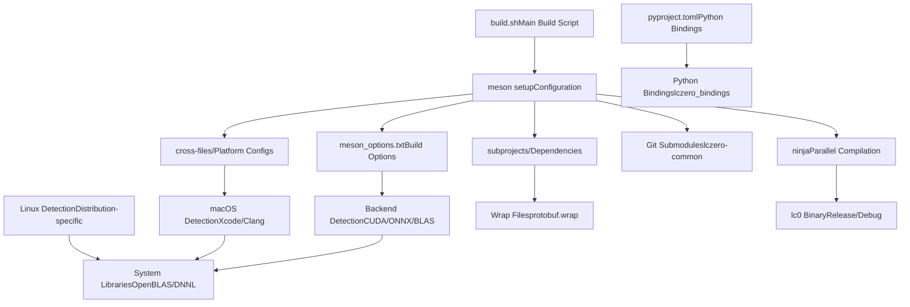
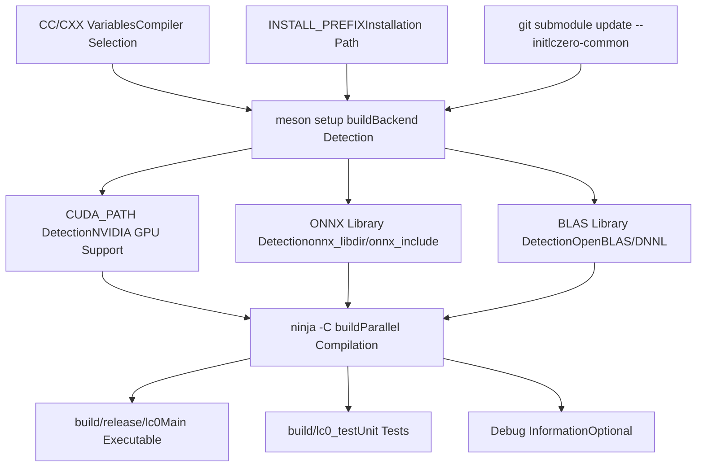
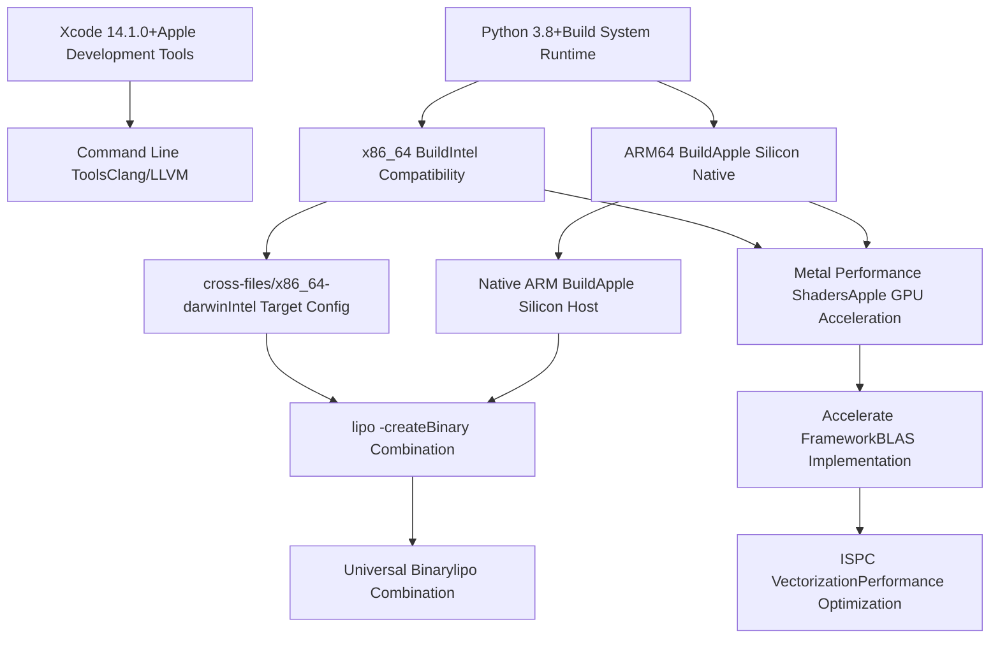
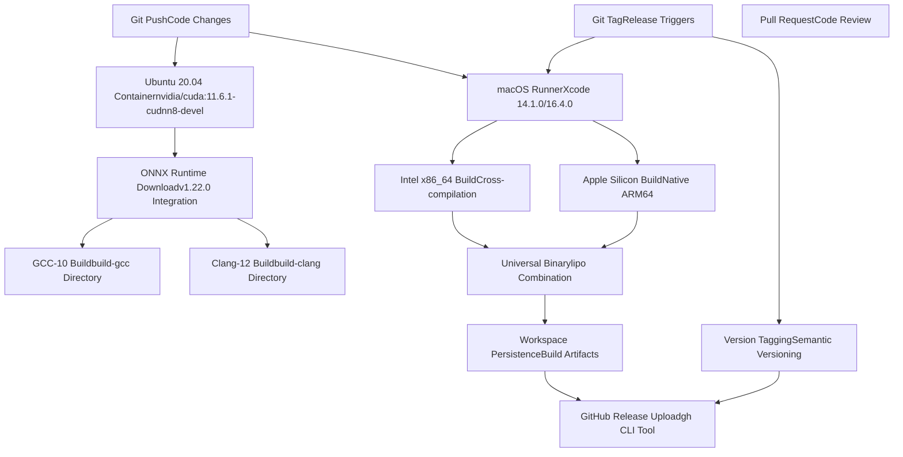
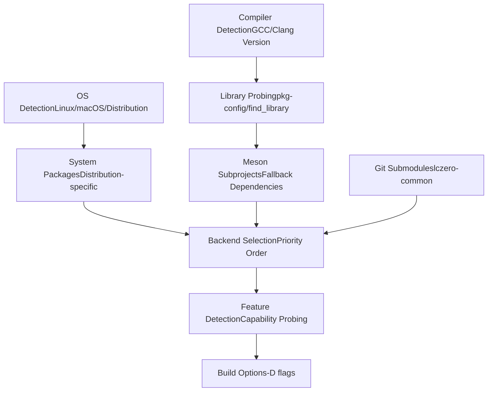

# Linux 和 macOS 构建过程

相关源文件

-   [.circleci/Dockerfile](https://github.com/LeelaChessZero/lc0/blob/b4e98c19/.circleci/Dockerfile)
-   [.circleci/config.yml](https://github.com/LeelaChessZero/lc0/blob/b4e98c19/.circleci/config.yml)
-   [.clang-format](https://github.com/LeelaChessZero/lc0/blob/b4e98c19/.clang-format)
-   [.gitmodules](https://github.com/LeelaChessZero/lc0/blob/b4e98c19/.gitmodules)
-   [CONTRIBUTING.md](https://github.com/LeelaChessZero/lc0/blob/b4e98c19/CONTRIBUTING.md)
-   [README.md](https://github.com/LeelaChessZero/lc0/blob/b4e98c19/README.md)
-   [cross-files/x86\_64-darwin](https://github.com/LeelaChessZero/lc0/blob/b4e98c19/cross-files/x86_64-darwin)
-   [install\_openSUSE\_lc0.sh](https://github.com/LeelaChessZero/lc0/blob/b4e98c19/install_openSUSE_lc0.sh)
-   [openSUSE\_install.md](https://github.com/LeelaChessZero/lc0/blob/b4e98c19/openSUSE_install.md)
-   [pyproject.toml](https://github.com/LeelaChessZero/lc0/blob/b4e98c19/pyproject.toml)
-   [subprojects/protobuf.wrap](https://github.com/LeelaChessZero/lc0/blob/b4e98c19/subprojects/protobuf.wrap)

本文档涵盖了 Leela Chess Zero 在类 Unix 系统（Linux 和 macOS）上的构建过程，包括 Meson 构建系统配置、平台特定要求和持续集成工作流。

有关 Windows 特定的构建说明，请参阅 [Windows 构建过程](/LeelaChessZero/lc0/2.3-windows-build-process)。有关整体构建系统架构和后端选择，请参阅 [构建系统架构](/LeelaChessZero/lc0/2.1-build-system-architecture)。

## 构建系统概览

Lc0 使用 Meson 构建系统进行跨平台编译，并使用 Ninja 作为后端构建工具。构建过程通过处理依赖解析、后端选择和平台特定优化的 shell 脚本和 CI/CD 流水线进行编排。

### 构建系统架构


来源：[README.md43-49](https://github.com/LeelaChessZero/lc0/blob/b4e98c19/README.md#L43-L49) [build.sh](https://github.com/LeelaChessZero/lc0/blob/b4e98c19/build.sh) [meson\_options.txt](https://github.com/LeelaChessZero/lc0/blob/b4e98c19/meson_options.txt) [cross-files/x86\_64-darwin](https://github.com/LeelaChessZero/lc0/blob/b4e98c19/cross-files/x86_64-darwin) [subprojects/protobuf.wrap](https://github.com/LeelaChessZero/lc0/blob/b4e98c19/subprojects/protobuf.wrap) [pyproject.toml](https://github.com/LeelaChessZero/lc0/blob/b4e98c19/pyproject.toml)

## Linux 构建过程

Linux 构建过程支持多种发行版和编译器工具链，具有自动依赖检测和后端配置功能。

### 前置条件与依赖

| 组件 | 目的 | 安装 |
| --- | --- | --- |
| `meson` | 构建系统 | `pip3 install meson` |
| `ninja-build` | 构建后端 | 发行版软件包 |
| `gcc-10`/`clang-12` | C++20 编译器 | 发行版软件包 |
| `git` | 子模块处理 | 发行版软件包 |
| `python3-pip` | Python 依赖 | 发行版软件包 |

### Linux 构建工作流


来源：[README.md51-82](https://github.com/LeelaChessZero/lc0/blob/b4e98c19/README.md#L51-L82) [install\_openSUSE\_lc0.sh46-70](https://github.com/LeelaChessZero/lc0/blob/b4e98c19/install_openSUSE_lc0.sh#L46-L70)

### 发行版特定示例

#### Ubuntu 20.04 构建命令

```
apt-get update
apt-get -y install git python3-pip gcc-10 g++-10 zlib1g zlib1g-dev
pip3 install meson ninja
CC=gcc-10 CXX=g++-10 INSTALL_PREFIX=~/.local ./build.sh
```
#### openSUSE 构建命令

```
zypper in -y git gcc-c++ gcc7-c++ meson ninja python3-abseil openblas_pthreads-devel-static
git clone --recurse-submodules https://github.com/LeelaChessZero/lc0.git
cd lc0 && ./build.sh
```
来源：[README.md70-81](https://github.com/LeelaChessZero/lc0/blob/b4e98c19/README.md#L70-L81) [install\_openSUSE\_lc0.sh54-70](https://github.com/LeelaChessZero/lc0/blob/b4e98c19/install_openSUSE_lc0.sh#L54-L70)

## macOS 构建过程

macOS 构建过程支持 Intel x86\_64 和 Apple Silicon 架构，并可创建用于分发的通用二进制文件。

### macOS 构建要求

| 组件 | 版本 | 安装方法 |
| --- | --- | --- |
| Xcode | 14.1.0+ | App Store |
| Python 3 | 3.8+ | System/Homebrew |
| Meson | 1.3.0+ | `pip3 install meson` |
| Ninja | 最新 | `pip3 install ninja` |

### macOS 构建架构


来源：[README.md106-121](https://github.com/LeelaChessZero/lc0/blob/b4e98c19/README.md#L106-L121) [.circleci/config.yml45-88](https://github.com/LeelaChessZero/lc0/blob/b4e98c19/.circleci/config.yml#L45-L88) [cross-files/x86\_64-darwin](https://github.com/LeelaChessZero/lc0/blob/b4e98c19/cross-files/x86_64-darwin)

### macOS 构建命令

#### 基础构建过程

```
pip3 install meson ninja
git clone --recurse-submodules -b release/0.32 https://github.com/LeelaChessZero/lc0.git
cd lc0
./build.sh -Dgtest=false
```
#### 通用二进制文件创建

```
# x86_64 build
meson build --buildtype=release -Dgtest=false --cross-file cross-files/x86_64-darwin
cd build && ninja && cd ..

# ARM64 build
meson build-arm --buildtype=release -Dgtest=false
cd build-arm && ninja && cd ..

# Combine architectures
lipo -create -o lc0-universal build/lc0 build-arm/lc0
```
来源：[README.md110-117](https://github.com/LeelaChessZero/lc0/blob/b4e98c19/README.md#L110-L117) [.circleci/config.yml64-76](https://github.com/LeelaChessZero/lc0/blob/b4e98c19/.circleci/config.yml#L64-L76)

## CircleCI 持续集成

CI 系统为 Linux 和 macOS 平台提供自动化测试和发布产物生成。

### CircleCI 工作流结构


来源：[.circleci/config.yml](https://github.com/LeelaChessZero/lc0/blob/b4e98c19/.circleci/config.yml)

### CI 作业配置详情

#### Linux 构建作业

-   **容器**: `nvidia/cuda:11.6.1-cudnn8-devel-ubuntu20.04`
-   **编译器**: GCC-10, Clang-12
-   **ONNX 集成**: 下载 onnxruntime-linux-x64-1.22.0.tgz
-   **构建命令**:

    ```
    meson build-gcc -Dgtest=false -Donnx_include=/tmp/onnxruntime-linux-x64-1.22.0/include
    meson build-clang -Dgtest=false -Db_lto=false -Donnx_include=/tmp/onnxruntime-linux-x64-1.22.0/include
    ```


#### macOS 构建作业

-   **Xcode 版本**: 14.1.0 (stable), 16.4.0 (latest)
-   **资源类**: `macos.m1.medium.gen1`
-   **ISPC 集成**: 下载 ispc-v1.21.0 用于向量化
-   **通用二进制文件**: 使用 `lipo -create` 组合架构

来源：[.circleci/config.yml3-44](https://github.com/LeelaChessZero/lc0/blob/b4e98c19/.circleci/config.yml#L3-L44) [.circleci/config.yml45-108](https://github.com/LeelaChessZero/lc0/blob/b4e98c19/.circleci/config.yml#L45-L108)

## 后端与依赖管理

构建系统会自动检测并配置各种神经网络后端和数学库。

### 后端检测矩阵

| 后端 | Linux 检测 | macOS 检测 | 配置选项 |
| --- | --- | --- | --- |
| CUDA | `CUDA_PATH` 环境变量 | 不支持 | `-Dcuda=true`, `-Dnvcc_ccbin=` |
| ONNX | `onnx_libdir`/`onnx_include` | System/Homebrew | `-Donnx_include=`, `-Donnx_libdir=` |
| OpenBLAS | 包管理器 | Homebrew | 自动检测 |
| DNNL | 手动下载 | 手动下载 | `-Ddnnl=true`, `-Ddnnl_dir=` |
| Metal | 不支持 | 自动 | macOS 框架 |
| Accelerate | 不支持 | 自动 | macOS 框架 |

### 依赖解析过程


来源：[README.md43-46](https://github.com/LeelaChessZero/lc0/blob/b4e98c19/README.md#L43-L46) [README.md122-170](https://github.com/LeelaChessZero/lc0/blob/b4e98c19/README.md#L122-L170) [subprojects/protobuf.wrap](https://github.com/LeelaChessZero/lc0/blob/b4e98c19/subprojects/protobuf.wrap) [.gitmodules](https://github.com/LeelaChessZero/lc0/blob/b4e98c19/.gitmodules)
