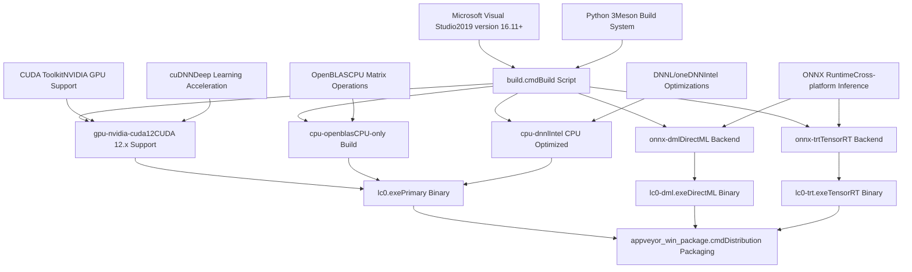
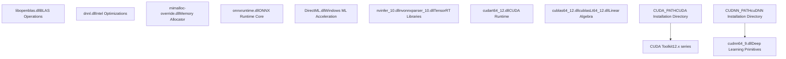
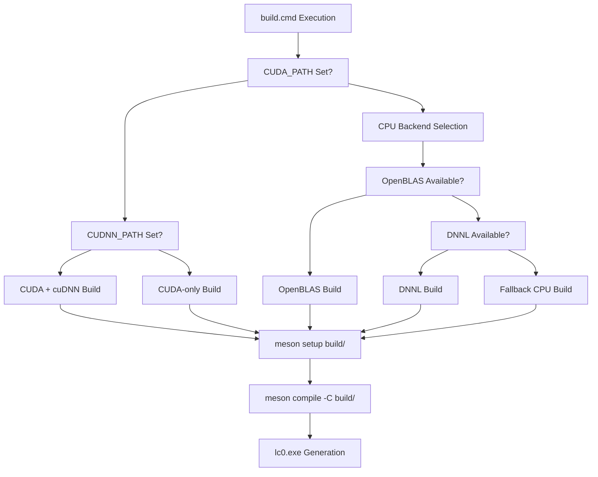
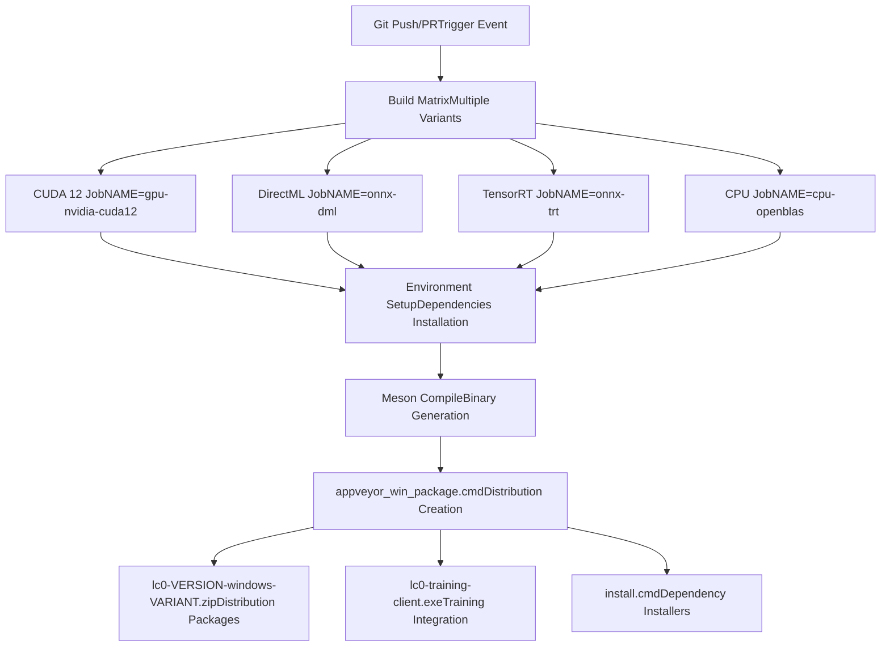
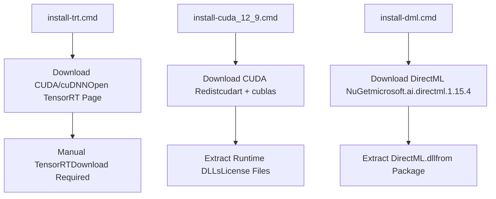

# Windows 构建过程

相关源文件

-   [CONTRIBUTING.md](https://github.com/LeelaChessZero/lc0/blob/b4e98c19/CONTRIBUTING.md)
-   [README.md](https://github.com/LeelaChessZero/lc0/blob/b4e98c19/README.md)
-   [dist/README-onnx-dml.txt](https://github.com/LeelaChessZero/lc0/blob/b4e98c19/dist/README-onnx-dml.txt)
-   [dist/README-onnx-trt.txt](https://github.com/LeelaChessZero/lc0/blob/b4e98c19/dist/README-onnx-trt.txt)
-   [dist/install-cuda\_12\_9.cmd](https://github.com/LeelaChessZero/lc0/blob/b4e98c19/dist/install-cuda_12_9.cmd)
-   [dist/install-dml.cmd](https://github.com/LeelaChessZero/lc0/blob/b4e98c19/dist/install-dml.cmd)
-   [dist/install-trt.cmd](https://github.com/LeelaChessZero/lc0/blob/b4e98c19/dist/install-trt.cmd)
-   [install\_openSUSE\_lc0.sh](https://github.com/LeelaChessZero/lc0/blob/b4e98c19/install_openSUSE_lc0.sh)
-   [openSUSE\_install.md](https://github.com/LeelaChessZero/lc0/blob/b4e98c19/openSUSE_install.md)
-   [pyproject.toml](https://github.com/LeelaChessZero/lc0/blob/b4e98c19/pyproject.toml)
-   [scripts/appveyor\_win\_package.cmd](https://github.com/LeelaChessZero/lc0/blob/b4e98c19/scripts/appveyor_win_package.cmd)

本文档描述了 Leela Chess Zero (lc0) 引擎的 Windows 特定构建过程，包括前置条件、构建变体、打包和持续集成工作流。有关通用构建系统架构和跨平台概念，请参阅 [构建系统架构](/LeelaChessZero/lc0/2.1-build-system-architecture)。有关 Linux 和 macOS 构建过程，请参阅 [Linux 和 macOS 构建过程](/LeelaChessZero/lc0/2.2-linux-and-macos-build-process)。

## 构建系统概览

Windows 构建过程使用 Meson 构建系统，并以 Microsoft Visual Studio 作为主要编译器，与 AppVeyor 集成以进行持续集成。支持多种后端变体，每种变体都需要不同的依赖项并生成专用的二进制文件。


来源：[README.md83-105](https://github.com/LeelaChessZero/lc0/blob/b4e98c19/README.md#L83-L105) [scripts/appveyor\_win\_package.cmd1-72](https://github.com/LeelaChessZero/lc0/blob/b4e98c19/scripts/appveyor_win_package.cmd#L1-L72)

## 前置条件与依赖

### 核心要求

| 组件 | 版本 | 目的 |
| --- | --- | --- |
| Microsoft Visual Studio | 2019 v16.11+ | C++20 编译器支持 |
| Python 3 | 3.7+ | Meson 构建系统 |
| Meson | 最新 | 构建系统 |
| Git | 任意 | 子模块管理 |

### 后端特定依赖

构建过程支持多种神经网络后端，每种都有特定的要求：


来源：[README.md87-94](https://github.com/LeelaChessZero/lc0/blob/b4e98c19/README.md#L87-L94) [scripts/appveyor\_win\_package.cmd14-25](https://github.com/LeelaChessZero/lc0/blob/b4e98c19/scripts/appveyor_win_package.cmd#L14-L25) [dist/install-cuda\_12\_9.cmd8-36](https://github.com/LeelaChessZero/lc0/blob/b4e98c19/dist/install-cuda_12_9.cmd#L8-L36)

## 构建变体与后端配置

### 主要构建变体

AppVeyor CI 系统生成几种不同的构建变体：

| 变体 | 二进制文件 | 后端 | 用例 |
| --- | --- | --- | --- |
| `gpu-nvidia-cuda12` | `lc0.exe` | CUDA 12.x | NVIDIA GPU 加速 |
| `onnx-dml` | `lc0-dml.exe` | DirectML | Windows GPU (AMD/Intel/NVIDIA) |
| `onnx-trt` | `lc0-trt.exe` | TensorRT | 带有 TensorRT 的 NVIDIA GPU |
| `cpu-openblas` | `lc0.exe` | OpenBLAS | 纯 CPU 执行 |
| `cpu-dnnl` | `lc0.exe` | DNNL | Intel CPU 优化 |

### 后端选择逻辑


来源：[README.md92-105](https://github.com/LeelaChessZero/lc0/blob/b4e98c19/README.md#L92-L105) [scripts/appveyor\_win\_package.cmd13-31](https://github.com/LeelaChessZero/lc0/blob/b4e98c19/scripts/appveyor_win_package.cmd#L13-L31)

## 构建过程工作流

### 手动构建过程

标准 Windows 构建遵循以下步骤：

1.  **环境设置**

    ```
    set CUDA_PATH=C:\Program Files\NVIDIA GPU Computing Toolkit\CUDA\v12.x
    set CUDNN_PATH=C:\Program Files\NVIDIA GPU Computing Toolkit\CUDA\v12.x
    ```

2.  **构建执行**

    -   运行 `build.cmd`，它会提示清理构建目录
    -   在 `build/lc0.sln` 中生成 Visual Studio 解决方案
    -   可选择通过命令行或 Visual Studio IDE 构建
3.  **输出生成**

    -   主二进制文件: `build/lc0.exe`
    -   后端特定二进制文件: `build/lc0-dml.exe`, `build/lc0-trt.exe`

### AppVeyor CI 集成

持续集成过程利用 AppVeyor 和全面的构建矩阵：


来源：[scripts/appveyor\_win\_package.cmd1-72](https://github.com/LeelaChessZero/lc0/blob/b4e98c19/scripts/appveyor_win_package.cmd#L1-L72) [README.md1-2](https://github.com/LeelaChessZero/lc0/blob/b4e98c19/README.md#L1-L2)

## 打包与分发

### 包创建过程

`appveyor_win_package.cmd` 脚本为每个构建变体创建全面的分发包：

#### 核心包内容

| 文件类型 | 来源 | 目的 |
| --- | --- | --- |
| `lc0.exe` | 构建输出 | 主引擎二进制文件 |
| `COPYING` | 仓库根目录 | GPL 许可证 |
| Neural network | 下载 | 默认网络权重 |
| `mimalloc-*.dll` | 外部依赖 | 内存分配器 |

#### 后端特定附加内容

**CUDA 构建:**

-   CUDA 运行时库 (`cudart64_12.dll`, `cublas64_12.dll`)
-   cuDNN 库（如果可用）
-   CUDA 许可证文件
-   用于缺失依赖项的安装脚本

**ONNX 构建:**

-   ONNX Runtime 库 (`onnxruntime.dll`)
-   提供程序特定的 DLL (DirectML, TensorRT)
-   后端安装脚本 (`install-dml.cmd`, `install-trt.cmd`)

**CPU 构建:**

-   BLAS 库 (`libopenblas.dll`, `dnnl.dll`)
-   第三方许可证文件

### 安装脚本

分发包包含用于缺失依赖项的自动化安装脚本：


来源：[dist/install-dml.cmd1-25](https://github.com/LeelaChessZero/lc0/blob/b4e98c19/dist/install-dml.cmd#L1-L25) [dist/install-cuda\_12\_9.cmd1-44](https://github.com/LeelaChessZero/lc0/blob/b4e98c19/dist/install-cuda_12_9.cmd#L1-L44) [dist/install-trt.cmd1-89](https://github.com/LeelaChessZero/lc0/blob/b4e98c19/dist/install-trt.cmd#L1-L89)

## 后端特定构建考量

### CUDA 后端

CUDA 后端需要仔细的版本管理和库兼容性：

-   **CUDA 12.x 系列**: 主要目标，具有运行时库依赖
-   **cuDNN 集成**: 可选但推荐用于提高性能
-   **库打包**: 运行时 DLL 包含在分发包中
-   **回退机制**: 当 CUDA 不可用时 CPU 回退

### ONNX 后端

支持多种 ONNX 执行提供程序：

-   **DirectML**: 适用于所有厂商的 Windows 原生 GPU 加速
-   **TensorRT**: NVIDIA 特定的高性能推理
-   **CPU 提供程序**: CPU 上的回退执行

### 内存管理

所有 Windows 构建都包含 `mimalloc` 以改进内存分配性能：

-   **mimalloc-override.dll**: 内存分配器替换
-   **mimalloc-redirect.dll**: 动态加载支持
-   **性能优势**: 减少内存碎片并提高分配速度

来源：[scripts/appveyor\_win\_package.cmd7-12](https://github.com/LeelaChessZero/lc0/blob/b4e98c19/scripts/appveyor_win_package.cmd#L7-L12) [dist/README-onnx-dml.txt1-39](https://github.com/LeelaChessZero/lc0/blob/b4e98c19/dist/README-onnx-dml.txt#L1-L39) [dist/README-onnx-trt.txt1-89](https://github.com/LeelaChessZero/lc0/blob/b4e98c19/dist/README-onnx-trt.txt#L1-L89)
