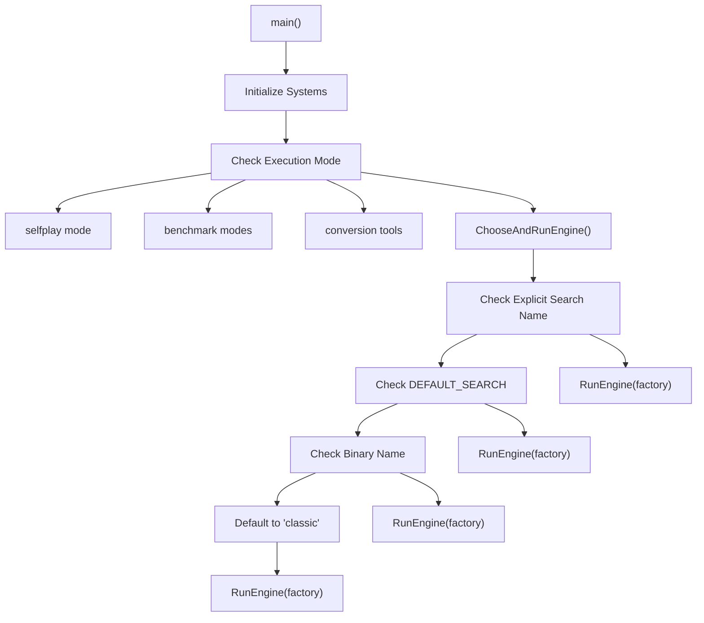
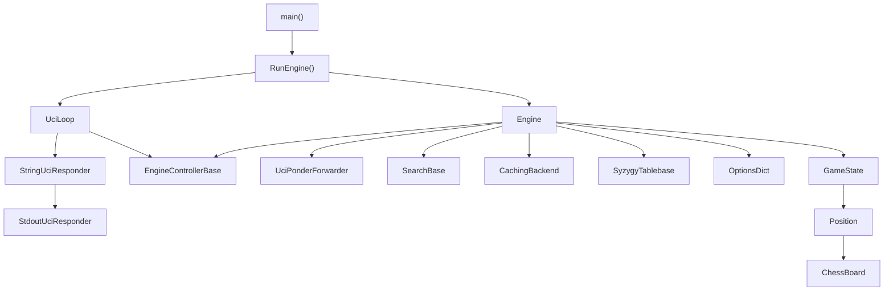
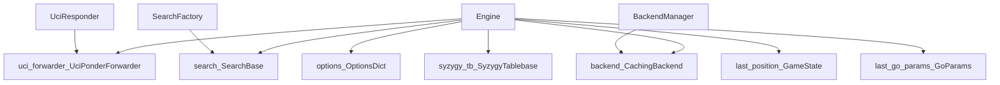
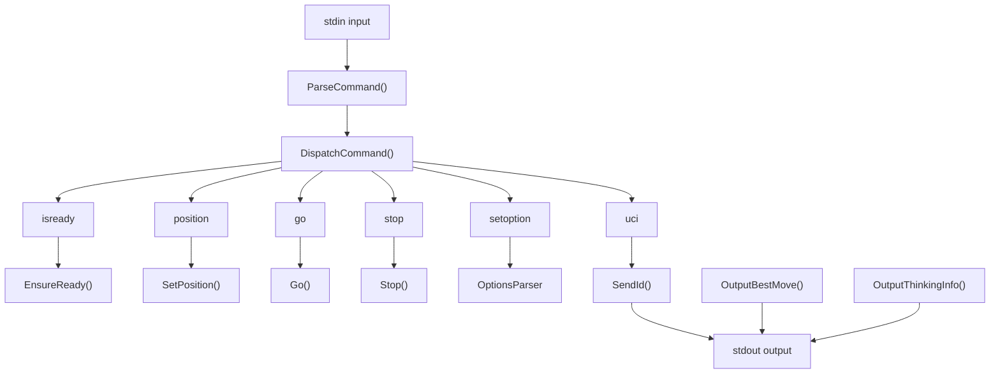
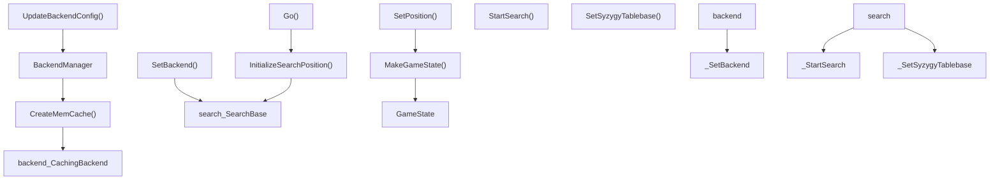
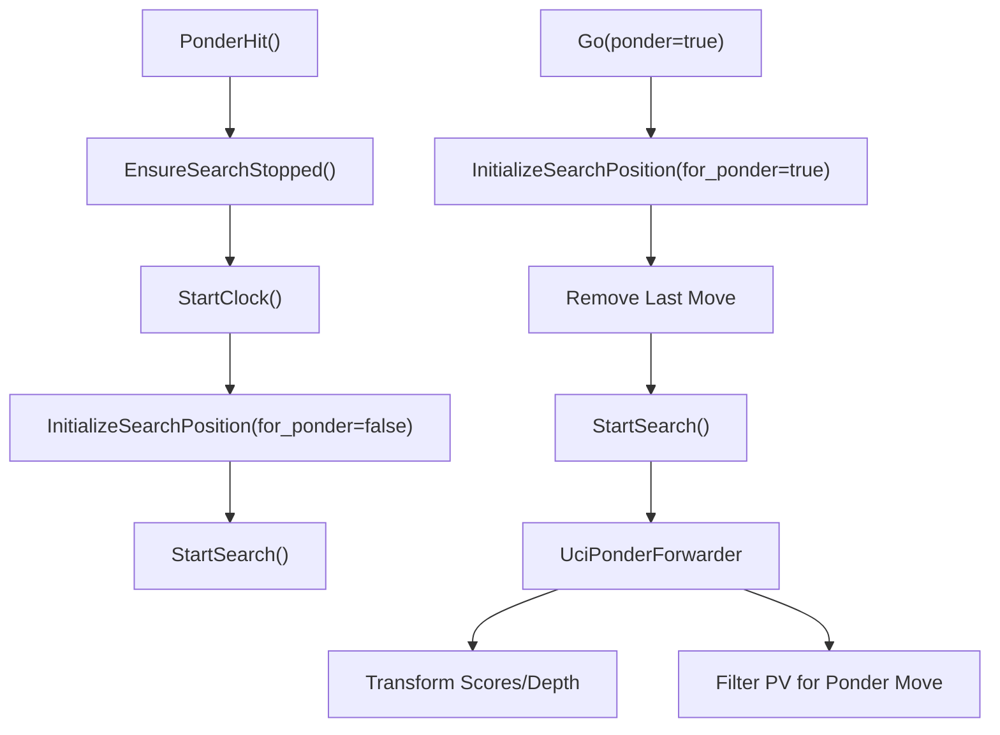
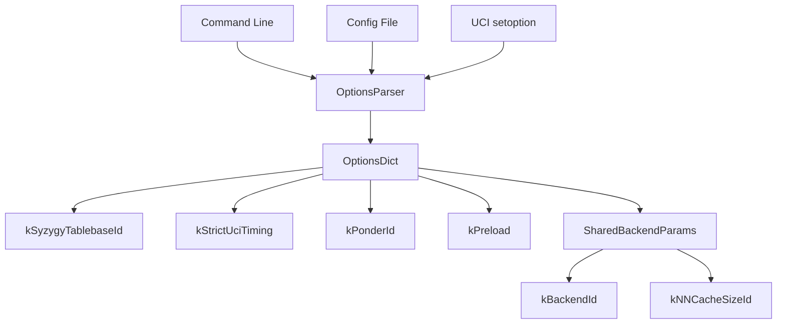

# 核心引擎架构

相关源文件

-   [src/chess/callbacks.h](https://github.com/LeelaChessZero/lc0/blob/b4e98c19/src/chess/callbacks.h)
-   [src/chess/uciloop.cc](https://github.com/LeelaChessZero/lc0/blob/b4e98c19/src/chess/uciloop.cc)
-   [src/chess/uciloop.h](https://github.com/LeelaChessZero/lc0/blob/b4e98c19/src/chess/uciloop.h)
-   [src/engine.cc](https://github.com/LeelaChessZero/lc0/blob/b4e98c19/src/engine.cc)
-   [src/engine.h](https://github.com/LeelaChessZero/lc0/blob/b4e98c19/src/engine.h)
-   [src/engine\_loop.cc](https://github.com/LeelaChessZero/lc0/blob/b4e98c19/src/engine_loop.cc)
-   [src/engine\_loop.h](https://github.com/LeelaChessZero/lc0/blob/b4e98c19/src/engine_loop.h)
-   [src/main.cc](https://github.com/LeelaChessZero/lc0/blob/b4e98c19/src/main.cc)
-   [src/selfplay/loop.cc](https://github.com/LeelaChessZero/lc0/blob/b4e98c19/src/selfplay/loop.cc)

本页面描述了 Lc0 的核心引擎架构，包括主要入口点、引擎控制器、UCI 协议处理以及不同子系统之间的协调。重点在于高层架构组件及其交互。

有关神经网络系统的详细信息，请参阅 [神经网络系统](/LeelaChessZero/lc0/6-neural-network-system)。有关搜索算法实现的信息，请参阅 [搜索算法](/LeelaChessZero/lc0/5-search-algorithm)。有关 UCI 协议的具体内容，请参阅 [UCI 协议实现](/LeelaChessZero/lc0/3.1-uci-protocol-implementation)。

## 系统概览

Lc0 引擎遵循模块化架构，其中核心引擎充当 UCI 协议层、搜索算法、神经网络后端和国际象棋游戏逻辑之间的协调者。该架构支持多种执行模式，包括标准 UCI 引擎操作、自对弈锦标赛和各种实用工具。

## 主要入口点与引擎选择

应用程序从 `main()` 启动，它初始化核心系统并确定使用哪种执行模式。主要的引擎选择逻辑位于 `ChooseAndRunEngine()` 中。

### 引擎选择流程

**来源：** [src/main.cc44-75](https://github.com/LeelaChessZero/lc0/blob/b4e98c19/src/main.cc#L44-L75) [src/main.cc78-140](https://github.com/LeelaChessZero/lc0/blob/b4e98c19/src/main.cc#L78-L140)

## 核心引擎架构组件

引擎架构由几个关键层组成，它们协同工作以提供符合 UCI 标准的国际象棋引擎功能。

### 架构概览

**来源：** [src/engine\_loop.cc47-82](https://github.com/LeelaChessZero/lc0/blob/b4e98c19/src/engine_loop.cc#L47-L82) [src/engine.cc147-155](https://github.com/LeelaChessZero/lc0/blob/b4e98c19/src/engine.cc#L147-L155) [src/chess/uciloop.cc166-172](https://github.com/LeelaChessZero/lc0/blob/b4e98c19/src/chess/uciloop.cc#L166-L172)

## 引擎类设计

`Engine` 类实现了 `EngineControllerBase` 并作为所有引擎操作的主要协调者。它管理搜索、后端配置和游戏状态的生命周期。

### 引擎组件关系

**来源：** [src/engine.h40-87](https://github.com/LeelaChessZero/lc0/blob/b4e98c19/src/engine.h#L40-L87) [src/engine.cc147-155](https://github.com/LeelaChessZero/lc0/blob/b4e98c19/src/engine.cc#L147-L155)

## UCI 协议集成

UCI 协议处理通过分层方法实现，其中 `UciLoop` 处理命令并将引擎操作委托给 `EngineControllerBase` 的实现。

### UCI 命令流程

**来源：** [src/chess/uciloop.cc174-250](https://github.com/LeelaChessZero/lc0/blob/b4e98c19/src/chess/uciloop.cc#L174-L250) [src/chess/uciloop.cc80-131](https://github.com/LeelaChessZero/lc0/blob/b4e98c19/src/chess/uciloop.cc#L80-L131)

## 引擎生命周期与状态管理

引擎管理多种类型的状态，并协调不同操作之间的更新。

### 引擎状态管理

| 状态组件 | 类型 | 目的 | 更新触发器 |
| --- | --- | --- | --- |
| `ponder_enabled_` | `bool` | Ponder (后台思考) 支持标志 | `SetPosition()` |
| `strict_uci_timing_` | `bool` | UCI 计时模式 | `SetPosition()` |
| `last_position_` | `GameState` | 当前游戏局面 | `SetPosition()`, `NewGame()` |
| `last_go_params_` | `GoParams` | 上一次搜索参数 | `Go()` |
| `backend_name_` | `string` | 活跃后端名称 | `UpdateBackendConfig()` |
| `previous_tb_paths_` | `string` | 残局库路径 | `EnsureSyzygyTablebasesLoaded()` |

**来源：** [src/engine.h76-86](https://github.com/LeelaChessZero/lc0/blob/b4e98c19/src/engine.h#L76-L86) [src/engine.cc217-225](https://github.com/LeelaChessZero/lc0/blob/b4e98c19/src/engine.cc#L217-L225)

## 后端与搜索集成

引擎通过定义良好的接口协调搜索算法与神经网络后端。

### 集成流程

**来源：** [src/engine.cc164-177](https://github.com/LeelaChessZero/lc0/blob/b4e98c19/src/engine.cc#L164-L177) [src/engine.cc215-225](https://github.com/LeelaChessZero/lc0/blob/b4e98c19/src/engine.cc#L215-L225) [src/engine.cc233-242](https://github.com/LeelaChessZero/lc0/blob/b4e98c19/src/engine.cc#L233-L242)

## Ponder (后台思考) 支持

引擎通过 `UciPonderForwarder` 类提供了复杂的 Ponder 支持，该类为 Ponder 模式转换搜索输出。

### Ponder 实现

**来源：** [src/engine.cc91-145](https://github.com/LeelaChessZero/lc0/blob/b4e98c19/src/engine.cc#L91-L145) [src/engine.cc249-257](https://github.com/LeelaChessZero/lc0/blob/b4e98c19/src/engine.cc#L249-L257) [src/engine.cc200-213](https://github.com/LeelaChessZero/lc0/blob/b4e98c19/src/engine.cc#L200-L213)

## 配置与选项管理

引擎使用一个复杂的选项系统，该系统集成了来自多个来源的配置，包括命令行、UCI 选项和配置文件。

### 选项集成

**来源：** [src/engine.cc41-72](https://github.com/LeelaChessZero/lc0/blob/b4e98c19/src/engine.cc#L41-L72) [src/engine\_loop.cc51-63](https://github.com/LeelaChessZero/lc0/blob/b4e98c19/src/engine_loop.cc#L51-L63)
