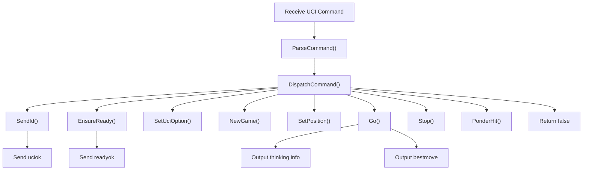
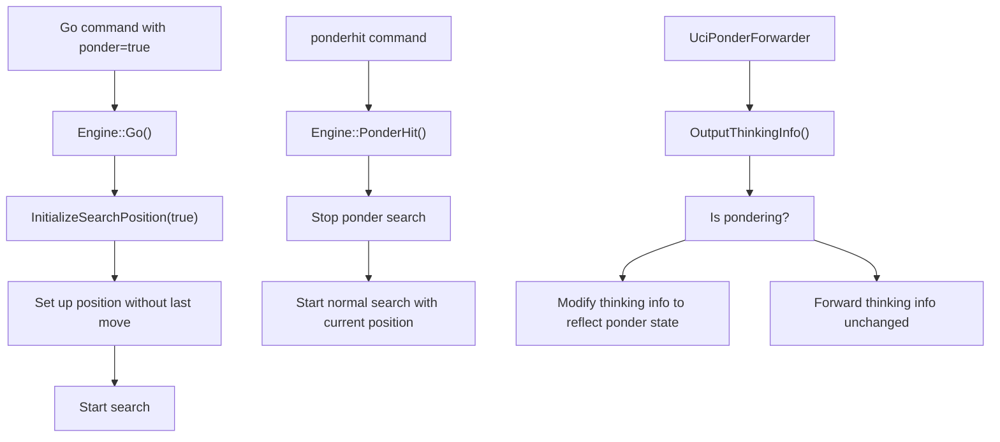
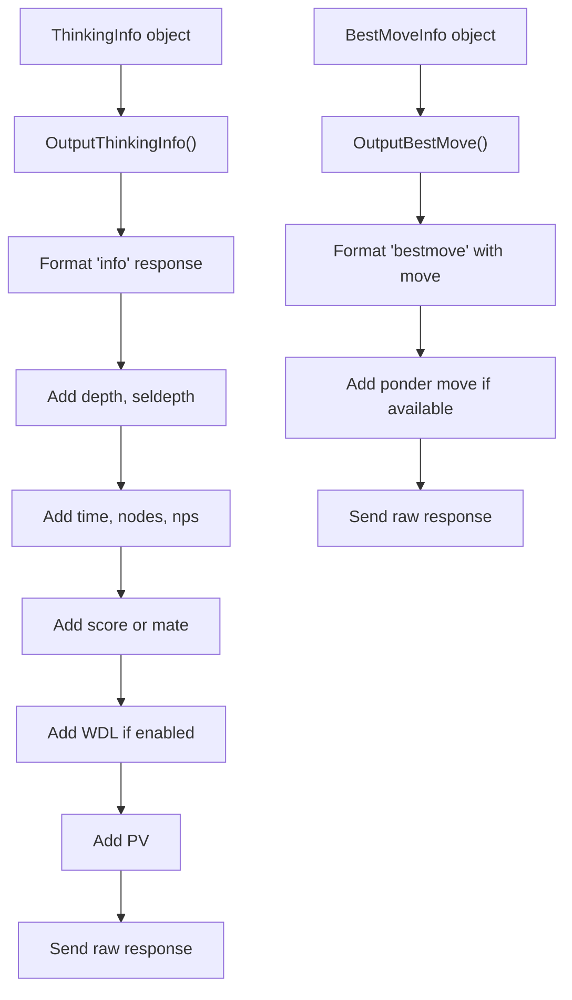
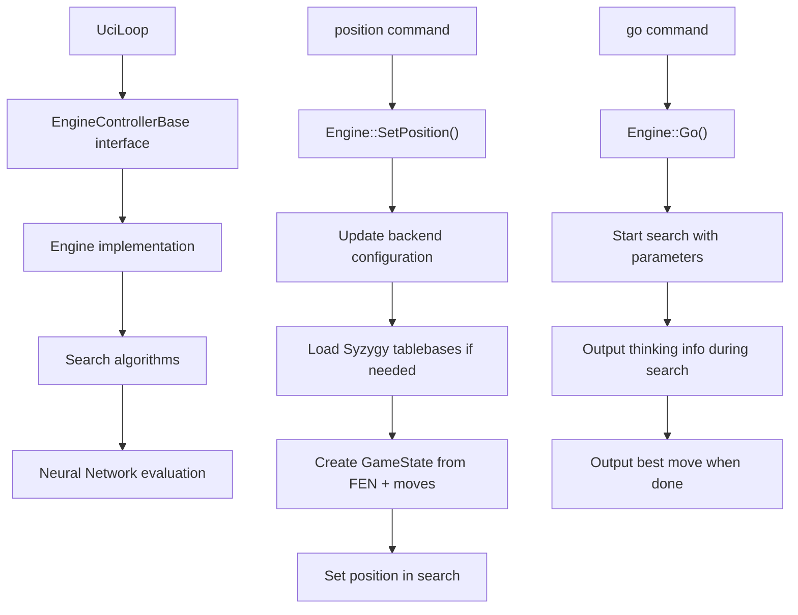
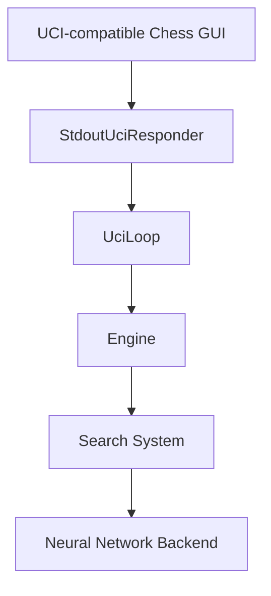
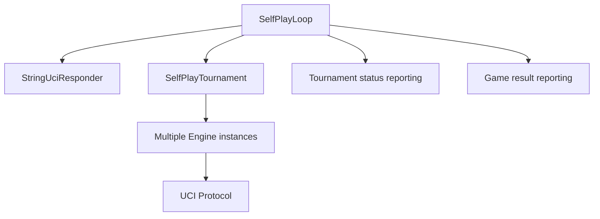

# UCI 协议实现

相关源文件

-   [src/chess/callbacks.h](https://github.com/LeelaChessZero/lc0/blob/b4e98c19/src/chess/callbacks.h)
-   [src/chess/uciloop.cc](https://github.com/LeelaChessZero/lc0/blob/b4e98c19/src/chess/uciloop.cc)
-   [src/chess/uciloop.h](https://github.com/LeelaChessZero/lc0/blob/b4e98c19/src/chess/uciloop.h)
-   [src/engine.cc](https://github.com/LeelaChessZero/lc0/blob/b4e98c19/src/engine.cc)
-   [src/engine.h](https://github.com/LeelaChessZero/lc0/blob/b4e98c19/src/engine.h)
-   [src/selfplay/loop.cc](https://github.com/LeelaChessZero/lc0/blob/b4e98c19/src/selfplay/loop.cc)

本文档详细介绍了 Leela Chess Zero (lc0) 如何实现通用国际象棋接口 (UCI) 协议，该协议实现了国际象棋引擎与用户界面或其他控制进程之间的通信。有关引擎配置选项的信息，请参阅 [配置系统](/LeelaChessZero/lc0/3.2-configuration-system)。

## UCI 协议概览

通用国际象棋接口 (UCI) 是一种基于文本的协议，它定义了国际象棋引擎如何与用户界面进行通信。Lc0 实现了该协议，以允许与兼容 UCI 的国际象棋 GUI 无缝集成，并促进自动化测试和锦标赛。

来源：[src/chess/uciloop.cc148-218](https://github.com/LeelaChessZero/lc0/blob/b4e98c19/src/chess/uciloop.cc#L148-L218) [src/engine.cc209-235](https://github.com/LeelaChessZero/lc0/blob/b4e98c19/src/engine.cc#L209-L235)

## UCI 协议实现架构

Lc0 中的 UCI 实现围绕几个关键类组织，这些类协同工作以处理通信和处理命令。

来源：[src/chess/uciloop.h41-124](https://github.com/LeelaChessZero/lc0/blob/b4e98c19/src/chess/uciloop.h#L41-L124) [src/engine.h40-85](https://github.com/LeelaChessZero/lc0/blob/b4e98c19/src/engine.h#L40-L85) [src/chess/callbacks.h41-147](https://github.com/LeelaChessZero/lc0/blob/b4e98c19/src/chess/callbacks.h#L41-L147)

## 命令处理流程

当接收到一个 UCI 命令时，它会经过几个处理步骤：

1.  `UciLoop` 类接收命令文本
2.  命令被解析为命令名称和参数映射
3.  在 `EngineControllerBase` 对象上调用相应的方法
4.  引擎处理命令并可能生成响应
5.  响应通过 `StringUciResponder` 发送回

来源：[src/chess/uciloop.cc104-136](https://github.com/LeelaChessZero/lc0/blob/b4e98c19/src/chess/uciloop.cc#L104-L136) [src/chess/uciloop.cc147-218](https://github.com/LeelaChessZero/lc0/blob/b4e98c19/src/chess/uciloop.cc#L147-L218)

## 支持的 UCI 命令

Lc0 支持标准的 UCI 协议命令：

| 命令 | 描述 | 实现 |
| --- | --- | --- |
| `uci` | 初始化 UCI 协议 | 发送引擎标识和可用选项 |
| `isready` | 检查引擎是否就绪 | 确保引擎就绪并响应 |
| `setoption name [name] value [value]` | 设置引擎选项 | 更新指定的引擎选项 |
| `ucinewgame` | 准备新对局 | 重置引擎状态 |
| `position [fen/startpos] moves ...` | 设置当前局面 | 设置棋盘局面 |
| `go [parameters]` | 开始搜索 | 使用指定参数开始搜索 |
| `stop` | 停止搜索 | 停止当前搜索 |
| `ponderhit` | 对手走了预期的着法 | 将 ponder 搜索转换为正常搜索 |
| `quit` | 终止引擎 | 退出 UCI 循环 |

来源：[src/chess/uciloop.cc69-70](https://github.com/LeelaChessZero/lc0/blob/b4e98c19/src/chess/uciloop.cc#L69-L70) [src/chess/uciloop.cc147-218](https://github.com/LeelaChessZero/lc0/blob/b4e98c19/src/chess/uciloop.cc#L147-L218)

## Go 参数

`go` 命令可以包含各种参数来控制搜索：

来源：[src/chess/uciloop.h42-55](https://github.com/LeelaChessZero/lc0/blob/b4e98c19/src/chess/uciloop.h#L42-L55) [src/chess/uciloop.cc173-205](https://github.com/LeelaChessZero/lc0/blob/b4e98c19/src/chess/uciloop.cc#L173-L205)

## 响应处理

Lc0 向 UCI 接口发送两种主要类型的响应：

1.  **思考信息 (Thinking information)** - 在搜索期间使用 `info` 命令定期发送
2.  **最佳着法 (Best move)** - 搜索完成后使用 `bestmove` 命令发送

引擎通过以下结构实现这些响应：

来源：[src/chess/callbacks.h42-55](https://github.com/LeelaChessZero/lc0/blob/b4e98c19/src/chess/callbacks.h#L42-L55) [src/chess/callbacks.h57-100](https://github.com/LeelaChessZero/lc0/blob/b4e98c19/src/chess/callbacks.h#L57-L100) [src/chess/uciloop.cc247-256](https://github.com/LeelaChessZero/lc0/blob/b4e98c19/src/chess/uciloop.cc#L247-L256) [src/chess/uciloop.cc258-294](https://github.com/LeelaChessZero/lc0/blob/b4e98c19/src/chess/uciloop.cc#L258-L294)

## Ponder (后台思考) 实现

Ponder 是指引擎在对手的时间内进行思考的功能。Lc0 通过一个名为 `UciPonderForwarder` 的专用响应类来实现 Ponder：

来源：[src/engine.cc84-138](https://github.com/LeelaChessZero/lc0/blob/b4e98c19/src/engine.cc#L84-L138) [src/engine.cc192-249](https://github.com/LeelaChessZero/lc0/blob/b4e98c19/src/engine.cc#L192-L249)

## UCI 响应格式化

`StringUciResponder` 类负责根据协议规范格式化 UCI 响应：

来源：[src/chess/uciloop.cc247-256](https://github.com/LeelaChessZero/lc0/blob/b4e98c19/src/chess/uciloop.cc#L247-L256) [src/chess/uciloop.cc258-294](https://github.com/LeelaChessZero/lc0/blob/b4e98c19/src/chess/uciloop.cc#L258-L294)

## 扩展功能

Lc0 实现了对标准 UCI 协议的几个扩展：

1.  **UCI\_Chess960**: 支持 Chess960 (菲舍尔随机棋) 的选项
2.  **UCI\_ShowWDL**: 在引擎输出中显示 胜/和/负 (win/draw/loss) 概率的选项
3.  **UCI\_ShowMovesLeft**: 显示估计的剩余步数的选项
4.  **Player/Game ID extensions**: 思考信息和最佳着法信息中的附加字段

来源：[src/chess/uciloop.cc48-54](https://github.com/LeelaChessZero/lc0/blob/b4e98c19/src/chess/uciloop.cc#L48-L54) [src/chess/uciloop.cc227-231](https://github.com/LeelaChessZero/lc0/blob/b4e98c19/src/chess/uciloop.cc#L227-L231) [src/chess/callbacks.h48-54](https://github.com/LeelaChessZero/lc0/blob/b4e98c19/src/chess/callbacks.h#L48-L54) [src/chess/callbacks.h91-99](https://github.com/LeelaChessZero/lc0/blob/b4e98c19/src/chess/callbacks.h#L91-L99)

## 与引擎集成

UCI 协议通过 `Engine` 类与主引擎交互，该类实现了 `EngineControllerBase` 接口：

来源：[src/engine.cc209-235](https://github.com/LeelaChessZero/lc0/blob/b4e98c19/src/engine.cc#L209-L235) [src/engine.cc140-171](https://github.com/LeelaChessZero/lc0/blob/b4e98c19/src/engine.cc#L140-L171)

## 错误处理

UCI 实现包括对无效命令和参数的错误处理：

1.  未知命令抛出异常 "Unknown command: [command]"
2.  无效参数值抛出适当的异常
3.  检测并报告缺失的必需参数

来源：[src/chess/uciloop.cc86-88](https://github.com/LeelaChessZero/lc0/blob/b4e98c19/src/chess/uciloop.cc#L86-L88) [src/chess/uciloop.cc122-130](https://github.com/LeelaChessZero/lc0/blob/b4e98c19/src/chess/uciloop.cc#L122-L130) [src/chess/uciloop.cc166-168](https://github.com/LeelaChessZero/lc0/blob/b4e98c19/src/chess/uciloop.cc#L166-L168)

## 整体通信流程

来源：[src/chess/uciloop.h41-124](https://github.com/LeelaChessZero/lc0/blob/b4e98c19/src/chess/uciloop.h#L41-L124) [src/chess/uciloop.cc139-145](https://github.com/LeelaChessZero/lc0/blob/b4e98c19/src/chess/uciloop.cc#L139-L145) [src/engine.h40-85](https://github.com/LeelaChessZero/lc0/blob/b4e98c19/src/engine.h#L40-L85)

## 自对弈与锦标赛模式

除了标准的 UCI 协议支持外，Lc0 还包括一种自对弈模式，该模式在内部使用 UCI 协议进行组件间的通信：

来源：[src/selfplay/loop.h38-58](https://github.com/LeelaChessZero/lc0/blob/b4e98c19/src/selfplay/loop.h#L38-L58) [src/selfplay/loop.cc49-67](https://github.com/LeelaChessZero/lc0/blob/b4e98c19/src/selfplay/loop.cc#L49-L67)

此自对弈功能用于生成训练数据以及通过内部锦标赛测试引擎。
