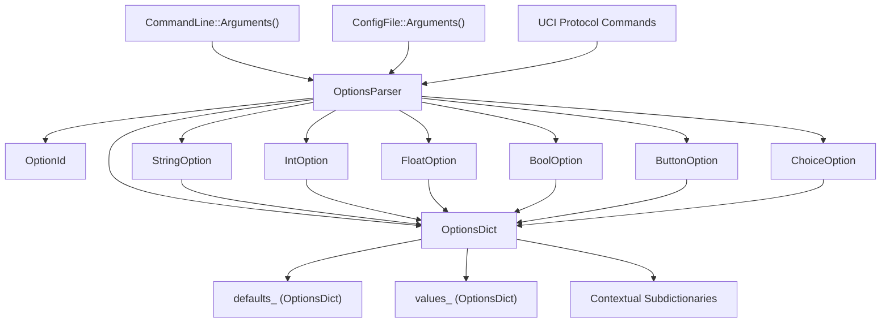
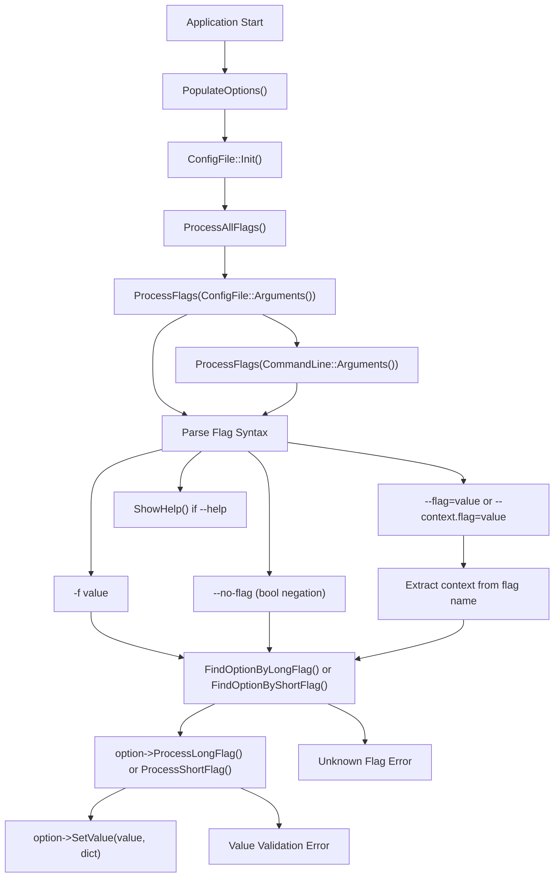
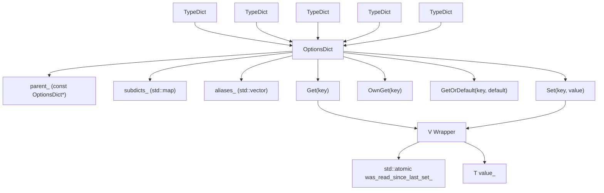
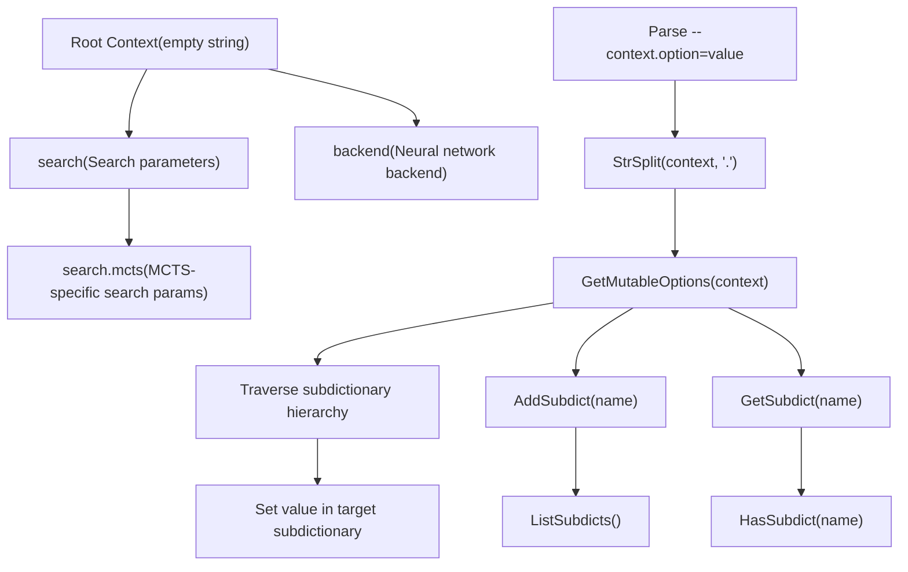
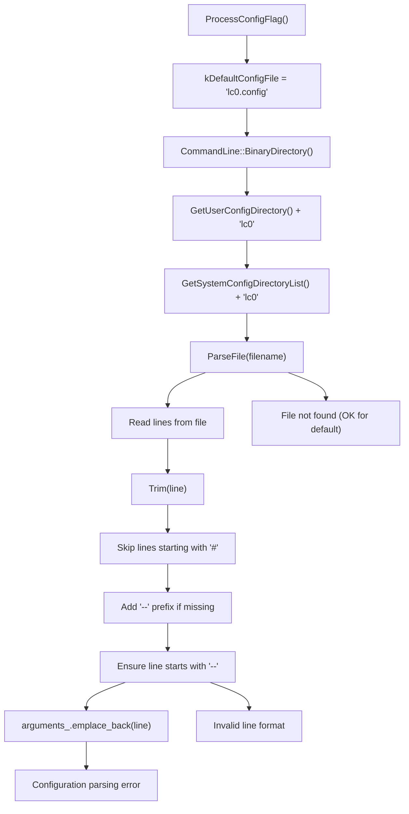

# 配置系统

相关源文件

-   [src/utils/configfile.cc](https://github.com/LeelaChessZero/lc0/blob/b4e98c19/src/utils/configfile.cc)
-   [src/utils/configfile.h](https://github.com/LeelaChessZero/lc0/blob/b4e98c19/src/utils/configfile.h)
-   [src/utils/optionsdict.cc](https://github.com/LeelaChessZero/lc0/blob/b4e98c19/src/utils/optionsdict.cc)
-   [src/utils/optionsdict.h](https://github.com/LeelaChessZero/lc0/blob/b4e98c19/src/utils/optionsdict.h)
-   [src/utils/optionsparser.cc](https://github.com/LeelaChessZero/lc0/blob/b4e98c19/src/utils/optionsparser.cc)
-   [src/utils/optionsparser.h](https://github.com/LeelaChessZero/lc0/blob/b4e98c19/src/utils/optionsparser.h)
-   [src/utils/optionsparser\_test.cc](https://github.com/LeelaChessZero/lc0/blob/b4e98c19/src/utils/optionsparser_test.cc)

## 目的与范围

配置系统为 Leela Chess Zero 中的所有配置参数提供了一个统一的框架。它通过类型安全的层次结构管理命令行参数、UCI 协议选项、配置文件和运行时参数更改。该系统支持多种可见性模式，以适应不同的用户体验水平和上下文参数组织。

有关使用此配置系统的 UCI 协议实现的信息，请参阅 [UCI 协议实现](/LeelaChessZero/lc0/3.1-uci-protocol-implementation)。

## 系统架构

配置系统由四个主要组件组成，它们协同工作以提供灵活的参数管理：

来源：[src/utils/optionsparser.h40-130](https://github.com/LeelaChessZero/lc0/blob/b4e98c19/src/utils/optionsparser.h#L40-L130) [src/utils/optionsdict.h163-268](https://github.com/LeelaChessZero/lc0/blob/b4e98c19/src/utils/optionsdict.h#L163-L268) [src/utils/configfile.h37-48](https://github.com/LeelaChessZero/lc0/blob/b4e98c19/src/utils/configfile.h#L37-L48)

## 选项类型层次结构

系统支持六种不同的选项类型，每种类型都有特定的验证和处理逻辑：

```mermaid
flowchart TD
    BaseOption["Option (Abstract)"]
    StringOption["StringOptionValueType: std::string"]
    IntOption["IntOptionValueType: intRange: min_ to max_"]
    FloatOption["FloatOptionValueType: floatRange: min_ to max_"]
    BoolOption["BoolOptionValueType: boolSupports: --flag, --no-flag"]
    ButtonOption["ButtonOptionValueType: ButtonUCI: type button"]
    ChoiceOption["ChoiceOptionValueType: std::stringChoices: choices_ vector"]
    ProcessLongFlag["ProcessLongFlag()"]
    ProcessShortFlag["ProcessShortFlag()"]
    ProcessShortFlagWithValue["ProcessShortFlagWithValue()"]
    SetValue["SetValue()"]
    GetOptionString["GetOptionString()"]

    BaseOption --> StringOption
    BaseOption --> IntOption
    BaseOption --> FloatOption
    BaseOption --> BoolOption
    BaseOption --> ButtonOption
    BaseOption --> ChoiceOption
    StringOption --> ProcessLongFlag
    StringOption --> ProcessShortFlagWithValue
    StringOption --> SetValue
    StringOption --> GetOptionString
    IntOption --> ProcessLongFlag
    IntOption --> ProcessShortFlagWithValue
    IntOption --> SetValue
    IntOption --> GetOptionString
    FloatOption --> ProcessLongFlag
    FloatOption --> ProcessShortFlagWithValue
    FloatOption --> SetValue
    FloatOption --> GetOptionString
    BoolOption --> ProcessLongFlag
    BoolOption --> ProcessShortFlag
    BoolOption --> SetValue
    BoolOption --> GetOptionString
    ButtonOption --> SetValue
    ButtonOption --> GetOptionString
    ChoiceOption --> ProcessLongFlag
    ChoiceOption --> ProcessShortFlagWithValue
    ChoiceOption --> SetValue
    ChoiceOption --> GetOptionString
```

来源：[src/utils/optionsparser.h132-252](https://github.com/LeelaChessZero/lc0/blob/b4e98c19/src/utils/optionsparser.h#L132-L252) [src/utils/optionsparser.cc287-660](https://github.com/LeelaChessZero/lc0/blob/b4e98c19/src/utils/optionsparser.cc#L287-L660)

## 配置处理流程

系统按特定顺序处理来自多个来源的配置，较后的来源会覆盖较早的来源：

来源：[src/utils/optionsparser.cc116-200](https://github.com/LeelaChessZero/lc0/blob/b4e98c19/src/utils/optionsparser.cc#L116-L200) [src/utils/configfile.cc83-96](https://github.com/LeelaChessZero/lc0/blob/b4e98c19/src/utils/configfile.cc#L83-L96)

## OptionsDict 存储架构

`OptionsDict` 类提供了一个具有继承和别名功能的层次化、类型安全的存储系统：

来源：[src/utils/optionsdict.h42-93](https://github.com/LeelaChessZero/lc0/blob/b4e98c19/src/utils/optionsdict.h#L42-L93) [src/utils/optionsdict.h163-267](https://github.com/LeelaChessZero/lc0/blob/b4e98c19/src/utils/optionsdict.h#L163-L267) [src/utils/optionsdict.h270-372](https://github.com/LeelaChessZero/lc0/blob/b4e98c19/src/utils/optionsdict.h#L270-L372)

## 选项可见性系统

配置系统支持三种可见性模式，以提供不同的用户体验水平：

| 可见性模式 | 掩码值 | 描述 | 用法 |
| --- | --- | --- | --- |
| `kSimpleMode` | `1 << 0` | 仅基本选项 | 初级用户 |
| `kNormalMode` | `1 << 1` | 标准选项 | 默认模式 |
| `kProMode` | `1 << 2` | 包括高级选项的所有选项 | 专家用户 |

### 可见性掩码

| 掩码 | 值 | 可见于 |
| --- | --- | --- |
| `kSimpleOnly` | `kSimpleMode` | 仅简单模式 |
| `kDefaultVisibility` | `kNormalMode | kProMode` | 正常和专业模式 |
| `kProOnly` | `kProMode` | 仅专业模式 |
| `kAlwaysVisible` | `kSimpleMode | kNormalMode | kProMode` | 所有模式 |

可见性模式由二进制文件名称或命令行标志确定：

-   二进制名称包含 "simple" → `kSimpleMode`
-   二进制名称包含 "pro" → `kProMode`
-   `--show-hidden` 标志 → `kProMode`
-   默认 → `kNormalMode`

来源：[src/utils/optionsdict.h95-147](https://github.com/LeelaChessZero/lc0/blob/b4e98c19/src/utils/optionsdict.h#L95-L147) [src/utils/optionsparser.cc123-133](https://github.com/LeelaChessZero/lc0/blob/b4e98c19/src/utils/optionsparser.cc#L123-L133)

## 上下文配置

系统使用点号表示法支持层次化的配置上下文：

来源：[src/utils/optionsparser.cc98-114](https://github.com/LeelaChessZero/lc0/blob/b4e98c19/src/utils/optionsparser.cc#L98-L114) [src/utils/optionsdict.cc39-78](https://github.com/LeelaChessZero/lc0/blob/b4e98c19/src/utils/optionsdict.cc#L39-L78)

## 配置文件处理

配置文件系统为参数提供具有灵活位置发现功能的持久存储：

来源：[src/utils/configfile.cc58-160](https://github.com/LeelaChessZero/lc0/blob/b4e98c19/src/utils/configfile.cc#L58-L160) [src/utils/configfile.h37-58](https://github.com/LeelaChessZero/lc0/blob/b4e98c19/src/utils/configfile.h#L37-L58)

## 与其他系统的集成

配置系统与 Leela Chess Zero 引擎的多个组件集成：

| 集成点 | 描述 | 关键方法 |
| --- | --- | --- |
| **UCI Protocol** | 将选项公开为 UCI 参数 | `ListOptionsUci()`, `SetUciOption()` |
| **Command Line** | 处理启动参数 | `ProcessAllFlags()`, `CommandLine::Arguments()` |
| **Engine Options** | 提供运行时参数访问 | `GetOptionsDict()`, `Get<T>()` |
| **Help System** | 生成格式化的帮助输出 | `ShowHelp()`, `GetHelp()` |
| **Validation** | 确保参数正确性 | `ValidateIntString()`, `SetVal()` |

该系统充当中央配置中心，允许所有引擎组件通过一致的接口访问其参数，同时保持类型安全和验证。

来源：[src/utils/optionsparser.cc51-72](https://github.com/LeelaChessZero/lc0/blob/b4e98c19/src/utils/optionsparser.cc#L51-L72) [src/utils/optionsparser.cc257-285](https://github.com/LeelaChessZero/lc0/blob/b4e98c19/src/utils/optionsparser.cc#L257-L285) [src/utils/optionsparser.h95-116](https://github.com/LeelaChessZero/lc0/blob/b4e98c19/src/utils/optionsparser.h#L95-L116)
