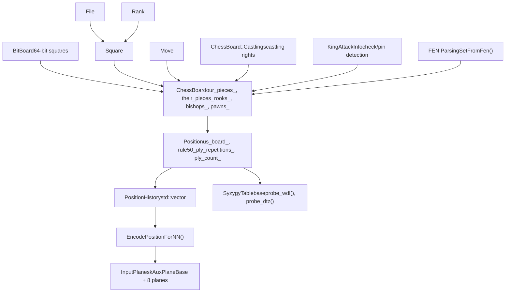
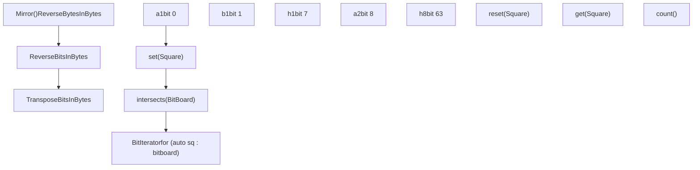
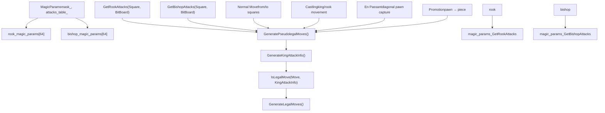
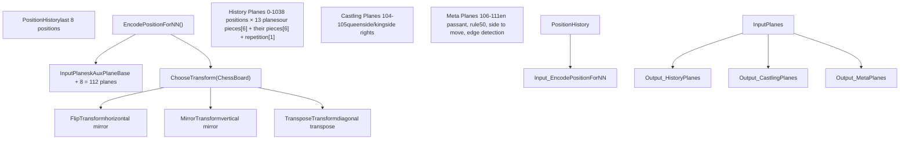
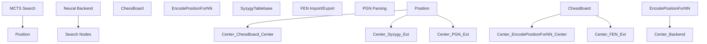

# 棋局表示

相关源文件

-   [src/chess/bitboard.h](https://github.com/LeelaChessZero/lc0/blob/b4e98c19/src/chess/bitboard.h)
-   [src/chess/board.cc](https://github.com/LeelaChessZero/lc0/blob/b4e98c19/src/chess/board.cc)
-   [src/chess/board.h](https://github.com/LeelaChessZero/lc0/blob/b4e98c19/src/chess/board.h)
-   [src/chess/board\_test.cc](https://github.com/LeelaChessZero/lc0/blob/b4e98c19/src/chess/board_test.cc)
-   [src/chess/position.cc](https://github.com/LeelaChessZero/lc0/blob/b4e98c19/src/chess/position.cc)
-   [src/chess/position.h](https://github.com/LeelaChessZero/lc0/blob/b4e98c19/src/chess/position.h)
-   [src/chess/position\_test.cc](https://github.com/LeelaChessZero/lc0/blob/b4e98c19/src/chess/position_test.cc)
-   [src/neural/encoder.cc](https://github.com/LeelaChessZero/lc0/blob/b4e98c19/src/neural/encoder.cc)
-   [src/neural/encoder.h](https://github.com/LeelaChessZero/lc0/blob/b4e98c19/src/neural/encoder.h)
-   [src/neural/encoder\_test.cc](https://github.com/LeelaChessZero/lc0/blob/b4e98c19/src/neural/encoder_test.cc)
-   [src/syzygy/syzygy.cc](https://github.com/LeelaChessZero/lc0/blob/b4e98c19/src/syzygy/syzygy.cc)
-   [src/syzygy/syzygy.h](https://github.com/LeelaChessZero/lc0/blob/b4e98c19/src/syzygy/syzygy.h)
-   [src/syzygy/syzygy\_test.cc](https://github.com/LeelaChessZero/lc0/blob/b4e98c19/src/syzygy/syzygy_test.cc)
-   [src/utils/bititer.h](https://github.com/LeelaChessZero/lc0/blob/b4e98c19/src/utils/bititer.h)

本文档涵盖了 lc0 引擎中棋局、走法和游戏状态的内部表示。它解释了用于高效表示和操作棋局以进行搜索和神经网络评估的核心数据结构和算法。

有关走法生成算法和位棋盘操作的信息，请参阅 [位棋盘与走法生成](/LeelaChessZero/lc0/4.1-bitboards-and-move-generation)。有关神经网络的局面编码和历史管理详情，请参阅 [局面编码与历史](/LeelaChessZero/lc0/4.2-position-encoding-and-history)。有关残局库集成的信息，请参阅 [Syzygy 残局库集成](/LeelaChessZero/lc0/4.3-syzygy-tablebase-integration)。

## 核心表示架构

棋局表示系统是分层构建的，从低级的位棋盘操作一直到神经网络输入编码：

来源：[src/chess/board.h59-253](https://github.com/LeelaChessZero/lc0/blob/b4e98c19/src/chess/board.h#L59-L253) [src/chess/position.h38-90](https://github.com/LeelaChessZero/lc0/blob/b4e98c19/src/chess/position.h#L38-L90) [src/chess/bitboard.h40-162](https://github.com/LeelaChessZero/lc0/blob/b4e98c19/src/chess/bitboard.h#L40-L162) [src/neural/encoder.h34-68](https://github.com/LeelaChessZero/lc0/blob/b4e98c19/src/neural/encoder.h#L34-L68)

## 位棋盘 (BitBoard) 基础

`BitBoard` 类提供了基础的 64 位表示，其中每一位对应一个棋盘格：

关键特征：

-   **方格映射**: 方格 a1 = bit 0, h1 = bit 7, a2 = bit 8, h8 = bit 63
-   **高效操作**: 用于棋子交互的按位与/或运算，用于棋子计数的种群计数 (population count)
-   **迭代支持**: `BitIterator` 允许对设置的方格进行基于范围的循环
-   **棋盘变换**: 支持镜像和翻转以进行规范化

来源：[src/chess/bitboard.h40-162](https://github.com/LeelaChessZero/lc0/blob/b4e98c19/src/chess/bitboard.h#L40-L162) [src/utils/bititer.h92-123](https://github.com/LeelaChessZero/lc0/blob/b4e98c19/src/utils/bititer.h#L92-L123)

## ChessBoard 类结构

`ChessBoard` 类使用多个位棋盘表示完整的国际象棋局面：

```mermaid
flowchart TD
    our_pieces_["our_pieces_BitBoard"]
    their_pieces_["their_pieces_BitBoard"]
    rooks_["rooks_BitBoard"]
    bishops_["bishops_BitBoard"]
    pawns_["pawns_BitBoard"]
    our_king_["our_king_Square"]
    their_king_["their_king_Square"]
    castlings_["castlings_Castlings"]
    flipped_["flipped_bool"]
    GeneratePseudolegalMoves["GeneratePseudolegalMoves()→ MoveList"]
    ApplyMove["ApplyMove(Move)→ bool"]
    IsUnderAttack["IsUnderAttack(Square)→ bool"]
    SetFromFen["SetFromFen(string_view)"]

    our --> pieces__GeneratePseudolegalMoves
    rooks --> _GeneratePseudolegalMoves
    bishops --> _GeneratePseudolegalMoves
    pawns --> _GeneratePseudolegalMoves
    our --> king__IsUnderAttack
    castlings --> _GeneratePseudolegalMoves
    GeneratePseudolegalMoves --> ApplyMove
    ApplyMove --> flipped_
```

关键设计原则：

-   **镜像表示**: `flipped_` 表示轮到黑方走棋；棋盘总是从当前走棋方的视角表示
-   **重叠位棋盘**: 后表示为 `rooks_ & bishops_`，马表示为剩余的棋子
-   **特殊吃过路兵编码**: 使用 `pawns_` 位棋盘的第 1 行和第 8 行作为吃过路兵标志

来源：[src/chess/board.h59-253](https://github.com/LeelaChessZero/lc0/blob/b4e98c19/src/chess/board.h#L59-L253) [src/chess/board.cc54-68](https://github.com/LeelaChessZero/lc0/blob/b4e98c19/src/chess/board.cc#L54-L68)

## 局面与游戏上下文

`Position` 类封装了 `ChessBoard` 以及正确执行国际象棋规则所需的额外游戏状态：

```mermaid
flowchart TD
    us_board_["us_board_ChessBoard"]
    rule50_ply_["rule50_ply_int"]
    repetitions_["repetitions_int"]
    cycle_length_["cycle_length_int"]
    ply_count_["ply_count_int"]
    positions_["std::vectorpositions_"]
    Append["Append(Move)"]
    ComputeLastMoveRepetitions["ComputeLastMoveRepetitions()"]
    ComputeGameResult["ComputeGameResult()"]
    Checkmate["Checkmateno legal moves + in check"]
    Stalemate["Stalemateno legal moves + not in check"]
    FiftyMove["50-move rulerule50_ply >= 100"]
    Repetition["Threefold repetitionrepetitions >= 2"]

    us --> board__positions_
    rule50 --> ply__positions_
    repetitions --> _positions_
    positions --> _Append
    Append --> ComputeLastMoveRepetitions
    ComputeLastMoveRepetitions --> repetitions_
    positions --> _ComputeGameResult
    ComputeGameResult --> Checkmate
    ComputeGameResult --> Stalemate
    ComputeGameResult --> FiftyMove
    ComputeGameResult --> Repetition
```

来源：[src/chess/position.h38-159](https://github.com/LeelaChessZero/lc0/blob/b4e98c19/src/chess/position.h#L38-L159) [src/chess/position.cc75-158](https://github.com/LeelaChessZero/lc0/blob/b4e98c19/src/chess/position.cc#L75-L158)

## 走法表示与生成

走法生成和表示使用魔术位棋盘 (magic bitboards) 进行高效的滑子攻击计算：

来源：[src/chess/board.cc183-427](https://github.com/LeelaChessZero/lc0/blob/b4e98c19/src/chess/board.cc#L183-L427) [src/chess/board.cc429-574](https://github.com/LeelaChessZero/lc0/blob/b4e98c19/src/chess/board.cc#L429-L574) [src/chess/board.cc733-857](https://github.com/LeelaChessZero/lc0/blob/b4e98c19/src/chess/board.cc#L733-L857)

## 神经网络编码

编码系统将国际象棋局面转换为神经网络输入平面：

关键编码特征：

-   **总共 112 个平面**: 8 个局面 × 每个局面 13 个平面 + 8 个辅助平面
-   **棋子编码**: 双方每种棋子类型都有独立的平面
-   **规范化**: 棋盘变换以减少训练的输入空间
-   **多种格式**: 支持具有不同特征的多种网络输入格式

来源：[src/neural/encoder.cc134-337](https://github.com/LeelaChessZero/lc0/blob/b4e98c19/src/neural/encoder.cc#L134-L337) [src/neural/encoder.h38-68](https://github.com/LeelaChessZero/lc0/blob/b4e98c19/src/neural/encoder.h#L38-L68)

## 集成点

棋局表示与其他引擎组件集成：

来源：[src/chess/board.h255-257](https://github.com/LeelaChessZero/lc0/blob/b4e98c19/src/chess/board.h#L255-L257) [src/chess/position.h92-157](https://github.com/LeelaChessZero/lc0/blob/b4e98c19/src/chess/position.h#L92-L157) [src/syzygy/syzygy.h58-111](https://github.com/LeelaChessZero/lc0/blob/b4e98c19/src/syzygy/syzygy.h#L58-L111)
