# 位棋盘 (Bitboards)

相关源文件

-   [src/chess/bitboard.h](https://github.com/LeelaChessZero/lc0/blob/b4e98c19/src/chess/bitboard.h)
-   [src/syzygy/syzygy.cc](https://github.com/LeelaChessZero/lc0/blob/b4e98c19/src/syzygy/syzygy.cc)
-   [src/syzygy/syzygy.h](https://github.com/LeelaChessZero/lc0/blob/b4e98c19/src/syzygy/syzygy.h)
-   [src/syzygy/syzygy\_test.cc](https://github.com/LeelaChessZero/lc0/blob/b4e98c19/src/syzygy/syzygy_test.cc)
-   [src/utils/bititer.h](https://github.com/LeelaChessZero/lc0/blob/b4e98c19/src/utils/bititer.h)

## 目的与范围

本文档描述了 Leela Chess Zero (lc0) 中的位棋盘实现。位棋盘是国际象棋引擎中用于高效棋盘表示和走法生成的基础数据结构。本页面涵盖了 `BitBoard` 类、位棋盘操作以及用于高效生成滑子走法的魔术位棋盘 (magic bitboard) 技术。

有关如何为神经网络输入编码局面的信息，请参阅 [局面编码与历史](/LeelaChessZero/lc0/4.2-position-encoding-and-history)。

## 什么是位棋盘？

位棋盘是一个 64 位整数，其中每一位代表棋盘上的一个方格。这种表示允许使用按位与 (AND)、或 (OR) 和异或 (XOR) 等位运算进行高效操作。

在 lc0 中，位枚举从下到上，从左到右：

-   方格 a1 是第 0 位
-   方格 h1 是第 7 位
-   方格 a2 是第 8 位
-   ...以此类推，直到方格 h8 是第 63 位

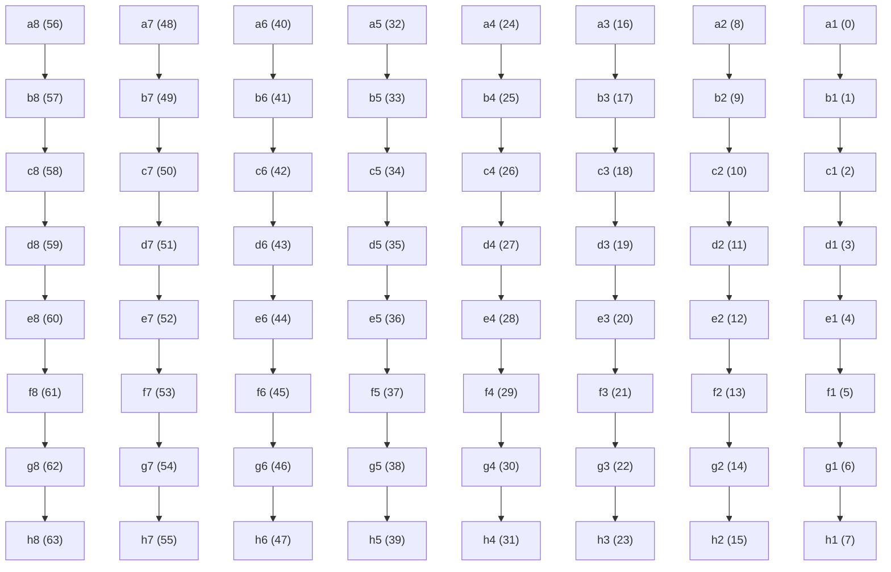
来源：[src/chess/bitboard.h41-43](https://github.com/LeelaChessZero/lc0/blob/b4e98c19/src/chess/bitboard.h#L41-L43)

## BitBoard 类

`BitBoard` 类封装了一个 64 位整数，并提供了操作位的方法。它定义在 `src/chess/bitboard.h` 中。


来源：[src/chess/bitboard.h43-162](https://github.com/LeelaChessZero/lc0/blob/b4e98c19/src/chess/bitboard.h#L43-L162)

### 关键 BitBoard 操作

BitBoard 类提供了多种操作：

1.  **创建与转换**:

    -   默认构造函数创建一个空位棋盘
    -   从 64 位整数构造
    -   `FromSquare` 创建一个仅设置了一位的位棋盘
    -   `as_int()` 返回底层的 64 位整数
2.  **位操作**:

    -   `set(square)`: 将特定方格的位设置为 1
    -   `reset(square)`: 将特定方格的位设置为 0
    -   `get(square)`: 获取特定方格的位值
    -   `set_if(square, condition)`: 仅当条件为真时设置位
3.  **位棋盘查询**:

    -   `count()`: 计算设置位的数量（可用时使用种群计数指令实现）
    -   `count_few()`: 针对设置位较少的情况进行优化
    -   `empty()`: 检查是否所有位都为 0
    -   `intersects(other)`: 检查两个位棋盘中是否有任何位都被设置
4.  **位棋盘变换**:

    -   `Mirror()`: 垂直翻转棋盘，镜像黑白双方的棋盘
5.  **运算符**:

    -   `|` (OR): 两个位棋盘的并集
    -   `&` (AND): 两个位棋盘的交集
    -   `-` (Subtraction): 位棋盘之间的差集
6.  **迭代**:

    -   `begin()` 和 `end()` 方法支持对设置位进行基于范围的 for 循环

来源：[src/chess/bitboard.h45-158](https://github.com/LeelaChessZero/lc0/blob/b4e98c19/src/chess/bitboard.h#L45-L158) [src/utils/bititer.h36-121](https://github.com/LeelaChessZero/lc0/blob/b4e98c19/src/utils/bititer.h#L36-L121)

### BitBoard 迭代

`BitBoard` 类使用 `BitIterator` 类提供对设置位的迭代。这允许迭代棋盘上特定类型的所有棋子。

```
// Example of iterating over all squares set in a bitboard
for (auto square : some_bitboard) {
    // Do something with each set square
}
```
该实现使用定义在 `src/utils/bititer.h` 中的 `BitIterator` 类，它使用位操作技术高效地查找和迭代设置位：

**BitIterator 实现细节**

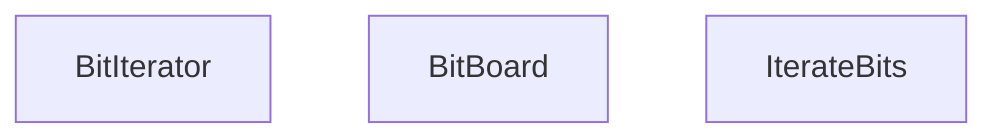
`BitIterator` 使用表达式 `value_ &= (value_ - 1)` 来推进设置位，该表达式在每次迭代中高效地清除最低设置位。`GetLowestBit` 函数使用特定于平台的位扫描指令：

| 平台 | 实现 |
| --- | --- |
| MSVC 64-bit | `_BitScanForward64` |
| MSVC 32-bit | `_BitScanForward` 以及 64 位处理 |
| GCC/Clang | `__builtin_ctzll` |

来源：[src/chess/bitboard.h112-117](https://github.com/LeelaChessZero/lc0/blob/b4e98c19/src/chess/bitboard.h#L112-L117) [src/utils/bititer.h37-54](https://github.com/LeelaChessZero/lc0/blob/b4e98c19/src/utils/bititer.h#L37-L54) [src/utils/bititer.h92-110](https://github.com/LeelaChessZero/lc0/blob/b4e98c19/src/utils/bititer.h#L92-L110) [src/utils/bititer.h112-121](https://github.com/LeelaChessZero/lc0/blob/b4e98c19/src/utils/bititer.h#L112-L121)

## 棋盘表示与位棋盘变换

### 棋盘变换

`src/utils/bititer.h` 文件提供了几个用于操作位棋盘的棋盘变换函数：

**棋盘变换函数**

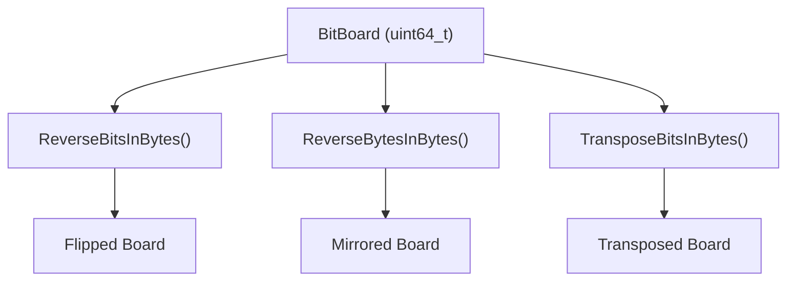
| 变换 | 目的 | 实现 |
| --- | --- | --- |
| `ReverseBitsInBytes` | 水平镜像（左右翻转） | 使用掩码的位操作 |
| `ReverseBytesInBytes` | 垂直镜像（上下翻转） | 字节反转操作 |
| `TransposeBitsInBytes` | 对角线转置 (A1↔H8) | 复杂的位排列 |

`BitBoard::Mirror()` 方法使用 `ReverseBytesInBytes` 来垂直翻转棋盘，这用于在白方和黑方视角之间进行翻转。

### Syzygy 残局库中的位棋盘使用

Syzygy 残局库实现展示了实际的位棋盘使用：

**棋子类型提取**

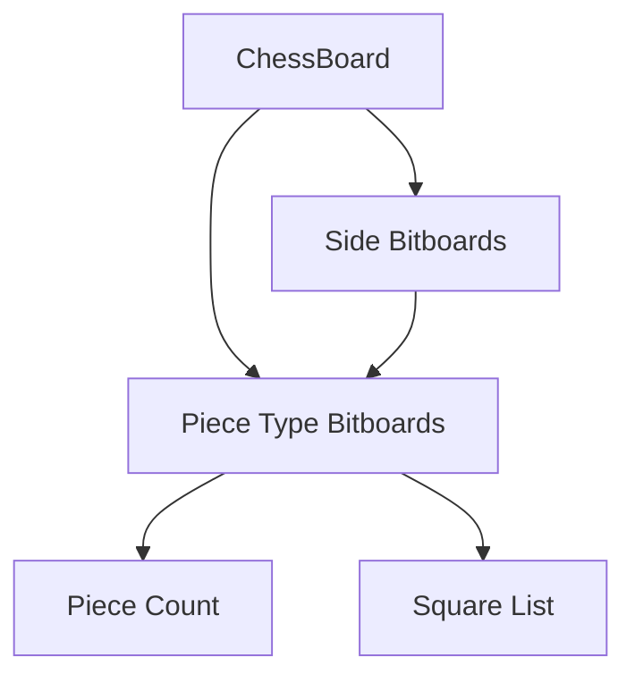
Syzygy 代码中的 `count_pieces` 函数展示了典型的位棋盘操作：

```
// Extract pieces of specific type for a side
const BitBoard all = theirs ? pos.theirs() : pos.ours();
return (all & pos.queens()).count_few();
```
来源：[src/chess/bitboard.h107](https://github.com/LeelaChessZero/lc0/blob/b4e98c19/src/chess/bitboard.h#L107-L107) [src/utils/bititer.h66-89](https://github.com/LeelaChessZero/lc0/blob/b4e98c19/src/utils/bititer.h#L66-L89) [src/syzygy/syzygy.cc185-204](https://github.com/LeelaChessZero/lc0/blob/b4e98c19/src/syzygy/syzygy.cc#L185-L204) [src/syzygy/syzygy.cc206-225](https://github.com/LeelaChessZero/lc0/blob/b4e98c19/src/syzygy/syzygy.cc#L206-L225)

## 走法生成与位棋盘操作

### 用于走法生成的位棋盘操作

lc0 中的走法生成严重依赖位棋盘操作。核心操作包括：

**基本位棋盘操作**

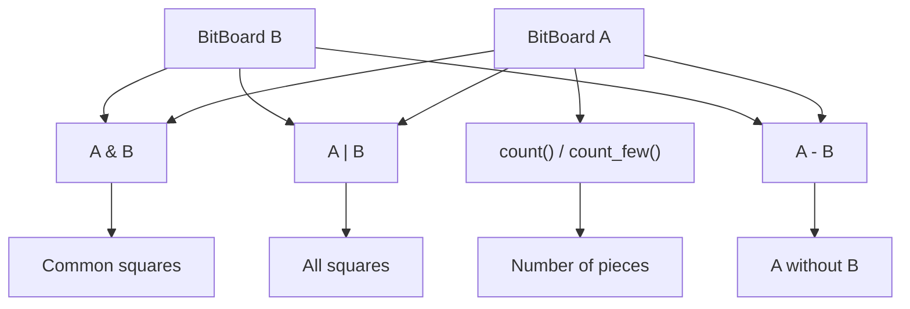
`count_few()` 方法针对稀疏位棋盘（通常用于除兵以外的棋子类型）进行了优化：

| 条件 | 实现 |
| --- | --- |
| `NO_POPCNT` 已定义 | 软件位计数循环 |
| 硬件 POPCNT 可用 | 委托给 `count()` |

### 实际走法生成示例

Syzygy 残局库代码展示了典型的走法生成模式：

**吃子检测**

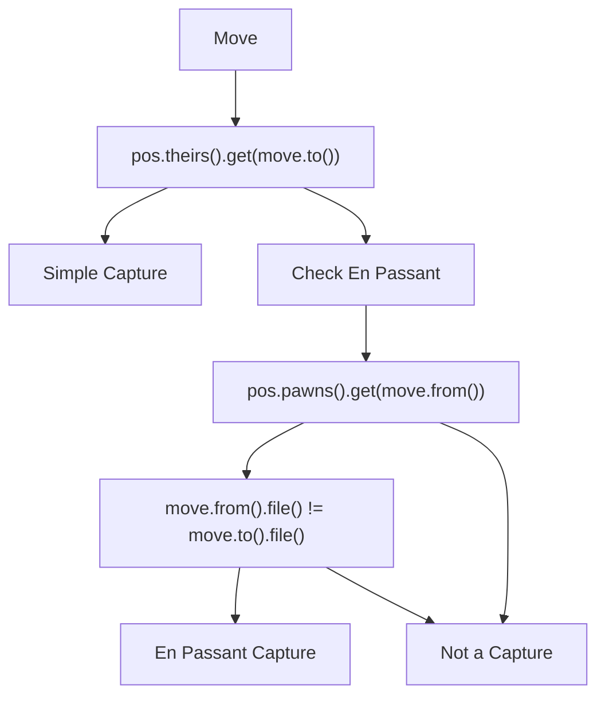
**残局库查找的方格填充**

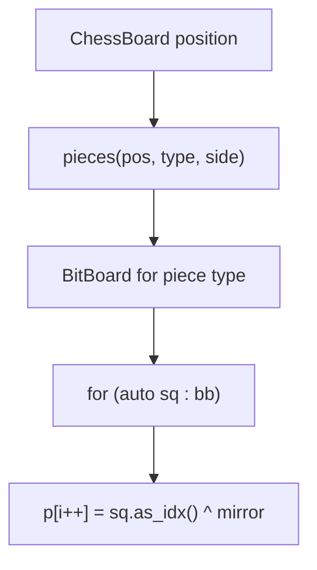
`fill_squares` 函数展示了如何将位棋盘转换为方格数组以用于残局库索引，并在必要时应用棋盘镜像。

来源：[src/chess/bitboard.h74-86](https://github.com/LeelaChessZero/lc0/blob/b4e98c19/src/chess/bitboard.h#L74-L86) [src/chess/bitboard.h129-158](https://github.com/LeelaChessZero/lc0/blob/b4e98c19/src/chess/bitboard.h#L129-L158) [src/syzygy/syzygy.cc227-235](https://github.com/LeelaChessZero/lc0/blob/b4e98c19/src/syzygy/syzygy.cc#L227-L235) [src/syzygy/syzygy.cc851-861](https://github.com/LeelaChessZero/lc0/blob/b4e98c19/src/syzygy/syzygy.cc#L851-L861)

## 高级位棋盘技术

### 平台特定优化

位棋盘实现包括几个平台特定的优化：

**位扫描函数**

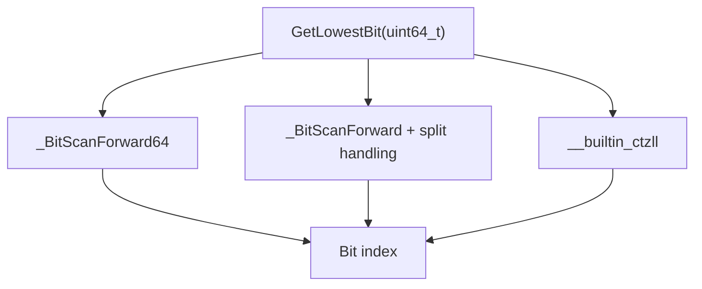
**种群计数实现**

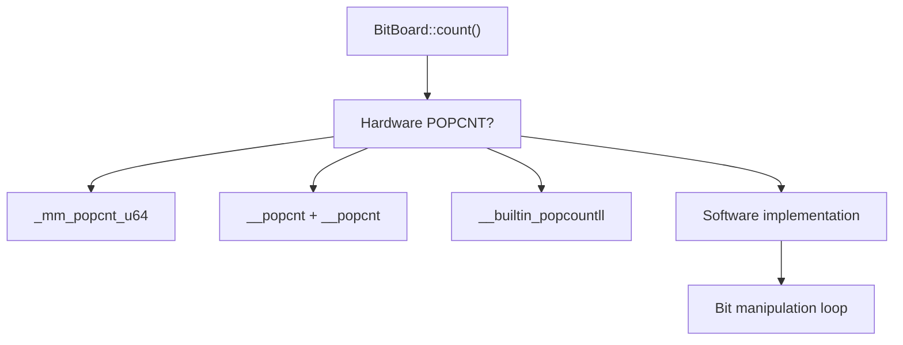
软件实现使用经典的位操作技术：

```
x -= (x >> 1) & 0x5555555555555555;
x = (x & 0x3333333333333333) + ((x >> 2) & 0x3333333333333333);
// ... continued bit manipulation
```
### 与局面表示集成

位棋盘与更广泛的局面表示系统集成：

**局面到位棋盘转换**

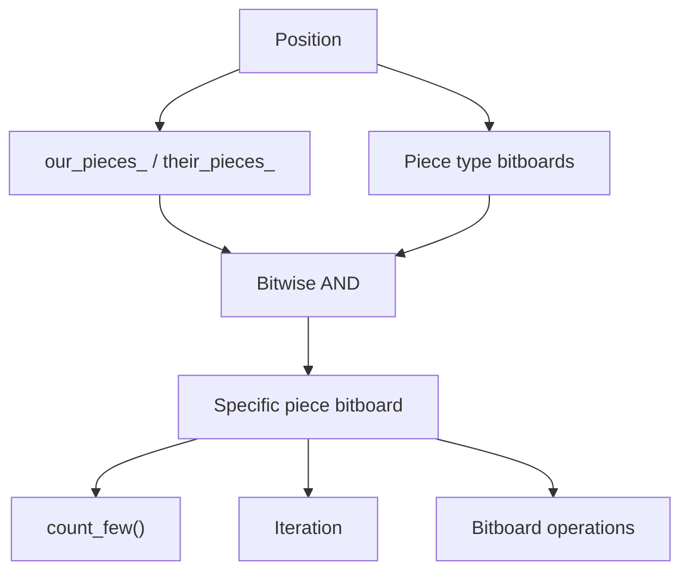
Syzygy 实现展示了这在确定棋子材质和位置以进行残局库查找时的实际应用。

来源：[src/utils/bititer.h37-54](https://github.com/LeelaChessZero/lc0/blob/b4e98c19/src/utils/bititer.h#L37-L54) [src/chess/bitboard.h55-86](https://github.com/LeelaChessZero/lc0/blob/b4e98c19/src/chess/bitboard.h#L55-L86) [src/syzygy/syzygy.cc185-225](https://github.com/LeelaChessZero/lc0/blob/b4e98c19/src/syzygy/syzygy.cc#L185-L225)

## 性能考量

位棋盘在 lc0 引擎中提供了几个性能优势：

### 硬件加速

| 操作 | 硬件支持 | 性能优势 |
| --- | --- | --- |
| 种群计数 | POPCNT 指令 | O(1) 位计数 |
| 位扫描 | BSF/BSR 指令 | 快速最低位查找 |
| 并行操作 | 64 位 ALU 操作 | 一次处理多个方格 |

### 内存效率

**紧凑的棋盘表示**

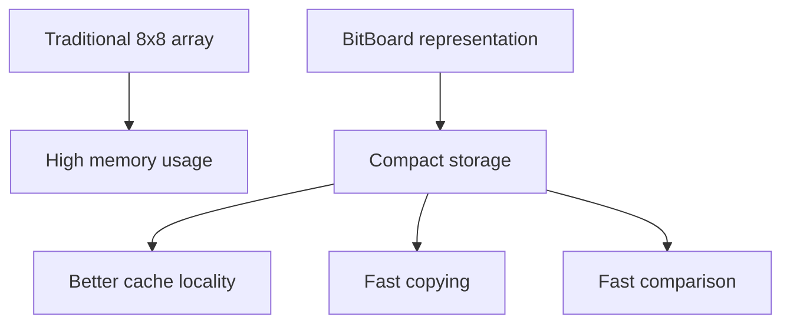
### 算法效率

位棋盘方法实现了：

1.  **并行棋子操作**: 同时操作某种类型的所有棋子
2.  **快速交集测试**: 使用按位与检查棋子交互
3.  **高效迭代**: 使用位操作仅迭代被占据的方格

`count_few()` 优化展示了对稀疏位棋盘的性能考量：

```
// Optimized for pieces with few instances (Q, R, N, B)
// Uses bit-clearing loop when POPCNT not available
x &= x - 1;  // Clears rightmost set bit
```
### 残局库集成性能

Syzygy 残局库代码展示了真实世界的位棋盘性能模式：

-   直接位棋盘访问以进行棋子计数
-   高效迭代棋子位置
-   使用位棋盘交集进行快速吃子检测

来源：[src/chess/bitboard.h55-86](https://github.com/LeelaChessZero/lc0/blob/b4e98c19/src/chess/bitboard.h#L55-L86) [src/utils/bititer.h37-54](https://github.com/LeelaChessZero/lc0/blob/b4e98c19/src/utils/bititer.h#L37-L54) [src/syzygy/syzygy.cc185-204](https://github.com/LeelaChessZero/lc0/blob/b4e98c19/src/syzygy/syzygy.cc#L185-L204)

## 总结

位棋盘是 Leela Chess Zero 引擎中的关键数据结构，提供了棋盘的高效表示和快速走法生成。其实现包括：

-   `BitBoard` 类用于操作 64 位棋盘表示
-   多个位棋盘用于跟踪不同的棋子类型和颜色
-   魔术位棋盘用于高效的滑子走法生成
-   预计算的非滑子攻击表
-   两步走法生成（先伪合法，后合法性检查）

这种高效的表示对引擎的性能贡献巨大，使其能够快速评估局面和生成走法。
