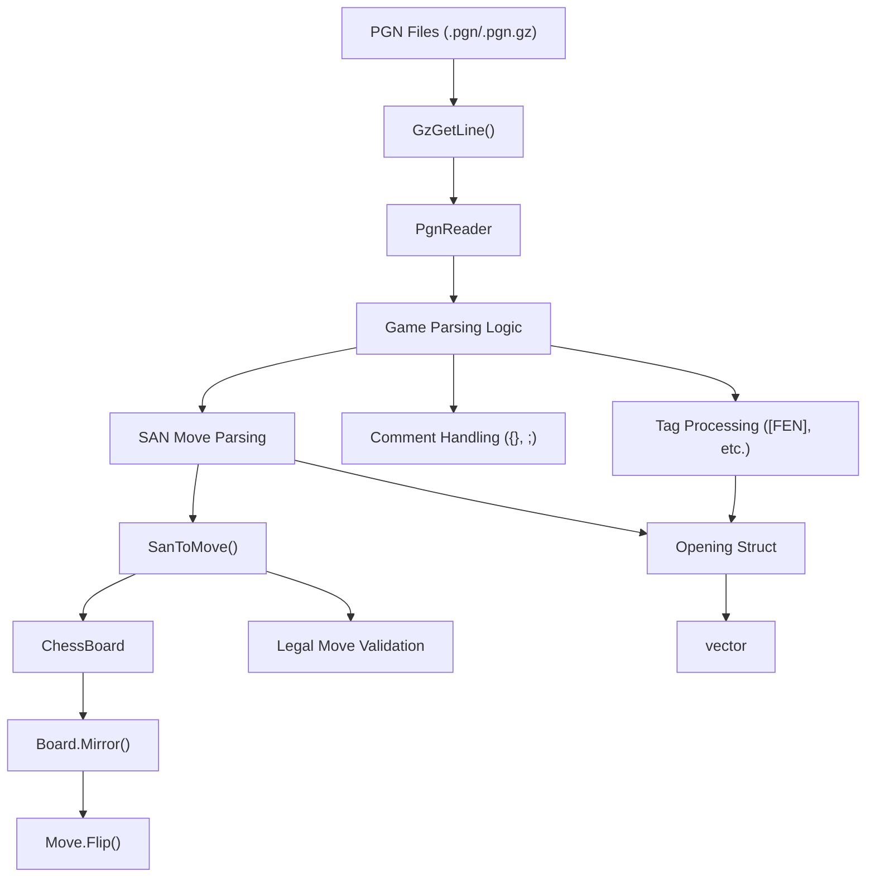
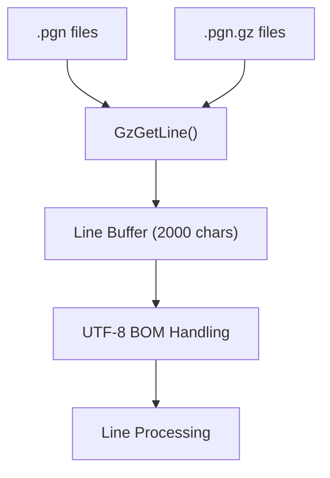
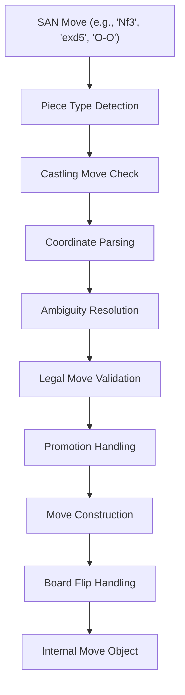

# PGN 与对局导入

相关源文件

-   [src/chess/pgn.h](https://github.com/LeelaChessZero/lc0/blob/b4e98c19/src/chess/pgn.h)
-   [src/utils/cppattributes.h](https://github.com/LeelaChessZero/lc0/blob/b4e98c19/src/utils/cppattributes.h)
-   [src/utils/mutex.h](https://github.com/LeelaChessZero/lc0/blob/b4e98c19/src/utils/mutex.h)
-   [src/utils/random.cc](https://github.com/LeelaChessZero/lc0/blob/b4e98c19/src/utils/random.cc)
-   [src/utils/random.h](https://github.com/LeelaChessZero/lc0/blob/b4e98c19/src/utils/random.h)
-   [src/utils/spinhelper.h](https://github.com/LeelaChessZero/lc0/blob/b4e98c19/src/utils/spinhelper.h)

本文档描述了 Leela Chess Zero 中的 PGN (便携式对局记号法) 解析和对局导入系统。该系统使引擎能够从 PGN 文件中读取国际象棋对局，并将其转换为适合开局库创建和对局分析的内部表示。

有关 PGN 系统使用的棋局表示和走法编码，请参阅 [局面编码与历史](/LeelaChessZero/lc0/4.2-position-encoding-and-history)。有关支持 PGN 解析器的基于位棋盘的走法生成，请参阅 [位棋盘与走法生成](/LeelaChessZero/lc0/4.1-bitboards-and-move-generation)。

## 系统概览

PGN 导入系统提供了解析标准国际象棋对局文件并将其转换为 Lc0 内部格式的功能。该系统支持压缩的 PGN 文件，处理各种 PGN 注释和评论，并将标准代数记谱法 (SAN) 走法转换为引擎的原生走法表示。

## PGN 解析器架构


*从文件输入到内部对局表示的 PGN 解析流程*

来源：[src/chess/pgn.h66-337](https://github.com/LeelaChessZero/lc0/blob/b4e98c19/src/chess/pgn.h#L66-L337)

## 核心组件

### PgnReader 类

`PgnReader` 类是 PGN 文件处理的主要接口。它维护解析对局的内部状态，并提供添加 PGN 文件和检索已解析对局的方法。

| 方法 | 目的 | 返回类型 |
| --- | --- | --- |
| `AddPgnFile()` | 解析 PGN 文件并将对局添加到内部存储 | `void` |
| `GetGames()` | 返回所有已解析对局的副本 | `std::vector<Opening>` |
| `ReleaseGames()` | 返回并清除所有已解析对局 | `std::vector<Opening>&&` |

**关键状态变量:**

-   `cur_board_`: 解析期间的当前棋盘局面
-   `cur_game_`: 当前正在解析的对局的走法列表
-   `cur_startpos_`: 当前对局的起始 FEN 局面
-   `games_`: 存储所有已完成解析对局的向量

来源：[src/chess/pgn.h66-164](https://github.com/LeelaChessZero/lc0/blob/b4e98c19/src/chess/pgn.h#L66-L164) [src/chess/pgn.h333-336](https://github.com/LeelaChessZero/lc0/blob/b4e98c19/src/chess/pgn.h#L333-L336)

### Opening 结构体

`Opening` 结构体表示一个已解析的国际象棋对局，包括其起始局面和走法序列：

```
struct Opening {
  std::string start_fen = ChessBoard::kStartposFen;
  MoveList moves;
};
```
此结构体以适合开局库创建或对局重演的格式存储对局。

来源：[src/chess/pgn.h45-48](https://github.com/LeelaChessZero/lc0/blob/b4e98c19/src/chess/pgn.h#L45-L48)

## 文件格式支持

### Gzip 压缩支持

该系统通过 `GzGetLine()` 函数支持纯文本和 gzip 压缩的 PGN 文件，该函数提供了一个统一的接口，用于从压缩或未压缩的文件中读取行。


*带有压缩支持的文件输入处理*

该函数处理：

-   自动检测 gzip 压缩
-   UTF-8 BOM (字节顺序标记) 移除
-   行尾规范化 (CR/LF)
-   长行的缓冲区管理

来源：[src/chess/pgn.h50-64](https://github.com/LeelaChessZero/lc0/blob/b4e98c19/src/chess/pgn.h#L50-L64) [src/chess/pgn.h68-83](https://github.com/LeelaChessZero/lc0/blob/b4e98c19/src/chess/pgn.h#L68-L83)

### PGN 标签处理

解析器识别并处理 PGN 标签，特别是对 FEN 标签的处理，以支持从非标准局面开始的对局：

-   **FEN 标签**: 为不从标准起始局面开始的对局设置起始局面
-   **其他标签**: 被忽略但会正确解析，以避免干扰走法解析

来源：[src/chess/pgn.h84-99](https://github.com/LeelaChessZero/lc0/blob/b4e98c19/src/chess/pgn.h#L84-L99)

## SAN 到走法转换

### SAN 解析逻辑

`SanToMove()` 函数将标准代数记谱法 (SAN) 转换为 Lc0 的内部走法表示。这涉及复杂的逻辑来处理：


*SAN 到内部走法转换过程*

**支持的 SAN 特性:**

-   带有歧义消除的棋子移动 (例如 `Nbd2`, `R1a3`)
-   兵的移动和吃子 (例如 `e4`, `exd5`)
-   王车易位记号 (`O-O`, `O-O-O`)
-   升变记号 (例如 `e8=Q`)
-   吃过路兵
-   将军和将死注释（解析但不使用）

来源：[src/chess/pgn.h195-331](https://github.com/LeelaChessZero/lc0/blob/b4e98c19/src/chess/pgn.h#L195-L331)

### 走法验证与歧义消除

解析器针对当前棋盘局面验证走法并解决歧义记号：

1.  **合法走法生成**: 使用 `board.GenerateLegalMoves()` 获取有效走法
2.  **歧义消除**: 处理多个棋子可以到达同一方格的情况
3.  **错误处理**: 为非法或有歧义的走法抛出异常

来源：[src/chess/pgn.h280-310](https://github.com/LeelaChessZero/lc0/blob/b4e98c19/src/chess/pgn.h#L280-L310)

## 评论与注释处理

解析器处理各种 PGN 评论格式：

| 评论类型 | 语法 | 处理 |
| --- | --- | --- |
| 大括号评论 | `{comment}` | 从走法文本中完全移除 |
| 分号评论 | `;comment` | 从行尾移除 |
| 比赛结果 | `1-0`, `0-1`, `1/2-1/2`, `*` | 识别并忽略 |
| 回合数 | `1.`, `23...` | 从走法记号中剥离 |

解析器维护状态以正确处理多行大括号评论。

来源：[src/chess/pgn.h104-124](https://github.com/LeelaChessZero/lc0/blob/b4e98c19/src/chess/pgn.h#L104-L124) [src/chess/pgn.h147-149](https://github.com/LeelaChessZero/lc0/blob/b4e98c19/src/chess/pgn.h#L147-L149)

## 棋盘状态管理

### 局面镜像

解析器处理 Lc0 的内部棋盘表示，该表示对黑方走法使用局面镜像：

1.  **白方走法**: 直接应用到棋盘
2.  **黑方走法**: 在走法应用前后镜像棋盘
3.  **走法翻转**: 偶数回合走法（黑方）的表示被翻转

这确保了与 Lc0 神经网络输入格式的兼容性。

来源：[src/chess/pgn.h150-156](https://github.com/LeelaChessZero/lc0/blob/b4e98c19/src/chess/pgn.h#L150-L156)

## 集成点

### 引擎集成

PGN 系统与多个引擎组件集成：

-   **ChessBoard**: 提供局面表示和合法走法生成
-   **Move Objects**: 使用 Lc0 的内部走法表示
-   **Opening Books**: 已解析的对局可用于创建开局库数据库
-   **Self-Play System**: 可能利用 PGN 导入进行训练数据准备

### 错误处理

系统使用 Lc0 的异常框架进行错误报告：

-   **文件未找到**: 缺失 PGN 文件的特定错误消息
-   **非法走法**: 为无效 SAN 记号抛出异常
-   **歧义走法**: 当歧义消除失败时的错误

来源：[src/chess/pgn.h71-72](https://github.com/LeelaChessZero/lc0/blob/b4e98c19/src/chess/pgn.h#L71-L72) [src/chess/pgn.h302](https://github.com/LeelaChessZero/lc0/blob/b4e98c19/src/chess/pgn.h#L302-L302) [src/chess/pgn.h309](https://github.com/LeelaChessZero/lc0/blob/b4e98c19/src/chess/pgn.h#L309-L309)
