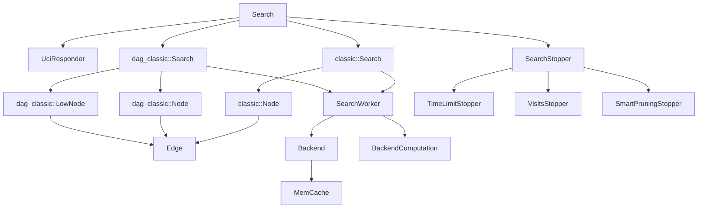
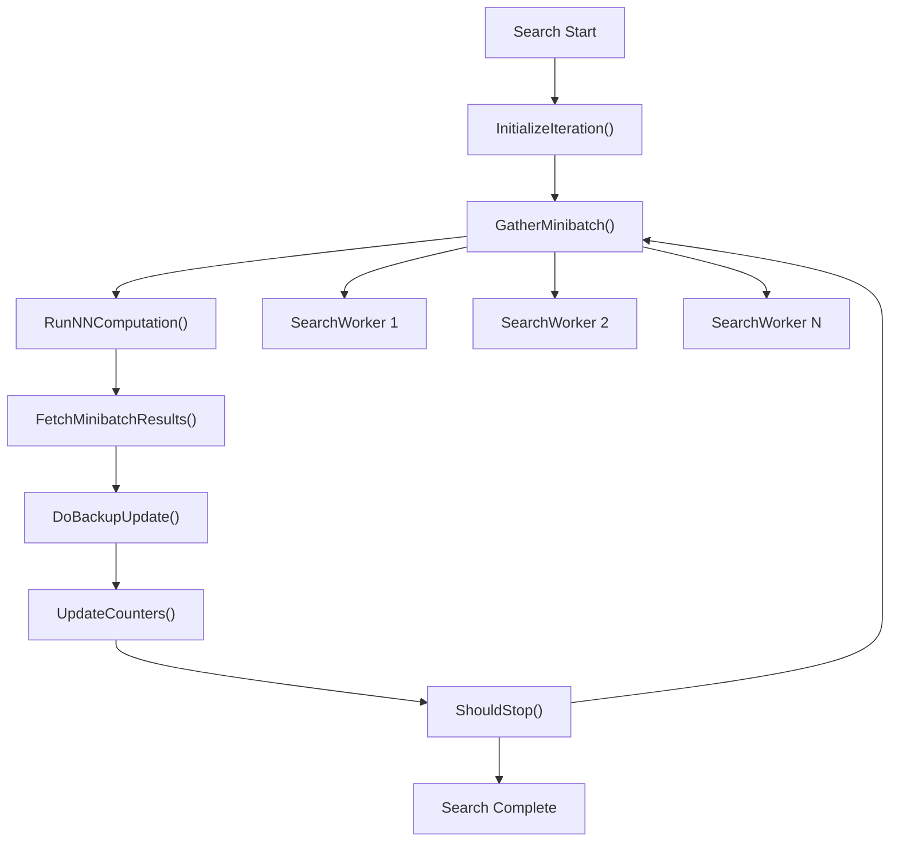
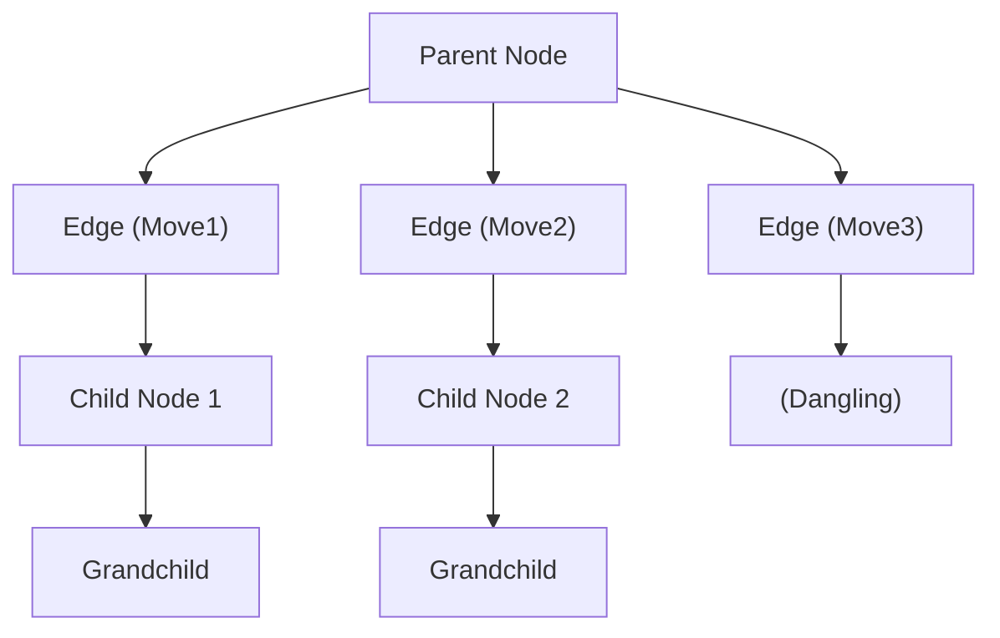
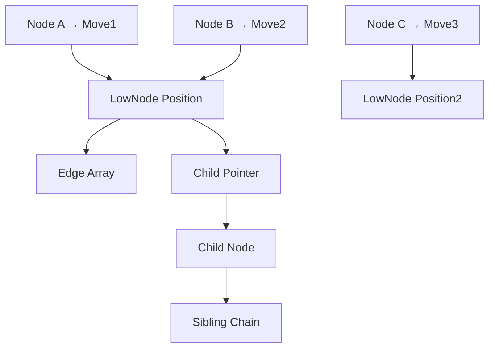
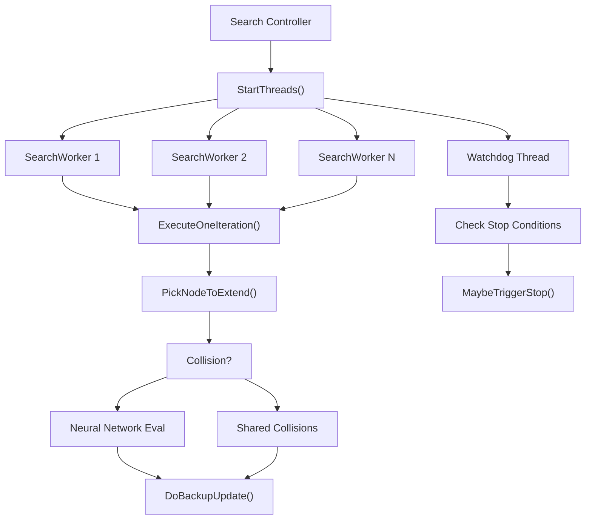
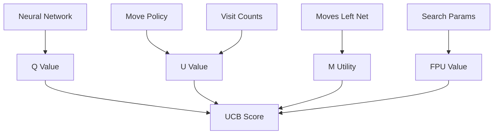
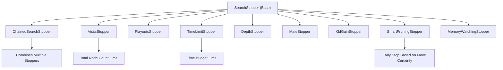

# 搜索算法

相关源文件

-   [src/search/classic/node.cc](https://github.com/LeelaChessZero/lc0/blob/b4e98c19/src/search/classic/node.cc)
-   [src/search/classic/node.h](https://github.com/LeelaChessZero/lc0/blob/b4e98c19/src/search/classic/node.h)
-   [src/search/classic/search.cc](https://github.com/LeelaChessZero/lc0/blob/b4e98c19/src/search/classic/search.cc)
-   [src/search/classic/search.h](https://github.com/LeelaChessZero/lc0/blob/b4e98c19/src/search/classic/search.h)
-   [src/search/classic/stoppers/stoppers.cc](https://github.com/LeelaChessZero/lc0/blob/b4e98c19/src/search/classic/stoppers/stoppers.cc)
-   [src/search/dag\_classic/node.cc](https://github.com/LeelaChessZero/lc0/blob/b4e98c19/src/search/dag_classic/node.cc)
-   [src/search/dag\_classic/node.h](https://github.com/LeelaChessZero/lc0/blob/b4e98c19/src/search/dag_classic/node.h)
-   [src/search/dag\_classic/search.cc](https://github.com/LeelaChessZero/lc0/blob/b4e98c19/src/search/dag_classic/search.cc)
-   [src/search/dag\_classic/search.h](https://github.com/LeelaChessZero/lc0/blob/b4e98c19/src/search/dag_classic/search.h)

本文档涵盖了构成 Leela Chess Zero 核心搜索算法的蒙特卡洛树搜索 (MCTS) 实现。搜索系统通过构建由神经网络评估指导的概率搜索树来评估国际象棋局面。有关提供局面评估的神经网络后端的信息，请参阅 [神经网络系统](/LeelaChessZero/lc0/6-neural-network-system)。有关搜索参数配置的详细信息，请参阅 [搜索参数与终止条件](/LeelaChessZero/lc0/5.2-search-parameters-and-stopping-conditions)。

## 架构概览

搜索系统实现了两种不同的 MCTS 变体：经典的基于树的方法和支持置换处理的 DAG（有向无环图）变体。这两种变体共享通用的接口，但使用不同的节点结构和搜索策略。

### 搜索系统组件


来源：[src/search/classic/search.h50-204](https://github.com/LeelaChessZero/lc0/blob/b4e98c19/src/search/classic/search.h#L50-L204) [src/search/dag\_classic/search.h55-211](https://github.com/LeelaChessZero/lc0/blob/b4e98c19/src/search/dag_classic/search.h#L55-L211) [src/search/classic/node.h127-339](https://github.com/LeelaChessZero/lc0/blob/b4e98c19/src/search/classic/node.h#L127-L339) [src/search/dag\_classic/node.h167-370](https://github.com/LeelaChessZero/lc0/blob/b4e98c19/src/search/dag_classic/node.h#L167-L370)

### 核心 MCTS 流程

搜索算法遵循标准的 MCTS 模式：选择 (Selection)、扩展 (Expansion)、模拟 (Simulation，通过神经网络) 和反向传播 (Backpropagation)：


来源：[src/search/classic/search.h268-307](https://github.com/LeelaChessZero/lc0/blob/b4e98c19/src/search/classic/search.h#L268-L307) [src/search/dag\_classic/search.h276-307](https://github.com/LeelaChessZero/lc0/blob/b4e98c19/src/search/dag_classic/search.h#L276-L307)

## 经典搜索与 DAG 搜索变体

### 经典搜索实现

经典搜索使用传统的树结构，其中每个节点都有一个父指针，子节点存储为链表或数组。这种方法更简单，但无法高效处理置换 (transpositions)。

**关键类：**

-   `classic::Search` - 主搜索协调器 [src/search/classic/search.h50-204](https://github.com/LeelaChessZero/lc0/blob/b4e98c19/src/search/classic/search.h#L50-L204)
-   `classic::Node` - 具有父/子关系的树节点 [src/search/classic/node.h127-339](https://github.com/LeelaChessZero/lc0/blob/b4e98c19/src/search/classic/node.h#L127-L339)
-   `classic::Edge` - 带有策略概率的走法表示 [src/search/classic/node.h85-112](https://github.com/LeelaChessZero/lc0/blob/b4e98c19/src/search/classic/node.h#L85-L112)

**节点结构：**


来源：[src/search/classic/node.h46-83](https://github.com/LeelaChessZero/lc0/blob/b4e98c19/src/search/classic/node.h#L46-L83) [src/search/classic/node.cc196-203](https://github.com/LeelaChessZero/lc0/blob/b4e98c19/src/search/classic/node.cc#L196-L203)

### DAG 搜索实现

DAG 变体将图结构分离为 `Node` 对象（表示树中的边）和 `LowNode` 对象（表示局面）。这允许多个 `Node` 对象指向同一个 `LowNode`，从而实现置换处理。

**关键类：**

-   `dag_classic::Search` - 基于 DAG 的搜索协调器 [src/search/dag\_classic/search.h55-211](https://github.com/LeelaChessZero/lc0/blob/b4e98c19/src/search/dag_classic/search.h#L55-L211)
-   `dag_classic::Node` - 带有评估数据的边包装器 [src/search/dag\_classic/node.h167-370](https://github.com/LeelaChessZero/lc0/blob/b4e98c19/src/search/dag_classic/node.h#L167-L370)
-   `dag_classic::LowNode` - 带有走法生成的局面节点 [src/search/dag\_classic/node.h375-560](https://github.com/LeelaChessZero/lc0/blob/b4e98c19/src/search/dag_classic/node.h#L375-L560)

**节点结构：**


来源：[src/search/dag\_classic/node.h49-89](https://github.com/LeelaChessZero/lc0/blob/b4e98c19/src/search/dag_classic/node.h#L49-L89) [src/search/dag\_classic/node.cc142-167](https://github.com/LeelaChessZero/lc0/blob/b4e98c19/src/search/dag_classic/node.cc#L142-L167)

## 搜索工作者 (Search Worker) 实现

搜索并行化由 `SearchWorker` 实例处理，它们并发执行 MCTS 迭代。每个工作者遵循相同的迭代模式，但在搜索树的不同部分上操作。

### 工作者协调


来源：[src/search/classic/search.h205-452](https://github.com/LeelaChessZero/lc0/blob/b4e98c19/src/search/classic/search.h#L205-L452) [src/search/classic/search.cc894-922](https://github.com/LeelaChessZero/lc0/blob/b4e98c19/src/search/classic/search.cc#L894-L922)

### 冲突处理

当多个工作者选择同一个节点进行扩展时，系统通过冲突检测和共享冲突处理来解决这个问题：

**经典冲突处理：**

-   使用 `n_in_flight_` 计数器跟踪并发访问 [src/search/classic/node.h310-313](https://github.com/LeelaChessZero/lc0/blob/b4e98c19/src/search/classic/node.h#L310-L313)
-   共享冲突存储在 `shared_collisions_` 向量中 [src/search/classic/search.h197-198](https://github.com/LeelaChessZero/lc0/blob/b4e98c19/src/search/classic/search.h#L197-L198)

**DAG 冲突处理：**

-   类似的方法，但带有 `BackupPath` 跟踪 [src/search/dag\_classic/search.h205-206](https://github.com/LeelaChessZero/lc0/blob/b4e98c19/src/search/dag_classic/search.h#L205-L206)
-   处理与置换相关的冲突 [src/search/dag\_classic/search.cc1630-1650](https://github.com/LeelaChessZero/lc0/blob/b4e98c19/src/search/dag_classic/search.cc#L1630-L1650)

来源：[src/search/classic/search.cc1200-1250](https://github.com/LeelaChessZero/lc0/blob/b4e98c19/src/search/classic/search.cc#L1200-L1250) [src/search/dag\_classic/search.cc1630-1680](https://github.com/LeelaChessZero/lc0/blob/b4e98c19/src/search/dag_classic/search.cc#L1630-L1680)

## 节点选择与评估

搜索使用置信区间上界 (UCB) 公式来选择要扩展的节点，以平衡探索 (exploration) 和利用 (exploitation)。

### UCB 计算

选择公式结合了几个部分：

**UCB 公式组件：**

-   `Q` 值: 来自神经网络评估的预期胜率
-   `U` 值: 基于访问计数和策略的探索奖励
-   `M` 效用: 剩余步数网络奖励，用于更快的胜利/更慢的失败
-   `FPU`: 未访问节点的首次访问急迫度 (First Play Urgency)


来源：[src/search/classic/search.cc427-452](https://github.com/LeelaChessZero/lc0/blob/b4e98c19/src/search/classic/search.cc#L427-L452) [src/search/classic/search.cc77-147](https://github.com/LeelaChessZero/lc0/blob/b4e98c19/src/search/classic/search.cc#L77-L147)

### 首次访问急迫度 (FPU)

对于未访问的节点，FPU 提供一个评估估计：

```
// FPU calculation from search.cc
inline float GetFpu(const SearchParams& params, const Node* node, bool is_root_node,
                    float draw_score) {
  const auto value = params.GetFpuValue(is_root_node);
  return params.GetFpuAbsolute(is_root_node)
             ? value
             : -node->GetQ(-draw_score) -
                   value * std::sqrt(node->GetVisitedPolicy());
}
```
来源：[src/search/classic/search.cc428-435](https://github.com/LeelaChessZero/lc0/blob/b4e98c19/src/search/classic/search.cc#L428-L435) [src/search/dag\_classic/search.cc437-444](https://github.com/LeelaChessZero/lc0/blob/b4e98c19/src/search/dag_classic/search.cc#L437-L444)

## 搜索终止条件

搜索系统通过 `SearchStopper` 层次结构使用多种终止标准。终止器可以链接在一起以组合多个条件。

### 终止器类型


来源：[src/search/classic/stoppers/stoppers.cc35-266](https://github.com/LeelaChessZero/lc0/blob/b4e98c19/src/search/classic/stoppers/stoppers.cc#L35-L266)

### 智能剪枝逻辑

当最佳走法不太可能改变时，智能剪枝会提前停止搜索：

**智能剪枝条件：**

1.  只有一个合法走法
2.  发现必胜终端
3.  除一个走法外，所有走法都必败
4.  最佳走法拥有无法超越的访问量领先优势

```
// Smart pruning check from stoppers.cc
if (remaining_playouts < (largest_n - second_largest_n)) {
  LOGFILE << std::fixed << remaining_playouts
          << " playouts remaining. Best move has " << largest_n
          << " visits, second best -- " << second_largest_n;
  return true;
}
```
来源：[src/search/classic/stoppers/stoppers.cc189-266](https://github.com/LeelaChessZero/lc0/blob/b4e98c19/src/search/classic/stoppers/stoppers.cc#L189-L266)

## 性能优化

搜索系统包含多项效率优化：

### 多线程优化

-   **任务工作者**: 每个搜索工作者有额外的线程用于节点选择 [src/search/classic/search.h215-225](https://github.com/LeelaChessZero/lc0/blob/b4e98c19/src/search/classic/search.h#L215-L225)
-   **乱序评估**: 无需等待即可处理缓存命中 [src/search/classic/search.h428-429](https://github.com/LeelaChessZero/lc0/blob/b4e98c19/src/search/classic/search.h#L428-L429)
-   **批处理**: 对神经网络评估进行分组 [src/search/classic/search.h230-237](https://github.com/LeelaChessZero/lc0/blob/b4e98c19/src/search/classic/search.h#L230-L237)

### 内存管理

-   **节点垃圾回收**: 用于节点清理的后台线程 [src/search/classic/node.cc50-117](https://github.com/LeelaChessZero/lc0/blob/b4e98c19/src/search/classic/node.cc#L50-L117)
-   **紧凑子节点 (Solid Children)**: 连续内存布局以获得更好的缓存性能 [src/search/classic/node.cc245-289](https://github.com/LeelaChessZero/lc0/blob/b4e98c19/src/search/classic/node.cc#L245-L289)
-   **内存监控**: 强制执行 RAM 限制 [src/search/classic/stoppers/stoppers.cc94-111](https://github.com/LeelaChessZero/lc0/blob/b4e98c19/src/search/classic/stoppers/stoppers.cc#L94-L111)

### 缓存优化

-   **评估缓存**: 重用神经网络评估 [src/search/classic/search.cc520-538](https://github.com/LeelaChessZero/lc0/blob/b4e98c19/src/search/classic/search.cc#L520-L538)
-   **置换表**: 在 DAG 变体中重用局面 [src/search/dag\_classic/search.cc174-177](https://github.com/LeelaChessZero/lc0/blob/b4e98c19/src/search/dag_classic/search.cc#L174-L177)

来源：[src/search/classic/search.h210-250](https://github.com/LeelaChessZero/lc0/blob/b4e98c19/src/search/classic/search.h#L210-L250) [src/search/classic/node.cc245-289](https://github.com/LeelaChessZero/lc0/blob/b4e98c19/src/search/classic/node.cc#L245-L289) [src/search/classic/stoppers/stoppers.cc94-111](https://github.com/LeelaChessZero/lc0/blob/b4e98c19/src/search/classic/stoppers/stoppers.cc#L94-L111)
