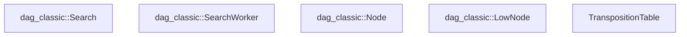
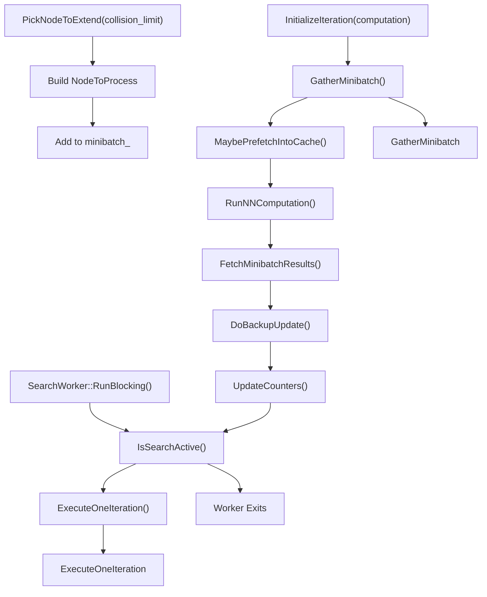
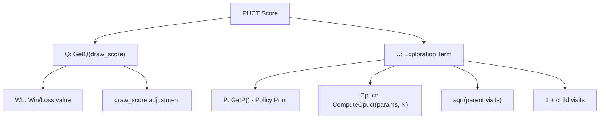
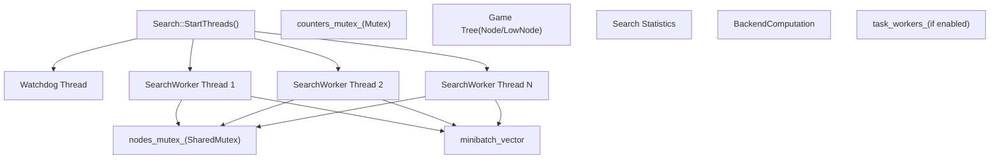
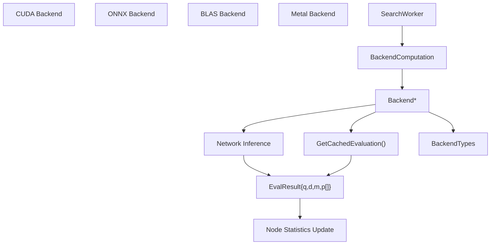

# MCTS 实现

相关源文件

-   [src/search/classic/node.cc](https://github.com/LeelaChessZero/lc0/blob/b4e98c19/src/search/classic/node.cc)
-   [src/search/classic/node.h](https://github.com/LeelaChessZero/lc0/blob/b4e98c19/src/search/classic/node.h)
-   [src/search/classic/search.cc](https://github.com/LeelaChessZero/lc0/blob/b4e98c19/src/search/classic/search.cc)
-   [src/search/classic/search.h](https://github.com/LeelaChessZero/lc0/blob/b4e98c19/src/search/classic/search.h)
-   [src/search/classic/stoppers/stoppers.cc](https://github.com/LeelaChessZero/lc0/blob/b4e98c19/src/search/classic/stoppers/stoppers.cc)
-   [src/search/dag\_classic/node.cc](https://github.com/LeelaChessZero/lc0/blob/b4e98c19/src/search/dag_classic/node.cc)
-   [src/search/dag\_classic/node.h](https://github.com/LeelaChessZero/lc0/blob/b4e98c19/src/search/dag_classic/node.h)
-   [src/search/dag\_classic/search.cc](https://github.com/LeelaChessZero/lc0/blob/b4e98c19/src/search/dag_classic/search.cc)
-   [src/search/dag\_classic/search.h](https://github.com/LeelaChessZero/lc0/blob/b4e98c19/src/search/dag_classic/search.h)

本文档描述了 Leela Chess Zero (Lc0) 中的蒙特卡洛树搜索 (MCTS) 实现，重点介绍了核心算法、经典变体与 DAG 变体之间的区别以及工作线程架构。有关搜索参数的信息，请参阅 [搜索参数与终止条件](/LeelaChessZero/lc0/5.2-search-parameters-and-stopping-conditions)，有关缓存的详细信息，请参阅 [搜索树缓存](/LeelaChessZero/lc0/5.3-search-tree-caching)。

## 1\. MCTS 概览

Lc0 实现了使用神经网络进行局面评估和走法选择的蒙特卡洛树搜索。引擎提供了两个主要变体：具有传统树结构的 **经典 (classic)** 搜索和通过共享节点支持置换的 **DAG** 搜索。

主要特征：

-   使用策略和价值输出的神经网络引导的树扩展
-   用于平衡探索 (exploration) 和利用 (exploitation) 的 PUCT 公式
-   使用多个 `SearchWorker` 线程的并行搜索
-   用于神经网络评估的高效局面批处理
-   支持基于树的 (经典) 和基于 DAG 的搜索

来源：[src/search/classic/search.h50-203](https://github.com/LeelaChessZero/lc0/blob/b4e98c19/src/search/classic/search.h#L50-L203) [src/search/dag\_classic/search.h55-210](https://github.com/LeelaChessZero/lc0/blob/b4e98c19/src/search/dag_classic/search.h#L55-L210)

## 2\. 搜索变体：经典与 DAG

Lc0 提供了两种不同的 MCTS 实现，具有不同的内存和性能特征。

### 2.1 经典搜索架构

**经典搜索架构**


### 2.2 DAG 搜索架构

**具有置换支持的 DAG 搜索架构**


### 2.3 关键架构差异

| 方面 | 经典 (Classic) | DAG |
| --- | --- | --- |
| **节点结构** | 具有父指针的单个 `Node` 类 | `Node` + `LowNode` 分离 |
| **置换** | 不支持 | 共享 `LowNode` 实例 |
| **内存使用** | 每个节点的开销较低 | 由于共享节点而较高 |
| **复杂性** | 较简单的树遍历 | 复杂的图管理 |
| **搜索深度** | 受限于树结构 | 可以利用置换 |

来源：[src/search/classic/search.h50-203](https://github.com/LeelaChessZero/lc0/blob/b4e98c19/src/search/classic/search.h#L50-L203) [src/search/dag\_classic/search.h55-210](https://github.com/LeelaChessZero/lc0/blob/b4e98c19/src/search/dag_classic/search.h#L55-L210) [src/search/classic/node.h127-339](https://github.com/LeelaChessZero/lc0/blob/b4e98c19/src/search/classic/node.h#L127-L339) [src/search/dag\_classic/node.h167-370](https://github.com/LeelaChessZero/lc0/blob/b4e98c19/src/search/dag_classic/node.h#L167-L370)

## 3\. SearchWorker 算法流程

经典变体和 DAG 变体都使用类似的 `SearchWorker` 迭代模式，但在节点处理方面有细微差别。

**SearchWorker 执行流程**


### 3.1 核心工作循环

`SearchWorker::RunBlocking()` 方法实现了主要的工作线程循环：

```
// Classic and DAG workers use identical loop structure
do {
    ExecuteOneIteration();
} while (search_->IsSearchActive());
```
### 3.2 使用 PUCT 进行节点选择

两个变体在 `PickNodeToExtend()` 期间都使用 PUCT 公式进行节点选择：

**PUCT 计算组件**


来源：[src/search/classic/search.cc446-452](https://github.com/LeelaChessZero/lc0/blob/b4e98c19/src/search/classic/search.cc#L446-L452) [src/search/dag\_classic/search.cc455-461](https://github.com/LeelaChessZero/lc0/blob/b4e98c19/src/search/dag_classic/search.cc#L455-L461) [src/search/classic/search.h208-276](https://github.com/LeelaChessZero/lc0/blob/b4e98c19/src/search/classic/search.h#L208-L276) [src/search/dag\_classic/search.h216-284](https://github.com/LeelaChessZero/lc0/blob/b4e98c19/src/search/dag_classic/search.h#L216-L284)

### 3.3 选择与 PUCT 实现

两个变体中的节点选择都使用经过优化计算的 PUCT 公式：

```
// From GetFpu() and ComputeCpuct() functions
float cpuct = ComputeCpuct(params_, node->GetN(), is_root);
float U_coeff = cpuct * std::sqrt(std::max(node->GetChildrenVisits(), 1u));
float score = edge.GetQ(fpu, draw_score) + edge.GetU(U_coeff);
```
**PUCT 公式实现：**

-   `Q = edge.GetQ(fpu, draw_score)` - 带有 FPU 回退的质量值
-   `U = P * U_coeff / (1 + N)` - 探索项
-   `U_coeff = cpuct * sqrt(parent_visits)` - 预计算系数
-   `cpuct = init + k * log((N + base) / base)` - 动态探索常数

`ComputeCpuct()` 函数允许根据访问计数动态调整探索，而 `GetFpu()` 处理未访问节点的首次访问急迫度。

来源：[src/search/classic/search.cc427-453](https://github.com/LeelaChessZero/lc0/blob/b4e98c19/src/search/classic/search.cc#L427-L453) [src/search/dag\_classic/search.cc436-462](https://github.com/LeelaChessZero/lc0/blob/b4e98c19/src/search/dag_classic/search.cc#L436-L462)

### 3.4 节点扩展差异

**经典扩展：**

```
// Classic: Direct node creation and edge assignment
void Node::CreateEdges(const MoveList& moves) {
    edges_ = Edge::FromMovelist(moves);
    num_edges_ = moves.size();
}
```
**DAG 扩展：**

```
// DAG: LowNode creation with transposition support
auto low_node = std::make_shared<LowNode>(moves);
node->SetLowNode(low_node);
// Check transposition table for existing evaluations
```
DAG 变体在扩展期间检查置换表，以潜在地重用先前计算的同一局面的评估。

来源：[src/search/classic/node.cc205-210](https://github.com/LeelaChessZero/lc0/blob/b4e98c19/src/search/classic/node.cc#L205-L210) [src/search/dag\_classic/node.cc396-427](https://github.com/LeelaChessZero/lc0/blob/b4e98c19/src/search/dag_classic/node.cc#L396-L427)

### 3.5 神经网络评估与批处理

两种搜索变体都通过 `Backend` 接口使用相同的神经网络评估：

**小批次处理流程**

> **[Mermaid sequence]**
> *(图表结构无法解析)*

**关键实现细节：**

-   `minibatch_` 包含带有局面数据的 `NodeToProcess` 对象
-   `target_minibatch_size_` 控制批处理效率（通常匹配 `Backend` 建议）
-   `FetchSingleNodeResult()` 提取每个局面的神经网络输出
-   结果包括价值 (`q`)、和棋概率 (`d`)、剩余步数 (`m`) 和策略数组

来源：[src/search/classic/search.h425-430](https://github.com/LeelaChessZero/lc0/blob/b4e98c19/src/search/classic/search.h#L425-L430) [src/search/dag\_classic/search.h479-484](https://github.com/LeelaChessZero/lc0/blob/b4e98c19/src/search/dag_classic/search.h#L479-L484) [src/search/classic/search.cc269-276](https://github.com/LeelaChessZero/lc0/blob/b4e98c19/src/search/classic/search.cc#L269-L276) [src/search/dag\_classic/search.cc276-284](https://github.com/LeelaChessZero/lc0/blob/b4e98c19/src/search/dag_classic/search.cc#L276-L284)

### 3.6 反向传播实现

**经典反向传播：**

```
// Classic: Simple parent chain traversal
void Node::FinalizeScoreUpdate(float v, float d, float m, int multivisit) {
    wl_ += multivisit * (v - wl_) / (n_ + multivisit);
    d_ += multivisit * (d - d_) / (n_ + multivisit);
    m_ += multivisit * (m - m_) / (n_ + multivisit);
    n_ += multivisit;
    n_in_flight_ -= multivisit;
}
```
**DAG 反向传播：**

```
// DAG: Update both Node and LowNode, handle transpositions
void DoBackupUpdateSingleNode(const NodeToProcess& node_to_process) {
    // Update node statistics
    node->FinalizeScoreUpdate(v, d, m, multivisit);
    // Update shared LowNode if present
    if (low_node) low_node->FinalizeScoreUpdate(v, d, m, multivisit);
}
```
DAG 变体必须处理对可能被多个置换路径引用的共享 `LowNode` 实例的更新。

来源：[src/search/classic/node.cc356-366](https://github.com/LeelaChessZero/lc0/blob/b4e98c19/src/search/classic/node.cc#L356-L366) [src/search/dag\_classic/node.cc358-371](https://github.com/LeelaChessZero/lc0/blob/b4e98c19/src/search/dag_classic/node.cc#L358-L371)

## 4\. 多线程与并行化

两种搜索变体实现了相同的线程策略，但采用了不同的节点同步方法。

**线程架构**


### 4.1 线程管理

**搜索线程协调：**

-   `Search::StartThreads(size_t how_many)` 创建工作线程
-   默认线程数：`backend_attributes_.suggested_num_search_threads + !backend_attributes_.runs_on_cpu`
-   每个工作者运行 `SearchWorker::RunBlocking()` 直到 `search_->IsSearchActive()` 返回 false
-   看门狗线程监控时间限制和 UCI 停止命令

### 4.2 同步策略

**互斥锁使用：**

-   `nodes_mutex_` (SharedMutex): 保护博弈树结构，允许并发读取
-   `counters_mutex_` (Mutex): 保护搜索统计信息和计数器
-   通过 `TryStartScoreUpdate()` 和 `n_in_flight_` 计数器进行节点级同步

**虚拟损失 (Virtual Loss) 系统：**

-   `n_in_flight_` 跟踪工作者正在处理的节点
-   防止多个工作者同时扩展同一路径
-   通过 `CancelScoreUpdate()` 或 `FinalizeScoreUpdate()` 自动清理

### 4.3 任务级并行化

高级工作者可以生成额外的任务线程进行局面选取：

```
// From SearchWorker constructor
task_workers_ = params.GetTaskWorkersPerSearchWorker();
for (int i = 0; i < task_workers_; i++) {
    task_threads_.emplace_back(<FileRef file-url="https://github.com/LeelaChessZero/lc0/blob/b4e98c19/this, i" undefined  file-path="this, i">Hii</FileRef> { this->RunTasks(i); });
}
```
来源：[src/search/classic/search.cc894-916](https://github.com/LeelaChessZero/lc0/blob/b4e98c19/src/search/classic/search.cc#L894-L916) [src/search/dag\_classic/search.cc900-922](https://github.com/LeelaChessZero/lc0/blob/b4e98c19/src/search/dag_classic/search.cc#L900-L922) [src/search/classic/search.h208-225](https://github.com/LeelaChessZero/lc0/blob/b4e98c19/src/search/classic/search.h#L208-L225) [src/search/dag\_classic/search.h216-233](https://github.com/LeelaChessZero/lc0/blob/b4e98c19/src/search/dag_classic/search.h#L216-L233)

## 5\. 高级功能与优化

### 5.1 剩余步数头 (Moves Left Head) 的 M-Evaluation

当神经网络支持剩余步数头 (MLH) 时，两种变体都实现了 M-evaluation：

```
class MEvaluator {
public:
    MEvaluator(const SearchParams& params, const Node* parent = nullptr);
    float GetMUtility(Node* child, float q) const;
    float GetMUtility(const EdgeAndNode& child, float q) const;
};
```
**M-Utility 计算：**

-   基于剩余步数预测，倾向于更短的胜利和更长的失败
-   由参数控制：`moves_left_slope`, `moves_left_max_effect`, `moves_left_threshold`
-   仅当 `backend_attributes_.has_mlh` 为 true 时激活

### 5.2 冲突处理

工作者在并行搜索期间处理节点冲突：

**经典冲突策略：**

```
NodeToProcess::Collision(Node* node, uint16_t depth, int collision_count)
```
**DAG 冲突策略：**

```
NodeToProcess::Collision(const BackupPath& path, int collision_count, int max_count)
```
当多个工作者同时选择相同的扩展路径时，会发生冲突。

### 5.3 智能剪枝与提前终止

搜索实现了几个提前终止条件：

-   **单一合法走法**: 当只有一个合法走法时立即终止
-   **发现杀棋**: 发现必胜终端时停止
-   **除一步外全败**: 当只剩下一个非失败走法时停止
-   **KLD 增益阈值**: 当走法概率分布收敛时停止

来源：[src/search/classic/search.cc77-147](https://github.com/LeelaChessZero/lc0/blob/b4e98c19/src/search/classic/search.cc#L77-L147) [src/search/dag\_classic/search.cc77-147](https://github.com/LeelaChessZero/lc0/blob/b4e98c19/src/search/dag_classic/search.cc#L77-L147) [src/search/classic/stoppers/stoppers.cc194-266](https://github.com/LeelaChessZero/lc0/blob/b4e98c19/src/search/classic/stoppers/stoppers.cc#L194-L266)

## 6\. 搜索终止与停止条件

两种变体都通过 `SearchStopper` 接口使用相同的停止逻辑：

**终止器实现类型：**

-   `TimeLimitStopper`: 基于时间的终止
-   `VisitsStopper`: 节点访问限制
-   `PlayoutsStopper`: 模拟 (Playout) 计数限制
-   `SmartPruningStopper`: 基于走法强度的提前终止
-   `KldGainStopper`: KL 散度收敛检测
-   `MateStopper`: 杀棋深度检测

**停止决策流程：**

```
// Called periodically during search
if (stopper_->ShouldStop(stats, hints)) {
    FireStopInternal();
}
```
搜索维护具有当前搜索状态的 `IterationStats`，并调用 `MaybeTriggerStop()` 来评估终止条件。

来源：[src/search/classic/stoppers/stoppers.cc39-266](https://github.com/LeelaChessZero/lc0/blob/b4e98c19/src/search/classic/stoppers/stoppers.cc#L39-L266) [src/search/classic/search.cc615-644](https://github.com/LeelaChessZero/lc0/blob/b4e98c19/src/search/classic/search.cc#L615-L644) [src/search/dag\_classic/search.cc618-647](https://github.com/LeelaChessZero/lc0/blob/b4e98c19/src/search/dag_classic/search.cc#L618-L647)

## 7\. 神经网络集成

两种搜索变体与神经网络后端系统的集成方式相同：

**后端集成流程**


**神经网络输出：**

-   `q`: 局面价值（胜率）
-   `d`: 和棋概率
-   `m`: 剩余步数估计（如果支持）
-   `p[]`: 每个合法走法的策略概率

**集成点：**

-   `backend_->GetCachedEvaluation()` 检查缓存结果
-   `computation_->ComputeBlocking()` 触发批推理
-   `FetchSingleNodeResult()` 提取用于树更新的结果

来源：[src/search/classic/search.cc151-171](https://github.com/LeelaChessZero/lc0/blob/b4e98c19/src/search/classic/search.cc#L151-L171) [src/search/dag\_classic/search.cc151-173](https://github.com/LeelaChessZero/lc0/blob/b4e98c19/src/search/dag_classic/search.cc#L151-L173)

## 8\. 性能优化

### 8.1 内存管理

**经典内存策略：**

-   通过 `NodeGarbageCollector` 对已删除的子树进行垃圾回收
-   `MakeSolid()` 将链表转换为连续数组以提高缓存效率
-   节点大小优化以适应缓存行：`sizeof(Node) <= 64`

**DAG 内存策略：**

-   共享 `LowNode` 实例减少置换的内存
-   通过 `AddParent()`/`RemoveParent()` 进行引用计数
-   当 `num_parents_` 达到零时自动清理

### 8.2 计算优化

**快速数学函数：**

-   `ComputeCpuct()` 使用 `FastLog()` 进行动态 CPUCT 计算
-   WDL 使用 `FastLogistic()` 重新缩放以用于蔑视 (contempt) 模式
-   `Edge::SetP()`/`GetP()` 中的策略概率压缩

**批处理效率：**

-   `target_minibatch_size_` 匹配后端建议
-   缓存命中和终端节点的乱序评估
-   `max_out_of_order_` 限制以保持搜索质量

### 8.3 搜索效率

**节点选择优化：**

-   FPU (首次访问急迫度) 减少对未访问节点的探索
-   基于访问计数的动态 CPUCT 缩放
-   通过多种终止器类型进行提前终止

来源：[src/search/classic/node.cc245-288](https://github.com/LeelaChessZero/lc0/blob/b4e98c19/src/search/classic/node.cc#L245-L288) [src/utils/fastmath.h38-93](https://github.com/LeelaChessZero/lc0/blob/b4e98c19/src/utils/fastmath.h#L38-L93) [src/search/classic/search.cc436-453](https://github.com/LeelaChessZero/lc0/blob/b4e98c19/src/search/classic/search.cc#L436-L453)

## 9\. MCTS 扩展与创新

Lc0 实现了对基本 MCTS 算法的几个扩展：

1.  **FPU 减少**: 减少首次游戏急迫度以更好地处理未探索节点
2.  **策略 Softmax 温度**: 控制探索与利用的权衡
3.  **走法概率重新缩放**: 根据访问计数调整走法概率
4.  **强制模拟 (Forced Playouts)**: 确保对所有合法走法进行最低限度的探索
5.  **Multi-PV 分析**: 同时搜索多个主要变例

来源：

## 总结

Lc0 中的 MCTS 实现是一种复杂的搜索算法，结合了传统 MCTS 与神经网络评估的优势。通过使用批评估、并行搜索和各种优化，它实现了高性能和强大的对弈能力。搜索由 PUCT 公式指导，该公式根据神经网络输出和累积统计数据平衡探索和利用。
