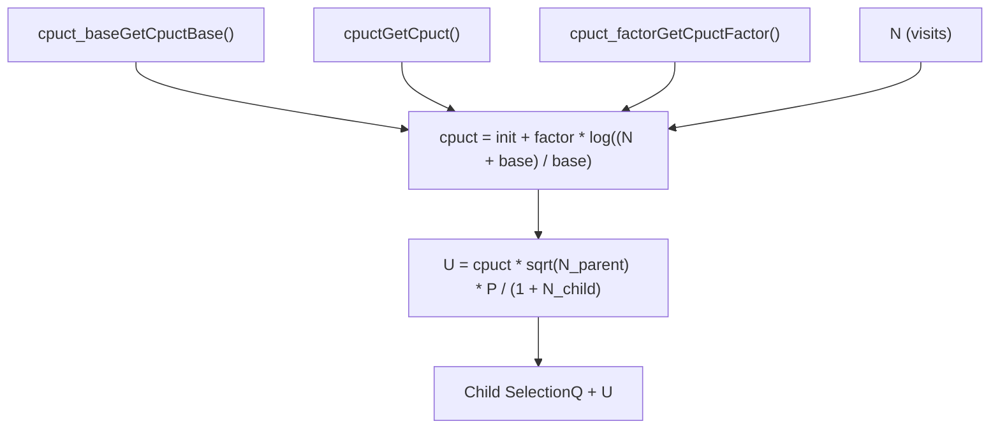
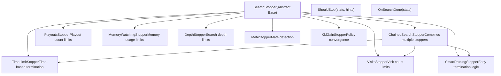

# 搜索参数与终止条件

相关源文件

-   [src/search/classic/node.cc](https://github.com/LeelaChessZero/lc0/blob/b4e98c19/src/search/classic/node.cc)
-   [src/search/classic/node.h](https://github.com/LeelaChessZero/lc0/blob/b4e98c19/src/search/classic/node.h)
-   [src/search/classic/search.cc](https://github.com/LeelaChessZero/lc0/blob/b4e98c19/src/search/classic/search.cc)
-   [src/search/classic/search.h](https://github.com/LeelaChessZero/lc0/blob/b4e98c19/src/search/classic/search.h)
-   [src/search/classic/stoppers/stoppers.cc](https://github.com/LeelaChessZero/lc0/blob/b4e98c19/src/search/classic/stoppers/stoppers.cc)
-   [src/search/dag\_classic/node.cc](https://github.com/LeelaChessZero/lc0/blob/b4e98c19/src/search/dag_classic/node.cc)
-   [src/search/dag\_classic/node.h](https://github.com/LeelaChessZero/lc0/blob/b4e98c19/src/search/dag_classic/node.h)
-   [src/search/dag\_classic/search.cc](https://github.com/LeelaChessZero/lc0/blob/b4e98c19/src/search/dag_classic/search.cc)
-   [src/search/dag\_classic/search.h](https://github.com/LeelaChessZero/lc0/blob/b4e98c19/src/search/dag_classic/search.h)

本文档涵盖了控制 Leela Chess Zero 的蒙特卡洛树搜索 (MCTS) 行为的可配置参数，以及确定搜索何时应该终止的各种条件。这包括探索与利用的平衡、走法选择温度、时间管理和资源约束。

有关核心 MCTS 算法实现的信息，请参阅 [MCTS 实现](/LeelaChessZero/lc0/5.1-mcts-implementation)。有关搜索树缓存和内存管理的详细信息，请参阅 [搜索树缓存](/LeelaChessZero/lc0/5.3-search-tree-caching)。

## 概览

搜索系统提供了两类主要的控制机制：

1.  **搜索参数** - 影响 MCTS 算法如何探索和评估局面的配置值
2.  **终止条件** - 决定搜索何时应该终止并返回最佳走法的标准

经典和 DAG 搜索变体共享相同的参数和终止条件基础设施，通过 `SearchParams` 类和 `SearchStopper` 接口层次结构实现。

## 搜索参数类别

搜索参数可以分为几个功能类别，控制 MCTS 算法的不同方面：

```mermaid
flowchart TD
    Temperature["Temperature SettingsGetTemperature()GetTemperatureEndgame()GetTemperatureCutoffMove()"]
    CPUCT["CPUCT ParametersGetCpuct()GetCpuctFactor()GetCpuctBase()"]
    FPU["First Play UrgencyGetFpuValue()GetFpuAbsolute()"]
    Noise["Dirichlet NoiseGetDirichletNoise()GetDirichletAlpha()"]
    Contempt["Contempt SettingsGetContemptMode()GetWDLRescaleDiff()"]
    MultiPV["Multi-PV AnalysisGetMultiPv()GetPerPvCounters()"]
    TimeControl["Time ManagementGetMiniBatchSize()GetMaxConcurrentSearchers()"]
    Exploration["Move ExplorationBalance"]
    Selection["Best MoveSelection"]
    Evaluation["PositionEvaluation"]
    Performance["SearchPerformance"]

    Temperature --> Selection
    CPUCT --> Exploration
    FPU --> Exploration
    Noise --> Exploration
    Contempt --> Evaluation
    MultiPV --> Selection
    TimeControl --> Performance
```


**来源：** [src/search/classic/search.cc89-198](https://github.com/LeelaChessZero/lc0/blob/b4e98c19/src/search/classic/search.cc#L89-L198) [src/search/dag\_classic/search.cc89-204](https://github.com/LeelaChessZero/lc0/blob/b4e98c19/src/search/dag_classic/search.cc#L89-L204)

### 温度与走法选择

温度控制最终走法选择中的随机性，在下出客观最佳走法和探索替代走法之间取得平衡：

| 参数 | 函数 | 目的 |
| --- | --- | --- |
| `temperature` | `GetTemperature()` | 走法选择随机性的基础温度 |
| `temperature_endgame` | `GetTemperatureEndgame()` | 残局中降低的温度 |
| `temperature_cutoff_move` | `GetTemperatureCutoffMove()` | 温度切换到残局值的回合数 |
| `temp_decay_moves` | `GetTempDecayMoves()` | 温度衰减的回合数 |

`EnsureBestMoveKnown()` 中的温度实现应用了不同的选择策略：

-   **温度 = 0**: 总是选择访问计数最高的走法
-   **温度 > 0**: 基于访问计数的加权随机选择
-   **残局过渡**: 在指定回合数后自动降低温度

**来源：** [src/search/classic/search.cc691-722](https://github.com/LeelaChessZero/lc0/blob/b4e98c19/src/search/classic/search.cc#L691-L722) [src/search/dag\_classic/search.cc691-722](https://github.com/LeelaChessZero/lc0/blob/b4e98c19/src/search/dag_classic/search.cc#L691-L722)

### CPUCT 与探索控制

CPUCT (多项式置信上限树) 参数控制节点选择中的探索与利用平衡：


`ComputeCpuct()` 函数实现了自适应探索，随着访问次数的增加而增加，鼓励对访问频繁的局面进行更深入的探索。

**来源：** [src/search/classic/search.cc446-452](https://github.com/LeelaChessZero/lc0/blob/b4e98c19/src/search/classic/search.cc#L446-L452) [src/search/dag\_classic/search.cc455-461](https://github.com/LeelaChessZero/lc0/blob/b4e98c19/src/search/dag_classic/search.cc#L455-L461)

## 终止条件架构

终止条件系统使用灵活的接口层次结构，允许组合多个终止标准：


**来源：** [src/search/classic/stoppers/stoppers.cc28-267](https://github.com/LeelaChessZero/lc0/blob/b4e98c19/src/search/classic/stoppers/stoppers.cc#L28-L267)

### 基于资源的终止条件

这些终止器强制执行计算资源的硬性限制：

#### 时间限制

`TimeLimitStopper` 强制执行挂钟时间约束：

```
bool TimeLimitStopper::ShouldStop(const IterationStats& stats, StoppersHints* hints) {
  hints->UpdateEstimatedRemainingTimeMs(time_limit_ms_ - stats.time_since_movestart);
  if (stats.time_since_movestart >= time_limit_ms_) {
    LOGFILE << "Stopping search: Ran out of time.";
    return true;
  }
  return false;
}
```
#### 节点与访问限制

-   `VisitsStopper`: 限制树中的总节点数 (`stats.total_nodes`)
-   `PlayoutsStopper`: 限制自走法开始以来的新节点数 (`stats.nodes_since_movestart`)
-   `MemoryWatchingStopper`: 根据可用 RAM 计算访问限制

**来源：** [src/search/classic/stoppers/stoppers.cc117-111](https://github.com/LeelaChessZero/lc0/blob/b4e98c19/src/search/classic/stoppers/stoppers.cc#L117-L111)

### 游戏状态终止条件

这些终止器检测需要立即终止的特定游戏状态：

#### 杀棋检测

`MateStopper` 在指定深度内发现强制杀棋序列时触发：

```
bool MateStopper::ShouldStop(const IterationStats& stats, StoppersHints*) {
  if (stats.mate_depth <= mate_) {
    LOGFILE << "Stopped search: Found mate.";
    return true;
  }
  return false;
}
```
#### 智能剪枝 (Smart Pruning)

`SmartPruningStopper` 实现了复杂的提前终止逻辑：

-   **单一合法走法**: 立即终止
-   **所有走法必败**: 当只剩下一个非失败走法时停止
-   **发现必胜终端**: 发现强制胜利时停止
-   **访问计数分析**: 当最佳走法的领先优势无法超越时停止

**来源：** [src/search/classic/stoppers/stoppers.cc194-266](https://github.com/LeelaChessZero/lc0/blob/b4e98c19/src/search/classic/stoppers/stoppers.cc#L194-L266)

## 搜索控制集成

搜索过程通过集中式控制流集成参数和终止条件：

> **[Mermaid sequence]**
> *(图表结构无法解析)*

`MaybeTriggerStop()` 方法协调此过程，收集统计信息并咨询所有注册的终止器：

**来源：** [src/search/classic/search.cc615-644](https://github.com/LeelaChessZero/lc0/blob/b4e98c19/src/search/classic/search.cc#L615-L644) [src/search/dag\_classic/search.cc618-647](https://github.com/LeelaChessZero/lc0/blob/b4e98c19/src/search/dag_classic/search.cc#L618-L647)

### 迭代统计

`IterationStats` 结构向终止条件提供全面的搜索状态信息：

| 字段 | 目的 |
| --- | --- |
| `total_nodes` | 搜索树中的总节点数 |
| `nodes_since_movestart` | 自当前走法以来的新节点数 |
| `time_since_movestart` | 当前走法经过的时间 |
| `time_since_first_batch` | 自第一个神经网络批次以来的时间 |
| `average_depth` | 达到的平均搜索深度 |
| `edge_n` | 根节点子节点的访问计数 |
| `win_found` | 是否发现了必胜终端 |
| `mate_depth` | 发现的最短杀棋深度 |

### 终止器提示 (Stopper Hints)

`StoppersHints` 系统允许终止器共享信息并协调决策：

-   **预计 NPS**: 用于时间预测的每秒节点数
-   **剩余时间**: 当前走法剩余的时间预算
-   **剩余模拟 (Playouts)**: 时间限制内可能进行的预计模拟次数

这使得像智能剪枝这样的复杂停止逻辑能够估计是否还有足够的时间来改变走法决策。

**来源：** [src/search/classic/search.cc928-1008](https://github.com/LeelaChessZero/lc0/blob/b4e98c19/src/search/classic/search.cc#L928-1008) [src/search/dag\_classic/search.cc928-1008](https://github.com/LeelaChessZero/lc0/blob/b4e98c19/src/search/dag_classic/search.cc#L928-1008)
