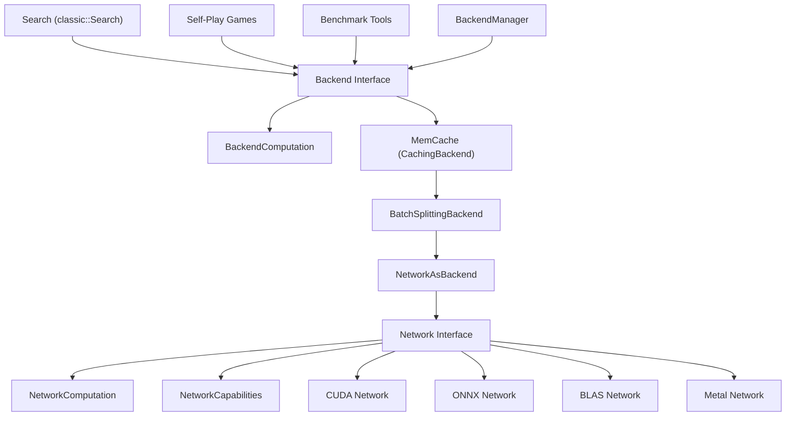
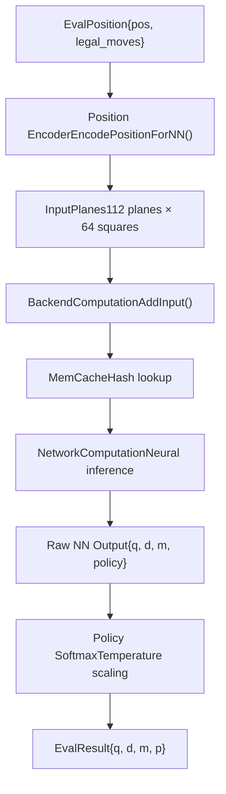
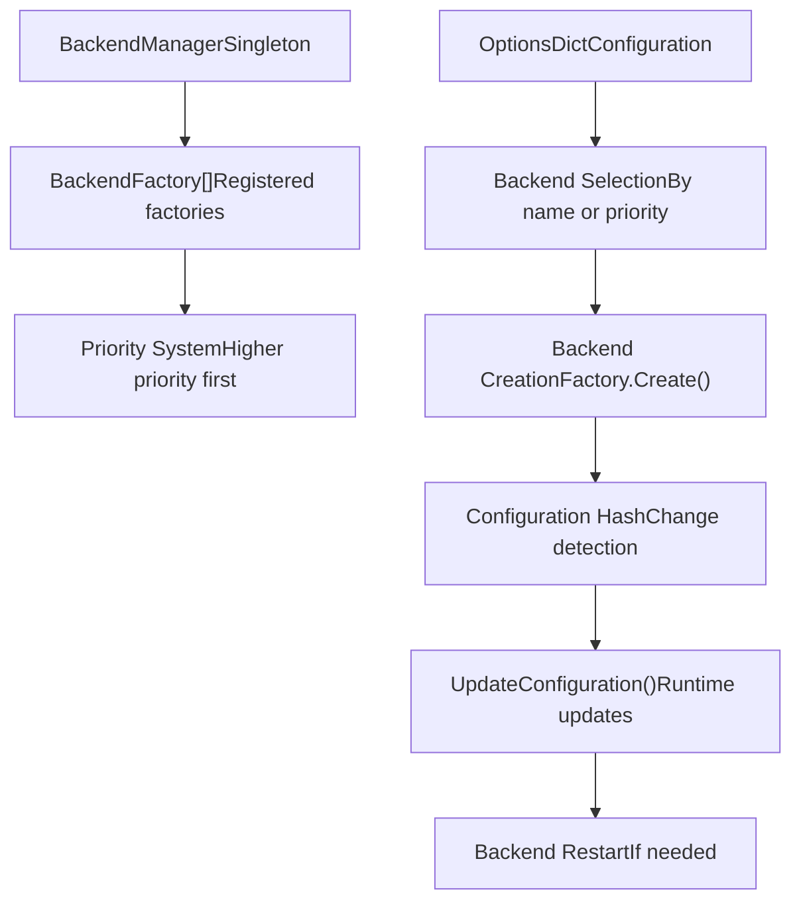

# 神经网络系统

相关源文件

-   [src/neural/backend.cc](https://github.com/LeelaChessZero/lc0/blob/b4e98c19/src/neural/backend.cc)
-   [src/neural/backend.h](https://github.com/LeelaChessZero/lc0/blob/b4e98c19/src/neural/backend.h)
-   [src/neural/batchsplit.cc](https://github.com/LeelaChessZero/lc0/blob/b4e98c19/src/neural/batchsplit.cc)
-   [src/neural/memcache.cc](https://github.com/LeelaChessZero/lc0/blob/b4e98c19/src/neural/memcache.cc)
-   [src/neural/memcache.h](https://github.com/LeelaChessZero/lc0/blob/b4e98c19/src/neural/memcache.h)
-   [src/neural/network.h](https://github.com/LeelaChessZero/lc0/blob/b4e98c19/src/neural/network.h)
-   [src/neural/shared\_params.cc](https://github.com/LeelaChessZero/lc0/blob/b4e98c19/src/neural/shared_params.cc)
-   [src/neural/shared\_params.h](https://github.com/LeelaChessZero/lc0/blob/b4e98c19/src/neural/shared_params.h)
-   [src/neural/wrapper.cc](https://github.com/LeelaChessZero/lc0/blob/b4e98c19/src/neural/wrapper.cc)
-   [src/tools/backendbench.cc](https://github.com/LeelaChessZero/lc0/blob/b4e98c19/src/tools/backendbench.cc)
-   [src/tools/benchmark.cc](https://github.com/LeelaChessZero/lc0/blob/b4e98c19/src/tools/benchmark.cc)
-   [src/tools/benchmark.h](https://github.com/LeelaChessZero/lc0/blob/b4e98c19/src/tools/benchmark.h)

## 目的与范围

神经网络系统为 Leela Chess Zero 中的神经网络推理提供了基础设施。该系统抽象了跨多个硬件后端（CUDA, ONNX, BLAS 等）的神经网络评估，并提供了缓存、批处理和性能优化功能。该系统连接了国际象棋搜索算法和底层神经网络实现。

有关特定后端实现的信息，请参阅 [CUDA 和 cuDNN 后端](/LeelaChessZero/lc0/6.3-cuda-and-cudnn-backend)、[ONNX 集成](/LeelaChessZero/lc0/6.4-onnx-integration) 和 [XLA 和 HLO 支持](/LeelaChessZero/lc0/6.5-xla-and-hlo-support)。有关网络权重格式和加载的详细信息，请参阅 [权重加载与管理](/LeelaChessZero/lc0/6.2-weights-loading-and-management)。有关搜索算法集成的信息，请参阅 [搜索算法](/LeelaChessZero/lc0/5-search-algorithm)。

## 系统架构

神经网络系统分为多个抽象层，每一层都提供特定的功能，同时保持清晰的关注点分离。

### 架构概览

来源：[src/neural/backend.h89-135](https://github.com/LeelaChessZero/lc0/blob/b4e98c19/src/neural/backend.h#L89-L135) [src/neural/network.h116-127](https://github.com/LeelaChessZero/lc0/blob/b4e98c19/src/neural/network.h#L116-L127) [src/neural/wrapper.cc48-97](https://github.com/LeelaChessZero/lc0/blob/b4e98c19/src/neural/wrapper.cc#L48-L97) [src/neural/memcache.cc60-98](https://github.com/LeelaChessZero/lc0/blob/b4e98c19/src/neural/memcache.cc#L60-L98)

### 关键抽象

系统提供了两个主要接口，用于不同的目的：

| 接口 | 目的 | 使用者 | 关键方法 |
| --- | --- | --- | --- |
| `Network` | 原始神经网络推理 | 后端适配器 | `NewComputation()`, `GetCapabilities()` |
| `Backend` | 高级评估接口 | 搜索算法 | `CreateComputation()`, `GetCachedEvaluation()` |

`Backend` 接口提供了搜索算法所需的额外功能，如缓存、配置管理和批处理优化，而 `Network` 纯粹专注于神经网络推理。

来源：[src/neural/backend.h89-135](https://github.com/LeelaChessZero/lc0/blob/b4e98c19/src/neural/backend.h#L89-L135) [src/neural/network.h116-127](https://github.com/LeelaChessZero/lc0/blob/b4e98c19/src/neural/network.h#L116-L127)

## 评估流水线

神经网络评估遵循从国际象棋局面到评估结果的结构化流水线。

### 评估流程

来源：[src/neural/wrapper.cc108-131](https://github.com/LeelaChessZero/lc0/blob/b4e98c19/src/neural/wrapper.cc#L108-L131) [src/neural/memcache.cc112-148](https://github.com/LeelaChessZero/lc0/blob/b4e98c19/src/neural/memcache.cc#L112-L148) [src/neural/backend.h70-87](https://github.com/LeelaChessZero/lc0/blob/b4e98c19/src/neural/backend.h#L70-L87)

### 输入和输出格式

系统通过标准化的编码格式处理国际象棋局面：

**输入格式 (`EvalPosition`)**:

-   `pos`: 国际象棋局面范围（当前 + 历史）
-   `legal_moves`: 用于策略评估的合法走法范围

**神经网络输入 (`InputPlanes`)**:

-   112 个输入平面，每个 64 个方格
-   每个平面使用位掩码 + 值编码以提高效率
-   包含局面历史、重复信息和元数据

**输出格式 (`EvalResult`)**:

-   `q`: 局面评估 (-1 到 +1)
-   `d`: 和棋概率 (如果 WDL 头可用)
-   `m`: 剩余步数估计 (如果 MLH 头可用)
-   `p`: 合法走法的策略概率

来源：[src/neural/backend.h52-73](https://github.com/LeelaChessZero/lc0/blob/b4e98c19/src/neural/backend.h#L52-L73) [src/neural/network.h38-53](https://github.com/LeelaChessZero/lc0/blob/b4e98c19/src/neural/network.h#L38-L53)

## 后端管理与选择

`BackendManager` 处理神经网络后端的发现、创建和生命周期管理。

### 后端工厂系统

来源：[src/neural/backend.h127-135](https://github.com/LeelaChessZero/lc0/blob/b4e98c19/src/neural/backend.h#L127-L135) [src/neural/wrapper.cc174-193](https://github.com/LeelaChessZero/lc0/blob/b4e98c19/src/neural/wrapper.cc#L174-L193) [src/neural/backend.cc54-66](https://github.com/LeelaChessZero/lc0/blob/b4e98c19/src/neural/backend.cc#L54-L66)

系统通过 `UpdateConfiguration()` 方法支持运行时配置更新，该方法可以动态处理更改，或者在基本参数发生更改时请求重启后端。

## 性能与缓存

### 内存缓存系统

`MemCache` 层提供基于哈希的神经网络评估缓存，以避免重复计算：

**缓存实现**:

-   使用局面哈希作为键的哈希键控缓存
-   使用 `HashKeyedCacheLock` 保证线程安全
-   超出容量时的 FIFO 驱逐策略
-   通过 `NNCacheSize` 参数配置缓存大小

**缓存行为**:

-   缓存命中时立即返回 (`FETCHED_IMMEDIATELY`)
-   缓存未命中时排队等待评估 (`ENQUEUED_FOR_EVAL`)
-   自动插入计算结果

来源：[src/neural/memcache.cc60-98](https://github.com/LeelaChessZero/lc0/blob/b4e98c19/src/neural/memcache.cc#L60-L98) [src/neural/memcache.cc112-148](https://github.com/LeelaChessZero/lc0/blob/b4e98c19/src/neural/memcache.cc#L112-L148)

### 批处理

系统通过智能批处理优化吞吐量：

**批拆分 (Batch Splitting)**: `BatchSplittingBackend` 自动管理批大小，拆分超过后端限制的大批次，并为了效率合并小批次。

**批优化**: 后端通过 `BackendAttributes` 报告最佳批大小：

-   `recommended_batch_size`: 建议的最佳吞吐量大小
-   `maximum_batch_size`: 单个批次的硬性限制

来源：[src/neural/batchsplit.cc33-93](https://github.com/LeelaChessZero/lc0/blob/b4e98c19/src/neural/batchsplit.cc#L33-L93) [src/neural/backend.h42-50](https://github.com/LeelaChessZero/lc0/blob/b4e98c19/src/neural/backend.h#L42-L50)

## 配置系统

### 共享参数

神经网络系统对跨后端通用的参数使用集中式配置系统：

| 参数 | 目的 | 默认值 |
| --- | --- | --- |
| `PolicyTemperature` | 策略 Softmax 温度 | 1.359 |
| `HistoryFill` | 如何填充缺失的历史记录 | "fen\_only" |
| `WeightsFile` | 网络权重的路径 | "<autodiscover>" |
| `Backend` | 后端选择 | 第一个可用的 |
| `BackendOptions` | 后端特定选项 | "" |
| `NNCacheSize` | 内存缓存大小 | 2,000,000 |

来源：[src/neural/shared\_params.h41-46](https://github.com/LeelaChessZero/lc0/blob/b4e98c19/src/neural/shared_params.h#L41-L46) [src/neural/shared\_params.cc68-84](https://github.com/LeelaChessZero/lc0/blob/b4e98c19/src/neural/shared_params.cc#L68-L84)

### 后端特定配置

每个后端都可以通过 `backend-opts` 参数定义额外的配置选项。系统解析这些选项并验证后端实现是否使用了所有指定的选项。

来源：[src/neural/wrapper.cc70-85](https://github.com/LeelaChessZero/lc0/blob/b4e98c19/src/neural/wrapper.cc#L70-L85) [src/neural/wrapper.cc183-191](https://github.com/LeelaChessZero/lc0/blob/b4e98c19/src/neural/wrapper.cc#L183-L191)
