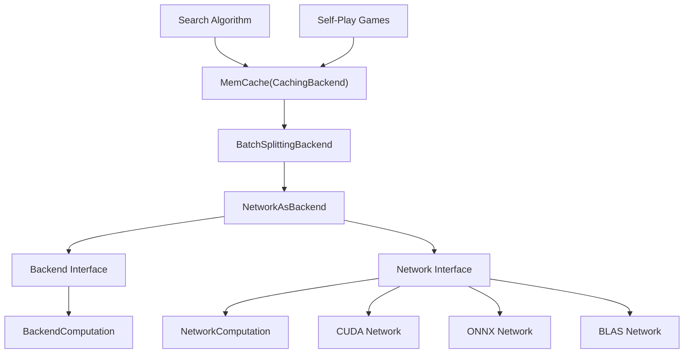
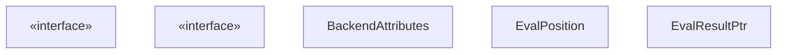
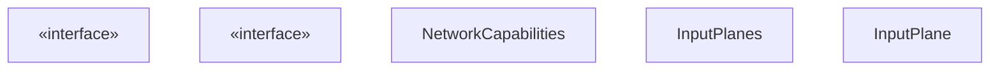
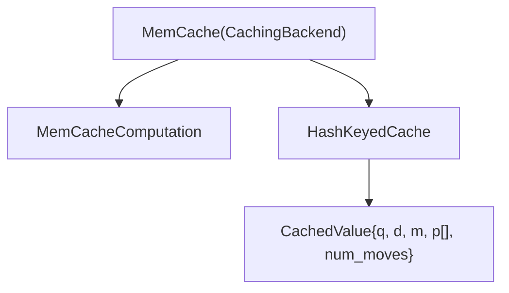
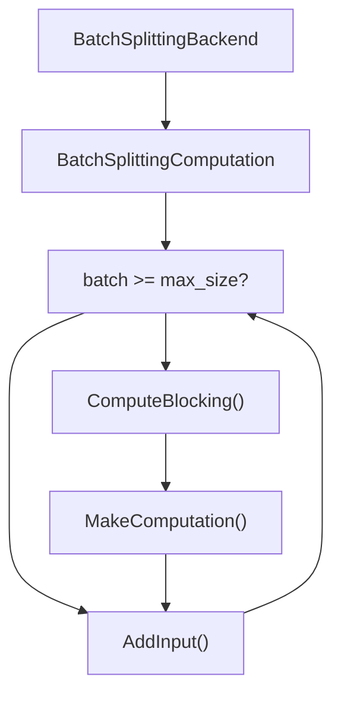
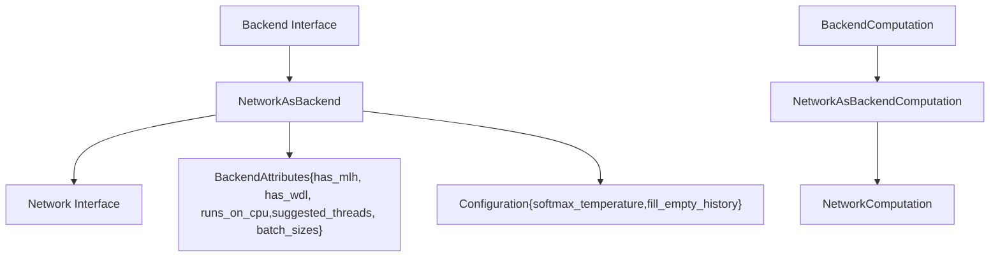
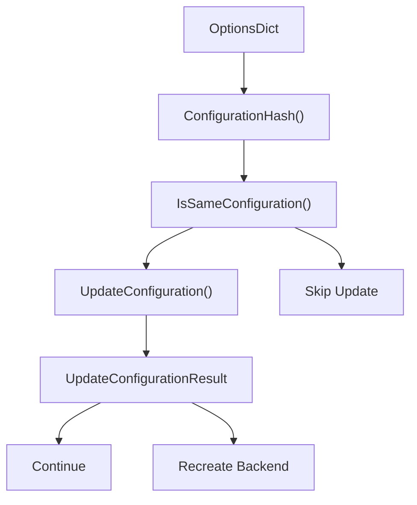

# 网络接口与后端架构

相关源文件

-   [src/neural/backend.cc](https://github.com/LeelaChessZero/lc0/blob/b4e98c19/src/neural/backend.cc)
-   [src/neural/backend.h](https://github.com/LeelaChessZero/lc0/blob/b4e98c19/src/neural/backend.h)
-   [src/neural/batchsplit.cc](https://github.com/LeelaChessZero/lc0/blob/b4e98c19/src/neural/batchsplit.cc)
-   [src/neural/memcache.cc](https://github.com/LeelaChessZero/lc0/blob/b4e98c19/src/neural/memcache.cc)
-   [src/neural/memcache.h](https://github.com/LeelaChessZero/lc0/blob/b4e98c19/src/neural/memcache.h)
-   [src/neural/network.h](https://github.com/LeelaChessZero/lc0/blob/b4e98c19/src/neural/network.h)
-   [src/neural/shared\_params.cc](https://github.com/LeelaChessZero/lc0/blob/b4e98c19/src/neural/shared_params.cc)
-   [src/neural/shared\_params.h](https://github.com/LeelaChessZero/lc0/blob/b4e98c19/src/neural/shared_params.h)
-   [src/neural/wrapper.cc](https://github.com/LeelaChessZero/lc0/blob/b4e98c19/src/neural/wrapper.cc)
-   [src/tools/backendbench.cc](https://github.com/LeelaChessZero/lc0/blob/b4e98c19/src/tools/backendbench.cc)
-   [src/tools/benchmark.cc](https://github.com/LeelaChessZero/lc0/blob/b4e98c19/src/tools/benchmark.cc)
-   [src/tools/benchmark.h](https://github.com/LeelaChessZero/lc0/blob/b4e98c19/src/tools/benchmark.h)

## 目的与范围

本文档详细介绍了 Leela Chess Zero 的神经网络后端架构，它为神经网络评估提供了一个分层的抽象系统。该架构使用多层接口（`Backend`, `Network`）以及用于缓存、批次管理和配置的装饰器模式。这允许引擎通过统一的接口支持多种神经网络实现（CUDA, ONNX, BLAS 等），同时提供透明的性能优化。有关特定后端实现的信息，请参阅 [CUDA/cuDNN 后端](/LeelaChessZero/lc0/6.3-cuda-and-cudnn-backend)、[ONNX 集成](/LeelaChessZero/lc0/6.4-onnx-integration) 或 [权重加载与管理](/LeelaChessZero/lc0/6.2-weights-loading-and-management)。

## 后端架构概览

神经网络评估系统使用具有多个抽象级别和装饰器模式的分层架构以实现可扩展性。

### 后端架构层级

来源：[src/neural/memcache.cc60-98](https://github.com/LeelaChessZero/lc0/blob/b4e98c19/src/neural/memcache.cc#L60-L98) [src/neural/batchsplit.cc33-57](https://github.com/LeelaChessZero/lc0/blob/b4e98c19/src/neural/batchsplit.cc#L33-L57) [src/neural/wrapper.cc48-97](https://github.com/LeelaChessZero/lc0/blob/b4e98c19/src/neural/wrapper.cc#L48-L97) [src/neural/backend.h89-125](https://github.com/LeelaChessZero/lc0/blob/b4e98c19/src/neural/backend.h#L89-L125) [src/neural/network.h116-125](https://github.com/LeelaChessZero/lc0/blob/b4e98c19/src/neural/network.h#L116-L125)

## 核心接口

系统定义了两个主要接口层，具有不同的职责。

### Backend 接口

`Backend` 接口作为神经网络评估的主要抽象：

`Backend` 接口提供：

-   支持批处理的局面评估
-   配置管理和热重载
-   缓存集成能力
-   通过 `BackendAttributes` 获取性能特征

来源：[src/neural/backend.h89-125](https://github.com/LeelaChessZero/lc0/blob/b4e98c19/src/neural/backend.h#L89-L125) [src/neural/backend.h43-50](https://github.com/LeelaChessZero/lc0/blob/b4e98c19/src/neural/backend.h#L43-L50) [src/neural/backend.h52-68](https://github.com/LeelaChessZero/lc0/blob/b4e98c19/src/neural/backend.h#L52-L68) [src/neural/backend.h70-74](https://github.com/LeelaChessZero/lc0/blob/b4e98c19/src/neural/backend.h#L70-L74)

### Network 接口

`Network` 接口代表底层的神经网络抽象：

`Network` 接口处理：

-   使用 `InputPlanes` 的原始神经网络操作
-   特定于硬件的优化
-   网络能力检测
-   低级计算管理

来源：[src/neural/network.h116-125](https://github.com/LeelaChessZero/lc0/blob/b4e98c19/src/neural/network.h#L116-L125) [src/neural/network.h56-71](https://github.com/LeelaChessZero/lc0/blob/b4e98c19/src/neural/network.h#L56-L71) [src/neural/network.h85-114](https://github.com/LeelaChessZero/lc0/blob/b4e98c19/src/neural/network.h#L85-L114) [src/neural/network.h43-53](https://github.com/LeelaChessZero/lc0/blob/b4e98c19/src/neural/network.h#L43-L53)

## 后端装饰器架构

系统采用装饰器模式，以透明的方式向后端实现添加功能。

### 缓存层 - MemCache

`MemCache` 类使用 `CachingBackend` 实现局面评估缓存：

关键实现细节：

-   使用 `ComputeEvalPositionHash()` 从局面历史生成缓存键
-   在具有 Q/D/M 值和策略数组的 `CachedValue` 结构中存储评估
-   `MemCacheComputation` 在转发到包装的后端之前检查缓存
-   缓存大小可通过 `SharedBackendParams::kNNCacheSizeId` 配置

来源：[src/neural/memcache.cc41-43](https://github.com/LeelaChessZero/lc0/blob/b4e98c19/src/neural/memcache.cc#L41-L43) [src/neural/memcache.cc45-51](https://github.com/LeelaChessZero/lc0/blob/b4e98c19/src/neural/memcache.cc#L45-L51) [src/neural/memcache.cc60-98](https://github.com/LeelaChessZero/lc0/blob/b4e98c19/src/neural/memcache.cc#L60-L98) [src/neural/memcache.cc100-159](https://github.com/LeelaChessZero/lc0/blob/b4e98c19/src/neural/memcache.cc#L100-L159)

### 批次管理 - BatchSplittingBackend

`BatchSplittingBackend` 自动管理批次大小限制：

实现：

-   监控 `UsedBatchSize()` 对比 `maximum_batch_size`
-   当批次已满时自动调用 `ComputeBlocking()`
-   透明地创建新的计算实例
-   在受大小限制的后端上启用无限批次大小

来源：[src/neural/batchsplit.cc33-57](https://github.com/LeelaChessZero/lc0/blob/b4e98c19/src/neural/batchsplit.cc#L33-L57) [src/neural/batchsplit.cc59-89](https://github.com/LeelaChessZero/lc0/blob/b4e98c19/src/neural/batchsplit.cc#L59-L89)

## 工厂与注册系统

系统使用带有基于优先级选择的工厂模式进行后端实例化。

### 后端工厂架构

### 后端创建流程

> **[Mermaid sequence]**
> *(图表结构无法解析)*

`BackendManager` 单例：

-   维护按优先级排序的已注册 `BackendFactory` 实例
-   当未请求特定后端时，选择优先级最高的工厂
-   通过 `CreateFromParams()` 支持运行时后端切换

来源：[src/neural/register.h37-72](https://github.com/LeelaChessZero/lc0/blob/b4e98c19/src/neural/register.h#L37-L72) [src/neural/wrapper.cc174-193](https://github.com/LeelaChessZero/lc0/blob/b4e98c19/src/neural/wrapper.cc#L174-L193)

### NetworkFactory

`NetworkFactory` 是一个单例，负责管理 `Network` 实例的创建：

1.  网络实现使用 `NetworkFactory::Register` 注册自己
2.  每个已注册的实现都有一个名称、工厂函数和优先级
3.  用户可以使用 `NetworkFactory::Create()` 按名称创建网络
4.  当未指定名称时，工厂选择优先级最高的实现

来源：[src/neural/factory.h42-109](https://github.com/LeelaChessZero/lc0/blob/b4e98c19/src/neural/factory.h#L42-L109)

### BackendManager

`BackendManager` 对较新的 `Backend` 接口扮演类似的角色：

1.  后端实现通过 `BackendManager::Register` 注册
2.  每个都有名称、工厂和优先级
3.  `CreateFromParams()` 和 `CreateFromName()` 创建后端
4.  优先级决定默认实现

来源：[src/neural/register.h37-72](https://github.com/LeelaChessZero/lc0/blob/b4e98c19/src/neural/register.h#L37-L72) [src/neural/register.cc36-90](https://github.com/LeelaChessZero/lc0/blob/b4e98c19/src/neural/register.cc#L36-L90)

### 注册机制

Leela Chess Zero 使用宏来简化注册：

-   `REGISTER_NETWORK`: 同时在 `NetworkFactory` 和 `BackendManager` 中注册网络实现
-   `REGISTER_BACKEND`: 注册仅后端的实现

这种双重注册确保网络实现可以通过两个接口使用。

来源：[src/neural/factory.h111-140](https://github.com/LeelaChessZero/lc0/blob/b4e98c19/src/neural/factory.h#L111-L140) [src/neural/register.h74-78](https://github.com/LeelaChessZero/lc0/blob/b4e98c19/src/neural/register.h#L74-L78)

## 网络到后端适配器

`NetworkAsBackend` 适配器使用适配器模式桥接 `Network` 和 `Backend` 接口。

### 适配器架构

### NetworkAsBackend 实现

适配器执行几个关键转换：

| 后端方法 | 网络等效项 | 转换 |
| --- | --- | --- |
| `GetAttributes()` | `GetCapabilities()` | 将 `NetworkCapabilities` 映射到 `BackendAttributes` |
| `CreateComputation()` | `NewComputation()` | 使用格式转换进行包装 |
| `UpdateConfiguration()` | N/A | 管理 Softmax 温度、历史填充 |

管理的配置参数：

-   `softmax_policy_temperature_`: 源自 `SharedBackendParams::kPolicySoftmaxTemp`
-   `fill_empty_history_`: 源自 `SharedBackendParams::kHistoryFill`
-   `input_format_`: 从网络能力中提取

来源：[src/neural/wrapper.cc48-97](https://github.com/LeelaChessZero/lc0/blob/b4e98c19/src/neural/wrapper.cc#L48-L97) [src/neural/wrapper.cc69-85](https://github.com/LeelaChessZero/lc0/blob/b4e98c19/src/neural/wrapper.cc#L69-L85)

### NetworkAsBackendComputation 实现

计算适配器处理格式转换和批处理：

> **[Mermaid sequence]**
> *(图表结构无法解析)*

关键转换：

1.  `EvalPosition` → `InputPlanes` 通过 `EncodePositionForNN()`
2.  在 `SoftmaxPolicy()` 中，原始策略 Logits → Softmax 概率
3.  使用 `MoveToNNIndex()` 进行走法索引转换

来源：[src/neural/wrapper.cc99-169](https://github.com/LeelaChessZero/lc0/blob/b4e98c19/src/neural/wrapper.cc#L99-L169) [src/neural/wrapper.cc133-153](https://github.com/LeelaChessZero/lc0/blob/b4e98c19/src/neural/wrapper.cc#L133-L153)

## 配置与参数

后端系统使用通过 `SharedBackendParams` 系统管理的共享配置参数。

### 共享后端参数

以下参数在大多数后端实现中是通用的：

| 参数 | 类型 | 目的 | 默认值 |
| --- | --- | --- | --- |
| `kWeightsId` | String | 神经网络权重文件的路径 | `<autodiscover>` |
| `kBackendId` | Choice | 要使用的后端实现 | 第一个可用的 |
| `kBackendOptionsId` | String | 后端特定配置 | 空 |
| `kNNCacheSizeId` | Integer | 内存缓存大小（局面数） | 2,000,000 |
| `kPolicySoftmaxTemp` | Float | 策略概率温度 | 1.359 |
| `kHistoryFill` | Choice | 历史填充策略 | `fen_only` |

来源：[src/neural/shared\_params.cc33-66](https://github.com/LeelaChessZero/lc0/blob/b4e98c19/src/neural/shared_params.cc#L33-L66) [src/neural/shared\_params.cc68-84](https://github.com/LeelaChessZero/lc0/blob/b4e98c19/src/neural/shared_params.cc#L68-L84)

### 配置管理

后端配置遵循基于哈希的变更检测系统：

`Backend::ConfigurationHash()` 方法通过以下内容创建哈希：

-   后端名称 (`kBackendId`)
-   后端选项 (`kBackendOptionsId`)
-   权重路径 (`kWeightsId`)
-   策略温度 (`kPolicySoftmaxTemp`)
-   历史填充设置 (`kHistoryFill`)

来源：[src/neural/backend.cc54-66](https://github.com/LeelaChessZero/lc0/blob/b4e98c19/src/neural/backend.cc#L54-L66) [src/neural/backend.h106-118](https://github.com/LeelaChessZero/lc0/blob/b4e98c19/src/neural/backend.h#L106-L118)

## 用法示例

### 创建后端栈

> **[Mermaid sequence]**
> *(图表结构无法解析)*

### 评估流程

> **[Mermaid sequence]**
> *(图表结构无法解析)*

来源：[src/neural/memcache.cc112-140](https://github.com/LeelaChessZero/lc0/blob/b4e98c19/src/neural/memcache.cc#L112-L140) [src/neural/batchsplit.cc70-79](https://github.com/LeelaChessZero/lc0/blob/b4e98c19/src/neural/batchsplit.cc#L70-L79) [src/neural/wrapper.cc121-131](https://github.com/LeelaChessZero/lc0/blob/b4e98c19/src/neural/wrapper.cc#L121-L131)

## 常见用法模式

### 创建网络

> **[Mermaid sequence]**
> *(图表结构无法解析)*

### 评估局面

> **[Mermaid sequence]**
> *(图表结构无法解析)*

来源：[src/neural/network.h56-71](https://github.com/LeelaChessZero/lc0/blob/b4e98c19/src/neural/network.h#L56-L71) [src/neural/network.h116-125](https://github.com/LeelaChessZero/lc0/blob/b4e98c19/src/neural/network.h#L116-L125)

## 实现示例

在 lc0 中实现神经网络后端时，开发人员需要：

1.  实现 `Network` 接口（或者直接实现 `Backend`）
2.  创建构造实现的工厂函数
3.  使用提供的宏注册实现

此模式确保任何神经网络实现都可以无缝集成到引擎中，无论底层技术如何（CUDA, OpenCL, BLAS 等）。

来源：[src/neural/factory.h111-140](https://github.com/LeelaChessZero/lc0/blob/b4e98c19/src/neural/factory.h#L111-L140)
