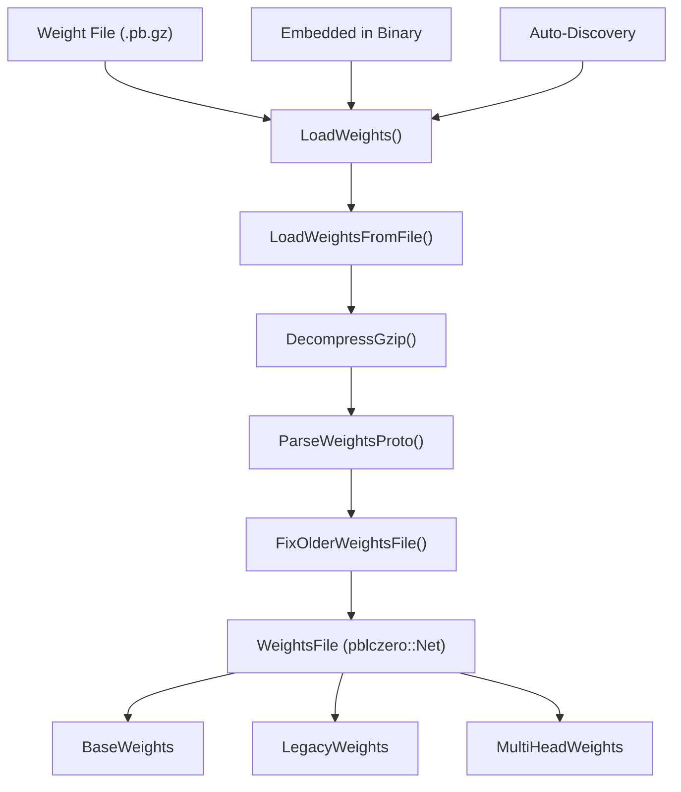
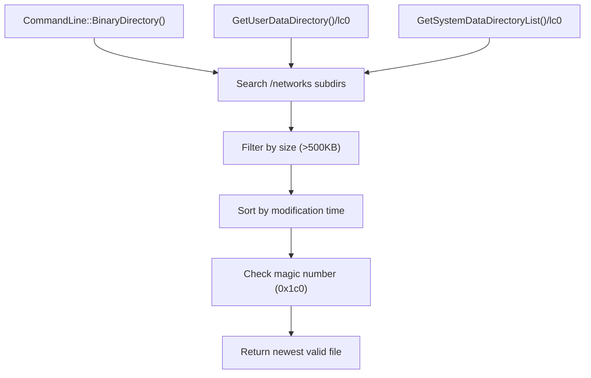
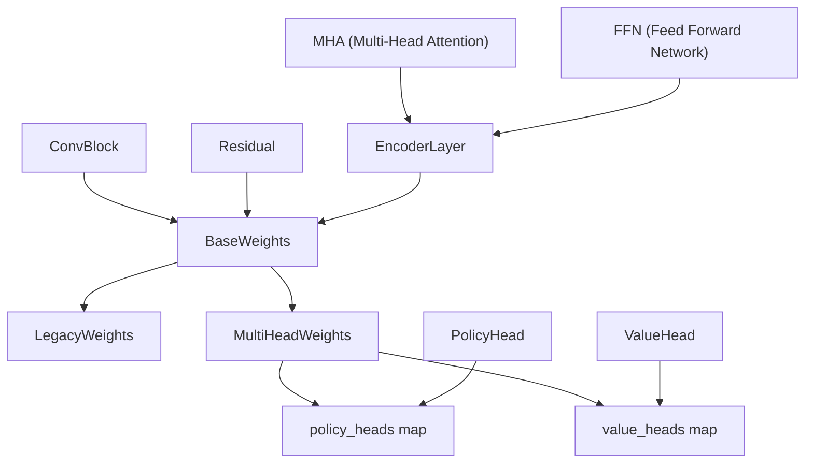
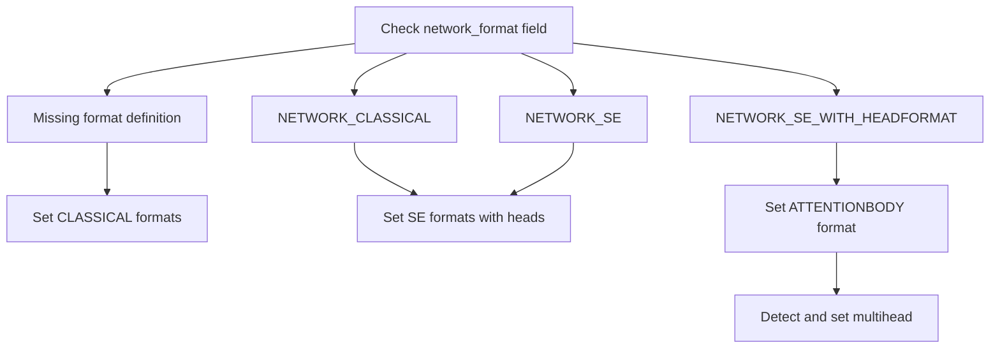

# 权重加载与管理

相关源文件

-   [src/neural/loader.cc](https://github.com/LeelaChessZero/lc0/blob/b4e98c19/src/neural/loader.cc)
-   [src/neural/loader.h](https://github.com/LeelaChessZero/lc0/blob/b4e98c19/src/neural/loader.h)
-   [src/neural/network\_legacy.cc](https://github.com/LeelaChessZero/lc0/blob/b4e98c19/src/neural/network_legacy.cc)
-   [src/neural/network\_legacy.h](https://github.com/LeelaChessZero/lc0/blob/b4e98c19/src/neural/network_legacy.h)

本文档涵盖了 Leela Chess Zero 中的神经网络权重加载系统，包括文件格式处理、自动发现机制和权重结构管理。该系统负责从各种来源加载训练好的神经网络模型，并将其转换为可用的 C++ 数据结构。

有关使用这些权重的神经网络后端的信息，请参阅 [网络接口与后端架构](/LeelaChessZero/lc0/6.1-network-interface-and-backend-architecture)。有关缓存神经网络评估的详细信息，请参阅 [内存缓存与性能](/LeelaChessZero/lc0/6.6-memory-caching-and-performance)。

## 权重文件格式与加载流水线

权重加载系统处理存储为 Google Protocol Buffer 格式并使用 gzip 压缩的神经网络模型。该系统支持多种加载源，并为旧的权重格式提供向后兼容性。

来源：[src/neural/loader.cc194-227](https://github.com/LeelaChessZero/lc0/blob/b4e98c19/src/neural/loader.cc#L194-L227) [src/neural/loader.h44-60](https://github.com/LeelaChessZero/lc0/blob/b4e98c19/src/neural/loader.h#L44-L60)

## 权重文件发现与来源

系统支持三种主要的方法来定位权重文件，由 `LoadWeights` 函数处理。

### 来源类型

| 来源类型 | 标识符 | 描述 |
| --- | --- | --- |
| 文件路径 | `filename` | 权重文件的直接路径 |
| 自动发现 | `<autodiscover>` | 搜索预定义的目录 |
| 嵌入式 | `<embed>` | 嵌入在二进制文件中的权重 |

### 自动发现过程

`DiscoverWeightsFile` 函数实现了一种复杂的搜索算法，用于检查多个目录中的潜在权重文件：

来源：[src/neural/loader.cc229-277](https://github.com/LeelaChessZero/lc0/blob/b4e98c19/src/neural/loader.cc#L229-L277) [src/neural/loader.cc57](https://github.com/LeelaChessZero/lc0/blob/b4e98c19/src/neural/loader.cc#L57-L57)

## 权重文件格式结构

权重文件使用定义在 `proto/net.pb.h` 中的 Protocol Buffer 格式，并具有特定的魔数和版本检查以进行验证。

### 文件格式验证

系统在加载权重文件时执行多个验证步骤：

-   **魔数检查**: 文件必须以魔数 `0x1c0` 开头 [src/neural/loader.cc164-166](https://github.com/LeelaChessZero/lc0/blob/b4e98c19/src/neural/loader.cc#L164-L166)
-   **版本兼容性**: 确保权重文件与当前 LC0 版本兼容 [src/neural/loader.cc168-182](https://github.com/LeelaChessZero/lc0/blob/b4e98c19/src/neural/loader.cc#L168-L182)
-   **编码支持**: 仅支持 `LINEAR16` 权重编码 [src/neural/loader.cc184-187](https://github.com/LeelaChessZero/lc0/blob/b4e98c19/src/neural/loader.cc#L184-L187)

### 嵌入式权重支持

系统可以加载直接嵌入在 LC0 二进制可执行文件中的权重。加载嵌入式权重时，系统会：

1.  定位到二进制文件的末尾
2.  从最后 8 个字节读取大小和魔数
3.  验证魔数 `0x2130634c` ("Lc0!")
4.  提取嵌入的权重数据

来源：[src/neural/loader.cc70-80](https://github.com/LeelaChessZero/lc0/blob/b4e98c19/src/neural/loader.cc#L70-L80)

## 权重结构层次

加载的权重被转换为针对不同神经网络架构优化的结构化 C++ 对象。系统支持传统的单头网络和现代的多头架构。

来源：[src/neural/network\_legacy.h28-149](https://github.com/LeelaChessZero/lc0/blob/b4e98c19/src/neural/network_legacy.h#L28-L149) [src/neural/network\_legacy.h178-229](https://github.com/LeelaChessZero/lc0/blob/b4e98c19/src/neural/network_legacy.h#L178-L229)

### 权重组件类型

权重结构按层次组织，以表示不同的神经网络组件：

#### 卷积组件

-   **ConvBlock**: 包含权重、偏置和批归一化 (Batch Normalization) 参数 [src/neural/network\_legacy.h32-41](https://github.com/LeelaChessZero/lc0/blob/b4e98c19/src/neural/network_legacy.h#L32-L41)
-   **Residual**: 表示带有可选的 Squeeze-and-Excitation 单元的残差块 [src/neural/network\_legacy.h51-57](https://github.com/LeelaChessZero/lc0/blob/b4e98c19/src/neural/network_legacy.h#L51-L57)

#### 注意力组件

-   **MHA**: 多头注意力权重，包括查询 (query)、键 (key)、值 (value) 和密集投影 [src/neural/network\_legacy.h72-84](https://github.com/LeelaChessZero/lc0/blob/b4e98c19/src/neural/network_legacy.h#L72-L84)
-   **FFN**: Transformer 层的前馈网络权重 [src/neural/network\_legacy.h86-92](https://github.com/LeelaChessZero/lc0/blob/b4e98c19/src/neural/network_legacy.h#L86-L92)
-   **EncoderLayer**: 结合了 MHA 和 FFN 的完整 Transformer 编码器层 [src/neural/network\_legacy.h94-102](https://github.com/LeelaChessZero/lc0/blob/b4e98c19/src/neural/network_legacy.h#L94-L102)

#### 专用组件

-   **Smolgen**: Smolgen 注意力机制的权重 [src/neural/network\_legacy.h59-70](https://github.com/LeelaChessZero/lc0/blob/b4e98c19/src/neural/network_legacy.h#L59-L70)
-   **SEunit**: Squeeze-and-Excitation 单元权重 [src/neural/network\_legacy.h43-49](https://github.com/LeelaChessZero/lc0/blob/b4e98c19/src/neural/network_legacy.h#L43-L49)

## 传统兼容性与格式迁移

系统通过 `FixOlderWeightsFile` 函数保持与旧权重文件格式的向后兼容性，该函数会自动更新旧的格式规范。

### 格式迁移过程

来源：[src/neural/loader.cc108-158](https://github.com/LeelaChessZero/lc0/blob/b4e98c19/src/neural/loader.cc#L108-L158)

### 批归一化折叠 (Batch Normalization Folding)

`ConvBlock` 构造函数会自动将批归一化参数折叠到卷积权重和偏置中以进行优化：

1.  **方差归一化**: 将标准差转换为 gamma 缩放因子 [src/neural/network\_legacy.cc111](https://github.com/LeelaChessZero/lc0/blob/b4e98c19/src/neural/network_legacy.cc#L111-L111)
2.  **权重缩放**: 将批归一化缩放应用于卷积权重 [src/neural/network\_legacy.cc120-123](https://github.com/LeelaChessZero/lc0/blob/b4e98c19/src/neural/network_legacy.cc#L120-L123)
3.  **偏置调整**: 计算结合了批归一化偏移的最终偏置 [src/neural/network\_legacy.cc125](https://github.com/LeelaChessZero/lc0/blob/b4e98c19/src/neural/network_legacy.cc#L125-L125)

来源：[src/neural/network\_legacy.cc108-133](https://github.com/LeelaChessZero/lc0/blob/b4e98c19/src/neural/network_legacy.cc#L108-L133)

## 权重加载配置

权重加载系统与配置系统集成，通过命令行选项和配置文件提供灵活的权重源指定。

### 配置参数

| 参数 | 目的 | 默认行为 |
| --- | --- | --- |
| `weights` | 指定权重源位置 | 如果未设置则自动发现 |
| `backend` | 决定哪个后端加载权重 | 影响权重结构的使用 |

系统使用 `SharedBackendParams` 常量来识别特殊的权重源类型：

-   `kAutoDiscover`: 触发自动发现机制
-   `kEmbed`: 从二进制文件加载嵌入式权重

来源：[src/neural/loader.cc215-218](https://github.com/LeelaChessZero/lc0/blob/b4e98c19/src/neural/loader.cc#L215-L218)
