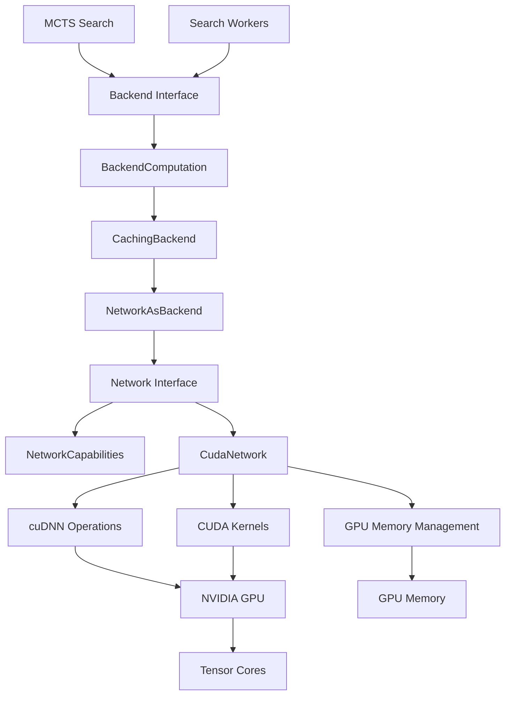
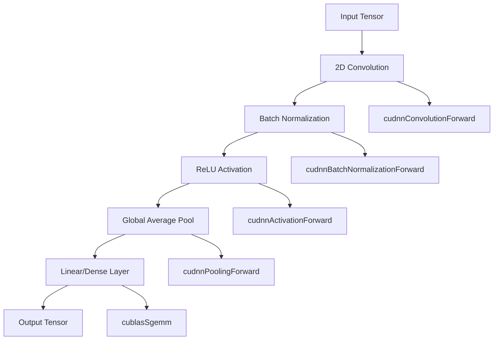
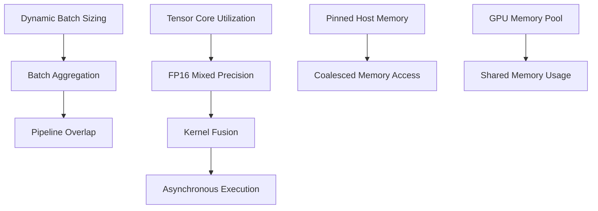
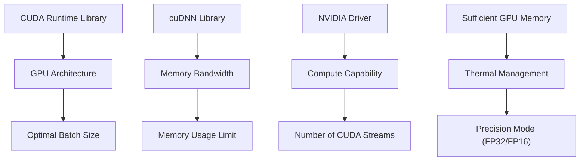

# CUDA 和 cuDNN 后端

相关源文件

-   [.gitignore](https://github.com/LeelaChessZero/lc0/blob/b4e98c19/.gitignore)
-   [src/utils/transpose.h](https://github.com/LeelaChessZero/lc0/blob/b4e98c19/src/utils/transpose.h)

## 目的与范围

本文档涵盖了 Leela Chess Zero 中用于神经网络推理的 CUDA 和 cuDNN 后端实现。CUDA 后端使用 CUDA 运行时和 cuDNN (CUDA 深度神经网络) 库在 NVIDIA 硬件上提供 GPU 加速，以实现优化的张量操作。此后端是神经网络系统架构中的几个特定于硬件的实现之一。

有关整体后端架构和接口设计的信息，请参阅 [网络接口与后端架构](/LeelaChessZero/lc0/6.1-network-interface-and-backend-architecture)。有关其他 GPU 后端（如 Metal 或 OpenCL）的详细信息，请参阅相应的后端文档。有关适用于所有后端的神经网络缓存和性能优化的信息，请参阅 [内存缓存与性能](/LeelaChessZero/lc0/6.6-memory-caching-and-performance)。

## 架构概览

CUDA 后端通过标准的 `Network` 接口集成到 lc0 的模块化神经网络系统中，为 NVIDIA 硬件提供 GPU 加速推理。该实现利用 CUDA 进行通用 GPU 计算，并利用 cuDNN 进行专门的深度学习操作。

### 系统上下文中的 CUDA 后端

来源：[.gitignore11](https://github.com/LeelaChessZero/lc0/blob/b4e98c19/.gitignore#L11-L11) [src/utils/transpose.h21-25](https://github.com/LeelaChessZero/lc0/blob/b4e98c19/src/utils/transpose.h#L21-L25)

## CUDA 后端组件

CUDA 后端实现由几个关键组件组成，这些组件协同工作以在 NVIDIA GPU 上提供高效的神经网络推理。

### 核心实现结构

```mermaid
flowchart TD
    CudaNetwork["CudaNetwork"]
    InitCuda["CUDA Initialization"]
    WeightLoader["Weights Loading"]
    ForwardPass["Forward Inference"]
    Convolution["Convolution Layers"]
    BatchNorm["Batch Normalization"]
    Activation["Activation Functions"]
    FullyConnected["Fully Connected"]
    DeviceMemory["Device Memory Allocation"]
    HostMemory["Host Memory Pinning"]
    MemoryPool["Memory Pool Management"]
    CopyOperations["Host-Device Transfers"]
    TensorRT["TensorRT Integration"]
    MixedPrecision["Mixed Precision (FP16)"]
    StreamManagement["CUDA Streams"]
    BatchOptimization["Batch Size Optimization"]

    CudaNetwork --> InitCuda
    CudaNetwork --> WeightLoader
    CudaNetwork --> ForwardPass
    ForwardPass --> Convolution
    ForwardPass --> BatchNorm
    ForwardPass --> Activation
    ForwardPass --> FullyConnected
    CudaNetwork --> DeviceMemory
    DeviceMemory --> HostMemory
    DeviceMemory --> MemoryPool
    DeviceMemory --> CopyOperations
    CudaNetwork --> TensorRT
    CudaNetwork --> MixedPrecision
    CudaNetwork --> StreamManagement
    CudaNetwork --> BatchOptimization
```

来源：[.gitignore11](https://github.com/LeelaChessZero/lc0/blob/b4e98c19/.gitignore#L11-L11) [src/utils/transpose.h21-25](https://github.com/LeelaChessZero/lc0/blob/b4e98c19/src/utils/transpose.h#L21-L25)

## CUDA 运行时集成

CUDA 后端通过与 CUDA 运行时 API 的仔细集成来管理 GPU 资源和执行。这包括设备选择、上下文管理和最佳资源利用。

### GPU 资源管理

| 组件 | 目的 | 关键操作 |
| --- | --- | --- |
| 设备选择 | 选择最佳 GPU | `cudaGetDeviceCount()`, `cudaSetDevice()` |
| 上下文管理 | CUDA 上下文生命周期 | 上下文创建、销毁、切换 |
| 内存分配 | GPU 内存管理 | `cudaMalloc()`, `cudaFree()`, 内存池 |
| 流管理 | 异步执行 | 流创建、同步、重叠 |
| 错误处理 | CUDA 错误管理 | 错误检查、恢复、诊断 |

### cuDNN 库集成

CUDA 后端利用 cuDNN 进行优化的深度学习操作。cuDNN 提供了高度调优的神经网络原语实现，性能显著优于简单的 CUDA 实现。

来源：[src/utils/transpose.h21-25](https://github.com/LeelaChessZero/lc0/blob/b4e98c19/src/utils/transpose.h#L21-L25)

## 性能优化

CUDA 后端实现了多种性能优化，以最大限度地利用 GPU 并最小化推理延迟。

### 内存与计算优化

来源：[src/utils/transpose.h40-65](https://github.com/LeelaChessZero/lc0/blob/b4e98c19/src/utils/transpose.h#L40-L65)

## 构建系统集成

CUDA 后端需要特定的构建配置以链接 CUDA 和 cuDNN 库。构建系统处理 CUDA 工具包检测、版本兼容性和架构特定的优化。

### CUDA 构建依赖

| 依赖项 | 目的 | 版本要求 |
| --- | --- | --- |
| CUDA Toolkit | 核心 CUDA 运行时和编译器 | CUDA 10.0+ |
| cuDNN | 深度学习原语 | cuDNN 7.0+ |
| NVIDIA Driver | GPU 驱动兼容性 | 与 CUDA 版本兼容 |
| Compute Capability | GPU 架构支持 | 推荐 SM 6.0+ |

构建系统会自动检测 CUDA 安装路径，并为目标 GPU 架构配置编译器标志以获得最佳性能。

### 部署注意事项

来源：[.gitignore11](https://github.com/LeelaChessZero/lc0/blob/b4e98c19/.gitignore#L11-L11) [src/utils/transpose.h21-25](https://github.com/LeelaChessZero/lc0/blob/b4e98c19/src/utils/transpose.h#L21-L25)
