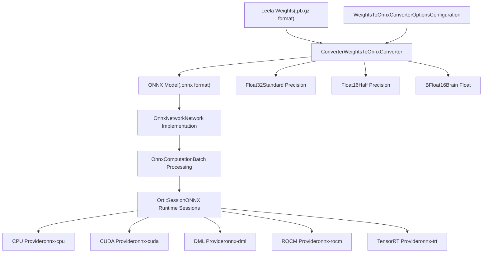
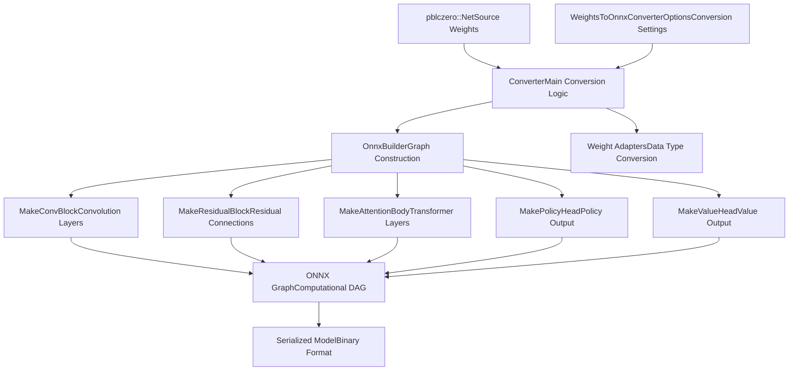
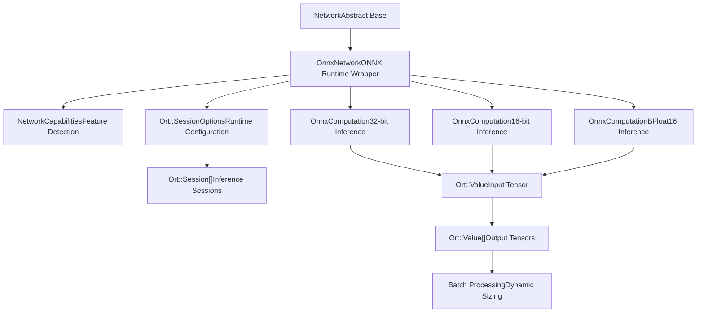
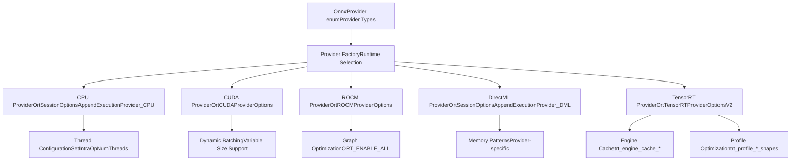
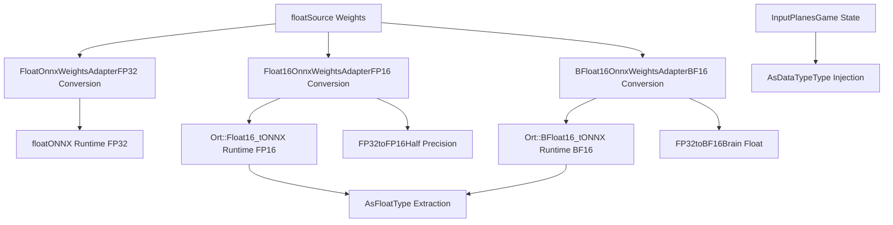
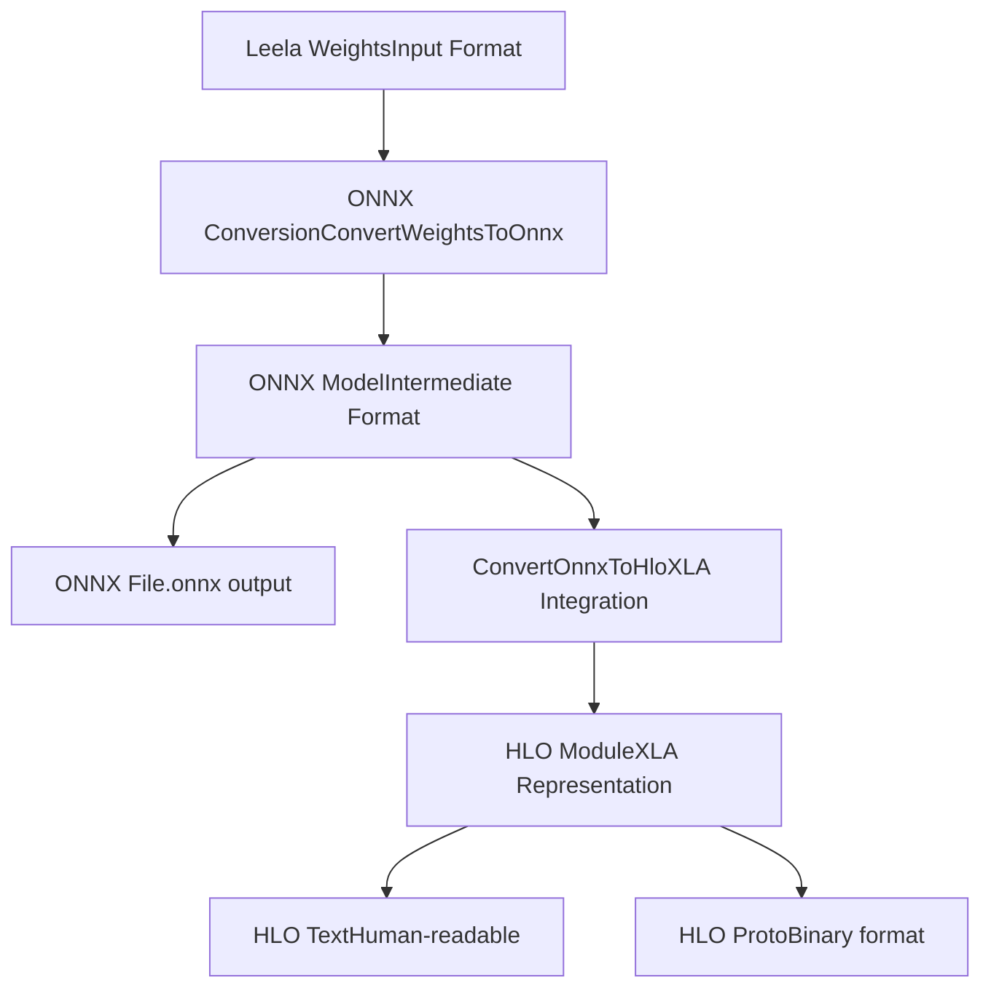

# ONNX 集成

相关源文件

-   [src/neural/backends/network\_onnx.cc](https://github.com/LeelaChessZero/lc0/blob/b4e98c19/src/neural/backends/network_onnx.cc)
-   [src/neural/onnx/builder.cc](https://github.com/LeelaChessZero/lc0/blob/b4e98c19/src/neural/onnx/builder.cc)
-   [src/neural/onnx/builder.h](https://github.com/LeelaChessZero/lc0/blob/b4e98c19/src/neural/onnx/builder.h)
-   [src/neural/onnx/converter.cc](https://github.com/LeelaChessZero/lc0/blob/b4e98c19/src/neural/onnx/converter.cc)
-   [src/neural/onnx/converter.h](https://github.com/LeelaChessZero/lc0/blob/b4e98c19/src/neural/onnx/converter.h)
-   [src/tools/leela2onnx.cc](https://github.com/LeelaChessZero/lc0/blob/b4e98c19/src/tools/leela2onnx.cc)
-   [src/utils/bf16\_utils.h](https://github.com/LeelaChessZero/lc0/blob/b4e98c19/src/utils/bf16_utils.h)

ONNX 集成系统通过将原生 Leela 权重格式转换为 ONNX 模型并使用 ONNX Runtime 执行它们，为 Leela Chess Zero 提供了跨平台的神经网络推理能力。该系统支持多种硬件加速提供程序和数据精度格式，从而能够在从 CPU 到专用 AI 加速器的各种计算环境中进行部署。

有关其他神经网络后端的信息，请参阅 [网络接口与后端架构](/LeelaChessZero/lc0/6.1-network-interface-and-backend-architecture)。有关权重加载和管理的详细信息，请参阅 [权重加载与管理](/LeelaChessZero/lc0/6.2-weights-loading-and-management)。

## ONNX 系统架构

ONNX 集成由两个主要子系统组成：将 Leela 权重转换为 ONNX 格式的转换流水线，以及使用各种硬件提供程序执行 ONNX 模型的运行时后端。

### ONNX 集成概览

来源：[src/neural/onnx/converter.h37-56](https://github.com/LeelaChessZero/lc0/blob/b4e98c19/src/neural/onnx/converter.h#L37-L56) [src/neural/backends/network\_onnx.cc86-137](https://github.com/LeelaChessZero/lc0/blob/b4e98c19/src/neural/backends/network_onnx.cc#L86-L137) [src/neural/backends/network\_onnx.cc59-60](https://github.com/LeelaChessZero/lc0/blob/b4e98c19/src/neural/backends/network_onnx.cc#L59-L60)

## 权重转换系统

转换系统通过 `Converter` 类和相关的构建器实用工具，将 Leela 的原生 protobuf 权重格式转换为 ONNX 计算图。

### 转换过程流程

来源：[src/neural/onnx/converter.cc53-182](https://github.com/LeelaChessZero/lc0/blob/b4e98c19/src/neural/onnx/converter.cc#L53-L182) [src/neural/onnx/builder.cc39-58](https://github.com/LeelaChessZero/lc0/blob/b4e98c19/src/neural/onnx/builder.cc#L39-L58) [src/neural/onnx/converter.cc69](https://github.com/LeelaChessZero/lc0/blob/b4e98c19/src/neural/onnx/converter.cc#L69-L69)

### 转换配置选项

`WeightsToOnnxConverterOptions` 结构体为转换过程提供了广泛的配置：

| 选项 | 类型 | 目的 |
| --- | --- | --- |
| `data_type` | `DataType` | 精度格式 (Float32/Float16/BFloat16) |
| `opset` | `int` | ONNX 算子集版本 (7-22) |
| `ir` | `int` | ONNX IR 版本 (-1 为自动) |
| `batch_size` | `int` | 固定批次大小 (-1 为动态) |
| `alt_mish` | `bool` | 替代的 Mish 激活实现 |
| `alt_layernorm` | `bool` | 替代的层归一化 (LayerNormalization) 实现 |
| `policy_head` | `string` | 策略头变体 ("vanilla", "optimistic", "soft") |
| `value_head` | `string` | 价值头变体 ("winner", "q", "st") |

来源：[src/neural/onnx/converter.h38-56](https://github.com/LeelaChessZero/lc0/blob/b4e98c19/src/neural/onnx/converter.h#L38-L56) [src/tools/leela2onnx.cc146-161](https://github.com/LeelaChessZero/lc0/blob/b4e98c19/src/tools/leela2onnx.cc#L146-L161)

## ONNX Runtime 后端

运行时后端使用 ONNX Runtime 实现 `Network` 接口，提供跨多个提供程序的硬件加速推理。

### 运行时架构

来源：[src/neural/backends/network\_onnx.cc86-137](https://github.com/LeelaChessZero/lc0/blob/b4e98c19/src/neural/backends/network_onnx.cc#L86-L137) [src/neural/backends/network\_onnx.cc63-84](https://github.com/LeelaChessZero/lc0/blob/b4e98c19/src/neural/backends/network_onnx.cc#L63-L84) [src/neural/backends/network\_onnx.cc139-162](https://github.com/LeelaChessZero/lc0/blob/b4e98c19/src/neural/backends/network_onnx.cc#L139-L162)

## 硬件提供程序支持

ONNX 后端支持用于不同硬件平台的多个执行提供程序 (Execution Providers)，每个都具有特定的优化和功能。

### 提供程序架构

来源：[src/neural/backends/network\_onnx.cc301-407](https://github.com/LeelaChessZero/lc0/blob/b4e98c19/src/neural/backends/network_onnx.cc#L301-L407) [src/neural/backends/network\_onnx.cc315-325](https://github.com/LeelaChessZero/lc0/blob/b4e98c19/src/neural/backends/network_onnx.cc#L315-L325) [src/neural/backends/network\_onnx.cc326-381](https://github.com/LeelaChessZero/lc0/blob/b4e98c19/src/neural/backends/network_onnx.cc#L326-L381)

### 提供程序配置详情

| 提供程序 | 设备支持 | 线程 | 批次模式 | 缓存支持 |
| --- | --- | --- | --- | --- |
| `onnx-cpu` | CPU | 多线程 | 动态 | 仅内存 |
| `onnx-cuda` | NVIDIA GPU | GPU 流 | 动态 | 仅内存 |
| `onnx-dml` | DirectX GPU | 顺序 | 固定 (默认 16) | 仅内存 |
| `onnx-rocm` | AMD GPU | 顺序 | 动态 | 仅内存 |
| `onnx-trt` | NVIDIA GPU | 顺序 | 动态/固定 | 引擎 + 计时 |

来源：[src/neural/backends/network\_onnx.cc516-523](https://github.com/LeelaChessZero/lc0/blob/b4e98c19/src/neural/backends/network_onnx.cc#L516-L523) [src/neural/backends/network\_onnx.cc420-424](https://github.com/LeelaChessZero/lc0/blob/b4e98c19/src/neural/backends/network_onnx.cc#L420-L424)

## 数据类型与精度支持

ONNX 集成支持多种浮点精度，并提供自动转换实用工具和特定于精度的优化。

### 数据类型转换流水线

来源：[src/neural/onnx/converter.cc197-227](https://github.com/LeelaChessZero/lc0/blob/b4e98c19/src/neural/onnx/converter.cc#L197-L227) [src/neural/backends/network\_onnx.cc173-183](https://github.com/LeelaChessZero/lc0/blob/b4e98c19/src/neural/backends/network_onnx.cc#L173-L183) [src/neural/backends/network\_onnx.cc216-224](https://github.com/LeelaChessZero/lc0/blob/b4e98c19/src/neural/backends/network_onnx.cc#L216-L224) [src/utils/bf16\_utils.h30-47](https://github.com/LeelaChessZero/lc0/blob/b4e98c19/src/utils/bf16_utils.h#L30-L47)

## 命令行转换工具

`leela2onnx` 工具提供了一个完整的接口，用于将 Leela 权重转换为 ONNX 格式，并具有广泛的配置选项。

### 工具配置矩阵

| 参数 | 值 | 默认值 | 目的 |
| --- | --- | --- | --- |
| `--onnx-opset` | 7-22 | 17 | ONNX 算子集版本 |
| `--onnx-data-type` | f32/f16/bf16 | f32 | 模型精度 |
| `--onnx-batch-size` | \-1 到 2048 | \-1 | 固定 vs 动态批处理 |
| `--policy-head` | vanilla/optimistic/soft | vanilla | 策略头变体 |
| `--value-head` | winner/q/st | winner | 价值头变体 |
| `--onnx2pytorch` | true/false | false | PyTorch 兼容模式 |

来源：[src/tools/leela2onnx.cc95-116](https://github.com/LeelaChessZero/lc0/blob/b4e98c19/src/tools/leela2onnx.cc#L95-L116) [src/tools/leela2onnx.cc146-161](https://github.com/LeelaChessZero/lc0/blob/b4e98c19/src/tools/leela2onnx.cc#L146-L161)

### 与 XLA 流水线集成

转换工具还支持为专用加速器生成 XLA HLO 表示：

来源：[src/tools/leela2onnx.cc168-190](https://github.com/LeelaChessZero/lc0/blob/b4e98c19/src/tools/leela2onnx.cc#L168-L190) [src/neural/xla/onnx2hlo.h](https://github.com/LeelaChessZero/lc0/blob/b4e98c19/src/neural/xla/onnx2hlo.h)
