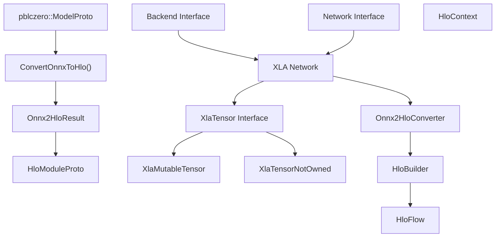
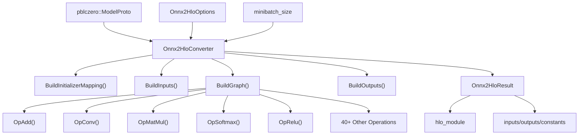
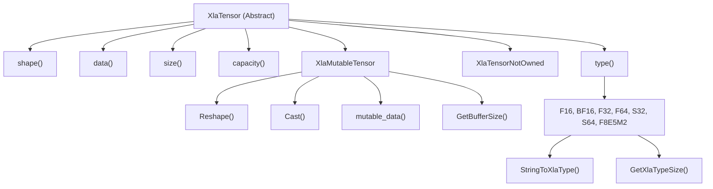
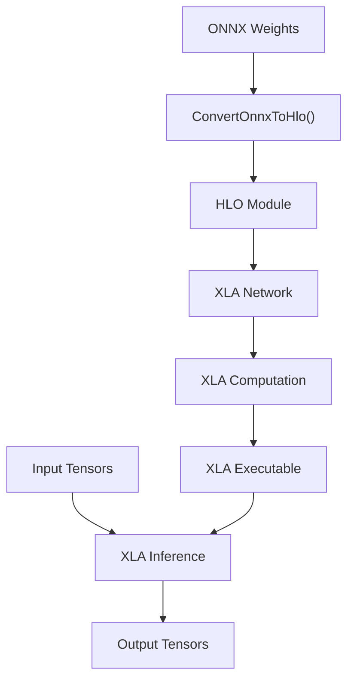

# XLA 和 HLO 支持

相关源文件

-   [src/neural/xla/onnx2hlo.cc](https://github.com/LeelaChessZero/lc0/blob/b4e98c19/src/neural/xla/onnx2hlo.cc)
-   [src/neural/xla/onnx2hlo.h](https://github.com/LeelaChessZero/lc0/blob/b4e98c19/src/neural/xla/onnx2hlo.h)
-   [src/neural/xla/xla\_tensor.cc](https://github.com/LeelaChessZero/lc0/blob/b4e98c19/src/neural/xla/xla_tensor.cc)
-   [src/neural/xla/xla\_tensor.h](https://github.com/LeelaChessZero/lc0/blob/b4e98c19/src/neural/xla/xla_tensor.h)

本文档涵盖了 Leela Chess Zero 中的 XLA (加速线性代数) 后端实现，它通过 Google 的 XLA 编译器基础设施提供神经网络推理。XLA 后端将 ONNX 模型转换为 HLO (高级操作) 格式，以便在各种硬件平台上进行优化执行。

有关通用神经网络后端架构，请参阅 [网络接口与后端架构](/LeelaChessZero/lc0/6.1-network-interface-and-backend-architecture)。有关 ONNX 模型支持和转换实用工具，请参阅 [ONNX 集成](/LeelaChessZero/lc0/6.4-onnx-integration)。

## 架构概览

XLA 支持系统由三个主要组件组成：ONNX 到 HLO 转换、XLA 张量管理和 HLO 操作映射。该系统与更广泛的神经网络后端架构集成，提供了一条由 XLA 编译流水线优化的替代推理路径。

**XLA 后端系统架构**

来源：[src/neural/xla/onnx2hlo.h40-80](https://github.com/LeelaChessZero/lc0/blob/b4e98c19/src/neural/xla/onnx2hlo.h#L40-L80) [src/neural/xla/xla\_tensor.h65-139](https://github.com/LeelaChessZero/lc0/blob/b4e98c19/src/neural/xla/xla_tensor.h#L65-L139)

## ONNX 到 HLO 转换系统

转换系统将 ONNX 神经网络模型转换为适合 XLA 编译的 HLO 格式。`Onnx2HloConverter` 类处理 ONNX 操作和 HLO 指令之间的复杂映射。

**ONNX 到 HLO 转换流程**

来源：[src/neural/xla/onnx2hlo.cc464-538](https://github.com/LeelaChessZero/lc0/blob/b4e98c19/src/neural/xla/onnx2hlo.cc#L464-L538) [src/neural/xla/onnx2hlo.h55-68](https://github.com/LeelaChessZero/lc0/blob/b4e98c19/src/neural/xla/onnx2hlo.h#L55-L68)

### 支持的 ONNX 操作

转换器支持映射到 HLO 等效项的全面 ONNX 操作集。每个操作在 `Onnx2HloConverter` 类中实现为一个方法：

| ONNX 操作 | HLO 映射 | 实现方法 |
| --- | --- | --- |
| Add | 逐元素加法 | `OpAdd()` |
| BatchNormalization | 带缩放/偏置的归一化 | `OpBatchNormalization()` |
| Conv | 带填充的卷积 | `OpConv()` |
| MatMul | 矩阵乘法 | `OpMatMul()` |
| Relu | 与零取最大值 | `OpRelu()` |
| Softmax | 指数归一化 | `OpSoftmax()` |
| Reshape | 张量重塑 | `OpReshape()` |
| Transpose | 维度置换 | `OpTranspose()` |

来源：[src/neural/xla/onnx2hlo.cc467-507](https://github.com/LeelaChessZero/lc0/blob/b4e98c19/src/neural/xla/onnx2hlo.cc#L467-L507) [src/neural/xla/onnx2hlo.cc773-1690](https://github.com/LeelaChessZero/lc0/blob/b4e98c19/src/neural/xla/onnx2hlo.cc#L773-L1690)

### 转换选项与配置

转换过程通过 `Onnx2HloOptions` 配置：

-   **`max_inline_constant_size`**: 大于此大小的常量将成为参数而不是被内联
-   **`io_type`**: 输入/输出张量的可选类型强制
-   **`debugging_allow_partial_result`**: 允许部分转换结果以进行调试
-   **`outputs_override`**: 自定义输出节点选择

来源：[src/neural/xla/onnx2hlo.h40-53](https://github.com/LeelaChessZero/lc0/blob/b4e98c19/src/neural/xla/onnx2hlo.h#L40-L53)

## XLA 张量系统

XLA 张量系统提供了管理 XLA 兼容格式的张量数据的抽象。该系统支持拥有所有权和非拥有所有权的张量变体，以用于不同的用例。

**XLA 张量类层次结构**

来源：[src/neural/xla/xla\_tensor.h65-139](https://github.com/LeelaChessZero/lc0/blob/b4e98c19/src/neural/xla/xla_tensor.h#L65-L139) [src/neural/xla/xla\_tensor.cc95-156](https://github.com/LeelaChessZero/lc0/blob/b4e98c19/src/neural/xla/xla_tensor.cc#L95-L156)

### 张量类型转换

`XlaMutableTensor::Cast()` 方法提供不同 XLA 数值类型之间的类型转换。目前支持的转换包括：

-   **从 F32**: F16, BF16, F8E5M2 使用饱和转换
-   **到 F32**: F16, BF16, F8E5M2 使用精度扩展

转换过程使用来自 `utils/` 目录的专用实用函数来处理不同的浮点格式。

来源：[src/neural/xla/xla\_tensor.cc95-156](https://github.com/LeelaChessZero/lc0/blob/b4e98c19/src/neural/xla/xla_tensor.cc#L95-L156) [src/neural/xla/xla\_tensor.h43-63](https://github.com/LeelaChessZero/lc0/blob/b4e98c19/src/neural/xla/xla_tensor.h#L43-L63)

### 内存管理

`XlaMutableTensor` 实现基于容量的内存管理，以支持无需重新分配的动态重塑：

-   **容量跟踪**: 维护独立于逻辑张量大小的缓冲区大小
-   **重塑操作**: 当新大小适合容量内时重用现有缓冲区
-   **类型转换**: 仅根据类型大小要求在必要时分配新缓冲区

来源：[src/neural/xla/xla\_tensor.cc75-83](https://github.com/LeelaChessZero/lc0/blob/b4e98c19/src/neural/xla/xla_tensor.cc#L75-L83) [src/neural/xla/xla\_tensor.h125-129](https://github.com/LeelaChessZero/lc0/blob/b4e98c19/src/neural/xla/xla_tensor.h#L125-L129)

## HLO 操作与常量折叠

转换系统包括针对可在编译时计算的操作的常量折叠优化。这降低了生成的 HLO 的复杂性并提高了运行时性能。

**常量折叠操作**

```mermaid
flowchart TD
    CanConvertConstant["CanConvertConstant()"]
    OnnxTypeToXlaType["OnnxTypeToXlaType()"]
    OnnxTensorToXlaLiteral["OnnxTensorToXlaLiteral()"]
    ConstOpConvert["ConstOpConvert()"]
    ConstOpConcat["ConstOpConcat()"]
    ConstOpSlice["ConstOpSlice()"]
    ConstOpGather["ConstOpGather()"]
    ConstOpMul["ConstOpMul()"]
    ConstOpMax["ConstOpMax()"]
    ConstOpReduceProd["ConstOpReduceProd()"]
    ConstReshape["ConstReshape()"]
    LiteralToVector["LiteralToVector()"]
    LiteralOutInOp["LiteralOutInOp()"]
    LiteralOutInInOp["LiteralOutInInOp()"]
    FetchConstForType["FetchConstForType()"]
    FetchMutableForType["FetchMutableForType()"]

    ConstOpConvert --> LiteralOutInOp
    ConstOpConcat --> LiteralOutInOp
    ConstOpSlice --> LiteralOutInOp
    ConstOpGather --> LiteralOutInInOp
    ConstOpMul --> LiteralOutInInOp
    ConstOpMax --> LiteralOutInInOp
    ConstOpReduceProd --> LiteralOutInOp
    LiteralOutInOp --> FetchConstForType
    LiteralOutInOp --> FetchMutableForType
    LiteralOutInInOp --> FetchConstForType
    LiteralOutInInOp --> FetchMutableForType
    CanConvertConstant --> OnnxTypeToXlaType
    OnnxTensorToXlaLiteral --> OnnxTypeToXlaType
```

来源：[src/neural/xla/onnx2hlo.cc47-462](https://github.com/LeelaChessZero/lc0/blob/b4e98c19/src/neural/xla/onnx2hlo.cc#L47-L462) [src/neural/xla/onnx2hlo.cc312-357](https://github.com/LeelaChessZero/lc0/blob/b4e98c19/src/neural/xla/onnx2hlo.cc#L312-L357)

### 常量折叠策略

当操作的所有输入都是编译时常量时，系统应用常量折叠：

1.  **检测**: `AllInputsConstant()` 检查所有节点输入是否为常量或初始化器
2.  **评估**: 使用模板函数计算常量操作以保证类型安全
3.  **结果**: 计算出的常量替换 HLO 图中的操作

这种优化对于不依赖于运行时输入的形状操作、小型算术计算和张量操作特别有效。

来源：[src/neural/xla/onnx2hlo.cc660-672](https://github.com/LeelaChessZero/lc0/blob/b4e98c19/src/neural/xla/onnx2hlo.cc#L660-L672) [src/neural/xla/onnx2hlo.cc997-1004](https://github.com/LeelaChessZero/lc0/blob/b4e98c19/src/neural/xla/onnx2hlo.cc#L997-L1004)

## 与神经网络后端集成

XLA 系统通过标准的 `Network` 和 `Backend` 接口与更广泛的神经网络后端架构集成。从 ONNX 到 HLO 的转换发生在模型加载期间，生成的 HLO 模块用于所有后续的推理操作。

**后端集成流程**

来源：[src/neural/xla/onnx2hlo.h70-78](https://github.com/LeelaChessZero/lc0/blob/b4e98c19/src/neural/xla/onnx2hlo.h#L70-L78) [src/neural/xla/onnx2hlo.cc510-538](https://github.com/LeelaChessZero/lc0/blob/b4e98c19/src/neural/xla/onnx2hlo.cc#L510-L538)

XLA 后端通过 Google 的 XLA 编译器提供优化的推理，该编译器可以针对包括 CPU、GPU 和 TPU 在内的各种硬件平台。HLO 中间表示启用了高级优化，如算子融合、内存布局优化和特定于平台的代码生成。
