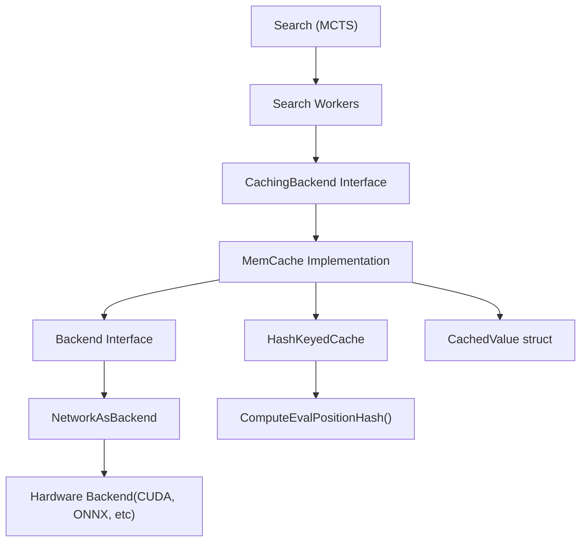
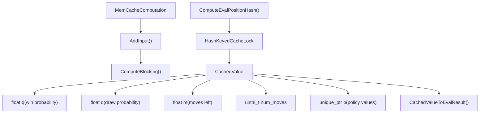
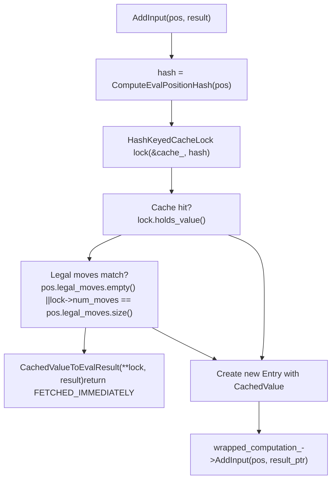
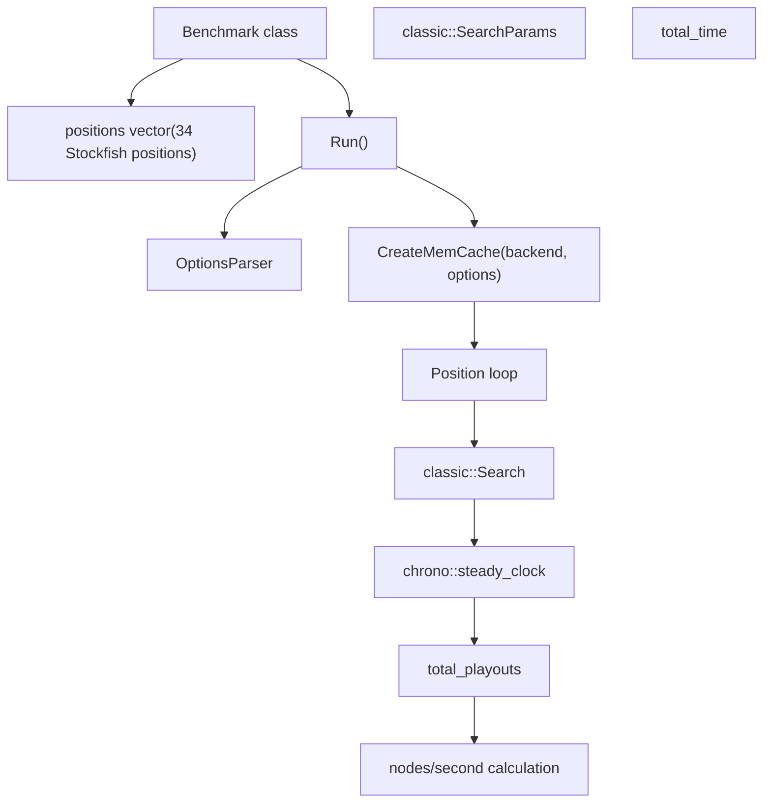
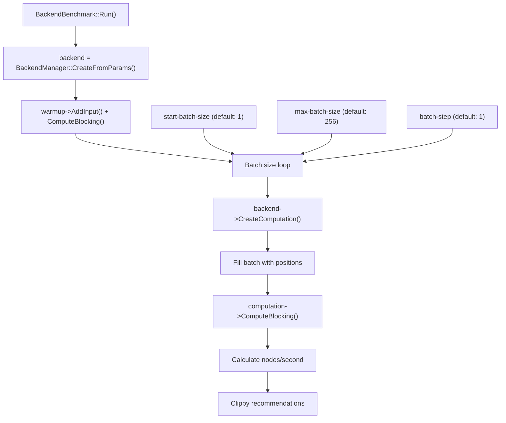
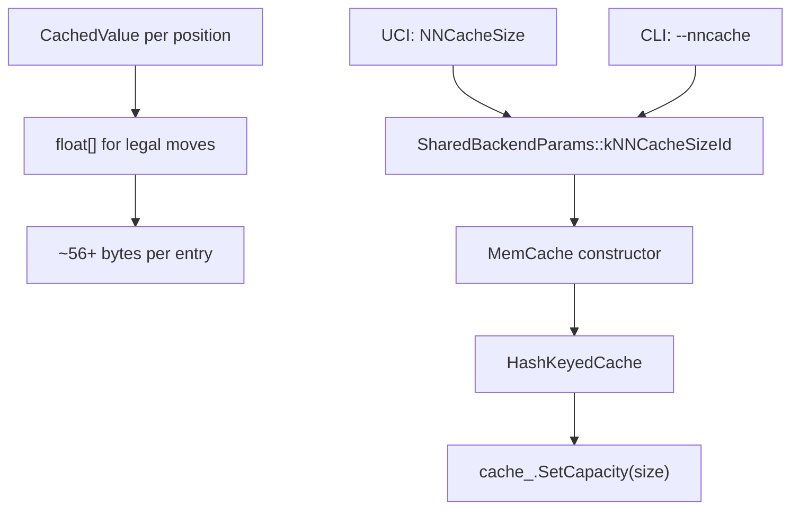

# 内存缓存与性能

相关源文件

-   [src/neural/backend.cc](https://github.com/LeelaChessZero/lc0/blob/b4e98c19/src/neural/backend.cc)
-   [src/neural/backend.h](https://github.com/LeelaChessZero/lc0/blob/b4e98c19/src/neural/backend.h)
-   [src/neural/batchsplit.cc](https://github.com/LeelaChessZero/lc0/blob/b4e98c19/src/neural/batchsplit.cc)
-   [src/neural/memcache.cc](https://github.com/LeelaChessZero/lc0/blob/b4e98c19/src/neural/memcache.cc)
-   [src/neural/memcache.h](https://github.com/LeelaChessZero/lc0/blob/b4e98c19/src/neural/memcache.h)
-   [src/neural/shared\_params.cc](https://github.com/LeelaChessZero/lc0/blob/b4e98c19/src/neural/shared_params.cc)
-   [src/neural/shared\_params.h](https://github.com/LeelaChessZero/lc0/blob/b4e98c19/src/neural/shared_params.h)
-   [src/neural/wrapper.cc](https://github.com/LeelaChessZero/lc0/blob/b4e98c19/src/neural/wrapper.cc)
-   [src/tools/backendbench.cc](https://github.com/LeelaChessZero/lc0/blob/b4e98c19/src/tools/backendbench.cc)
-   [src/tools/benchmark.cc](https://github.com/LeelaChessZero/lc0/blob/b4e98c19/src/tools/benchmark.cc)
-   [src/tools/benchmark.h](https://github.com/LeelaChessZero/lc0/blob/b4e98c19/src/tools/benchmark.h)

本文档涵盖了 Leela Chess Zero 中的神经网络评估缓存系统和性能测量工具。内存缓存通过避免冗余的神经网络评估显著提高了搜索性能，而基准测试工具有助于优化后端配置和测量系统性能。

有关支持缓存的底层后端架构的信息，请参阅 [网络接口与后端架构](/LeelaChessZero/lc0/6.1-network-interface-and-backend-architecture)。有关神经网络之外的更广泛的性能测试，请参阅 [基准测试与性能测试](/LeelaChessZero/lc0/8.3-benchmarking-and-performance-testing)。

## 神经网络评估缓存

### 缓存架构概览

内存缓存系统包装了神经网络后端以提供透明的评估缓存。当一个局面被评估时，结果存储在内存中，并在随后的相同局面请求中检索。

来源：[src/neural/memcache.cc1-193](https://github.com/LeelaChessZero/lc0/blob/b4e98c19/src/neural/memcache.cc#L1-L193) [src/neural/memcache.h1-47](https://github.com/LeelaChessZero/lc0/blob/b4e98c19/src/neural/memcache.h#L1-L47) [src/neural/backend.h1-135](https://github.com/LeelaChessZero/lc0/blob/b4e98c19/src/neural/backend.h#L1-L135)

### 缓存实现细节

`MemCache` 类通过包装现有后端并拦截评估请求来实现缓存功能。

来源：[src/neural/memcache.cc45-51](https://github.com/LeelaChessZero/lc0/blob/b4e98c19/src/neural/memcache.cc#L45-L51) [src/neural/memcache.cc41-43](https://github.com/LeelaChessZero/lc0/blob/b4e98c19/src/neural/memcache.cc#L41-L43) [src/neural/memcache.cc53-58](https://github.com/LeelaChessZero/lc0/blob/b4e98c19/src/neural/memcache.cc#L53-L58)

#### 局面哈希策略

缓存使用局面哈希来识别等效局面：

| 组件 | 实现 | 位置 |
| --- | --- | --- |
| 哈希函数 | `ComputeEvalPositionHash()` | [src/neural/memcache.cc41-43](https://github.com/LeelaChessZero/lc0/blob/b4e98c19/src/neural/memcache.cc#L41-L43) |
| 哈希源 | `pos.pos.back().Hash()` | [src/neural/memcache.cc42](https://github.com/LeelaChessZero/lc0/blob/b4e98c19/src/neural/memcache.cc#L42-L42) |
| 缓存键 | 64 位局面哈希 | [src/neural/memcache.cc115-128](https://github.com/LeelaChessZero/lc0/blob/b4e98c19/src/neural/memcache.cc#L115-L128) |
| 冲突处理 | 合法走法计数验证 | [src/neural/memcache.cc122-124](https://github.com/LeelaChessZero/lc0/blob/b4e98c19/src/neural/memcache.cc#L122-L124) |

当前的实现仅使用当前局面哈希，忽略了重复历史。这在代码库注释中被指出为潜在的改进领域。

来源：[src/neural/memcache.cc38-43](https://github.com/LeelaChessZero/lc0/blob/b4e98c19/src/neural/memcache.cc#L38-L43)

#### 缓存命中与未命中处理

`MemCacheComputation::AddInput()` 方法实现了缓存查找逻辑：

来源：[src/neural/memcache.cc112-140](https://github.com/LeelaChessZero/lc0/blob/b4e98c19/src/neural/memcache.cc#L112-L140)

## 性能测量工具

### 搜索基准测试

位于 [src/tools/benchmark.cc](https://github.com/LeelaChessZero/lc0/blob/b4e98c19/src/tools/benchmark.cc) 中的 `Benchmark` 类使用预定义的国际象棋局面提供全面的搜索性能测试。

来源：[src/tools/benchmark.cc53-147](https://github.com/LeelaChessZero/lc0/blob/b4e98c19/src/tools/benchmark.cc#L53-L147) [src/tools/benchmark.h36-83](https://github.com/LeelaChessZero/lc0/blob/b4e98c19/src/tools/benchmark.h#L36-L83)

#### 基准测试配置选项

| 选项 | 目的 | 默认值 | 范围 |
| --- | --- | --- | --- |
| `threads` | CPU 工作线程 | 2 | 1-128 |
| `nodes` | 每个局面的节点限制 | \-1 (禁用) | \-1 到 999999999 |
| `movetime` | 时间限制（毫秒） | 10000/500 | \-1 到 999999999 |
| `num-positions` | 测试局面数量 | 34/10 | 1-34 |
| `nncache` | 缓存大小 | 200000 | 0 到 999999999 |

来源：[src/tools/benchmark.cc41-69](https://github.com/LeelaChessZero/lc0/blob/b4e98c19/src/tools/benchmark.cc#L41-L69)

### 后端基准测试

`BackendBenchmark` 类专门关注神经网络后端吞吐量测试。

来源：[src/tools/backendbench.cc78-186](https://github.com/LeelaChessZero/lc0/blob/b4e98c19/src/tools/backendbench.cc#L78-L186)

#### Clippy 性能助手

后端基准测试包括一个可选的 "Clippy" 功能，该功能根据性能测量提供批次大小建议：

| 时间控制 | 计算 | 建议重点 |
| --- | --- | --- |
| 超快棋 (1s/move) | `nps_ingame3 = (nps + best_nps3)^1.085 / 2` | 低延迟 |
| 快棋 (15s/move) | `nps_ingame2 = (nps + best_nps2)^1.085 / 2` | 平衡的吞吐量 |
| 锦标赛 (3min/move) | `nps_ingame = (nps + best_nps)^1.085 / 2` | 最大吞吐量 |

来源：[src/tools/backendbench.cc139-182](https://github.com/LeelaChessZero/lc0/blob/b4e98c19/src/tools/backendbench.cc#L139-L182)

## 缓存配置与调优

### 缓存大小配置

神经网络缓存大小由 `nncache` 参数控制：

来源：[src/neural/shared\_params.cc63-66](https://github.com/LeelaChessZero/lc0/blob/b4e98c19/src/neural/shared_params.cc#L63-L66) [src/neural/memcache.cc62-65](https://github.com/LeelaChessZero/lc0/blob/b4e98c19/src/neural/memcache.cc#L62-L65) [src/neural/memcache.cc91](https://github.com/LeelaChessZero/lc0/blob/b4e98c19/src/neural/memcache.cc#L91-L91)

### 缓存性能特征

| 方面 | 实现细节 | 性能影响 |
| --- | --- | --- |
| 缓存类型 | 带有 FIFO 驱逐的哈希键控 | O(1) 查找，可预测的内存使用 |
| 线程安全 | `HashKeyedCacheLock` | 线程安全的并发访问 |
| 内存效率 | 可变大小策略数组 | 针对不同局面类型的有效存储 |
| 哈希冲突 | 合法走法计数验证 | 防止不正确的缓存命中 |

来源：[src/neural/memcache.cc117-128](https://github.com/LeelaChessZero/lc0/blob/b4e98c19/src/neural/memcache.cc#L117-L128) [src/utils/cache.h](https://github.com/LeelaChessZero/lc0/blob/b4e98c19/src/utils/cache.h)

### 性能优化指南

基于基准测试结果和缓存实现：

1.  **缓存大小**: 设置 `nncache` 以平衡内存使用和命中率
2.  **批次大小**: 使用后端基准测试找到硬件的最佳批次大小
3.  **搜索线程**: 匹配后端的 `suggested_num_search_threads`
4.  **内存约束**: 每个缓存条目需要约 56+ 字节加上策略数组

缓存清除行为确保了当后端配置更改时的一致性，在保持正确性的同时保留性能优势。

来源：[src/neural/memcache.cc75-85](https://github.com/LeelaChessZero/lc0/blob/b4e98c19/src/neural/memcache.cc#L75-L85) [src/neural/backend.h42-50](https://github.com/LeelaChessZero/lc0/blob/b4e98c19/src/neural/backend.h#L42-L50)
