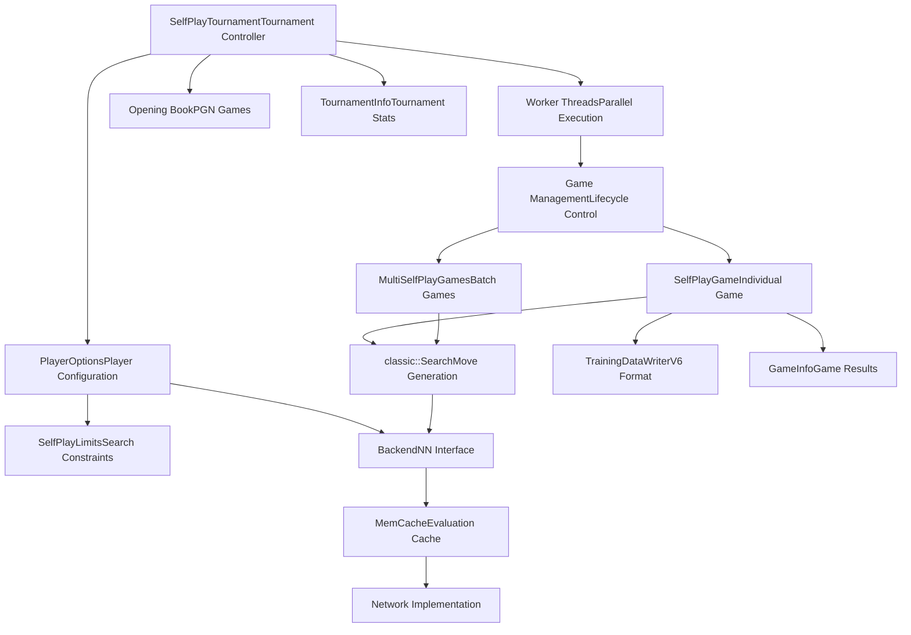
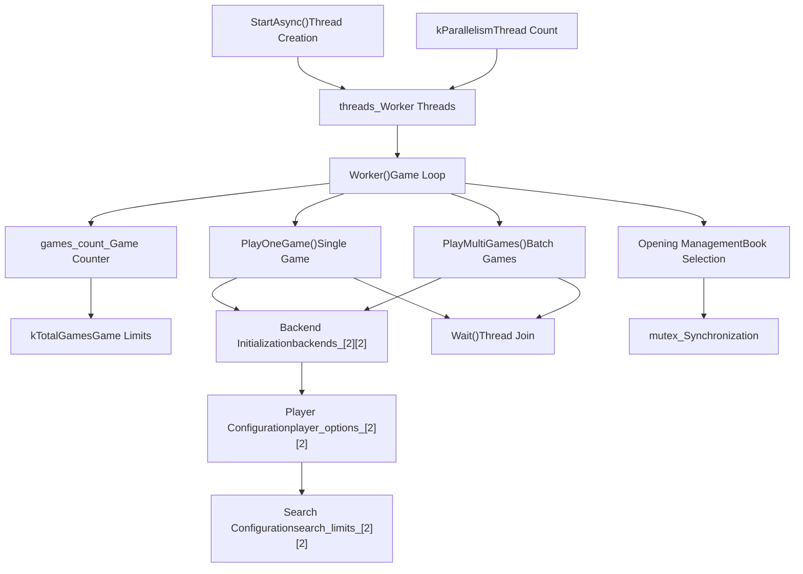
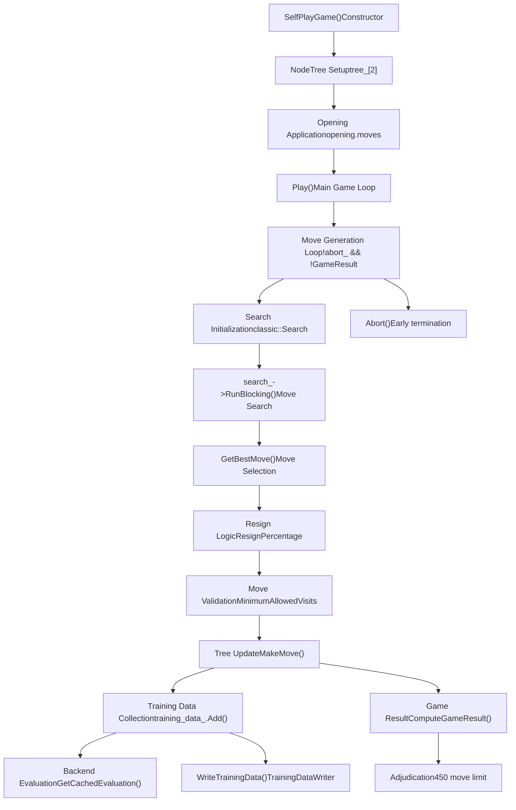
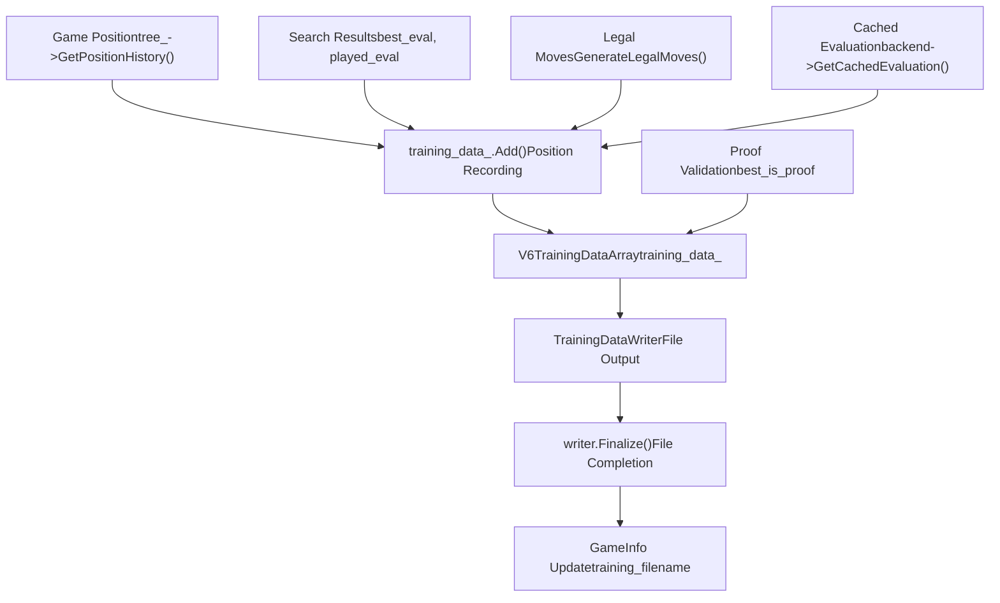
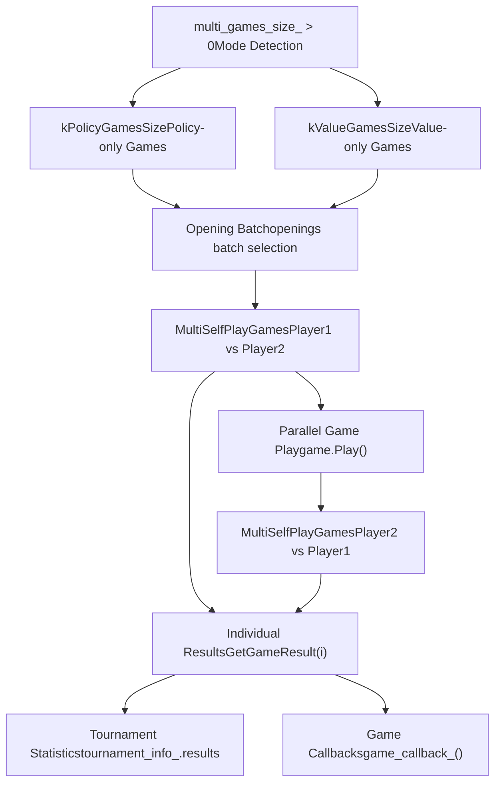

# 自对弈系统

相关源文件

-   [src/selfplay/game.cc](https://github.com/LeelaChessZero/lc0/blob/b4e98c19/src/selfplay/game.cc)
-   [src/selfplay/game.h](https://github.com/LeelaChessZero/lc0/blob/b4e98c19/src/selfplay/game.h)
-   [src/selfplay/tournament.cc](https://github.com/LeelaChessZero/lc0/blob/b4e98c19/src/selfplay/tournament.cc)
-   [src/selfplay/tournament.h](https://github.com/LeelaChessZero/lc0/blob/b4e98c19/src/selfplay/tournament.h)

自对弈系统负责生成神经网络玩家之间的自动化对局，主要用于训练数据收集和模型评估。该系统管理锦标赛组织、并行对局执行和训练数据输出。

有关自对弈对局中使用的搜索算法的信息，请参阅 [搜索算法](/LeelaChessZero/lc0/5-search-algorithm)。有关神经网络后端管理的信息，请参阅 [神经网络系统](/LeelaChessZero/lc0/6-neural-network-system)。

## 系统概览

自对弈系统由两个主要组件组成：`SelfPlayTournament` 类负责编排多个对局，`SelfPlayGame` 类负责管理单个对局的执行。

**来源：** [src/selfplay/tournament.h43-117](https://github.com/LeelaChessZero/lc0/blob/b4e98c19/src/selfplay/tournament.h#L43-L117) [src/selfplay/game.h65-128](https://github.com/LeelaChessZero/lc0/blob/b4e98c19/src/selfplay/game.h#L65-L128)

## 锦标赛架构

`SelfPlayTournament` 类管理整个锦标赛的执行，协调多个并行对局并收集结果。

**来源：** [src/selfplay/tournament.cc537-592](https://github.com/LeelaChessZero/lc0/blob/b4e98c19/src/selfplay/tournament.cc#L537-L592) [src/selfplay/tournament.cc160-273](https://github.com/LeelaChessZero/lc0/blob/b4e98c19/src/selfplay/tournament.cc#L160-L273)

## 对局执行流程

单个对局由 `SelfPlayGame` 类管理，它处理从开局到完成的完整对局生命周期。

**来源：** [src/selfplay/game.cc131-307](https://github.com/LeelaChessZero/lc0/blob/b4e98c19/src/selfplay/game.cc#L131-L307) [src/selfplay/game.cc82-129](https://github.com/LeelaChessZero/lc0/blob/b4e98c19/src/selfplay/game.cc#L82-L129)

## 配置与选项

自对弈系统通过选项系统支持广泛的配置，允许控制对局参数、搜索限制和训练设置。

| 配置类别 | 关键选项 | 目的 |
| --- | --- | --- |
| **锦标赛控制** | `games`, `parallelism`, `share-trees` | 对局数量和并行执行 |
| **搜索限制** | `visits`, `playouts`, `movetime` | 走法搜索约束 |
| **训练** | `training`, `policy-mode-size`, `value-mode-size` | 训练数据生成 |
| **开局管理** | `openings-pgn`, `mirror-openings`, `openings-mode` | 开局库配置 |
| **游戏规则** | `resign-percentage`, `resign-earliest-move` | 对局裁决规则 |
| **后端选择** | 玩家特定的后端配置 | 神经网络分配 |

**来源：** [src/selfplay/tournament.cc103-158](https://github.com/LeelaChessZero/lc0/blob/b4e98c19/src/selfplay/tournament.cc#L103-L158) [src/selfplay/game.cc70-80](https://github.com/LeelaChessZero/lc0/blob/b4e98c19/src/selfplay/game.cc#L70-L80)

## 训练数据生成

当启用训练模式时，自对弈系统会生成 V6 格式的训练数据，捕获局面评估和搜索统计信息。

**来源：** [src/selfplay/game.cc270-297](https://github.com/LeelaChessZero/lc0/blob/b4e98c19/src/selfplay/game.cc#L270-L297) [src/selfplay/game.cc351-353](https://github.com/LeelaChessZero/lc0/blob/b4e98c19/src/selfplay/game.cc#L351-L353) [src/selfplay/tournament.cc410-416](https://github.com/LeelaChessZero/lc0/blob/b4e98c19/src/selfplay/tournament.cc#L410-L416)

## 多对局模式 (Multi-Game Modes)

系统支持专门的多对局模式用于确定性评估，包括仅策略 (policy-only) 和仅价值 (value-only) 模式，可以高效处理多个对局。

**来源：** [src/selfplay/tournament.cc439-535](https://github.com/LeelaChessZero/lc0/blob/b4e98c19/src/selfplay/tournament.cc#L439-L535) [src/selfplay/tournament.cc545-567](https://github.com/LeelaChessZero/lc0/blob/b4e98c19/src/selfplay/tournament.cc#L545-L567)

## 后端与网络管理

锦标赛系统为不同的玩家配置管理多个神经网络后端，支持非对称的玩家设置和共享后端优化。

每个锦标赛维护一个 2x2 的后端矩阵 (`backends_[2][2]`)，代表 [玩家1/玩家2][执白/执黑] 的配置。系统自动检测相同的配置并共享后端实例以优化内存使用。

**来源：** [src/selfplay/tournament.cc216-236](https://github.com/LeelaChessZero/lc0/blob/b4e98c19/src/selfplay/tournament.cc#L216-L236) [src/selfplay/tournament.cc238-261](https://github.com/LeelaChessZero/lc0/blob/b4e98c19/src/selfplay/tournament.cc#L238-L261)
