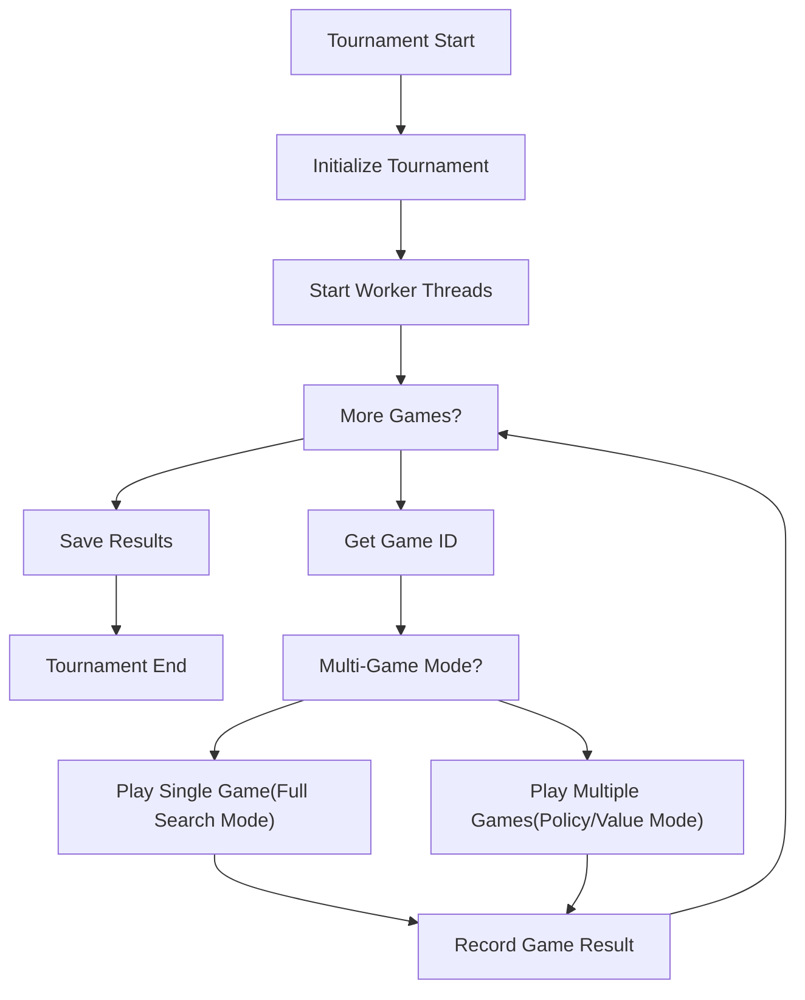
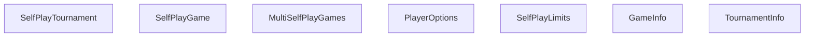
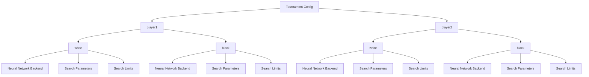

# 锦标赛组织

相关源文件

-   [src/selfplay/game.cc](https://github.com/LeelaChessZero/lc0/blob/b4e98c19/src/selfplay/game.cc)
-   [src/selfplay/game.h](https://github.com/LeelaChessZero/lc0/blob/b4e98c19/src/selfplay/game.h)
-   [src/selfplay/tournament.cc](https://github.com/LeelaChessZero/lc0/blob/b4e98c19/src/selfplay/tournament.cc)
-   [src/selfplay/tournament.h](https://github.com/LeelaChessZero/lc0/blob/b4e98c19/src/selfplay/tournament.h)

本页面解释了 Leela Chess Zero (lc0) 中的锦标赛组织系统，该系统负责设置和运行自对弈锦标赛，用于训练神经网络和评估引擎实力。有关自对弈系统的一般信息，请参阅 [自对弈系统](/LeelaChessZero/lc0/7-self-play-system)。

## 概览

锦标赛组织系统管理多个自对弈对局（可选并行），并具有可配置的对局选项。它处理对局执行、结果跟踪、开局库管理，并可以生成用于神经网络改进的训练数据。


来源：[src/selfplay/tournament.cc540-587](https://github.com/LeelaChessZero/lc0/blob/b4e98c19/src/selfplay/tournament.cc#L540-L587) [src/selfplay/tournament.cc596-628](https://github.com/LeelaChessZero/lc0/blob/b4e98c19/src/selfplay/tournament.cc#L596-L628)

## 锦标赛系统架构

锦标赛系统由几个关键组件组成：


来源：[src/selfplay/tournament.h44-117](https://github.com/LeelaChessZero/lc0/blob/b4e98c19/src/selfplay/tournament.h#L44-L117) [src/selfplay/game.h40-127](https://github.com/LeelaChessZero/lc0/blob/b4e98c19/src/selfplay/game.h#L40-L127) [src/selfplay/multigame.h](https://github.com/LeelaChessZero/lc0/blob/b4e98c19/src/selfplay/multigame.h) [src/chess/uciloop.h](https://github.com/LeelaChessZero/lc0/blob/b4e98c19/src/chess/uciloop.h)

### 关键类

| 类 | 描述 | 关键成员 |
| --- | --- | --- |
| `SelfPlayTournament` | 处理调度对局、跟踪结果和管理工作线程的主要锦标赛管理器 | `games_`, `multigames_`, `tournament_info_`, `threads_`, `backends_[2][2]` |
| `SelfPlayGame` | 表示两个玩家之间具有完整搜索能力的单个对局 | `options_[2]`, `tree_[2]`, `search_`, `training_data_` |
| `MultiSelfPlayGames` | 同时管理多个对局，并进行简化评估（基于策略或价值） | `trees_`, `results_`, `eval_` |
| `PlayerOptions` | 包含玩家配置，包括后端、回调和搜索限制 | `backend`, `best_move_callback`, `info_callback`, `search_limits` |
| `SelfPlayLimits` | 定义搜索限制，如访问次数、模拟次数和移动时间 | `visits`, `playouts`, `movetime` |
| `GameInfo` | 包含已完成对局信息的结构体 | `game_result`, `moves`, `training_filename`, `game_id` |
| `TournamentInfo` | 包含锦标赛统计数据和结果的结构体 | `results[3][2]`, `move_count_`, `nodes_total_`, `finished` |

## 锦标赛配置

### 可用选项

锦标赛系统通过选项解析器配置，主要选项如下：

| 选项 | 描述 | 默认值 |
| --- | --- | --- |
| `share-trees` | 在玩家之间共享博弈树 | `true` |
| `games` | 要进行的对局数量 (-1 为无限，-2 为开局库长度) | `-1` |
| `parallelism` | 并行进行的对局数量 | `8` |
| `threads` | 每个对局的 CPU 线程数 | `1` |
| `playouts` | 每步模拟 (Playouts) 次数 | `-1` |
| `visits` | 每步访问 (Visits) 次数 | `-1` |
| `movetime` | 每步时间（毫秒） | `-1` |
| `training` | 启用写入训练数据 | `false` |
| `verbose-thinking` | 显示详细的思考消息 | `false` |
| `policy-mode-size` | 策略模式下每个线程的对局数量 | `0` |
| `value-mode-size` | 价值模式下每个线程的对局数量 | `0` |
| `tournament-results-file` | 追加锦标赛结果的文件 | `""` |
| `resign-playthrough` | 忽略认输的对局百分比 | `0.0` |
| `openings-pgn` | 开局 PGN 文件路径 | `""` |
| `mirror-openings` | 成对进行每个开局 | `false` |
| `openings-mode` | 如何使用开局 (sequential/shuffled/random) | `"sequential"` |
| `syzygy-paths` | Syzygy 残局库路径 | `""` |

来源：[src/selfplay/tournament.cc43-101](https://github.com/LeelaChessZero/lc0/blob/b4e98c19/src/selfplay/tournament.cc#L43-L101) [src/selfplay/tournament.cc104-159](https://github.com/LeelaChessZero/lc0/blob/b4e98c19/src/selfplay/tournament.cc#L104-L159)

### 玩家配置

锦标赛系统使用嵌套配置结构，允许为每个玩家和颜色设置不同的配置：


来源：[src/selfplay/tournament.cc104-109](https://github.com/LeelaChessZero/lc0/blob/b4e98c19/src/selfplay/tournament.cc#L104-L109)

配置设置在 `SelfPlayTournament::PopulateOptions` 中完成：

```cpp
options->AddContext("player1");
options->AddContext("player2");
options->AddContext("white");
options->AddContext("black");
for (const auto context : {"player1", "player2"}) {
  auto* dict = options->GetMutableOptions(context);
  dict->AddSubdict("white")->AddAliasDict(&options->GetOptionsDict("white"));
  dict->AddSubdict("black")->AddAliasDict(&options->GetOptionsDict("black"));
}
```
这允许为每个玩家-颜色组合配置不同的参数，如搜索限制。

## 锦标赛执行

### 初始化

创建锦标赛时，它会：

1.  解析两个玩家的选项（白方和黑方配置）
2.  加载指定的开局库
3.  为所有玩家配置初始化神经网络后端
4.  为每个玩家/颜色组合设置搜索限制
5.  如果指定，加载 Syzygy 残局库

来源：[src/selfplay/tournament.cc161-266](https://github.com/LeelaChessZero/lc0/blob/b4e98c19/src/selfplay/tournament.cc#L161-L266)

### 并行执行

锦标赛使用工作线程并行进行多个对局。并行对局的数量由 `parallelism` 选项控制。

```cpp
void SelfPlayTournament::StartAsync() {
  Mutex::Lock lock(threads_mutex_);
  while (threads_.size() < kParallelism) {
    threads_.emplace_back([&]() { Worker(); });
  }
}
```
每个工作线程运行 `Worker()` 方法，该方法不断请求新的对局 ID 并进行对局，直到锦标赛完成：

```cpp
void SelfPlayTournament::Worker() {
  // Play games while game limit is not reached (or while not aborted).
  while (true) {
    int game_id;
    int count = 0;
    {
      Mutex::Lock lock(mutex_);
      if (abort_) break;
      // Check if we've reached game limit and get a new game ID if not
      // ...
    }
    if (multi_games_size_) {
      PlayMultiGames(game_id, count);
    } else {
      PlayOneGame(game_id);
    }
  }
}
```
来源：[src/selfplay/tournament.cc589-594](https://github.com/LeelaChessZero/lc0/blob/b4e98c19/src/selfplay/tournament.cc#L589-L594) [src/selfplay/tournament.cc540-587](https://github.com/LeelaChessZero/lc0/blob/b4e98c19/src/selfplay/tournament.cc#L540-L587)

### 对局执行模式

锦标赛支持两种主要执行模式：

#### 单对局模式 (Single Game Mode)

在此模式下，每个对局为每一步运行完整的 MCTS 搜索：

> **[Mermaid sequence]**
> *(图表结构无法解析)*

来源：[src/selfplay/tournament.cc275-437](https://github.com/LeelaChessZero/lc0/blob/b4e98c19/src/selfplay/tournament.cc#L275-L437) [src/selfplay/game.cc131-307](https://github.com/LeelaChessZero/lc0/blob/b4e98c19/src/selfplay/game.cc#L131-L307)

#### 多对局模式 (Multi-Game Mode)

当 `policy-mode-size` 或 `value-mode-size` 设置为非零值时，激活此模式。它允许并行运行多个对局，并进行简化的决策：

-   **策略模式 (Policy Mode)**: 根据最高策略网络输出选择走法
-   **价值模式 (Value Mode)**: 根据结果局面的最高预测价值选择走法

> **[Mermaid sequence]**
> *(图表结构无法解析)*

来源：[src/selfplay/tournament.cc439-535](https://github.com/LeelaChessZero/lc0/blob/b4e98c19/src/selfplay/tournament.cc#L439-L535) [src/selfplay/multigame.cc](https://github.com/LeelaChessZero/lc0/blob/b4e98c19/src/selfplay/multigame.cc)

### 开局库管理

锦标赛可以使用 PGN 文件中的开局库：

```cpp
std::string book = options.Get<std::string>(kOpeningsFileId);
if (!book.empty()) {
  PgnReader book_reader;
  book_reader.AddPgnFile(book);
  openings_ = book_reader.ReleaseGames();
  if (options.Get<std::string>(kOpeningsModeId) == "shuffled") {
    Random::Get().Shuffle(openings_.begin(), openings_.end());
  }
}
```
开局可以通过三种方式使用：

-   **Sequential (顺序)**: 按 PGN 文件中的顺序使用
-   **Shuffled (洗牌)**: 锦标赛开始时随机洗牌一次
-   **Random (随机)**: 为每个对局选择一个随机开局

当启用 `mirror-openings` 时，每个开局会进行两次，玩家交换颜色：

```cpp
if (player_options_[0][0].Get<bool>(kOpeningsMirroredId)) {
  opening = openings_[(game_number / 2) % openings_.size()];
}
```
来源：[src/selfplay/tournament.cc183-191](https://github.com/LeelaChessZero/lc0/blob/b4e98c19/src/selfplay/tournament.cc#L183-L191) [src/selfplay/tournament.cc272-276](https://github.com/LeelaChessZero/lc0/blob/b4e98c19/src/selfplay/tournament.cc#L272-L276)

### 处理被丢弃的局面 (Discarded Positions)

锦标赛维护一个 `discard_pile_` 向量，用于存储在走法选择期间由于访问次数不足而被丢弃的局面。`discarded-start-chance` 选项控制从这些局面开始对局的概率：

```cpp
if (discard_pile_.size() > 0 &&
    Random::Get().GetFloat(100.0f) < kDiscardedStartChance) {
  const size_t idx = Random::Get().GetInt(0, discard_pile_.size() - 1);
  if (idx != discard_pile_.size() - 1) {
    std::swap(discard_pile_[idx], discard_pile_.back());
  }
  opening = discard_pile_.back();
  discard_pile_.pop_back();
}
```
局面通过 `PlayerOptions::discarded_callback` 添加到丢弃堆：

```cpp
opt.discarded_callback = [this](const std::vector<Move>& moves) {
  if (kDiscardedStartChance == 0.0f) return;
  Mutex::Lock lock(mutex_);
  discard_pile_.push_back(moves);
  // 10k limit to avoid running out of RAM
  if (discard_pile_.size() > 10000) {
    const size_t idx = Random::Get().GetInt(0, discard_pile_.size() - 1);
    if (idx != discard_pile_.size() - 1) {
      std::swap(discard_pile_[idx], discard_pile_.back());
    }
    discard_pile_.pop_back();
  }
};
```
来源：[src/selfplay/tournament.cc291-299](https://github.com/LeelaChessZero/lc0/blob/b4e98c19/src/selfplay/tournament.cc#L291-L299) [src/selfplay/tournament.cc354-369](https://github.com/LeelaChessZero/lc0/blob/b4e98c19/src/selfplay/tournament.cc#L354-L369)

## 对局配置与回调

### 搜索限制

每个玩家/颜色组合可以在 `search_limits_[2][2]` 数组中配置不同的搜索限制：

```cpp
auto& limits = search_limits_[name_idx][color_idx];
const auto& dict = options.GetSubdict(kPlayerNames[name_idx])
                     .GetSubdict(kPlayerColors[color_idx]);
limits.playouts = dict.Get<int>(kPlayoutsId);
limits.visits = dict.Get<int>(kVisitsId);
limits.movetime = dict.Get<int>(kTimeMsId);
```
`SelfPlayLimits::MakeSearchStopper()` 方法将这些限制转换为搜索终止器：

```cpp
auto result = std::make_unique<classic::ChainedSearchStopper>();
result->AddStopper(std::make_unique<classic::VisitsStopper>(visits, false));
if (playouts >= 0) {
  result->AddStopper(std::make_unique<classic::PlayoutsStopper>(playouts, false));
}
if (movetime >= 0) {
  result->AddStopper(std::make_unique<classic::TimeLimitStopper>(movetime));
}
```
来源：[src/selfplay/tournament.cc239-261](https://github.com/LeelaChessZero/lc0/blob/b4e98c19/src/selfplay/tournament.cc#L239-L261) [src/selfplay/game.cc356-370](https://github.com/LeelaChessZero/lc0/blob/b4e98c19/src/selfplay/game.cc#L356-L370)

### 回调系统

锦标赛系统使用回调来报告对局结果和锦标赛进度：

#### 对局信息回调

每个完成的对局都会触发带有详细对局信息的 `GameInfo::Callback`：

| 字段 | 描述 |
| --- | --- |
| `game_result` | 最终结果 (WHITE_WON, BLACK_WON, DRAW, UNDECIDED) |
| `is_black` | 玩家 1 是否执黑 |
| `game_id` | 对局唯一标识符 |
| `initial_fen` | 起始局面 FEN 字符串 |
| `moves` | 对局中进行的走法向量 |
| `play_start_ply` | 实际对局开始的层数（开局后） |
| `training_filename` | 生成的训练数据文件名（如果启用） |
| `min_false_positive_threshold` | 用于认输分析的最小评估阈值 |

#### 锦标赛信息回调

锦标赛进度通过 `TournamentInfo::Callback` 报告：

| 字段 | 描述 |
| --- | --- |
| `results[3][2]` | 每个玩家颜色组合的 胜/和/负 计数 |
| `move_count_` | 所有对局中进行的总走法数 |
| `nodes_total_` | 评估的总搜索节点数 |
| `finished` | 锦标赛是否已完成 |

来源：[src/selfplay/tournament.cc397-430](https://github.com/LeelaChessZero/lc0/blob/b4e98c19/src/selfplay/tournament.cc#L397-L430) [src/chess/uciloop.h](https://github.com/LeelaChessZero/lc0/blob/b4e98c19/src/chess/uciloop.h)

### 认输配置

锦标赛系统支持带有可配置阈值的认输功能：

```cpp
const float resignpct =
    options_[idx].uci_options->Get<float>(kResignPercentageId) / 100;
if (options_[idx].uci_options->Get<bool>(kResignWDLStyleId)) {
  auto threshold = 1.0f - resignpct;
  if (best_w > threshold) {
    game_result_ =
        blacks_move ? GameResult::BLACK_WON : GameResult::WHITE_WON;
    adjudicated_ = true;
    break;
  }
  // ...similar checks for best_l and best_d
} else {
  if (eval < resignpct) {  // always false when resignpct == 0
    game_result_ =
        blacks_move ? GameResult::WHITE_WON : GameResult::BLACK_WON;
    adjudicated_ = true;
    break;
  }
}
```
`resign-playthrough` 选项决定了忽略认输的对局百分比：

```cpp
// If kResignPlaythrough == 0, then this comparison is unconditionally true
const bool enable_resign =
    Random::Get().GetFloat(100.0f) >= kResignPlaythrough;
```
来源：[src/selfplay/game.cc198-229](https://github.com/LeelaChessZero/lc0/blob/b4e98c19/src/selfplay/game.cc#L198-L229) [src/selfplay/tournament.cc382-383](https://github.com/LeelaChessZero/lc0/blob/b4e98c19/src/selfplay/tournament.cc#L382-L383)

## 结果跟踪与报告

锦标赛结果在 `tournament_info_` 结构中跟踪，并可通过回调报告：

```cpp
// Update tournament stats.
{
  Mutex::Lock lock(mutex_);
  int result = game.GetGameResult() == GameResult::DRAW        ? 1
               : game.GetGameResult() == GameResult::WHITE_WON ? 0
                                                               : 2;
  if (player1_black) result = 2 - result;
  ++tournament_info_.results[result][player1_black ? 1 : 0];
  tournament_info_.move_count_ += game.move_count_;
  tournament_info_.nodes_total_ += game.nodes_total_;
  tournament_callback_(tournament_info_);
}
```
结果可以以类似 PGN 的格式保存到文件中：

```cpp
void SelfPlayTournament::SaveResults() {
  if (kTournamentResultsFile.empty()) return;
  std::ofstream output(kTournamentResultsFile, std::ios_base::app);
  auto p1name =
      player_options_[0][0].Get<std::string>(SharedBackendParams::kWeightsId);
  auto p2name =
      player_options_[1][0].Get<std::string>(SharedBackendParams::kWeightsId);

  output << std::endl;
  output << "[White \"" << p1name << "\"]" << std::endl;
  output << "[Black \"" << p2name << "\"]" << std::endl;
  output << "[Results \"" << tournament_info_.results[0][0] << " "
         << tournament_info_.results[2][0] << " "
         << tournament_info_.results[1][0] << "\"]" << std::endl;
  // ... similar output for reversed colors
}
```
来源：[src/selfplay/tournament.cc415-425](https://github.com/LeelaChessZero/lc0/blob/b4e98c19/src/selfplay/tournament.cc#L415-L425) [src/selfplay/tournament.cc649-669](https://github.com/LeelaChessZero/lc0/blob/b4e98c19/src/selfplay/tournament.cc#L649-L669)

## 训练数据生成

当启用 `training` 选项时，锦标赛使用存储在每个 `SelfPlayGame` 中的 `V6TrainingDataArray` 类生成训练数据：

```cpp
if (kTraining &&
    game_info.play_start_ply < static_cast<int>(game_info.moves.size())) {
  TrainingDataWriter writer(game_number);
  game.WriteTrainingData(&writer);
  writer.Finalize();
  game_info.training_filename = writer.GetFileName();
}
```
在对局过程中，通过 `SelfPlayGame::training_data_.Add()` 收集每一步的训练数据：

```cpp
training_data_.Add(tree_[idx]->GetCurrentHead(),
                   tree_[idx]->GetPositionHistory(), best_eval,
                   played_eval, best_is_proof, best_move, move,
                   legal_moves, nneval,
                   search_->GetParams().GetPolicySoftmaxTemp());
```
训练数据包括：

-   局面历史和当前棋盘状态
-   神经网络评估 (`best_eval`, `played_eval`)
-   局面是否有证明的结果 (`best_is_proof`)
-   搜索的最佳走法和实际走的走法
-   局面中的合法走法
-   缓存的神经网络评估（如果可用）
-   使用的策略 Softmax 温度

`V6TrainingDataArray` 在整个对局中累积这些数据，并在调用 `WriteTrainingData()` 时将其写入磁盘，包括最终对局结果和裁决状态。

来源：[src/selfplay/tournament.cc410-416](https://github.com/LeelaChessZero/lc0/blob/b4e98c19/src/selfplay/tournament.cc#L410-L416) [src/selfplay/game.cc270-297](https://github.com/LeelaChessZero/lc0/blob/b4e98c19/src/selfplay/game.cc#L270-L297) [src/selfplay/game.cc351-353](https://github.com/LeelaChessZero/lc0/blob/b4e98c19/src/selfplay/game.cc#L351-L353) [src/trainingdata/trainingdata.h](https://github.com/LeelaChessZero/lc0/blob/b4e98c19/src/trainingdata/trainingdata.h)

## 总结

lc0 中的锦标赛组织系统提供了一个灵活的框架，用于运行具有各种配置的自对弈对局。它支持用于高质量博弈的完整搜索对局，以及用于更快执行的简化策略/价值对局。该系统可用于神经网络训练和引擎实力评估。

```