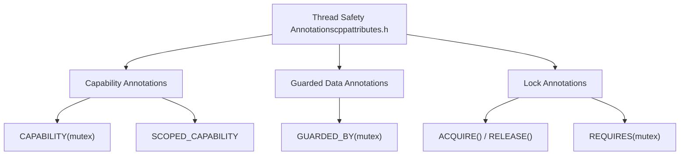
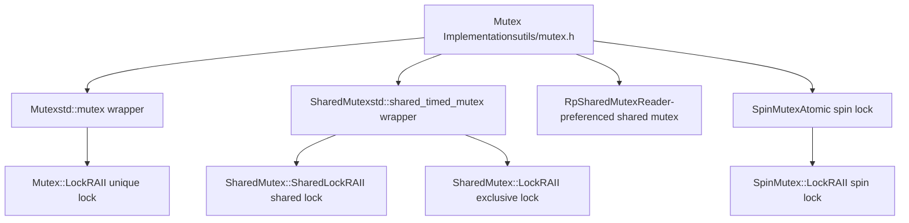
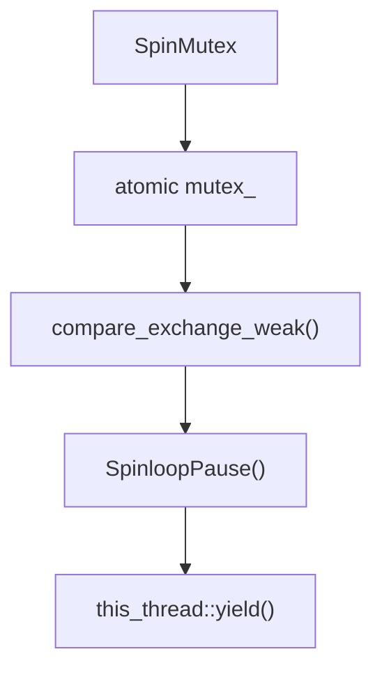
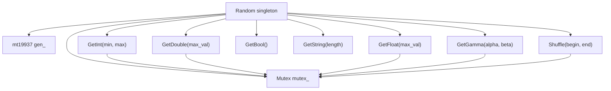
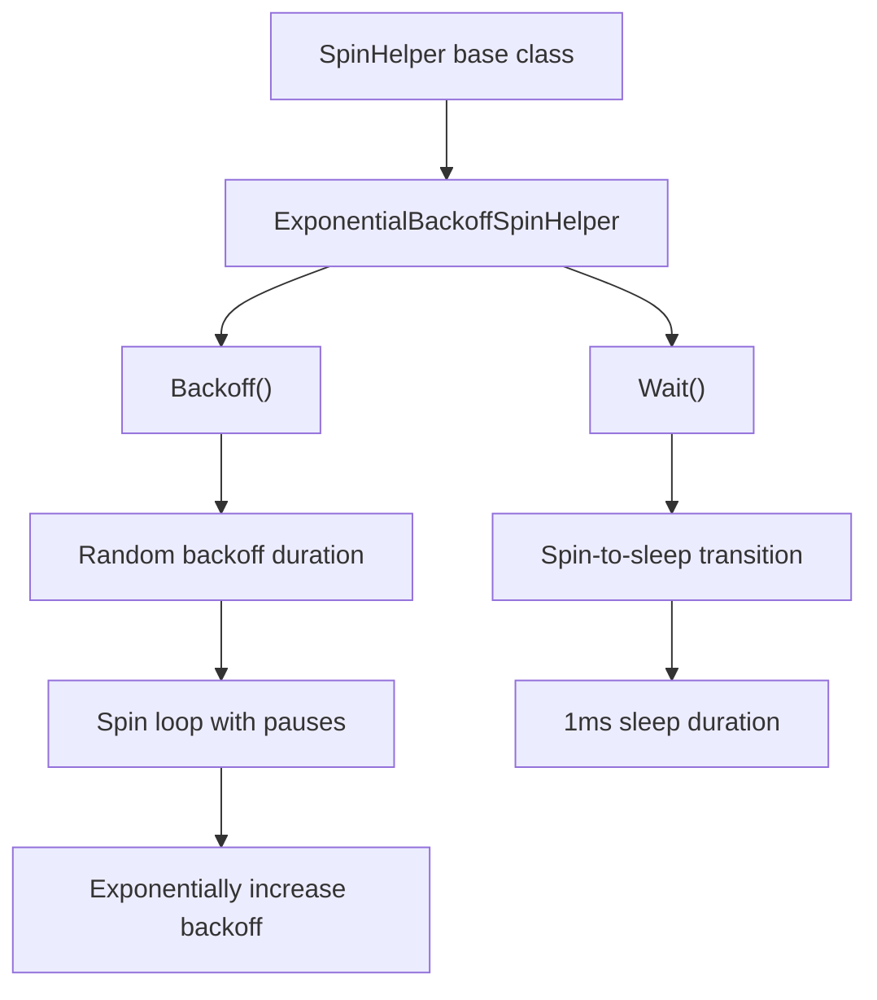
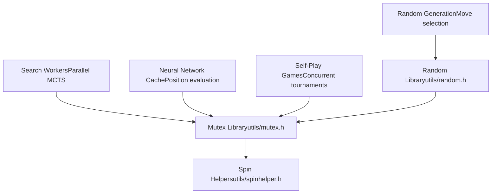

# 线程与同步

相关源文件

-   [src/chess/pgn.h](https://github.com/LeelaChessZero/lc0/blob/b4e98c19/src/chess/pgn.h)
-   [src/utils/cppattributes.h](https://github.com/LeelaChessZero/lc0/blob/b4e98c19/src/utils/cppattributes.h)
-   [src/utils/mutex.h](https://github.com/LeelaChessZero/lc0/blob/b4e98c19/src/utils/mutex.h)
-   [src/utils/random.cc](https://github.com/LeelaChessZero/lc0/blob/b4e98c19/src/utils/random.cc)
-   [src/utils/random.h](https://github.com/LeelaChessZero/lc0/blob/b4e98c19/src/utils/random.h)
-   [src/utils/spinhelper.h](https://github.com/LeelaChessZero/lc0/blob/b4e98c19/src/utils/spinhelper.h)

本文档涵盖了 Leela Chess Zero (lc0) 代码库中使用的线程和同步基础设施。系统实现了各种并发机制，以支持并行搜索工作者、线程安全的神经网络评估缓存和并发自对弈对局执行。

有关搜索算法并行化策略的信息，请参阅 [MCTS 实现](/LeelaChessZero/lc0/5.1-mcts-implementation)。有关神经网络后端线程安全的详细信息，请参阅 [内存缓存与性能](/LeelaChessZero/lc0/6.6-memory-caching-and-performance)。

## 线程安全注解

代码库使用 Clang 的线程安全分析系统来静态验证正确的互斥锁使用并防止常见的并发错误。

**来源：** [src/utils/cppattributes.h30-61](https://github.com/LeelaChessZero/lc0/blob/b4e98c19/src/utils/cppattributes.h#L30-L61)

注解系统包括：

| 注解 | 目的 | 用法 |
| --- | --- | --- |
| `CAPABILITY("mutex")` | 标记类为互斥锁类型 | 应用于 `Mutex`, `SharedMutex`, `SpinMutex` |
| `SCOPED_CAPABILITY` | 标记 RAII 锁包装类 | 应用于锁守卫类 (lock guard classes) |
| `GUARDED_BY(x)` | 指示由互斥锁 `x` 保护的数据 | 应用于成员变量 |
| `ACQUIRE()` / `RELEASE()` | 标记锁获取/释放函数 | 应用于 `lock()` 和 `unlock()` 方法 |
| `REQUIRES(...)` | 要求调用者持有指定的锁 | 应用于需要受保护访问的函数 |

## 核心互斥锁实现

系统提供了针对不同用例优化的几种互斥锁实现，所有实现都带有用于静态分析的线程安全注解。

**来源：** [src/utils/mutex.h72-171](https://github.com/LeelaChessZero/lc0/blob/b4e98c19/src/utils/mutex.h#L72-L171)

### 标准互斥锁包装器

`Mutex` 类使用线程安全注解包装了 `std::mutex`：

-   **目的**: 用于保护共享数据的基本独占锁定
-   **实现**: [src/utils/mutex.h72-91](https://github.com/LeelaChessZero/lc0/blob/b4e98c19/src/utils/mutex.h#L72-L91)
-   **锁守卫**: `Mutex::Lock` 提供 RAII 风格的锁定
-   **用法**: 整个代码库中的通用同步

### 读写共享互斥锁

`SharedMutex` 类允许多个并发读取者或单个独占写入者：

-   **实现**: [src/utils/mutex.h94-125](https://github.com/LeelaChessZero/lc0/blob/b4e98c19/src/utils/mutex.h#L94-L125)
-   **共享访问**: `SharedLock` 允许并发读取访问
-   **独占访问**: `Lock` 提供独占写入访问
-   **后端**: 使用 `std::shared_timed_mutex` 作为底层实现

### 读者优先共享互斥锁

`RpSharedMutex` 实现了自定义的读者优先策略，以防止写入者导致读取者饥饿：

-   **算法**: [src/utils/mutex.h45-69](https://github.com/LeelaChessZero/lc0/blob/b4e98c19/src/utils/mutex.h#L45-L69)
-   **读者优先级**: 独占锁等待所有正在等待的读取者完成
-   **实现**: 原子地跟踪 `waiting_readers_` 计数
-   **用例**: 读取操作明显多于写入的场景

### 自旋锁实现

`SpinMutex` 为短临界区提供了轻量级替代方案：

**来源：** [src/utils/mutex.h138-171](https://github.com/LeelaChessZero/lc0/blob/b4e98c19/src/utils/mutex.h#L138-L171)

关键特征：

-   **原子操作**: 使用具有获取-释放 (acquire-release) 语义的 `compare_exchange_weak`
-   **退避策略**: 包括 CPU 暂停指令和周期性线程让步
-   **性能**: 针对低争用和短持有时间的场景进行了优化
-   **CPU 效率**: 每 512 次失败尝试调用 `std::this_thread::yield()`

## 平台特定优化

系统包含用于高效忙等待的特定于平台的 CPU 暂停指令：

**来源：** [src/utils/mutex.h127-135](https://github.com/LeelaChessZero/lc0/blob/b4e98c19/src/utils/mutex.h#L127-L135)

`SpinloopPause()` 函数在自旋等待循环期间向 CPU 提供特定于架构的提示：

-   **x86/x64**: 使用 `_mm_pause()` 内在函数以降低功耗
-   **MSVC**: 内联汇编空操作以防止优化
-   **Generic**: 编译器屏障以确保存储器顺序

## 线程安全随机数生成

`Random` 类在整个应用程序中提供对伪随机数生成的线程安全访问：

**来源：** [src/utils/random.h37-61](https://github.com/LeelaChessZero/lc0/blob/b4e98c19/src/utils/random.h#L37-L61) [src/utils/random.cc33-73](https://github.com/LeelaChessZero/lc0/blob/b4e98c19/src/utils/random.cc#L33-L73)

### 单例模式实现

`Random` 类使用 Meyer's 单例模式进行线程安全初始化：

-   **初始化**: [src/utils/random.cc35-38](https://github.com/LeelaChessZero/lc0/blob/b4e98c19/src/utils/random.cc#L35-L38) - 静态局部变量确保线程安全构造
-   **种子源**: 使用 `std::random_device` 进行非确定性播种
-   **生成器**: 梅森旋转算法 (`std::mt19937`) 用于高质量伪随机序列

### 同步访问方法

所有随机生成方法在访问生成器之前都会获取内部互斥锁：

| 方法 | 分布 | 线程安全 |
| --- | --- | --- |
| `GetInt(min, max)` | `uniform_int_distribution` | `Mutex::Lock` |
| `GetDouble(max_val)` | `uniform_real_distribution<double>` | `Mutex::Lock` |
| `GetFloat(max_val)` | `uniform_real_distribution<float>` | `Mutex::Lock` |
| `GetGamma(alpha, beta)` | `gamma_distribution` | `Mutex::Lock` |
| `Shuffle(begin, end)` | `std::shuffle` | `Mutex::Lock` |

## 指数退避策略

`SpinHelper` 系统提供了复杂的退避机制，以减少忙等待场景下的 CPU 争用：

**来源：** [src/utils/spinhelper.h44-80](https://github.com/LeelaChessZero/lc0/blob/b4e98c19/src/utils/spinhelper.h#L44-L80)

### 退避算法

`ExponentialBackoffSpinHelper` 实现了自适应退避策略：

1.  **随机抖动**: 使用线程局部随机生成来改变退避持续时间
2.  **指数增长**: 每次调用将 `backoff_iters_` 加倍，直到最大阈值
3.  **CPU 暂停**: 执行计算出的迭代次数的 `SpinloopPause()`
4.  **边界**: 退避迭代范围从 `0x20` 到 `0x400`

### 自旋到休眠转换

`Wait()` 方法实现了分级线程让步方法：

-   **自旋阶段**: 最多 `0x10000` 次 `SpinloopPause()` 迭代
-   **休眠阶段**: 使用 `std::this_thread::sleep_for()` 休眠 1ms
-   **循环重置**: 每次休眠后返回自旋

## 使用模式与集成

线程实用工具集成到整个 lc0 架构中以提供安全的并发访问：

**来源：** 基于高层架构分析和线程实用工具实现

### 常见集成点

-   **搜索树访问**: 多个工作线程协调对共享 MCTS 节点的访问
-   **缓存管理**: 以线程安全访问模式缓存神经网络评估结果
-   **锦标赛管理**: 自对弈对局并发执行并同步结果收集
-   **配置访问**: 对全局配置和选项的线程安全访问
-   **日志系统**: 协调来自多个并发线程的输出

线程和同步系统为 lc0 的高度并行架构提供了基础，使其能够高效利用多核系统，同时保持数据一致性并防止竞争条件。
