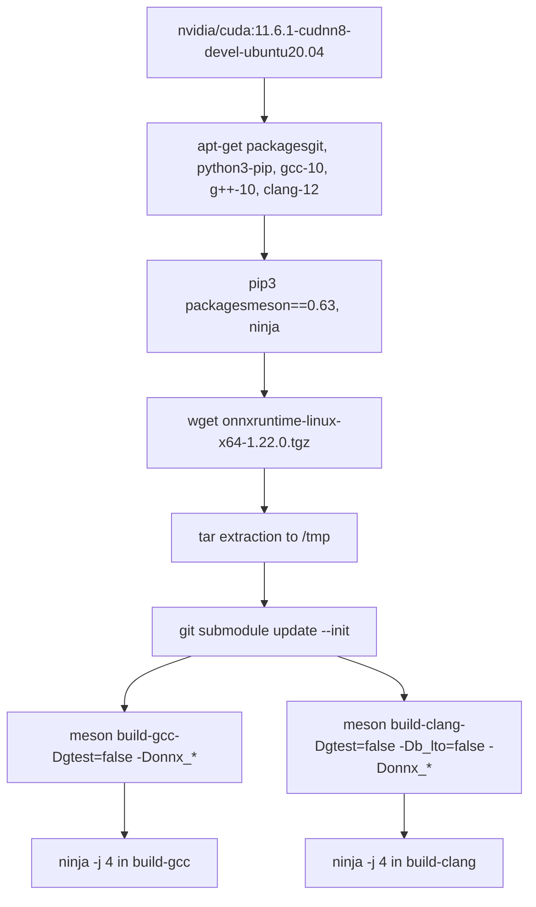
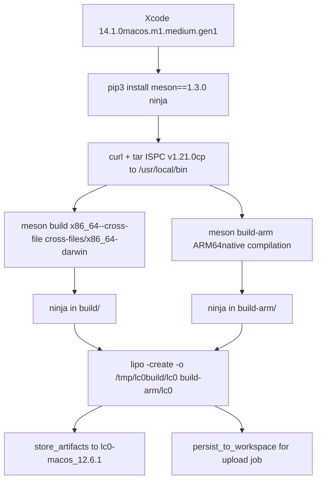
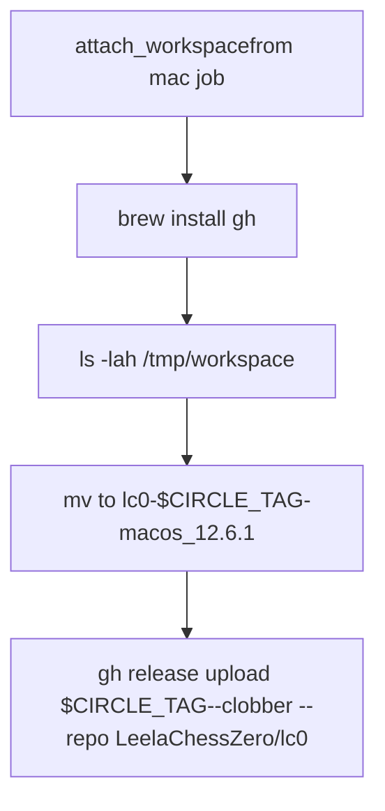
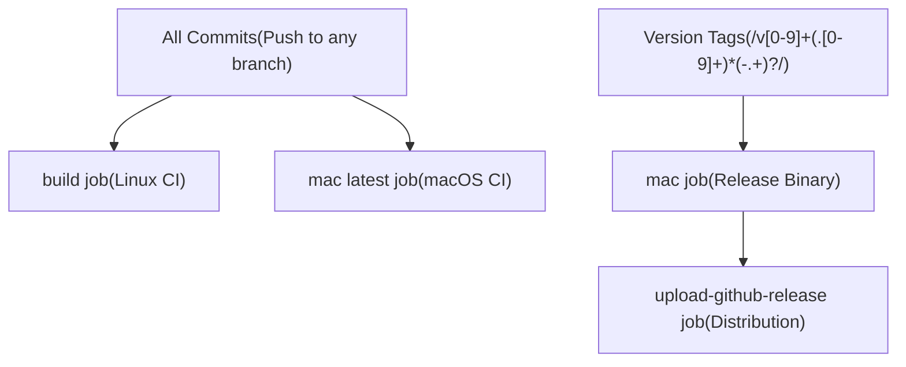

# CircleCI 工作流

相关源文件

-   [.circleci/Dockerfile](https://github.com/LeelaChessZero/lc0/blob/b4e98c19/.circleci/Dockerfile)
-   [.circleci/config.yml](https://github.com/LeelaChessZero/lc0/blob/b4e98c19/.circleci/config.yml)
-   [.clang-format](https://github.com/LeelaChessZero/lc0/blob/b4e98c19/.clang-format)
-   [.gitmodules](https://github.com/LeelaChessZero/lc0/blob/b4e98c19/.gitmodules)
-   [cross-files/x86\_64-darwin](https://github.com/LeelaChessZero/lc0/blob/b4e98c19/cross-files/x86_64-darwin)
-   [subprojects/protobuf.wrap](https://github.com/LeelaChessZero/lc0/blob/b4e98c19/subprojects/protobuf.wrap)

本文档涵盖了 Leela Chess Zero 项目基于 CircleCI 的持续集成系统。CircleCI 处理 Linux 和 macOS 平台的自动构建和测试，包括交叉编译和发布产物生成。有关 Windows 构建和打包的信息，请参阅 [Windows 构建与打包](/LeelaChessZero/lc0/9.2-windows-build-and-packaging)。

## 目的与架构

CircleCI 工作流提供跨多个平台和编译器的自动构建，确保代码质量并生成分发产物。该系统通过 [.circleci/config.yml1-148](https://github.com/LeelaChessZero/lc0/blob/b4e98c19/.circleci/config.yml#L1-L148) 进行配置，并支持：

-   使用多个编译器 (GCC, Clang) 的 Linux 构建
-   macOS 通用二进制文件 (x86\_64 + ARM64)
-   用于跨平台神经网络推理的 ONNX Runtime 集成
-   针对标记版本的自动 GitHub 发布上传

```mermaid
flowchart TD
    BuildJob["build(Linux)"]
    MacJob["mac(macOS Universal)"]
    MacLatestJob["mac latest(macOS ARM)"]
    UploadJob["upload-github-release(Release Artifacts)"]
    CudaDocker["nvidia/cuda:11.6.1-cudnn8-devel-ubuntu20.04"]
    MacOSXcode14["macOS Xcode 14.1.0M1 Medium"]
    MacOSXcode16["macOS Xcode 16.4.0M1 Medium"]
    Meson["meson build system"]
    Ninja["ninja build tool"]
    GCC["gcc-10/g++-10"]
    Clang["clang-12/clang++-12"]
    ISPC["Intel ISPC compiler"]
    OnnxRuntime["ONNX Runtime 1.22.0"]
    Submodules["lczero-common submodule"]
    CrossFiles["x86_64-darwin cross-file"]
    LinuxBinaries["Linux Binaries(GCC + Clang)"]
    UniversalBinary["macOS Universal Binary(x86_64 + ARM64)"]
    GitHubRelease["GitHub Release Assets"]

    BuildJob --> CudaDocker
    MacJob --> MacOSXcode14
    MacLatestJob --> MacOSXcode16
    BuildJob --> GCC
    BuildJob --> Clang
    MacJob --> ISPC
    BuildJob --> OnnxRuntime
    MacJob --> CrossFiles
    BuildJob --> Submodules
    MacJob --> Submodules
    BuildJob --> LinuxBinaries
    MacJob --> UniversalBinary
    UploadJob --> GitHubRelease
    MacJob --> UploadJob
```

来源：[.circleci/config.yml1-148](https://github.com/LeelaChessZero/lc0/blob/b4e98c19/.circleci/config.yml#L1-L148)

## 作业定义

### Linux 构建作业

`build` 作业使用支持 CUDA 的 Docker 环境执行 Linux 编译：

该作业同时使用 GCC 10 和 Clang 12 编译器进行构建，在 [.circleci/config.yml28](https://github.com/LeelaChessZero/lc0/blob/b4e98c19/.circleci/config.yml#L28-L28) 和 [.circleci/config.yml34](https://github.com/LeelaChessZero/lc0/blob/b4e98c19/.circleci/config.yml#L34-L34) 配置了 ONNX Runtime 支持。ONNX Runtime 从 Microsoft 的 GitHub 发布页面下载并解压到 `/tmp`，以便在构建过程中进行链接。

来源：[.circleci/config.yml3-44](https://github.com/LeelaChessZero/lc0/blob/b4e98c19/.circleci/config.yml#L3-L44)

### macOS 构建作业

两个 macOS 作业处理不同的构建场景：

#### Mac 作业 (发布构建)

`mac` 作业创建用于发布分发的通用二进制文件：

该作业通过 [cross-files/x86\_64-darwin1-28](https://github.com/LeelaChessZero/lc0/blob/b4e98c19/cross-files/x86_64-darwin#L1-L28) 对 x86\_64 使用交叉编译，对 ARM64 使用原生编译。位于 [.circleci/config.yml76](https://github.com/LeelaChessZero/lc0/blob/b4e98c19/.circleci/config.yml#L76-L76) 的 `lipo` 命令创建最终的通用二进制文件。

#### Mac 最新作业 (Mac Latest Job)

`mac latest` 作业使用最新的 Xcode 版本 (16.4.0) 提供持续测试，但仅构建 ARM64 架构，位于 [.circleci/config.yml104-108](https://github.com/LeelaChessZero/lc0/blob/b4e98c19/.circleci/config.yml#L104-L108)。

来源：[.circleci/config.yml45-88](https://github.com/LeelaChessZero/lc0/blob/b4e98c19/.circleci/config.yml#L45-L88) [.circleci/config.yml89-108](https://github.com/LeelaChessZero/lc0/blob/b4e98c19/.circleci/config.yml#L89-L108) [cross-files/x86\_64-darwin1-28](https://github.com/LeelaChessZero/lc0/blob/b4e98c19/cross-files/x86_64-darwin#L1-L28)

### GitHub 发布上传作业

`upload-github-release` 作业处理自动化的发布产物分发：

该作业仅在版本标签（匹配 `/v[0-9]+(\.[0-9]+)*(\-.+)?/`）上运行，并要求完成在 [.circleci/config.yml140-147](https://github.com/LeelaChessZero/lc0/blob/b4e98c19/.circleci/config.yml#L140-L147) 的工作流过滤器中定义的 `mac` 作业。

来源：[.circleci/config.yml109-148](https://github.com/LeelaChessZero/lc0/blob/b4e98c19/.circleci/config.yml#L109-L148)

## 工作流配置

CircleCI 工作流通过依赖项和过滤器编排作业执行：

| 作业 | 触发器 | 依赖项 | 产物 |
| --- | --- | --- | --- |
| `build` | 所有提交 | 无 | Linux 二进制文件 (不存储) |
| `mac latest` | 所有提交 | 无 | 无 |
| `mac` | 仅版本标签 | 无 | macOS 通用二进制文件 |
| `upload-github-release` | 仅版本标签 | `mac` 作业完成 | GitHub 发布资源 |

[.circleci/config.yml130-148](https://github.com/LeelaChessZero/lc0/blob/b4e98c19/.circleci/config.yml#L130-L148) 中的工作流配置确保发布构建仅针对正确标记的版本进行，而持续集成在每次提交时运行。

来源：[.circleci/config.yml130-148](https://github.com/LeelaChessZero/lc0/blob/b4e98c19/.circleci/config.yml#L130-L148)

## 构建依赖项与环境

### ONNX Runtime 集成

Linux 构建集成了 ONNX Runtime 1.22.0 以实现跨平台神经网络推理。运行时从 Microsoft 的 GitHub 发布页面下载（[.circleci/config.yml18-19](https://github.com/LeelaChessZero/lc0/blob/b4e98c19/.circleci/config.yml#L18-L19)），并通过 `-Donnx_include` 和 `-Donnx_libdir` 参数在 GCC 和 Clang 构建中进行配置。

### 子模块管理

所有作业通过 `git submodule update --init`（[.circleci/config.yml22](https://github.com/LeelaChessZero/lc0/blob/b4e98c19/.circleci/config.yml#L22-L22)）初始化 `lczero-common` 子模块，确保访问 [.gitmodules1-4](https://github.com/LeelaChessZero/lc0/blob/b4e98c19/.gitmodules#L1-L4) 中引用的共享实用工具和神经网络组件。

### 跨平台工具链

macOS 构建利用 Intel ISPC (Intel SPMD 程序编译器) 版本 1.21.0 进行优化的并行计算，在 [.circleci/config.yml59-61](https://github.com/LeelaChessZero/lc0/blob/b4e98c19/.circleci/config.yml#L59-L61) 下载并安装。x86\_64 交叉编译使用 [cross-files/x86\_64-darwin1-28](https://github.com/LeelaChessZero/lc0/blob/b4e98c19/cross-files/x86_64-darwin#L1-L28) 中定义的配置。

来源：[.circleci/config.yml16-22](https://github.com/LeelaChessZero/lc0/blob/b4e98c19/.circleci/config.yml#L16-L22) [.gitmodules1-4](https://github.com/LeelaChessZero/lc0/blob/b4e98c19/.gitmodules#L1-L4) [cross-files/x86\_64-darwin1-28](https://github.com/LeelaChessZero/lc0/blob/b4e98c19/cross-files/x86_64-darwin#L1-L28)
