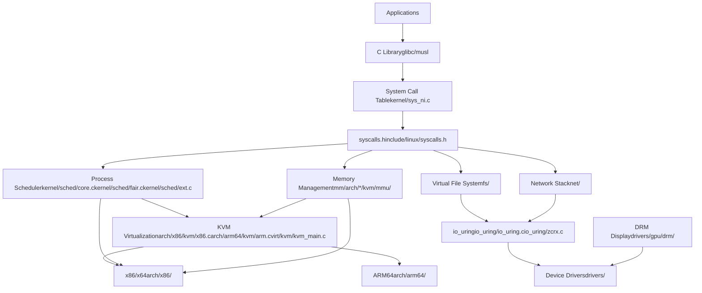
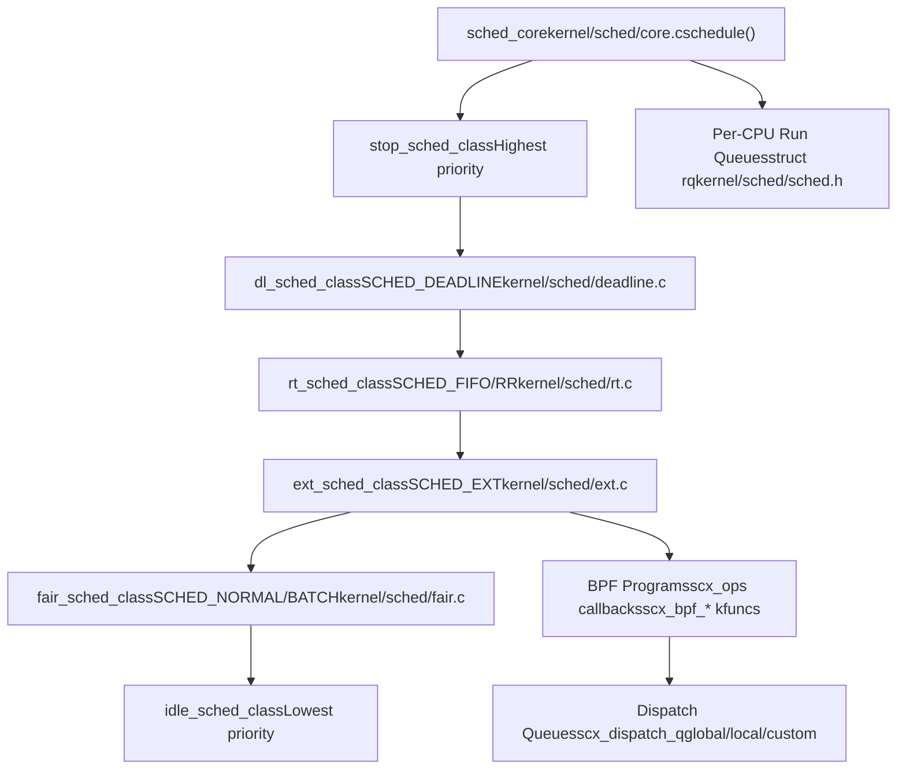
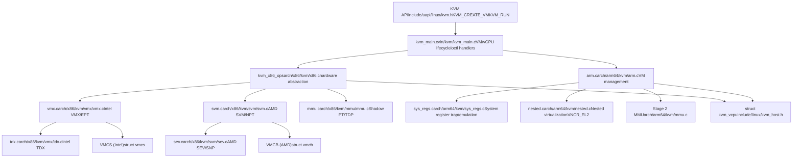
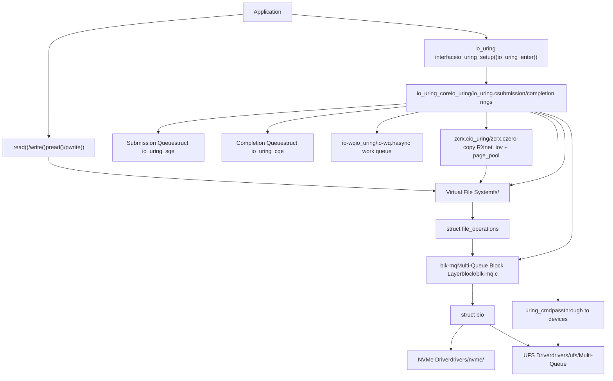
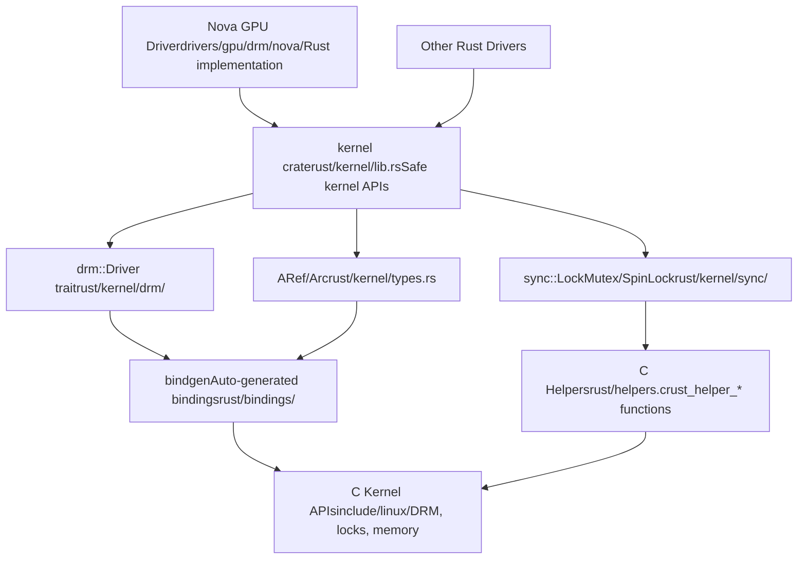

# Linux Kernel Overview

Relevant source files

-   [Documentation/networking/iou-zcrx.rst](https://github.com/torvalds/linux/blob/fcb70a56/Documentation/networking/iou-zcrx.rst)
-   [Documentation/scheduler/sched-debug.rst](https://github.com/torvalds/linux/blob/fcb70a56/Documentation/scheduler/sched-debug.rst)
-   [Documentation/scheduler/sched-design-CFS.rst](https://github.com/torvalds/linux/blob/fcb70a56/Documentation/scheduler/sched-design-CFS.rst)
-   [Documentation/scheduler/sched-domains.rst](https://github.com/torvalds/linux/blob/fcb70a56/Documentation/scheduler/sched-domains.rst)
-   [Documentation/scheduler/sched-ext.rst](https://github.com/torvalds/linux/blob/fcb70a56/Documentation/scheduler/sched-ext.rst)
-   [Documentation/scheduler/sched-stats.rst](https://github.com/torvalds/linux/blob/fcb70a56/Documentation/scheduler/sched-stats.rst)
-   [Documentation/translations/sp\_SP/scheduler/sched-design-CFS.rst](https://github.com/torvalds/linux/blob/fcb70a56/Documentation/translations/sp_SP/scheduler/sched-design-CFS.rst)
-   [Documentation/virt/kvm/api.rst](https://github.com/torvalds/linux/blob/fcb70a56/Documentation/virt/kvm/api.rst)
-   [Documentation/virt/kvm/locking.rst](https://github.com/torvalds/linux/blob/fcb70a56/Documentation/virt/kvm/locking.rst)
-   [Documentation/virt/kvm/x86/index.rst](https://github.com/torvalds/linux/blob/fcb70a56/Documentation/virt/kvm/x86/index.rst)
-   [Documentation/virt/kvm/x86/intel-tdx.rst](https://github.com/torvalds/linux/blob/fcb70a56/Documentation/virt/kvm/x86/intel-tdx.rst)
-   [MAINTAINERS](https://github.com/torvalds/linux/blob/fcb70a56/MAINTAINERS)
-   [arch/arm64/include/asm/esr.h](https://github.com/torvalds/linux/blob/fcb70a56/arch/arm64/include/asm/esr.h)
-   [arch/arm64/include/asm/kvm\_arm.h](https://github.com/torvalds/linux/blob/fcb70a56/arch/arm64/include/asm/kvm_arm.h)
-   [arch/arm64/include/asm/kvm\_asm.h](https://github.com/torvalds/linux/blob/fcb70a56/arch/arm64/include/asm/kvm_asm.h)
-   [arch/arm64/include/asm/kvm\_emulate.h](https://github.com/torvalds/linux/blob/fcb70a56/arch/arm64/include/asm/kvm_emulate.h)
-   [arch/arm64/include/asm/kvm\_host.h](https://github.com/torvalds/linux/blob/fcb70a56/arch/arm64/include/asm/kvm_host.h)
-   [arch/arm64/include/asm/kvm\_mmu.h](https://github.com/torvalds/linux/blob/fcb70a56/arch/arm64/include/asm/kvm_mmu.h)
-   [arch/arm64/include/asm/kvm\_nested.h](https://github.com/torvalds/linux/blob/fcb70a56/arch/arm64/include/asm/kvm_nested.h)
-   [arch/arm64/include/asm/kvm\_pgtable.h](https://github.com/torvalds/linux/blob/fcb70a56/arch/arm64/include/asm/kvm_pgtable.h)
-   [arch/arm64/include/asm/kvm\_pkvm.h](https://github.com/torvalds/linux/blob/fcb70a56/arch/arm64/include/asm/kvm_pkvm.h)
-   [arch/arm64/include/asm/memory.h](https://github.com/torvalds/linux/blob/fcb70a56/arch/arm64/include/asm/memory.h)
-   [arch/arm64/include/asm/por.h](https://github.com/torvalds/linux/blob/fcb70a56/arch/arm64/include/asm/por.h)
-   [arch/arm64/include/asm/stacktrace/nvhe.h](https://github.com/torvalds/linux/blob/fcb70a56/arch/arm64/include/asm/stacktrace/nvhe.h)
-   [arch/arm64/include/asm/sysreg.h](https://github.com/torvalds/linux/blob/fcb70a56/arch/arm64/include/asm/sysreg.h)
-   [arch/arm64/kvm/Makefile](https://github.com/torvalds/linux/blob/fcb70a56/arch/arm64/kvm/Makefile)
-   [arch/arm64/kvm/arch\_timer.c](https://github.com/torvalds/linux/blob/fcb70a56/arch/arm64/kvm/arch_timer.c)
-   [arch/arm64/kvm/arm.c](https://github.com/torvalds/linux/blob/fcb70a56/arch/arm64/kvm/arm.c)
-   [arch/arm64/kvm/at.c](https://github.com/torvalds/linux/blob/fcb70a56/arch/arm64/kvm/at.c)
-   [arch/arm64/kvm/config.c](https://github.com/torvalds/linux/blob/fcb70a56/arch/arm64/kvm/config.c)
-   [arch/arm64/kvm/debug.c](https://github.com/torvalds/linux/blob/fcb70a56/arch/arm64/kvm/debug.c)
-   [arch/arm64/kvm/emulate-nested.c](https://github.com/torvalds/linux/blob/fcb70a56/arch/arm64/kvm/emulate-nested.c)
-   [arch/arm64/kvm/fpsimd.c](https://github.com/torvalds/linux/blob/fcb70a56/arch/arm64/kvm/fpsimd.c)
-   [arch/arm64/kvm/guest.c](https://github.com/torvalds/linux/blob/fcb70a56/arch/arm64/kvm/guest.c)
-   [arch/arm64/kvm/handle\_exit.c](https://github.com/torvalds/linux/blob/fcb70a56/arch/arm64/kvm/handle_exit.c)
-   [arch/arm64/kvm/hyp/entry.S](https://github.com/torvalds/linux/blob/fcb70a56/arch/arm64/kvm/hyp/entry.S)
-   [arch/arm64/kvm/hyp/exception.c](https://github.com/torvalds/linux/blob/fcb70a56/arch/arm64/kvm/hyp/exception.c)
-   [arch/arm64/kvm/hyp/include/hyp/debug-sr.h](https://github.com/torvalds/linux/blob/fcb70a56/arch/arm64/kvm/hyp/include/hyp/debug-sr.h)
-   [arch/arm64/kvm/hyp/include/hyp/fault.h](https://github.com/torvalds/linux/blob/fcb70a56/arch/arm64/kvm/hyp/include/hyp/fault.h)
-   [arch/arm64/kvm/hyp/include/hyp/switch.h](https://github.com/torvalds/linux/blob/fcb70a56/arch/arm64/kvm/hyp/include/hyp/switch.h)
-   [arch/arm64/kvm/hyp/include/hyp/sysreg-sr.h](https://github.com/torvalds/linux/blob/fcb70a56/arch/arm64/kvm/hyp/include/hyp/sysreg-sr.h)
-   [arch/arm64/kvm/hyp/include/nvhe/gfp.h](https://github.com/torvalds/linux/blob/fcb70a56/arch/arm64/kvm/hyp/include/nvhe/gfp.h)
-   [arch/arm64/kvm/hyp/include/nvhe/mem\_protect.h](https://github.com/torvalds/linux/blob/fcb70a56/arch/arm64/kvm/hyp/include/nvhe/mem_protect.h)
-   [arch/arm64/kvm/hyp/include/nvhe/memory.h](https://github.com/torvalds/linux/blob/fcb70a56/arch/arm64/kvm/hyp/include/nvhe/memory.h)
-   [arch/arm64/kvm/hyp/include/nvhe/mm.h](https://github.com/torvalds/linux/blob/fcb70a56/arch/arm64/kvm/hyp/include/nvhe/mm.h)
-   [arch/arm64/kvm/hyp/include/nvhe/pkvm.h](https://github.com/torvalds/linux/blob/fcb70a56/arch/arm64/kvm/hyp/include/nvhe/pkvm.h)
-   [arch/arm64/kvm/hyp/nvhe/debug-sr.c](https://github.com/torvalds/linux/blob/fcb70a56/arch/arm64/kvm/hyp/nvhe/debug-sr.c)
-   [arch/arm64/kvm/hyp/nvhe/hyp-main.c](https://github.com/torvalds/linux/blob/fcb70a56/arch/arm64/kvm/hyp/nvhe/hyp-main.c)
-   [arch/arm64/kvm/hyp/nvhe/mem\_protect.c](https://github.com/torvalds/linux/blob/fcb70a56/arch/arm64/kvm/hyp/nvhe/mem_protect.c)
-   [arch/arm64/kvm/hyp/nvhe/mm.c](https://github.com/torvalds/linux/blob/fcb70a56/arch/arm64/kvm/hyp/nvhe/mm.c)
-   [arch/arm64/kvm/hyp/nvhe/page\_alloc.c](https://github.com/torvalds/linux/blob/fcb70a56/arch/arm64/kvm/hyp/nvhe/page_alloc.c)
-   [arch/arm64/kvm/hyp/nvhe/pkvm.c](https://github.com/torvalds/linux/blob/fcb70a56/arch/arm64/kvm/hyp/nvhe/pkvm.c)
-   [arch/arm64/kvm/hyp/nvhe/setup.c](https://github.com/torvalds/linux/blob/fcb70a56/arch/arm64/kvm/hyp/nvhe/setup.c)
-   [arch/arm64/kvm/hyp/nvhe/stacktrace.c](https://github.com/torvalds/linux/blob/fcb70a56/arch/arm64/kvm/hyp/nvhe/stacktrace.c)
-   [arch/arm64/kvm/hyp/nvhe/switch.c](https://github.com/torvalds/linux/blob/fcb70a56/arch/arm64/kvm/hyp/nvhe/switch.c)
-   [arch/arm64/kvm/hyp/nvhe/sys\_regs.c](https://github.com/torvalds/linux/blob/fcb70a56/arch/arm64/kvm/hyp/nvhe/sys_regs.c)
-   [arch/arm64/kvm/hyp/nvhe/sysreg-sr.c](https://github.com/torvalds/linux/blob/fcb70a56/arch/arm64/kvm/hyp/nvhe/sysreg-sr.c)
-   [arch/arm64/kvm/hyp/nvhe/timer-sr.c](https://github.com/torvalds/linux/blob/fcb70a56/arch/arm64/kvm/hyp/nvhe/timer-sr.c)
-   [arch/arm64/kvm/hyp/pgtable.c](https://github.com/torvalds/linux/blob/fcb70a56/arch/arm64/kvm/hyp/pgtable.c)
-   [arch/arm64/kvm/hyp/vhe/debug-sr.c](https://github.com/torvalds/linux/blob/fcb70a56/arch/arm64/kvm/hyp/vhe/debug-sr.c)
-   [arch/arm64/kvm/hyp/vhe/switch.c](https://github.com/torvalds/linux/blob/fcb70a56/arch/arm64/kvm/hyp/vhe/switch.c)
-   [arch/arm64/kvm/hyp/vhe/sysreg-sr.c](https://github.com/torvalds/linux/blob/fcb70a56/arch/arm64/kvm/hyp/vhe/sysreg-sr.c)
-   [arch/arm64/kvm/inject\_fault.c](https://github.com/torvalds/linux/blob/fcb70a56/arch/arm64/kvm/inject_fault.c)
-   [arch/arm64/kvm/mmu.c](https://github.com/torvalds/linux/blob/fcb70a56/arch/arm64/kvm/mmu.c)
-   [arch/arm64/kvm/nested.c](https://github.com/torvalds/linux/blob/fcb70a56/arch/arm64/kvm/nested.c)
-   [arch/arm64/kvm/pkvm.c](https://github.com/torvalds/linux/blob/fcb70a56/arch/arm64/kvm/pkvm.c)
-   [arch/arm64/kvm/pmu-emul.c](https://github.com/torvalds/linux/blob/fcb70a56/arch/arm64/kvm/pmu-emul.c)
-   [arch/arm64/kvm/reset.c](https://github.com/torvalds/linux/blob/fcb70a56/arch/arm64/kvm/reset.c)
-   [arch/arm64/kvm/stacktrace.c](https://github.com/torvalds/linux/blob/fcb70a56/arch/arm64/kvm/stacktrace.c)
-   [arch/arm64/kvm/sys\_regs.c](https://github.com/torvalds/linux/blob/fcb70a56/arch/arm64/kvm/sys_regs.c)
-   [arch/arm64/kvm/sys\_regs.h](https://github.com/torvalds/linux/blob/fcb70a56/arch/arm64/kvm/sys_regs.h)
-   [arch/arm64/kvm/va\_layout.c](https://github.com/torvalds/linux/blob/fcb70a56/arch/arm64/kvm/va_layout.c)
-   [arch/arm64/kvm/vgic/vgic-v5.c](https://github.com/torvalds/linux/blob/fcb70a56/arch/arm64/kvm/vgic/vgic-v5.c)
-   [arch/arm64/tools/sysreg](https://github.com/torvalds/linux/blob/fcb70a56/arch/arm64/tools/sysreg)
-   [arch/loongarch/kvm/Kconfig](https://github.com/torvalds/linux/blob/fcb70a56/arch/loongarch/kvm/Kconfig)
-   [arch/mips/kvm/Kconfig](https://github.com/torvalds/linux/blob/fcb70a56/arch/mips/kvm/Kconfig)
-   [arch/powerpc/kvm/Kconfig](https://github.com/torvalds/linux/blob/fcb70a56/arch/powerpc/kvm/Kconfig)
-   [arch/riscv/kvm/Kconfig](https://github.com/torvalds/linux/blob/fcb70a56/arch/riscv/kvm/Kconfig)
-   [arch/s390/kvm/Kconfig](https://github.com/torvalds/linux/blob/fcb70a56/arch/s390/kvm/Kconfig)
-   [arch/x86/coco/tdx/Makefile](https://github.com/torvalds/linux/blob/fcb70a56/arch/x86/coco/tdx/Makefile)
-   [arch/x86/coco/tdx/debug.c](https://github.com/torvalds/linux/blob/fcb70a56/arch/x86/coco/tdx/debug.c)
-   [arch/x86/coco/tdx/tdx.c](https://github.com/torvalds/linux/blob/fcb70a56/arch/x86/coco/tdx/tdx.c)
-   [arch/x86/include/asm/apic.h](https://github.com/torvalds/linux/blob/fcb70a56/arch/x86/include/asm/apic.h)
-   [arch/x86/include/asm/hw\_irq.h](https://github.com/torvalds/linux/blob/fcb70a56/arch/x86/include/asm/hw_irq.h)
-   [arch/x86/include/asm/irq\_remapping.h](https://github.com/torvalds/linux/blob/fcb70a56/arch/x86/include/asm/irq_remapping.h)
-   [arch/x86/include/asm/kvm-x86-ops.h](https://github.com/torvalds/linux/blob/fcb70a56/arch/x86/include/asm/kvm-x86-ops.h)
-   [arch/x86/include/asm/kvm\_host.h](https://github.com/torvalds/linux/blob/fcb70a56/arch/x86/include/asm/kvm_host.h)
-   [arch/x86/include/asm/posted\_intr.h](https://github.com/torvalds/linux/blob/fcb70a56/arch/x86/include/asm/posted_intr.h)
-   [arch/x86/include/asm/shared/tdx.h](https://github.com/torvalds/linux/blob/fcb70a56/arch/x86/include/asm/shared/tdx.h)
-   [arch/x86/include/asm/svm.h](https://github.com/torvalds/linux/blob/fcb70a56/arch/x86/include/asm/svm.h)
-   [arch/x86/include/asm/tdx.h](https://github.com/torvalds/linux/blob/fcb70a56/arch/x86/include/asm/tdx.h)
-   [arch/x86/include/asm/tdx\_global\_metadata.h](https://github.com/torvalds/linux/blob/fcb70a56/arch/x86/include/asm/tdx_global_metadata.h)
-   [arch/x86/include/asm/vmx.h](https://github.com/torvalds/linux/blob/fcb70a56/arch/x86/include/asm/vmx.h)
-   [arch/x86/include/uapi/asm/kvm.h](https://github.com/torvalds/linux/blob/fcb70a56/arch/x86/include/uapi/asm/kvm.h)
-   [arch/x86/include/uapi/asm/svm.h](https://github.com/torvalds/linux/blob/fcb70a56/arch/x86/include/uapi/asm/svm.h)
-   [arch/x86/include/uapi/asm/vmx.h](https://github.com/torvalds/linux/blob/fcb70a56/arch/x86/include/uapi/asm/vmx.h)
-   [arch/x86/kernel/apic/io\_apic.c](https://github.com/torvalds/linux/blob/fcb70a56/arch/x86/kernel/apic/io_apic.c)
-   [arch/x86/kernel/apic/msi.c](https://github.com/torvalds/linux/blob/fcb70a56/arch/x86/kernel/apic/msi.c)
-   [arch/x86/kernel/irq.c](https://github.com/torvalds/linux/blob/fcb70a56/arch/x86/kernel/irq.c)
-   [arch/x86/kvm/Kconfig](https://github.com/torvalds/linux/blob/fcb70a56/arch/x86/kvm/Kconfig)
-   [arch/x86/kvm/Makefile](https://github.com/torvalds/linux/blob/fcb70a56/arch/x86/kvm/Makefile)
-   [arch/x86/kvm/hyperv.c](https://github.com/torvalds/linux/blob/fcb70a56/arch/x86/kvm/hyperv.c)
-   [arch/x86/kvm/irq.c](https://github.com/torvalds/linux/blob/fcb70a56/arch/x86/kvm/irq.c)
-   [arch/x86/kvm/irq.h](https://github.com/torvalds/linux/blob/fcb70a56/arch/x86/kvm/irq.h)
-   [arch/x86/kvm/kvm\_onhyperv.c](https://github.com/torvalds/linux/blob/fcb70a56/arch/x86/kvm/kvm_onhyperv.c)
-   [arch/x86/kvm/lapic.c](https://github.com/torvalds/linux/blob/fcb70a56/arch/x86/kvm/lapic.c)
-   [arch/x86/kvm/lapic.h](https://github.com/torvalds/linux/blob/fcb70a56/arch/x86/kvm/lapic.h)
-   [arch/x86/kvm/mmu.h](https://github.com/torvalds/linux/blob/fcb70a56/arch/x86/kvm/mmu.h)
-   [arch/x86/kvm/mmu/mmu.c](https://github.com/torvalds/linux/blob/fcb70a56/arch/x86/kvm/mmu/mmu.c)
-   [arch/x86/kvm/mmu/mmu\_internal.h](https://github.com/torvalds/linux/blob/fcb70a56/arch/x86/kvm/mmu/mmu_internal.h)
-   [arch/x86/kvm/mmu/paging\_tmpl.h](https://github.com/torvalds/linux/blob/fcb70a56/arch/x86/kvm/mmu/paging_tmpl.h)
-   [arch/x86/kvm/mmu/spte.c](https://github.com/torvalds/linux/blob/fcb70a56/arch/x86/kvm/mmu/spte.c)
-   [arch/x86/kvm/mmu/spte.h](https://github.com/torvalds/linux/blob/fcb70a56/arch/x86/kvm/mmu/spte.h)
-   [arch/x86/kvm/mmu/tdp\_iter.c](https://github.com/torvalds/linux/blob/fcb70a56/arch/x86/kvm/mmu/tdp_iter.c)
-   [arch/x86/kvm/mmu/tdp\_iter.h](https://github.com/torvalds/linux/blob/fcb70a56/arch/x86/kvm/mmu/tdp_iter.h)
-   [arch/x86/kvm/mmu/tdp\_mmu.c](https://github.com/torvalds/linux/blob/fcb70a56/arch/x86/kvm/mmu/tdp_mmu.c)
-   [arch/x86/kvm/mmu/tdp\_mmu.h](https://github.com/torvalds/linux/blob/fcb70a56/arch/x86/kvm/mmu/tdp_mmu.h)
-   [arch/x86/kvm/pmu.c](https://github.com/torvalds/linux/blob/fcb70a56/arch/x86/kvm/pmu.c)
-   [arch/x86/kvm/pmu.h](https://github.com/torvalds/linux/blob/fcb70a56/arch/x86/kvm/pmu.h)
-   [arch/x86/kvm/smm.c](https://github.com/torvalds/linux/blob/fcb70a56/arch/x86/kvm/smm.c)
-   [arch/x86/kvm/smm.h](https://github.com/torvalds/linux/blob/fcb70a56/arch/x86/kvm/smm.h)
-   [arch/x86/kvm/svm/avic.c](https://github.com/torvalds/linux/blob/fcb70a56/arch/x86/kvm/svm/avic.c)
-   [arch/x86/kvm/svm/nested.c](https://github.com/torvalds/linux/blob/fcb70a56/arch/x86/kvm/svm/nested.c)
-   [arch/x86/kvm/svm/pmu.c](https://github.com/torvalds/linux/blob/fcb70a56/arch/x86/kvm/svm/pmu.c)
-   [arch/x86/kvm/svm/sev.c](https://github.com/torvalds/linux/blob/fcb70a56/arch/x86/kvm/svm/sev.c)
-   [arch/x86/kvm/svm/svm.c](https://github.com/torvalds/linux/blob/fcb70a56/arch/x86/kvm/svm/svm.c)
-   [arch/x86/kvm/svm/svm.h](https://github.com/torvalds/linux/blob/fcb70a56/arch/x86/kvm/svm/svm.h)
-   [arch/x86/kvm/svm/svm\_onhyperv.c](https://github.com/torvalds/linux/blob/fcb70a56/arch/x86/kvm/svm/svm_onhyperv.c)
-   [arch/x86/kvm/svm/svm\_onhyperv.h](https://github.com/torvalds/linux/blob/fcb70a56/arch/x86/kvm/svm/svm_onhyperv.h)
-   [arch/x86/kvm/vmx/capabilities.h](https://github.com/torvalds/linux/blob/fcb70a56/arch/x86/kvm/vmx/capabilities.h)
-   [arch/x86/kvm/vmx/common.h](https://github.com/torvalds/linux/blob/fcb70a56/arch/x86/kvm/vmx/common.h)
-   [arch/x86/kvm/vmx/main.c](https://github.com/torvalds/linux/blob/fcb70a56/arch/x86/kvm/vmx/main.c)
-   [arch/x86/kvm/vmx/nested.c](https://github.com/torvalds/linux/blob/fcb70a56/arch/x86/kvm/vmx/nested.c)
-   [arch/x86/kvm/vmx/nested.h](https://github.com/torvalds/linux/blob/fcb70a56/arch/x86/kvm/vmx/nested.h)
-   [arch/x86/kvm/vmx/pmu\_intel.c](https://github.com/torvalds/linux/blob/fcb70a56/arch/x86/kvm/vmx/pmu_intel.c)
-   [arch/x86/kvm/vmx/pmu\_intel.h](https://github.com/torvalds/linux/blob/fcb70a56/arch/x86/kvm/vmx/pmu_intel.h)
-   [arch/x86/kvm/vmx/posted\_intr.c](https://github.com/torvalds/linux/blob/fcb70a56/arch/x86/kvm/vmx/posted_intr.c)
-   [arch/x86/kvm/vmx/posted\_intr.h](https://github.com/torvalds/linux/blob/fcb70a56/arch/x86/kvm/vmx/posted_intr.h)
-   [arch/x86/kvm/vmx/tdx.c](https://github.com/torvalds/linux/blob/fcb70a56/arch/x86/kvm/vmx/tdx.c)
-   [arch/x86/kvm/vmx/tdx.h](https://github.com/torvalds/linux/blob/fcb70a56/arch/x86/kvm/vmx/tdx.h)
-   [arch/x86/kvm/vmx/tdx\_arch.h](https://github.com/torvalds/linux/blob/fcb70a56/arch/x86/kvm/vmx/tdx_arch.h)
-   [arch/x86/kvm/vmx/tdx\_errno.h](https://github.com/torvalds/linux/blob/fcb70a56/arch/x86/kvm/vmx/tdx_errno.h)
-   [arch/x86/kvm/vmx/vmx.c](https://github.com/torvalds/linux/blob/fcb70a56/arch/x86/kvm/vmx/vmx.c)
-   [arch/x86/kvm/vmx/vmx.h](https://github.com/torvalds/linux/blob/fcb70a56/arch/x86/kvm/vmx/vmx.h)
-   [arch/x86/kvm/vmx/x86\_ops.h](https://github.com/torvalds/linux/blob/fcb70a56/arch/x86/kvm/vmx/x86_ops.h)
-   [arch/x86/kvm/x86.c](https://github.com/torvalds/linux/blob/fcb70a56/arch/x86/kvm/x86.c)
-   [arch/x86/kvm/x86.h](https://github.com/torvalds/linux/blob/fcb70a56/arch/x86/kvm/x86.h)
-   [arch/x86/mm/mem\_encrypt.c](https://github.com/torvalds/linux/blob/fcb70a56/arch/x86/mm/mem_encrypt.c)
-   [arch/x86/platform/uv/uv\_irq.c](https://github.com/torvalds/linux/blob/fcb70a56/arch/x86/platform/uv/uv_irq.c)
-   [arch/x86/virt/vmx/tdx/seamcall.S](https://github.com/torvalds/linux/blob/fcb70a56/arch/x86/virt/vmx/tdx/seamcall.S)
-   [arch/x86/virt/vmx/tdx/tdx.c](https://github.com/torvalds/linux/blob/fcb70a56/arch/x86/virt/vmx/tdx/tdx.c)
-   [arch/x86/virt/vmx/tdx/tdx.h](https://github.com/torvalds/linux/blob/fcb70a56/arch/x86/virt/vmx/tdx/tdx.h)
-   [drivers/gpu/drm/drm\_panic\_qr.rs](https://github.com/torvalds/linux/blob/fcb70a56/drivers/gpu/drm/drm_panic_qr.rs)
-   [drivers/gpu/drm/nova/Kconfig](https://github.com/torvalds/linux/blob/fcb70a56/drivers/gpu/drm/nova/Kconfig)
-   [drivers/gpu/drm/nova/Makefile](https://github.com/torvalds/linux/blob/fcb70a56/drivers/gpu/drm/nova/Makefile)
-   [drivers/gpu/drm/nova/driver.rs](https://github.com/torvalds/linux/blob/fcb70a56/drivers/gpu/drm/nova/driver.rs)
-   [drivers/gpu/drm/nova/file.rs](https://github.com/torvalds/linux/blob/fcb70a56/drivers/gpu/drm/nova/file.rs)
-   [drivers/gpu/drm/nova/gem.rs](https://github.com/torvalds/linux/blob/fcb70a56/drivers/gpu/drm/nova/gem.rs)
-   [drivers/gpu/drm/nova/nova.rs](https://github.com/torvalds/linux/blob/fcb70a56/drivers/gpu/drm/nova/nova.rs)
-   [drivers/iommu/intel/irq\_remapping.c](https://github.com/torvalds/linux/blob/fcb70a56/drivers/iommu/intel/irq_remapping.c)
-   [drivers/nvme/host/ioctl.c](https://github.com/torvalds/linux/blob/fcb70a56/drivers/nvme/host/ioctl.c)
-   [drivers/xen/events/events\_base.c](https://github.com/torvalds/linux/blob/fcb70a56/drivers/xen/events/events_base.c)
-   [include/kvm/arm\_arch\_timer.h](https://github.com/torvalds/linux/blob/fcb70a56/include/kvm/arm_arch_timer.h)
-   [include/kvm/arm\_pmu.h](https://github.com/torvalds/linux/blob/fcb70a56/include/kvm/arm_pmu.h)
-   [include/linux/io\_uring/cmd.h](https://github.com/torvalds/linux/blob/fcb70a56/include/linux/io_uring/cmd.h)
-   [include/linux/io\_uring\_types.h](https://github.com/torvalds/linux/blob/fcb70a56/include/linux/io_uring_types.h)
-   [include/linux/kvm\_dirty\_ring.h](https://github.com/torvalds/linux/blob/fcb70a56/include/linux/kvm_dirty_ring.h)
-   [include/linux/kvm\_host.h](https://github.com/torvalds/linux/blob/fcb70a56/include/linux/kvm_host.h)
-   [include/linux/misc\_cgroup.h](https://github.com/torvalds/linux/blob/fcb70a56/include/linux/misc_cgroup.h)
-   [include/linux/rwlock\_rt.h](https://github.com/torvalds/linux/blob/fcb70a56/include/linux/rwlock_rt.h)
-   [include/linux/sched.h](https://github.com/torvalds/linux/blob/fcb70a56/include/linux/sched.h)
-   [include/linux/sched/sd\_flags.h](https://github.com/torvalds/linux/blob/fcb70a56/include/linux/sched/sd_flags.h)
-   [include/linux/sched/topology.h](https://github.com/torvalds/linux/blob/fcb70a56/include/linux/sched/topology.h)
-   [include/linux/spinlock\_rt.h](https://github.com/torvalds/linux/blob/fcb70a56/include/linux/spinlock_rt.h)
-   [include/uapi/drm/nova\_drm.h](https://github.com/torvalds/linux/blob/fcb70a56/include/uapi/drm/nova_drm.h)
-   [include/uapi/linux/io\_uring.h](https://github.com/torvalds/linux/blob/fcb70a56/include/uapi/linux/io_uring.h)
-   [include/uapi/linux/io\_uring/query.h](https://github.com/torvalds/linux/blob/fcb70a56/include/uapi/linux/io_uring/query.h)
-   [include/uapi/linux/kvm.h](https://github.com/torvalds/linux/blob/fcb70a56/include/uapi/linux/kvm.h)
-   [include/uapi/linux/magic.h](https://github.com/torvalds/linux/blob/fcb70a56/include/uapi/linux/magic.h)
-   [io\_uring/Makefile](https://github.com/torvalds/linux/blob/fcb70a56/io_uring/Makefile)
-   [io\_uring/advise.c](https://github.com/torvalds/linux/blob/fcb70a56/io_uring/advise.c)
-   [io\_uring/alloc\_cache.c](https://github.com/torvalds/linux/blob/fcb70a56/io_uring/alloc_cache.c)
-   [io\_uring/alloc\_cache.h](https://github.com/torvalds/linux/blob/fcb70a56/io_uring/alloc_cache.h)
-   [io\_uring/cancel.c](https://github.com/torvalds/linux/blob/fcb70a56/io_uring/cancel.c)
-   [io\_uring/cancel.h](https://github.com/torvalds/linux/blob/fcb70a56/io_uring/cancel.h)
-   [io\_uring/cmd\_net.c](https://github.com/torvalds/linux/blob/fcb70a56/io_uring/cmd_net.c)
-   [io\_uring/epoll.c](https://github.com/torvalds/linux/blob/fcb70a56/io_uring/epoll.c)
-   [io\_uring/epoll.h](https://github.com/torvalds/linux/blob/fcb70a56/io_uring/epoll.h)
-   [io\_uring/fdinfo.c](https://github.com/torvalds/linux/blob/fcb70a56/io_uring/fdinfo.c)
-   [io\_uring/filetable.c](https://github.com/torvalds/linux/blob/fcb70a56/io_uring/filetable.c)
-   [io\_uring/filetable.h](https://github.com/torvalds/linux/blob/fcb70a56/io_uring/filetable.h)
-   [io\_uring/fs.c](https://github.com/torvalds/linux/blob/fcb70a56/io_uring/fs.c)
-   [io\_uring/futex.c](https://github.com/torvalds/linux/blob/fcb70a56/io_uring/futex.c)
-   [io\_uring/io-wq.c](https://github.com/torvalds/linux/blob/fcb70a56/io_uring/io-wq.c)
-   [io\_uring/io\_uring.c](https://github.com/torvalds/linux/blob/fcb70a56/io_uring/io_uring.c)
-   [io\_uring/io\_uring.h](https://github.com/torvalds/linux/blob/fcb70a56/io_uring/io_uring.h)
-   [io\_uring/kbuf.c](https://github.com/torvalds/linux/blob/fcb70a56/io_uring/kbuf.c)
-   [io\_uring/kbuf.h](https://github.com/torvalds/linux/blob/fcb70a56/io_uring/kbuf.h)
-   [io\_uring/memmap.c](https://github.com/torvalds/linux/blob/fcb70a56/io_uring/memmap.c)
-   [io\_uring/memmap.h](https://github.com/torvalds/linux/blob/fcb70a56/io_uring/memmap.h)
-   [io\_uring/msg\_ring.c](https://github.com/torvalds/linux/blob/fcb70a56/io_uring/msg_ring.c)
-   [io\_uring/net.c](https://github.com/torvalds/linux/blob/fcb70a56/io_uring/net.c)
-   [io\_uring/net.h](https://github.com/torvalds/linux/blob/fcb70a56/io_uring/net.h)
-   [io\_uring/nop.c](https://github.com/torvalds/linux/blob/fcb70a56/io_uring/nop.c)
-   [io\_uring/notif.c](https://github.com/torvalds/linux/blob/fcb70a56/io_uring/notif.c)
-   [io\_uring/opdef.c](https://github.com/torvalds/linux/blob/fcb70a56/io_uring/opdef.c)
-   [io\_uring/openclose.c](https://github.com/torvalds/linux/blob/fcb70a56/io_uring/openclose.c)
-   [io\_uring/poll.c](https://github.com/torvalds/linux/blob/fcb70a56/io_uring/poll.c)
-   [io\_uring/poll.h](https://github.com/torvalds/linux/blob/fcb70a56/io_uring/poll.h)
-   [io\_uring/query.c](https://github.com/torvalds/linux/blob/fcb70a56/io_uring/query.c)
-   [io\_uring/query.h](https://github.com/torvalds/linux/blob/fcb70a56/io_uring/query.h)
-   [io\_uring/register.c](https://github.com/torvalds/linux/blob/fcb70a56/io_uring/register.c)
-   [io\_uring/rsrc.c](https://github.com/torvalds/linux/blob/fcb70a56/io_uring/rsrc.c)
-   [io\_uring/rsrc.h](https://github.com/torvalds/linux/blob/fcb70a56/io_uring/rsrc.h)
-   [io\_uring/rw.c](https://github.com/torvalds/linux/blob/fcb70a56/io_uring/rw.c)
-   [io\_uring/rw.h](https://github.com/torvalds/linux/blob/fcb70a56/io_uring/rw.h)
-   [io\_uring/splice.c](https://github.com/torvalds/linux/blob/fcb70a56/io_uring/splice.c)
-   [io\_uring/sqpoll.c](https://github.com/torvalds/linux/blob/fcb70a56/io_uring/sqpoll.c)
-   [io\_uring/sqpoll.h](https://github.com/torvalds/linux/blob/fcb70a56/io_uring/sqpoll.h)
-   [io\_uring/tctx.c](https://github.com/torvalds/linux/blob/fcb70a56/io_uring/tctx.c)
-   [io\_uring/timeout.c](https://github.com/torvalds/linux/blob/fcb70a56/io_uring/timeout.c)
-   [io\_uring/uring\_cmd.c](https://github.com/torvalds/linux/blob/fcb70a56/io_uring/uring_cmd.c)
-   [io\_uring/uring\_cmd.h](https://github.com/torvalds/linux/blob/fcb70a56/io_uring/uring_cmd.h)
-   [io\_uring/waitid.c](https://github.com/torvalds/linux/blob/fcb70a56/io_uring/waitid.c)
-   [io\_uring/zcrx.c](https://github.com/torvalds/linux/blob/fcb70a56/io_uring/zcrx.c)
-   [io\_uring/zcrx.h](https://github.com/torvalds/linux/blob/fcb70a56/io_uring/zcrx.h)
-   [kernel/cgroup/misc.c](https://github.com/torvalds/linux/blob/fcb70a56/kernel/cgroup/misc.c)
-   [kernel/sched/autogroup.c](https://github.com/torvalds/linux/blob/fcb70a56/kernel/sched/autogroup.c)
-   [kernel/sched/build\_utility.c](https://github.com/torvalds/linux/blob/fcb70a56/kernel/sched/build_utility.c)
-   [kernel/sched/core.c](https://github.com/torvalds/linux/blob/fcb70a56/kernel/sched/core.c)
-   [kernel/sched/core\_sched.c](https://github.com/torvalds/linux/blob/fcb70a56/kernel/sched/core_sched.c)
-   [kernel/sched/deadline.c](https://github.com/torvalds/linux/blob/fcb70a56/kernel/sched/deadline.c)
-   [kernel/sched/debug.c](https://github.com/torvalds/linux/blob/fcb70a56/kernel/sched/debug.c)
-   [kernel/sched/ext.c](https://github.com/torvalds/linux/blob/fcb70a56/kernel/sched/ext.c)
-   [kernel/sched/ext.h](https://github.com/torvalds/linux/blob/fcb70a56/kernel/sched/ext.h)
-   [kernel/sched/ext\_idle.c](https://github.com/torvalds/linux/blob/fcb70a56/kernel/sched/ext_idle.c)
-   [kernel/sched/ext\_idle.h](https://github.com/torvalds/linux/blob/fcb70a56/kernel/sched/ext_idle.h)
-   [kernel/sched/fair.c](https://github.com/torvalds/linux/blob/fcb70a56/kernel/sched/fair.c)
-   [kernel/sched/idle.c](https://github.com/torvalds/linux/blob/fcb70a56/kernel/sched/idle.c)
-   [kernel/sched/pelt.c](https://github.com/torvalds/linux/blob/fcb70a56/kernel/sched/pelt.c)
-   [kernel/sched/pelt.h](https://github.com/torvalds/linux/blob/fcb70a56/kernel/sched/pelt.h)
-   [kernel/sched/rt.c](https://github.com/torvalds/linux/blob/fcb70a56/kernel/sched/rt.c)
-   [kernel/sched/sched.h](https://github.com/torvalds/linux/blob/fcb70a56/kernel/sched/sched.h)
-   [kernel/sched/stats.c](https://github.com/torvalds/linux/blob/fcb70a56/kernel/sched/stats.c)
-   [kernel/sched/stats.h](https://github.com/torvalds/linux/blob/fcb70a56/kernel/sched/stats.h)
-   [kernel/sched/stop\_task.c](https://github.com/torvalds/linux/blob/fcb70a56/kernel/sched/stop_task.c)
-   [kernel/sched/syscalls.c](https://github.com/torvalds/linux/blob/fcb70a56/kernel/sched/syscalls.c)
-   [kernel/sched/topology.c](https://github.com/torvalds/linux/blob/fcb70a56/kernel/sched/topology.c)
-   [rust/bindings/bindings\_helper.h](https://github.com/torvalds/linux/blob/fcb70a56/rust/bindings/bindings_helper.h)
-   [rust/helpers/barrier.c](https://github.com/torvalds/linux/blob/fcb70a56/rust/helpers/barrier.c)
-   [rust/helpers/bitmap.c](https://github.com/torvalds/linux/blob/fcb70a56/rust/helpers/bitmap.c)
-   [rust/helpers/bitops.c](https://github.com/torvalds/linux/blob/fcb70a56/rust/helpers/bitops.c)
-   [rust/helpers/drm.c](https://github.com/torvalds/linux/blob/fcb70a56/rust/helpers/drm.c)
-   [rust/helpers/helpers.c](https://github.com/torvalds/linux/blob/fcb70a56/rust/helpers/helpers.c)
-   [rust/helpers/mutex.c](https://github.com/torvalds/linux/blob/fcb70a56/rust/helpers/mutex.c)
-   [rust/helpers/pid\_namespace.c](https://github.com/torvalds/linux/blob/fcb70a56/rust/helpers/pid_namespace.c)
-   [rust/helpers/poll.c](https://github.com/torvalds/linux/blob/fcb70a56/rust/helpers/poll.c)
-   [rust/helpers/security.c](https://github.com/torvalds/linux/blob/fcb70a56/rust/helpers/security.c)
-   [rust/helpers/spinlock.c](https://github.com/torvalds/linux/blob/fcb70a56/rust/helpers/spinlock.c)
-   [rust/helpers/sync.c](https://github.com/torvalds/linux/blob/fcb70a56/rust/helpers/sync.c)
-   [rust/helpers/task.c](https://github.com/torvalds/linux/blob/fcb70a56/rust/helpers/task.c)
-   [rust/kernel/block/mq/tag\_set.rs](https://github.com/torvalds/linux/blob/fcb70a56/rust/kernel/block/mq/tag_set.rs)
-   [rust/kernel/cred.rs](https://github.com/torvalds/linux/blob/fcb70a56/rust/kernel/cred.rs)
-   [rust/kernel/drm/device.rs](https://github.com/torvalds/linux/blob/fcb70a56/rust/kernel/drm/device.rs)
-   [rust/kernel/drm/driver.rs](https://github.com/torvalds/linux/blob/fcb70a56/rust/kernel/drm/driver.rs)
-   [rust/kernel/drm/file.rs](https://github.com/torvalds/linux/blob/fcb70a56/rust/kernel/drm/file.rs)
-   [rust/kernel/drm/gem/mod.rs](https://github.com/torvalds/linux/blob/fcb70a56/rust/kernel/drm/gem/mod.rs)
-   [rust/kernel/drm/mod.rs](https://github.com/torvalds/linux/blob/fcb70a56/rust/kernel/drm/mod.rs)
-   [rust/kernel/lib.rs](https://github.com/torvalds/linux/blob/fcb70a56/rust/kernel/lib.rs)
-   [rust/kernel/pid\_namespace.rs](https://github.com/torvalds/linux/blob/fcb70a56/rust/kernel/pid_namespace.rs)
-   [rust/kernel/security.rs](https://github.com/torvalds/linux/blob/fcb70a56/rust/kernel/security.rs)
-   [rust/kernel/sync.rs](https://github.com/torvalds/linux/blob/fcb70a56/rust/kernel/sync.rs)
-   [rust/kernel/sync/barrier.rs](https://github.com/torvalds/linux/blob/fcb70a56/rust/kernel/sync/barrier.rs)
-   [rust/kernel/sync/condvar.rs](https://github.com/torvalds/linux/blob/fcb70a56/rust/kernel/sync/condvar.rs)
-   [rust/kernel/sync/lock.rs](https://github.com/torvalds/linux/blob/fcb70a56/rust/kernel/sync/lock.rs)
-   [rust/kernel/sync/lock/global.rs](https://github.com/torvalds/linux/blob/fcb70a56/rust/kernel/sync/lock/global.rs)
-   [rust/kernel/sync/lock/mutex.rs](https://github.com/torvalds/linux/blob/fcb70a56/rust/kernel/sync/lock/mutex.rs)
-   [rust/kernel/sync/lock/spinlock.rs](https://github.com/torvalds/linux/blob/fcb70a56/rust/kernel/sync/lock/spinlock.rs)
-   [rust/kernel/sync/poll.rs](https://github.com/torvalds/linux/blob/fcb70a56/rust/kernel/sync/poll.rs)
-   [rust/kernel/sync/set\_once.rs](https://github.com/torvalds/linux/blob/fcb70a56/rust/kernel/sync/set_once.rs)
-   [rust/kernel/task.rs](https://github.com/torvalds/linux/blob/fcb70a56/rust/kernel/task.rs)
-   [tools/arch/arm64/include/asm/sysreg.h](https://github.com/torvalds/linux/blob/fcb70a56/tools/arch/arm64/include/asm/sysreg.h)
-   [tools/include/linux/kasan-tags.h](https://github.com/torvalds/linux/blob/fcb70a56/tools/include/linux/kasan-tags.h)
-   [tools/sched\_ext/include/scx/common.bpf.h](https://github.com/torvalds/linux/blob/fcb70a56/tools/sched_ext/include/scx/common.bpf.h)
-   [tools/sched\_ext/include/scx/common.h](https://github.com/torvalds/linux/blob/fcb70a56/tools/sched_ext/include/scx/common.h)
-   [tools/sched\_ext/include/scx/compat.bpf.h](https://github.com/torvalds/linux/blob/fcb70a56/tools/sched_ext/include/scx/compat.bpf.h)
-   [tools/sched\_ext/include/scx/compat.h](https://github.com/torvalds/linux/blob/fcb70a56/tools/sched_ext/include/scx/compat.h)
-   [tools/sched\_ext/include/scx/enum\_defs.autogen.h](https://github.com/torvalds/linux/blob/fcb70a56/tools/sched_ext/include/scx/enum_defs.autogen.h)
-   [tools/sched\_ext/include/scx/enums.autogen.bpf.h](https://github.com/torvalds/linux/blob/fcb70a56/tools/sched_ext/include/scx/enums.autogen.bpf.h)
-   [tools/sched\_ext/include/scx/enums.autogen.h](https://github.com/torvalds/linux/blob/fcb70a56/tools/sched_ext/include/scx/enums.autogen.h)
-   [tools/sched\_ext/include/scx/enums.bpf.h](https://github.com/torvalds/linux/blob/fcb70a56/tools/sched_ext/include/scx/enums.bpf.h)
-   [tools/sched\_ext/include/scx/enums.h](https://github.com/torvalds/linux/blob/fcb70a56/tools/sched_ext/include/scx/enums.h)
-   [tools/sched\_ext/include/scx/user\_exit\_info.h](https://github.com/torvalds/linux/blob/fcb70a56/tools/sched_ext/include/scx/user_exit_info.h)
-   [tools/sched\_ext/scx\_central.bpf.c](https://github.com/torvalds/linux/blob/fcb70a56/tools/sched_ext/scx_central.bpf.c)
-   [tools/sched\_ext/scx\_central.c](https://github.com/torvalds/linux/blob/fcb70a56/tools/sched_ext/scx_central.c)
-   [tools/sched\_ext/scx\_flatcg.bpf.c](https://github.com/torvalds/linux/blob/fcb70a56/tools/sched_ext/scx_flatcg.bpf.c)
-   [tools/sched\_ext/scx\_qmap.bpf.c](https://github.com/torvalds/linux/blob/fcb70a56/tools/sched_ext/scx_qmap.bpf.c)
-   [tools/sched\_ext/scx\_qmap.c](https://github.com/torvalds/linux/blob/fcb70a56/tools/sched_ext/scx_qmap.c)
-   [tools/sched\_ext/scx\_simple.bpf.c](https://github.com/torvalds/linux/blob/fcb70a56/tools/sched_ext/scx_simple.bpf.c)
-   [tools/testing/selftests/kvm/guest\_memfd\_test.c](https://github.com/torvalds/linux/blob/fcb70a56/tools/testing/selftests/kvm/guest_memfd_test.c)
-   [tools/testing/selftests/kvm/include/test\_util.h](https://github.com/torvalds/linux/blob/fcb70a56/tools/testing/selftests/kvm/include/test_util.h)
-   [tools/testing/selftests/kvm/lib/test\_util.c](https://github.com/torvalds/linux/blob/fcb70a56/tools/testing/selftests/kvm/lib/test_util.c)
-   [virt/kvm/Kconfig](https://github.com/torvalds/linux/blob/fcb70a56/virt/kvm/Kconfig)
-   [virt/kvm/Makefile.kvm](https://github.com/torvalds/linux/blob/fcb70a56/virt/kvm/Makefile.kvm)
-   [virt/kvm/dirty\_ring.c](https://github.com/torvalds/linux/blob/fcb70a56/virt/kvm/dirty_ring.c)
-   [virt/kvm/guest\_memfd.c](https://github.com/torvalds/linux/blob/fcb70a56/virt/kvm/guest_memfd.c)
-   [virt/kvm/kvm\_main.c](https://github.com/torvalds/linux/blob/fcb70a56/virt/kvm/kvm_main.c)
-   [virt/kvm/kvm\_mm.h](https://github.com/torvalds/linux/blob/fcb70a56/virt/kvm/kvm_mm.h)

## Purpose and Scope

This document provides a high-level architectural overview of the Linux kernel codebase, focusing on major subsystems, their interactions, and key code structures. It serves as an entry point for understanding the kernel's organization and provides context for the detailed subsystem documentation that follows.

For detailed information about specific subsystems:

-   Rust kernel integration and abstractions: see [Rust for Linux](/torvalds/linux/2-rust-for-linux)
-   Hardware-assisted virtualization: see [Virtualization (KVM)](/torvalds/linux/3-virtualization-(kvm))
-   Process scheduling and extensibility: see [Core Kernel Infrastructure](/torvalds/linux/4-core-kernel-infrastructure)
-   Asynchronous I/O and filesystems: see [Storage and I/O](/torvalds/linux/5-storage-and-io)
-   GPU drivers and display management: see [Graphics and Display](/torvalds/linux/6-graphics-and-display)

## Kernel Architecture

The Linux kernel implements a monolithic architecture with modular extensions. All core subsystems run in a single address space with kernel privileges, enabling efficient communication but requiring careful synchronization. The kernel is organized into distinct functional layers that interact through well-defined interfaces.

### High-Level Architecture

**Sources:** [kernel/sys\_ni.c](https://github.com/torvalds/linux/blob/fcb70a56/kernel/sys_ni.c) [include/linux/syscalls.h1-300](https://github.com/torvalds/linux/blob/fcb70a56/include/linux/syscalls.h#L1-L300) [kernel/sched/core.c1-100](https://github.com/torvalds/linux/blob/fcb70a56/kernel/sched/core.c#L1-L100) [virt/kvm/kvm\_main.c1-50](https://github.com/torvalds/linux/blob/fcb70a56/virt/kvm/kvm_main.c#L1-L50) [io\_uring/io\_uring.c1-100](https://github.com/torvalds/linux/blob/fcb70a56/io_uring/io_uring.c#L1-L100)

## System Call Interface

The system call interface provides the primary boundary between user space and kernel space. Applications invoke system calls through the C library, which translates function calls into the appropriate CPU instructions (e.g., `syscall` on x86-64, `svc` on ARM64).

The kernel maintains a system call table that dispatches requests to handler functions. Unimplemented system calls are handled by stub functions defined in [kernel/sys\_ni.c](https://github.com/torvalds/linux/blob/fcb70a56/kernel/sys_ni.c)

**Key entry points:**

-   System call definitions: [include/linux/syscalls.h](https://github.com/torvalds/linux/blob/fcb70a56/include/linux/syscalls.h)
-   ABI definitions: [include/uapi/linux/](https://github.com/torvalds/linux/blob/fcb70a56/include/uapi/linux/)
-   Architecture-specific entry: [arch/x86/entry/](https://github.com/torvalds/linux/blob/fcb70a56/arch/x86/entry/) [arch/arm64/kernel/entry.S](https://github.com/torvalds/linux/blob/fcb70a56/arch/arm64/kernel/entry.S)

**Sources:** [kernel/sys\_ni.c1-500](https://github.com/torvalds/linux/blob/fcb70a56/kernel/sys_ni.c#L1-L500) [include/linux/syscalls.h1-100](https://github.com/torvalds/linux/blob/fcb70a56/include/linux/syscalls.h#L1-L100)

## Core Subsystems

### Process Scheduling

The Linux scheduler implements multiple scheduling classes with different policies, organized as a hierarchy where higher-priority classes preempt lower-priority ones.

The scheduler core in [kernel/sched/core.c](https://github.com/torvalds/linux/blob/fcb70a56/kernel/sched/core.c) implements the `schedule()` function, which selects the next task to run by iterating through scheduling classes in priority order. Each class implements a common interface defined in `struct sched_class` [kernel/sched/sched.h2200-2350](https://github.com/torvalds/linux/blob/fcb70a56/kernel/sched/sched.h#L2200-L2350)

**Major scheduling classes:**

1.  **stop\_sched\_class**: Highest priority tasks for CPU control (migration, stop machine)
2.  **dl\_sched\_class**: SCHED\_DEADLINE implements Earliest Deadline First (EDF) with Constant Bandwidth Server (CBS) [kernel/sched/deadline.c](https://github.com/torvalds/linux/blob/fcb70a56/kernel/sched/deadline.c)
3.  **rt\_sched\_class**: SCHED\_FIFO and SCHED\_RR real-time policies [kernel/sched/rt.c](https://github.com/torvalds/linux/blob/fcb70a56/kernel/sched/rt.c)
4.  **ext\_sched\_class**: SCHED\_EXT enables BPF-based custom schedulers [kernel/sched/ext.c](https://github.com/torvalds/linux/blob/fcb70a56/kernel/sched/ext.c)
5.  **fair\_sched\_class**: SCHED\_NORMAL (CFS) and SCHED\_BATCH [kernel/sched/fair.c](https://github.com/torvalds/linux/blob/fcb70a56/kernel/sched/fair.c)
6.  **idle\_sched\_class**: Runs when no other tasks are runnable

**sched\_ext architecture** ([kernel/sched/ext.c](https://github.com/torvalds/linux/blob/fcb70a56/kernel/sched/ext.c)):

-   Allows loading BPF programs that implement scheduling policy
-   Provides `scx_ops` callback structure for enqueue, dispatch, running, stopping operations
-   Maintains dispatch queues (`scx_dispatch_q`) for task placement
-   Exposes safe kernel functions (`scx_bpf_*` kfuncs) to BPF programs
-   Enforces safety through `scx_kf_mask` [kernel/sched/ext.c274-413](https://github.com/torvalds/linux/blob/fcb70a56/kernel/sched/ext.c#L274-L413)

For detailed scheduler documentation, see [Process Scheduling and sched\_ext](/torvalds/linux/4.1-process-scheduling-and-sched_ext).

**Sources:** [kernel/sched/core.c1-1000](https://github.com/torvalds/linux/blob/fcb70a56/kernel/sched/core.c#L1-L1000) [kernel/sched/ext.c1-700](https://github.com/torvalds/linux/blob/fcb70a56/kernel/sched/ext.c#L1-L700) [kernel/sched/fair.c1-300](https://github.com/torvalds/linux/blob/fcb70a56/kernel/sched/fair.c#L1-L300) [kernel/sched/sched.h1-2350](https://github.com/torvalds/linux/blob/fcb70a56/kernel/sched/sched.h#L1-L2350)

### Memory Management

Memory management handles physical page allocation, virtual memory, page tables, and memory reclamation. The MM subsystem is split between architecture-independent code in `mm/` and architecture-specific implementations in `arch/*/mm/` and `arch/*/kvm/mmu/`.

**Key components:**

-   Physical memory allocation: buddy allocator, slab allocator [mm/page\_alloc.c](https://github.com/torvalds/linux/blob/fcb70a56/mm/page_alloc.c) [mm/slab.c](https://github.com/torvalds/linux/blob/fcb70a56/mm/slab.c)
-   Virtual memory: page tables, VMAs [mm/mmap.c](https://github.com/torvalds/linux/blob/fcb70a56/mm/mmap.c) [mm/memory.c](https://github.com/torvalds/linux/blob/fcb70a56/mm/memory.c)
-   Page reclaim: LRU management, swapping [mm/vmscan.c](https://github.com/torvalds/linux/blob/fcb70a56/mm/vmscan.c)
-   Memory compaction and migration [mm/compaction.c](https://github.com/torvalds/linux/blob/fcb70a56/mm/compaction.c) [mm/migrate.c](https://github.com/torvalds/linux/blob/fcb70a56/mm/migrate.c)

**Virtualization memory management:**

-   KVM x86 MMU: shadow page tables, EPT/NPT [arch/x86/kvm/mmu/mmu.c](https://github.com/torvalds/linux/blob/fcb70a56/arch/x86/kvm/mmu/mmu.c)
-   KVM ARM64: Stage 2 translation [arch/arm64/kvm/mmu.c](https://github.com/torvalds/linux/blob/fcb70a56/arch/arm64/kvm/mmu.c)
-   TDX-specific memory handling [arch/x86/kvm/vmx/tdx.c326-370](https://github.com/torvalds/linux/blob/fcb70a56/arch/x86/kvm/vmx/tdx.c#L326-L370)

**Sources:** [arch/x86/kvm/mmu/mmu.c1-100](https://github.com/torvalds/linux/blob/fcb70a56/arch/x86/kvm/mmu/mmu.c#L1-L100) [arch/arm64/kvm/mmu.c](https://github.com/torvalds/linux/blob/fcb70a56/arch/arm64/kvm/mmu.c)

### Virtualization (KVM)

The Kernel-based Virtual Machine (KVM) subsystem provides hardware-assisted virtualization using CPU extensions (Intel VMX/VT-x, AMD SVM/AMD-V, ARM64 VHE).

**KVM Architecture:**

The KVM subsystem is split into:

1.  **Common code** [virt/kvm/kvm\_main.c](https://github.com/torvalds/linux/blob/fcb70a56/virt/kvm/kvm_main.c): VM and vCPU lifecycle, memory management, device emulation
2.  **Architecture-specific code**: Hardware virtualization implementation
3.  **Vendor-specific code**: CPU vendor optimizations and features

**x86 KVM** \[arch/x86/kvm/\]:

-   Hardware abstraction through `kvm_x86_ops` function pointers [arch/x86/kvm/x86.c141-150](https://github.com/torvalds/linux/blob/fcb70a56/arch/x86/kvm/x86.c#L141-L150)
-   Intel VMX implementation [arch/x86/kvm/vmx/vmx.c](https://github.com/torvalds/linux/blob/fcb70a56/arch/x86/kvm/vmx/vmx.c) with EPT (Extended Page Tables)
-   AMD SVM implementation [arch/x86/kvm/svm/svm.c](https://github.com/torvalds/linux/blob/fcb70a56/arch/x86/kvm/svm/svm.c) with NPT (Nested Page Tables)
-   Confidential computing: Intel TDX [arch/x86/kvm/vmx/tdx.c](https://github.com/torvalds/linux/blob/fcb70a56/arch/x86/kvm/vmx/tdx.c) AMD SEV/SNP [arch/x86/kvm/svm/sev.c](https://github.com/torvalds/linux/blob/fcb70a56/arch/x86/kvm/svm/sev.c)
-   MMU virtualization with shadow page tables or TDP (Two-Dimensional Paging) [arch/x86/kvm/mmu/mmu.c](https://github.com/torvalds/linux/blob/fcb70a56/arch/x86/kvm/mmu/mmu.c)

**ARM64 KVM** \[arch/arm64/kvm/\]:

-   System register emulation via traps [arch/arm64/kvm/sys\_regs.c](https://github.com/torvalds/linux/blob/fcb70a56/arch/arm64/kvm/sys_regs.c)
-   Stage 2 MMU for guest physical to host physical translation [arch/arm64/kvm/mmu.c](https://github.com/torvalds/linux/blob/fcb70a56/arch/arm64/kvm/mmu.c)
-   Nested virtualization with VNCR\_EL2 support [arch/arm64/kvm/nested.c20-52](https://github.com/torvalds/linux/blob/fcb70a56/arch/arm64/kvm/nested.c#L20-L52)
-   VHE (Virtualization Host Extensions) support

For detailed virtualization documentation, see [Virtualization (KVM)](/torvalds/linux/3-virtualization-(kvm)), [KVM x86 Virtualization](/torvalds/linux/3.1-kvm-x86-virtualization), and [KVM ARM64 Virtualization](/torvalds/linux/3.2-kvm-arm64-virtualization).

**Sources:** [virt/kvm/kvm\_main.c1-100](https://github.com/torvalds/linux/blob/fcb70a56/virt/kvm/kvm_main.c#L1-L100) [arch/x86/kvm/x86.c1-150](https://github.com/torvalds/linux/blob/fcb70a56/arch/x86/kvm/x86.c#L1-L150) [arch/x86/kvm/vmx/vmx.c1-100](https://github.com/torvalds/linux/blob/fcb70a56/arch/x86/kvm/vmx/vmx.c#L1-L100) [arch/x86/kvm/svm/svm.c1-100](https://github.com/torvalds/linux/blob/fcb70a56/arch/x86/kvm/svm/svm.c#L1-L100) [arch/x86/kvm/vmx/tdx.c1-100](https://github.com/torvalds/linux/blob/fcb70a56/arch/x86/kvm/vmx/tdx.c#L1-L100) [arch/arm64/kvm/arm.c1-100](https://github.com/torvalds/linux/blob/fcb70a56/arch/arm64/kvm/arm.c#L1-L100) [arch/arm64/kvm/sys\_regs.c1-100](https://github.com/torvalds/linux/blob/fcb70a56/arch/arm64/kvm/sys_regs.c#L1-L100) [arch/arm64/kvm/nested.c1-100](https://github.com/torvalds/linux/blob/fcb70a56/arch/arm64/kvm/nested.c#L1-L100)

### I/O Stack

The kernel provides multiple I/O interfaces with varying performance characteristics, from traditional blocking I/O to modern asynchronous interfaces.

**io\_uring** [io\_uring/io\_uring.c](https://github.com/torvalds/linux/blob/fcb70a56/io_uring/io_uring.c):

The io\_uring subsystem provides a modern asynchronous I/O interface using shared memory ring buffers between user space and kernel space. This design minimizes system call overhead and enables true async I/O.

**Key components:**

-   **Submission Queue (SQ)**: User space writes `io_uring_sqe` entries [io\_uring/io\_uring.c100-200](https://github.com/torvalds/linux/blob/fcb70a56/io_uring/io_uring.c#L100-L200)
-   **Completion Queue (CQ)**: Kernel writes `io_uring_cqe` entries [io\_uring/io\_uring.c190-250](https://github.com/torvalds/linux/blob/fcb70a56/io_uring/io_uring.c#L190-L250)
-   **io-wq**: Async worker thread pool for operations that block [io\_uring/io-wq.h](https://github.com/torvalds/linux/blob/fcb70a56/io_uring/io-wq.h)
-   **Zero-copy RX**: Network receive using page pool and net\_iov [io\_uring/zcrx.c1-100](https://github.com/torvalds/linux/blob/fcb70a56/io_uring/zcrx.c#L1-L100)
-   **uring\_cmd**: Passthrough interface for direct device access [io\_uring/uring\_cmd.c](https://github.com/torvalds/linux/blob/fcb70a56/io_uring/uring_cmd.c)

**Block layer:**

-   Multi-queue block layer (blk-mq) [block/blk-mq.c](https://github.com/torvalds/linux/blob/fcb70a56/block/blk-mq.c)
-   Per-CPU submission queues for parallel I/O
-   Hardware queue mapping for NVMe, UFS, etc.

For detailed I/O documentation, see [Storage and I/O](/torvalds/linux/5-storage-and-io) and [io\_uring Asynchronous I/O](/torvalds/linux/5.1-io_uring-asynchronous-io).

**Sources:** [io\_uring/io\_uring.c1-500](https://github.com/torvalds/linux/blob/fcb70a56/io_uring/io_uring.c#L1-L500) [io\_uring/zcrx.c1-100](https://github.com/torvalds/linux/blob/fcb70a56/io_uring/zcrx.c#L1-L100) [block/blk-mq.c](https://github.com/torvalds/linux/blob/fcb70a56/block/blk-mq.c)

### Device Drivers and DRM

The Direct Rendering Manager (DRM) subsystem manages GPU devices and display controllers.

**Key files:**

-   DRM core: [drivers/gpu/drm/drm\_\*.c](https://github.com/torvalds/linux/blob/fcb70a56/drivers/gpu/drm/drm_*.c)
-   AMDGPU driver (C): [drivers/gpu/drm/amd/amdgpu/](https://github.com/torvalds/linux/blob/fcb70a56/drivers/gpu/drm/amd/amdgpu/) - display, compute, VM management
-   Nova driver (Rust): [drivers/gpu/drm/nova/](https://github.com/torvalds/linux/blob/fcb70a56/drivers/gpu/drm/nova/) - Rust-based GPU driver demonstrating safe abstractions

For GPU driver details, see [Graphics and Display](/torvalds/linux/6-graphics-and-display) and [AMDGPU Driver](/torvalds/linux/6.1-amdgpu-driver).

**Sources:** [drivers/gpu/drm/](https://github.com/torvalds/linux/blob/fcb70a56/drivers/gpu/drm/)

## Language Support

### C Language

The kernel is primarily written in C (C11 standard with GNU extensions). Core compiler requirements and features are defined in the build system.

**Key aspects:**

-   Compiler attributes for optimization and safety [include/linux/compiler\_attributes.h](https://github.com/torvalds/linux/blob/fcb70a56/include/linux/compiler_attributes.h)
-   Static analysis annotations [include/linux/compiler\_types.h](https://github.com/torvalds/linux/blob/fcb70a56/include/linux/compiler_types.h)
-   Kernel-specific type definitions [include/linux/types.h](https://github.com/torvalds/linux/blob/fcb70a56/include/linux/types.h)

### Rust Language Support

Rust support enables writing kernel code with memory safety guarantees. The Rust integration provides safe abstractions over C kernel APIs.

**Rust kernel architecture:**

1.  **kernel crate** [rust/kernel/lib.rs1-100](https://github.com/torvalds/linux/blob/fcb70a56/rust/kernel/lib.rs#L1-L100): Main Rust library exposing safe kernel APIs
2.  **Safe abstractions**: Wrappers around unsafe C code providing memory and type safety
3.  **FFI bindings**: Auto-generated via bindgen [rust/bindings/](https://github.com/torvalds/linux/blob/fcb70a56/rust/bindings/)
4.  **Helper functions**: C functions that are easier to call from Rust [rust/helpers.c](https://github.com/torvalds/linux/blob/fcb70a56/rust/helpers.c)

**Example drivers:**

-   Nova: Rust GPU driver using DRM abstractions [drivers/gpu/drm/nova/](https://github.com/torvalds/linux/blob/fcb70a56/drivers/gpu/drm/nova/)

For Rust integration details, see [Rust for Linux](/torvalds/linux/2-rust-for-linux) and [Rust Kernel APIs and Abstractions](/torvalds/linux/2.1-rust-kernel-apis-and-abstractions).

**Sources:** [rust/kernel/lib.rs1-100](https://github.com/torvalds/linux/blob/fcb70a56/rust/kernel/lib.rs#L1-L100) [rust/helpers.c](https://github.com/torvalds/linux/blob/fcb70a56/rust/helpers.c) [drivers/gpu/drm/nova/](https://github.com/torvalds/linux/blob/fcb70a56/drivers/gpu/drm/nova/)

## Build System

The kernel uses Kbuild, a sophisticated build system based on GNU Make with support for multiple languages and architectures.

**Key components:**

-   Main Makefile: [Makefile](https://github.com/torvalds/linux/blob/fcb70a56/Makefile)
-   Kbuild infrastructure: [scripts/Kbuild\*](https://github.com/torvalds/linux/blob/fcb70a56/scripts/Kbuild*)
-   Rust build integration: [scripts/Makefile.build](https://github.com/torvalds/linux/blob/fcb70a56/scripts/Makefile.build) with rustc and bindgen
-   Configuration system: Kconfig [scripts/kconfig/](https://github.com/torvalds/linux/blob/fcb70a56/scripts/kconfig/)
-   Module building: [scripts/Makefile.modinst](https://github.com/torvalds/linux/blob/fcb70a56/scripts/Makefile.modinst)

**Cross-compilation:**

-   Architecture-specific makefiles: [arch/\*/Makefile](https://github.com/torvalds/linux/blob/fcb70a56/arch/*/Makefile)
-   Tool prefix configuration: `CROSS_COMPILE`, `ARCH`

**Rust compilation:**

-   Bindgen for FFI: generates [rust/bindings/bindings\_generated.rs](https://github.com/torvalds/linux/blob/fcb70a56/rust/bindings/bindings_generated.rs)
-   rustc with kernel-specific flags
-   Integration with C build process

For build system details, see [Build System and Kbuild](/torvalds/linux/4.3-build-system-and-kbuild).

**Sources:** [Makefile](https://github.com/torvalds/linux/blob/fcb70a56/Makefile) [scripts/Kbuild.include](https://github.com/torvalds/linux/blob/fcb70a56/scripts/Kbuild.include)

## Tracing and Observability

The kernel provides extensive tracing capabilities for debugging and performance analysis.

**Key systems:**

-   **ftrace**: Function tracing [kernel/trace/](https://github.com/torvalds/linux/blob/fcb70a56/kernel/trace/)
-   **tracepoints**: Static instrumentation points [include/trace/events/](https://github.com/torvalds/linux/blob/fcb70a56/include/trace/events/)
-   **kprobes/uprobes**: Dynamic probing [kernel/trace/trace\_kprobe.c](https://github.com/torvalds/linux/blob/fcb70a56/kernel/trace/trace_kprobe.c)
-   **BPF tracing**: Programmable tracing via BPF [kernel/bpf/](https://github.com/torvalds/linux/blob/fcb70a56/kernel/bpf/)

For tracing infrastructure, see [Tracing and Observability](/torvalds/linux/4.2-tracing-and-observability).

**Sources:** [kernel/trace/](https://github.com/torvalds/linux/blob/fcb70a56/kernel/trace/) [include/trace/events/](https://github.com/torvalds/linux/blob/fcb70a56/include/trace/events/)

## Maintainers and Subsystem Organization

The [MAINTAINERS1-1000](https://github.com/torvalds/linux/blob/fcb70a56/MAINTAINERS#L1-L1000) file defines the organizational structure of the kernel, listing maintainers, mailing lists, and file patterns for each subsystem. This file serves as the authoritative source for understanding code ownership and contribution workflows.

**Example subsystem entries:**

-   KVM virtualization: L2-L3 cache capacity limits [MAINTAINERS1000-2000](https://github.com/torvalds/linux/blob/fcb70a56/MAINTAINERS#L1000-L2000)
-   Scheduler: [MAINTAINERS5000-6000](https://github.com/torvalds/linux/blob/fcb70a56/MAINTAINERS#L5000-L6000)
-   io\_uring: [MAINTAINERS3000-4000](https://github.com/torvalds/linux/blob/fcb70a56/MAINTAINERS#L3000-L4000)

**Sources:** [MAINTAINERS1-1000](https://github.com/torvalds/linux/blob/fcb70a56/MAINTAINERS#L1-L1000)

## Summary

The Linux kernel is a complex monolithic system with well-defined subsystem boundaries. Key architectural patterns include:

1.  **Layered abstraction**: System calls  VFS/scheduler/MM  drivers
2.  **Hardware abstraction**: Architecture-independent APIs with arch-specific implementations
3.  **Extensibility**: BPF for scheduler/tracing, modules for drivers
4.  **Performance optimization**: Zero-copy I/O (io\_uring ZCRX), multi-queue block layer, async execution
5.  **Safety evolution**: Rust integration for memory-safe driver development
6.  **Virtualization**: Hardware-assisted VM support with confidential computing extensions

This document provides entry points into the codebase. For detailed subsystem documentation, refer to the linked pages for [Rust](/torvalds/linux/2-rust-for-linux), [KVM](/torvalds/linux/3-virtualization-(kvm)), [Scheduling](/torvalds/linux/4-core-kernel-infrastructure), [I/O](/torvalds/linux/5-storage-and-io), and [Graphics](/torvalds/linux/6-graphics-and-display).
