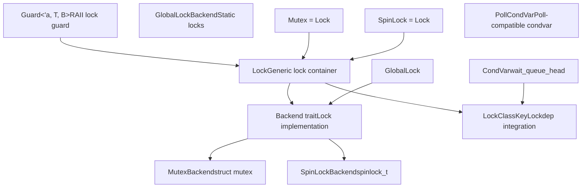
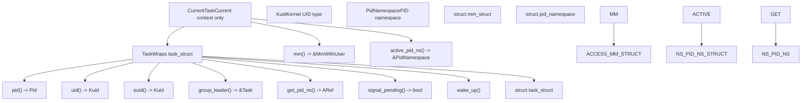
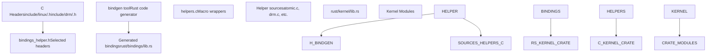
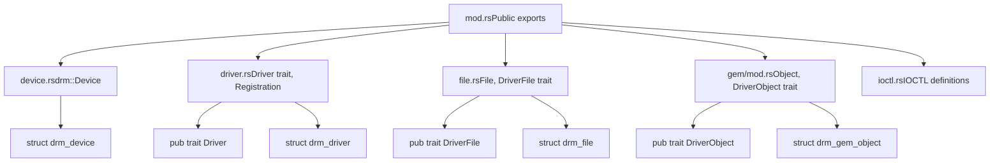

# Rust for Linux

Relevant source files

-   [MAINTAINERS](https://github.com/torvalds/linux/blob/fcb70a56/MAINTAINERS)
-   [drivers/gpu/drm/drm\_panic\_qr.rs](https://github.com/torvalds/linux/blob/fcb70a56/drivers/gpu/drm/drm_panic_qr.rs)
-   [drivers/gpu/drm/nova/Kconfig](https://github.com/torvalds/linux/blob/fcb70a56/drivers/gpu/drm/nova/Kconfig)
-   [drivers/gpu/drm/nova/Makefile](https://github.com/torvalds/linux/blob/fcb70a56/drivers/gpu/drm/nova/Makefile)
-   [drivers/gpu/drm/nova/driver.rs](https://github.com/torvalds/linux/blob/fcb70a56/drivers/gpu/drm/nova/driver.rs)
-   [drivers/gpu/drm/nova/file.rs](https://github.com/torvalds/linux/blob/fcb70a56/drivers/gpu/drm/nova/file.rs)
-   [drivers/gpu/drm/nova/gem.rs](https://github.com/torvalds/linux/blob/fcb70a56/drivers/gpu/drm/nova/gem.rs)
-   [drivers/gpu/drm/nova/nova.rs](https://github.com/torvalds/linux/blob/fcb70a56/drivers/gpu/drm/nova/nova.rs)
-   [include/linux/rwlock\_rt.h](https://github.com/torvalds/linux/blob/fcb70a56/include/linux/rwlock_rt.h)
-   [include/linux/spinlock\_rt.h](https://github.com/torvalds/linux/blob/fcb70a56/include/linux/spinlock_rt.h)
-   [include/uapi/drm/nova\_drm.h](https://github.com/torvalds/linux/blob/fcb70a56/include/uapi/drm/nova_drm.h)
-   [rust/bindings/bindings\_helper.h](https://github.com/torvalds/linux/blob/fcb70a56/rust/bindings/bindings_helper.h)
-   [rust/helpers/barrier.c](https://github.com/torvalds/linux/blob/fcb70a56/rust/helpers/barrier.c)
-   [rust/helpers/bitmap.c](https://github.com/torvalds/linux/blob/fcb70a56/rust/helpers/bitmap.c)
-   [rust/helpers/bitops.c](https://github.com/torvalds/linux/blob/fcb70a56/rust/helpers/bitops.c)
-   [rust/helpers/drm.c](https://github.com/torvalds/linux/blob/fcb70a56/rust/helpers/drm.c)
-   [rust/helpers/helpers.c](https://github.com/torvalds/linux/blob/fcb70a56/rust/helpers/helpers.c)
-   [rust/helpers/mutex.c](https://github.com/torvalds/linux/blob/fcb70a56/rust/helpers/mutex.c)
-   [rust/helpers/pid\_namespace.c](https://github.com/torvalds/linux/blob/fcb70a56/rust/helpers/pid_namespace.c)
-   [rust/helpers/poll.c](https://github.com/torvalds/linux/blob/fcb70a56/rust/helpers/poll.c)
-   [rust/helpers/security.c](https://github.com/torvalds/linux/blob/fcb70a56/rust/helpers/security.c)
-   [rust/helpers/spinlock.c](https://github.com/torvalds/linux/blob/fcb70a56/rust/helpers/spinlock.c)
-   [rust/helpers/sync.c](https://github.com/torvalds/linux/blob/fcb70a56/rust/helpers/sync.c)
-   [rust/helpers/task.c](https://github.com/torvalds/linux/blob/fcb70a56/rust/helpers/task.c)
-   [rust/kernel/block/mq/tag\_set.rs](https://github.com/torvalds/linux/blob/fcb70a56/rust/kernel/block/mq/tag_set.rs)
-   [rust/kernel/cred.rs](https://github.com/torvalds/linux/blob/fcb70a56/rust/kernel/cred.rs)
-   [rust/kernel/drm/device.rs](https://github.com/torvalds/linux/blob/fcb70a56/rust/kernel/drm/device.rs)
-   [rust/kernel/drm/driver.rs](https://github.com/torvalds/linux/blob/fcb70a56/rust/kernel/drm/driver.rs)
-   [rust/kernel/drm/file.rs](https://github.com/torvalds/linux/blob/fcb70a56/rust/kernel/drm/file.rs)
-   [rust/kernel/drm/gem/mod.rs](https://github.com/torvalds/linux/blob/fcb70a56/rust/kernel/drm/gem/mod.rs)
-   [rust/kernel/drm/mod.rs](https://github.com/torvalds/linux/blob/fcb70a56/rust/kernel/drm/mod.rs)
-   [rust/kernel/lib.rs](https://github.com/torvalds/linux/blob/fcb70a56/rust/kernel/lib.rs)
-   [rust/kernel/pid\_namespace.rs](https://github.com/torvalds/linux/blob/fcb70a56/rust/kernel/pid_namespace.rs)
-   [rust/kernel/security.rs](https://github.com/torvalds/linux/blob/fcb70a56/rust/kernel/security.rs)
-   [rust/kernel/sync.rs](https://github.com/torvalds/linux/blob/fcb70a56/rust/kernel/sync.rs)
-   [rust/kernel/sync/barrier.rs](https://github.com/torvalds/linux/blob/fcb70a56/rust/kernel/sync/barrier.rs)
-   [rust/kernel/sync/condvar.rs](https://github.com/torvalds/linux/blob/fcb70a56/rust/kernel/sync/condvar.rs)
-   [rust/kernel/sync/lock.rs](https://github.com/torvalds/linux/blob/fcb70a56/rust/kernel/sync/lock.rs)
-   [rust/kernel/sync/lock/global.rs](https://github.com/torvalds/linux/blob/fcb70a56/rust/kernel/sync/lock/global.rs)
-   [rust/kernel/sync/lock/mutex.rs](https://github.com/torvalds/linux/blob/fcb70a56/rust/kernel/sync/lock/mutex.rs)
-   [rust/kernel/sync/lock/spinlock.rs](https://github.com/torvalds/linux/blob/fcb70a56/rust/kernel/sync/lock/spinlock.rs)
-   [rust/kernel/sync/poll.rs](https://github.com/torvalds/linux/blob/fcb70a56/rust/kernel/sync/poll.rs)
-   [rust/kernel/sync/set\_once.rs](https://github.com/torvalds/linux/blob/fcb70a56/rust/kernel/sync/set_once.rs)
-   [rust/kernel/task.rs](https://github.com/torvalds/linux/blob/fcb70a56/rust/kernel/task.rs)

## Purpose and Scope

This document provides an overview of Rust integration in the Linux kernel, covering the core infrastructure that enables writing kernel code in Rust. It describes the binding generation system, helper functions for C interoperability, and the foundational abstractions provided by the `rust/kernel` crate.

For detailed information about specific Rust kernel APIs and abstractions, see [Rust Kernel APIs and Abstractions](/torvalds/linux/2.1-rust-kernel-apis-and-abstractions). For a concrete example of a Rust driver implementation, see [Nova DRM Graphics Driver](/torvalds/linux/2.2-nova-drm-graphics-driver).

The Rust for Linux project allows kernel modules and drivers to be written in Rust while maintaining full interoperability with the existing C codebase. This provides memory safety guarantees and modern language features while integrating seamlessly with kernel subsystems.

## Architecture Overview

The Rust for Linux infrastructure consists of three main layers: the FFI binding layer that interfaces with C, the core kernel abstractions in `rust/kernel`, and driver implementations built on top of these abstractions.

### Rust-C Integration Architecture

```mermaid
flowchart TD
    NOVA["Nova DRM Driverdrivers/gpu/drm/nova/"]
    DRIVER_IMPL["Driver Implementationdriver.rs, gem.rs, file.rs"]
    KERNEL_LIB["kernel::lib.rsCore crate"]
    DRM_ABS["drm moduledevice, driver, file, gem, ioctl"]
    DEVICE_ABS["device module"]
    ALLOC_ABS["alloc module"]
    SYNC_ABS["sync moduleARef, Arc, Mutex"]
    ERROR_ABS["error moduleResult, Error"]
    BINDINGS["bindingsAuto-generated from C headers"]
    HELPERS["helpers.cC macro wrappers"]
    BINDINGS_HELPER["bindings_helper.hHeader selection"]
    DRM_C["DRM Subsystemdrm_device.h, drm_drv.h"]
    DEVICE_C["Device Modeldevice.h"]
    SLAB_C["Memory Allocatorsslab.h"]

    NOVA --> DRIVER_IMPL
    DRIVER --> IMPL_DRM_ABS
    DRM --> ABS_KERNEL_LIB
    DRIVER --> IMPL_DEVICE_ABS
    DRIVER --> IMPL_ALLOC_ABS
    DRM --> ABS_SYNC_ABS
    DRM --> ABS_ERROR_ABS
    DEVICE --> ABS_BINDINGS
    DRM --> ABS_BINDINGS
    ALLOC --> ABS_BINDINGS
    BINDINGS --> BINDINGS_HELPER
    BINDINGS --> HELPER_DRM_C
    BINDINGS --> HELPER_DEVICE_C
    BINDINGS --> HELPER_SLAB_C
    KERNEL --> LIB_HELPERS
    HELPERS --> DRM_C
    HELPERS --> DEVICE_C
    HELPERS --> SLAB_C
```


**Sources:** [rust/kernel/lib.rs1-357](https://github.com/torvalds/linux/blob/fcb70a56/rust/kernel/lib.rs#L1-L357) [rust/kernel/drm/mod.rs1-20](https://github.com/torvalds/linux/blob/fcb70a56/rust/kernel/drm/mod.rs#L1-L20) [rust/bindings/bindings\_helper.h1-118](https://github.com/torvalds/linux/blob/fcb70a56/rust/bindings/bindings_helper.h#L1-L118) [rust/helpers/helpers.c1-63](https://github.com/torvalds/linux/blob/fcb70a56/rust/helpers/helpers.c#L1-L63) [drivers/gpu/drm/nova/driver.rs1-50](https://github.com/torvalds/linux/blob/fcb70a56/drivers/gpu/drm/nova/driver.rs#L1-L50)

## Core Rust Infrastructure

### The kernel Crate

The `kernel` crate ([rust/kernel/lib.rs1-357](https://github.com/torvalds/linux/blob/fcb70a56/rust/kernel/lib.rs#L1-L357)) serves as the foundation for all Rust code in the kernel. It is a `#![no_std]` crate that provides:

-   **Core traits**: `Module` trait for kernel modules ([rust/kernel/lib.rs156-164](https://github.com/torvalds/linux/blob/fcb70a56/rust/kernel/lib.rs#L156-L164))
-   **Error handling**: `Result` type and kernel error codes ([rust/kernel/lib.rs91](https://github.com/torvalds/linux/blob/fcb70a56/rust/kernel/lib.rs#L91-L91))
-   **Memory management**: Allocator abstractions ([rust/kernel/lib.rs65](https://github.com/torvalds/linux/blob/fcb70a56/rust/kernel/lib.rs#L65-L65))
-   **Synchronization primitives**: `Arc`, `Mutex`, etc. ([rust/kernel/lib.rs135](https://github.com/torvalds/linux/blob/fcb70a56/rust/kernel/lib.rs#L135-L135))
-   **Subsystem abstractions**: DRM, device model, networking, etc.

The crate exposes key modules:

| Module | Purpose | Key Types |
| --- | --- | --- |
| `drm` | DRM subsystem abstractions | `Device`, `Driver`, `File`, `gem::Object` |
| `device` | Device model | `Device` |
| `alloc` | Memory allocation | `KBox`, `VBox` |
| `sync` | Synchronization primitives | `Arc`, `ARef`, `Mutex`, `SpinLock`, `CondVar` |
| `task` | Process/thread management | `Task`, `CurrentTask`, `Kuid`, `Pid` |
| `error` | Error handling | `Error`, `Result` |
| `types` | Fundamental types | `Opaque`, `ARef`, `AlwaysRefCounted` |
| `cred` | Security credentials | `Credential` |
| `security` | Linux Security Modules | `SecurityCtx`, `binder_*` functions |
| `bindings` | Raw FFI bindings | Auto-generated C types |
| `macros` | Procedural macros | `#[pin_data]`, `module!` |

**Sources:** [rust/kernel/lib.rs67-156](https://github.com/torvalds/linux/blob/fcb70a56/rust/kernel/lib.rs#L67-L156) [rust/kernel/sync.rs1-34](https://github.com/torvalds/linux/blob/fcb70a56/rust/kernel/sync.rs#L1-L34) [rust/kernel/task.rs1-96](https://github.com/torvalds/linux/blob/fcb70a56/rust/kernel/task.rs#L1-L96) [rust/kernel/cred.rs1-93](https://github.com/torvalds/linux/blob/fcb70a56/rust/kernel/cred.rs#L1-L93) [rust/kernel/security.rs1-112](https://github.com/torvalds/linux/blob/fcb70a56/rust/kernel/security.rs#L1-L112)

### Module System

Rust kernel modules implement the `Module` trait:

```
pub trait Module: Sized + Sync + Send {
    fn init(module: &'static ThisModule) -> error::Result<Self>;
}
```
The `ThisModule` type ([rust/kernel/lib.rs210-231](https://github.com/torvalds/linux/blob/fcb70a56/rust/kernel/lib.rs#L210-L231)) wraps the C `struct module` pointer and provides safe access to module metadata. The `InPlaceModule` trait ([rust/kernel/lib.rs179-199](https://github.com/torvalds/linux/blob/fcb70a56/rust/kernel/lib.rs#L179-L199)) allows modules to be initialized in-place using the pin-init infrastructure, which is useful for types that cannot be moved after initialization.

**Sources:** [rust/kernel/lib.rs168-199](https://github.com/torvalds/linux/blob/fcb70a56/rust/kernel/lib.rs#L168-L199) [rust/kernel/lib.rs210-231](https://github.com/torvalds/linux/blob/fcb70a56/rust/kernel/lib.rs#L210-L231)

## Synchronization Infrastructure

Rust for Linux provides safe abstractions over kernel synchronization primitives. The design follows a generic backend pattern that allows multiple lock types to share common implementation logic.

### Lock Architecture

Lock Backend Pattern:


**Key abstractions:**

-   **`Lock<T, B>`** ([rust/kernel/sync/lock.rs106-120](https://github.com/torvalds/linux/blob/fcb70a56/rust/kernel/sync/lock.rs#L106-L120)): Generic lock wrapping `B::State` and protected data `T`
-   **`Backend` trait** ([rust/kernel/sync/lock.rs37-98](https://github.com/torvalds/linux/blob/fcb70a56/rust/kernel/sync/lock.rs#L37-L98)): Defines `init()`, `lock()`, `unlock()`, `try_lock()`, `relock()` operations
-   **`Guard<'a, T, B>`** ([rust/kernel/sync/lock.rs198-202](https://github.com/torvalds/linux/blob/fcb70a56/rust/kernel/sync/lock.rs#L198-L202)): RAII guard that automatically unlocks on drop
-   **`LockClassKey`** ([rust/kernel/sync.rs38-96](https://github.com/torvalds/linux/blob/fcb70a56/rust/kernel/sync.rs#L38-L96)): Wrapper around `lock_class_key` for lockdep integration

**Backend implementations:**

-   `MutexBackend` ([rust/kernel/sync/lock/mutex.rs88-119](https://github.com/torvalds/linux/blob/fcb70a56/rust/kernel/sync/lock/mutex.rs#L88-L119)): Wraps `struct mutex`, sleepable lock
-   `SpinLockBackend` ([rust/kernel/sync/lock/spinlock.rs88-120](https://github.com/torvalds/linux/blob/fcb70a56/rust/kernel/sync/lock/spinlock.rs#L88-L120)): Wraps `spinlock_t`, non-sleepable lock
-   `GlobalLockBackend` ([rust/kernel/sync/lock/global.rs22-31](https://github.com/torvalds/linux/blob/fcb70a56/rust/kernel/sync/lock/global.rs#L22-L31)): For statically-allocated locks

**Condition variables:**

-   **`CondVar`** ([rust/kernel/sync/condvar.rs82-92](https://github.com/torvalds/linux/blob/fcb70a56/rust/kernel/sync/condvar.rs#L82-L92)): Wraps `wait_queue_head`, provides `wait()`, `wait_interruptible()`, `notify_one()`, `notify_all()`
-   **`PollCondVar`** ([rust/kernel/sync/poll.rs69-106](https://github.com/torvalds/linux/blob/fcb70a56/rust/kernel/sync/poll.rs#L69-L106)): Condition variable compatible with epoll/poll via `PollTable`

**Sources:** [rust/kernel/sync.rs1-126](https://github.com/torvalds/linux/blob/fcb70a56/rust/kernel/sync.rs#L1-L126) [rust/kernel/sync/lock.rs1-318](https://github.com/torvalds/linux/blob/fcb70a56/rust/kernel/sync/lock.rs#L1-L318) [rust/kernel/sync/lock/mutex.rs1-119](https://github.com/torvalds/linux/blob/fcb70a56/rust/kernel/sync/lock/mutex.rs#L1-L119) [rust/kernel/sync/lock/spinlock.rs1-120](https://github.com/torvalds/linux/blob/fcb70a56/rust/kernel/sync/lock/spinlock.rs#L1-L120) [rust/kernel/sync/lock/global.rs1-228](https://github.com/torvalds/linux/blob/fcb70a56/rust/kernel/sync/lock/global.rs#L1-L228) [rust/kernel/sync/condvar.rs1-259](https://github.com/torvalds/linux/blob/fcb70a56/rust/kernel/sync/condvar.rs#L1-L259) [rust/kernel/sync/poll.rs1-107](https://github.com/torvalds/linux/blob/fcb70a56/rust/kernel/sync/poll.rs#L1-L107)

## Task Abstractions

The kernel provides first-class abstractions for processes and threads through the `task` module.

### Task Types and Operations

Task Type Hierarchy:


**Task** ([rust/kernel/task.rs97](https://github.com/torvalds/linux/blob/fcb70a56/rust/kernel/task.rs#L97-L97)): Represents a thread or process

-   **`Task::current()`** ([rust/kernel/task.rs178-199](https://github.com/torvalds/linux/blob/fcb70a56/rust/kernel/task.rs#L178-L199)): Returns reference to current task (use `current!()` macro)
-   **`pid()`** ([rust/kernel/task.rs220-224](https://github.com/torvalds/linux/blob/fcb70a56/rust/kernel/task.rs#L220-L224)): Get process ID
-   **`uid()`** / **`euid()`** ([rust/kernel/task.rs228-238](https://github.com/torvalds/linux/blob/fcb70a56/rust/kernel/task.rs#L228-L238)): Get user IDs
-   **`group_leader()`** ([rust/kernel/task.rs208-217](https://github.com/torvalds/linux/blob/fcb70a56/rust/kernel/task.rs#L208-L217)): Get thread group leader
-   **`signal_pending()`** ([rust/kernel/task.rs242-245](https://github.com/torvalds/linux/blob/fcb70a56/rust/kernel/task.rs#L242-L245)): Check for pending signals
-   **`get_pid_ns()`** ([rust/kernel/task.rs249-260](https://github.com/torvalds/linux/blob/fcb70a56/rust/kernel/task.rs#L249-L260)): Get PID namespace with refcount
-   **`wake_up()`** ([rust/kernel/task.rs279-283](https://github.com/torvalds/linux/blob/fcb70a56/rust/kernel/task.rs#L279-L283)): Wake a sleeping task

**CurrentTask** ([rust/kernel/task.rs137](https://github.com/torvalds/linux/blob/fcb70a56/rust/kernel/task.rs#L137-L137)): Current task with additional guarantees

-   **`mm()`** ([rust/kernel/task.rs291-315](https://github.com/torvalds/linux/blob/fcb70a56/rust/kernel/task.rs#L291-L315)): Access address space (safe without RCU for current)
-   **`active_pid_ns()`** ([rust/kernel/task.rs324-347](https://github.com/torvalds/linux/blob/fcb70a56/rust/kernel/task.rs#L324-L347)): Access PID namespace (safe without RCU for current)

The `current!()` macro ([rust/kernel/task.rs36-50](https://github.com/torvalds/linux/blob/fcb70a56/rust/kernel/task.rs#L36-L50)) provides safe access to the current task via `Task::current()`.

**Sources:** [rust/kernel/task.rs1-428](https://github.com/torvalds/linux/blob/fcb70a56/rust/kernel/task.rs#L1-L428) [rust/kernel/pid\_namespace.rs1-73](https://github.com/torvalds/linux/blob/fcb70a56/rust/kernel/pid_namespace.rs#L1-L73) [rust/kernel/cred.rs1-93](https://github.com/torvalds/linux/blob/fcb70a56/rust/kernel/cred.rs#L1-L93)

## FFI and Binding Generation

### Binding Generation System


The binding generation process uses [rust/bindings/bindings\_helper.h1-118](https://github.com/torvalds/linux/blob/fcb70a56/rust/bindings/bindings_helper.h#L1-L118) to select which C headers to expose to Rust. This file includes headers for DRM, device model, memory management, and other subsystems.

Key included headers:

-   DRM: `drm/drm_device.h`, `drm/drm_drv.h`, `drm/drm_file.h`, `drm/drm_gem.h` ([rust/bindings/bindings\_helper.h32-36](https://github.com/torvalds/linux/blob/fcb70a56/rust/bindings/bindings_helper.h#L32-L36))
-   Device: `linux/device.h`, `linux/platform_device.h` ([rust/bindings/bindings\_helper.h51-71](https://github.com/torvalds/linux/blob/fcb70a56/rust/bindings/bindings_helper.h#L51-L71))
-   Memory: `linux/slab.h`, `linux/mm.h` ([rust/bindings/bindings\_helper.h65-80](https://github.com/torvalds/linux/blob/fcb70a56/rust/bindings/bindings_helper.h#L65-L80))

**Sources:** [rust/bindings/bindings\_helper.h1-118](https://github.com/torvalds/linux/blob/fcb70a56/rust/bindings/bindings_helper.h#L1-L118)

### Helper Functions

C macros and inline functions cannot be directly called from Rust. The [rust/helpers/helpers.c1-63](https://github.com/torvalds/linux/blob/fcb70a56/rust/helpers/helpers.c#L1-L63) file includes wrapper implementations:

-   `atomic.c`: Atomic operations
-   `drm.c`: DRM-specific helpers
-   `device.c`: Device model helpers
-   `slab.c`: Memory allocation helpers
-   `mutex.c`, `spinlock.c`: Locking primitives

These helpers are linked into the kernel and callable from Rust through `extern "C"` declarations.

**Sources:** [rust/helpers/helpers.c1-63](https://github.com/torvalds/linux/blob/fcb70a56/rust/helpers/helpers.c#L1-L63)

## DRM Subsystem Abstractions

The `rust/kernel/drm` module provides safe Rust abstractions over the DRM subsystem. This serves as a comprehensive example of how C kernel subsystems are wrapped for Rust.

### DRM Module Structure


**Sources:** [rust/kernel/drm/mod.rs1-20](https://github.com/torvalds/linux/blob/fcb70a56/rust/kernel/drm/mod.rs#L1-L20) [rust/kernel/drm/device.rs1-230](https://github.com/torvalds/linux/blob/fcb70a56/rust/kernel/drm/device.rs#L1-L230) [rust/kernel/drm/driver.rs1-171](https://github.com/torvalds/linux/blob/fcb70a56/rust/kernel/drm/driver.rs#L1-L171) [rust/kernel/drm/file.rs1-100](https://github.com/torvalds/linux/blob/fcb70a56/rust/kernel/drm/file.rs#L1-L100) [rust/kernel/drm/gem/mod.rs1-280](https://github.com/torvalds/linux/blob/fcb70a56/rust/kernel/drm/gem/mod.rs#L1-L280)

### Driver Implementation Pattern

Drivers implement the `Driver` trait ([rust/kernel/drm/driver.rs101-116](https://github.com/torvalds/linux/blob/fcb70a56/rust/kernel/drm/driver.rs#L101-L116)):

```
pub trait Driver {
    type Data: Sync + Send;
    type Object: AllocImpl;
    type File: drm::file::DriverFile;
    const INFO: DriverInfo;
    const IOCTLS: &'static [drm::ioctl::DrmIoctlDescriptor];
}
```
The `Device<T>` type ([rust/kernel/drm/device.rs58-61](https://github.com/torvalds/linux/blob/fcb70a56/rust/kernel/drm/device.rs#L58-L61)) represents a DRM device instance:

-   Wraps `bindings::drm_device` in an `Opaque` type
-   Implements `AlwaysRefCounted` for automatic reference counting ([rust/kernel/drm/device.rs201-214](https://github.com/torvalds/linux/blob/fcb70a56/rust/kernel/drm/device.rs#L201-L214))
-   Created via `Device::new()` which calls `drm_dev_alloc` ([rust/kernel/drm/device.rs98-136](https://github.com/torvalds/linux/blob/fcb70a56/rust/kernel/drm/device.rs#L98-L136))

**Sources:** [rust/kernel/drm/driver.rs96-116](https://github.com/torvalds/linux/blob/fcb70a56/rust/kernel/drm/driver.rs#L96-L116) [rust/kernel/drm/device.rs50-189](https://github.com/torvalds/linux/blob/fcb70a56/rust/kernel/drm/device.rs#L50-L189)

### GEM Object Management

The GEM abstraction ([rust/kernel/drm/gem/mod.rs1-280](https://github.com/torvalds/linux/blob/fcb70a56/rust/kernel/drm/gem/mod.rs#L1-L280)) provides memory management for graphics buffers:

**Key traits:**

-   `DriverObject`: Implemented by driver-specific GEM objects ([rust/kernel/drm/gem/mod.rs26-40](https://github.com/torvalds/linux/blob/fcb70a56/rust/kernel/drm/gem/mod.rs#L26-L40))
-   `IntoGEMObject`: Conversion to/from raw `drm_gem_object` pointers ([rust/kernel/drm/gem/mod.rs43-56](https://github.com/torvalds/linux/blob/fcb70a56/rust/kernel/drm/gem/mod.rs#L43-L56))
-   `BaseObject`: Common operations like `size()`, `create_handle()` ([rust/kernel/drm/gem/mod.rs122-183](https://github.com/torvalds/linux/blob/fcb70a56/rust/kernel/drm/gem/mod.rs#L122-L183))

The `Object<T>` type ([rust/kernel/drm/gem/mod.rs192-198](https://github.com/torvalds/linux/blob/fcb70a56/rust/kernel/drm/gem/mod.rs#L192-L198)) embeds `bindings::drm_gem_object` and driver data:

```
#[repr(C)]
pub struct Object<T: DriverObject> {
    obj: Opaque<bindings::drm_gem_object>,
    dev: NonNull<drm::Device<T::Driver>>,
    data: T,
}
```
**Sources:** [rust/kernel/drm/gem/mod.rs1-280](https://github.com/torvalds/linux/blob/fcb70a56/rust/kernel/drm/gem/mod.rs#L1-L280)

## Nova DRM Driver Example

The Nova driver ([drivers/gpu/drm/nova/](https://github.com/torvalds/linux/blob/fcb70a56/drivers/gpu/drm/nova/)) demonstrates a complete Rust DRM driver implementation.

### Nova Driver Architecture

```mermaid
flowchart TD
    NOVA_LIB["lib.rsModule entry point"]
    NOVA_DRIVER["driver.rsNovaDriver, NovaData"]
    NOVA_FILE["file.rsFile"]
    NOVA_GEM["gem.rsNovaObject"]
    IMPL_DRIVER["impl Driver for NovaDriver"]
    IMPL_FILE["impl DriverFile for File"]
    IMPL_OBJ["impl DriverObject for NovaObject"]
    DRM_DRIVER["drm::Driver"]
    DRM_FILE["drm::file::DriverFile"]
    DRM_GEM["drm::gem::DriverObject"]
    DRM_DEVICE["drm::Device<NovaDriver>"]
    REG["Registration<NovaDriver>"]
    MODULE["kernel::Module"]

    NOVA --> LIB_NOVA_DRIVER
    NOVA --> LIB_NOVA_FILE
    NOVA --> LIB_NOVA_GEM
    NOVA --> LIB_REG
    NOVA --> DRIVER_IMPL_DRIVER
    NOVA --> FILE_IMPL_FILE
    NOVA --> GEM_IMPL_OBJ
    IMPL --> DRIVER_DRM_DRIVER
    IMPL --> FILE_DRM_FILE
    IMPL --> OBJ_DRM_GEM
    REG --> DRM_DEVICE
    REG --> MODULE
```


### Driver Structure

**NovaDriver** ([drivers/gpu/drm/nova/driver.rs1-50](https://github.com/torvalds/linux/blob/fcb70a56/drivers/gpu/drm/nova/driver.rs#L1-L50)):

-   Defines `NovaDriver` type implementing `drm::Driver`
-   Specifies `INFO` with driver metadata
-   Provides empty `IOCTLS` array (no custom IOCTLs yet)
-   Associates `File` and `NovaObject` types

**NovaObject** ([drivers/gpu/drm/nova/gem.rs16-48](https://github.com/torvalds/linux/blob/fcb70a56/drivers/gpu/drm/nova/gem.rs#L16-L48)):

-   Implements `gem::DriverObject` for GEM buffer management
-   `new()` creates aligned allocations (page-aligned sizes)
-   `lookup_handle()` finds objects by handle from file

**File** ([drivers/gpu/drm/nova/file.rs1-20](https://github.com/torvalds/linux/blob/fcb70a56/drivers/gpu/drm/nova/file.rs#L1-L20)):

-   Implements `drm::file::DriverFile` for per-client state
-   Currently empty implementation (minimal driver)

**Sources:** [drivers/gpu/drm/nova/driver.rs1-50](https://github.com/torvalds/linux/blob/fcb70a56/drivers/gpu/drm/nova/driver.rs#L1-L50) [drivers/gpu/drm/nova/gem.rs1-48](https://github.com/torvalds/linux/blob/fcb70a56/drivers/gpu/drm/nova/gem.rs#L1-L48) [drivers/gpu/drm/nova/file.rs1-20](https://github.com/torvalds/linux/blob/fcb70a56/drivers/gpu/drm/nova/file.rs#L1-L20)

### Driver Registration Flow

> **[Mermaid sequence]**
> *(图表结构无法解析)*

The registration process:

1.  `Device::new()` allocates `drm_device` via C ([rust/kernel/drm/device.rs98-136](https://github.com/torvalds/linux/blob/fcb70a56/rust/kernel/drm/device.rs#L98-L136))
2.  `Registration::new_foreign_owned()` registers the device ([rust/kernel/drm/driver.rs133-149](https://github.com/torvalds/linux/blob/fcb70a56/rust/kernel/drm/driver.rs#L133-L149))
3.  On drop, `Registration` automatically unregisters ([rust/kernel/drm/driver.rs164-170](https://github.com/torvalds/linux/blob/fcb70a56/rust/kernel/drm/driver.rs#L164-L170))

**Sources:** [rust/kernel/drm/device.rs98-136](https://github.com/torvalds/linux/blob/fcb70a56/rust/kernel/drm/device.rs#L98-L136) [rust/kernel/drm/driver.rs124-170](https://github.com/torvalds/linux/blob/fcb70a56/rust/kernel/drm/driver.rs#L124-L170)

## Memory Safety and Type System

The Rust for Linux infrastructure leverages Rust's type system to enforce kernel safety requirements:

### Safety Invariants

Key types maintain safety invariants through type system guarantees:

| Type | Invariant | Enforcement |
| --- | --- | --- |
| `Device<T>` | Valid `drm_device` pointer | Private field, controlled construction ([rust/kernel/drm/device.rs58-61](https://github.com/torvalds/linux/blob/fcb70a56/rust/kernel/drm/device.rs#L58-L61)) |
| `Task` | Valid `task_struct` pointer | Transparent wrapper, `AlwaysRefCounted` ([rust/kernel/task.rs97](https://github.com/torvalds/linux/blob/fcb70a56/rust/kernel/task.rs#L97-L97) [rust/kernel/task.rs351-363](https://github.com/torvalds/linux/blob/fcb70a56/rust/kernel/task.rs#L351-L363)) |
| `ARef<T>` | Non-zero refcount | `AlwaysRefCounted` trait, auto inc/dec\_ref |
| `Opaque<T>` | Valid C type, no direct Rust access | `UnsafeCell<MaybeUninit<T>>`, pointer access only |
| `Pin<KBox<T>>` | Pinned heap allocation | Pin API prevents moves ([rust/kernel/drm/file.rs18](https://github.com/torvalds/linux/blob/fcb70a56/rust/kernel/drm/file.rs#L18-L18)) |
| `CurrentTask` | Current task context only | `NotThreadSafe` field prevents cross-thread use ([rust/kernel/task.rs137](https://github.com/torvalds/linux/blob/fcb70a56/rust/kernel/task.rs#L137-L137)) |
| `Guard<'a, T, B>` | Lock held for lifetime `'a` | `NotThreadSafe`, drops unlock lock ([rust/kernel/sync/lock.rs198-202](https://github.com/torvalds/linux/blob/fcb70a56/rust/kernel/sync/lock.rs#L198-L202)) |
| `Credential` | Valid `cred` pointer, always refcounted | Transparent wrapper, `AlwaysRefCounted` ([rust/kernel/cred.rs28](https://github.com/torvalds/linux/blob/fcb70a56/rust/kernel/cred.rs#L28-L28) [rust/kernel/cred.rs79-92](https://github.com/torvalds/linux/blob/fcb70a56/rust/kernel/cred.rs#L79-L92)) |

### Reference Counting Integration

The `AlwaysRefCounted` trait integrates Rust's ownership model with C reference counting:

**DRM Device example:**

```
unsafe impl<T: drm::Driver> AlwaysRefCounted for Device<T> {
    fn inc_ref(&self) {
        unsafe { bindings::drm_dev_get(self.as_raw()) };
    }
    unsafe fn dec_ref(obj: NonNull<Self>) {
        unsafe { bindings::drm_dev_put(Self::into_drm_device(obj)) };
    }
}
```
**Task example:**

```
unsafe impl AlwaysRefCounted for Task {
    fn inc_ref(&self) {
        unsafe { bindings::get_task_struct(self.as_ptr()) };
    }
    unsafe fn dec_ref(obj: NonNull<Self>) {
        unsafe { bindings::put_task_struct(obj.cast().as_ptr()) };
    }
}
```
This ensures:

-   `ARef<Device<T>>` / `ARef<Task>` automatically manage refcounts
-   No use-after-free: objects live as long as references exist
-   Drop order is correct even with cyclic references
-   Seamless interop with C subsystems

### Context-Bound Safety

**`CurrentTask`** enforces current-task-only operations through `NotThreadSafe`:

-   Cannot be sent across threads
-   Prevents accessing `current->mm` after context switch
-   Ensures `active_pid_ns()` doesn't need RCU ([rust/kernel/task.rs324-347](https://github.com/torvalds/linux/blob/fcb70a56/rust/kernel/task.rs#L324-L347))

**`Guard<T, B>`** enforces lock ownership through lifetimes:

-   `&mut Guard` proves exclusive access to protected data
-   Drop trait automatically calls `Backend::unlock()`
-   Cannot be sent across threads (lock held on specific CPU)

**Sources:** [rust/kernel/drm/device.rs200-214](https://github.com/torvalds/linux/blob/fcb70a56/rust/kernel/drm/device.rs#L200-L214) [rust/kernel/task.rs351-363](https://github.com/torvalds/linux/blob/fcb70a56/rust/kernel/task.rs#L351-L363) [rust/kernel/cred.rs79-92](https://github.com/torvalds/linux/blob/fcb70a56/rust/kernel/cred.rs#L79-L92) [rust/kernel/sync/lock.rs294-299](https://github.com/torvalds/linux/blob/fcb70a56/rust/kernel/sync/lock.rs#L294-L299) [rust/kernel/task.rs137](https://github.com/torvalds/linux/blob/fcb70a56/rust/kernel/task.rs#L137-L137)

## Build System Integration

The Rust code is integrated into the kernel build system via:

-   Kconfig: `CONFIG_RUST=y` enables Rust support
-   Per-driver Kconfig: [drivers/gpu/drm/nova/Kconfig1-8](https://github.com/torvalds/linux/blob/fcb70a56/drivers/gpu/drm/nova/Kconfig#L1-L8) for Nova
-   Makefile integration: Compiles `.rs` files to `.o` objects
-   Bindgen invocation: Generates bindings during build

The `CONFIG_DRM="y"` requirement ([rust/kernel/lib.rs89](https://github.com/torvalds/linux/blob/fcb70a56/rust/kernel/lib.rs#L89-L89)) ensures DRM core is built-in when using Rust DRM abstractions.

**Sources:** [drivers/gpu/drm/nova/Kconfig1-8](https://github.com/torvalds/linux/blob/fcb70a56/drivers/gpu/drm/nova/Kconfig#L1-L8) [rust/kernel/lib.rs89-90](https://github.com/torvalds/linux/blob/fcb70a56/rust/kernel/lib.rs#L89-L90)
