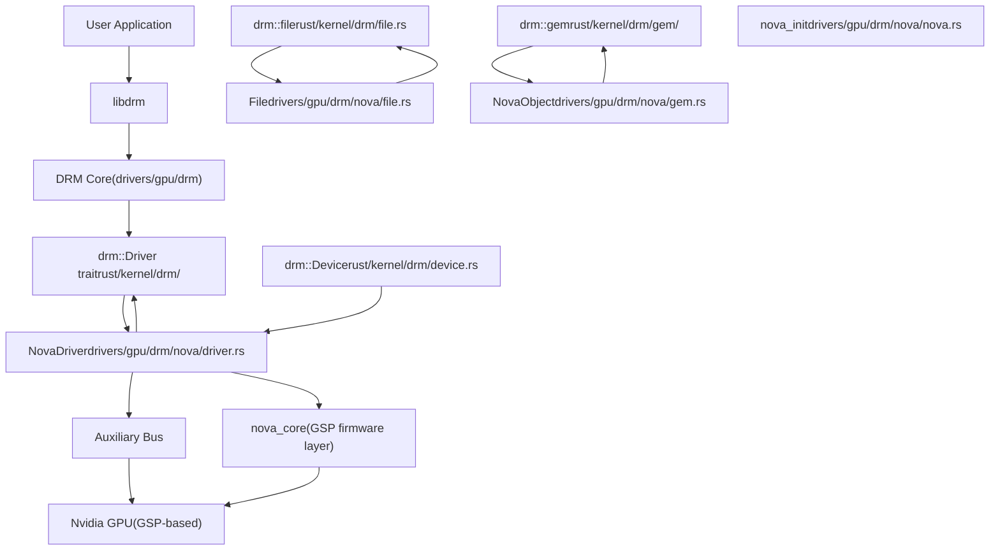
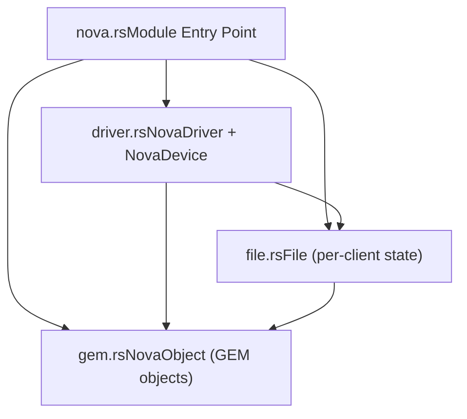
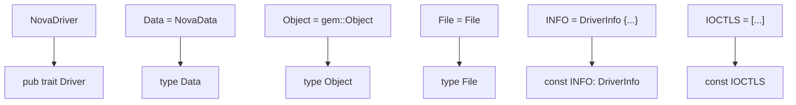
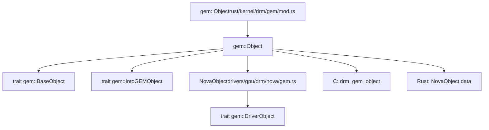
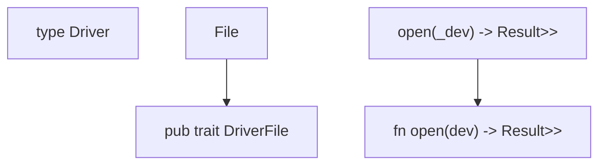
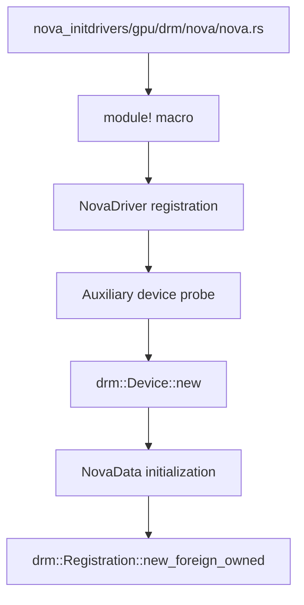
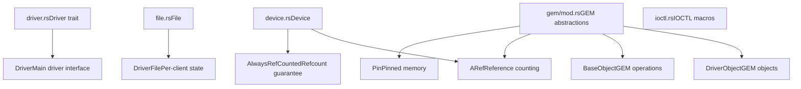
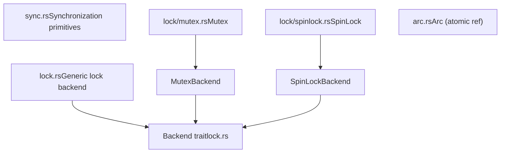
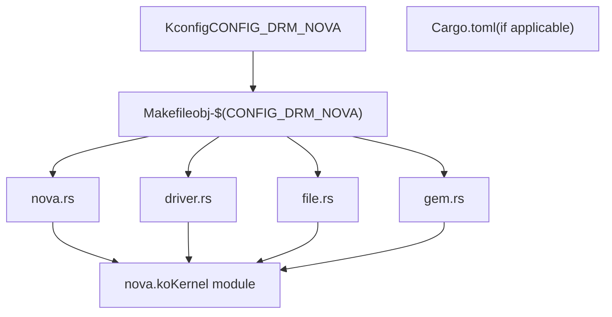

# Nova DRM Graphics Driver

Relevant source files

-   [MAINTAINERS](https://github.com/torvalds/linux/blob/fcb70a56/MAINTAINERS)
-   [drivers/gpu/drm/drm\_panic\_qr.rs](https://github.com/torvalds/linux/blob/fcb70a56/drivers/gpu/drm/drm_panic_qr.rs)
-   [drivers/gpu/drm/nova/Kconfig](https://github.com/torvalds/linux/blob/fcb70a56/drivers/gpu/drm/nova/Kconfig)
-   [drivers/gpu/drm/nova/Makefile](https://github.com/torvalds/linux/blob/fcb70a56/drivers/gpu/drm/nova/Makefile)
-   [drivers/gpu/drm/nova/driver.rs](https://github.com/torvalds/linux/blob/fcb70a56/drivers/gpu/drm/nova/driver.rs)
-   [drivers/gpu/drm/nova/file.rs](https://github.com/torvalds/linux/blob/fcb70a56/drivers/gpu/drm/nova/file.rs)
-   [drivers/gpu/drm/nova/gem.rs](https://github.com/torvalds/linux/blob/fcb70a56/drivers/gpu/drm/nova/gem.rs)
-   [drivers/gpu/drm/nova/nova.rs](https://github.com/torvalds/linux/blob/fcb70a56/drivers/gpu/drm/nova/nova.rs)
-   [include/linux/rwlock\_rt.h](https://github.com/torvalds/linux/blob/fcb70a56/include/linux/rwlock_rt.h)
-   [include/linux/spinlock\_rt.h](https://github.com/torvalds/linux/blob/fcb70a56/include/linux/spinlock_rt.h)
-   [include/uapi/drm/nova\_drm.h](https://github.com/torvalds/linux/blob/fcb70a56/include/uapi/drm/nova_drm.h)
-   [rust/bindings/bindings\_helper.h](https://github.com/torvalds/linux/blob/fcb70a56/rust/bindings/bindings_helper.h)
-   [rust/helpers/barrier.c](https://github.com/torvalds/linux/blob/fcb70a56/rust/helpers/barrier.c)
-   [rust/helpers/bitmap.c](https://github.com/torvalds/linux/blob/fcb70a56/rust/helpers/bitmap.c)
-   [rust/helpers/bitops.c](https://github.com/torvalds/linux/blob/fcb70a56/rust/helpers/bitops.c)
-   [rust/helpers/drm.c](https://github.com/torvalds/linux/blob/fcb70a56/rust/helpers/drm.c)
-   [rust/helpers/helpers.c](https://github.com/torvalds/linux/blob/fcb70a56/rust/helpers/helpers.c)
-   [rust/helpers/mutex.c](https://github.com/torvalds/linux/blob/fcb70a56/rust/helpers/mutex.c)
-   [rust/helpers/pid\_namespace.c](https://github.com/torvalds/linux/blob/fcb70a56/rust/helpers/pid_namespace.c)
-   [rust/helpers/poll.c](https://github.com/torvalds/linux/blob/fcb70a56/rust/helpers/poll.c)
-   [rust/helpers/security.c](https://github.com/torvalds/linux/blob/fcb70a56/rust/helpers/security.c)
-   [rust/helpers/spinlock.c](https://github.com/torvalds/linux/blob/fcb70a56/rust/helpers/spinlock.c)
-   [rust/helpers/sync.c](https://github.com/torvalds/linux/blob/fcb70a56/rust/helpers/sync.c)
-   [rust/helpers/task.c](https://github.com/torvalds/linux/blob/fcb70a56/rust/helpers/task.c)
-   [rust/kernel/block/mq/tag\_set.rs](https://github.com/torvalds/linux/blob/fcb70a56/rust/kernel/block/mq/tag_set.rs)
-   [rust/kernel/cred.rs](https://github.com/torvalds/linux/blob/fcb70a56/rust/kernel/cred.rs)
-   [rust/kernel/drm/device.rs](https://github.com/torvalds/linux/blob/fcb70a56/rust/kernel/drm/device.rs)
-   [rust/kernel/drm/driver.rs](https://github.com/torvalds/linux/blob/fcb70a56/rust/kernel/drm/driver.rs)
-   [rust/kernel/drm/file.rs](https://github.com/torvalds/linux/blob/fcb70a56/rust/kernel/drm/file.rs)
-   [rust/kernel/drm/gem/mod.rs](https://github.com/torvalds/linux/blob/fcb70a56/rust/kernel/drm/gem/mod.rs)
-   [rust/kernel/drm/mod.rs](https://github.com/torvalds/linux/blob/fcb70a56/rust/kernel/drm/mod.rs)
-   [rust/kernel/lib.rs](https://github.com/torvalds/linux/blob/fcb70a56/rust/kernel/lib.rs)
-   [rust/kernel/pid\_namespace.rs](https://github.com/torvalds/linux/blob/fcb70a56/rust/kernel/pid_namespace.rs)
-   [rust/kernel/security.rs](https://github.com/torvalds/linux/blob/fcb70a56/rust/kernel/security.rs)
-   [rust/kernel/sync.rs](https://github.com/torvalds/linux/blob/fcb70a56/rust/kernel/sync.rs)
-   [rust/kernel/sync/barrier.rs](https://github.com/torvalds/linux/blob/fcb70a56/rust/kernel/sync/barrier.rs)
-   [rust/kernel/sync/condvar.rs](https://github.com/torvalds/linux/blob/fcb70a56/rust/kernel/sync/condvar.rs)
-   [rust/kernel/sync/lock.rs](https://github.com/torvalds/linux/blob/fcb70a56/rust/kernel/sync/lock.rs)
-   [rust/kernel/sync/lock/global.rs](https://github.com/torvalds/linux/blob/fcb70a56/rust/kernel/sync/lock/global.rs)
-   [rust/kernel/sync/lock/mutex.rs](https://github.com/torvalds/linux/blob/fcb70a56/rust/kernel/sync/lock/mutex.rs)
-   [rust/kernel/sync/lock/spinlock.rs](https://github.com/torvalds/linux/blob/fcb70a56/rust/kernel/sync/lock/spinlock.rs)
-   [rust/kernel/sync/poll.rs](https://github.com/torvalds/linux/blob/fcb70a56/rust/kernel/sync/poll.rs)
-   [rust/kernel/sync/set\_once.rs](https://github.com/torvalds/linux/blob/fcb70a56/rust/kernel/sync/set_once.rs)
-   [rust/kernel/task.rs](https://github.com/torvalds/linux/blob/fcb70a56/rust/kernel/task.rs)

## Purpose and Scope

The Nova DRM Graphics Driver is a Rust-based Direct Rendering Manager (DRM) driver for Nvidia GSP (GPU System Processor)-based GPUs. This document covers the driver's architecture, core components, memory management, and integration with the Linux DRM subsystem. The driver is currently work-in-progress and may not be fully functional.

For general information about Rust integration in the Linux kernel, see [Rust for Linux](/torvalds/linux/2-rust-for-linux). For details about DRM core abstractions used by Nova, see the Rust kernel APIs documentation at [Rust Kernel APIs and Abstractions](/torvalds/linux/2.1-rust-kernel-apis-and-abstractions).

## Architecture Overview

Nova is implemented as a DRM driver that leverages the Rust DRM abstractions in the kernel. It sits within the GPU/Display subsystem and interfaces with user space through standard DRM IOCTLs.

Sources: [drivers/gpu/drm/nova/Kconfig1-17](https://github.com/torvalds/linux/blob/fcb70a56/drivers/gpu/drm/nova/Kconfig#L1-L17) [drivers/gpu/drm/nova/nova.rs1-9](https://github.com/torvalds/linux/blob/fcb70a56/drivers/gpu/drm/nova/nova.rs#L1-L9) [rust/kernel/drm/mod.rs1-20](https://github.com/torvalds/linux/blob/fcb70a56/rust/kernel/drm/mod.rs#L1-L20)

The Nova driver architecture follows the standard DRM driver model but implemented in Rust:

1.  **DRM Core** provides the infrastructure for GPU drivers
2.  **Rust DRM Abstractions** wrap C DRM APIs in safe Rust interfaces
3.  **Nova Driver** implements these abstractions for Nvidia GSP-based GPUs
4.  **Auxiliary Bus** and **Nova Core** handle communication with the GPU firmware

## Driver Structure

The Nova driver is organized into four main Rust modules:

Sources: [drivers/gpu/drm/nova/nova.rs1-9](https://github.com/torvalds/linux/blob/fcb70a56/drivers/gpu/drm/nova/nova.rs#L1-L9) [drivers/gpu/drm/nova/Makefile1-4](https://github.com/torvalds/linux/blob/fcb70a56/drivers/gpu/drm/nova/Makefile#L1-L4)

### NovaDriver Implementation

The `NovaDriver` struct implements the `drm::Driver` trait, which is the primary interface for DRM drivers in Rust.

**Key Components:**

| Component | Type | Purpose |
| --- | --- | --- |
| `NovaDriver` | `struct` | Main driver implementation |
| `NovaDevice` | Type alias for `drm::Device<NovaDriver>` | Device instance |
| `File` | `struct` | Per-client file state |
| `NovaObject` | `struct` | GEM object implementation |

Sources: [drivers/gpu/drm/nova/driver.rs1-68](https://github.com/torvalds/linux/blob/fcb70a56/drivers/gpu/drm/nova/driver.rs#L1-L68)

### Driver Trait Implementation

The `NovaDriver` implements the required `drm::Driver` trait:

Sources: [rust/kernel/drm/driver.rs96-116](https://github.com/torvalds/linux/blob/fcb70a56/rust/kernel/drm/driver.rs#L96-L116) [drivers/gpu/drm/nova/driver.rs13-46](https://github.com/torvalds/linux/blob/fcb70a56/drivers/gpu/drm/nova/driver.rs#L13-L46)

The `NovaData` struct holds the driver's device-specific data:

-   `adev`: Reference to the auxiliary device
-   Device information retrieved during initialization

Sources: [drivers/gpu/drm/nova/driver.rs15-22](https://github.com/torvalds/linux/blob/fcb70a56/drivers/gpu/drm/nova/driver.rs#L15-L22)

## Memory Management: GEM Objects

Nova uses the DRM Graphics Execution Manager (GEM) API for GPU memory management. The implementation is in [drivers/gpu/drm/nova/gem.rs1-48](https://github.com/torvalds/linux/blob/fcb70a56/drivers/gpu/drm/nova/gem.rs#L1-L48)

### NovaObject Structure

Sources: [drivers/gpu/drm/nova/gem.rs1-48](https://github.com/torvalds/linux/blob/fcb70a56/drivers/gpu/drm/nova/gem.rs#L1-L48) [rust/kernel/drm/gem/mod.rs1-316](https://github.com/torvalds/linux/blob/fcb70a56/rust/kernel/drm/gem/mod.rs#L1-L316)

### GEM Object Operations

The `NovaObject` struct implements `gem::DriverObject` which requires:

**Required Methods:**

| Method | Signature | Purpose |
| --- | --- | --- |
| `new()` | `fn new(dev: &NovaDevice, size: usize) -> impl PinInit<Self, Error>` | Create new GEM object |

**Additional Operations:**

Nova provides wrapper methods for common GEM operations:

-   `NovaObject::new()` - Creates a new GEM object with page-aligned size
-   `NovaObject::lookup_handle()` - Looks up a GEM object by its handle for a given file

Sources: [drivers/gpu/drm/nova/gem.rs19-47](https://github.com/torvalds/linux/blob/fcb70a56/drivers/gpu/drm/nova/gem.rs#L19-L47) [rust/kernel/drm/gem/mod.rs26-40](https://github.com/torvalds/linux/blob/fcb70a56/rust/kernel/drm/gem/mod.rs#L26-L40)

### Memory Allocation Flow

> **[Mermaid sequence]**
> *(图表结构无法解析)*

Sources: [drivers/gpu/drm/nova/file.rs45-55](https://github.com/torvalds/linux/blob/fcb70a56/drivers/gpu/drm/nova/file.rs#L45-L55) [drivers/gpu/drm/nova/gem.rs29-37](https://github.com/torvalds/linux/blob/fcb70a56/drivers/gpu/drm/nova/gem.rs#L29-L37) [rust/kernel/drm/gem/mod.rs198-221](https://github.com/torvalds/linux/blob/fcb70a56/rust/kernel/drm/gem/mod.rs#L198-L221)

## File Operations and IOCTLs

The Nova driver exposes several IOCTLs for user space interaction. These are handled by the `File` struct in [drivers/gpu/drm/nova/file.rs1-70](https://github.com/torvalds/linux/blob/fcb70a56/drivers/gpu/drm/nova/file.rs#L1-L70)

### File Structure

The `File` struct represents per-client state. It implements the `drm::file::DriverFile` trait:

**Implementation:**

Sources: [drivers/gpu/drm/nova/file.rs13-21](https://github.com/torvalds/linux/blob/fcb70a56/drivers/gpu/drm/nova/file.rs#L13-L21) [rust/kernel/drm/file.rs1-133](https://github.com/torvalds/linux/blob/fcb70a56/rust/kernel/drm/file.rs#L1-L133)

### IOCTL Operations

Nova implements three primary IOCTLs:

**IOCTL Summary:**

| IOCTL | Handler | Purpose | UAPI Struct |
| --- | --- | --- | --- |
| `DRM_IOCTL_NOVA_GETPARAM` | `File::get_param()` | Query GPU/driver metadata | `drm_nova_getparam` |
| `DRM_IOCTL_NOVA_GEM_CREATE` | `File::gem_create()` | Create new GEM object | `drm_nova_gem_create` |
| `DRM_IOCTL_NOVA_GEM_INFO` | `File::gem_info()` | Query GEM object metadata | `drm_nova_gem_info` |

Sources: [drivers/gpu/drm/nova/file.rs24-69](https://github.com/torvalds/linux/blob/fcb70a56/drivers/gpu/drm/nova/file.rs#L24-L69) [include/uapi/drm/nova\_drm.h1-81](https://github.com/torvalds/linux/blob/fcb70a56/include/uapi/drm/nova_drm.h#L1-L81)

### IOCTL Implementation Flow

> **[Mermaid sequence]**
> *(图表结构无法解析)*

Sources: [drivers/gpu/drm/nova/file.rs24-69](https://github.com/torvalds/linux/blob/fcb70a56/drivers/gpu/drm/nova/file.rs#L24-L69) [rust/kernel/drm/ioctl.rs1-138](https://github.com/torvalds/linux/blob/fcb70a56/rust/kernel/drm/ioctl.rs#L1-L138)

### GETPARAM Implementation

The `get_param()` method queries device parameters:

**Supported Parameters:**

| Parameter | Value Source | Description |
| --- | --- | --- |
| `NOVA_GETPARAM_VRAM_BAR_SIZE` | `pdev.resource_len(1)` | Size of VRAM BAR (PCI resource 1) |

Sources: [drivers/gpu/drm/nova/file.rs25-42](https://github.com/torvalds/linux/blob/fcb70a56/drivers/gpu/drm/nova/file.rs#L25-L42) [include/uapi/drm/nova\_drm.h10-23](https://github.com/torvalds/linux/blob/fcb70a56/include/uapi/drm/nova_drm.h#L10-L23)

## Initialization and Registration

The Nova driver initialization follows the standard kernel module initialization pattern with DRM registration.

### Module Entry Point

Sources: [drivers/gpu/drm/nova/nova.rs1-9](https://github.com/torvalds/linux/blob/fcb70a56/drivers/gpu/drm/nova/nova.rs#L1-L9) [drivers/gpu/drm/nova/driver.rs48-68](https://github.com/torvalds/linux/blob/fcb70a56/drivers/gpu/drm/nova/driver.rs#L48-L68)

### Device Creation Flow

The driver creates a `drm::Device` instance during probe:

**Steps:**

1.  **Probe callback** receives auxiliary device
2.  **NovaData initialization** wraps device reference
3.  **drm::Device::new()** allocates device structure
4.  **Registration** registers with DRM subsystem via `drm::Registration::new_foreign_owned()`

Sources: [drivers/gpu/drm/nova/driver.rs48-68](https://github.com/torvalds/linux/blob/fcb70a56/drivers/gpu/drm/nova/driver.rs#L48-L68) [rust/kernel/drm/device.rs98-136](https://github.com/torvalds/linux/blob/fcb70a56/rust/kernel/drm/device.rs#L98-L136) [rust/kernel/drm/driver.rs124-149](https://github.com/torvalds/linux/blob/fcb70a56/rust/kernel/drm/driver.rs#L124-L149)

### Driver Information

The driver provides metadata through the `INFO` constant:

**DriverInfo Fields:**

| Field | Value | Purpose |
| --- | --- | --- |
| `major` | 0 | Major version |
| `minor` | 0 | Minor version |
| `patchlevel` | 0 | Patch level |
| `name` | `c"nova"` | Driver name |
| `desc` | `c"NVIDIA Nova"` | Description |

Sources: [drivers/gpu/drm/nova/driver.rs32-38](https://github.com/torvalds/linux/blob/fcb70a56/drivers/gpu/drm/nova/driver.rs#L32-L38) [rust/kernel/drm/driver.rs18-30](https://github.com/torvalds/linux/blob/fcb70a56/rust/kernel/drm/driver.rs#L18-L30)

## Rust DRM Abstractions

Nova leverages the Rust DRM abstractions provided by the kernel. These abstractions ensure memory safety and provide idiomatic Rust interfaces to the C DRM subsystem.

### Core Abstractions

Sources: [rust/kernel/drm/mod.rs1-20](https://github.com/torvalds/linux/blob/fcb70a56/rust/kernel/drm/mod.rs#L1-L20) [rust/kernel/drm/driver.rs1-171](https://github.com/torvalds/linux/blob/fcb70a56/rust/kernel/drm/driver.rs#L1-L171) [rust/kernel/drm/gem/mod.rs1-316](https://github.com/torvalds/linux/blob/fcb70a56/rust/kernel/drm/gem/mod.rs#L1-L316)

### Type Safety Features

The Rust abstractions provide several safety guarantees:

**Safety Guarantees:**

| Feature | Implementation | Benefit |
| --- | --- | --- |
| Reference counting | `ARef<T>` with `AlwaysRefCounted` | Prevents use-after-free |
| Pinning | `Pin<T>` for self-referential structs | Prevents memory corruption |
| Type state | Compile-time file/object associations | Prevents type confusion |
| Lifetime tracking | Rust borrow checker | Ensures valid references |

Sources: [rust/kernel/sync/aref.rs1-437](https://github.com/torvalds/linux/blob/fcb70a56/rust/kernel/sync/aref.rs#L1-L437) [rust/kernel/drm/device.rs50-230](https://github.com/torvalds/linux/blob/fcb70a56/rust/kernel/drm/device.rs#L50-L230) [rust/kernel/drm/gem/mod.rs42-56](https://github.com/torvalds/linux/blob/fcb70a56/rust/kernel/drm/gem/mod.rs#L42-L56)

### Synchronization Primitives

Nova uses Rust synchronization primitives for thread safety:

Sources: [rust/kernel/sync/mod.rs1-126](https://github.com/torvalds/linux/blob/fcb70a56/rust/kernel/sync/mod.rs#L1-L126) [rust/kernel/sync/lock.rs1-318](https://github.com/torvalds/linux/blob/fcb70a56/rust/kernel/sync/lock.rs#L1-L318) [rust/kernel/sync/lock/mutex.rs1-186](https://github.com/torvalds/linux/blob/fcb70a56/rust/kernel/sync/lock/mutex.rs#L1-L186) [rust/kernel/sync/lock/spinlock.rs1-131](https://github.com/torvalds/linux/blob/fcb70a56/rust/kernel/sync/lock/spinlock.rs#L1-L131)

### Device Lifecycle

The `drm::Device<T>` manages device lifecycle with automatic cleanup:

**Lifecycle Events:**

1.  **Creation** - `drm::Device::new()` allocates device
2.  **Registration** - `drm::Registration::new_foreign_owned()` registers with DRM
3.  **Reference counting** - `ARef<drm::Device<T>>` tracks references
4.  **Cleanup** - Drop implementation releases resources
5.  **Deregistration** - `Registration` drop unregisters device

Sources: [rust/kernel/drm/device.rs98-189](https://github.com/torvalds/linux/blob/fcb70a56/rust/kernel/drm/device.rs#L98-L189) [rust/kernel/drm/driver.rs119-170](https://github.com/torvalds/linux/blob/fcb70a56/rust/kernel/drm/driver.rs#L119-L170)

## Configuration and Build System

### Kconfig Integration

Nova requires specific kernel configurations:

**Required Options:**

| Option | Requirement | Reason |
| --- | --- | --- |
| `CONFIG_64BIT` | Required | 64-bit architecture |
| `CONFIG_DRM=y` | Built-in | DRM must be built-in for Rust |
| `CONFIG_PCI` | Required | PCI device support |
| `CONFIG_RUST` | Required | Rust support |
| `CONFIG_AUXILIARY_BUS` | Selected | Auxiliary bus framework |
| `CONFIG_NOVA_CORE` | Selected | Nova core firmware layer |

Sources: [drivers/gpu/drm/nova/Kconfig1-17](https://github.com/torvalds/linux/blob/fcb70a56/drivers/gpu/drm/nova/Kconfig#L1-L17)

### Build Configuration

The driver is built as a kernel module:

Sources: [drivers/gpu/drm/nova/Kconfig1-17](https://github.com/torvalds/linux/blob/fcb70a56/drivers/gpu/drm/nova/Kconfig#L1-L17) [drivers/gpu/drm/nova/Makefile1-4](https://github.com/torvalds/linux/blob/fcb70a56/drivers/gpu/drm/nova/Makefile#L1-L4)

The module name is `nova` and can be loaded with `modprobe nova` if built as a module (`CONFIG_DRM_NOVA=m`).
