# KVM ARM64 Virtualization

Relevant source files

-   [arch/arm64/include/asm/esr.h](https://github.com/torvalds/linux/blob/fcb70a56/arch/arm64/include/asm/esr.h)
-   [arch/arm64/include/asm/kvm\_arm.h](https://github.com/torvalds/linux/blob/fcb70a56/arch/arm64/include/asm/kvm_arm.h)
-   [arch/arm64/include/asm/kvm\_asm.h](https://github.com/torvalds/linux/blob/fcb70a56/arch/arm64/include/asm/kvm_asm.h)
-   [arch/arm64/include/asm/kvm\_emulate.h](https://github.com/torvalds/linux/blob/fcb70a56/arch/arm64/include/asm/kvm_emulate.h)
-   [arch/arm64/include/asm/kvm\_host.h](https://github.com/torvalds/linux/blob/fcb70a56/arch/arm64/include/asm/kvm_host.h)
-   [arch/arm64/include/asm/kvm\_mmu.h](https://github.com/torvalds/linux/blob/fcb70a56/arch/arm64/include/asm/kvm_mmu.h)
-   [arch/arm64/include/asm/kvm\_nested.h](https://github.com/torvalds/linux/blob/fcb70a56/arch/arm64/include/asm/kvm_nested.h)
-   [arch/arm64/include/asm/kvm\_pgtable.h](https://github.com/torvalds/linux/blob/fcb70a56/arch/arm64/include/asm/kvm_pgtable.h)
-   [arch/arm64/include/asm/kvm\_pkvm.h](https://github.com/torvalds/linux/blob/fcb70a56/arch/arm64/include/asm/kvm_pkvm.h)
-   [arch/arm64/include/asm/memory.h](https://github.com/torvalds/linux/blob/fcb70a56/arch/arm64/include/asm/memory.h)
-   [arch/arm64/include/asm/por.h](https://github.com/torvalds/linux/blob/fcb70a56/arch/arm64/include/asm/por.h)
-   [arch/arm64/include/asm/stacktrace/nvhe.h](https://github.com/torvalds/linux/blob/fcb70a56/arch/arm64/include/asm/stacktrace/nvhe.h)
-   [arch/arm64/include/asm/sysreg.h](https://github.com/torvalds/linux/blob/fcb70a56/arch/arm64/include/asm/sysreg.h)
-   [arch/arm64/kvm/Makefile](https://github.com/torvalds/linux/blob/fcb70a56/arch/arm64/kvm/Makefile)
-   [arch/arm64/kvm/arch\_timer.c](https://github.com/torvalds/linux/blob/fcb70a56/arch/arm64/kvm/arch_timer.c)
-   [arch/arm64/kvm/arm.c](https://github.com/torvalds/linux/blob/fcb70a56/arch/arm64/kvm/arm.c)
-   [arch/arm64/kvm/at.c](https://github.com/torvalds/linux/blob/fcb70a56/arch/arm64/kvm/at.c)
-   [arch/arm64/kvm/config.c](https://github.com/torvalds/linux/blob/fcb70a56/arch/arm64/kvm/config.c)
-   [arch/arm64/kvm/debug.c](https://github.com/torvalds/linux/blob/fcb70a56/arch/arm64/kvm/debug.c)
-   [arch/arm64/kvm/emulate-nested.c](https://github.com/torvalds/linux/blob/fcb70a56/arch/arm64/kvm/emulate-nested.c)
-   [arch/arm64/kvm/fpsimd.c](https://github.com/torvalds/linux/blob/fcb70a56/arch/arm64/kvm/fpsimd.c)
-   [arch/arm64/kvm/guest.c](https://github.com/torvalds/linux/blob/fcb70a56/arch/arm64/kvm/guest.c)
-   [arch/arm64/kvm/handle\_exit.c](https://github.com/torvalds/linux/blob/fcb70a56/arch/arm64/kvm/handle_exit.c)
-   [arch/arm64/kvm/hyp/entry.S](https://github.com/torvalds/linux/blob/fcb70a56/arch/arm64/kvm/hyp/entry.S)
-   [arch/arm64/kvm/hyp/exception.c](https://github.com/torvalds/linux/blob/fcb70a56/arch/arm64/kvm/hyp/exception.c)
-   [arch/arm64/kvm/hyp/include/hyp/debug-sr.h](https://github.com/torvalds/linux/blob/fcb70a56/arch/arm64/kvm/hyp/include/hyp/debug-sr.h)
-   [arch/arm64/kvm/hyp/include/hyp/fault.h](https://github.com/torvalds/linux/blob/fcb70a56/arch/arm64/kvm/hyp/include/hyp/fault.h)
-   [arch/arm64/kvm/hyp/include/hyp/switch.h](https://github.com/torvalds/linux/blob/fcb70a56/arch/arm64/kvm/hyp/include/hyp/switch.h)
-   [arch/arm64/kvm/hyp/include/hyp/sysreg-sr.h](https://github.com/torvalds/linux/blob/fcb70a56/arch/arm64/kvm/hyp/include/hyp/sysreg-sr.h)
-   [arch/arm64/kvm/hyp/include/nvhe/gfp.h](https://github.com/torvalds/linux/blob/fcb70a56/arch/arm64/kvm/hyp/include/nvhe/gfp.h)
-   [arch/arm64/kvm/hyp/include/nvhe/mem\_protect.h](https://github.com/torvalds/linux/blob/fcb70a56/arch/arm64/kvm/hyp/include/nvhe/mem_protect.h)
-   [arch/arm64/kvm/hyp/include/nvhe/memory.h](https://github.com/torvalds/linux/blob/fcb70a56/arch/arm64/kvm/hyp/include/nvhe/memory.h)
-   [arch/arm64/kvm/hyp/include/nvhe/mm.h](https://github.com/torvalds/linux/blob/fcb70a56/arch/arm64/kvm/hyp/include/nvhe/mm.h)
-   [arch/arm64/kvm/hyp/include/nvhe/pkvm.h](https://github.com/torvalds/linux/blob/fcb70a56/arch/arm64/kvm/hyp/include/nvhe/pkvm.h)
-   [arch/arm64/kvm/hyp/nvhe/debug-sr.c](https://github.com/torvalds/linux/blob/fcb70a56/arch/arm64/kvm/hyp/nvhe/debug-sr.c)
-   [arch/arm64/kvm/hyp/nvhe/hyp-main.c](https://github.com/torvalds/linux/blob/fcb70a56/arch/arm64/kvm/hyp/nvhe/hyp-main.c)
-   [arch/arm64/kvm/hyp/nvhe/mem\_protect.c](https://github.com/torvalds/linux/blob/fcb70a56/arch/arm64/kvm/hyp/nvhe/mem_protect.c)
-   [arch/arm64/kvm/hyp/nvhe/mm.c](https://github.com/torvalds/linux/blob/fcb70a56/arch/arm64/kvm/hyp/nvhe/mm.c)
-   [arch/arm64/kvm/hyp/nvhe/page\_alloc.c](https://github.com/torvalds/linux/blob/fcb70a56/arch/arm64/kvm/hyp/nvhe/page_alloc.c)
-   [arch/arm64/kvm/hyp/nvhe/pkvm.c](https://github.com/torvalds/linux/blob/fcb70a56/arch/arm64/kvm/hyp/nvhe/pkvm.c)
-   [arch/arm64/kvm/hyp/nvhe/setup.c](https://github.com/torvalds/linux/blob/fcb70a56/arch/arm64/kvm/hyp/nvhe/setup.c)
-   [arch/arm64/kvm/hyp/nvhe/stacktrace.c](https://github.com/torvalds/linux/blob/fcb70a56/arch/arm64/kvm/hyp/nvhe/stacktrace.c)
-   [arch/arm64/kvm/hyp/nvhe/switch.c](https://github.com/torvalds/linux/blob/fcb70a56/arch/arm64/kvm/hyp/nvhe/switch.c)
-   [arch/arm64/kvm/hyp/nvhe/sys\_regs.c](https://github.com/torvalds/linux/blob/fcb70a56/arch/arm64/kvm/hyp/nvhe/sys_regs.c)
-   [arch/arm64/kvm/hyp/nvhe/sysreg-sr.c](https://github.com/torvalds/linux/blob/fcb70a56/arch/arm64/kvm/hyp/nvhe/sysreg-sr.c)
-   [arch/arm64/kvm/hyp/nvhe/timer-sr.c](https://github.com/torvalds/linux/blob/fcb70a56/arch/arm64/kvm/hyp/nvhe/timer-sr.c)
-   [arch/arm64/kvm/hyp/pgtable.c](https://github.com/torvalds/linux/blob/fcb70a56/arch/arm64/kvm/hyp/pgtable.c)
-   [arch/arm64/kvm/hyp/vhe/debug-sr.c](https://github.com/torvalds/linux/blob/fcb70a56/arch/arm64/kvm/hyp/vhe/debug-sr.c)
-   [arch/arm64/kvm/hyp/vhe/switch.c](https://github.com/torvalds/linux/blob/fcb70a56/arch/arm64/kvm/hyp/vhe/switch.c)
-   [arch/arm64/kvm/hyp/vhe/sysreg-sr.c](https://github.com/torvalds/linux/blob/fcb70a56/arch/arm64/kvm/hyp/vhe/sysreg-sr.c)
-   [arch/arm64/kvm/inject\_fault.c](https://github.com/torvalds/linux/blob/fcb70a56/arch/arm64/kvm/inject_fault.c)
-   [arch/arm64/kvm/mmu.c](https://github.com/torvalds/linux/blob/fcb70a56/arch/arm64/kvm/mmu.c)
-   [arch/arm64/kvm/nested.c](https://github.com/torvalds/linux/blob/fcb70a56/arch/arm64/kvm/nested.c)
-   [arch/arm64/kvm/pkvm.c](https://github.com/torvalds/linux/blob/fcb70a56/arch/arm64/kvm/pkvm.c)
-   [arch/arm64/kvm/pmu-emul.c](https://github.com/torvalds/linux/blob/fcb70a56/arch/arm64/kvm/pmu-emul.c)
-   [arch/arm64/kvm/reset.c](https://github.com/torvalds/linux/blob/fcb70a56/arch/arm64/kvm/reset.c)
-   [arch/arm64/kvm/stacktrace.c](https://github.com/torvalds/linux/blob/fcb70a56/arch/arm64/kvm/stacktrace.c)
-   [arch/arm64/kvm/sys\_regs.c](https://github.com/torvalds/linux/blob/fcb70a56/arch/arm64/kvm/sys_regs.c)
-   [arch/arm64/kvm/sys\_regs.h](https://github.com/torvalds/linux/blob/fcb70a56/arch/arm64/kvm/sys_regs.h)
-   [arch/arm64/kvm/va\_layout.c](https://github.com/torvalds/linux/blob/fcb70a56/arch/arm64/kvm/va_layout.c)
-   [arch/arm64/kvm/vgic/vgic-v5.c](https://github.com/torvalds/linux/blob/fcb70a56/arch/arm64/kvm/vgic/vgic-v5.c)
-   [arch/arm64/tools/sysreg](https://github.com/torvalds/linux/blob/fcb70a56/arch/arm64/tools/sysreg)
-   [include/kvm/arm\_arch\_timer.h](https://github.com/torvalds/linux/blob/fcb70a56/include/kvm/arm_arch_timer.h)
-   [include/kvm/arm\_pmu.h](https://github.com/torvalds/linux/blob/fcb70a56/include/kvm/arm_pmu.h)
-   [tools/arch/arm64/include/asm/sysreg.h](https://github.com/torvalds/linux/blob/fcb70a56/tools/arch/arm64/include/asm/sysreg.h)
-   [tools/include/linux/kasan-tags.h](https://github.com/torvalds/linux/blob/fcb70a56/tools/include/linux/kasan-tags.h)

## Purpose and Scope

This document describes the ARM64-specific implementation of KVM (Kernel-based Virtual Machine) virtualization. It covers system register emulation, nested virtualization support, protected KVM (pKVM), Stage 2 memory management, and ARM64-specific virtualization features. For x86 virtualization, see [KVM x86 Virtualization](/torvalds/linux/3.1-kvm-x86-virtualization). For the generic KVM core, see [Virtualization and Hardware Isolation](/torvalds/linux/3-virtualization-(kvm)).

## Hardware Architecture Overview

ARM64 virtualization relies on hardware extensions that provide privilege separation and memory isolation. The architecture defines Exception Levels (ELs) where EL0 is unprivileged user space, EL1 is kernel space, and EL2 is the hypervisor level.

### Execution Modes

```mermaid
flowchart TD
    L1_HYP["L1 Hypervisor(vEL2)"]
    L0["KVM L0(EL2)"]
    L2_GUEST["L2 Guest(vEL1)"]
    HOST_VHE["Host Linux + KVM(EL2)"]
    GUEST_VHE_EL1["Guest Kernel(EL1)"]
    GUEST_VHE_EL0["Guest User(EL0)"]
    HOST_EL1["Host Linux(EL1)"]
    HOST_EL2["KVM Hypervisor(EL2)"]
    GUEST_EL1["Guest Kernel(EL1)"]
    GUEST_EL0["Guest User(EL0)"]

    L0 --> L1_HYP
    L1 --> HYP_L2_GUEST
    HOST --> VHE_GUEST_VHE_EL1
    GUEST --> VHE_EL1_GUEST_VHE_EL0
    HOST --> EL2_HOST_EL1
    HOST --> EL2_GUEST_EL1
    GUEST --> EL1_GUEST_EL0
```
**VHE (Virtualization Host Extensions)**: When enabled, the host kernel runs at EL2, eliminating the need for separate EL1/EL2 context switches. This is indicated by `HCR_EL2.E2H=1`.

**NVHE (Non-VHE)**: Traditional mode where the host runs at EL1 and KVM hypervisor code runs at EL2.

Sources: [arch/arm64/include/asm/kvm\_host.h1-100](https://github.com/torvalds/linux/blob/fcb70a56/arch/arm64/include/asm/kvm_host.h#L1-L100) [arch/arm64/kvm/arm.c1-100](https://github.com/torvalds/linux/blob/fcb70a56/arch/arm64/kvm/arm.c#L1-L100)

### Key ARM64 Virtualization Capabilities

| Feature | Description | Code Support |
| --- | --- | --- |
| **HCR\_EL2** | Hypervisor Configuration Register - controls VM behavior | [arch/arm64/kvm/arm.c1100-1200](https://github.com/torvalds/linux/blob/fcb70a56/arch/arm64/kvm/arm.c#L1100-L1200) |
| **VHE** | Virtualization Host Extensions - host runs at EL2 | Detected via `has_vhe()` |
| **Stage 2 Translation** | Second-level address translation (IPA→PA) | [arch/arm64/kvm/mmu.c1-100](https://github.com/torvalds/linux/blob/fcb70a56/arch/arm64/kvm/mmu.c#L1-L100) |
| **Nested Virtualization** | NV/NV2 for running hypervisors in VMs | [arch/arm64/kvm/nested.c1-100](https://github.com/torvalds/linux/blob/fcb70a56/arch/arm64/kvm/nested.c#L1-L100) |
| **pKVM** | Protected KVM with memory isolation | [arch/arm64/kvm/pkvm.c1-100](https://github.com/torvalds/linux/blob/fcb70a56/arch/arm64/kvm/pkvm.c#L1-L100) |

Sources: [arch/arm64/include/asm/kvm\_host.h1-100](https://github.com/torvalds/linux/blob/fcb70a56/arch/arm64/include/asm/kvm_host.h#L1-L100) [arch/arm64/kvm/arm.c1-100](https://github.com/torvalds/linux/blob/fcb70a56/arch/arm64/kvm/arm.c#L1-L100)

## Core Data Structures

### VM and vCPU Architecture

```mermaid
flowchart TD
    kvm["struct kvm"]
    kvm_arch["struct kvm_arch"]
    kvm_s2_mmu["struct kvm_s2_mmuStage 2 MMU"]
    nested_mmus["nested_mmus[]Shadow S2 MMUs"]
    kvm_vcpu["struct kvm_vcpu"]
    kvm_vcpu_arch["struct kvm_vcpu_arch"]
    kvm_cpu_context["struct kvm_cpu_contextsys_regs[NR_SYS_REGS]"]
    hw_mmu["hw_mmuActive S2 MMU"]
    vncr_array["vncr_arrayNested register state"]

    kvm --> kvm_arch
    kvm --> arch_kvm_s2_mmu
    kvm --> arch_nested_mmus
    kvm --> vcpu_kvm_vcpu_arch
    kvm --> vcpu_arch_kvm_cpu_context
    kvm --> vcpu_arch_hw_mmu
    kvm --> vcpu_arch_vncr_array
    hw --> mmu_kvm_s2_mmu
    hw --> mmu_nested_mmus
```
**`struct kvm_arch`**: VM-wide ARM64-specific state including the primary Stage 2 MMU (`mmu`), nested MMUs array for nested virtualization, and emulated ID registers.

**`struct kvm_vcpu_arch`**: Per-vCPU state including system registers (`ctxt.sys_regs`), trap configuration (`hcr_el2`, `mdcr_el2`), and pointer to active Stage 2 MMU (`hw_mmu`).

**`struct kvm_cpu_context`**: Holds architectural state including general-purpose registers, system registers array, and FP/SIMD state.

**`struct kvm_s2_mmu`**: Represents a Stage 2 MMU context with page table base (`pgd_phys`), VMID, and configuration (`vtcr`).

Sources: [arch/arm64/include/asm/kvm\_host.h294-408](https://github.com/torvalds/linux/blob/fcb70a56/arch/arm64/include/asm/kvm_host.h#L294-L408) [arch/arm64/include/asm/kvm\_host.h152-230](https://github.com/torvalds/linux/blob/fcb70a56/arch/arm64/include/asm/kvm_host.h#L152-L230) [arch/arm64/include/asm/kvm\_host.h664-680](https://github.com/torvalds/linux/blob/fcb70a56/arch/arm64/include/asm/kvm_host.h#L664-L680) [arch/arm64/include/asm/kvm\_host.h794-896](https://github.com/torvalds/linux/blob/fcb70a56/arch/arm64/include/asm/kvm_host.h#L794-L896)

### System Register State Management

```mermaid
flowchart TD
    MEMORY["SR_LOC_MEMORYIn sys_regs[] array"]
    LOADED["SR_LOC_LOADEDOn physical CPU"]
    MAPPED["SR_LOC_MAPPEDEL2→EL1 mapping"]
    XLATED["SR_LOC_XLATEDNeeds translation"]
    vcpu_read["vcpu_read_sys_reg()"]
    vcpu_write["vcpu_write_sys_reg()"]
    locate_register["locate_register()"]
    read_sr_from_cpu["read_sr_from_cpu()"]
    write_sr_to_cpu["write_sr_to_cpu()"]

    vcpu --> read_locate_register
    vcpu --> write_locate_register
    locate --> register_MEMORY
    locate --> register_LOADED
    locate --> register_MAPPED
    locate --> register_XLATED
    LOADED --> read_sr_from_cpu
    LOADED --> write_sr_to_cpu
```
The system register state can reside in different locations depending on context:

-   **`SR_LOC_MEMORY`**: Register stored in `sys_regs[]` array in memory
-   **`SR_LOC_LOADED`**: Register currently loaded on physical CPU
-   **`SR_LOC_MAPPED`**: EL2 register mapped to EL1 equivalent (VHE mode)
-   **`SR_LOC_XLATED`**: Register needs format translation between EL1/EL2

The `locate_register()` function determines where a register currently resides based on whether the vCPU is loaded and if VHE is active.

Sources: [arch/arm64/kvm/sys\_regs.c85-216](https://github.com/torvalds/linux/blob/fcb70a56/arch/arm64/kvm/sys_regs.c#L85-L216) [arch/arm64/kvm/sys\_regs.c218-292](https://github.com/torvalds/linux/blob/fcb70a56/arch/arm64/kvm/sys_regs.c#L218-L292) [arch/arm64/kvm/sys\_regs.c294-392](https://github.com/torvalds/linux/blob/fcb70a56/arch/arm64/kvm/sys_regs.c#L294-L392)

## System Register Emulation

System register emulation handles guest accesses to privileged ARM64 system registers via the trap-and-emulate mechanism. The implementation is in `arch/arm64/kvm/sys_regs.c`.

### Register Trap and Emulation Flow

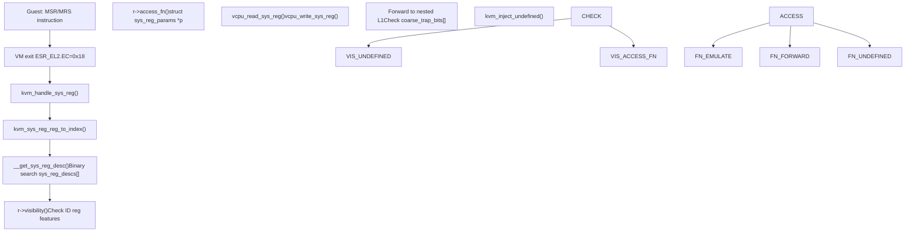
**Trap Entry**: Exception Syndrome Register (`ESR_EL2`) contains:

-   `EC=0x18`: System register trap
-   `Op0, Op1, CRn, CRm, Op2`: Register encoding
-   `Rt`: Destination register
-   Direction bit indicates read vs write

**`struct sys_reg_desc`**: Descriptor for each system register at [arch/arm64/kvm/sys\_regs.c50-84](https://github.com/torvalds/linux/blob/fcb70a56/arch/arm64/kvm/sys_regs.c#L50-L84):

```
struct sys_reg_desc {
    enum vcpu_sysreg reg;                    // Index into sys_regs[]
    bool (*access_fn)(...);                  // Trap handler
    unsigned int (*visibility)(...);         // Feature-based visibility
    u64 (*reset)(struct kvm_vcpu *, ...);   // Reset function
    u64 val;                                 // Reset value
};
```
**Access Function Behaviors**:

-   `access_rw()` [arch/arm64/kvm/sys\_regs.c487-497](https://github.com/torvalds/linux/blob/fcb70a56/arch/arm64/kvm/sys_regs.c#L487-L497): Read/write via `vcpu_read_sys_reg()`/`vcpu_write_sys_reg()`
-   `trap_raz_wi()` [arch/arm64/kvm/sys\_regs.c684-692](https://github.com/torvalds/linux/blob/fcb70a56/arch/arm64/kvm/sys_regs.c#L684-L692): Read-as-zero, writes ignored
-   `access_vm_reg()` [arch/arm64/kvm/sys\_regs.c556-579](https://github.com/torvalds/linux/blob/fcb70a56/arch/arm64/kvm/sys_regs.c#L556-L579): VM registers with `kvm_toggle_cache()` on write
-   `access_gic_sgi()` [arch/arm64/kvm/sys\_regs.c602-648](https://github.com/torvalds/linux/blob/fcb70a56/arch/arm64/kvm/sys_regs.c#L602-L648): Forward to `vgic_v3_dispatch_sgi()`

Sources: [arch/arm64/kvm/sys\_regs.c1-100](https://github.com/torvalds/linux/blob/fcb70a56/arch/arm64/kvm/sys_regs.c#L1-L100) [arch/arm64/kvm/sys\_regs.c487-692](https://github.com/torvalds/linux/blob/fcb70a56/arch/arm64/kvm/sys_regs.c#L487-L692)

### Important Register Classes

```mermaid
flowchart TD
    DBGBVR["DBGBVRn_EL1Breakpoint Value"]
    DBGBCR["DBGBCRn_EL1Breakpoint Control"]
    MDSCR["MDSCR_EL1Monitor Debug"]
    ICC_SGI1R["ICC_SGI1R_EL1Software Generated Interrupt"]
    ICC_SRE["ICC_SRE_EL1System Register Enable"]
    PMCR["PMCR_EL0PMU Control"]
    PMEVCNTR["PMEVCNTRn_EL0Event Counters"]
    PMCCNTR["PMCCNTR_EL0Cycle Counter"]
    ID_AA64PFR0["ID_AA64PFR0_EL1Processor Features"]
    ID_AA64MMFR0["ID_AA64MMFR0_EL1Memory Model Features"]
    MIDR["MIDR_EL1CPU Identification"]
    SCTLR["SCTLR_EL1System Control"]
    TCR["TCR_EL1Translation Control"]
    TTBR["TTBR0/1_EL1Page Table Base"]
```
**Configuration Registers**: Control MMU, caching, and system behavior. Many are trapped when `HCR_EL2.TVM` is set to allow KVM to track guest page table configuration.

**ID Registers**: Provide feature discovery. KVM virtualizes these to expose a consistent feature set across the VM, potentially hiding host features or advertising emulated features.

**PMU Registers**: Performance monitoring counters. KVM creates host perf events to back guest PMU counters, allowing accurate performance measurement in guests.

**GIC Registers**: Interrupt controller access. SGI generation is trapped and forwarded to the VGIC for emulation.

Sources: [arch/arm64/kvm/sys\_regs.c100-145](https://github.com/torvalds/linux/blob/fcb70a56/arch/arm64/kvm/sys_regs.c#L100-L145) [arch/arm64/kvm/sys\_regs.c602-667](https://github.com/torvalds/linux/blob/fcb70a56/arch/arm64/kvm/sys_regs.c#L602-L667) [arch/arm64/kvm/pmu-emul.c1-100](https://github.com/torvalds/linux/blob/fcb70a56/arch/arm64/kvm/pmu-emul.c#L1-L100)

### Register Access Optimization (VHE)

With VHE (`HCR_EL2.E2H=1`), EL1 registers are accessed via EL12 aliases to avoid save/restore. The `locate_register()` function [arch/arm64/kvm/sys\_regs.c175-216](https://github.com/torvalds/linux/blob/fcb70a56/arch/arm64/kvm/sys_regs.c#L175-L216) determines register location using `enum sr_loc_attr`:

**Register Location States** (`enum sr_loc_attr` at [arch/arm64/kvm/sys\_regs.c85-91](https://github.com/torvalds/linux/blob/fcb70a56/arch/arm64/kvm/sys_regs.c#L85-L91)):

-   `SR_LOC_MEMORY (0x0)`: In `ctxt.sys_regs[]` array
-   `SR_LOC_LOADED (0x1)`: On physical CPU
-   `SR_LOC_MAPPED (0x2)`: EL2 reg mapped to EL1 (e.g., `SCTLR_EL2` → `SCTLR_EL1`)
-   `SR_LOC_XLATED (0x4)`: Needs format translation (e.g., `translate_sctlr_el2_to_sctlr_el1()`)
-   `SR_LOC_SPECIAL (0x8)`: Special handling (e.g., `CNTHCTL_EL2`)

**EL12 Alias Mapping** (VHE mode, non-nested):

| EL1 Register | Physical Register | Translation Function |
| --- | --- | --- |
| `SCTLR_EL1` | `SYS_SCTLR_EL12` | None |
| `TCR_EL1` | `SYS_TCR_EL12` | None |
| `TTBR0_EL1` | `SYS_TTBR0_EL12` | None |
| `SCTLR_EL2` | `SYS_SCTLR_EL12` (when mapped) | `translate_sctlr_el2_to_sctlr_el1()` |

**Read/Write Functions**:

-   `vcpu_read_sys_reg()` [arch/arm64/kvm/sys\_regs.c294-339](https://github.com/torvalds/linux/blob/fcb70a56/arch/arm64/kvm/sys_regs.c#L294-L339): Checks `SR_LOC_LOADED`, calls `read_sr_from_cpu()` if on CPU
-   `vcpu_write_sys_reg()` [arch/arm64/kvm/sys\_regs.c341-392](https://github.com/torvalds/linux/blob/fcb70a56/arch/arm64/kvm/sys_regs.c#L341-L392): Checks `SR_LOC_LOADED`, calls `write_sr_to_cpu()` if on CPU
-   `read_sr_from_cpu()` [arch/arm64/kvm/sys\_regs.c218-256](https://github.com/torvalds/linux/blob/fcb70a56/arch/arm64/kvm/sys_regs.c#L218-L256): Reads from `SYS_*_EL12` aliases
-   `write_sr_to_cpu()` [arch/arm64/kvm/sys\_regs.c258-292](https://github.com/torvalds/linux/blob/fcb70a56/arch/arm64/kvm/sys_regs.c#L258-L292): Writes to `SYS_*_EL12` aliases

Sources: [arch/arm64/kvm/sys\_regs.c85-392](https://github.com/torvalds/linux/blob/fcb70a56/arch/arm64/kvm/sys_regs.c#L85-L392)

## Nested Virtualization

ARM64 KVM supports nested virtualization, allowing a guest to run its own hypervisor (L1) and nested guests (L2). This is implemented using ARMv8.4-NV (Nested Virtualization) and ARMv8.3-NV extensions.

### Nested Virtualization Architecture

```mermaid
flowchart TD
    L0_KVM["KVM Hypervisor(EL2)"]
    HOST_MMU["Host S2 MMU"]
    NESTED_MMUS["nested_mmus[]Shadow S2 contexts"]
    L1_VIRT["L1 Guest Hypervisor(vEL2)"]
    L1_S2["L1's S2 Page Tables(VTTBR_EL2)"]
    VNCR["VNCR_EL2Virtual nested control regs"]
    L2_GUEST["L2 Guest(vEL1)"]
    L2_S1["L2 S1 Page Tables"]
    SHADOW_S2["Shadow S2 MMUkvm_s2_mmu"]
    SHADOW_PT["Shadow Page TablesComposite of L1 S2"]

    L0 --> KVM_HOST_MMU
    L0 --> KVM_NESTED_MMUS
    L0 --> KVM_L1_VIRT
    L1 --> VIRT_L1_S2
    L1 --> VIRT_VNCR
    L1 --> VIRT_L2_GUEST
    L2 --> GUEST_L2_S1
    NESTED --> MMUS_SHADOW_S2
    SHADOW --> S2_SHADOW_PT
    L1 --> S2_SHADOW_PT
```
**L0 (Host KVM)**: Runs at EL2 and manages all virtualization. Maintains shadow S2 contexts for nested guests.

**L1 (Guest Hypervisor)**: Runs at vEL2 (virtual EL2) in the context of a VM. Configures its own S2 page tables via `VTTBR_EL2`.

**L2 (Nested Guest)**: Runs at vEL1 under L1's control. Its memory accesses go through both L2's S1 (controlled by L2) and the shadow S2 (controlled by L0).

**Shadow S2 MMU**: KVM L0 maintains shadow S2 page tables by walking L1's S2 page tables and translating intermediate physical addresses (IPAs) used by L1.

Sources: [arch/arm64/kvm/nested.c1-52](https://github.com/torvalds/linux/blob/fcb70a56/arch/arm64/kvm/nested.c#L1-L52) [arch/arm64/kvm/nested.c612-659](https://github.com/torvalds/linux/blob/fcb70a56/arch/arm64/kvm/nested.c#L612-L659)

### Shadow Stage 2 MMU Management

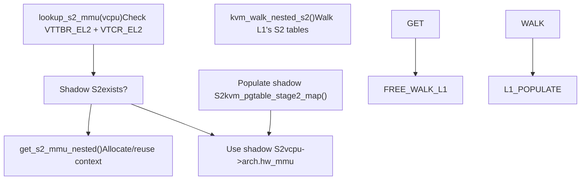
**Context Allocation**: Each VM has an array of `nested_mmus` (sized as `num_vcpus * S2_MMU_PER_VCPU`). When a vCPU runs with L1 S2 enabled, KVM searches for a matching shadow context or allocates a new one.

**Context Matching**: A shadow S2 MMU is matched by:

-   `VTTBR_EL2` value (VMID + base address)
-   `VTCR_EL2` configuration
-   `HCR_EL2.VM` state (S2 enabled/disabled)

**Page Table Walking**: `kvm_walk_nested_s2()` performs a software walk of L1's S2 page tables to translate an L2 GPA to L1 IPA, then to host PA.

**Shadow Population**: On L2 page faults, KVM walks L1's S2, translates the resulting L1 IPA through the host S2, and populates the shadow S2 with the final PA.

Sources: [arch/arm64/kvm/nested.c612-728](https://github.com/torvalds/linux/blob/fcb70a56/arch/arm64/kvm/nested.c#L612-L728) [arch/arm64/kvm/nested.c209-380](https://github.com/torvalds/linux/blob/fcb70a56/arch/arm64/kvm/nested.c#L209-L380) [arch/arm64/kvm/nested.c661-720](https://github.com/torvalds/linux/blob/fcb70a56/arch/arm64/kvm/nested.c#L661-L720)

### Nested S2 Page Table Walk

Function `walk_nested_s2_pgd()` [arch/arm64/kvm/nested.c244-374](https://github.com/torvalds/linux/blob/fcb70a56/arch/arm64/kvm/nested.c#L244-L374) implements ARMv8 Stage 2 translation:

```mermaid
flowchart TD
    START["walk_nested_s2_pgd()phys_addr_t ipa"]
    PARSE["vtcr_to_walk_info()struct s2_walk_info wi"]
    CALC_BASE["wi.baddr = VTTBR_EL2 & masklevel = 3 - wi.sl"]
    LOOP_START["level loop"]
    CALC_INDEX["index = ipa bits[va_top:va_bottom] >> 3"]
    READ_DESC["read_guest_s2_desc()kvm_read_guest()"]
    CHECK_VALID["desc & KVM_PTE_VALID"]
    CHECK_TYPE["desc & KVM_PTE_TYPEBLOCK or TABLE?"]
    CHECK_AF["desc & KVM_PTE_LEAF_ATTR_LO_S2_AF"]
    TRANSLATE["out->pa = desc_to_oa()out->readable/writable from S2AP"]
    FAULT["out->esr = compute_fsc(level, FSC)"]
    NEXT_LEVEL["baddr = desc_to_oa()level++"]
    RETURN_OK["return 0"]
    RETURN_FAULT["return 1"]

    START --> PARSE
    PARSE --> CALC_BASE
    CALC --> BASE_LOOP_START
    LOOP --> START_CALC_INDEX
    CALC --> INDEX_READ_DESC
    READ --> DESC_CHECK_VALID
    CHECK --> VALID_FAULT
    CHECK --> VALID_CHECK_TYPE
    CHECK --> TYPE_NEXT_LEVEL
    CHECK --> TYPE_CHECK_AF
    CHECK --> AF_FAULT
    CHECK --> AF_TRANSLATE
    NEXT --> LEVEL_LOOP_START
    TRANSLATE --> RETURN_OK
    FAULT --> RETURN_FAULT
```
**`struct s2_walk_info`** [arch/arm64/kvm/nested.c126-134](https://github.com/torvalds/linux/blob/fcb70a56/arch/arm64/kvm/nested.c#L126-L134):

```
struct s2_walk_info {
    u64 baddr;              // Base address from VTTBR_EL2
    unsigned int max_oa_bits; // Output address size
    unsigned int pgshift;   // Page shift (12/14/16)
    unsigned int sl;        // Starting level
    unsigned int t0sz;      // VTCR_EL2.T0SZ
    bool be;                // Big-endian
    bool ha;                // Hardware Access flag update
};
```
**`struct kvm_s2_trans`** (output) [arch/arm64/include/asm/kvm\_nested.h70-80](https://github.com/torvalds/linux/blob/fcb70a56/arch/arm64/include/asm/kvm_nested.h#L70-L80):

```
struct kvm_s2_trans {
    phys_addr_t output;     // Translated PA
    unsigned long block_size;
    bool readable, writable;
    int level;              // Page table level
    u64 desc;               // Final descriptor
    u64 esr;                // Fault syndrome if failed
};
```
**Descriptor Processing**:

-   `desc_to_oa()` [arch/arm64/kvm/at.c59-80](https://github.com/torvalds/linux/blob/fcb70a56/arch/arm64/kvm/at.c#L59-L80): Extracts output address handling 52-bit PA
-   `check_output_size()` [arch/arm64/kvm/nested.c191-199](https://github.com/torvalds/linux/blob/fcb70a56/arch/arm64/kvm/nested.c#L191-L199): Validates against `wi->max_oa_bits`
-   `swap_guest_s2_desc()` [arch/arm64/kvm/nested.c223-235](https://github.com/torvalds/linux/blob/fcb70a56/arch/arm64/kvm/nested.c#L223-L235): Updates descriptor for hardware AF

Sources: [arch/arm64/kvm/nested.c126-374](https://github.com/torvalds/linux/blob/fcb70a56/arch/arm64/kvm/nested.c#L126-L374) [arch/arm64/kvm/at.c59-80](https://github.com/torvalds/linux/blob/fcb70a56/arch/arm64/kvm/at.c#L59-L80) [arch/arm64/include/asm/kvm\_nested.h70-80](https://github.com/torvalds/linux/blob/fcb70a56/arch/arm64/include/asm/kvm_nested.h#L70-L80)

### VNCR (Virtual Nested Control Registers)

NV2 extension allows L1's EL2 system registers to be stored in a memory page, eliminating most trap overhead:

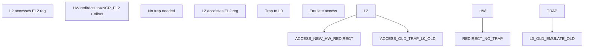
**VNCR Array**: Each vCPU has a `vncr_array` (4KB page) where NV2-capable registers are stored. The hardware automatically redirects EL2 register accesses to this memory.

**Register Mapping**: The `VNCR()` macro in the `vcpu_sysreg` enum defines which registers are VNCR-capable and their offsets.

**TLB Management**: KVM maintains a `vncr_tlb` structure tracking the virtual-to-physical translation of the VNCR page, invalidating it on memory changes.

Sources: [arch/arm64/include/asm/kvm\_host.h417-433](https://github.com/torvalds/linux/blob/fcb70a56/arch/arm64/include/asm/kvm_host.h#L417-L433) [arch/arm64/include/asm/kvm\_host.h532-622](https://github.com/torvalds/linux/blob/fcb70a56/arch/arm64/include/asm/kvm_host.h#L532-L622) [arch/arm64/kvm/nested.c813-858](https://github.com/torvalds/linux/blob/fcb70a56/arch/arm64/kvm/nested.c#L813-L858)

### Address Translation (AT) Instruction Emulation

AT instructions perform address translation and are trapped when issued by L1 hypervisors:

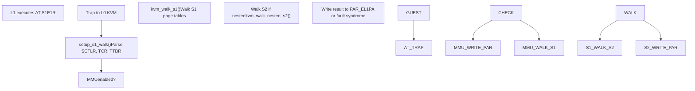
**Translation Regimes**: The system supports multiple translation regimes:

-   `TR_EL10`: EL1&0 translation regime
-   `TR_EL2`: EL2 translation regime
-   `TR_EL20`: EL2&0 translation regime (VHE)

**AT Instruction Support**: KVM emulates various AT instructions:

-   `AT S1E0R/W`: EL0 translation (read/write)
-   `AT S1E1R/W`: EL1 translation
-   `AT S1E2R/W`: EL2 translation (nested context)

**Complex Features**: The implementation handles advanced features like:

-   52-bit physical addressing (LPA/LPA2)
-   Permission indirection (PIE, POE)
-   Hierarchical permission disables (HPD)

Sources: [arch/arm64/kvm/at.c1-80](https://github.com/torvalds/linux/blob/fcb70a56/arch/arm64/kvm/at.c#L1-L80) [arch/arm64/kvm/at.c82-137](https://github.com/torvalds/linux/blob/fcb70a56/arch/arm64/kvm/at.c#L82-L137) [arch/arm64/kvm/at.c138-400](https://github.com/torvalds/linux/blob/fcb70a56/arch/arm64/kvm/at.c#L138-L400)

## Protected KVM (pKVM)

pKVM provides strong isolation for confidential VMs by leveraging EL2 to protect guest memory from the host kernel.

### pKVM Architecture

```mermaid
flowchart TD
    PKVM_HYP["pKVM Hypervisor(Always resident at EL2)"]
    HOST_S2["Host Stage 2 MMU(Restricts host access)"]
    GUEST_S2["Guest Stage 2 MMU(Protects guest memory)"]
    HOST_KERNEL["Host Linux Kernel(Untrusted)"]
    KVM_MODULE["KVM Module(Untrusted)"]
    PROTECTED_VM["Protected VM(Isolated from host)"]
    GUEST_MEMORY["Guest Memory(Host cannot access)"]
    OWNED_BY_HOST["Pages owned by host"]
    OWNED_BY_GUEST["Pages donated to guest(Irrevocable)"]
    OWNED_BY_HYP["Pages owned by hypervisor"]

    HOST --> KERNEL_KVM_MODULE
    KVM --> MODULE_PKVM_HYP
    PKVM --> HYP_HOST_S2
    PKVM --> HYP_GUEST_S2
    HOST --> S2_HOST_KERNEL
    GUEST --> S2_PROTECTED_VM
    PROTECTED --> VM_GUEST_MEMORY
    GUEST --> MEMORY_OWNED_BY_GUEST
```
**Host Stage 2**: In pKVM, the host Linux kernel runs behind a Stage 2 MMU controlled by the EL2 hypervisor. This restricts the host's view of physical memory, preventing it from accessing guest pages.

**Guest Protection**: Guest memory pages are donated to the guest and marked as inaccessible to the host. The EL2 hypervisor enforces these restrictions.

**Hypercall Interface**: The host KVM module communicates with the pKVM hypervisor via hypercalls for VM lifecycle operations.

Sources: [arch/arm64/kvm/hyp/nvhe/mem\_protect.c1-52](https://github.com/torvalds/linux/blob/fcb70a56/arch/arm64/kvm/hyp/nvhe/mem_protect.c#L1-L52) [arch/arm64/kvm/pkvm.c1-50](https://github.com/torvalds/linux/blob/fcb70a56/arch/arm64/kvm/pkvm.c#L1-L50)

### pKVM Memory Ownership

Page ownership state machine implemented in `arch/arm64/kvm/hyp/nvhe/mem_protect.c`:

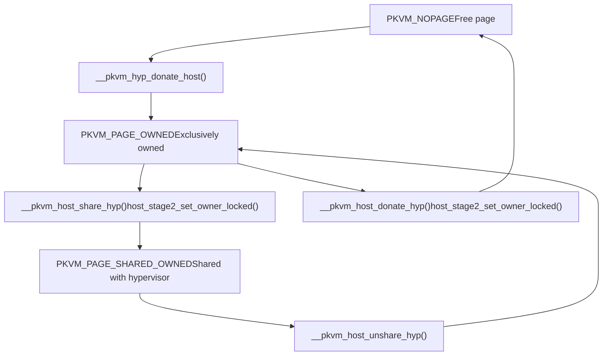
**`struct hyp_page`** per-page metadata [arch/arm64/kvm/hyp/include/nvhe/memory.h1-50](https://github.com/torvalds/linux/blob/fcb70a56/arch/arm64/kvm/hyp/include/nvhe/memory.h#L1-L50):

```
struct hyp_page {
    unsigned short refcount;  // Reference count
    unsigned short order;     // Allocation order
};
```
**Page State Values** (`enum pkvm_page_state`):

-   `PKVM_NOPAGE (0)`: Unowned, available
-   `PKVM_PAGE_OWNED`: Owned by single component
-   `PKVM_PAGE_SHARED_OWNED`: Host shared with hyp
-   `PKVM_PAGE_RESTRICTED_PROT`: Guest protected page

**Key Functions**:

-   `host_stage2_set_owner_locked()` [arch/arm64/kvm/hyp/nvhe/mem\_protect.c700-800](https://github.com/torvalds/linux/blob/fcb70a56/arch/arm64/kvm/hyp/nvhe/mem_protect.c#L700-L800): Updates host S2 PTE with owner metadata
-   `__pkvm_host_donate_hyp()` [arch/arm64/kvm/hyp/nvhe/mem\_protect.c800-900](https://github.com/torvalds/linux/blob/fcb70a56/arch/arm64/kvm/hyp/nvhe/mem_protect.c#L800-L900): Transfers ownership from host to hypervisor
-   `check_host_page_state_range()` [arch/arm64/kvm/hyp/nvhe/mem\_protect.c600-700](https://github.com/torvalds/linux/blob/fcb70a56/arch/arm64/kvm/hyp/nvhe/mem_protect.c#L600-L700): Validates state before transitions
-   `hyp_page_ref_inc/dec()`: Atomic refcount operations

**Memory Protection**: Host S2 MMU (`host_mmu.pgt`) enforces ownership - attempting to access guest-owned pages from host triggers S2 fault.

Sources: [arch/arm64/kvm/hyp/nvhe/mem\_protect.c600-900](https://github.com/torvalds/linux/blob/fcb70a56/arch/arm64/kvm/hyp/nvhe/mem_protect.c#L600-L900) [arch/arm64/kvm/hyp/include/nvhe/memory.h1-50](https://github.com/torvalds/linux/blob/fcb70a56/arch/arm64/kvm/hyp/include/nvhe/memory.h#L1-L50)

### pKVM VM Lifecycle

```mermaid
flowchart TD
    CREATE_VM["Host: kvm_arch_init_vm()"]
    INIT_PKVM["pkvm_init_host_vm()Reserve hyp VM handle"]
    ALLOC_SHADOW["Allocate shadow VMat EL2"]
    CREATE_VCPU["Host: kvm_arch_vcpu_create()"]
    DONATE_VCPU["Donate vCPU memoryto hypervisor"]
    INIT_TRAPS["pkvm_vcpu_init_traps()Configure trap handlers"]
    RUN["Host: KVM_RUN"]
    ENTER_GUEST["__pkvm_vcpu_run()World switch to guest"]
    GUEST_EXIT["VM exit"]
    HANDLE_EXIT["Handle exit in EL2or forward to host"]
    DESTROY["Host: kvm_arch_destroy_vm()"]
    TEARDOWN["pkvm_destroy_hyp_vm()Reclaim memory"]

    CREATE --> VM_INIT_PKVM
    INIT --> PKVM_ALLOC_SHADOW
    ALLOC --> SHADOW_CREATE_VCPU
    CREATE --> VCPU_DONATE_VCPU
    DONATE --> VCPU_INIT_TRAPS
    INIT --> TRAPS_RUN
    RUN --> ENTER_GUEST
    ENTER --> GUEST_GUEST_EXIT
    GUEST --> EXIT_HANDLE_EXIT
    HANDLE --> EXIT_ENTER_GUEST
    HANDLE --> EXIT_DESTROY
    DESTROY --> TEARDOWN
```
**Shadow VM Structure**: The hypervisor maintains a shadow `pkvm_hyp_vm` structure for each protected VM, separate from the untrusted host's `struct kvm`.

**Memory Caches**: Protected VMs use dedicated memory caches (`pkvm_memcache`) pre-populated by the host but managed by the hypervisor.

**Exit Handling**: Many VM exits are handled entirely in EL2 (e.g., GIC accesses, some system register traps), avoiding return to the untrusted host.

Sources: [arch/arm64/kvm/hyp/nvhe/pkvm.c200-400](https://github.com/torvalds/linux/blob/fcb70a56/arch/arm64/kvm/hyp/nvhe/pkvm.c#L200-L400) [arch/arm64/kvm/pkvm.c1-200](https://github.com/torvalds/linux/blob/fcb70a56/arch/arm64/kvm/pkvm.c#L1-L200) [arch/arm64/kvm/hyp/nvhe/mem\_protect.c250-400](https://github.com/torvalds/linux/blob/fcb70a56/arch/arm64/kvm/hyp/nvhe/mem_protect.c#L250-L400)

## Stage 2 Memory Management

Stage 2 (S2) translation provides the second level of address translation, mapping Intermediate Physical Addresses (IPAs) used by the guest to Physical Addresses (PAs) on the host.

### Stage 2 Translation Structure

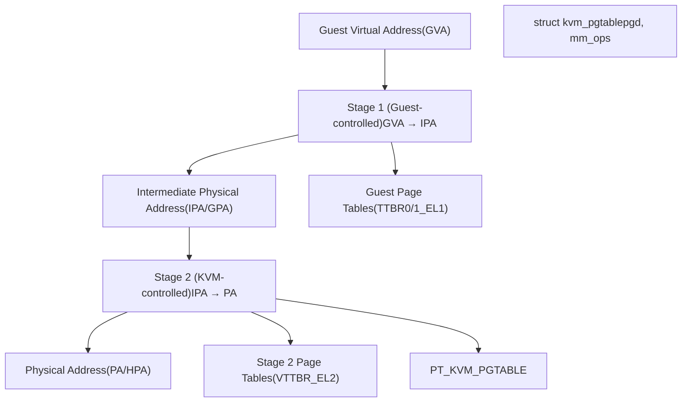
**Stage 1**: Controlled by the guest OS. Translates guest virtual addresses to what the guest believes are physical addresses (IPAs).

**Stage 2**: Controlled by KVM. Provides an additional translation layer and memory isolation. Traps guest memory accesses for emulation or protection.

**kvm\_pgtable**: Generic page table abstraction with operations for map, unmap, and walk operations.

Sources: [arch/arm64/kvm/mmu.c1-100](https://github.com/torvalds/linux/blob/fcb70a56/arch/arm64/kvm/mmu.c#L1-L100) [arch/arm64/include/asm/kvm\_host.h152-230](https://github.com/torvalds/linux/blob/fcb70a56/arch/arm64/include/asm/kvm_host.h#L152-L230)

### Stage 2 Fault Handling

Stage 2 abort entry point is `kvm_handle_guest_abort()` [arch/arm64/kvm/mmu.c1350-1450](https://github.com/torvalds/linux/blob/fcb70a56/arch/arm64/kvm/mmu.c#L1350-L1450):

```mermaid
flowchart TD
    ABORT["kvm_handle_guest_abort()ESR_EL2.EC=0x24/0x25"]
    GET_IPA["fault_ipa = kvm_vcpu_get_fault_ipa()HPFAR_EL2[47:12] | FAR_EL2[11:0]"]
    NESTED["vcpu_has_nv() &&is_hyp_ctxt()"]
    WALK_L1["kvm_walk_nested_s2()struct kvm_s2_trans *trans"]
    CHECK_L1["trans->esr != 0"]
    INJECT["kvm_inject_s2_fault()Write FAR_EL2, HPFAR_EL2"]
    USER_FAULT["user_mem_abort()"]
    LOOKUP_SLOT["gfn_to_memslot()struct kvm_memory_slot"]
    MMIO_CHECK["slot == NULL"]
    EMULATE_MMIO["io_mem_abort()kvm_io_bus_write()"]
    GET_PFN["__gfn_to_pfn_memslot()gup_longterm()"]
    MAP_S2["kvm_pgtable_stage2_map()pgt->mm_ops->zalloc_page()"]
    TLB_FLUSH["__kvm_tlb_flush_vmid_ipa()"]

    ABORT --> GET_IPA
    GET --> IPA_NESTED
    NESTED --> WALK_L1
    NESTED --> USER_FAULT
    WALK --> L1_CHECK_L1
    CHECK --> L1_INJECT
    CHECK --> L1_USER_FAULT
    USER --> FAULT_LOOKUP_SLOT
    LOOKUP --> SLOT_MMIO_CHECK
    MMIO --> CHECK_EMULATE_MMIO
    MMIO --> CHECK_GET_PFN
    GET --> PFN_MAP_S2
    MAP --> S2_TLB_FLUSH
```
**Fault Information Extraction**:

-   `kvm_vcpu_get_fault_ipa()` [arch/arm64/include/asm/kvm\_emulate.h350-360](https://github.com/torvalds/linux/blob/fcb70a56/arch/arm64/include/asm/kvm_emulate.h#L350-L360): Combines `HPFAR_EL2` (bits \[47:12\]) with `FAR_EL2` (bits \[11:0\])
-   `kvm_vcpu_get_esr()`: Reads `ESR_EL2` for fault type
-   `kvm_vcpu_dabt_iswrite()`: Checks write vs read from `ESR_EL2.WnR`

**Nested S2 Translation** [arch/arm64/kvm/nested.c398-421](https://github.com/torvalds/linux/blob/fcb70a56/arch/arm64/kvm/nested.c#L398-L421):

-   `kvm_walk_nested_s2()`: Walks L1's S2 page tables
-   If `trans->esr != 0`: Fault at L1 level, inject to L1 hypervisor
-   If success: Continue with host mapping using `trans->output` as L1 IPA

**Memory Slot Lookup** [arch/arm64/kvm/mmu.c1250-1300](https://github.com/torvalds/linux/blob/fcb70a56/arch/arm64/kvm/mmu.c#L1250-L1300):

-   `gfn_to_memslot()`: Finds `struct kvm_memory_slot` for GFN
-   If no slot: Treat as MMIO, call `io_mem_abort()`
-   If slot found: Normal RAM, proceed to map

**S2 Mapping Installation** [arch/arm64/kvm/mmu.c1300-1400](https://github.com/torvalds/linux/blob/fcb70a56/arch/arm64/kvm/mmu.c#L1300-L1400):

-   `__gfn_to_pfn_memslot()`: Translates GFN to host PFN via `get_user_pages()`
-   `kvm_pgtable_stage2_map()`: Installs PTE in S2 page table
-   `__kvm_tlb_flush_vmid_ipa()`: Flushes TLB for new mapping

Sources: [arch/arm64/kvm/mmu.c1250-1450](https://github.com/torvalds/linux/blob/fcb70a56/arch/arm64/kvm/mmu.c#L1250-L1450) [arch/arm64/kvm/nested.c398-421](https://github.com/torvalds/linux/blob/fcb70a56/arch/arm64/kvm/nested.c#L398-L421) [arch/arm64/include/asm/kvm\_emulate.h350-360](https://github.com/torvalds/linux/blob/fcb70a56/arch/arm64/include/asm/kvm_emulate.h#L350-L360)

### Stage 2 Page Table Operations

**`struct kvm_pgtable`** [arch/arm64/include/asm/kvm\_pgtable.h200-250](https://github.com/torvalds/linux/blob/fcb70a56/arch/arm64/include/asm/kvm_pgtable.h#L200-L250):

```
struct kvm_pgtable {
    kvm_pte_t *pgd;                    // Page table root
    struct kvm_pgtable_mm_ops *mm_ops; // Memory operations
    struct kvm_s2_mmu *mmu;           // Back pointer
    int ia_bits;                      // Input address size
    u8 start_level;                   // Starting level
    u32 flags;                        // KVM_PGTABLE_S2_*
};
```
**Core Page Table Operations**:

| Function | Location | Purpose |
| --- | --- | --- |
| `kvm_pgtable_stage2_map()` | [arch/arm64/kvm/hyp/pgtable.c800-900](https://github.com/torvalds/linux/blob/fcb70a56/arch/arm64/kvm/hyp/pgtable.c#L800-L900) | Map IPA→PA with `enum kvm_pgtable_prot` |
| `kvm_pgtable_stage2_unmap()` | [arch/arm64/kvm/hyp/pgtable.c950-1000](https://github.com/torvalds/linux/blob/fcb70a56/arch/arm64/kvm/hyp/pgtable.c#L950-L1000) | Unmap range, call `mm_ops->put_page()` |
| `kvm_pgtable_stage2_wrprotect()` | [arch/arm64/kvm/hyp/pgtable.c1100-1150](https://github.com/torvalds/linux/blob/fcb70a56/arch/arm64/kvm/hyp/pgtable.c#L1100-L1150) | Clear `KVM_PTE_LEAF_ATTR_LO_S2_S2AP_W` |
| `kvm_pgtable_stage2_test_clear_young()` | [arch/arm64/kvm/hyp/pgtable.c1200-1250](https://github.com/torvalds/linux/blob/fcb70a56/arch/arm64/kvm/hyp/pgtable.c#L1200-L1250) | Clear `KVM_PTE_LEAF_ATTR_LO_S2_AF` |
| `kvm_pgtable_stage2_flush()` | [arch/arm64/kvm/hyp/pgtable.c1300-1350](https://github.com/torvalds/linux/blob/fcb70a56/arch/arm64/kvm/hyp/pgtable.c#L1300-L1350) | Cache clean for device memory |
| `kvm_pgtable_stage2_split()` | [arch/arm64/kvm/hyp/pgtable.c1400-1500](https://github.com/torvalds/linux/blob/fcb70a56/arch/arm64/kvm/hyp/pgtable.c#L1400-L1500) | Break block into page mappings |

**Memory Operations** (`struct kvm_pgtable_mm_ops` at [arch/arm64/kvm/mmu.c229-246](https://github.com/torvalds/linux/blob/fcb70a56/arch/arm64/kvm/mmu.c#L229-L246)):

-   `zalloc_page()`: Allocate zeroed page (calls `stage2_memcache_zalloc_page()`)
-   `get_page()`, `put_page()`: Reference counting
-   `phys_to_virt()`, `virt_to_phys()`: Address translation
-   `free_unlinked_table()`: RCU-delayed free via `stage2_free_unlinked_table()`

**Dirty Logging** [arch/arm64/kvm/mmu.c1100-1200](https://github.com/torvalds/linux/blob/fcb70a56/arch/arm64/kvm/mmu.c#L1100-L1200):

-   Enable: Call `kvm_pgtable_stage2_wrprotect()` on all guest memory
-   On write fault: Set `KVM_MEM_LOG_DIRTY_PAGES` bit in memslot bitmap
-   Query: Read dirty bitmap via `KVM_GET_DIRTY_LOG` ioctl

**Block Mapping Strategy**:

-   Attempt 1GB blocks (level 1) if aligned and contiguous
-   Fall back to 2MB blocks (level 2) otherwise
-   Force 4KB pages (level 3) for partial mappings or `KVM_PGTABLE_S2_NOFWB`

Sources: [arch/arm64/include/asm/kvm\_pgtable.h200-250](https://github.com/torvalds/linux/blob/fcb70a56/arch/arm64/include/asm/kvm_pgtable.h#L200-L250) [arch/arm64/kvm/hyp/pgtable.c800-1500](https://github.com/torvalds/linux/blob/fcb70a56/arch/arm64/kvm/hyp/pgtable.c#L800-L1500) [arch/arm64/kvm/mmu.c229-246](https://github.com/torvalds/linux/blob/fcb70a56/arch/arm64/kvm/mmu.c#L229-L246)

### Memory Slot Management

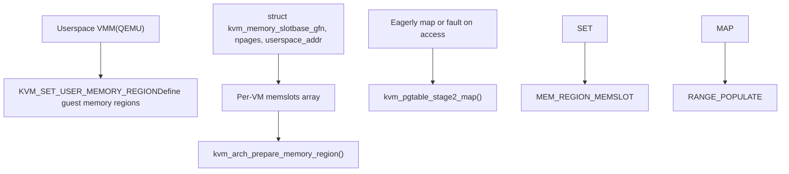
**Memory Regions**: Each guest memory region is described by a `struct kvm_memory_slot`:

-   `base_gfn`: Guest frame number (IPA >> PAGE\_SHIFT)
-   `npages`: Size in pages
-   `userspace_addr`: Host virtual address backing this region

**Demand Paging**: By default, S2 mappings are created on-demand via page faults. This allows memory overcommit and swap.

**Eager Mapping**: For some use cases (e.g., huge page pre-allocation), KVM can eagerly populate S2 mappings at region creation time.

Sources: [arch/arm64/kvm/mmu.c1400-1600](https://github.com/torvalds/linux/blob/fcb70a56/arch/arm64/kvm/mmu.c#L1400-L1600)

## Additional Subsystems

### Performance Monitoring Unit (PMU)

```mermaid
flowchart TD
    GUEST_READ["Guest reads PMEVCNTRn"]
    GUEST_WRITE["Guest writes PMCR_EL0"]
    PMC["struct kvm_pmcPer-counter state"]
    PERF_EVENT["Host perf_eventBacking counter"]
    PMU_IRQ["PMU overflow interruptto VGIC"]
    ACCESS_EVCNTR["access_pmu_evcntr()"]
    ACCESS_PMCR["access_pmcr()"]
    CREATE_EVENT["kvm_pmu_create_perf_event()"]
    OVERFLOW["kvm_pmu_overflow_status()"]

    GUEST --> READ_ACCESS_EVCNTR
    GUEST --> WRITE_ACCESS_PMCR
    ACCESS --> EVCNTR_PMC
    ACCESS --> PMCR_PMC
    PMC --> PERF_EVENT
    ACCESS --> PMCR_CREATE_EVENT
    CREATE --> EVENT_PERF_EVENT
    PERF --> EVENT_OVERFLOW
    OVERFLOW --> PMU_IRQ
```
**Counter Virtualization**: Each guest PMU counter is backed by a host `perf_event`, allowing accurate performance measurement without direct hardware access.

**Event Filtering**: KVM provides `PMCEID0/1_EL0` to advertise supported PMU events. A VM-wide filter can restrict events further.

**Overflow Interrupts**: When a counter overflows, KVM injects a PMU interrupt to the guest via the VGIC.

Sources: [arch/arm64/kvm/pmu-emul.c1-100](https://github.com/torvalds/linux/blob/fcb70a56/arch/arm64/kvm/pmu-emul.c#L1-L100) [arch/arm64/kvm/pmu-emul.c100-300](https://github.com/torvalds/linux/blob/fcb70a56/arch/arm64/kvm/pmu-emul.c#L100-L300) [arch/arm64/kvm/sys\_regs.c1004-1047](https://github.com/torvalds/linux/blob/fcb70a56/arch/arm64/kvm/sys_regs.c#L1004-L1047)

### Virtual GIC (VGIC)

The VGIC emulates the ARM Generic Interrupt Controller, providing interrupt delivery to vCPUs:

**Distributor (GICD)**: Manages global interrupt state and routing.

**Redistributor (GICR)**: Per-CPU interrupt interface.

**CPU Interface**: Accessed via system registers (`ICC_*_EL1`). With GICv3, these are trapped and emulated by KVM.

**vGIC Integration**:

-   `vgic_v3_dispatch_sgi()`: Handles guest SGI generation
-   `kvm_vgic_inject_irq()`: Injects interrupts into guest
-   `vgic_v3_sync_hardware_irq()`: Synchronizes virtual IRQ state

Sources: [arch/arm64/kvm/sys\_regs.c602-648](https://github.com/torvalds/linux/blob/fcb70a56/arch/arm64/kvm/sys_regs.c#L602-L648) [arch/arm64/kvm/sys\_regs.c650-667](https://github.com/torvalds/linux/blob/fcb70a56/arch/arm64/kvm/sys_regs.c#L650-L667)

### Timers

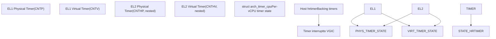
**Timer Virtualization**: KVM provides virtual views of ARM architectural timers. Each timer can generate interrupts at programmed times.

**Counter Offset**: KVM maintains a VM-wide virtual counter offset (`CNTVOFF_EL2`), allowing the guest to see a monotonic time base independent of host suspend/resume.

**Nested Timer Support**: For nested virtualization, KVM emulates the EL2 timers (`CNTHP`, `CNTHV`) used by L1 hypervisors.

Sources: [arch/arm64/kvm/arch\_timer.c1-100](https://github.com/torvalds/linux/blob/fcb70a56/arch/arm64/kvm/arch_timer.c#L1-L100)

### Debug Support

```mermaid
flowchart TD
    VCPU_DEBUG["vcpu_debug_stateGuest's HW breakpoints"]
    EXTERNAL_DEBUG["external_debug_stateHost debugger BPs"]
    MDSCR["MDSCR_EL1Monitor debug control"]
    DBGBVR["DBGBVRn_EL1Breakpoint addresses"]
    DBGBCR["DBGBCRn_EL1Breakpoint controls"]
    SAVE_HOST["Save host debug state"]
    LOAD_GUEST["Load guest/debugger state"]
    RESTORE["Restore host state"]

    VCPU --> DEBUG_LOAD_GUEST
    EXTERNAL --> DEBUG_LOAD_GUEST
    LOAD --> GUEST_DBGBVR
    LOAD --> GUEST_DBGBCR
    SAVE --> HOST_LOAD_GUEST
    LOAD --> GUEST_RESTORE
```
**Guest Debug Registers**: Each vCPU has its own view of debug registers (breakpoints, watchpoints).

**External Debugging**: The host debugger (via `KVM_SET_GUEST_DEBUG` ioctl) can set breakpoints that apply to guest execution.

**Debug Ownership**: The `debug_owner` field tracks whether debug registers currently belong to the guest or the host debugger.

Sources: [arch/arm64/kvm/debug.c1-100](https://github.com/torvalds/linux/blob/fcb70a56/arch/arm64/kvm/debug.c#L1-L100) [arch/arm64/include/asm/kvm\_host.h845-862](https://github.com/torvalds/linux/blob/fcb70a56/arch/arm64/include/asm/kvm_host.h#L845-L862)

## Key Configuration and Trap Registers

### Critical Control Registers

| Register | Purpose | Key Fields |
| --- | --- | --- |
| **HCR\_EL2** | Hypervisor Configuration | `VM` (enable S2), `TVM` (trap VM regs), `NV`/`NV1`/`NV2` (nested virt) |
| **VTCR\_EL2** | Virtual Translation Control | `T0SZ` (IPA size), `SL0` (start level), `TG0` (granule size), `PS` (PA size) |
| **VTTBR\_EL2** | Virtual Translation Table Base | `VMID`, `BADDR` (S2 page table base) |
| **MDCR\_EL2** | Monitor Debug Configuration | `TPM` (trap PMU), `TDA` (trap debug), `HPMN` (PMU counter count) |
| **CPTR\_EL2** | Architectural Feature Trap | `TTA` (trap trace), `FPEN` (FP/SIMD trap), `ZEN` (SVE trap) |

Sources: [arch/arm64/include/asm/kvm\_arm.h1-100](https://github.com/torvalds/linux/blob/fcb70a56/arch/arm64/include/asm/kvm_arm.h#L1-L100) [arch/arm64/kvm/sys\_regs.c1-100](https://github.com/torvalds/linux/blob/fcb70a56/arch/arm64/kvm/sys_regs.c#L1-L100)

### Fine-Grained Traps (FGT)

ARM v8.6 introduced Fine-Grained Traps, allowing more granular control over which system registers trap:

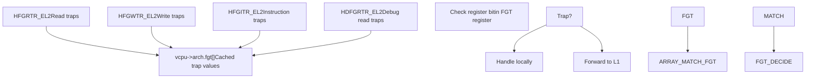
**FGT Usage**: KVM configures FGT registers to trap only the system registers it needs to emulate or control, reducing unnecessary traps for well-behaved guests.

**Nested FGT**: For nested virtualization, L1's FGT settings are honored by evaluating them alongside L0's settings.

Sources: [arch/arm64/include/asm/kvm\_host.h276-292](https://github.com/torvalds/linux/blob/fcb70a56/arch/arm64/include/asm/kvm_host.h#L276-L292) [arch/arm64/include/asm/kvm\_host.h819-822](https://github.com/torvalds/linux/blob/fcb70a56/arch/arm64/include/asm/kvm_host.h#L819-L822) [arch/arm64/kvm/emulate-nested.c1-100](https://github.com/torvalds/linux/blob/fcb70a56/arch/arm64/kvm/emulate-nested.c#L1-L100)

## Summary

KVM ARM64 provides comprehensive virtualization support leveraging ARM's hardware virtualization extensions. Key capabilities include:

-   **System Register Emulation**: Efficient trap-and-emulate with VHE optimizations
-   **Nested Virtualization**: Full support for running hypervisors in VMs via shadow S2 MMUs and VNCR
-   **pKVM**: Hardware-enforced confidential computing with memory isolation
-   **Stage 2 MMU**: Flexible IPA→PA translation with huge page support
-   **Device Emulation**: VGIC for interrupts, timer virtualization, PMU emulation

The implementation carefully balances performance (minimizing traps, using hardware features) with flexibility (supporting nested VMs, protected VMs, and various ARM64 CPU features).

Sources: [arch/arm64/kvm/arm.c1-500](https://github.com/torvalds/linux/blob/fcb70a56/arch/arm64/kvm/arm.c#L1-L500) [arch/arm64/kvm/sys\_regs.c1-500](https://github.com/torvalds/linux/blob/fcb70a56/arch/arm64/kvm/sys_regs.c#L1-L500) [arch/arm64/kvm/nested.c1-500](https://github.com/torvalds/linux/blob/fcb70a56/arch/arm64/kvm/nested.c#L1-L500) [arch/arm64/kvm/mmu.c1-500](https://github.com/torvalds/linux/blob/fcb70a56/arch/arm64/kvm/mmu.c#L1-L500)
