# Process Scheduling and sched\_ext

Relevant source files

-   [Documentation/scheduler/sched-debug.rst](https://github.com/torvalds/linux/blob/fcb70a56/Documentation/scheduler/sched-debug.rst)
-   [Documentation/scheduler/sched-design-CFS.rst](https://github.com/torvalds/linux/blob/fcb70a56/Documentation/scheduler/sched-design-CFS.rst)
-   [Documentation/scheduler/sched-domains.rst](https://github.com/torvalds/linux/blob/fcb70a56/Documentation/scheduler/sched-domains.rst)
-   [Documentation/scheduler/sched-ext.rst](https://github.com/torvalds/linux/blob/fcb70a56/Documentation/scheduler/sched-ext.rst)
-   [Documentation/scheduler/sched-stats.rst](https://github.com/torvalds/linux/blob/fcb70a56/Documentation/scheduler/sched-stats.rst)
-   [Documentation/translations/sp\_SP/scheduler/sched-design-CFS.rst](https://github.com/torvalds/linux/blob/fcb70a56/Documentation/translations/sp_SP/scheduler/sched-design-CFS.rst)
-   [include/linux/sched.h](https://github.com/torvalds/linux/blob/fcb70a56/include/linux/sched.h)
-   [include/linux/sched/sd\_flags.h](https://github.com/torvalds/linux/blob/fcb70a56/include/linux/sched/sd_flags.h)
-   [include/linux/sched/topology.h](https://github.com/torvalds/linux/blob/fcb70a56/include/linux/sched/topology.h)
-   [kernel/sched/autogroup.c](https://github.com/torvalds/linux/blob/fcb70a56/kernel/sched/autogroup.c)
-   [kernel/sched/build\_utility.c](https://github.com/torvalds/linux/blob/fcb70a56/kernel/sched/build_utility.c)
-   [kernel/sched/core.c](https://github.com/torvalds/linux/blob/fcb70a56/kernel/sched/core.c)
-   [kernel/sched/core\_sched.c](https://github.com/torvalds/linux/blob/fcb70a56/kernel/sched/core_sched.c)
-   [kernel/sched/deadline.c](https://github.com/torvalds/linux/blob/fcb70a56/kernel/sched/deadline.c)
-   [kernel/sched/debug.c](https://github.com/torvalds/linux/blob/fcb70a56/kernel/sched/debug.c)
-   [kernel/sched/ext.c](https://github.com/torvalds/linux/blob/fcb70a56/kernel/sched/ext.c)
-   [kernel/sched/ext.h](https://github.com/torvalds/linux/blob/fcb70a56/kernel/sched/ext.h)
-   [kernel/sched/ext\_idle.c](https://github.com/torvalds/linux/blob/fcb70a56/kernel/sched/ext_idle.c)
-   [kernel/sched/ext\_idle.h](https://github.com/torvalds/linux/blob/fcb70a56/kernel/sched/ext_idle.h)
-   [kernel/sched/fair.c](https://github.com/torvalds/linux/blob/fcb70a56/kernel/sched/fair.c)
-   [kernel/sched/idle.c](https://github.com/torvalds/linux/blob/fcb70a56/kernel/sched/idle.c)
-   [kernel/sched/pelt.c](https://github.com/torvalds/linux/blob/fcb70a56/kernel/sched/pelt.c)
-   [kernel/sched/pelt.h](https://github.com/torvalds/linux/blob/fcb70a56/kernel/sched/pelt.h)
-   [kernel/sched/rt.c](https://github.com/torvalds/linux/blob/fcb70a56/kernel/sched/rt.c)
-   [kernel/sched/sched.h](https://github.com/torvalds/linux/blob/fcb70a56/kernel/sched/sched.h)
-   [kernel/sched/stats.c](https://github.com/torvalds/linux/blob/fcb70a56/kernel/sched/stats.c)
-   [kernel/sched/stats.h](https://github.com/torvalds/linux/blob/fcb70a56/kernel/sched/stats.h)
-   [kernel/sched/stop\_task.c](https://github.com/torvalds/linux/blob/fcb70a56/kernel/sched/stop_task.c)
-   [kernel/sched/syscalls.c](https://github.com/torvalds/linux/blob/fcb70a56/kernel/sched/syscalls.c)
-   [kernel/sched/topology.c](https://github.com/torvalds/linux/blob/fcb70a56/kernel/sched/topology.c)
-   [tools/sched\_ext/include/scx/common.bpf.h](https://github.com/torvalds/linux/blob/fcb70a56/tools/sched_ext/include/scx/common.bpf.h)
-   [tools/sched\_ext/include/scx/common.h](https://github.com/torvalds/linux/blob/fcb70a56/tools/sched_ext/include/scx/common.h)
-   [tools/sched\_ext/include/scx/compat.bpf.h](https://github.com/torvalds/linux/blob/fcb70a56/tools/sched_ext/include/scx/compat.bpf.h)
-   [tools/sched\_ext/include/scx/compat.h](https://github.com/torvalds/linux/blob/fcb70a56/tools/sched_ext/include/scx/compat.h)
-   [tools/sched\_ext/include/scx/enum\_defs.autogen.h](https://github.com/torvalds/linux/blob/fcb70a56/tools/sched_ext/include/scx/enum_defs.autogen.h)
-   [tools/sched\_ext/include/scx/enums.autogen.bpf.h](https://github.com/torvalds/linux/blob/fcb70a56/tools/sched_ext/include/scx/enums.autogen.bpf.h)
-   [tools/sched\_ext/include/scx/enums.autogen.h](https://github.com/torvalds/linux/blob/fcb70a56/tools/sched_ext/include/scx/enums.autogen.h)
-   [tools/sched\_ext/include/scx/enums.bpf.h](https://github.com/torvalds/linux/blob/fcb70a56/tools/sched_ext/include/scx/enums.bpf.h)
-   [tools/sched\_ext/include/scx/enums.h](https://github.com/torvalds/linux/blob/fcb70a56/tools/sched_ext/include/scx/enums.h)
-   [tools/sched\_ext/include/scx/user\_exit\_info.h](https://github.com/torvalds/linux/blob/fcb70a56/tools/sched_ext/include/scx/user_exit_info.h)
-   [tools/sched\_ext/scx\_central.bpf.c](https://github.com/torvalds/linux/blob/fcb70a56/tools/sched_ext/scx_central.bpf.c)
-   [tools/sched\_ext/scx\_central.c](https://github.com/torvalds/linux/blob/fcb70a56/tools/sched_ext/scx_central.c)
-   [tools/sched\_ext/scx\_flatcg.bpf.c](https://github.com/torvalds/linux/blob/fcb70a56/tools/sched_ext/scx_flatcg.bpf.c)
-   [tools/sched\_ext/scx\_qmap.bpf.c](https://github.com/torvalds/linux/blob/fcb70a56/tools/sched_ext/scx_qmap.bpf.c)
-   [tools/sched\_ext/scx\_qmap.c](https://github.com/torvalds/linux/blob/fcb70a56/tools/sched_ext/scx_qmap.c)
-   [tools/sched\_ext/scx\_simple.bpf.c](https://github.com/torvalds/linux/blob/fcb70a56/tools/sched_ext/scx_simple.bpf.c)

## Purpose and Scope

This document describes the Linux kernel's process scheduling infrastructure, with emphasis on the **sched\_ext** (extensible scheduler) class. sched\_ext enables custom scheduling policies to be implemented as BPF programs loaded at runtime, without requiring kernel patches or reboots.

For information about specific traditional scheduling classes like CFS or SCHED\_DEADLINE, see their respective implementations in [kernel/sched/fair.c](https://github.com/torvalds/linux/blob/fcb70a56/kernel/sched/fair.c) and [kernel/sched/deadline.c](https://github.com/torvalds/linux/blob/fcb70a56/kernel/sched/deadline.c) For tracing and observability of scheduling decisions, see [Tracing and Observability](/torvalds/linux/4.2-tracing-and-observability).

## Scheduling Class Hierarchy

The Linux scheduler is organized into a hierarchy of scheduling classes, each handling different types of tasks with specific real-time or fairness requirements.

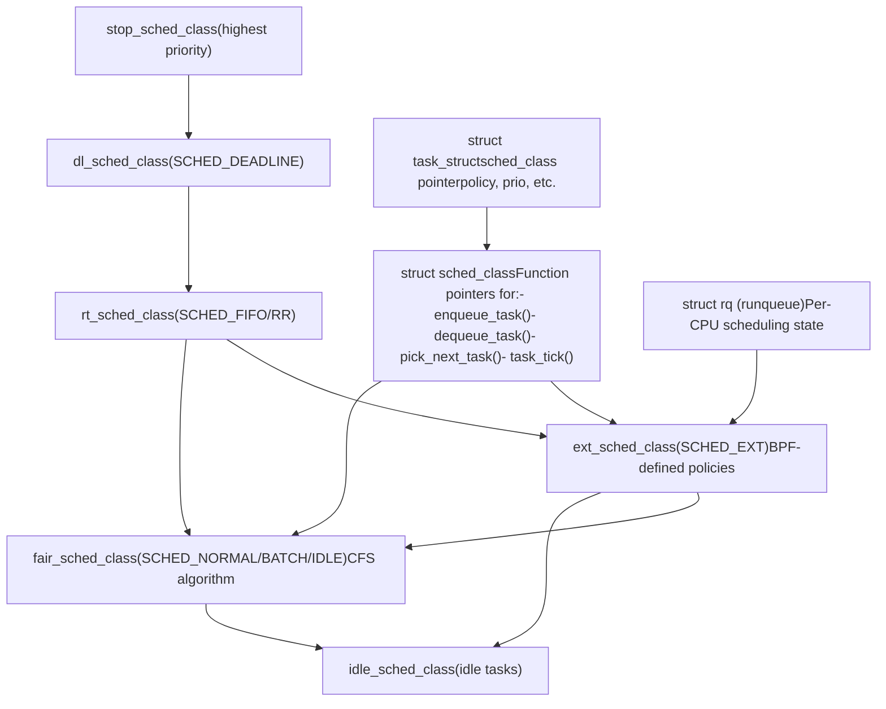
**Scheduling Class Selection Logic**

Each task has a `sched_class` pointer that determines which scheduler manages it. The pointer is set based on the task's scheduling policy:

-   `SCHED_DEADLINE` → `dl_sched_class`
-   `SCHED_FIFO`, `SCHED_RR` → `rt_sched_class`
-   `SCHED_EXT` → `ext_sched_class` (when sched\_ext is enabled)
-   `SCHED_NORMAL`, `SCHED_BATCH`, `SCHED_IDLE` → `fair_sched_class`

The scheduler iterates through classes in priority order during `pick_next_task()` to select the highest-priority runnable task.

Sources: [kernel/sched/sched.h1-1500](https://github.com/torvalds/linux/blob/fcb70a56/kernel/sched/sched.h#L1-L1500) [kernel/sched/core.c192-260](https://github.com/torvalds/linux/blob/fcb70a56/kernel/sched/core.c#L192-L260)

## sched\_ext Architecture Overview

**sched\_ext** is a revolutionary extension to the Linux scheduler that allows scheduling policies to be defined and loaded as BPF programs at runtime. This eliminates the need for kernel patches and reboots when experimenting with or deploying custom schedulers.

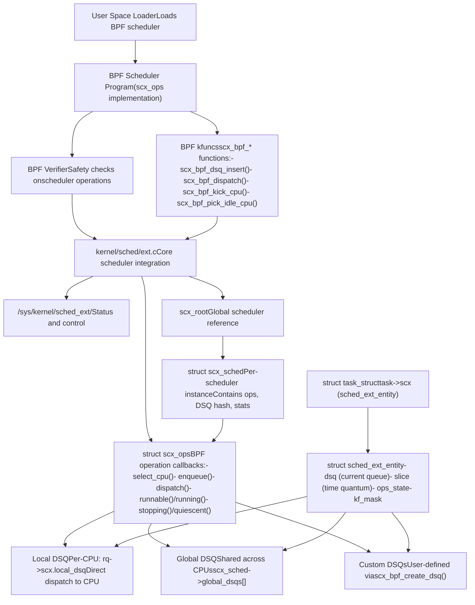
**Key Innovation**: The BPF scheduler defines task enqueuing and dispatching logic. When a task becomes runnable, the `ops.enqueue()` callback decides which dispatch queue to place it on. The `ops.dispatch()` callback moves tasks from dispatch queues to CPU local queues for execution.

Sources: [kernel/sched/ext.c1-10000](https://github.com/torvalds/linux/blob/fcb70a56/kernel/sched/ext.c#L1-L10000) [kernel/sched/ext.h1-100](https://github.com/torvalds/linux/blob/fcb70a56/kernel/sched/ext.h#L1-L100)

## Core Data Structures

### struct sched\_ext\_entity

Each task's sched\_ext state is tracked in `task->scx`:

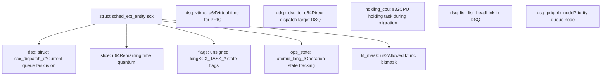
**ops\_state Tracking**: The `ops_state` field uses atomic operations to track whether a task is currently being enqueued (`SCX_QUEUEING`) or dispatched (`SCX_DISPATCHING`). This enables safe concurrent access and proper synchronization between BPF operations and core scheduler code.

Sources: [include/linux/sched.h850-900](https://github.com/torvalds/linux/blob/fcb70a56/include/linux/sched.h#L850-L900) [kernel/sched/ext.c758-763](https://github.com/torvalds/linux/blob/fcb70a56/kernel/sched/ext.c#L758-L763)

### struct scx\_dispatch\_q (Dispatch Queue)

Dispatch queues are the fundamental data structure for task queueing in sched\_ext:

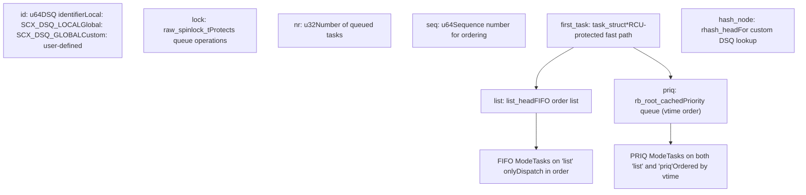
**Two Dispatch Modes**:

-   **FIFO mode**: Tasks are dispatched in the order they were enqueued (using `list`)
-   **PRIQ mode**: Tasks are dispatched by virtual time (`dsq_vtime`), using both `list` and `priq` (rbtree)

Sources: [kernel/sched/ext.c1010-1125](https://github.com/torvalds/linux/blob/fcb70a56/kernel/sched/ext.c#L1010-L1125)

### struct scx\_ops (BPF Operations)

The `scx_ops` structure defines the BPF scheduler's callbacks:

| Callback | Purpose | When Called |
| --- | --- | --- |
| `select_cpu(p, prev_cpu, wake_flags)` | Choose target CPU for waking task | During task wakeup |
| `enqueue(p, enq_flags)` | Decide where to queue task | When task becomes runnable |
| `dispatch(cpu, prev)` | Move tasks from DSQs to local queue | During scheduling decision |
| `runnable(p, enq_flags)` | Task is runnable (may not be running yet) | Before enqueue |
| `running(p)` | Task is about to run on CPU | After selection, before execution |
| `stopping(p, runnable)` | Task is stopping execution | When task stops running |
| `quiescent(p, deq_flags)` | Task is no longer runnable | After dequeue |
| `yield(p, prev)` | Task explicitly yielded CPU | On sched\_yield() |
| `core_sched_before(a, b)` | Compare tasks for core scheduling | During core-sched selection |
| `enable(p)` | Task is being enabled for sched\_ext | During policy change to SCHED\_EXT |
| `init_task(p)` | Initialize task for sched\_ext | On task fork/creation |
| `exit_task(p)` | Clean up task state | On task exit |

Sources: [kernel/sched/ext.c310-383](https://github.com/torvalds/linux/blob/fcb70a56/kernel/sched/ext.c#L310-L383)

## Task Lifecycle in sched\_ext

### Wake-up and CPU Selection

When a task wakes up, sched\_ext determines which CPU should run it:

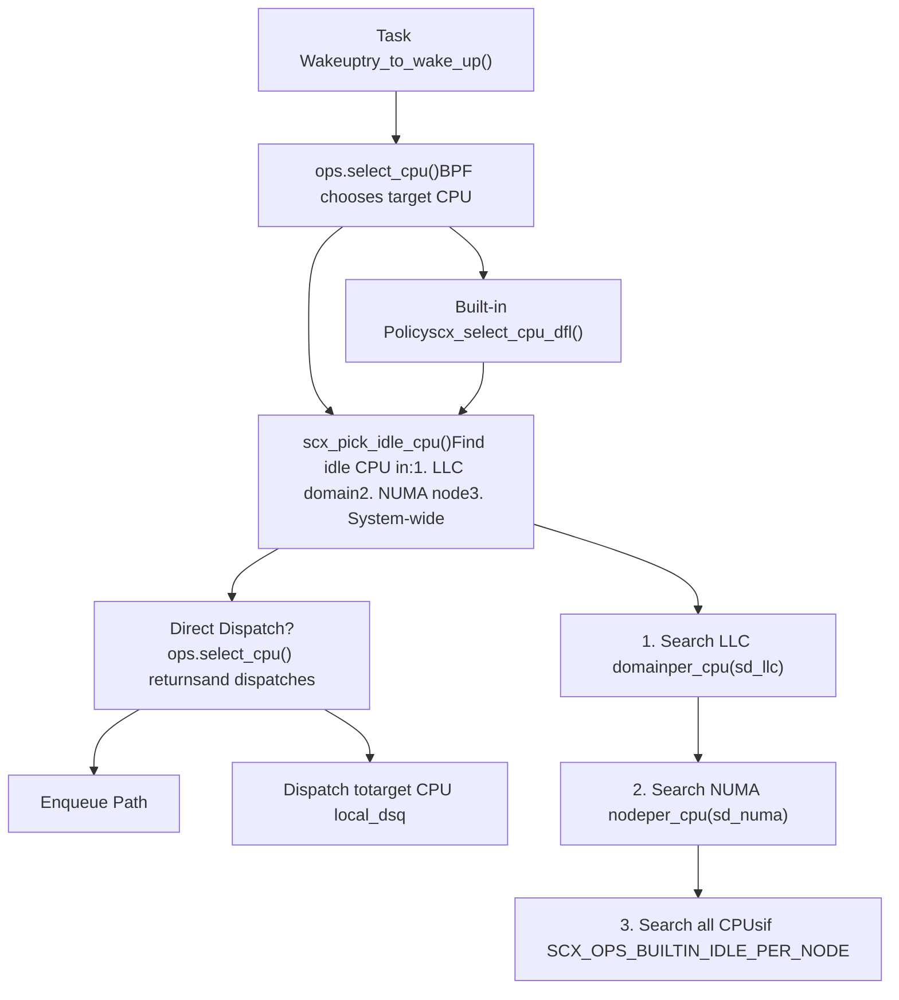
**Idle CPU Selection**: The built-in policy `scx_select_cpu_dfl()` implements a hierarchical search strategy that respects cache topology:

1.  **LLC domain** (Last Level Cache): Prefer CPUs sharing the same LLC to maintain hot cache lines
2.  **NUMA node**: Prefer CPUs in the same NUMA node to reduce memory access latency
3.  **System-wide**: Search all CPUs if node-local search fails

This can be customized by the BPF scheduler or disabled entirely.

Sources: [kernel/sched/ext\_idle.c200-225](https://github.com/torvalds/linux/blob/fcb70a56/kernel/sched/ext_idle.c#L200-L225) [kernel/sched/ext.c1800-1900](https://github.com/torvalds/linux/blob/fcb70a56/kernel/sched/ext.c#L1800-L1900)

### Enqueue and Dispatch Flow

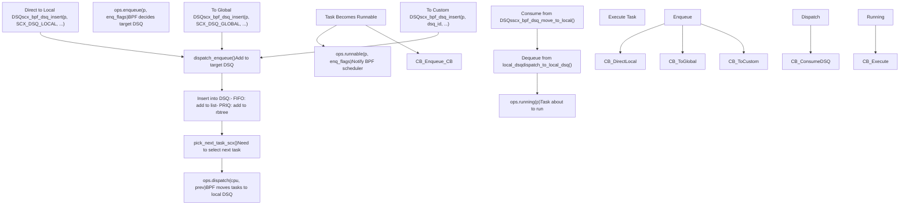
**Key Insight**: The separation of `enqueue()` and `dispatch()` operations allows the BPF scheduler to implement sophisticated queueing strategies. Tasks can be placed on intermediate queues (global or custom DSQs) and later moved to CPU-local queues based on global state or fairness policies.

Sources: [kernel/sched/ext.c1010-1200](https://github.com/torvalds/linux/blob/fcb70a56/kernel/sched/ext.c#L1010-L1200) [kernel/sched/ext.c2500-2700](https://github.com/torvalds/linux/blob/fcb70a56/kernel/sched/ext.c#L2500-L2700)

## Dispatch Queue (DSQ) Types and Operations

### Built-in DSQ Types

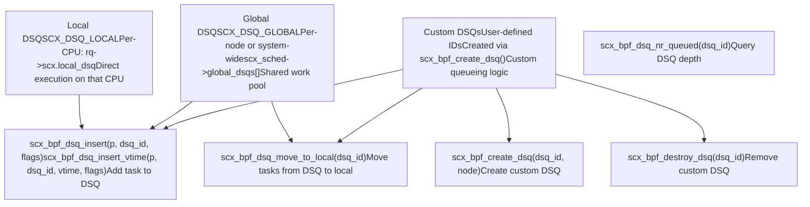
**Local DSQ Priority**: Tasks on a CPU's local DSQ are always selected first during `pick_next_task_scx()`. This enables low-latency direct dispatch for latency-sensitive tasks.

**Global DSQ Partitioning**: When `SCX_OPS_BUILTIN_IDLE_PER_NODE` is enabled, global DSQs are partitioned per NUMA node (`global_dsqs[node_id]`) to reduce cross-node migrations.

Sources: [kernel/sched/ext.c247-256](https://github.com/torvalds/linux/blob/fcb70a56/kernel/sched/ext.c#L247-L256) [kernel/sched/ext.c1010-1100](https://github.com/torvalds/linux/blob/fcb70a56/kernel/sched/ext.c#L1010-L1100)

### DSQ Iterator and Batch Operations

sched\_ext provides an iterator interface for efficiently moving multiple tasks between DSQs:

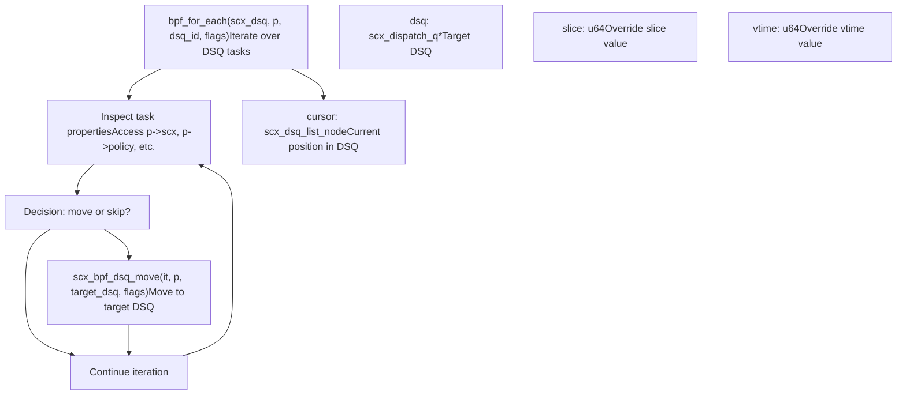
**Batch Operations**: The iterator allows the BPF scheduler to efficiently rebalance work across DSQs or implement complex fairness policies by examining and moving multiple tasks in a single `ops.dispatch()` callback.

Sources: [kernel/sched/ext.c440-500](https://github.com/torvalds/linux/blob/fcb70a56/kernel/sched/ext.c#L440-L500) [kernel/sched/ext.c3700-3900](https://github.com/torvalds/linux/blob/fcb70a56/kernel/sched/ext.c#L3700-L3900)

## Built-in Idle CPU Selection Policy

The default idle CPU selection policy implements topology-aware CPU selection to optimize cache locality and NUMA affinity.

### Idle CPU Tracking

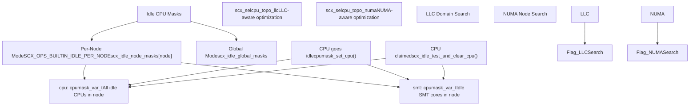
**SMT Core Preference**: When SMT (Simultaneous Multi-Threading) is active, `scx_pick_idle_cpu()` first searches for completely idle SMT cores (all sibling threads idle) before accepting partially idle cores. This maximizes single-thread performance by avoiding resource contention.

### Topology-Aware Search Strategy

The idle CPU selection follows a hierarchical strategy that respects cache and NUMA topology:

| Search Level | Rationale | Implementation |
| --- | --- | --- |
| **LLC Domain** | Maximize L2/L3 cache hit rate | Search `cpu_smt_mask()` first, then `sched_domain_span(sd_llc)` |
| **NUMA Node** | Minimize remote memory access latency | Search `sched_group_span(sd_numa)` |
| **System-wide** | Ensure progress when no local idle CPU | Search all nodes via `pick_idle_cpu_from_online_nodes()` |

**Adaptive Topology Detection**: On scheduler initialization, `scx_idle_update_selcpu_topology()` detects whether the system has multiple LLC domains or multiple NUMA nodes and enables optimizations accordingly. For single-LLC or single-node systems, the optimizations are disabled to reduce overhead.

Sources: [kernel/sched/ext\_idle.c115-225](https://github.com/torvalds/linux/blob/fcb70a56/kernel/sched/ext_idle.c#L115-L225) [kernel/sched/ext\_idle.c344-400](https://github.com/torvalds/linux/blob/fcb70a56/kernel/sched/ext_idle.c#L344-L400)

## BPF Operation Context and kfunc Restrictions

sched\_ext enforces strict restrictions on which BPF kfuncs (kernel functions) can be called from each `scx_ops` callback. This is tracked via the `kf_mask` field.

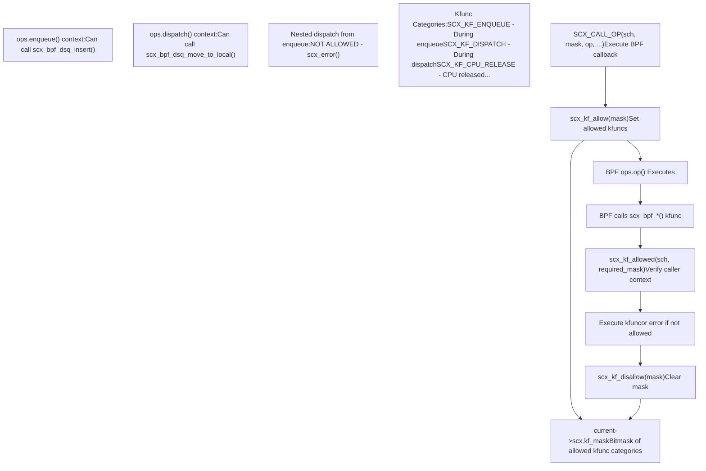
**Nesting Prevention**: The kfunc mask enforces nesting boundaries. For example, dispatch operations cannot be called from within an enqueue callback that's nested inside a dispatch operation. This prevents unbounded recursion and ensures predictable scheduler behavior.

**Verification**: When a BPF kfunc like `scx_bpf_dsq_insert()` is called, it checks `scx_kf_allowed(sch, SCX_KF_ENQUEUE)`. If the current operation context doesn't have the required flag set, `scx_error()` is triggered and the scheduler is disabled.

Sources: [kernel/sched/ext.c274-413](https://github.com/torvalds/linux/blob/fcb70a56/kernel/sched/ext.c#L274-L413)

## Safety Mechanisms and Error Handling

sched\_ext includes comprehensive safety mechanisms to detect and recover from misbehaving BPF schedulers.

### Watchdog Timer

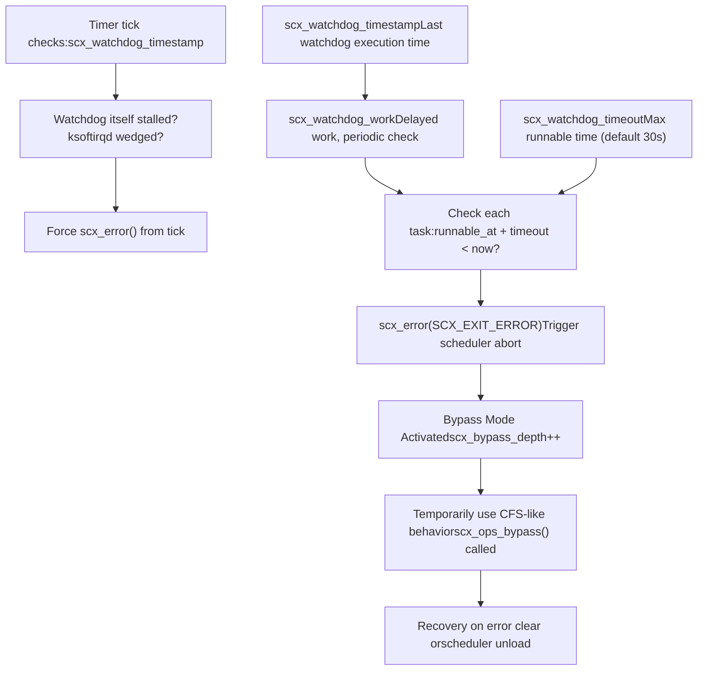
**Watchdog Purpose**: The watchdog ensures system forward progress by detecting tasks that remain runnable for too long without being dispatched. This prevents a buggy BPF scheduler from creating a system hang.

**Bypass Mode**: When an error is detected, sched\_ext enters "bypass mode" where it uses a simplified fallback scheduling policy. This allows the system to remain operational while the problematic BPF scheduler is unloaded or debugged.

Sources: [kernel/sched/ext.c66-76](https://github.com/torvalds/linux/blob/fcb70a56/kernel/sched/ext.c#L66-L76) [kernel/sched/ext.c4800-5000](https://github.com/torvalds/linux/blob/fcb70a56/kernel/sched/ext.c#L4800-L5000)

### Error Reporting and Recovery

Error conditions trigger scheduler disablement:

| Error Type | Trigger | Handler | Recovery |
| --- | --- | --- | --- |
| **Invalid CPU** | BPF returns invalid CPU ID | `ops_cpu_valid()` | `scx_error()`, enter bypass |
| **Invalid errno** | BPF returns out-of-range error | `ops_sanitize_err()` | `scx_error()`, map to -EPROTO |
| **Kfunc violation** | Kfunc called in wrong context | `scx_kf_allowed()` | `scx_error()`, detailed message |
| **Watchdog timeout** | Task runnable too long | `scx_watchdog_work()` | `scx_error()`, dump task info |
| **DSQ corruption** | Invalid DSQ state | Various checks | `WARN_ON_ONCE()`, `scx_error()` |

**Error Information**: When `scx_error()` is triggered, the error message is stored in `scx_exit_info` and exposed via `/sys/kernel/sched_ext/` for debugging. The BPF scheduler can also provide custom exit messages via `scx_bpf_exit_bstr()`.

Sources: [kernel/sched/ext.c770-810](https://github.com/torvalds/linux/blob/fcb70a56/kernel/sched/ext.c#L770-L810) [kernel/sched/ext.c199-217](https://github.com/torvalds/linux/blob/fcb70a56/kernel/sched/ext.c#L199-L217)

## Integration with Core Scheduler

sched\_ext integrates into the core scheduler as a regular scheduling class, interacting with other classes and core scheduling features.

### Task State Transitions

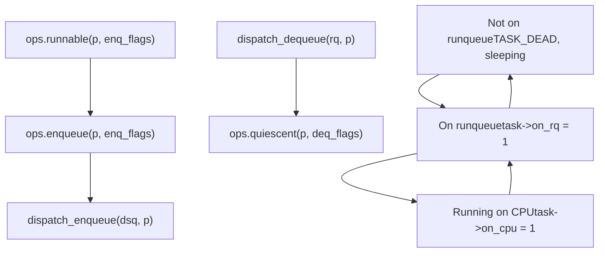
**State Consistency**: The `ops_state` field ensures atomicity. During enqueue, it's set to `SCX_OPSS_QUEUEING`; during dispatch, to `SCX_OPSS_DISPATCHING`. This prevents race conditions when the BPF scheduler and core scheduler operate on the same task concurrently.

Sources: [kernel/sched/ext.c1400-1600](https://github.com/torvalds/linux/blob/fcb70a56/kernel/sched/ext.c#L1400-L1600) [kernel/sched/ext.c2100-2300](https://github.com/torvalds/linux/blob/fcb70a56/kernel/sched/ext.c#L2100-L2300)

### Core Scheduling Support

sched\_ext supports Linux's core scheduling feature, which ensures that only trusted tasks run simultaneously on SMT siblings:

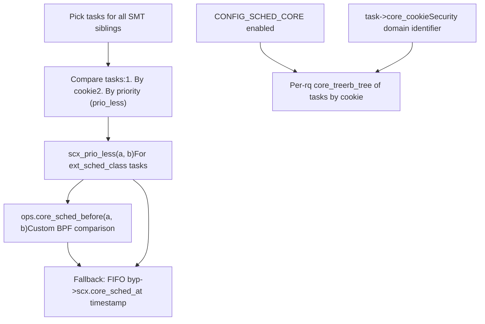
**Custom Core-Sched Ordering**: BPF schedulers can implement `ops.core_sched_before()` to define custom task priority for core scheduling. If not provided, sched\_ext uses FIFO ordering based on the timestamp when the task was last dispatched.

Sources: [kernel/sched/core.c254-260](https://github.com/torvalds/linux/blob/fcb70a56/kernel/sched/core.c#L254-L260) [kernel/sched/ext.c900-945](https://github.com/torvalds/linux/blob/fcb70a56/kernel/sched/ext.c#L900-L945)

## Example Schedulers

The Linux kernel tree includes several example BPF schedulers demonstrating different scheduling strategies:

### scx\_qmap - Priority Queue Scheduler

**Implementation**: Five FIFO queues (using `BPF_MAP_TYPE_QUEUE`) with different priorities. Tasks are assigned to queues based on weight, and CPUs round-robin through queues, dispatching more from higher-priority queues.

**Key Features**:

-   Demonstrates BPF-side queueing using PIDs
-   Shows sleepable per-task storage allocation
-   Implements `ops.cpu_release()` for preemption handling

Sources: [tools/sched\_ext/scx\_qmap.bpf.c1-700](https://github.com/torvalds/linux/blob/fcb70a56/tools/sched_ext/scx_qmap.bpf.c#L1-L700)

### scx\_central - Centralized Scheduling

**Implementation**: Single CPU makes all scheduling decisions, dispatching work to other CPUs. Demonstrates extreme centralization for testing purposes.

**Key Features**:

-   Central CPU uses `ops.dispatch()` to move work to remote CPUs
-   Shows `scx_bpf_kick_cpu()` for remote CPU wake-ups
-   Tests global decision-making with local dispatch

Sources: [tools/sched\_ext/scx\_central.bpf.c1-500](https://github.com/torvalds/linux/blob/fcb70a56/tools/sched_ext/scx_central.bpf.c#L1-L500)

### scx\_flatcg - Flat Cgroup Scheduler

**Implementation**: Flattens cgroup hierarchy into single layer, implementing hierarchical weight-based CPU control through weight compounding.

**Key Features**:

-   Demonstrates cgroup integration (`scx_bpf_task_cgroup()`)
-   Shows virtual time (vtime) based scheduling for fairness
-   Implements hierarchical weight calculation

Sources: [tools/sched\_ext/scx\_flatcg.bpf.c1-900](https://github.com/torvalds/linux/blob/fcb70a56/tools/sched_ext/scx_flatcg.bpf.c#L1-L900)

## Performance Considerations

### Fast Paths and Optimizations

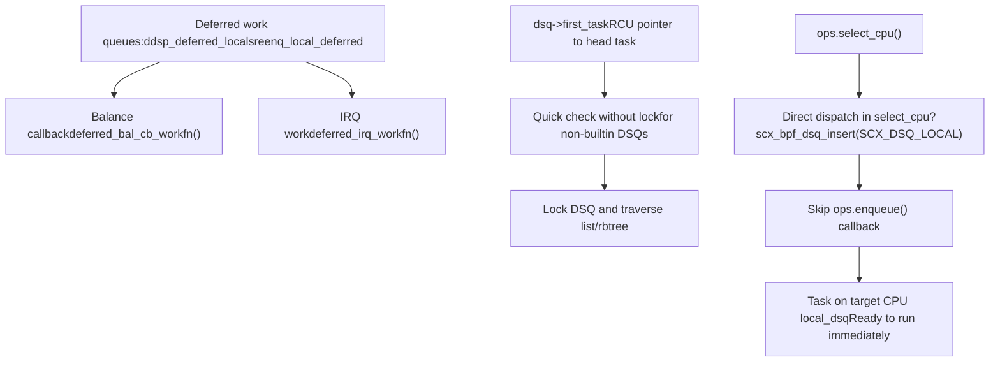
**Direct Dispatch**: The most efficient path is when `ops.select_cpu()` immediately dispatches to the target CPU's local DSQ. This avoids the `ops.enqueue()` and later `ops.dispatch()` callbacks entirely, reducing overhead for latency-sensitive tasks.

**RCU-Protected First Task**: For custom DSQs, `dsq->first_task` provides an RCU-protected pointer to the first task, enabling lock-free peeking. This is used by BPF schedulers to quickly check if a DSQ has work without acquiring locks.

Sources: [kernel/sched/ext.c1800-1900](https://github.com/torvalds/linux/blob/fcb70a56/kernel/sched/ext.c#L1800-L1900) [kernel/sched/ext.c1141-1146](https://github.com/torvalds/linux/blob/fcb70a56/kernel/sched/ext.c#L1141-L1146)

### Scalability Features

| Feature | Benefit | Implementation |
| --- | --- | --- |
| **Per-CPU Local DSQs** | Eliminates contention for common case | `rq->scx.local_dsq`, lockless for local CPU |
| **NUMA-aware Global DSQs** | Reduces cross-node traffic | `global_dsqs[node]` with `SCX_OPS_BUILTIN_IDLE_PER_NODE` |
| **Custom DSQ Partitioning** | Allows BPF to implement hierarchies | BPF creates per-entity or per-group DSQs |
| **Batch Dispatch** | Amortizes dispatch overhead | `scx_dsp_max_batch` controls batch size |
| **Lockless DSQ Iteration** | Reduces contention during rebalancing | BPF iterator with RCU protection |

Sources: [kernel/sched/ext.c37-50](https://github.com/torvalds/linux/blob/fcb70a56/kernel/sched/ext.c#L37-L50) [kernel/sched/ext\_idle.c18-63](https://github.com/torvalds/linux/blob/fcb70a56/kernel/sched/ext_idle.c#L18-L63)

---

This document provides a comprehensive overview of Linux process scheduling with emphasis on the sched\_ext extensible scheduler class. For details on specific scheduling policies (CFS, SCHED\_DEADLINE), see their respective implementation files. For observability and debugging of scheduler behavior, see [Tracing and Observability](/torvalds/linux/4.2-tracing-and-observability).
