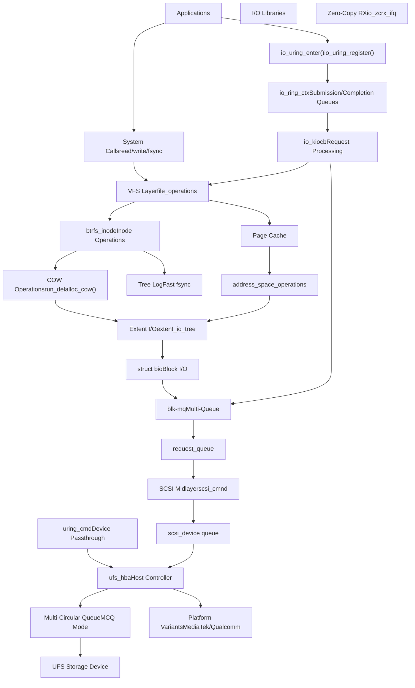
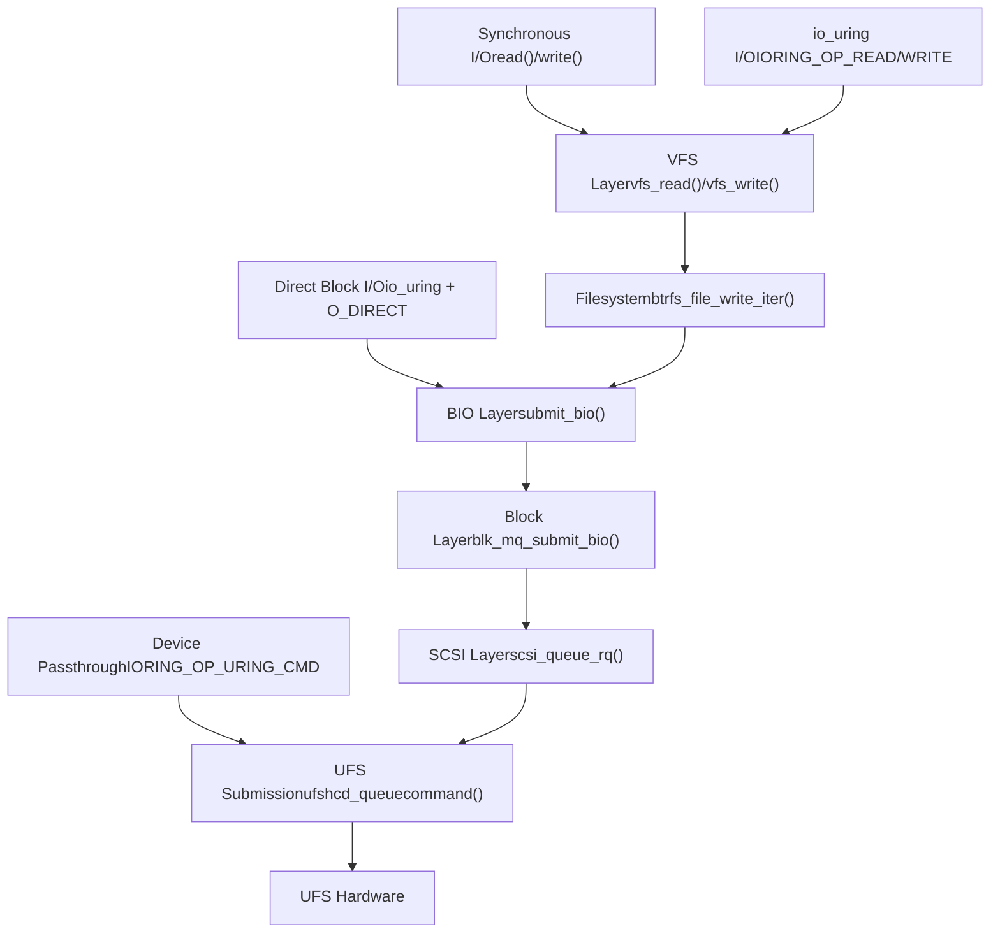
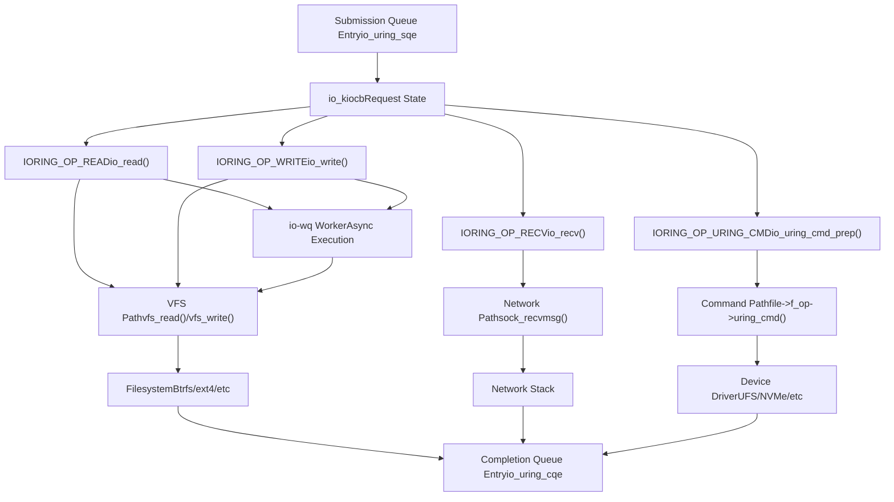
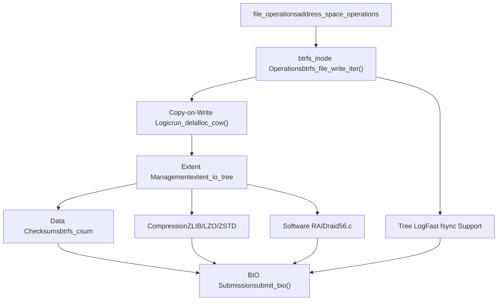
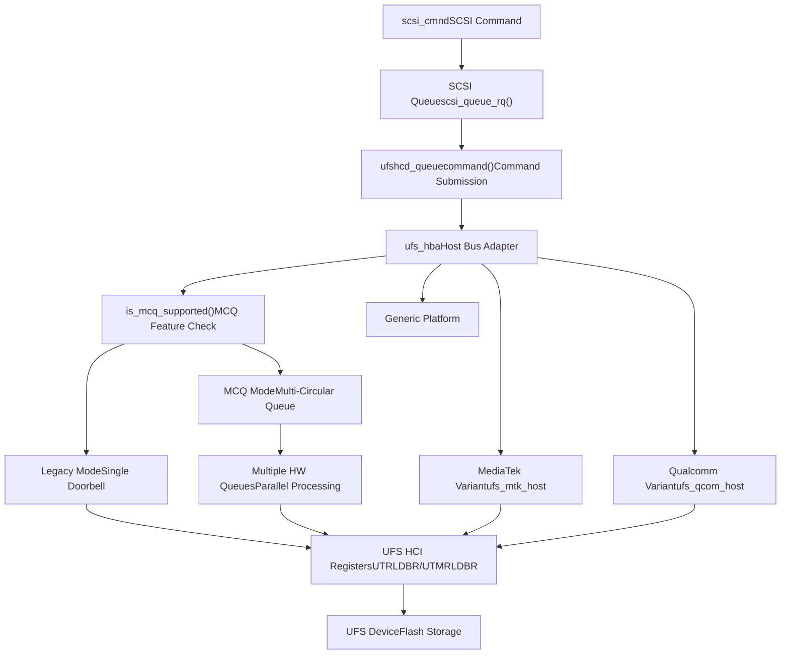
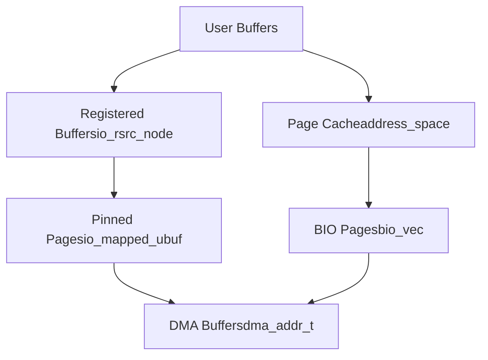

# Storage and I/O

Relevant source files

-   [Documentation/ABI/testing/sysfs-driver-ufs](https://github.com/torvalds/linux/blob/fcb70a56/Documentation/ABI/testing/sysfs-driver-ufs)
-   [Documentation/networking/iou-zcrx.rst](https://github.com/torvalds/linux/blob/fcb70a56/Documentation/networking/iou-zcrx.rst)
-   [drivers/nvme/host/ioctl.c](https://github.com/torvalds/linux/blob/fcb70a56/drivers/nvme/host/ioctl.c)
-   [drivers/ufs/core/ufs-mcq.c](https://github.com/torvalds/linux/blob/fcb70a56/drivers/ufs/core/ufs-mcq.c)
-   [drivers/ufs/core/ufs-sysfs.c](https://github.com/torvalds/linux/blob/fcb70a56/drivers/ufs/core/ufs-sysfs.c)
-   [drivers/ufs/core/ufs-sysfs.h](https://github.com/torvalds/linux/blob/fcb70a56/drivers/ufs/core/ufs-sysfs.h)
-   [drivers/ufs/core/ufs\_bsg.c](https://github.com/torvalds/linux/blob/fcb70a56/drivers/ufs/core/ufs_bsg.c)
-   [drivers/ufs/core/ufs\_trace.h](https://github.com/torvalds/linux/blob/fcb70a56/drivers/ufs/core/ufs_trace.h)
-   [drivers/ufs/core/ufs\_trace\_types.h](https://github.com/torvalds/linux/blob/fcb70a56/drivers/ufs/core/ufs_trace_types.h)
-   [drivers/ufs/core/ufshcd-crypto.c](https://github.com/torvalds/linux/blob/fcb70a56/drivers/ufs/core/ufshcd-crypto.c)
-   [drivers/ufs/core/ufshcd-crypto.h](https://github.com/torvalds/linux/blob/fcb70a56/drivers/ufs/core/ufshcd-crypto.h)
-   [drivers/ufs/core/ufshcd-priv.h](https://github.com/torvalds/linux/blob/fcb70a56/drivers/ufs/core/ufshcd-priv.h)
-   [drivers/ufs/core/ufshcd.c](https://github.com/torvalds/linux/blob/fcb70a56/drivers/ufs/core/ufshcd.c)
-   [drivers/ufs/host/Kconfig](https://github.com/torvalds/linux/blob/fcb70a56/drivers/ufs/host/Kconfig)
-   [drivers/ufs/host/Makefile](https://github.com/torvalds/linux/blob/fcb70a56/drivers/ufs/host/Makefile)
-   [drivers/ufs/host/cdns-pltfrm.c](https://github.com/torvalds/linux/blob/fcb70a56/drivers/ufs/host/cdns-pltfrm.c)
-   [drivers/ufs/host/tc-dwc-g210-pci.c](https://github.com/torvalds/linux/blob/fcb70a56/drivers/ufs/host/tc-dwc-g210-pci.c)
-   [drivers/ufs/host/tc-dwc-g210-pltfrm.c](https://github.com/torvalds/linux/blob/fcb70a56/drivers/ufs/host/tc-dwc-g210-pltfrm.c)
-   [drivers/ufs/host/ti-j721e-ufs.c](https://github.com/torvalds/linux/blob/fcb70a56/drivers/ufs/host/ti-j721e-ufs.c)
-   [drivers/ufs/host/ufs-amd-versal2.c](https://github.com/torvalds/linux/blob/fcb70a56/drivers/ufs/host/ufs-amd-versal2.c)
-   [drivers/ufs/host/ufs-exynos.c](https://github.com/torvalds/linux/blob/fcb70a56/drivers/ufs/host/ufs-exynos.c)
-   [drivers/ufs/host/ufs-exynos.h](https://github.com/torvalds/linux/blob/fcb70a56/drivers/ufs/host/ufs-exynos.h)
-   [drivers/ufs/host/ufs-hisi.c](https://github.com/torvalds/linux/blob/fcb70a56/drivers/ufs/host/ufs-hisi.c)
-   [drivers/ufs/host/ufs-mediatek.c](https://github.com/torvalds/linux/blob/fcb70a56/drivers/ufs/host/ufs-mediatek.c)
-   [drivers/ufs/host/ufs-mediatek.h](https://github.com/torvalds/linux/blob/fcb70a56/drivers/ufs/host/ufs-mediatek.h)
-   [drivers/ufs/host/ufs-qcom.c](https://github.com/torvalds/linux/blob/fcb70a56/drivers/ufs/host/ufs-qcom.c)
-   [drivers/ufs/host/ufs-qcom.h](https://github.com/torvalds/linux/blob/fcb70a56/drivers/ufs/host/ufs-qcom.h)
-   [drivers/ufs/host/ufs-renesas.c](https://github.com/torvalds/linux/blob/fcb70a56/drivers/ufs/host/ufs-renesas.c)
-   [drivers/ufs/host/ufs-sprd.c](https://github.com/torvalds/linux/blob/fcb70a56/drivers/ufs/host/ufs-sprd.c)
-   [drivers/ufs/host/ufshcd-dwc.h](https://github.com/torvalds/linux/blob/fcb70a56/drivers/ufs/host/ufshcd-dwc.h)
-   [drivers/ufs/host/ufshcd-pci.c](https://github.com/torvalds/linux/blob/fcb70a56/drivers/ufs/host/ufshcd-pci.c)
-   [drivers/ufs/host/ufshcd-pltfrm.c](https://github.com/torvalds/linux/blob/fcb70a56/drivers/ufs/host/ufshcd-pltfrm.c)
-   [drivers/ufs/host/ufshcd-pltfrm.h](https://github.com/torvalds/linux/blob/fcb70a56/drivers/ufs/host/ufshcd-pltfrm.h)
-   [fs/afs/callback.c](https://github.com/torvalds/linux/blob/fcb70a56/fs/afs/callback.c)
-   [fs/btrfs/accessors.h](https://github.com/torvalds/linux/blob/fcb70a56/fs/btrfs/accessors.h)
-   [fs/btrfs/backref.c](https://github.com/torvalds/linux/blob/fcb70a56/fs/btrfs/backref.c)
-   [fs/btrfs/bio.c](https://github.com/torvalds/linux/blob/fcb70a56/fs/btrfs/bio.c)
-   [fs/btrfs/bio.h](https://github.com/torvalds/linux/blob/fcb70a56/fs/btrfs/bio.h)
-   [fs/btrfs/block-group.c](https://github.com/torvalds/linux/blob/fcb70a56/fs/btrfs/block-group.c)
-   [fs/btrfs/block-group.h](https://github.com/torvalds/linux/blob/fcb70a56/fs/btrfs/block-group.h)
-   [fs/btrfs/btrfs\_inode.h](https://github.com/torvalds/linux/blob/fcb70a56/fs/btrfs/btrfs_inode.h)
-   [fs/btrfs/compression.c](https://github.com/torvalds/linux/blob/fcb70a56/fs/btrfs/compression.c)
-   [fs/btrfs/compression.h](https://github.com/torvalds/linux/blob/fcb70a56/fs/btrfs/compression.h)
-   [fs/btrfs/ctree.c](https://github.com/torvalds/linux/blob/fcb70a56/fs/btrfs/ctree.c)
-   [fs/btrfs/defrag.c](https://github.com/torvalds/linux/blob/fcb70a56/fs/btrfs/defrag.c)
-   [fs/btrfs/delayed-inode.c](https://github.com/torvalds/linux/blob/fcb70a56/fs/btrfs/delayed-inode.c)
-   [fs/btrfs/delayed-inode.h](https://github.com/torvalds/linux/blob/fcb70a56/fs/btrfs/delayed-inode.h)
-   [fs/btrfs/delayed-ref.c](https://github.com/torvalds/linux/blob/fcb70a56/fs/btrfs/delayed-ref.c)
-   [fs/btrfs/delayed-ref.h](https://github.com/torvalds/linux/blob/fcb70a56/fs/btrfs/delayed-ref.h)
-   [fs/btrfs/dev-replace.c](https://github.com/torvalds/linux/blob/fcb70a56/fs/btrfs/dev-replace.c)
-   [fs/btrfs/dir-item.c](https://github.com/torvalds/linux/blob/fcb70a56/fs/btrfs/dir-item.c)
-   [fs/btrfs/direct-io.c](https://github.com/torvalds/linux/blob/fcb70a56/fs/btrfs/direct-io.c)
-   [fs/btrfs/disk-io.c](https://github.com/torvalds/linux/blob/fcb70a56/fs/btrfs/disk-io.c)
-   [fs/btrfs/disk-io.h](https://github.com/torvalds/linux/blob/fcb70a56/fs/btrfs/disk-io.h)
-   [fs/btrfs/extent-tree.c](https://github.com/torvalds/linux/blob/fcb70a56/fs/btrfs/extent-tree.c)
-   [fs/btrfs/extent-tree.h](https://github.com/torvalds/linux/blob/fcb70a56/fs/btrfs/extent-tree.h)
-   [fs/btrfs/extent\_io.c](https://github.com/torvalds/linux/blob/fcb70a56/fs/btrfs/extent_io.c)
-   [fs/btrfs/extent\_io.h](https://github.com/torvalds/linux/blob/fcb70a56/fs/btrfs/extent_io.h)
-   [fs/btrfs/file-item.c](https://github.com/torvalds/linux/blob/fcb70a56/fs/btrfs/file-item.c)
-   [fs/btrfs/file-item.h](https://github.com/torvalds/linux/blob/fcb70a56/fs/btrfs/file-item.h)
-   [fs/btrfs/file.c](https://github.com/torvalds/linux/blob/fcb70a56/fs/btrfs/file.c)
-   [fs/btrfs/free-space-cache.c](https://github.com/torvalds/linux/blob/fcb70a56/fs/btrfs/free-space-cache.c)
-   [fs/btrfs/free-space-cache.h](https://github.com/torvalds/linux/blob/fcb70a56/fs/btrfs/free-space-cache.h)
-   [fs/btrfs/free-space-tree.c](https://github.com/torvalds/linux/blob/fcb70a56/fs/btrfs/free-space-tree.c)
-   [fs/btrfs/fs.h](https://github.com/torvalds/linux/blob/fcb70a56/fs/btrfs/fs.h)
-   [fs/btrfs/inode-item.c](https://github.com/torvalds/linux/blob/fcb70a56/fs/btrfs/inode-item.c)
-   [fs/btrfs/inode.c](https://github.com/torvalds/linux/blob/fcb70a56/fs/btrfs/inode.c)
-   [fs/btrfs/ioctl.c](https://github.com/torvalds/linux/blob/fcb70a56/fs/btrfs/ioctl.c)
-   [fs/btrfs/messages.c](https://github.com/torvalds/linux/blob/fcb70a56/fs/btrfs/messages.c)
-   [fs/btrfs/messages.h](https://github.com/torvalds/linux/blob/fcb70a56/fs/btrfs/messages.h)
-   [fs/btrfs/misc.h](https://github.com/torvalds/linux/blob/fcb70a56/fs/btrfs/misc.h)
-   [fs/btrfs/ordered-data.c](https://github.com/torvalds/linux/blob/fcb70a56/fs/btrfs/ordered-data.c)
-   [fs/btrfs/qgroup.c](https://github.com/torvalds/linux/blob/fcb70a56/fs/btrfs/qgroup.c)
-   [fs/btrfs/raid-stripe-tree.c](https://github.com/torvalds/linux/blob/fcb70a56/fs/btrfs/raid-stripe-tree.c)
-   [fs/btrfs/raid56.c](https://github.com/torvalds/linux/blob/fcb70a56/fs/btrfs/raid56.c)
-   [fs/btrfs/raid56.h](https://github.com/torvalds/linux/blob/fcb70a56/fs/btrfs/raid56.h)
-   [fs/btrfs/ref-verify.c](https://github.com/torvalds/linux/blob/fcb70a56/fs/btrfs/ref-verify.c)
-   [fs/btrfs/reflink.c](https://github.com/torvalds/linux/blob/fcb70a56/fs/btrfs/reflink.c)
-   [fs/btrfs/relocation.c](https://github.com/torvalds/linux/blob/fcb70a56/fs/btrfs/relocation.c)
-   [fs/btrfs/relocation.h](https://github.com/torvalds/linux/blob/fcb70a56/fs/btrfs/relocation.h)
-   [fs/btrfs/root-tree.c](https://github.com/torvalds/linux/blob/fcb70a56/fs/btrfs/root-tree.c)
-   [fs/btrfs/scrub.c](https://github.com/torvalds/linux/blob/fcb70a56/fs/btrfs/scrub.c)
-   [fs/btrfs/send.c](https://github.com/torvalds/linux/blob/fcb70a56/fs/btrfs/send.c)
-   [fs/btrfs/space-info.c](https://github.com/torvalds/linux/blob/fcb70a56/fs/btrfs/space-info.c)
-   [fs/btrfs/space-info.h](https://github.com/torvalds/linux/blob/fcb70a56/fs/btrfs/space-info.h)
-   [fs/btrfs/subpage.c](https://github.com/torvalds/linux/blob/fcb70a56/fs/btrfs/subpage.c)
-   [fs/btrfs/subpage.h](https://github.com/torvalds/linux/blob/fcb70a56/fs/btrfs/subpage.h)
-   [fs/btrfs/super.c](https://github.com/torvalds/linux/blob/fcb70a56/fs/btrfs/super.c)
-   [fs/btrfs/transaction.c](https://github.com/torvalds/linux/blob/fcb70a56/fs/btrfs/transaction.c)
-   [fs/btrfs/tree-checker.c](https://github.com/torvalds/linux/blob/fcb70a56/fs/btrfs/tree-checker.c)
-   [fs/btrfs/tree-log.c](https://github.com/torvalds/linux/blob/fcb70a56/fs/btrfs/tree-log.c)
-   [fs/btrfs/tree-log.h](https://github.com/torvalds/linux/blob/fcb70a56/fs/btrfs/tree-log.h)
-   [fs/btrfs/volumes.c](https://github.com/torvalds/linux/blob/fcb70a56/fs/btrfs/volumes.c)
-   [fs/btrfs/volumes.h](https://github.com/torvalds/linux/blob/fcb70a56/fs/btrfs/volumes.h)
-   [fs/btrfs/xattr.c](https://github.com/torvalds/linux/blob/fcb70a56/fs/btrfs/xattr.c)
-   [fs/btrfs/zoned.c](https://github.com/torvalds/linux/blob/fcb70a56/fs/btrfs/zoned.c)
-   [include/linux/io\_uring/cmd.h](https://github.com/torvalds/linux/blob/fcb70a56/include/linux/io_uring/cmd.h)
-   [include/linux/io\_uring\_types.h](https://github.com/torvalds/linux/blob/fcb70a56/include/linux/io_uring_types.h)
-   [include/uapi/linux/btrfs.h](https://github.com/torvalds/linux/blob/fcb70a56/include/uapi/linux/btrfs.h)
-   [include/uapi/linux/io\_uring.h](https://github.com/torvalds/linux/blob/fcb70a56/include/uapi/linux/io_uring.h)
-   [include/uapi/linux/io\_uring/query.h](https://github.com/torvalds/linux/blob/fcb70a56/include/uapi/linux/io_uring/query.h)
-   [include/ufs/ufs.h](https://github.com/torvalds/linux/blob/fcb70a56/include/ufs/ufs.h)
-   [include/ufs/ufs\_quirks.h](https://github.com/torvalds/linux/blob/fcb70a56/include/ufs/ufs_quirks.h)
-   [include/ufs/ufshcd.h](https://github.com/torvalds/linux/blob/fcb70a56/include/ufs/ufshcd.h)
-   [include/ufs/ufshci.h](https://github.com/torvalds/linux/blob/fcb70a56/include/ufs/ufshci.h)
-   [include/ufs/unipro.h](https://github.com/torvalds/linux/blob/fcb70a56/include/ufs/unipro.h)
-   [io\_uring/Makefile](https://github.com/torvalds/linux/blob/fcb70a56/io_uring/Makefile)
-   [io\_uring/advise.c](https://github.com/torvalds/linux/blob/fcb70a56/io_uring/advise.c)
-   [io\_uring/alloc\_cache.c](https://github.com/torvalds/linux/blob/fcb70a56/io_uring/alloc_cache.c)
-   [io\_uring/alloc\_cache.h](https://github.com/torvalds/linux/blob/fcb70a56/io_uring/alloc_cache.h)
-   [io\_uring/cancel.c](https://github.com/torvalds/linux/blob/fcb70a56/io_uring/cancel.c)
-   [io\_uring/cancel.h](https://github.com/torvalds/linux/blob/fcb70a56/io_uring/cancel.h)
-   [io\_uring/cmd\_net.c](https://github.com/torvalds/linux/blob/fcb70a56/io_uring/cmd_net.c)
-   [io\_uring/epoll.c](https://github.com/torvalds/linux/blob/fcb70a56/io_uring/epoll.c)
-   [io\_uring/epoll.h](https://github.com/torvalds/linux/blob/fcb70a56/io_uring/epoll.h)
-   [io\_uring/fdinfo.c](https://github.com/torvalds/linux/blob/fcb70a56/io_uring/fdinfo.c)
-   [io\_uring/filetable.c](https://github.com/torvalds/linux/blob/fcb70a56/io_uring/filetable.c)
-   [io\_uring/filetable.h](https://github.com/torvalds/linux/blob/fcb70a56/io_uring/filetable.h)
-   [io\_uring/fs.c](https://github.com/torvalds/linux/blob/fcb70a56/io_uring/fs.c)
-   [io\_uring/futex.c](https://github.com/torvalds/linux/blob/fcb70a56/io_uring/futex.c)
-   [io\_uring/io-wq.c](https://github.com/torvalds/linux/blob/fcb70a56/io_uring/io-wq.c)
-   [io\_uring/io\_uring.c](https://github.com/torvalds/linux/blob/fcb70a56/io_uring/io_uring.c)
-   [io\_uring/io\_uring.h](https://github.com/torvalds/linux/blob/fcb70a56/io_uring/io_uring.h)
-   [io\_uring/kbuf.c](https://github.com/torvalds/linux/blob/fcb70a56/io_uring/kbuf.c)
-   [io\_uring/kbuf.h](https://github.com/torvalds/linux/blob/fcb70a56/io_uring/kbuf.h)
-   [io\_uring/memmap.c](https://github.com/torvalds/linux/blob/fcb70a56/io_uring/memmap.c)
-   [io\_uring/memmap.h](https://github.com/torvalds/linux/blob/fcb70a56/io_uring/memmap.h)
-   [io\_uring/msg\_ring.c](https://github.com/torvalds/linux/blob/fcb70a56/io_uring/msg_ring.c)
-   [io\_uring/net.c](https://github.com/torvalds/linux/blob/fcb70a56/io_uring/net.c)
-   [io\_uring/net.h](https://github.com/torvalds/linux/blob/fcb70a56/io_uring/net.h)
-   [io\_uring/nop.c](https://github.com/torvalds/linux/blob/fcb70a56/io_uring/nop.c)
-   [io\_uring/notif.c](https://github.com/torvalds/linux/blob/fcb70a56/io_uring/notif.c)
-   [io\_uring/opdef.c](https://github.com/torvalds/linux/blob/fcb70a56/io_uring/opdef.c)
-   [io\_uring/openclose.c](https://github.com/torvalds/linux/blob/fcb70a56/io_uring/openclose.c)
-   [io\_uring/poll.c](https://github.com/torvalds/linux/blob/fcb70a56/io_uring/poll.c)
-   [io\_uring/poll.h](https://github.com/torvalds/linux/blob/fcb70a56/io_uring/poll.h)
-   [io\_uring/query.c](https://github.com/torvalds/linux/blob/fcb70a56/io_uring/query.c)
-   [io\_uring/query.h](https://github.com/torvalds/linux/blob/fcb70a56/io_uring/query.h)
-   [io\_uring/register.c](https://github.com/torvalds/linux/blob/fcb70a56/io_uring/register.c)
-   [io\_uring/rsrc.c](https://github.com/torvalds/linux/blob/fcb70a56/io_uring/rsrc.c)
-   [io\_uring/rsrc.h](https://github.com/torvalds/linux/blob/fcb70a56/io_uring/rsrc.h)
-   [io\_uring/rw.c](https://github.com/torvalds/linux/blob/fcb70a56/io_uring/rw.c)
-   [io\_uring/rw.h](https://github.com/torvalds/linux/blob/fcb70a56/io_uring/rw.h)
-   [io\_uring/splice.c](https://github.com/torvalds/linux/blob/fcb70a56/io_uring/splice.c)
-   [io\_uring/sqpoll.c](https://github.com/torvalds/linux/blob/fcb70a56/io_uring/sqpoll.c)
-   [io\_uring/sqpoll.h](https://github.com/torvalds/linux/blob/fcb70a56/io_uring/sqpoll.h)
-   [io\_uring/tctx.c](https://github.com/torvalds/linux/blob/fcb70a56/io_uring/tctx.c)
-   [io\_uring/timeout.c](https://github.com/torvalds/linux/blob/fcb70a56/io_uring/timeout.c)
-   [io\_uring/uring\_cmd.c](https://github.com/torvalds/linux/blob/fcb70a56/io_uring/uring_cmd.c)
-   [io\_uring/uring\_cmd.h](https://github.com/torvalds/linux/blob/fcb70a56/io_uring/uring_cmd.h)
-   [io\_uring/waitid.c](https://github.com/torvalds/linux/blob/fcb70a56/io_uring/waitid.c)
-   [io\_uring/zcrx.c](https://github.com/torvalds/linux/blob/fcb70a56/io_uring/zcrx.c)
-   [io\_uring/zcrx.h](https://github.com/torvalds/linux/blob/fcb70a56/io_uring/zcrx.h)

## Purpose and Scope

This document provides an overview of the Linux kernel's storage and I/O subsystems, covering the path from user-space I/O operations down to physical storage devices. Three major components are documented:

1.  **io\_uring** - Modern asynchronous I/O interface providing low-latency, high-throughput I/O operations
2.  **Btrfs** - Advanced copy-on-write filesystem with features like snapshots, checksumming, and software RAID
3.  **UFS** - Universal Flash Storage host controller driver for mobile and embedded storage devices

For detailed information about each subsystem:

-   io\_uring implementation details: see [io\_uring Asynchronous I/O](/torvalds/linux/5.1-io_uring-asynchronous-io)
-   Btrfs filesystem internals: see [Btrfs Copy-on-Write Filesystem](/torvalds/linux/5.2-btrfs-copy-on-write-filesystem)
-   UFS hardware controller details: see [UFS Storage Controller](/torvalds/linux/5.3-ufs-storage-controller)

This page focuses on how these subsystems integrate within the broader Linux storage stack and their architectural relationships.

## Storage Stack Architecture

The Linux storage stack is organized in layers, each providing abstractions and services to the layer above. The following diagram shows the major components and their relationships:

**Sources:** [io\_uring/io\_uring.c1-1500](https://github.com/torvalds/linux/blob/fcb70a56/io_uring/io_uring.c#L1-L1500) [fs/btrfs/inode.c1-500](https://github.com/torvalds/linux/blob/fcb70a56/fs/btrfs/inode.c#L1-L500) [drivers/ufs/core/ufshcd.c1-500](https://github.com/torvalds/linux/blob/fcb70a56/drivers/ufs/core/ufshcd.c#L1-L500)

## I/O Request Flow

Different I/O paths exist depending on the interface used and the type of operation. The following diagram shows the major data flow paths:

**Sources:** [io\_uring/rw.c1-200](https://github.com/torvalds/linux/blob/fcb70a56/io_uring/rw.c#L1-L200) [fs/btrfs/file.c1-500](https://github.com/torvalds/linux/blob/fcb70a56/fs/btrfs/file.c#L1-L500) [drivers/ufs/core/ufshcd.c1-500](https://github.com/torvalds/linux/blob/fcb70a56/drivers/ufs/core/ufshcd.c#L1-L500)

## Key Data Structures and Their Roles

The following table maps the major data structures to their roles in the storage stack:

| Layer | Structure | Purpose | File Reference |
| --- | --- | --- | --- |
| **io\_uring** | `struct io_ring_ctx` | Per-ring context, manages submission/completion queues | [io\_uring/io\_uring.c284-366](https://github.com/torvalds/linux/blob/fcb70a56/io_uring/io_uring.c#L284-L366) |
| **io\_uring** | `struct io_kiocb` | Individual I/O request control block | [include/linux/io\_uring\_types.h](https://github.com/torvalds/linux/blob/fcb70a56/include/linux/io_uring_types.h) |
| **io\_uring** | `struct io_zcrx_ifq` | Zero-copy receive interface queue | [io\_uring/zcrx.c479-493](https://github.com/torvalds/linux/blob/fcb70a56/io_uring/zcrx.c#L479-L493) |
| **VFS** | `struct file_operations` | Filesystem-specific file operations | Throughout VFS |
| **Btrfs** | `struct btrfs_inode` | Btrfs-specific inode structure | [fs/btrfs/inode.c80-83](https://github.com/torvalds/linux/blob/fcb70a56/fs/btrfs/inode.c#L80-L83) |
| **Btrfs** | `struct extent_io_tree` | Tracks extent state (delalloc, dirty, etc.) | [fs/btrfs/extent\_io.c](https://github.com/torvalds/linux/blob/fcb70a56/fs/btrfs/extent_io.c) |
| **Btrfs** | `struct btrfs_ordered_extent` | Manages ordered writes for consistency | [fs/btrfs/inode.c401-427](https://github.com/torvalds/linux/blob/fcb70a56/fs/btrfs/inode.c#L401-L427) |
| **Block** | `struct bio` | Block I/O request descriptor | Throughout block layer |
| **Block** | `struct request_queue` | Block device queue management | Throughout block layer |
| **SCSI** | `struct scsi_cmnd` | SCSI command descriptor | [drivers/ufs/core/ufshcd.c28](https://github.com/torvalds/linux/blob/fcb70a56/drivers/ufs/core/ufshcd.c#L28-L28) |
| **UFS** | `struct ufs_hba` | UFS host bus adapter state | [include/ufs/ufshcd.h](https://github.com/torvalds/linux/blob/fcb70a56/include/ufs/ufshcd.h) |
| **UFS** | `struct utp_transfer_req_desc` | UFS transfer request descriptor | [drivers/ufs/core/ufshcd.c616](https://github.com/torvalds/linux/blob/fcb70a56/drivers/ufs/core/ufshcd.c#L616-L616) |

**Sources:** [io\_uring/io\_uring.c284-366](https://github.com/torvalds/linux/blob/fcb70a56/io_uring/io_uring.c#L284-L366) [fs/btrfs/inode.c1-200](https://github.com/torvalds/linux/blob/fcb70a56/fs/btrfs/inode.c#L1-L200) [drivers/ufs/core/ufshcd.c1-200](https://github.com/torvalds/linux/blob/fcb70a56/drivers/ufs/core/ufshcd.c#L1-L200) [include/ufs/ufshcd.h1-100](https://github.com/torvalds/linux/blob/fcb70a56/include/ufs/ufshcd.h#L1-L100)

## io\_uring Integration Points

io\_uring provides multiple paths to interact with the storage stack, offering flexibility and performance optimization:

**Sources:** [io\_uring/io\_uring.c138-505](https://github.com/torvalds/linux/blob/fcb70a56/io_uring/io_uring.c#L138-L505) [io\_uring/rw.c1-300](https://github.com/torvalds/linux/blob/fcb70a56/io_uring/rw.c#L1-L300) [io\_uring/net.c1-200](https://github.com/torvalds/linux/blob/fcb70a56/io_uring/net.c#L1-L200) [io\_uring/uring\_cmd.c1-200](https://github.com/torvalds/linux/blob/fcb70a56/io_uring/uring_cmd.c#L1-L200)

### Zero-Copy Networking

io\_uring includes a zero-copy receive path (`ZCRX`) that bypasses traditional kernel buffering for high-performance networking:

-   **Interface Queue Management**: `struct io_zcrx_ifq` manages per-queue state [io\_uring/zcrx.c479-493](https://github.com/torvalds/linux/blob/fcb70a56/io_uring/zcrx.c#L479-L493)
-   **Memory Areas**: `struct io_zcrx_area` represents DMA-capable memory regions [io\_uring/zcrx.c409-478](https://github.com/torvalds/linux/blob/fcb70a56/io_uring/zcrx.c#L409-L478)
-   **Network Integration**: Direct integration with `page_pool` for zero-copy packet reception [io\_uring/zcrx.c35-56](https://github.com/torvalds/linux/blob/fcb70a56/io_uring/zcrx.c#L35-L56)

**Sources:** [io\_uring/zcrx.c1-850](https://github.com/torvalds/linux/blob/fcb70a56/io_uring/zcrx.c#L1-L850)

## Btrfs Filesystem Layer

Btrfs sits between the VFS layer and the block layer, implementing advanced filesystem features:

**Sources:** [fs/btrfs/inode.c1-1000](https://github.com/torvalds/linux/blob/fcb70a56/fs/btrfs/inode.c#L1-L1000) [fs/btrfs/extent\_io.c1-500](https://github.com/torvalds/linux/blob/fcb70a56/fs/btrfs/extent_io.c#L1-L500) [fs/btrfs/tree-log.c1-500](https://github.com/torvalds/linux/blob/fcb70a56/fs/btrfs/tree-log.c#L1-L500)

### Write Path in Btrfs

The Btrfs write path implements copy-on-write semantics with several optimization strategies:

1.  **Inline Extents**: Small files stored directly in B-tree metadata [fs/btrfs/inode.c458-566](https://github.com/torvalds/linux/blob/fcb70a56/fs/btrfs/inode.c#L458-L566)
2.  **Delalloc**: Delayed allocation for better contiguous allocation [fs/btrfs/inode.c401-427](https://github.com/torvalds/linux/blob/fcb70a56/fs/btrfs/inode.c#L401-L427)
3.  **Compression**: Transparent compression during write [fs/btrfs/inode.c521-538](https://github.com/torvalds/linux/blob/fcb70a56/fs/btrfs/inode.c#L521-L538)
4.  **COW Processing**: `run_delalloc_cow()` handles actual copy-on-write [fs/btrfs/inode.c123-126](https://github.com/torvalds/linux/blob/fcb70a56/fs/btrfs/inode.c#L123-L126)

### Tree Logging for Fast fsync

Btrfs provides fast fsync through a tree logging mechanism that avoids full transaction commits:

-   **Log Tree**: Separate B-tree for tracking changes [fs/btrfs/tree-log.c111-170](https://github.com/torvalds/linux/blob/fcb70a56/fs/btrfs/tree-log.c#L111-L170)
-   **Log Replay**: Recovery process after crashes [fs/btrfs/tree-log.c99-104](https://github.com/torvalds/linux/blob/fcb70a56/fs/btrfs/tree-log.c#L99-L104)
-   **Optimization**: Only logs changed inodes and directories [fs/btrfs/tree-log.c228-235](https://github.com/torvalds/linux/blob/fcb70a56/fs/btrfs/tree-log.c#L228-L235)

**Sources:** [fs/btrfs/tree-log.c1-500](https://github.com/torvalds/linux/blob/fcb70a56/fs/btrfs/tree-log.c#L1-L500) [fs/btrfs/inode.c123-753](https://github.com/torvalds/linux/blob/fcb70a56/fs/btrfs/inode.c#L123-L753)

## UFS Storage Controller

The UFS (Universal Flash Storage) driver manages high-performance flash storage in mobile and embedded devices:

**Sources:** [drivers/ufs/core/ufshcd.c1-500](https://github.com/torvalds/linux/blob/fcb70a56/drivers/ufs/core/ufshcd.c#L1-L500) [drivers/ufs/host/ufs-mediatek.c1-300](https://github.com/torvalds/linux/blob/fcb70a56/drivers/ufs/host/ufs-mediatek.c#L1-L300) [drivers/ufs/host/ufs-qcom.c1-300](https://github.com/torvalds/linux/blob/fcb70a56/drivers/ufs/host/ufs-qcom.c#L1-L300)

### Multi-Circular Queue (MCQ) Mode

Modern UFS controllers support MCQ mode for improved parallelism:

-   **Feature Detection**: `is_mcq_supported()` checks controller capabilities [drivers/ufs/core/ufshcd.c113-116](https://github.com/torvalds/linux/blob/fcb70a56/drivers/ufs/core/ufshcd.c#L113-L116)
-   **Module Parameter**: `use_mcq_mode` controls MCQ usage [drivers/ufs/core/ufshcd.c111-119](https://github.com/torvalds/linux/blob/fcb70a56/drivers/ufs/core/ufshcd.c#L111-L119)
-   **Multiple Queues**: Each queue has independent submission and completion handling
-   **Queue Configuration**: Platform-specific queue configuration [drivers/ufs/host/ufs-mediatek.c31-40](https://github.com/torvalds/linux/blob/fcb70a56/drivers/ufs/host/ufs-mediatek.c#L31-L40)

### Platform-Specific Implementations

UFS drivers use a variant interface for platform-specific behavior:

| Platform | Variant Structure | Key Features | File |
| --- | --- | --- | --- |
| MediaTek | `struct ufs_mtk_host` | Clock scaling, crypto engine, power control | [drivers/ufs/host/ufs-mediatek.c96-153](https://github.com/torvalds/linux/blob/fcb70a56/drivers/ufs/host/ufs-mediatek.c#L96-L153) |
| Qualcomm | `struct ufs_qcom_host` | ICE crypto, interconnect bandwidth, PHY management | [drivers/ufs/host/ufs-qcom.c1-150](https://github.com/torvalds/linux/blob/fcb70a56/drivers/ufs/host/ufs-qcom.c#L1-L150) |
| Generic | Standard UFSHCI | Basic UFS specification compliance | [drivers/ufs/core/ufshcd.c](https://github.com/torvalds/linux/blob/fcb70a56/drivers/ufs/core/ufshcd.c) |

**Sources:** [drivers/ufs/host/ufs-mediatek.c1-500](https://github.com/torvalds/linux/blob/fcb70a56/drivers/ufs/host/ufs-mediatek.c#L1-L500) [drivers/ufs/host/ufs-qcom.c1-200](https://github.com/torvalds/linux/blob/fcb70a56/drivers/ufs/host/ufs-qcom.c#L1-L200)

## Performance Optimization Patterns

Several common patterns optimize I/O performance across the storage stack:

### 1\. Batching and Aggregation

-   **io\_uring**: Batch multiple operations in submission queue [io\_uring/io\_uring.c123-124](https://github.com/torvalds/linux/blob/fcb70a56/io_uring/io_uring.c#L123-L124)
-   **Block Layer**: `blk-mq` aggregates requests to hardware queues
-   **UFS**: Interrupt aggregation reduces interrupt overhead [drivers/ufs/core/ufshcd.c89-90](https://github.com/torvalds/linux/blob/fcb70a56/drivers/ufs/core/ufshcd.c#L89-L90)

### 2\. Zero-Copy Techniques

-   **io\_uring ZCRX**: Zero-copy receive for networking [io\_uring/zcrx.c1-850](https://github.com/torvalds/linux/blob/fcb70a56/io_uring/zcrx.c#L1-L850)
-   **Direct I/O**: Bypass page cache with `O_DIRECT` flag
-   **DMA Buffers**: Direct memory access for UFS transfers [io\_uring/zcrx.c58-87](https://github.com/torvalds/linux/blob/fcb70a56/io_uring/zcrx.c#L58-L87)

### 3\. Asynchronous Execution

-   **io\_uring**: Native async I/O with completion notification [io\_uring/io\_uring.c467-505](https://github.com/torvalds/linux/blob/fcb70a56/io_uring/io_uring.c#L467-L505)
-   **io-wq**: Worker threads for blocking operations [io\_uring/io\_uring.c467-493](https://github.com/torvalds/linux/blob/fcb70a56/io_uring/io_uring.c#L467-L493)
-   **Btrfs**: Delayed allocation and async writeback [fs/btrfs/inode.c401-427](https://github.com/torvalds/linux/blob/fcb70a56/fs/btrfs/inode.c#L401-L427)

### 4\. Hardware Parallelism

-   **blk-mq**: Multiple hardware queue support
-   **UFS MCQ**: Multiple circular queues for concurrent commands [drivers/ufs/core/ufshcd.c111-119](https://github.com/torvalds/linux/blob/fcb70a56/drivers/ufs/core/ufshcd.c#L111-L119)
-   **io\_uring**: Per-CPU submission queues reduce contention

**Sources:** [io\_uring/io\_uring.c1-500](https://github.com/torvalds/linux/blob/fcb70a56/io_uring/io_uring.c#L1-L500) [io\_uring/zcrx.c1-300](https://github.com/torvalds/linux/blob/fcb70a56/io_uring/zcrx.c#L1-L300) [drivers/ufs/core/ufshcd.c1-300](https://github.com/torvalds/linux/blob/fcb70a56/drivers/ufs/core/ufshcd.c#L1-L300)

## Resource Management

The storage stack implements sophisticated resource management to balance performance and memory usage:

### Memory Accounting

-   **io\_uring**: User memory pinning and accounting [io\_uring/rsrc.c39-84](https://github.com/torvalds/linux/blob/fcb70a56/io_uring/rsrc.c#L39-L84)
-   **Btrfs**: Page cache and extent buffer management [fs/btrfs/extent\_io.c1-200](https://github.com/torvalds/linux/blob/fcb70a56/fs/btrfs/extent_io.c#L1-L200)
-   **UFS**: DMA buffer allocation and mapping [drivers/ufs/core/ufshcd.c155-198](https://github.com/torvalds/linux/blob/fcb70a56/drivers/ufs/core/ufshcd.c#L155-L198)

### Buffer Management

**Sources:** [io\_uring/rsrc.c1-500](https://github.com/torvalds/linux/blob/fcb70a56/io_uring/rsrc.c#L1-L500) [fs/btrfs/extent\_io.c1-200](https://github.com/torvalds/linux/blob/fcb70a56/fs/btrfs/extent_io.c#L1-L200)

### Caching Strategies

| Component | Cache Type | Purpose | Reference |
| --- | --- | --- | --- |
| io\_uring | `io_alloc_cache` | Reuse frequently allocated structures | [io\_uring/io\_uring.c274-282](https://github.com/torvalds/linux/blob/fcb70a56/io_uring/io_uring.c#L274-L282) |
| Btrfs | Extent buffer cache | Cache B-tree nodes | [fs/btrfs/extent\_io.c38](https://github.com/torvalds/linux/blob/fcb70a56/fs/btrfs/extent_io.c#L38-L38) |
| Btrfs | Inode cache | Cache frequently accessed inodes | [fs/btrfs/inode.c118](https://github.com/torvalds/linux/blob/fcb70a56/fs/btrfs/inode.c#L118-L118) |
| VFS | Page cache | Cache file data pages | Throughout VFS |
| UFS | Command descriptor cache | Reuse transfer descriptors | [drivers/ufs/core/ufshcd.c600-639](https://github.com/torvalds/linux/blob/fcb70a56/drivers/ufs/core/ufshcd.c#L600-L639) |

**Sources:** [io\_uring/io\_uring.c274-366](https://github.com/torvalds/linux/blob/fcb70a56/io_uring/io_uring.c#L274-L366) [fs/btrfs/extent\_io.c1-100](https://github.com/torvalds/linux/blob/fcb70a56/fs/btrfs/extent_io.c#L1-L100) [drivers/ufs/core/ufshcd.c600-700](https://github.com/torvalds/linux/blob/fcb70a56/drivers/ufs/core/ufshcd.c#L600-L700)

## Error Handling and Recovery

Each layer implements error handling appropriate to its level of abstraction:

### io\_uring Error Handling

-   **CQE Result**: Errors returned in completion queue entry [io\_uring/io\_uring.c846-849](https://github.com/torvalds/linux/blob/fcb70a56/io_uring/io_uring.c#L846-L849)
-   **Request Cancellation**: `io_uring_try_cancel_uring_cmd()` for active requests [io\_uring/uring\_cmd.c49-75](https://github.com/torvalds/linux/blob/fcb70a56/io_uring/uring_cmd.c#L49-L75)
-   **Timeout Handling**: Per-request timeout support

### Btrfs Error Handling

-   **Checksum Validation**: Detect data corruption [fs/btrfs/inode.c310-339](https://github.com/torvalds/linux/blob/fcb70a56/fs/btrfs/inode.c#L310-L339)
-   **Transaction Abort**: Fail safely on errors [fs/btrfs/tree-log.c172-217](https://github.com/torvalds/linux/blob/fcb70a56/fs/btrfs/tree-log.c#L172-L217)
-   **RAID Recovery**: Recover from device failures [fs/btrfs/extent\_io.c](https://github.com/torvalds/linux/blob/fcb70a56/fs/btrfs/extent_io.c)

### UFS Error Handling

-   **Error Recovery**: Host reset and recovery flows [drivers/ufs/core/ufshcd.c321-331](https://github.com/torvalds/linux/blob/fcb70a56/drivers/ufs/core/ufshcd.c#L321-L331)
-   **Timeout Handling**: Command timeout detection and recovery [drivers/ufs/core/ufshcd.c50-84](https://github.com/torvalds/linux/blob/fcb70a56/drivers/ufs/core/ufshcd.c#L50-L84)
-   **UIC Errors**: Handle UniPro interconnect errors [drivers/ufs/host/ufs-mediatek.c61-94](https://github.com/torvalds/linux/blob/fcb70a56/drivers/ufs/host/ufs-mediatek.c#L61-L94)

**Sources:** [io\_uring/io\_uring.c999-1007](https://github.com/torvalds/linux/blob/fcb70a56/io_uring/io_uring.c#L999-L1007) [fs/btrfs/inode.c310-339](https://github.com/torvalds/linux/blob/fcb70a56/fs/btrfs/inode.c#L310-L339) [drivers/ufs/core/ufshcd.c200-350](https://github.com/torvalds/linux/blob/fcb70a56/drivers/ufs/core/ufshcd.c#L200-L350)

## Summary

The Linux storage and I/O subsystems provide a flexible, high-performance stack:

-   **io\_uring** offers modern asynchronous I/O with minimal syscall overhead and zero-copy capabilities
-   **Btrfs** provides advanced filesystem features with copy-on-write semantics and strong data integrity
-   **UFS** enables high-performance mobile storage with multi-queue support and platform-specific optimizations

These subsystems integrate through well-defined interfaces (VFS, block layer, SCSI) while each optimizes for its specific domain. For detailed information about each subsystem's implementation, refer to their dedicated pages: [io\_uring](/torvalds/linux/5.1-io_uring-asynchronous-io), [Btrfs](/torvalds/linux/5.2-btrfs-copy-on-write-filesystem), and [UFS](/torvalds/linux/5.3-ufs-storage-controller).
