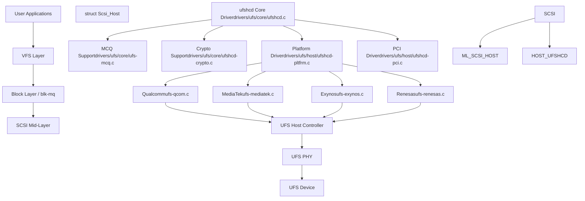
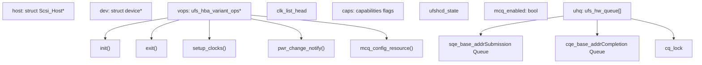
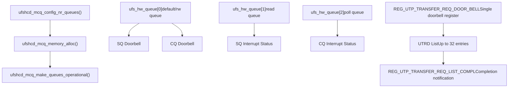
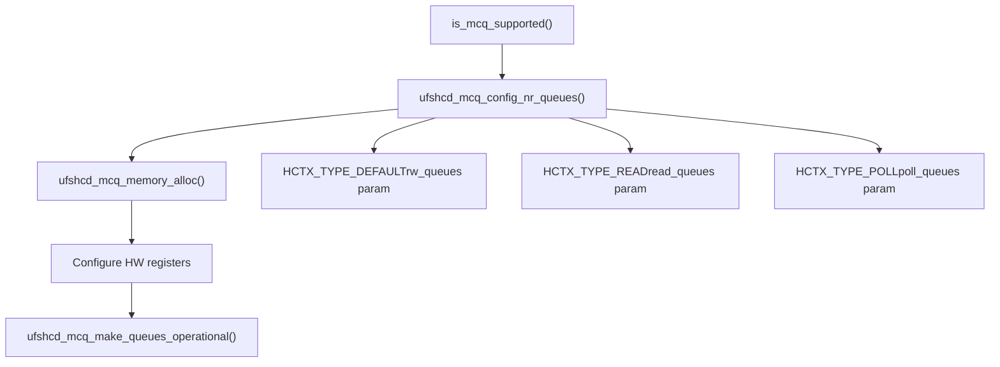
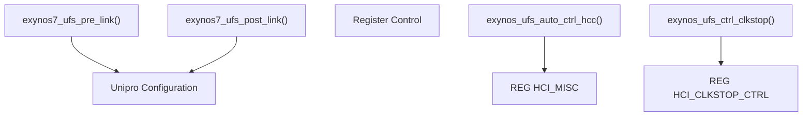
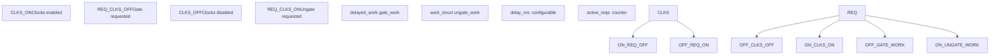
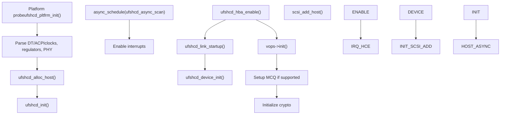
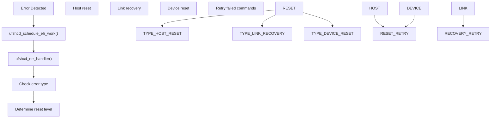
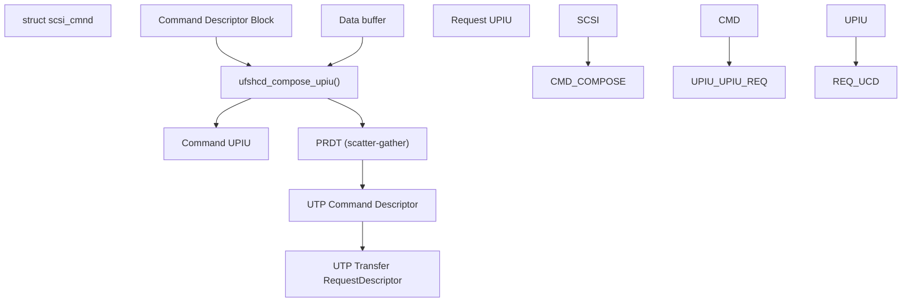

# UFS Storage Controller

Relevant source files

-   [Documentation/ABI/testing/sysfs-driver-ufs](https://github.com/torvalds/linux/blob/fcb70a56/Documentation/ABI/testing/sysfs-driver-ufs)
-   [drivers/ufs/core/ufs-mcq.c](https://github.com/torvalds/linux/blob/fcb70a56/drivers/ufs/core/ufs-mcq.c)
-   [drivers/ufs/core/ufs-sysfs.c](https://github.com/torvalds/linux/blob/fcb70a56/drivers/ufs/core/ufs-sysfs.c)
-   [drivers/ufs/core/ufs-sysfs.h](https://github.com/torvalds/linux/blob/fcb70a56/drivers/ufs/core/ufs-sysfs.h)
-   [drivers/ufs/core/ufs\_bsg.c](https://github.com/torvalds/linux/blob/fcb70a56/drivers/ufs/core/ufs_bsg.c)
-   [drivers/ufs/core/ufs\_trace.h](https://github.com/torvalds/linux/blob/fcb70a56/drivers/ufs/core/ufs_trace.h)
-   [drivers/ufs/core/ufs\_trace\_types.h](https://github.com/torvalds/linux/blob/fcb70a56/drivers/ufs/core/ufs_trace_types.h)
-   [drivers/ufs/core/ufshcd-crypto.c](https://github.com/torvalds/linux/blob/fcb70a56/drivers/ufs/core/ufshcd-crypto.c)
-   [drivers/ufs/core/ufshcd-crypto.h](https://github.com/torvalds/linux/blob/fcb70a56/drivers/ufs/core/ufshcd-crypto.h)
-   [drivers/ufs/core/ufshcd-priv.h](https://github.com/torvalds/linux/blob/fcb70a56/drivers/ufs/core/ufshcd-priv.h)
-   [drivers/ufs/core/ufshcd.c](https://github.com/torvalds/linux/blob/fcb70a56/drivers/ufs/core/ufshcd.c)
-   [drivers/ufs/host/Kconfig](https://github.com/torvalds/linux/blob/fcb70a56/drivers/ufs/host/Kconfig)
-   [drivers/ufs/host/Makefile](https://github.com/torvalds/linux/blob/fcb70a56/drivers/ufs/host/Makefile)
-   [drivers/ufs/host/cdns-pltfrm.c](https://github.com/torvalds/linux/blob/fcb70a56/drivers/ufs/host/cdns-pltfrm.c)
-   [drivers/ufs/host/tc-dwc-g210-pci.c](https://github.com/torvalds/linux/blob/fcb70a56/drivers/ufs/host/tc-dwc-g210-pci.c)
-   [drivers/ufs/host/tc-dwc-g210-pltfrm.c](https://github.com/torvalds/linux/blob/fcb70a56/drivers/ufs/host/tc-dwc-g210-pltfrm.c)
-   [drivers/ufs/host/ti-j721e-ufs.c](https://github.com/torvalds/linux/blob/fcb70a56/drivers/ufs/host/ti-j721e-ufs.c)
-   [drivers/ufs/host/ufs-amd-versal2.c](https://github.com/torvalds/linux/blob/fcb70a56/drivers/ufs/host/ufs-amd-versal2.c)
-   [drivers/ufs/host/ufs-exynos.c](https://github.com/torvalds/linux/blob/fcb70a56/drivers/ufs/host/ufs-exynos.c)
-   [drivers/ufs/host/ufs-exynos.h](https://github.com/torvalds/linux/blob/fcb70a56/drivers/ufs/host/ufs-exynos.h)
-   [drivers/ufs/host/ufs-hisi.c](https://github.com/torvalds/linux/blob/fcb70a56/drivers/ufs/host/ufs-hisi.c)
-   [drivers/ufs/host/ufs-mediatek.c](https://github.com/torvalds/linux/blob/fcb70a56/drivers/ufs/host/ufs-mediatek.c)
-   [drivers/ufs/host/ufs-mediatek.h](https://github.com/torvalds/linux/blob/fcb70a56/drivers/ufs/host/ufs-mediatek.h)
-   [drivers/ufs/host/ufs-qcom.c](https://github.com/torvalds/linux/blob/fcb70a56/drivers/ufs/host/ufs-qcom.c)
-   [drivers/ufs/host/ufs-qcom.h](https://github.com/torvalds/linux/blob/fcb70a56/drivers/ufs/host/ufs-qcom.h)
-   [drivers/ufs/host/ufs-renesas.c](https://github.com/torvalds/linux/blob/fcb70a56/drivers/ufs/host/ufs-renesas.c)
-   [drivers/ufs/host/ufs-sprd.c](https://github.com/torvalds/linux/blob/fcb70a56/drivers/ufs/host/ufs-sprd.c)
-   [drivers/ufs/host/ufshcd-dwc.h](https://github.com/torvalds/linux/blob/fcb70a56/drivers/ufs/host/ufshcd-dwc.h)
-   [drivers/ufs/host/ufshcd-pci.c](https://github.com/torvalds/linux/blob/fcb70a56/drivers/ufs/host/ufshcd-pci.c)
-   [drivers/ufs/host/ufshcd-pltfrm.c](https://github.com/torvalds/linux/blob/fcb70a56/drivers/ufs/host/ufshcd-pltfrm.c)
-   [drivers/ufs/host/ufshcd-pltfrm.h](https://github.com/torvalds/linux/blob/fcb70a56/drivers/ufs/host/ufshcd-pltfrm.h)
-   [include/ufs/ufs.h](https://github.com/torvalds/linux/blob/fcb70a56/include/ufs/ufs.h)
-   [include/ufs/ufs\_quirks.h](https://github.com/torvalds/linux/blob/fcb70a56/include/ufs/ufs_quirks.h)
-   [include/ufs/ufshcd.h](https://github.com/torvalds/linux/blob/fcb70a56/include/ufs/ufshcd.h)
-   [include/ufs/ufshci.h](https://github.com/torvalds/linux/blob/fcb70a56/include/ufs/ufshci.h)
-   [include/ufs/unipro.h](https://github.com/torvalds/linux/blob/fcb70a56/include/ufs/unipro.h)

## Purpose and Scope

This document describes the Universal Flash Storage (UFS) host controller driver subsystem in the Linux kernel. UFS is a high-performance storage interface designed for mobile and embedded systems, providing features like command queuing, power management, and inline encryption.

This page covers:

-   The core UFS host controller driver (`ufshcd`)
-   Platform-specific variant implementations (MediaTek, Qualcomm, Exynos, etc.)
-   Multi-Circular Queue (MCQ) architecture for modern UFS controllers
-   Power management and link states
-   Integration with the SCSI and block layers

For asynchronous I/O mechanisms that use UFS storage, see [io\_uring Asynchronous I/O](/torvalds/linux/5.1-io_uring-asynchronous-io). For filesystem implementations on top of block devices, see [Btrfs Copy-on-Write Filesystem](/torvalds/linux/5.2-btrfs-copy-on-write-filesystem).

Sources: [drivers/ufs/core/ufshcd.c1-50](https://github.com/torvalds/linux/blob/fcb70a56/drivers/ufs/core/ufshcd.c#L1-L50) [include/ufs/ufshcd.h1-30](https://github.com/torvalds/linux/blob/fcb70a56/include/ufs/ufshcd.h#L1-L30)

## Architecture Overview

### Layer Stack

The UFS subsystem sits between the SCSI layer and the hardware, managing UFS host controllers and their platform-specific quirks.


Sources: [drivers/ufs/core/ufshcd.c1-50](https://github.com/torvalds/linux/blob/fcb70a56/drivers/ufs/core/ufshcd.c#L1-L50) [drivers/ufs/host/ufshcd-pltfrm.c1-30](https://github.com/torvalds/linux/blob/fcb70a56/drivers/ufs/host/ufshcd-pltfrm.c#L1-L30) [include/ufs/ufshcd.h31-40](https://github.com/torvalds/linux/blob/fcb70a56/include/ufs/ufshcd.h#L31-L40)

## Core Components

### Main Host Controller Structure

The `struct ufs_hba` is the central data structure representing a UFS host controller instance. It contains all state, configuration, and operational data.


Sources: [include/ufs/ufshcd.h519-789](https://github.com/torvalds/linux/blob/fcb70a56/include/ufs/ufshcd.h#L519-L789) [drivers/ufs/core/ufshcd.c200-250](https://github.com/torvalds/linux/blob/fcb70a56/drivers/ufs/core/ufshcd.c#L200-L250)

### Variant Operations Pattern

The UFS subsystem uses the `ufs_hba_variant_ops` structure to allow platform-specific customization. Each platform (Qualcomm, MediaTek, etc.) implements these operations to handle hardware-specific requirements.

| Operation | Purpose | Example Implementations |
| --- | --- | --- |
| `init` | Initialize platform-specific resources | [drivers/ufs/host/ufs-qcom.c877-1018](https://github.com/torvalds/linux/blob/fcb70a56/drivers/ufs/host/ufs-qcom.c#L877-L1018) |
| `setup_clocks` | Control clock gating/ungating | [drivers/ufs/host/ufs-mediatek.c794-842](https://github.com/torvalds/linux/blob/fcb70a56/drivers/ufs/host/ufs-mediatek.c#L794-L842) |
| `pwr_change_notify` | Customize power mode changes | [drivers/ufs/host/ufs-exynos.c395-418](https://github.com/torvalds/linux/blob/fcb70a56/drivers/ufs/host/ufs-exynos.c#L395-L418) |
| `hce_enable_notify` | Hook into host controller enable | [drivers/ufs/host/ufs-mediatek.c251-300](https://github.com/torvalds/linux/blob/fcb70a56/drivers/ufs/host/ufs-mediatek.c#L251-L300) |
| `mcq_config_resource` | Configure MCQ resources | [drivers/ufs/host/ufs-qcom.c1431-1507](https://github.com/torvalds/linux/blob/fcb70a56/drivers/ufs/host/ufs-qcom.c#L1431-L1507) |
| `device_reset` | Reset the UFS device | [drivers/ufs/host/ufs-qcom.h181-186](https://github.com/torvalds/linux/blob/fcb70a56/drivers/ufs/host/ufs-qcom.h#L181-L186) |

Sources: [include/ufs/ufshcd.h335-383](https://github.com/torvalds/linux/blob/fcb70a56/include/ufs/ufshcd.h#L335-L383) [drivers/ufs/core/ufshcd-priv.h106-230](https://github.com/torvalds/linux/blob/fcb70a56/drivers/ufs/core/ufshcd-priv.h#L106-L230)

## Command Queuing Architecture

### Legacy vs. MCQ Mode

UFS controllers support two command queuing modes:

**Legacy Mode (Single Doorbell):**

-   Uses a single submission and completion queue
-   Supports up to 32 outstanding commands
-   Interrupt aggregation for efficiency
-   Simpler hardware implementation

**MCQ Mode (Multi-Circular Queue):**

-   Multiple hardware queues (up to 32)
-   Higher command throughput
-   Per-queue interrupts or combined interrupt
-   Supported in UFSHCI 4.0+


Sources: [drivers/ufs/core/ufs-mcq.c1-100](https://github.com/torvalds/linux/blob/fcb70a56/drivers/ufs/core/ufs-mcq.c#L1-L100) [drivers/ufs/core/ufshcd.c110-120](https://github.com/torvalds/linux/blob/fcb70a56/drivers/ufs/core/ufshcd.c#L110-L120) [include/ufs/ufshcd.h890-916](https://github.com/torvalds/linux/blob/fcb70a56/include/ufs/ufshcd.h#L890-L916)

### MCQ Queue Setup

The MCQ setup process involves configuring multiple hardware queues with different types:


**MCQ Module Parameters:**

-   `rw_queues`: Number of interrupt-driven read-write queues (default: nr\_cpus)
-   `read_queues`: Number of dedicated read queues (default: 0)
-   `poll_queues`: Number of polling queues (default: 1)

Sources: [drivers/ufs/core/ufs-mcq.c39-85](https://github.com/torvalds/linux/blob/fcb70a56/drivers/ufs/core/ufs-mcq.c#L39-L85) [drivers/ufs/core/ufs-mcq.c167-221](https://github.com/torvalds/linux/blob/fcb70a56/drivers/ufs/core/ufs-mcq.c#L167-L221) [drivers/ufs/core/ufs-mcq.c347-376](https://github.com/torvalds/linux/blob/fcb70a56/drivers/ufs/core/ufs-mcq.c#L347-L376)

### Command Processing Flow

> **[Mermaid sequence]**
> *(图表结构无法解析)*

Sources: [drivers/ufs/core/ufshcd.c2800-3000](https://github.com/torvalds/linux/blob/fcb70a56/drivers/ufs/core/ufshcd.c#L2800-L3000) [drivers/ufs/core/ufs-mcq.c293-344](https://github.com/torvalds/linux/blob/fcb70a56/drivers/ufs/core/ufs-mcq.c#L293-L344)

## Platform Variants

### MediaTek Implementation

MediaTek UFS controllers have unique features including reference clock control, mphy power control, and MCQ interrupt handling.

**Key Features:**

-   Reference clock gating with handshake protocol
-   VA09 power rail control for M-PHY
-   Crypto engine boosting
-   Multi-host support (virtual hosts)
-   Platform-specific clock scaling

```mermaid
flowchart TD
    CAPS["Host Capabilities"]
    REFCLK["ufs_mtk_setup_ref_clk()"]
    MPHY["ufs_mtk_mphy_power_on()"]
    BOOST["ufs_mtk_boost_crypt()"]
    CLKSCALE["_ufs_mtk_clk_scale()"]
    CAP_VA09["UFS_MTK_CAP_VA09_PWR_CTRL"]
    CAP_BOOST["UFS_MTK_CAP_BOOST_CRYPT_ENGINE"]
    CAP_AH8["UFS_MTK_CAP_DISABLE_AH8"]
    CAP_MCQ["UFS_MTK_CAP_DISABLE_MCQ"]
    CAP_RTFF["UFS_MTK_CAP_RTFF_MTCMOS"]
    SEL["ufs_sel clock"]
    SEL_MAX["ufs_sel_max_src"]
    SEL_MIN["ufs_sel_min_src"]
    FDE["ufs_fde crypto clock"]

    CAPS --> CAP_VA09
    CAPS --> CAP_BOOST
    CAPS --> CAP_AH8
    CAPS --> CAP_MCQ
    CAPS --> CAP_RTFF
    REFCLK --> MPHY
    CLKSCALE --> SEL
    CLKSCALE --> SEL_MAX
    CLKSCALE --> SEL_MIN
    BOOST --> FDE
```


**Reference Clock Control:** The MediaTek implementation uses a request-acknowledge protocol for reference clock control:

1.  Write `REFCLK_REQUEST` to `REG_UFS_REFCLK_CTRL`
2.  Poll for `REFCLK_ACK` bit
3.  Wait for configured gating/ungating delay

Sources: [drivers/ufs/host/ufs-mediatek.c340-395](https://github.com/torvalds/linux/blob/fcb70a56/drivers/ufs/host/ufs-mediatek.c#L340-L395) [drivers/ufs/host/ufs-mediatek.c690-723](https://github.com/torvalds/linux/blob/fcb70a56/drivers/ufs/host/ufs-mediatek.c#L690-L723) [drivers/ufs/host/ufs-mediatek.h124-142](https://github.com/torvalds/linux/blob/fcb70a56/drivers/ufs/host/ufs-mediatek.h#L124-L142)

### Qualcomm Implementation

Qualcomm UFS controllers integrate with ICE (Inline Crypto Engine) and use platform-specific PHY configurations.

**Key Components:**

| Component | Purpose | Implementation |
| --- | --- | --- |
| ICE Integration | Hardware inline encryption | [drivers/ufs/host/ufs-qcom.c137-222](https://github.com/torvalds/linux/blob/fcb70a56/drivers/ufs/host/ufs-qcom.c#L137-L222) |
| PHY Management | M-PHY initialization and calibration | [drivers/ufs/host/ufs-qcom.c487-548](https://github.com/torvalds/linux/blob/fcb70a56/drivers/ufs/host/ufs-qcom.c#L487-L548) |
| Interconnect Voting | Memory bandwidth scaling | [drivers/ufs/host/ufs-qcom.c863-920](https://github.com/torvalds/linux/blob/fcb70a56/drivers/ufs/host/ufs-qcom.c#L863-L920) |
| Test Bus | Debug register access | [drivers/ufs/host/ufs-qcom.c1509-1607](https://github.com/torvalds/linux/blob/fcb70a56/drivers/ufs/host/ufs-qcom.c#L1509-L1607) |
| Reset Controller | Device reset via GPIO or DSM | [drivers/ufs/host/ufs-qcom.c719-728](https://github.com/torvalds/linux/blob/fcb70a56/drivers/ufs/host/ufs-qcom.c#L719-L728) |

**ICE Crypto Configuration:**

```
// Allocator configuration for crypto engines
config = get_unaligned_le32(val); // NUM_RX_R1W0, NUM_TX_R0W1, etc.
ufshcd_writel(hba, ICE_ALLOCATOR_TYPE, REG_UFS_MEM_ICE_CONFIG);
ufshcd_writel(hba, config, REG_UFS_MEM_ICE_NUM_CORE);
```
Sources: [drivers/ufs/host/ufs-qcom.c137-342](https://github.com/torvalds/linux/blob/fcb70a56/drivers/ufs/host/ufs-qcom.c#L137-L342) [drivers/ufs/host/ufs-qcom.h1-100](https://github.com/torvalds/linux/blob/fcb70a56/drivers/ufs/host/ufs-qcom.h#L1-L100)

### Exynos Implementation

Samsung Exynos controllers focus on Unipro configuration and hardware clock gating.

**Key Features:**

-   Automatic hardware clock control (`HCI_CORECLK_CTRL_EN`)
-   Clock stop control for power saving
-   Multi-host support with virtual host messaging
-   Shareability configuration for IO coherency


Sources: [drivers/ufs/host/ufs-exynos.c176-210](https://github.com/torvalds/linux/blob/fcb70a56/drivers/ufs/host/ufs-exynos.c#L176-L210) [drivers/ufs/host/ufs-exynos.c426-448](https://github.com/torvalds/linux/blob/fcb70a56/drivers/ufs/host/ufs-exynos.c#L426-L448) [drivers/ufs/host/ufs-exynos.c342-418](https://github.com/torvalds/linux/blob/fcb70a56/drivers/ufs/host/ufs-exynos.c#L342-L418)

## Power Management

### Link States and Power Modes

UFS supports multiple link states and device power modes for fine-grained power management:

> **[Mermaid stateDiagram]**
> *(图表结构无法解析)*

**Power Management Levels:**

The `ufs_pm_lvl_states` array defines combinations of link and device states:

| Level | Device State | Link State | Use Case |
| --- | --- | --- | --- |
| `UFS_PM_LVL_0` | ACTIVE | ACTIVE | Maximum performance |
| `UFS_PM_LVL_1` | ACTIVE | HIBERN8 | Quick resume |
| `UFS_PM_LVL_3` | SLEEP | HIBERN8 | Balanced power save |
| `UFS_PM_LVL_5` | POWERDOWN | OFF | Maximum power save |
| `UFS_PM_LVL_6` | DEEPSLEEP | OFF | Deep sleep mode |

Sources: [drivers/ufs/core/ufshcd.c236-248](https://github.com/torvalds/linux/blob/fcb70a56/drivers/ufs/core/ufshcd.c#L236-L248) [include/ufs/ufshcd.h86-152](https://github.com/torvalds/linux/blob/fcb70a56/include/ufs/ufshcd.h#L86-L152)

### Clock Gating

Clock gating allows the host controller to automatically disable clocks when idle:


**Key Functions:**

-   `ufshcd_hold()`: Increment active request counter, ungate if needed
-   `ufshcd_release()`: Decrement counter, schedule gating if zero
-   `ufshcd_gate_work()`: Perform actual clock gating
-   `ufshcd_ungate_work()`: Ungate clocks in workqueue context

Sources: [include/ufs/ufshcd.h393-428](https://github.com/torvalds/linux/blob/fcb70a56/include/ufs/ufshcd.h#L393-L428) [drivers/ufs/core/ufshcd.c1700-2000](https://github.com/torvalds/linux/blob/fcb70a56/drivers/ufs/core/ufshcd.c#L1700-L2000)

### Runtime PM Integration

Runtime PM allows the entire host controller to enter low-power states:

> **[Mermaid sequence]**
> *(图表结构无法解析)*

Sources: [drivers/ufs/core/ufshcd.c9500-9700](https://github.com/torvalds/linux/blob/fcb70a56/drivers/ufs/core/ufshcd.c#L9500-L9700) [drivers/ufs/host/ufs-qcom.c730-790](https://github.com/torvalds/linux/blob/fcb70a56/drivers/ufs/host/ufs-qcom.c#L730-L790)

## Key Data Structures

### struct ufs\_hba

The main host controller structure:

```
struct ufs_hba {
    // Hardware and device references
    void __iomem *mmio_base;
    struct Scsi_Host *host;
    struct device *dev;

    // Capabilities and version
    u32 capabilities;
    u32 caps;
    u32 ufs_version;

    // Variant operations
    const struct ufs_hba_variant_ops *vops;
    void *priv;

    // MCQ support
    bool mcq_enabled;
    struct ufs_hw_queue *uhq;
    u32 nr_hw_queues;

    // Command tracking
    struct ufshcd_lrb *lrb;
    unsigned long outstanding_reqs;

    // State and power management
    enum ufshcd_state ufshcd_state;
    enum ufs_pm_level rpm_lvl;
    enum ufs_pm_level spm_lvl;

    // Clock gating
    struct ufs_clk_gating clk_gating;
    struct list_head clk_list_head;
};
```
Sources: [include/ufs/ufshcd.h519-789](https://github.com/torvalds/linux/blob/fcb70a56/include/ufs/ufshcd.h#L519-L789)

### struct ufshcd\_lrb

Local Reference Block tracking individual commands:

```
struct ufshcd_lrb {
    // UTRD and UCD pointers
    struct utp_transfer_req_desc *utr_descriptor_ptr;
    struct utp_upiu_req *ucd_req_ptr;
    struct utp_upiu_rsp *ucd_rsp_ptr;
    struct ufshcd_sg_entry *ucd_prdt_ptr;

    // DMA addresses for debugging
    dma_addr_t utrd_dma_addr;
    dma_addr_t ucd_req_dma_addr;
    dma_addr_t ucd_rsp_dma_addr;

    // Command metadata
    int command_type;
    u8 lun;
    int scsi_status;

    // Timing information
    ktime_t issue_time_stamp;
    u64 issue_time_stamp_local_clock;

    // Crypto fields
    int crypto_key_slot;
    u64 data_unit_num;
};
```
Sources: [include/ufs/ufshcd.h177-202](https://github.com/torvalds/linux/blob/fcb70a56/include/ufs/ufshcd.h#L177-L202)

### struct ufs\_hw\_queue

MCQ hardware queue structure:

```
struct ufs_hw_queue {
    // Queue identity
    u32 id;
    u32 max_entries;

    // Submission queue
    struct utp_transfer_req_desc *sqe_base_addr;
    dma_addr_t sqe_dma_addr;
    u32 sq_tail_slot;

    // Completion queue
    struct cq_entry *cqe_base_addr;
    dma_addr_t cqe_dma_addr;
    u32 cq_tail_slot;
    u32 cq_head_slot;

    // Synchronization
    spinlock_t sq_lock;
    spinlock_t cq_lock;
};
```
Sources: [include/ufs/ufshcd.h890-916](https://github.com/torvalds/linux/blob/fcb70a56/include/ufs/ufshcd.h#L890-L916)

## Initialization and Device Probe

### Probe Flow


Sources: [drivers/ufs/host/ufshcd-pltfrm.c300-450](https://github.com/torvalds/linux/blob/fcb70a56/drivers/ufs/host/ufshcd-pltfrm.c#L300-L450) [drivers/ufs/core/ufshcd.c8800-9000](https://github.com/torvalds/linux/blob/fcb70a56/drivers/ufs/core/ufshcd.c#L8800-L9000)

### Host Controller Enable Sequence

The host controller enable (HCE) sequence involves multiple steps:

1.  **Reset UFS Host Controller**

    -   Write `CONTROLLER_ENABLE` bit to `REG_CONTROLLER_ENABLE`
    -   Poll for `CONTROLLER_ENABLE` bit to be set
2.  **Variant Pre-Change Notification**

    -   Call `vops->hce_enable_notify(PRE_CHANGE)`
    -   Platform performs PHY initialization
    -   Reset sequences (e.g., MediaTek's multi-reset)
3.  **Wait for Device Ready**

    -   Poll `REG_CONTROLLER_STATUS` for `DEVICE_PRESENT` bit
    -   Poll for `UIC_POWER_MODE` to reach expected state
4.  **Variant Post-Change Notification**

    -   Call `vops->hce_enable_notify(POST_CHANGE)`
    -   Enable hardware clock gating
    -   Configure ICE (inline crypto engine)

Sources: [drivers/ufs/core/ufshcd.c4400-4550](https://github.com/torvalds/linux/blob/fcb70a56/drivers/ufs/core/ufshcd.c#L4400-L4550) [drivers/ufs/host/ufs-mediatek.c251-300](https://github.com/torvalds/linux/blob/fcb70a56/drivers/ufs/host/ufs-mediatek.c#L251-L300)

## Error Handling and Recovery

### Error Handler

The UFS error handler deals with various error conditions:


**Error Categories:**

| Error Type | Register | Handler Function |
| --- | --- | --- |
| UIC Errors | `REG_UIC_ERROR_CODE_*` | `ufshcd_update_uic_error()` |
| Host Controller Errors | `REG_INTERRUPT_STATUS` | `ufshcd_check_errors()` |
| Device Errors | UPIU response | `ufshcd_handle_device_error()` |
| Task Management Errors | TMR response | `ufshcd_tmc_handler()` |

Sources: [drivers/ufs/core/ufshcd.c6200-6600](https://github.com/torvalds/linux/blob/fcb70a56/drivers/ufs/core/ufshcd.c#L6200-L6600) [drivers/ufs/core/ufshcd.c213-227](https://github.com/torvalds/linux/blob/fcb70a56/drivers/ufs/core/ufshcd.c#L213-L227)

### MCQ Abort Handling

MCQ mode requires special handling for command abort:

```
// MCQ abort process
int ufshcd_mcq_abort(struct scsi_cmnd *cmd)
{
    // 1. Check if command is still inflight
    if (!ufshcd_cmd_inflight(cmd))
        return SUCCESS;

    // 2. Try software cleanup first
    err = ufshcd_mcq_sq_cleanup(hba, tag);
    if (!err)
        return SUCCESS;

    // 3. Fall back to task management command
    err = ufshcd_try_to_abort_task(hba, tag);

    // 4. Clean up completion queue
    hwq = ufshcd_mcq_req_to_hwq(hba, req);
    ufshcd_mcq_poll_cqe_lock(hba, hwq);

    return err ? FAILED : SUCCESS;
}
```
Sources: [drivers/ufs/core/ufs-mcq.c564-645](https://github.com/torvalds/linux/blob/fcb70a56/drivers/ufs/core/ufs-mcq.c#L564-L645)

## SCSI Integration

### Command Translation

UFS uses UPIU (UFS Protocol Information Unit) format for commands:


**UPIU Types:**

-   `UPIU_TRANSACTION_COMMAND`: Regular SCSI command
-   `UPIU_TRANSACTION_QUERY_REQ`: Query request (descriptors/attributes)
-   `UPIU_TRANSACTION_TASK_REQ`: Task management request
-   `UPIU_TRANSACTION_NOP_OUT`: NOP for link testing

Sources: [drivers/ufs/core/ufshcd.c2400-2700](https://github.com/torvalds/linux/blob/fcb70a56/drivers/ufs/core/ufshcd.c#L2400-L2700) [include/ufs/ufs.h400-500](https://github.com/torvalds/linux/blob/fcb70a56/include/ufs/ufs.h#L400-L500)

### Queue Depth and Tag Management

```
// Queue depth calculation
static inline int ufshcd_can_queue_tm_rqs(struct ufs_hba *hba)
{
    return hba->nutrs - hba->dev_cmd.slots_in_use;
}

// Tag allocation in MCQ mode
struct request *req = scsi_cmd_to_rq(cmd);
int tag = req->tag;  // From blk-mq

// Legacy mode tag tracking
unsigned long outstanding = hba->outstanding_reqs;
int free_slot = ffz(outstanding);
```
Sources: [drivers/ufs/core/ufshcd.c2900-3100](https://github.com/torvalds/linux/blob/fcb70a56/drivers/ufs/core/ufshcd.c#L2900-L3100)

## Sysfs Interface

The UFS driver exposes extensive sysfs attributes for monitoring and configuration:

| Attribute Path | Purpose |
| --- | --- |
| `/sys/class/scsi_host/host*/rpm_lvl` | Runtime PM level (0-6) |
| `/sys/class/scsi_host/host*/spm_lvl` | System PM level (0-6) |
| `/sys/class/scsi_host/host*/auto_hibern8` | Auto-hibernate timer (microseconds) |
| `/sys/class/scsi_host/host*/clkgate_delay_ms` | Clock gating delay |
| `/sys/class/scsi_host/host*/wb_on` | Write Booster enable/disable |
| `/sys/class/scsi_host/host*/monitor_enable` | Performance monitoring |
| `/sys/class/ufs/*/device_descriptor/*` | Device descriptor fields |
| `/sys/class/ufs/*/string_descriptors/*` | String descriptors |
| `/sys/class/ufs/*/flags/*` | Device flags |
| `/sys/class/ufs/*/attributes/*` | Device attributes |

Sources: [drivers/ufs/core/ufs-sysfs.c1-100](https://github.com/torvalds/linux/blob/fcb70a56/drivers/ufs/core/ufs-sysfs.c#L1-L100) [Documentation/ABI/testing/sysfs-driver-ufs1-50](https://github.com/torvalds/linux/blob/fcb70a56/Documentation/ABI/testing/sysfs-driver-ufs#L1-L50)

## Configuration and Tuning

### Module Parameters

**Core Parameters:**

```
// MCQ mode control (UFSHCI 4.0+)
module_param(use_mcq_mode, bool, 0644);  // Default: true

// UIC command timeout
module_param_cb(uic_cmd_timeout, ...);   // Default: 500ms, Range: 500-5000ms

// Device command timeout
module_param_cb(dev_cmd_timeout, ...);   // Default: 1500ms, Range: 1-30000ms
```
**MCQ Queue Configuration:**

```
// Interrupt-driven read-write queues
module_param_cb(rw_queues, ...);         // Default: nr_cpus

// Dedicated read queues
module_param_cb(read_queues, ...);       // Default: 0

// Polling queues (no interrupts)
module_param_cb(poll_queues, ...);       // Default: 1
```
Sources: [drivers/ufs/core/ufshcd.c111-154](https://github.com/torvalds/linux/blob/fcb70a56/drivers/ufs/core/ufshcd.c#L111-L154) [drivers/ufs/core/ufs-mcq.c39-85](https://github.com/torvalds/linux/blob/fcb70a56/drivers/ufs/core/ufs-mcq.c#L39-L85)

### Performance Tuning

**Clock Scaling:**

-   Enabled via `UFSHCD_CAP_CLK_SCALING` capability
-   Uses devfreq framework for dynamic frequency adjustment
-   Platform-specific implementations via `vops->clk_scale_notify()`

**Interrupt Aggregation:**

-   Coalesce interrupts to reduce CPU overhead
-   Configure via `REG_UTP_TRANSFER_REQ_INT_AGG_CONTROL`
-   Counter threshold and timeout values

**Write Booster:**

-   Device-side volatile cache for write operations
-   Control via `fWriteBoosterEn` flag
-   Automatic or manual flush modes

Sources: [drivers/ufs/core/ufshcd.c1200-1400](https://github.com/torvalds/linux/blob/fcb70a56/drivers/ufs/core/ufshcd.c#L1200-L1400) [include/ufs/ufshcd.h457-479](https://github.com/torvalds/linux/blob/fcb70a56/include/ufs/ufshcd.h#L457-L479)
