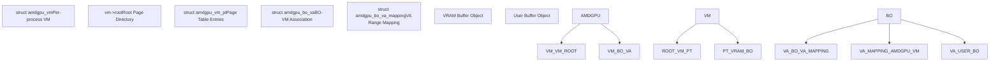
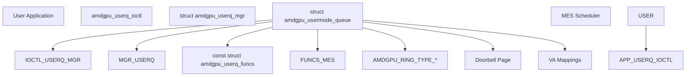
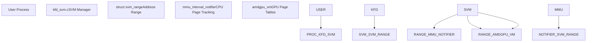
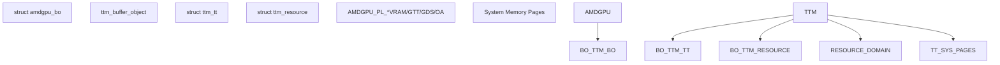
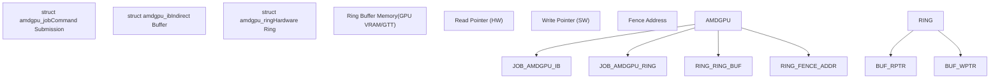
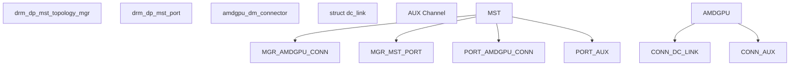

# AMDGPU Driver

Relevant source files

-   [drivers/gpu/drm/amd/amdgpu/amdgpu.h](https://github.com/torvalds/linux/blob/fcb70a56/drivers/gpu/drm/amd/amdgpu/amdgpu.h)
-   [drivers/gpu/drm/amd/amdgpu/amdgpu\_acpi.c](https://github.com/torvalds/linux/blob/fcb70a56/drivers/gpu/drm/amd/amdgpu/amdgpu_acpi.c)
-   [drivers/gpu/drm/amd/amdgpu/amdgpu\_amdkfd\_gpuvm.c](https://github.com/torvalds/linux/blob/fcb70a56/drivers/gpu/drm/amd/amdgpu/amdgpu_amdkfd_gpuvm.c)
-   [drivers/gpu/drm/amd/amdgpu/amdgpu\_bo\_list.h](https://github.com/torvalds/linux/blob/fcb70a56/drivers/gpu/drm/amd/amdgpu/amdgpu_bo_list.h)
-   [drivers/gpu/drm/amd/amdgpu/amdgpu\_connectors.c](https://github.com/torvalds/linux/blob/fcb70a56/drivers/gpu/drm/amd/amdgpu/amdgpu_connectors.c)
-   [drivers/gpu/drm/amd/amdgpu/amdgpu\_cs.c](https://github.com/torvalds/linux/blob/fcb70a56/drivers/gpu/drm/amd/amdgpu/amdgpu_cs.c)
-   [drivers/gpu/drm/amd/amdgpu/amdgpu\_dev\_coredump.c](https://github.com/torvalds/linux/blob/fcb70a56/drivers/gpu/drm/amd/amdgpu/amdgpu_dev_coredump.c)
-   [drivers/gpu/drm/amd/amdgpu/amdgpu\_device.c](https://github.com/torvalds/linux/blob/fcb70a56/drivers/gpu/drm/amd/amdgpu/amdgpu_device.c)
-   [drivers/gpu/drm/amd/amdgpu/amdgpu\_dma\_buf.c](https://github.com/torvalds/linux/blob/fcb70a56/drivers/gpu/drm/amd/amdgpu/amdgpu_dma_buf.c)
-   [drivers/gpu/drm/amd/amdgpu/amdgpu\_drv.c](https://github.com/torvalds/linux/blob/fcb70a56/drivers/gpu/drm/amd/amdgpu/amdgpu_drv.c)
-   [drivers/gpu/drm/amd/amdgpu/amdgpu\_fence.c](https://github.com/torvalds/linux/blob/fcb70a56/drivers/gpu/drm/amd/amdgpu/amdgpu_fence.c)
-   [drivers/gpu/drm/amd/amdgpu/amdgpu\_gem.c](https://github.com/torvalds/linux/blob/fcb70a56/drivers/gpu/drm/amd/amdgpu/amdgpu_gem.c)
-   [drivers/gpu/drm/amd/amdgpu/amdgpu\_gfx.c](https://github.com/torvalds/linux/blob/fcb70a56/drivers/gpu/drm/amd/amdgpu/amdgpu_gfx.c)
-   [drivers/gpu/drm/amd/amdgpu/amdgpu\_gfx.h](https://github.com/torvalds/linux/blob/fcb70a56/drivers/gpu/drm/amd/amdgpu/amdgpu_gfx.h)
-   [drivers/gpu/drm/amd/amdgpu/amdgpu\_hmm.c](https://github.com/torvalds/linux/blob/fcb70a56/drivers/gpu/drm/amd/amdgpu/amdgpu_hmm.c)
-   [drivers/gpu/drm/amd/amdgpu/amdgpu\_hmm.h](https://github.com/torvalds/linux/blob/fcb70a56/drivers/gpu/drm/amd/amdgpu/amdgpu_hmm.h)
-   [drivers/gpu/drm/amd/amdgpu/amdgpu\_ib.c](https://github.com/torvalds/linux/blob/fcb70a56/drivers/gpu/drm/amd/amdgpu/amdgpu_ib.c)
-   [drivers/gpu/drm/amd/amdgpu/amdgpu\_ids.c](https://github.com/torvalds/linux/blob/fcb70a56/drivers/gpu/drm/amd/amdgpu/amdgpu_ids.c)
-   [drivers/gpu/drm/amd/amdgpu/amdgpu\_ids.h](https://github.com/torvalds/linux/blob/fcb70a56/drivers/gpu/drm/amd/amdgpu/amdgpu_ids.h)
-   [drivers/gpu/drm/amd/amdgpu/amdgpu\_isp.c](https://github.com/torvalds/linux/blob/fcb70a56/drivers/gpu/drm/amd/amdgpu/amdgpu_isp.c)
-   [drivers/gpu/drm/amd/amdgpu/amdgpu\_isp.h](https://github.com/torvalds/linux/blob/fcb70a56/drivers/gpu/drm/amd/amdgpu/amdgpu_isp.h)
-   [drivers/gpu/drm/amd/amdgpu/amdgpu\_job.c](https://github.com/torvalds/linux/blob/fcb70a56/drivers/gpu/drm/amd/amdgpu/amdgpu_job.c)
-   [drivers/gpu/drm/amd/amdgpu/amdgpu\_kms.c](https://github.com/torvalds/linux/blob/fcb70a56/drivers/gpu/drm/amd/amdgpu/amdgpu_kms.c)
-   [drivers/gpu/drm/amd/amdgpu/amdgpu\_mes.c](https://github.com/torvalds/linux/blob/fcb70a56/drivers/gpu/drm/amd/amdgpu/amdgpu_mes.c)
-   [drivers/gpu/drm/amd/amdgpu/amdgpu\_mes.h](https://github.com/torvalds/linux/blob/fcb70a56/drivers/gpu/drm/amd/amdgpu/amdgpu_mes.h)
-   [drivers/gpu/drm/amd/amdgpu/amdgpu\_object.c](https://github.com/torvalds/linux/blob/fcb70a56/drivers/gpu/drm/amd/amdgpu/amdgpu_object.c)
-   [drivers/gpu/drm/amd/amdgpu/amdgpu\_rap.c](https://github.com/torvalds/linux/blob/fcb70a56/drivers/gpu/drm/amd/amdgpu/amdgpu_rap.c)
-   [drivers/gpu/drm/amd/amdgpu/amdgpu\_ring.c](https://github.com/torvalds/linux/blob/fcb70a56/drivers/gpu/drm/amd/amdgpu/amdgpu_ring.c)
-   [drivers/gpu/drm/amd/amdgpu/amdgpu\_ring.h](https://github.com/torvalds/linux/blob/fcb70a56/drivers/gpu/drm/amd/amdgpu/amdgpu_ring.h)
-   [drivers/gpu/drm/amd/amdgpu/amdgpu\_securedisplay.c](https://github.com/torvalds/linux/blob/fcb70a56/drivers/gpu/drm/amd/amdgpu/amdgpu_securedisplay.c)
-   [drivers/gpu/drm/amd/amdgpu/amdgpu\_sync.c](https://github.com/torvalds/linux/blob/fcb70a56/drivers/gpu/drm/amd/amdgpu/amdgpu_sync.c)
-   [drivers/gpu/drm/amd/amdgpu/amdgpu\_sync.h](https://github.com/torvalds/linux/blob/fcb70a56/drivers/gpu/drm/amd/amdgpu/amdgpu_sync.h)
-   [drivers/gpu/drm/amd/amdgpu/amdgpu\_ttm.h](https://github.com/torvalds/linux/blob/fcb70a56/drivers/gpu/drm/amd/amdgpu/amdgpu_ttm.h)
-   [drivers/gpu/drm/amd/amdgpu/amdgpu\_userq.c](https://github.com/torvalds/linux/blob/fcb70a56/drivers/gpu/drm/amd/amdgpu/amdgpu_userq.c)
-   [drivers/gpu/drm/amd/amdgpu/amdgpu\_userq.h](https://github.com/torvalds/linux/blob/fcb70a56/drivers/gpu/drm/amd/amdgpu/amdgpu_userq.h)
-   [drivers/gpu/drm/amd/amdgpu/amdgpu\_userq\_fence.c](https://github.com/torvalds/linux/blob/fcb70a56/drivers/gpu/drm/amd/amdgpu/amdgpu_userq_fence.c)
-   [drivers/gpu/drm/amd/amdgpu/amdgpu\_userq\_fence.h](https://github.com/torvalds/linux/blob/fcb70a56/drivers/gpu/drm/amd/amdgpu/amdgpu_userq_fence.h)
-   [drivers/gpu/drm/amd/amdgpu/amdgpu\_uvd.c](https://github.com/torvalds/linux/blob/fcb70a56/drivers/gpu/drm/amd/amdgpu/amdgpu_uvd.c)
-   [drivers/gpu/drm/amd/amdgpu/amdgpu\_vm.c](https://github.com/torvalds/linux/blob/fcb70a56/drivers/gpu/drm/amd/amdgpu/amdgpu_vm.c)
-   [drivers/gpu/drm/amd/amdgpu/amdgpu\_vm.h](https://github.com/torvalds/linux/blob/fcb70a56/drivers/gpu/drm/amd/amdgpu/amdgpu_vm.h)
-   [drivers/gpu/drm/amd/amdgpu/amdgpu\_vm\_pt.c](https://github.com/torvalds/linux/blob/fcb70a56/drivers/gpu/drm/amd/amdgpu/amdgpu_vm_pt.c)
-   [drivers/gpu/drm/amd/amdgpu/gmc\_v10\_0.c](https://github.com/torvalds/linux/blob/fcb70a56/drivers/gpu/drm/amd/amdgpu/gmc_v10_0.c)
-   [drivers/gpu/drm/amd/amdgpu/gmc\_v11\_0.c](https://github.com/torvalds/linux/blob/fcb70a56/drivers/gpu/drm/amd/amdgpu/gmc_v11_0.c)
-   [drivers/gpu/drm/amd/amdgpu/gmc\_v12\_0.c](https://github.com/torvalds/linux/blob/fcb70a56/drivers/gpu/drm/amd/amdgpu/gmc_v12_0.c)
-   [drivers/gpu/drm/amd/amdgpu/gmc\_v7\_0.c](https://github.com/torvalds/linux/blob/fcb70a56/drivers/gpu/drm/amd/amdgpu/gmc_v7_0.c)
-   [drivers/gpu/drm/amd/amdgpu/gmc\_v8\_0.c](https://github.com/torvalds/linux/blob/fcb70a56/drivers/gpu/drm/amd/amdgpu/gmc_v8_0.c)
-   [drivers/gpu/drm/amd/amdgpu/gmc\_v9\_0.c](https://github.com/torvalds/linux/blob/fcb70a56/drivers/gpu/drm/amd/amdgpu/gmc_v9_0.c)
-   [drivers/gpu/drm/amd/amdgpu/isp\_v4\_1\_1.c](https://github.com/torvalds/linux/blob/fcb70a56/drivers/gpu/drm/amd/amdgpu/isp_v4_1_1.c)
-   [drivers/gpu/drm/amd/amdgpu/mes\_userqueue.c](https://github.com/torvalds/linux/blob/fcb70a56/drivers/gpu/drm/amd/amdgpu/mes_userqueue.c)
-   [drivers/gpu/drm/amd/amdgpu/mes\_v11\_0.c](https://github.com/torvalds/linux/blob/fcb70a56/drivers/gpu/drm/amd/amdgpu/mes_v11_0.c)
-   [drivers/gpu/drm/amd/amdgpu/mes\_v12\_0.c](https://github.com/torvalds/linux/blob/fcb70a56/drivers/gpu/drm/amd/amdgpu/mes_v12_0.c)
-   [drivers/gpu/drm/amd/amdgpu/sdma\_v4\_0.c](https://github.com/torvalds/linux/blob/fcb70a56/drivers/gpu/drm/amd/amdgpu/sdma_v4_0.c)
-   [drivers/gpu/drm/amd/amdkfd/kfd\_events.c](https://github.com/torvalds/linux/blob/fcb70a56/drivers/gpu/drm/amd/amdkfd/kfd_events.c)
-   [drivers/gpu/drm/amd/amdkfd/kfd\_smi\_events.c](https://github.com/torvalds/linux/blob/fcb70a56/drivers/gpu/drm/amd/amdkfd/kfd_smi_events.c)
-   [drivers/gpu/drm/amd/amdkfd/kfd\_svm.c](https://github.com/torvalds/linux/blob/fcb70a56/drivers/gpu/drm/amd/amdkfd/kfd_svm.c)
-   [drivers/gpu/drm/amd/amdxcp/amdgpu\_xcp\_drv.c](https://github.com/torvalds/linux/blob/fcb70a56/drivers/gpu/drm/amd/amdxcp/amdgpu_xcp_drv.c)
-   [drivers/gpu/drm/amd/display/amdgpu\_dm/amdgpu\_dm.c](https://github.com/torvalds/linux/blob/fcb70a56/drivers/gpu/drm/amd/display/amdgpu_dm/amdgpu_dm.c)
-   [drivers/gpu/drm/amd/display/amdgpu\_dm/amdgpu\_dm.h](https://github.com/torvalds/linux/blob/fcb70a56/drivers/gpu/drm/amd/display/amdgpu_dm/amdgpu_dm.h)
-   [drivers/gpu/drm/amd/display/amdgpu\_dm/amdgpu\_dm\_crc.c](https://github.com/torvalds/linux/blob/fcb70a56/drivers/gpu/drm/amd/display/amdgpu_dm/amdgpu_dm_crc.c)
-   [drivers/gpu/drm/amd/display/amdgpu\_dm/amdgpu\_dm\_crc.h](https://github.com/torvalds/linux/blob/fcb70a56/drivers/gpu/drm/amd/display/amdgpu_dm/amdgpu_dm_crc.h)
-   [drivers/gpu/drm/amd/display/amdgpu\_dm/amdgpu\_dm\_crtc.c](https://github.com/torvalds/linux/blob/fcb70a56/drivers/gpu/drm/amd/display/amdgpu_dm/amdgpu_dm_crtc.c)
-   [drivers/gpu/drm/amd/display/amdgpu\_dm/amdgpu\_dm\_crtc.h](https://github.com/torvalds/linux/blob/fcb70a56/drivers/gpu/drm/amd/display/amdgpu_dm/amdgpu_dm_crtc.h)
-   [drivers/gpu/drm/amd/display/amdgpu\_dm/amdgpu\_dm\_debugfs.c](https://github.com/torvalds/linux/blob/fcb70a56/drivers/gpu/drm/amd/display/amdgpu_dm/amdgpu_dm_debugfs.c)
-   [drivers/gpu/drm/amd/display/amdgpu\_dm/amdgpu\_dm\_mst\_types.c](https://github.com/torvalds/linux/blob/fcb70a56/drivers/gpu/drm/amd/display/amdgpu_dm/amdgpu_dm_mst_types.c)
-   [drivers/gpu/drm/amd/display/amdgpu\_dm/amdgpu\_dm\_mst\_types.h](https://github.com/torvalds/linux/blob/fcb70a56/drivers/gpu/drm/amd/display/amdgpu_dm/amdgpu_dm_mst_types.h)
-   [drivers/gpu/drm/amd/display/amdgpu\_dm/amdgpu\_dm\_psr.c](https://github.com/torvalds/linux/blob/fcb70a56/drivers/gpu/drm/amd/display/amdgpu_dm/amdgpu_dm_psr.c)
-   [drivers/gpu/drm/amd/display/amdgpu\_dm/amdgpu\_dm\_psr.h](https://github.com/torvalds/linux/blob/fcb70a56/drivers/gpu/drm/amd/display/amdgpu_dm/amdgpu_dm_psr.h)
-   [drivers/gpu/drm/amd/include/mes\_v11\_api\_def.h](https://github.com/torvalds/linux/blob/fcb70a56/drivers/gpu/drm/amd/include/mes_v11_api_def.h)
-   [drivers/gpu/drm/amd/include/mes\_v12\_api\_def.h](https://github.com/torvalds/linux/blob/fcb70a56/drivers/gpu/drm/amd/include/mes_v12_api_def.h)
-   [include/drm/amd/isp.h](https://github.com/torvalds/linux/blob/fcb70a56/include/drm/amd/isp.h)
-   [include/uapi/drm/amdgpu\_drm.h](https://github.com/torvalds/linux/blob/fcb70a56/include/uapi/drm/amdgpu_drm.h)

## Purpose and Scope

The AMDGPU driver is the unified kernel driver for AMD Radeon GPUs and APUs. This document covers the driver's architecture, including display management through the Display Manager (DM), GPU virtual memory (GPUVM) management, compute workload integration via the Kernel Fusion Driver (KFD) for ROCm, user-mode queue scheduling through the Micro-Engine Scheduler (MES), and power management subsystems.

For information about the Rust-based Nova driver for NVIDIA GPUs, see [Nova DRM Graphics Driver](/torvalds/linux/2.2-nova-drm-graphics-driver). For general DRM framework concepts, see [Graphics and Display](/torvalds/linux/6-graphics-and-display).

## Architecture Overview

The AMDGPU driver operates as a bridge between the Direct Rendering Manager (DRM) subsystem and the underlying Display Core (DC) hardware abstraction layer. The driver is organized into several major subsystems that handle different aspects of GPU functionality.

### Major Components

```mermaid
flowchart TD
    AMDGPU_RING["amdgpu_ring.cRing Buffers"]
    DRM["DRM Core(drm_driver)"]
    AMDGPU_DRV["amdgpu_drv.cDriver Entry Point"]
    AMDGPU_DEVICE["amdgpu_device.cDevice Management"]
    AMDGPU_DM["amdgpu_dm.cDisplay Manager"]
    AMDGPU_VM["amdgpu_vm.cGPU Virtual Memory"]
    AMDGPU_MES["amdgpu_mes.cMES Scheduler"]
    DC["dc.hDisplay Core HAL"]
    DMUB["dmub_srvDisplay Microcontroller"]
    AMDGPU_TTM["amdgpu_ttm.cTTM Integration"]
    AMDGPU_GEM["amdgpu_gem.cGEM Objects"]
    AMDGPU_USERQ["amdgpu_userq.cUser-Mode Queues"]
    AMDGPU_KFD["amdgpu_amdkfd.hKFD Integration"]
    AMDGPU_FENCE["amdgpu_fence.cSynchronization"]
    AMDGPU_JOB["amdgpu_job.cCommand Submission"]

    DRM --> AMDGPU_DRV
    AMDGPU --> DRV_AMDGPU_DEVICE
    AMDGPU --> DEVICE_AMDGPU_DM
    AMDGPU --> DEVICE_AMDGPU_VM
    AMDGPU --> DEVICE_AMDGPU_MES
    AMDGPU --> DM_DC
    AMDGPU --> DM_DMUB
    AMDGPU --> VM_AMDGPU_TTM
    AMDGPU --> VM_AMDGPU_GEM
    AMDGPU --> MES_AMDGPU_USERQ
    AMDGPU --> KFD_AMDGPU_VM
    AMDGPU --> USERQ_AMDGPU_RING
    AMDGPU --> RING_AMDGPU_FENCE
    AMDGPU --> JOB_AMDGPU_RING
```

Sources: [drivers/gpu/drm/amd/amdgpu/amdgpu.h1-200](https://github.com/torvalds/linux/blob/fcb70a56/drivers/gpu/drm/amd/amdgpu/amdgpu.h#L1-L200) [drivers/gpu/drm/amd/amdgpu/amdgpu\_drv.c1-100](https://github.com/torvalds/linux/blob/fcb70a56/drivers/gpu/drm/amd/amdgpu/amdgpu_drv.c#L1-L100) [drivers/gpu/drm/amd/display/amdgpu\_dm/amdgpu\_dm.h1-100](https://github.com/torvalds/linux/blob/fcb70a56/drivers/gpu/drm/amd/display/amdgpu_dm/amdgpu_dm.h#L1-L100)

### Device Initialization Flow

The driver initialization follows a multi-phase process coordinated by the `amdgpu_device` subsystem:

```mermaid
flowchart TD
    PCI_PROBE["pci_driver.probe()amdgpu_pci_probe()"]
    DEVICE_INIT["amdgpu_device_init()"]
    EARLY_INIT["dm_early_init()IP Block Registration"]
    SW_INIT["amdgpu_device_ip_init()Software Initialization"]
    HW_INIT["amdgpu_device_ip_resume()Hardware Initialization"]
    DM_INIT["amdgpu_dm_init()Display Manager Setup"]
    VM_INIT["amdgpu_vm_manager_init()VM Setup"]
    DC_CREATE["dc_create()Display Core Initialization"]
    DMUB_INIT["dmub_srv_create()DMUB Service"]
    VM_ENTITIES["amdgpu_vm_init_entities()Scheduler Entities"]

    PCI --> PROBE_DEVICE_INIT
    DEVICE --> INIT_EARLY_INIT
    EARLY --> INIT_SW_INIT
    SW --> INIT_HW_INIT
    HW --> INIT_DM_INIT
    HW --> INIT_VM_INIT
    DM --> INIT_DC_CREATE
    DM --> INIT_DMUB_INIT
    VM --> INIT_VM_ENTITIES
```

Sources: [drivers/gpu/drm/amd/amdgpu/amdgpu\_device.c183-211](https://github.com/torvalds/linux/blob/fcb70a56/drivers/gpu/drm/amd/amdgpu/amdgpu_device.c#L183-L211) [drivers/gpu/drm/amd/display/amdgpu\_dm/amdgpu\_dm.c172-173](https://github.com/torvalds/linux/blob/fcb70a56/drivers/gpu/drm/amd/display/amdgpu_dm/amdgpu_dm.c#L172-L173)

## Display Manager (amdgpu\_dm)

The Display Manager (`amdgpu_dm`) is documented as sitting between DRM and DC (Display Core), acting as a liaison that converts DRM requests into DC requests and DC responses into DRM responses. The root control structure is `struct amdgpu_display_manager`.

### Display Manager Structure

| Component | Structure | Purpose |
| --- | --- | --- |
| Display Manager | `struct amdgpu_display_manager` | Root display management structure |
| DC Context | `struct dc` | Display Core hardware abstraction |
| DMUB Service | `struct dmub_srv` | Display microcontroller service |
| IRQ Management | `struct amdgpu_dm_irq_handler_data` | Interrupt handling |
| Backlight Control | `struct amdgpu_dm_backlight_caps` | Backlight capabilities and control |

Sources: [drivers/gpu/drm/amd/display/amdgpu\_dm/amdgpu\_dm.h246-450](https://github.com/torvalds/linux/blob/fcb70a56/drivers/gpu/drm/amd/display/amdgpu_dm/amdgpu_dm.h#L246-L450)

### Display Core Integration

The Display Manager initializes the Display Core through `amdgpu_dm_init()`:

> **[Mermaid sequence]**
> *(图表结构无法解析)*

Sources: [drivers/gpu/drm/amd/display/amdgpu\_dm/amdgpu\_dm.c161-169](https://github.com/torvalds/linux/blob/fcb70a56/drivers/gpu/drm/amd/display/amdgpu_dm/amdgpu_dm.c#L161-L169) [drivers/gpu/drm/amd/display/amdgpu\_dm/amdgpu\_dm.c172-173](https://github.com/torvalds/linux/blob/fcb70a56/drivers/gpu/drm/amd/display/amdgpu_dm/amdgpu_dm.c#L172-L173)

### DMUB (Display Microcontroller) Service

The DMUB firmware handles various display-related tasks offloaded from the main CPU. Firmware files are loaded for different GPU generations:

-   Renoir: `amdgpu/renoir_dmcub.bin`
-   Sienna Cichlid: `amdgpu/sienna_cichlid_dmcub.bin`
-   Navy Flounder: `amdgpu/navy_flounder_dmcub.bin`
-   Van Gogh: `amdgpu/vangogh_dmcub.bin`
-   Yellow Carp: `amdgpu/yellow_carp_dmcub.bin`
-   DCN 3.1.4-3.1.6, 3.2.0-3.2.1, 3.5, 3.6, 4.0.1: Various `dcn_*_dmcub.bin` files

DMUB notifications are handled through callbacks registered with `register_dmub_notify_callback()`:

Sources: [drivers/gpu/drm/amd/display/amdgpu\_dm/amdgpu\_dm.c109-154](https://github.com/torvalds/linux/blob/fcb70a56/drivers/gpu/drm/amd/display/amdgpu_dm/amdgpu_dm.c#L109-L154) [drivers/gpu/drm/amd/display/amdgpu\_dm/amdgpu\_dm.c923-935](https://github.com/torvalds/linux/blob/fcb70a56/drivers/gpu/drm/amd/display/amdgpu_dm/amdgpu_dm.c#L923-L935)

### Interrupt Handling

Display interrupts are managed through several handlers:

| IRQ Type | Handler Function | Purpose |
| --- | --- | --- |
| VBLANK | `dm_crtc_high_irq()` | Vertical blank interrupt |
| VUPDATE | `dm_vupdate_high_irq()` | Vertical update for VRR |
| PFLIP | `dm_pflip_high_irq()` | Page flip completion |
| HPD | `dmub_hpd_callback()` | Hot-plug detection |
| HPD\_RX | `handle_hpd_rx_irq()` | HPD receive interrupt |

The VRR (Variable Refresh Rate) support is implemented through the vupdate handler which manages adaptive sync timing adjustments:

Sources: [drivers/gpu/drm/amd/display/amdgpu\_dm/amdgpu\_dm.c437-532](https://github.com/torvalds/linux/blob/fcb70a56/drivers/gpu/drm/amd/display/amdgpu_dm/amdgpu_dm.c#L437-L532) [drivers/gpu/drm/amd/display/amdgpu\_dm/amdgpu\_dm.c578-640](https://github.com/torvalds/linux/blob/fcb70a56/drivers/gpu/drm/amd/display/amdgpu_dm/amdgpu_dm.c#L578-L640) [drivers/gpu/drm/amd/display/amdgpu\_dm/amdgpu\_dm.c649-756](https://github.com/torvalds/linux/blob/fcb70a56/drivers/gpu/drm/amd/display/amdgpu_dm/amdgpu_dm.c#L649-L756)

### Atomic Modesetting

The display manager implements DRM atomic modesetting operations:

-   `amdgpu_dm_atomic_check()`: Validates atomic state changes
-   `amdgpu_dm_atomic_commit_tail()`: Applies validated state to hardware
-   `update_planes_and_stream_adapter()`: Updates plane and stream state in DC

Sources: [drivers/gpu/drm/amd/display/amdgpu\_dm/amdgpu\_dm.c236-240](https://github.com/torvalds/linux/blob/fcb70a56/drivers/gpu/drm/amd/display/amdgpu_dm/amdgpu_dm.c#L236-L240) [drivers/gpu/drm/amd/display/amdgpu\_dm/amdgpu\_dm.c408-428](https://github.com/torvalds/linux/blob/fcb70a56/drivers/gpu/drm/amd/display/amdgpu_dm/amdgpu_dm.c#L408-L428)

## GPU Virtual Memory (GPUVM)

GPUVM provides MMU functionality on the GPU with multiple page tables that can be active simultaneously. Each GPUVM has an associated VMID and page table.

### GPUVM Architecture

The GPUVM subsystem is documented in [drivers/gpu/drm/amd/amdgpu/amdgpu\_vm.c48-88](https://github.com/torvalds/linux/blob/fcb70a56/drivers/gpu/drm/amd/amdgpu/amdgpu_vm.c#L48-L88):

-   **Multi-level page tables**: 1-2 or 1-5 levels depending on ASIC family
-   **Per-VMID page tables**: Hardware supports up to 16 active GPUVMs
-   **RWX attributes**: Read/Write/Execute permissions per page
-   **Encryption and caching**: Per-page attributes for security and performance
-   **Mixed memory types**: VRAM pages and system pages (snooped/unsnooped)

### VM Structure Hierarchy

Sources: [drivers/gpu/drm/amd/amdgpu/amdgpu\_vm.c89-98](https://github.com/torvalds/linux/blob/fcb70a56/drivers/gpu/drm/amd/amdgpu/amdgpu_vm.c#L89-L98) [drivers/gpu/drm/amd/amdgpu/amdgpu\_vm.h1-100](https://github.com/torvalds/linux/blob/fcb70a56/drivers/gpu/drm/amd/amdgpu/amdgpu_vm.h#L1-L100)

### VM Initialization and Management

Key VM operations are defined in the `amdgpu_vm` functions:

| Function | Purpose |
| --- | --- |
| `amdgpu_vm_init_entities()` | Create scheduler entities for page table updates |
| `amdgpu_vm_lock_pd()` | Lock VM root page directory in drm\_exec context |
| `amdgpu_vm_validate()` | Validate evicted BOs tracked in the VM |
| `amdgpu_vm_bo_base_init()` | Associate a BO with a VM |
| `amdgpu_vm_flush()` | Emit VM flush when necessary |

Sources: [drivers/gpu/drm/amd/amdgpu/amdgpu\_vm.c525-543](https://github.com/torvalds/linux/blob/fcb70a56/drivers/gpu/drm/amd/amdgpu/amdgpu_vm.c#L525-L543) [drivers/gpu/drm/amd/amdgpu/amdgpu\_vm.c459-465](https://github.com/torvalds/linux/blob/fcb70a56/drivers/gpu/drm/amd/amdgpu/amdgpu_vm.c#L459-L465) [drivers/gpu/drm/amd/amdgpu/amdgpu\_vm.c592-656](https://github.com/torvalds/linux/blob/fcb70a56/drivers/gpu/drm/amd/amdgpu/amdgpu_vm.c#L592-L656) [drivers/gpu/drm/amd/amdgpu/amdgpu\_vm.c409-448](https://github.com/torvalds/linux/blob/fcb70a56/drivers/gpu/drm/amd/amdgpu/amdgpu_vm.c#L409-L448) [drivers/gpu/drm/amd/amdgpu/amdgpu\_vm.c771-856](https://github.com/torvalds/linux/blob/fcb70a56/drivers/gpu/drm/amd/amdgpu/amdgpu_vm.c#L771-L856)

### VM State Machine

The VM manages buffer objects through a state machine to track their location and validity:

> **[Mermaid stateDiagram]**
> *(图表结构无法解析)*

Sources: [drivers/gpu/drm/amd/amdgpu/amdgpu\_vm.c149-194](https://github.com/torvalds/linux/blob/fcb70a56/drivers/gpu/drm/amd/amdgpu/amdgpu_vm.c#L149-L194) [drivers/gpu/drm/amd/amdgpu/amdgpu\_vm.c197-261](https://github.com/torvalds/linux/blob/fcb70a56/drivers/gpu/drm/amd/amdgpu/amdgpu_vm.c#L197-L261)

### VMID Management

VMIDs are allocated dynamically during command submission. VMID 0 is special and reserved for kernel driver use with direct VRAM and legacy AGP apertures:

Sources: [drivers/gpu/drm/amd/amdgpu/amdgpu\_vm.c73-80](https://github.com/torvalds/linux/blob/fcb70a56/drivers/gpu/drm/amd/amdgpu/amdgpu_vm.c#L73-L80)

## User-Mode Queue Scheduling

User-mode queues enable applications to submit work directly to the GPU without kernel intervention for each submission, reducing overhead and latency.

### User Queue Architecture

Sources: [drivers/gpu/drm/amd/amdgpu/amdgpu\_userq.c1-50](https://github.com/torvalds/linux/blob/fcb70a56/drivers/gpu/drm/amd/amdgpu/amdgpu_userq.c#L1-L50) [drivers/gpu/drm/amd/amdgpu/amdgpu\_userq.h1-100](https://github.com/torvalds/linux/blob/fcb70a56/drivers/gpu/drm/amd/amdgpu/amdgpu_userq.h#L1-L100)

### User Queue State Management

User queues transition through multiple states during their lifetime:

| State | Enum Value | Description |
| --- | --- | --- |
| Unmapped | `AMDGPU_USERQ_STATE_UNMAPPED` | Queue created but not yet mapped to hardware |
| Mapped | `AMDGPU_USERQ_STATE_MAPPED` | Queue active and accepting submissions |
| Preempted | `AMDGPU_USERQ_STATE_PREEMPTED` | Queue temporarily suspended |
| Hung | `AMDGPU_USERQ_STATE_HUNG` | Queue detected as hung, requires reset |

State transitions are managed through helper functions:

Sources: [drivers/gpu/drm/amd/amdgpu/amdgpu\_userq.c274-368](https://github.com/torvalds/linux/blob/fcb70a56/drivers/gpu/drm/amd/amdgpu/amdgpu_userq.c#L274-L368)

### VA Validation for User Queues

User-mode queues validate virtual address mappings to ensure queue buffers are properly resident in the VM:

> **[Mermaid sequence]**
> *(图表结构无法解析)*

Sources: [drivers/gpu/drm/amd/amdgpu/amdgpu\_userq.c169-202](https://github.com/torvalds/linux/blob/fcb70a56/drivers/gpu/drm/amd/amdgpu/amdgpu_userq.c#L169-L202) [drivers/gpu/drm/amd/amdgpu/amdgpu\_userq.c151-167](https://github.com/torvalds/linux/blob/fcb70a56/drivers/gpu/drm/amd/amdgpu/amdgpu_userq.c#L151-L167) [drivers/gpu/drm/amd/amdgpu/amdgpu\_userq.c222-238](https://github.com/torvalds/linux/blob/fcb70a56/drivers/gpu/drm/amd/amdgpu/amdgpu_userq.c#L222-L238)

### Doorbell Management

Doorbells provide a mechanism for user space to signal the GPU that work is available. Each user queue has an associated doorbell:

Sources: [drivers/gpu/drm/amd/amdgpu/amdgpu\_userq.c508-598](https://github.com/torvalds/linux/blob/fcb70a56/drivers/gpu/drm/amd/amdgpu/amdgpu_userq.c#L508-L598)

## Micro-Engine Scheduler (MES)

MES is a hardware-based scheduler that manages GPU queues at the microcode level, enabling more efficient user-mode queue scheduling.

### MES Architecture

```mermaid
flowchart TD
    MES_FW["MES Microcode"]
    MES_SCHQ["Scheduling Queue"]
    MES_EVENT["Event Log"]
    AMDGPU_MES["struct amdgpu_mes"]
    MES_RING["struct amdgpu_mes_ring"]
    MES_CTX["struct amdgpu_mes_ctx"]
    ADD_QUEUE["MES_ADD_QUEUE"]
    REMOVE_QUEUE["MES_REMOVE_QUEUE"]
    SUSPEND["MES_SUSPEND"]
    RESUME["MES_RESUME"]

    AMDGPU --> MES_MES_RING
    AMDGPU --> MES_MES_CTX
    MES --> RING_MES_SCHQ
    ADD --> QUEUE_MES_SCHQ
    REMOVE --> QUEUE_MES_SCHQ
    SUSPEND --> MES_SCHQ
    RESUME --> MES_SCHQ
    MES --> FW_MES_EVENT
```

Sources: [drivers/gpu/drm/amd/amdgpu/amdgpu\_mes.h1-50](https://github.com/torvalds/linux/blob/fcb70a56/drivers/gpu/drm/amd/amdgpu/amdgpu_mes.h#L1-L50) [drivers/gpu/drm/amd/amdgpu/amdgpu\_mes.c91-155](https://github.com/torvalds/linux/blob/fcb70a56/drivers/gpu/drm/amd/amdgpu/amdgpu_mes.c#L91-L155)

### MES Initialization

The MES subsystem is initialized through several phases:

1.  **Doorbell initialization**: Allocate doorbell bitmap for dynamic allocation
2.  **Event log initialization**: Create GPU buffer for MES event logging
3.  **PASID/Gang/Queue ID managers**: Initialize IDR structures for tracking
4.  **Ring initialization**: Setup communication rings with MES firmware

Sources: [drivers/gpu/drm/amd/amdgpu/amdgpu\_mes.c42-61](https://github.com/torvalds/linux/blob/fcb70a56/drivers/gpu/drm/amd/amdgpu/amdgpu_mes.c#L42-L61) [drivers/gpu/drm/amd/amdgpu/amdgpu\_mes.c63-84](https://github.com/torvalds/linux/blob/fcb70a56/drivers/gpu/drm/amd/amdgpu/amdgpu_mes.c#L63-L84) [drivers/gpu/drm/amd/amdgpu/amdgpu\_mes.c91-155](https://github.com/torvalds/linux/blob/fcb70a56/drivers/gpu/drm/amd/amdgpu/amdgpu_mes.c#L91-L155)

### MES Communication

Communication with MES firmware occurs through ring buffers:

| Structure | Purpose |
| --- | --- |
| `struct amdgpu_mes_ring` | Ring buffer for sending commands to MES |
| `struct mes_add_queue_input` | Parameters for adding a queue |
| `struct mes_remove_queue_input` | Parameters for removing a queue |
| `struct mes_suspend_gang_input` | Parameters for suspending a gang |
| `struct mes_resume_gang_input` | Parameters for resuming a gang |

Sources: [drivers/gpu/drm/amd/amdgpu/amdgpu\_mes.h150-300](https://github.com/torvalds/linux/blob/fcb70a56/drivers/gpu/drm/amd/amdgpu/amdgpu_mes.h#L150-L300)

### MES Versions

Different GPU generations use different MES implementations:

-   **MES v11.0**: Used in RDNA2 GPUs (Navi 2x series)
-   **MES v12.0**: Used in RDNA3 GPUs (Navi 3x series)

Sources: [drivers/gpu/drm/amd/amdgpu/mes\_v11\_0.c1-50](https://github.com/torvalds/linux/blob/fcb70a56/drivers/gpu/drm/amd/amdgpu/mes_v11_0.c#L1-L50) [drivers/gpu/drm/amd/amdgpu/mes\_v12\_0.c1-50](https://github.com/torvalds/linux/blob/fcb70a56/drivers/gpu/drm/amd/amdgpu/mes_v12_0.c#L1-L50)

## Kernel Fusion Driver (KFD) Integration

The KFD provides compute functionality and ROCm integration for GPU computing workloads. It bridges the AMDGPU driver with compute-focused APIs.

### KFD-GPUVM Integration

KFD uses the AMDGPU VM infrastructure for compute workload memory management through specialized functions in [drivers/gpu/drm/amd/amdgpu/amdgpu\_amdkfd\_gpuvm.c](https://github.com/torvalds/linux/blob/fcb70a56/drivers/gpu/drm/amd/amdgpu/amdgpu_amdkfd_gpuvm.c):

| Function | Purpose |
| --- | --- |
| `amdgpu_amdkfd_gpuvm_create_process_vm()` | Create VM for compute process |
| `amdgpu_amdkfd_gpuvm_acquire_process_vm()` | Acquire existing process VM |
| `amdgpu_amdkfd_gpuvm_alloc_memory_of_gpu()` | Allocate GPU memory for compute |
| `amdgpu_amdkfd_gpuvm_map_memory_to_gpu()` | Map memory into GPU address space |

Sources: [drivers/gpu/drm/amd/amdgpu/amdgpu\_amdkfd\_gpuvm.c1-100](https://github.com/torvalds/linux/blob/fcb70a56/drivers/gpu/drm/amd/amdgpu/amdgpu_amdkfd_gpuvm.c#L1-L100)

### SVM (Shared Virtual Memory) Support

The KFD SVM implementation provides unified address space between CPU and GPU:

Sources: [drivers/gpu/drm/amd/amdkfd/kfd\_svm.c1-100](https://github.com/torvalds/linux/blob/fcb70a56/drivers/gpu/drm/amd/amdkfd/kfd_svm.c#L1-L100) [drivers/gpu/drm/amd/amdkfd/kfd\_svm.c73-81](https://github.com/torvalds/linux/blob/fcb70a56/drivers/gpu/drm/amd/amdkfd/kfd_svm.c#L73-L81)

### SVM Range Management

SVM ranges track shared memory regions:

Sources: [drivers/gpu/drm/amd/amdkfd/kfd\_svm.c84-106](https://github.com/torvalds/linux/blob/fcb70a56/drivers/gpu/drm/amd/amdkfd/kfd_svm.c#L84-L106) [drivers/gpu/drm/amd/amdkfd/kfd\_svm.c109-137](https://github.com/torvalds/linux/blob/fcb70a56/drivers/gpu/drm/amd/amdkfd/kfd_svm.c#L109-L137)

## Memory Management Integration

The AMDGPU driver integrates with multiple memory management subsystems.

### TTM (Translation Table Manager) Integration

AMDGPU uses TTM for GPU memory management with custom placement and migration:

Sources: [drivers/gpu/drm/amd/amdgpu/amdgpu\_ttm.h1-100](https://github.com/torvalds/linux/blob/fcb70a56/drivers/gpu/drm/amd/amdgpu/amdgpu_ttm.h#L1-L100) [drivers/gpu/drm/amd/amdgpu/amdgpu.h54-56](https://github.com/torvalds/linux/blob/fcb70a56/drivers/gpu/drm/amd/amdgpu/amdgpu.h#L54-L56)

### GEM (Graphics Execution Manager) Objects

AMDGPU exposes buffers as GEM objects through the DRM framework:

Sources: [drivers/gpu/drm/amd/amdgpu/amdgpu\_gem.c1-100](https://github.com/torvalds/linux/blob/fcb70a56/drivers/gpu/drm/amd/amdgpu/amdgpu_gem.c#L1-L100)

### DMA-BUF Sharing

AMDGPU supports buffer sharing between devices through DMA-BUF:

Sources: [drivers/gpu/drm/amd/amdgpu/amdgpu\_dma\_buf.c27-67](https://github.com/torvalds/linux/blob/fcb70a56/drivers/gpu/drm/amd/amdgpu/amdgpu_dma_buf.c#L27-L67)

## Command Submission and Synchronization

Work is submitted to the GPU through rings (command queues) with synchronization provided by fences.

### Ring Buffer Architecture

Sources: [drivers/gpu/drm/amd/amdgpu/amdgpu\_ring.h1-100](https://github.com/torvalds/linux/blob/fcb70a56/drivers/gpu/drm/amd/amdgpu/amdgpu_ring.h#L1-L100) [drivers/gpu/drm/amd/amdgpu/amdgpu\_ring.c1-100](https://github.com/torvalds/linux/blob/fcb70a56/drivers/gpu/drm/amd/amdgpu/amdgpu_ring.c#L1-L100) [drivers/gpu/drm/amd/amdgpu/amdgpu\_job.c1-50](https://github.com/torvalds/linux/blob/fcb70a56/drivers/gpu/drm/amd/amdgpu/amdgpu_job.c#L1-L50)

### Fence-Based Synchronization

AMDGPU implements GPU synchronization through DMA fences:

| Fence Type | Implementation | Purpose |
| --- | --- | --- |
| Hardware Fence | `struct amdgpu_fence` | GPU-written sequence number |
| DMA Fence | `struct dma_fence` | Generic kernel fence primitive |
| User Queue Fence | `struct amdgpu_userq_fence` | User-mode queue synchronization |

Sources: [drivers/gpu/drm/amd/amdgpu/amdgpu\_fence.c1-100](https://github.com/torvalds/linux/blob/fcb70a56/drivers/gpu/drm/amd/amdgpu/amdgpu_fence.c#L1-L100) [drivers/gpu/drm/amd/amdgpu/amdgpu\_userq\_fence.c1-50](https://github.com/torvalds/linux/blob/fcb70a56/drivers/gpu/drm/amd/amdgpu/amdgpu_userq_fence.c#L1-L50)

### Job Submission Flow

> **[Mermaid sequence]**
> *(图表结构无法解析)*

Sources: [drivers/gpu/drm/amd/amdgpu/amdgpu\_job.c1-100](https://github.com/torvalds/linux/blob/fcb70a56/drivers/gpu/drm/amd/amdgpu/amdgpu_job.c#L1-L100) [drivers/gpu/drm/amd/amdgpu/amdgpu\_ring.c1-100](https://github.com/torvalds/linux/blob/fcb70a56/drivers/gpu/drm/amd/amdgpu/amdgpu_ring.c#L1-L100)

## Power Management

The AMDGPU driver implements comprehensive power management including runtime PM, display panel self-refresh, and idle optimizations.

### Runtime Power Management Modes

The driver supports multiple runtime PM modes detected in `amdgpu_device_detect_runtime_pm_mode()`:

| Mode | Enum | Description |
| --- | --- | --- |
| None | `AMDGPU_RUNPM_NONE` | Runtime PM disabled |
| PX | `AMDGPU_RUNPM_PX` | PowerXpress (hybrid graphics) |
| BOCO | `AMDGPU_RUNPM_BOCO` | BIOS-based power control |
| BACO | `AMDGPU_RUNPM_BACO` | Bus Active, Chip Off |
| BAMACO | `AMDGPU_RUNPM_BAMACO` | BACO with memory alive |

Sources: [drivers/gpu/drm/amd/amdgpu/amdgpu\_device.c471-545](https://github.com/torvalds/linux/blob/fcb70a56/drivers/gpu/drm/amd/amdgpu/amdgpu_device.c#L471-L545)

### Panel Self-Refresh Features

Display power management includes PSR (Panel Self-Refresh) and Panel Replay features managed through `amdgpu_dm_crtc_set_panel_sr_feature()`:

-   **PSR1**: Disable on vblank enable, enable on vblank disable
-   **PSR SU (Selective Update)**: Keep enabled even when vblank counter enabled
-   **Panel Replay**: Similar to PSR SU behavior

Sources: [drivers/gpu/drm/amd/display/amdgpu\_dm/amdgpu\_dm\_crtc.c102-166](https://github.com/torvalds/linux/blob/fcb70a56/drivers/gpu/drm/amd/display/amdgpu_dm/amdgpu_dm_crtc.c#L102-L166)

### Idle Optimization

The driver includes idle workqueue management for reducing power during idle periods:

Sources: [drivers/gpu/drm/amd/display/amdgpu\_dm/amdgpu\_dm.h146-158](https://github.com/torvalds/linux/blob/fcb70a56/drivers/gpu/drm/amd/display/amdgpu_dm/amdgpu_dm.h#L146-L158)

## Reset and Recovery

The AMDGPU driver implements comprehensive reset mechanisms for recovering from GPU hangs and errors.

### Reset Types

Different hardware blocks support different reset granularities:

-   **Per-queue reset**: `AMDGPU_RESET_TYPE_PER_QUEUE` - Reset individual queues
-   **Per-pipe reset**: `AMDGPU_RESET_TYPE_PER_PIPE` - Reset compute pipes
-   **Full reset**: Device-wide reset

Sources: [drivers/gpu/drm/amd/amdgpu/amdgpu\_userq.c50-83](https://github.com/torvalds/linux/blob/fcb70a56/drivers/gpu/drm/amd/amdgpu/amdgpu_userq.c#L50-L83)

### User Queue Reset Flow

> **[Mermaid sequence]**
> *(图表结构无法解析)*

Sources: [drivers/gpu/drm/amd/amdgpu/amdgpu\_userq.c85-149](https://github.com/torvalds/linux/blob/fcb70a56/drivers/gpu/drm/amd/amdgpu/amdgpu_userq.c#L85-L149)

### Core Dump on Hang

When a GPU hang is detected, the driver can generate a core dump for debugging:

Sources: [drivers/gpu/drm/amd/amdgpu/amdgpu\_job.c36-83](https://github.com/torvalds/linux/blob/fcb70a56/drivers/gpu/drm/amd/amdgpu/amdgpu_job.c#L36-L83)

## Hardware Abstraction

The AMDGPU driver abstracts hardware differences through versioned IP blocks and function tables.

### IP Block System

Each hardware function is encapsulated in an IP block:

```mermaid
flowchart TD
    AMDGPU_DEVICE["struct amdgpu_device"]
    IP_BLOCK["struct amdgpu_ip_block"]
    IP_VERSION["struct amdgpu_ip_block_version"]
    IP_FUNCS["struct amd_ip_funcs"]
    EARLY_INIT["early_init()"]
    SW_INIT["sw_init()"]
    HW_INIT["hw_init()"]
    SUSPEND["suspend()"]
    RESUME["resume()"]
    SW_FINI["sw_fini()"]
    HW_FINI["hw_fini()"]

    AMDGPU --> DEVICE_IP_BLOCK
    IP --> BLOCK_IP_VERSION
    IP --> VERSION_IP_FUNCS
    IP --> FUNCS_EARLY_INIT
    IP --> FUNCS_SW_INIT
    IP --> FUNCS_HW_INIT
    IP --> FUNCS_SUSPEND
    IP --> FUNCS_RESUME
    IP --> FUNCS_SW_FINI
    IP --> FUNCS_HW_FINI
```

Sources: [drivers/gpu/drm/amd/amdgpu/amdgpu\_device.c316-350](https://github.com/torvalds/linux/blob/fcb70a56/drivers/gpu/drm/amd/amdgpu/amdgpu_device.c#L316-L350)

### GMC (Graphics Memory Controller) Versions

Different GPU generations use different GMC versions:

-   **GMC v9.0**: Used in Vega, RDNA1
-   **GMC v12.0**: Used in RDNA3

Sources: [drivers/gpu/drm/amd/amdgpu/gmc\_v9\_0.c1-50](https://github.com/torvalds/linux/blob/fcb70a56/drivers/gpu/drm/amd/amdgpu/gmc_v9_0.c#L1-L50) [drivers/gpu/drm/amd/amdgpu/gmc\_v12\_0.c1-50](https://github.com/torvalds/linux/blob/fcb70a56/drivers/gpu/drm/amd/amdgpu/gmc_v12_0.c#L1-L50)

## Device Features and Capabilities

### Hardware Capability Query

The driver exposes hardware capabilities through the info ioctl:

| Info Query | Structure | Purpose |
| --- | --- | --- |
| `AMDGPU_INFO_DEV_INFO` | `struct drm_amdgpu_info_device` | Device information |
| `AMDGPU_INFO_MEMORY` | `struct drm_amdgpu_memory_info` | Memory configuration |
| `AMDGPU_INFO_HW_IP_INFO` | `struct drm_amdgpu_info_hw_ip` | Hardware IP capabilities |
| `AMDGPU_INFO_NUM_HANDLES` | Count | Number of allocated handles |
| `AMDGPU_INFO_USERQ` | Bitmask | Supported user queue types |

Sources: [drivers/gpu/drm/amd/amdgpu/amdgpu\_kms.c1-100](https://github.com/torvalds/linux/blob/fcb70a56/drivers/gpu/drm/amd/amdgpu/amdgpu_kms.c#L1-L100) [drivers/gpu/drm/amd/amdgpu/amdgpu\_userq.c37-48](https://github.com/torvalds/linux/blob/fcb70a56/drivers/gpu/drm/amd/amdgpu/amdgpu_userq.c#L37-L48)

### Virtual Display Support

The driver supports virtual displays for headless operation and testing:

Sources: [drivers/gpu/drm/amd/amdgpu/amdgpu\_drv.c185](https://github.com/torvalds/linux/blob/fcb70a56/drivers/gpu/drm/amd/amdgpu/amdgpu_drv.c#L185-L185)

## MST (Multi-Stream Transport) Support

DisplayPort MST enables multiple displays from a single DP connector:

Sources: [drivers/gpu/drm/amd/display/amdgpu\_dm/amdgpu\_dm\_mst\_types.c1-100](https://github.com/torvalds/linux/blob/fcb70a56/drivers/gpu/drm/amd/display/amdgpu_dm/amdgpu_dm_mst_types.c#L1-L100) [drivers/gpu/drm/amd/display/amdgpu\_dm/amdgpu\_dm\_mst\_types.c242-311](https://github.com/torvalds/linux/blob/fcb70a56/drivers/gpu/drm/amd/display/amdgpu_dm/amdgpu_dm_mst_types.c#L242-L311)

### DSC (Display Stream Compression) over MST

MST hubs may support DSC for increased bandwidth efficiency:

Sources: [drivers/gpu/drm/amd/display/amdgpu\_dm/amdgpu\_dm\_mst\_types.c242-250](https://github.com/torvalds/linux/blob/fcb70a56/drivers/gpu/drm/amd/display/amdgpu_dm/amdgpu_dm_mst_types.c#L242-L250) [drivers/gpu/drm/amd/display/amdgpu\_dm/amdgpu\_dm\_mst\_types.c252-311](https://github.com/torvalds/linux/blob/fcb70a56/drivers/gpu/drm/amd/display/amdgpu_dm/amdgpu_dm_mst_types.c#L252-L311)

## Module Parameters

The AMDGPU driver exposes numerous module parameters for configuration:

| Parameter | Type | Default | Purpose |
| --- | --- | --- | --- |
| `amdgpu_dc` | int | \-1 (auto) | Enable/disable Display Core |
| `amdgpu_dpm` | int | \-1 (auto) | Dynamic power management |
| `amdgpu_vm_size` | int | \-1 (auto) | VM address space size (GiB) |
| `amdgpu_vm_fragment_size` | int | \-1 (auto) | VM fragment size in bits |
| `amdgpu_mes` | int | 0 | Enable MES scheduler |
| `amdgpu_user_queue` | int | \-1 (auto) | Enable user-mode queues |
| `amdgpu_runtime_pm` | int | \-1 (auto) | Runtime power management mode |

Sources: [drivers/gpu/drm/amd/amdgpu/amdgpu\_drv.c152-250](https://github.com/torvalds/linux/blob/fcb70a56/drivers/gpu/drm/amd/amdgpu/amdgpu_drv.c#L152-L250)
