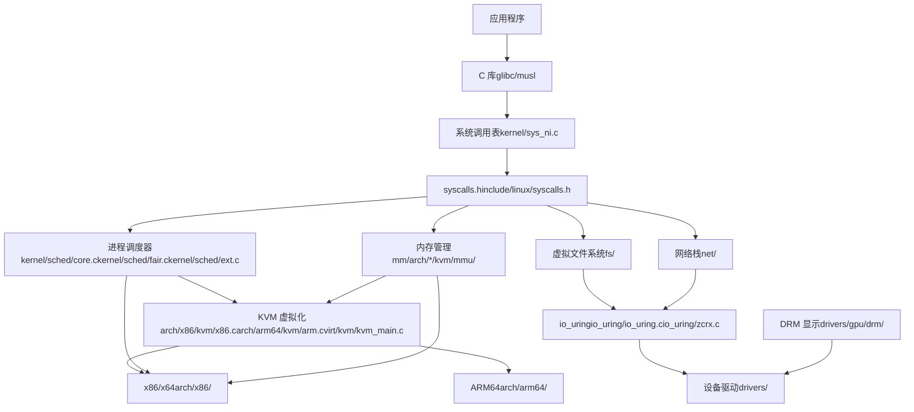
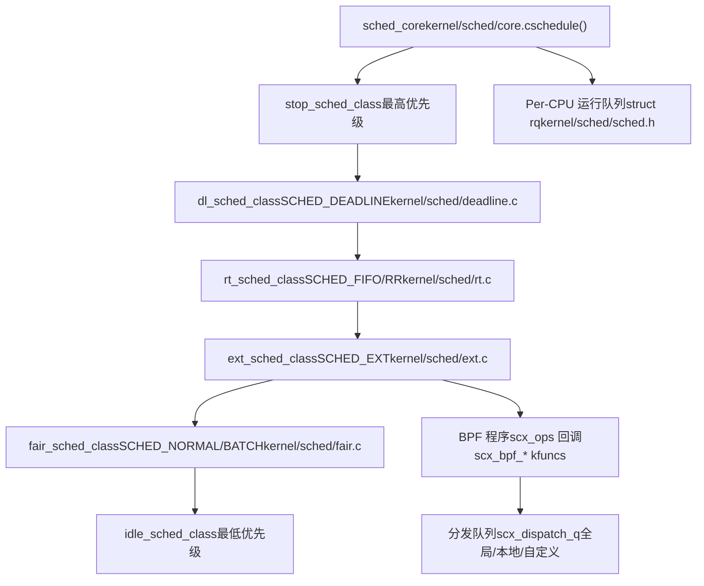
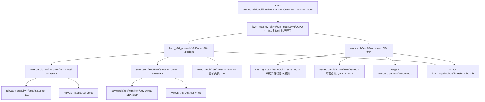
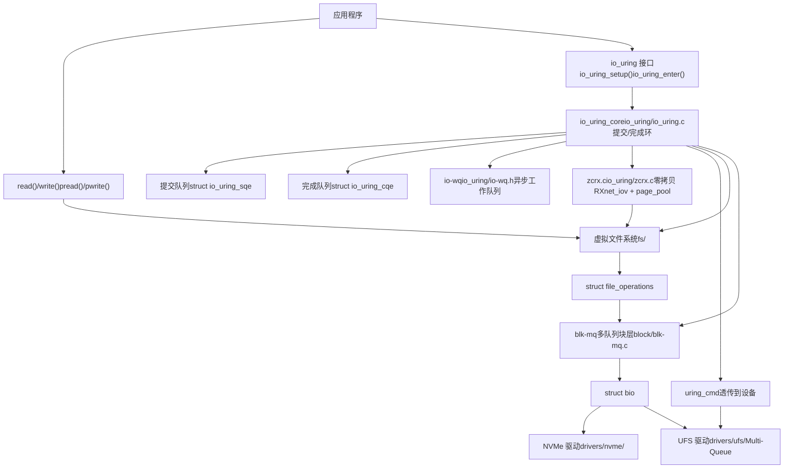
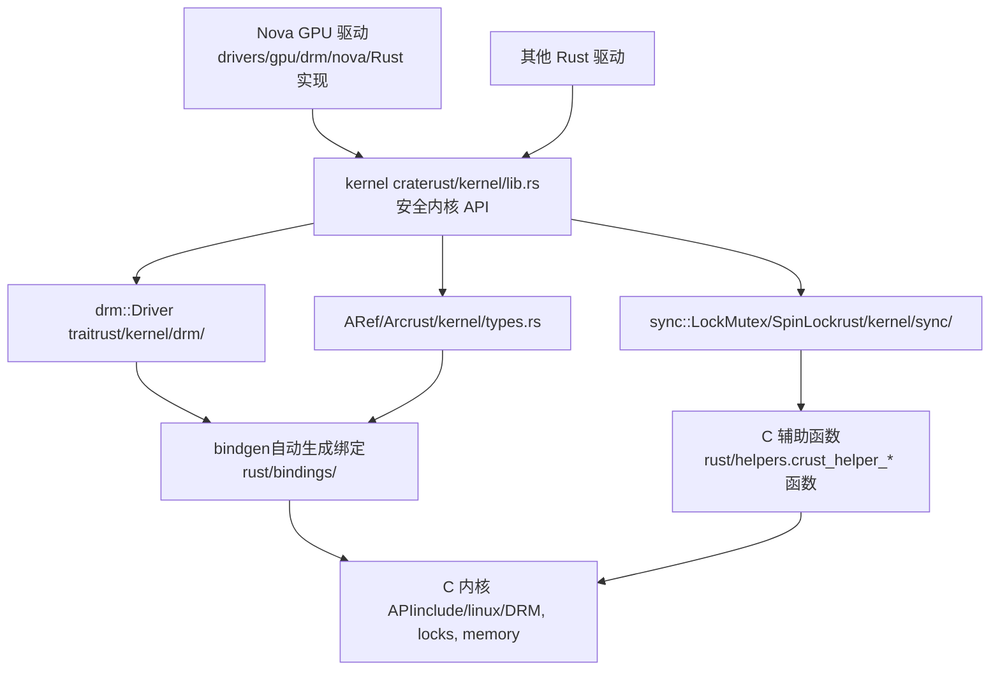

# Linux 内核概览

相关源文件

-   [Documentation/networking/iou-zcrx.rst](https://github.com/torvalds/linux/blob/fcb70a56/Documentation/networking/iou-zcrx.rst)
-   [Documentation/scheduler/sched-debug.rst](https://github.com/torvalds/linux/blob/fcb70a56/Documentation/scheduler/sched-debug.rst)
-   [Documentation/scheduler/sched-design-CFS.rst](https://github.com/torvalds/linux/blob/fcb70a56/Documentation/scheduler/sched-design-CFS.rst)
-   [Documentation/scheduler/sched-domains.rst](https://github.com/torvalds/linux/blob/fcb70a56/Documentation/scheduler/sched-domains.rst)
-   [Documentation/scheduler/sched-ext.rst](https://github.com/torvalds/linux/blob/fcb70a56/Documentation/scheduler/sched-ext.rst)
-   [Documentation/scheduler/sched-stats.rst](https://github.com/torvalds/linux/blob/fcb70a56/Documentation/scheduler/sched-stats.rst)
-   [Documentation/translations/sp\_SP/scheduler/sched-design-CFS.rst](https://github.com/torvalds/linux/blob/fcb70a56/Documentation/translations/sp_SP/scheduler/sched-design-CFS.rst)
-   [Documentation/virt/kvm/api.rst](https://github.com/torvalds/linux/blob/fcb70a56/Documentation/virt/kvm/api.rst)
-   [Documentation/virt/kvm/locking.rst](https://github.com/torvalds/linux/blob/fcb70a56/Documentation/virt/kvm/locking.rst)
-   [Documentation/virt/kvm/x86/index.rst](https://github.com/torvalds/linux/blob/fcb70a56/Documentation/virt/kvm/x86/index.rst)
-   [Documentation/virt/kvm/x86/intel-tdx.rst](https://github.com/torvalds/linux/blob/fcb70a56/Documentation/virt/kvm/x86/intel-tdx.rst)
-   [MAINTAINERS](https://github.com/torvalds/linux/blob/fcb70a56/MAINTAINERS)
-   [arch/arm64/include/asm/esr.h](https://github.com/torvalds/linux/blob/fcb70a56/arch/arm64/include/asm/esr.h)
-   [arch/arm64/include/asm/kvm\_arm.h](https://github.com/torvalds/linux/blob/fcb70a56/arch/arm64/include/asm/kvm_arm.h)
-   [arch/arm64/include/asm/kvm\_asm.h](https://github.com/torvalds/linux/blob/fcb70a56/arch/arm64/include/asm/kvm_asm.h)
-   [arch/arm64/include/asm/kvm\_emulate.h](https://github.com/torvalds/linux/blob/fcb70a56/arch/arm64/include/asm/kvm_emulate.h)
-   [arch/arm64/include/asm/kvm\_host.h](https://github.com/torvalds/linux/blob/fcb70a56/arch/arm64/include/asm/kvm_host.h)
-   [arch/arm64/include/asm/kvm\_mmu.h](https://github.com/torvalds/linux/blob/fcb70a56/arch/arm64/include/asm/kvm_mmu.h)
-   [arch/arm64/include/asm/kvm\_nested.h](https://github.com/torvalds/linux/blob/fcb70a56/arch/arm64/include/asm/kvm_nested.h)
-   [arch/arm64/include/asm/kvm\_pgtable.h](https://github.com/torvalds/linux/blob/fcb70a56/arch/arm64/include/asm/kvm_pgtable.h)
-   [arch/arm64/include/asm/kvm\_pkvm.h](https://github.com/torvalds/linux/blob/fcb70a56/arch/arm64/include/asm/kvm_pkvm.h)
-   [arch/arm64/include/asm/memory.h](https://github.com/torvalds/linux/blob/fcb70a56/arch/arm64/include/asm/memory.h)
-   [arch/arm64/include/asm/por.h](https://github.com/torvalds/linux/blob/fcb70a56/arch/arm64/include/asm/por.h)
-   [arch/arm64/include/asm/stacktrace/nvhe.h](https://github.com/torvalds/linux/blob/fcb70a56/arch/arm64/include/asm/stacktrace/nvhe.h)
-   [arch/arm64/include/asm/sysreg.h](https://github.com/torvalds/linux/blob/fcb70a56/arch/arm64/include/asm/sysreg.h)
-   [arch/arm64/kvm/Makefile](https://github.com/torvalds/linux/blob/fcb70a56/arch/arm64/kvm/Makefile)
-   [arch/arm64/kvm/arch\_timer.c](https://github.com/torvalds/linux/blob/fcb70a56/arch/arm64/kvm/arch_timer.c)
-   [arch/arm64/kvm/arm.c](https://github.com/torvalds/linux/blob/fcb70a56/arch/arm64/kvm/arm.c)
-   [arch/arm64/kvm/at.c](https://github.com/torvalds/linux/blob/fcb70a56/arch/arm64/kvm/at.c)
-   [arch/arm64/kvm/config.c](https://github.com/torvalds/linux/blob/fcb70a56/arch/arm64/kvm/config.c)
-   [arch/arm64/kvm/debug.c](https://github.com/torvalds/linux/blob/fcb70a56/arch/arm64/kvm/debug.c)
-   [arch/arm64/kvm/emulate-nested.c](https://github.com/torvalds/linux/blob/fcb70a56/arch/arm64/kvm/emulate-nested.c)
-   [arch/arm64/kvm/fpsimd.c](https://github.com/torvalds/linux/blob/fcb70a56/arch/arm64/kvm/fpsimd.c)
-   [arch/arm64/kvm/guest.c](https://github.com/torvalds/linux/blob/fcb70a56/arch/arm64/kvm/guest.c)
-   [arch/arm64/kvm/handle\_exit.c](https://github.com/torvalds/linux/blob/fcb70a56/arch/arm64/kvm/handle_exit.c)
-   [arch/arm64/kvm/hyp/entry.S](https://github.com/torvalds/linux/blob/fcb70a56/arch/arm64/kvm/hyp/entry.S)
-   [arch/arm64/kvm/hyp/exception.c](https://github.com/torvalds/linux/blob/fcb70a56/arch/arm64/kvm/hyp/exception.c)
-   [arch/arm64/kvm/hyp/include/hyp/debug-sr.h](https://github.com/torvalds/linux/blob/fcb70a56/arch/arm64/kvm/hyp/include/hyp/debug-sr.h)
-   [arch/arm64/kvm/hyp/include/hyp/fault.h](https://github.com/torvalds/linux/blob/fcb70a56/arch/arm64/kvm/hyp/include/hyp/fault.h)
-   [arch/arm64/kvm/hyp/include/hyp/switch.h](https://github.com/torvalds/linux/blob/fcb70a56/arch/arm64/kvm/hyp/include/hyp/switch.h)
-   [arch/arm64/kvm/hyp/include/hyp/sysreg-sr.h](https://github.com/torvalds/linux/blob/fcb70a56/arch/arm64/kvm/hyp/include/hyp/sysreg-sr.h)
-   [arch/arm64/kvm/hyp/include/nvhe/gfp.h](https://github.com/torvalds/linux/blob/fcb70a56/arch/arm64/kvm/hyp/include/nvhe/gfp.h)
-   [arch/arm64/kvm/hyp/include/nvhe/mem\_protect.h](https://github.com/torvalds/linux/blob/fcb70a56/arch/arm64/kvm/hyp/include/nvhe/mem_protect.h)
-   [arch/arm64/kvm/hyp/include/nvhe/memory.h](https://github.com/torvalds/linux/blob/fcb70a56/arch/arm64/kvm/hyp/include/nvhe/memory.h)
-   [arch/arm64/kvm/hyp/include/nvhe/mm.h](https://github.com/torvalds/linux/blob/fcb70a56/arch/arm64/kvm/hyp/include/nvhe/mm.h)
-   [arch/arm64/kvm/hyp/include/nvhe/pkvm.h](https://github.com/torvalds/linux/blob/fcb70a56/arch/arm64/kvm/hyp/include/nvhe/pkvm.h)
-   [arch/arm64/kvm/hyp/nvhe/debug-sr.c](https://github.com/torvalds/linux/blob/fcb70a56/arch/arm64/kvm/hyp/nvhe/debug-sr.c)
-   [arch/arm64/kvm/hyp/nvhe/hyp-main.c](https://github.com/torvalds/linux/blob/fcb70a56/arch/arm64/kvm/hyp/nvhe/hyp-main.c)
-   [arch/arm64/kvm/hyp/nvhe/mem\_protect.c](https://github.com/torvalds/linux/blob/fcb70a56/arch/arm64/kvm/hyp/nvhe/mem_protect.c)
-   [arch/arm64/kvm/hyp/nvhe/mm.c](https://github.com/torvalds/linux/blob/fcb70a56/arch/arm64/kvm/hyp/nvhe/mm.c)
-   [arch/arm64/kvm/hyp/nvhe/page\_alloc.c](https://github.com/torvalds/linux/blob/fcb70a56/arch/arm64/kvm/hyp/nvhe/page_alloc.c)
-   [arch/arm64/kvm/hyp/nvhe/pkvm.c](https://github.com/torvalds/linux/blob/fcb70a56/arch/arm64/kvm/hyp/nvhe/pkvm.c)
-   [arch/arm64/kvm/hyp/nvhe/setup.c](https://github.com/torvalds/linux/blob/fcb70a56/arch/arm64/kvm/hyp/nvhe/setup.c)
-   [arch/arm64/kvm/hyp/nvhe/stacktrace.c](https://github.com/torvalds/linux/blob/fcb70a56/arch/arm64/kvm/hyp/nvhe/stacktrace.c)
-   [arch/arm64/kvm/hyp/nvhe/switch.c](https://github.com/torvalds/linux/blob/fcb70a56/arch/arm64/kvm/hyp/nvhe/switch.c)
-   [arch/arm64/kvm/hyp/nvhe/sys\_regs.c](https://github.com/torvalds/linux/blob/fcb70a56/arch/arm64/kvm/hyp/nvhe/sys_regs.c)
-   [arch/arm64/kvm/hyp/nvhe/sysreg-sr.c](https://github.com/torvalds/linux/blob/fcb70a56/arch/arm64/kvm/hyp/nvhe/sysreg-sr.c)
-   [arch/arm64/kvm/hyp/nvhe/timer-sr.c](https://github.com/torvalds/linux/blob/fcb70a56/arch/arm64/kvm/hyp/nvhe/timer-sr.c)
-   [arch/arm64/kvm/hyp/pgtable.c](https://github.com/torvalds/linux/blob/fcb70a56/arch/arm64/kvm/hyp/pgtable.c)
-   [arch/arm64/kvm/hyp/vhe/debug-sr.c](https://github.com/torvalds/linux/blob/fcb70a56/arch/arm64/kvm/hyp/vhe/debug-sr.c)
-   [arch/arm64/kvm/hyp/vhe/switch.c](https://github.com/torvalds/linux/blob/fcb70a56/arch/arm64/kvm/hyp/vhe/switch.c)
-   [arch/arm64/kvm/hyp/vhe/sysreg-sr.c](https://github.com/torvalds/linux/blob/fcb70a56/arch/arm64/kvm/hyp/vhe/sysreg-sr.c)
-   [arch/arm64/kvm/inject\_fault.c](https://github.com/torvalds/linux/blob/fcb70a56/arch/arm64/kvm/inject_fault.c)
-   [arch/arm64/kvm/mmu.c](https://github.com/torvalds/linux/blob/fcb70a56/arch/arm64/kvm/mmu.c)
-   [arch/arm64/kvm/nested.c](https://github.com/torvalds/linux/blob/fcb70a56/arch/arm64/kvm/nested.c)
-   [arch/arm64/kvm/pkvm.c](https://github.com/torvalds/linux/blob/fcb70a56/arch/arm64/kvm/pkvm.c)
-   [arch/arm64/kvm/pmu-emul.c](https://github.com/torvalds/linux/blob/fcb70a56/arch/arm64/kvm/pmu-emul.c)
-   [arch/arm64/kvm/reset.c](https://github.com/torvalds/linux/blob/fcb70a56/arch/arm64/kvm/reset.c)
-   [arch/arm64/kvm/stacktrace.c](https://github.com/torvalds/linux/blob/fcb70a56/arch/arm64/kvm/stacktrace.c)
-   [arch/arm64/kvm/sys\_regs.c](https://github.com/torvalds/linux/blob/fcb70a56/arch/arm64/kvm/sys_regs.c)
-   [arch/arm64/kvm/sys\_regs.h](https://github.com/torvalds/linux/blob/fcb70a56/arch/arm64/kvm/sys_regs.h)
-   [arch/arm64/kvm/va\_layout.c](https://github.com/torvalds/linux/blob/fcb70a56/arch/arm64/kvm/va_layout.c)
-   [arch/arm64/kvm/vgic/vgic-v5.c](https://github.com/torvalds/linux/blob/fcb70a56/arch/arm64/kvm/vgic/vgic-v5.c)
-   [arch/arm64/tools/sysreg](https://github.com/torvalds/linux/blob/fcb70a56/arch/arm64/tools/sysreg)
-   [arch/loongarch/kvm/Kconfig](https://github.com/torvalds/linux/blob/fcb70a56/arch/loongarch/kvm/Kconfig)
-   [arch/mips/kvm/Kconfig](https://github.com/torvalds/linux/blob/fcb70a56/arch/mips/kvm/Kconfig)
-   [arch/powerpc/kvm/Kconfig](https://github.com/torvalds/linux/blob/fcb70a56/arch/powerpc/kvm/Kconfig)
-   [arch/riscv/kvm/Kconfig](https://github.com/torvalds/linux/blob/fcb70a56/arch/riscv/kvm/Kconfig)
-   [arch/s390/kvm/Kconfig](https://github.com/torvalds/linux/blob/fcb70a56/arch/s390/kvm/Kconfig)
-   [arch/x86/coco/tdx/Makefile](https://github.com/torvalds/linux/blob/fcb70a56/arch/x86/coco/tdx/Makefile)
-   [arch/x86/coco/tdx/debug.c](https://github.com/torvalds/linux/blob/fcb70a56/arch/x86/coco/tdx/debug.c)
-   [arch/x86/coco/tdx/tdx.c](https://github.com/torvalds/linux/blob/fcb70a56/arch/x86/coco/tdx/tdx.c)
-   [arch/x86/include/asm/apic.h](https://github.com/torvalds/linux/blob/fcb70a56/arch/x86/include/asm/apic.h)
-   [arch/x86/include/asm/hw\_irq.h](https://github.com/torvalds/linux/blob/fcb70a56/arch/x86/include/asm/hw_irq.h)
-   [arch/x86/include/asm/irq\_remapping.h](https://github.com/torvalds/linux/blob/fcb70a56/arch/x86/include/asm/irq_remapping.h)
-   [arch/x86/include/asm/kvm-x86-ops.h](https://github.com/torvalds/linux/blob/fcb70a56/arch/x86/include/asm/kvm-x86-ops.h)
-   [arch/x86/include/asm/kvm\_host.h](https://github.com/torvalds/linux/blob/fcb70a56/arch/x86/include/asm/kvm_host.h)
-   [arch/x86/include/asm/posted\_intr.h](https://github.com/torvalds/linux/blob/fcb70a56/arch/x86/include/asm/posted_intr.h)
-   [arch/x86/include/asm/shared/tdx.h](https://github.com/torvalds/linux/blob/fcb70a56/arch/x86/include/asm/shared/tdx.h)
-   [arch/x86/include/asm/svm.h](https://github.com/torvalds/linux/blob/fcb70a56/arch/x86/include/asm/svm.h)
-   [arch/x86/include/asm/tdx.h](https://github.com/torvalds/linux/blob/fcb70a56/arch/x86/include/asm/tdx.h)
-   [arch/x86/include/asm/tdx\_global\_metadata.h](https://github.com/torvalds/linux/blob/fcb70a56/arch/x86/include/asm/tdx_global_metadata.h)
-   [arch/x86/include/asm/vmx.h](https://github.com/torvalds/linux/blob/fcb70a56/arch/x86/include/asm/vmx.h)
-   [arch/x86/include/uapi/asm/kvm.h](https://github.com/torvalds/linux/blob/fcb70a56/arch/x86/include/uapi/asm/kvm.h)
-   [arch/x86/include/uapi/asm/svm.h](https://github.com/torvalds/linux/blob/fcb70a56/arch/x86/include/uapi/asm/svm.h)
-   [arch/x86/include/uapi/asm/vmx.h](https://github.com/torvalds/linux/blob/fcb70a56/arch/x86/include/uapi/asm/vmx.h)
-   [arch/x86/kernel/apic/io\_apic.c](https://github.com/torvalds/linux/blob/fcb70a56/arch/x86/kernel/apic/io_apic.c)
-   [arch/x86/kernel/apic/msi.c](https://github.com/torvalds/linux/blob/fcb70a56/arch/x86/kernel/apic/msi.c)
-   [arch/x86/kernel/irq.c](https://github.com/torvalds/linux/blob/fcb70a56/arch/x86/kernel/irq.c)
-   [arch/x86/kvm/Kconfig](https://github.com/torvalds/linux/blob/fcb70a56/arch/x86/kvm/Kconfig)
-   [arch/x86/kvm/Makefile](https://github.com/torvalds/linux/blob/fcb70a56/arch/x86/kvm/Makefile)
-   [arch/x86/kvm/hyperv.c](https://github.com/torvalds/linux/blob/fcb70a56/arch/x86/kvm/hyperv.c)
-   [arch/x86/kvm/irq.c](https://github.com/torvalds/linux/blob/fcb70a56/arch/x86/kvm/irq.c)
-   [arch/x86/kvm/irq.h](https://github.com/torvalds/linux/blob/fcb70a56/arch/x86/kvm/irq.h)
-   [arch/x86/kvm/kvm\_onhyperv.c](https://github.com/torvalds/linux/blob/fcb70a56/arch/x86/kvm/kvm_onhyperv.c)
-   [arch/x86/kvm/lapic.c](https://github.com/torvalds/linux/blob/fcb70a56/arch/x86/kvm/lapic.c)
-   [arch/x86/kvm/lapic.h](https://github.com/torvalds/linux/blob/fcb70a56/arch/x86/kvm/lapic.h)
-   [arch/x86/kvm/mmu.h](https://github.com/torvalds/linux/blob/fcb70a56/arch/x86/kvm/mmu.h)
-   [arch/x86/kvm/mmu/mmu.c](https://github.com/torvalds/linux/blob/fcb70a56/arch/x86/kvm/mmu/mmu.c)
-   [arch/x86/kvm/mmu/mmu\_internal.h](https://github.com/torvalds/linux/blob/fcb70a56/arch/x86/kvm/mmu/mmu_internal.h)
-   [arch/x86/kvm/mmu/paging\_tmpl.h](https://github.com/torvalds/linux/blob/fcb70a56/arch/x86/kvm/mmu/paging_tmpl.h)
-   [arch/x86/kvm/mmu/spte.c](https://github.com/torvalds/linux/blob/fcb70a56/arch/x86/kvm/mmu/spte.c)
-   [arch/x86/kvm/mmu/spte.h](https://github.com/torvalds/linux/blob/fcb70a56/arch/x86/kvm/mmu/spte.h)
-   [arch/x86/kvm/mmu/tdp\_iter.c](https://github.com/torvalds/linux/blob/fcb70a56/arch/x86/kvm/mmu/tdp_iter.c)
-   [arch/x86/kvm/mmu/tdp\_iter.h](https://github.com/torvalds/linux/blob/fcb70a56/arch/x86/kvm/mmu/tdp_iter.h)
-   [arch/x86/kvm/mmu/tdp\_mmu.c](https://github.com/torvalds/linux/blob/fcb70a56/arch/x86/kvm/mmu/tdp_mmu.c)
-   [arch/x86/kvm/mmu/tdp\_mmu.h](https://github.com/torvalds/linux/blob/fcb70a56/arch/x86/kvm/mmu/tdp_mmu.h)
-   [arch/x86/kvm/pmu.c](https://github.com/torvalds/linux/blob/fcb70a56/arch/x86/kvm/pmu.c)
-   [arch/x86/kvm/pmu.h](https://github.com/torvalds/linux/blob/fcb70a56/arch/x86/kvm/pmu.h)
-   [arch/x86/kvm/smm.c](https://github.com/torvalds/linux/blob/fcb70a56/arch/x86/kvm/smm.c)
-   [arch/x86/kvm/smm.h](https://github.com/torvalds/linux/blob/fcb70a56/arch/x86/kvm/smm.h)
-   [arch/x86/kvm/svm/avic.c](https://github.com/torvalds/linux/blob/fcb70a56/arch/x86/kvm/svm/avic.c)
-   [arch/x86/kvm/svm/nested.c](https://github.com/torvalds/linux/blob/fcb70a56/arch/x86/kvm/svm/nested.c)
-   [arch/x86/kvm/svm/pmu.c](https://github.com/torvalds/linux/blob/fcb70a56/arch/x86/kvm/svm/pmu.c)
-   [arch/x86/kvm/svm/sev.c](https://github.com/torvalds/linux/blob/fcb70a56/arch/x86/kvm/svm/sev.c)
-   [arch/x86/kvm/svm/svm.c](https://github.com/torvalds/linux/blob/fcb70a56/arch/x86/kvm/svm/svm.c)
-   [arch/x86/kvm/svm/svm.h](https://github.com/torvalds/linux/blob/fcb70a56/arch/x86/kvm/svm/svm.h)
-   [arch/x86/kvm/svm/svm\_onhyperv.c](https://github.com/torvalds/linux/blob/fcb70a56/arch/x86/kvm/svm/svm_onhyperv.c)
-   [arch/x86/kvm/svm/svm\_onhyperv.h](https://github.com/torvalds/linux/blob/fcb70a56/arch/x86/kvm/svm/svm_onhyperv.h)
-   [arch/x86/kvm/vmx/capabilities.h](https://github.com/torvalds/linux/blob/fcb70a56/arch/x86/kvm/vmx/capabilities.h)
-   [arch/x86/kvm/vmx/common.h](https://github.com/torvalds/linux/blob/fcb70a56/arch/x86/kvm/vmx/common.h)
-   [arch/x86/kvm/vmx/main.c](https://github.com/torvalds/linux/blob/fcb70a56/arch/x86/kvm/vmx/main.c)
-   [arch/x86/kvm/vmx/nested.c](https://github.com/torvalds/linux/blob/fcb70a56/arch/x86/kvm/vmx/nested.c)
-   [arch/x86/kvm/vmx/nested.h](https://github.com/torvalds/linux/blob/fcb70a56/arch/x86/kvm/vmx/nested.h)
-   [arch/x86/kvm/vmx/pmu\_intel.c](https://github.com/torvalds/linux/blob/fcb70a56/arch/x86/kvm/vmx/pmu_intel.c)
-   [arch/x86/kvm/vmx/pmu\_intel.h](https://github.com/torvalds/linux/blob/fcb70a56/arch/x86/kvm/vmx/pmu_intel.h)
-   [arch/x86/kvm/vmx/posted\_intr.c](https://github.com/torvalds/linux/blob/fcb70a56/arch/x86/kvm/vmx/posted_intr.c)
-   [arch/x86/kvm/vmx/posted\_intr.h](https://github.com/torvalds/linux/blob/fcb70a56/arch/x86/kvm/vmx/posted_intr.h)
-   [arch/x86/kvm/vmx/tdx.c](https://github.com/torvalds/linux/blob/fcb70a56/arch/x86/kvm/vmx/tdx.c)
-   [arch/x86/kvm/vmx/tdx.h](https://github.com/torvalds/linux/blob/fcb70a56/arch/x86/kvm/vmx/tdx.h)
-   [arch/x86/kvm/vmx/tdx\_arch.h](https://github.com/torvalds/linux/blob/fcb70a56/arch/x86/kvm/vmx/tdx_arch.h)
-   [arch/x86/kvm/vmx/tdx\_errno.h](https://github.com/torvalds/linux/blob/fcb70a56/arch/x86/kvm/vmx/tdx_errno.h)
-   [arch/x86/kvm/vmx/vmx.c](https://github.com/torvalds/linux/blob/fcb70a56/arch/x86/kvm/vmx/vmx.c)
-   [arch/x86/kvm/vmx/vmx.h](https://github.com/torvalds/linux/blob/fcb70a56/arch/x86/kvm/vmx/vmx.h)
-   [arch/x86/kvm/vmx/x86\_ops.h](https://github.com/torvalds/linux/blob/fcb70a56/arch/x86/kvm/vmx/x86_ops.h)
-   [arch/x86/kvm/x86.c](https://github.com/torvalds/linux/blob/fcb70a56/arch/x86/kvm/x86.c)
-   [arch/x86/kvm/x86.h](https://github.com/torvalds/linux/blob/fcb70a56/arch/x86/kvm/x86.h)
-   [arch/x86/mm/mem\_encrypt.c](https://github.com/torvalds/linux/blob/fcb70a56/arch/x86/mm/mem_encrypt.c)
-   [arch/x86/platform/uv/uv\_irq.c](https://github.com/torvalds/linux/blob/fcb70a56/arch/x86/platform/uv/uv_irq.c)
-   [arch/x86/virt/vmx/tdx/seamcall.S](https://github.com/torvalds/linux/blob/fcb70a56/arch/x86/virt/vmx/tdx/seamcall.S)
-   [arch/x86/virt/vmx/tdx/tdx.c](https://github.com/torvalds/linux/blob/fcb70a56/arch/x86/virt/vmx/tdx/tdx.c)
-   [arch/x86/virt/vmx/tdx/tdx.h](https://github.com/torvalds/linux/blob/fcb70a56/arch/x86/virt/vmx/tdx/tdx.h)
-   [drivers/gpu/drm/drm\_panic\_qr.rs](https://github.com/torvalds/linux/blob/fcb70a56/drivers/gpu/drm/drm_panic_qr.rs)
-   [drivers/gpu/drm/nova/Kconfig](https://github.com/torvalds/linux/blob/fcb70a56/drivers/gpu/drm/nova/Kconfig)
-   [drivers/gpu/drm/nova/Makefile](https://github.com/torvalds/linux/blob/fcb70a56/drivers/gpu/drm/nova/Makefile)
-   [drivers/gpu/drm/nova/driver.rs](https://github.com/torvalds/linux/blob/fcb70a56/drivers/gpu/drm/nova/driver.rs)
-   [drivers/gpu/drm/nova/file.rs](https://github.com/torvalds/linux/blob/fcb70a56/drivers/gpu/drm/nova/file.rs)
-   [drivers/gpu/drm/nova/gem.rs](https://github.com/torvalds/linux/blob/fcb70a56/drivers/gpu/drm/nova/gem.rs)
-   [drivers/gpu/drm/nova/nova.rs](https://github.com/torvalds/linux/blob/fcb70a56/drivers/gpu/drm/nova/nova.rs)
-   [drivers/iommu/intel/irq\_remapping.c](https://github.com/torvalds/linux/blob/fcb70a56/drivers/iommu/intel/irq_remapping.c)
-   [drivers/nvme/host/ioctl.c](https://github.com/torvalds/linux/blob/fcb70a56/drivers/nvme/host/ioctl.c)
-   [drivers/xen/events/events\_base.c](https://github.com/torvalds/linux/blob/fcb70a56/drivers/xen/events/events_base.c)
-   [include/kvm/arm\_arch\_timer.h](https://github.com/torvalds/linux/blob/fcb70a56/include/kvm/arm_arch_timer.h)
-   [include/kvm/arm\_pmu.h](https://github.com/torvalds/linux/blob/fcb70a56/include/kvm/arm_pmu.h)
-   [include/linux/io\_uring/cmd.h](https://github.com/torvalds/linux/blob/fcb70a56/include/linux/io_uring/cmd.h)
-   [include/linux/io\_uring\_types.h](https://github.com/torvalds/linux/blob/fcb70a56/include/linux/io_uring_types.h)
-   [include/linux/kvm\_dirty\_ring.h](https://github.com/torvalds/linux/blob/fcb70a56/include/linux/kvm_dirty_ring.h)
-   [include/linux/kvm\_host.h](https://github.com/torvalds/linux/blob/fcb70a56/include/linux/kvm_host.h)
-   [include/linux/misc\_cgroup.h](https://github.com/torvalds/linux/blob/fcb70a56/include/linux/misc_cgroup.h)
-   [include/linux/rwlock\_rt.h](https://github.com/torvalds/linux/blob/fcb70a56/include/linux/rwlock_rt.h)
-   [include/linux/sched.h](https://github.com/torvalds/linux/blob/fcb70a56/include/linux/sched.h)
-   [include/linux/sched/sd\_flags.h](https://github.com/torvalds/linux/blob/fcb70a56/include/linux/sched/sd_flags.h)
-   [include/linux/sched/topology.h](https://github.com/torvalds/linux/blob/fcb70a56/include/linux/sched/topology.h)
-   [include/linux/spinlock\_rt.h](https://github.com/torvalds/linux/blob/fcb70a56/include/linux/spinlock_rt.h)
-   [include/uapi/drm/nova\_drm.h](https://github.com/torvalds/linux/blob/fcb70a56/include/uapi/drm/nova_drm.h)
-   [include/uapi/linux/io\_uring.h](https://github.com/torvalds/linux/blob/fcb70a56/include/uapi/linux/io_uring.h)
-   [include/uapi/linux/io\_uring/query.h](https://github.com/torvalds/linux/blob/fcb70a56/include/uapi/linux/io_uring/query.h)
-   [include/uapi/linux/kvm.h](https://github.com/torvalds/linux/blob/fcb70a56/include/uapi/linux/kvm.h)
-   [include/uapi/linux/magic.h](https://github.com/torvalds/linux/blob/fcb70a56/include/uapi/linux/magic.h)
-   [io\_uring/Makefile](https://github.com/torvalds/linux/blob/fcb70a56/io_uring/Makefile)
-   [io\_uring/advise.c](https://github.com/torvalds/linux/blob/fcb70a56/io_uring/advise.c)
-   [io\_uring/alloc\_cache.c](https://github.com/torvalds/linux/blob/fcb70a56/io_uring/alloc_cache.c)
-   [io\_uring/alloc\_cache.h](https://github.com/torvalds/linux/blob/fcb70a56/io_uring/alloc_cache.h)
-   [io\_uring/cancel.c](https://github.com/torvalds/linux/blob/fcb70a56/io_uring/cancel.c)
-   [io\_uring/cancel.h](https://github.com/torvalds/linux/blob/fcb70a56/io_uring/cancel.h)
-   [io\_uring/cmd\_net.c](https://github.com/torvalds/linux/blob/fcb70a56/io_uring/cmd_net.c)
-   [io\_uring/epoll.c](https://github.com/torvalds/linux/blob/fcb70a56/io_uring/epoll.c)
-   [io\_uring/epoll.h](https://github.com/torvalds/linux/blob/fcb70a56/io_uring/epoll.h)
-   [io\_uring/fdinfo.c](https://github.com/torvalds/linux/blob/fcb70a56/io_uring/fdinfo.c)
-   [io\_uring/filetable.c](https://github.com/torvalds/linux/blob/fcb70a56/io_uring/filetable.c)
-   [io\_uring/filetable.h](https://github.com/torvalds/linux/blob/fcb70a56/io_uring/filetable.h)
-   [io\_uring/fs.c](https://github.com/torvalds/linux/blob/fcb70a56/io_uring/fs.c)
-   [io\_uring/futex.c](https://github.com/torvalds/linux/blob/fcb70a56/io_uring/futex.c)
-   [io\_uring/io-wq.c](https://github.com/torvalds/linux/blob/fcb70a56/io_uring/io-wq.c)
-   [io\_uring/io\_uring.c](https://github.com/torvalds/linux/blob/fcb70a56/io_uring/io_uring.c)
-   [io\_uring/io\_uring.h](https://github.com/torvalds/linux/blob/fcb70a56/io_uring/io_uring.h)
-   [io\_uring/kbuf.c](https://github.com/torvalds/linux/blob/fcb70a56/io_uring/kbuf.c)
-   [io\_uring/kbuf.h](https://github.com/torvalds/linux/blob/fcb70a56/io_uring/kbuf.h)
-   [io\_uring/memmap.c](https://github.com/torvalds/linux/blob/fcb70a56/io_uring/memmap.c)
-   [io\_uring/memmap.h](https://github.com/torvalds/linux/blob/fcb70a56/io_uring/memmap.h)
-   [io\_uring/msg\_ring.c](https://github.com/torvalds/linux/blob/fcb70a56/io_uring/msg_ring.c)
-   [io\_uring/net.c](https://github.com/torvalds/linux/blob/fcb70a56/io_uring/net.c)
-   [io\_uring/net.h](https://github.com/torvalds/linux/blob/fcb70a56/io_uring/net.h)
-   [io\_uring/nop.c](https://github.com/torvalds/linux/blob/fcb70a56/io_uring/nop.c)
-   [io\_uring/notif.c](https://github.com/torvalds/linux/blob/fcb70a56/io_uring/notif.c)
-   [io\_uring/opdef.c](https://github.com/torvalds/linux/blob/fcb70a56/io_uring/opdef.c)
-   [io\_uring/openclose.c](https://github.com/torvalds/linux/blob/fcb70a56/io_uring/openclose.c)
-   [io\_uring/poll.c](https://github.com/torvalds/linux/blob/fcb70a56/io_uring/poll.c)
-   [io\_uring/poll.h](https://github.com/torvalds/linux/blob/fcb70a56/io_uring/poll.h)
-   [io\_uring/query.c](https://github.com/torvalds/linux/blob/fcb70a56/io_uring/query.c)
-   [io\_uring/query.h](https://github.com/torvalds/linux/blob/fcb70a56/io_uring/query.h)
-   [io\_uring/register.c](https://github.com/torvalds/linux/blob/fcb70a56/io_uring/register.c)
-   [io\_uring/rsrc.c](https://github.com/torvalds/linux/blob/fcb70a56/io_uring/rsrc.c)
-   [io\_uring/rsrc.h](https://github.com/torvalds/linux/blob/fcb70a56/io_uring/rsrc.h)
-   [io\_uring/rw.c](https://github.com/torvalds/linux/blob/fcb70a56/io_uring/rw.c)
-   [io\_uring/rw.h](https://github.com/torvalds/linux/blob/fcb70a56/io_uring/rw.h)
-   [io\_uring/splice.c](https://github.com/torvalds/linux/blob/fcb70a56/io_uring/splice.c)
-   [io\_uring/sqpoll.c](https://github.com/torvalds/linux/blob/fcb70a56/io_uring/sqpoll.c)
-   [io\_uring/sqpoll.h](https://github.com/torvalds/linux/blob/fcb70a56/io_uring/sqpoll.h)
-   [io\_uring/tctx.c](https://github.com/torvalds/linux/blob/fcb70a56/io_uring/tctx.c)
-   [io\_uring/timeout.c](https://github.com/torvalds/linux/blob/fcb70a56/io_uring/timeout.c)
-   [io\_uring/uring\_cmd.c](https://github.com/torvalds/linux/blob/fcb70a56/io_uring/uring_cmd.c)
-   [io\_uring/uring\_cmd.h](https://github.com/torvalds/linux/blob/fcb70a56/io_uring/uring_cmd.h)
-   [io\_uring/waitid.c](https://github.com/torvalds/linux/blob/fcb70a56/io_uring/waitid.c)
-   [io\_uring/zcrx.c](https://github.com/torvalds/linux/blob/fcb70a56/io_uring/zcrx.c)
-   [io\_uring/zcrx.h](https://github.com/torvalds/linux/blob/fcb70a56/io_uring/zcrx.h)
-   [kernel/cgroup/misc.c](https://github.com/torvalds/linux/blob/fcb70a56/kernel/cgroup/misc.c)
-   [kernel/sched/autogroup.c](https://github.com/torvalds/linux/blob/fcb70a56/kernel/sched/autogroup.c)
-   [kernel/sched/build\_utility.c](https://github.com/torvalds/linux/blob/fcb70a56/kernel/sched/build_utility.c)
-   [kernel/sched/core.c](https://github.com/torvalds/linux/blob/fcb70a56/kernel/sched/core.c)
-   [kernel/sched/core\_sched.c](https://github.com/torvalds/linux/blob/fcb70a56/kernel/sched/core_sched.c)
-   [kernel/sched/deadline.c](https://github.com/torvalds/linux/blob/fcb70a56/kernel/sched/deadline.c)
-   [kernel/sched/debug.c](https://github.com/torvalds/linux/blob/fcb70a56/kernel/sched/debug.c)
-   [kernel/sched/ext.c](https://github.com/torvalds/linux/blob/fcb70a56/kernel/sched/ext.c)
-   [kernel/sched/ext.h](https://github.com/torvalds/linux/blob/fcb70a56/kernel/sched/ext.h)
-   [kernel/sched/ext\_idle.c](https://github.com/torvalds/linux/blob/fcb70a56/kernel/sched/ext_idle.c)
-   [kernel/sched/ext\_idle.h](https://github.com/torvalds/linux/blob/fcb70a56/kernel/sched/ext_idle.h)
-   [kernel/sched/fair.c](https://github.com/torvalds/linux/blob/fcb70a56/kernel/sched/fair.c)
-   [kernel/sched/idle.c](https://github.com/torvalds/linux/blob/fcb70a56/kernel/sched/idle.c)
-   [kernel/sched/pelt.c](https://github.com/torvalds/linux/blob/fcb70a56/kernel/sched/pelt.c)
-   [kernel/sched/pelt.h](https://github.com/torvalds/linux/blob/fcb70a56/kernel/sched/pelt.h)
-   [kernel/sched/rt.c](https://github.com/torvalds/linux/blob/fcb70a56/kernel/sched/rt.c)
-   [kernel/sched/sched.h](https://github.com/torvalds/linux/blob/fcb70a56/kernel/sched/sched.h)
-   [kernel/sched/stats.c](https://github.com/torvalds/linux/blob/fcb70a56/kernel/sched/stats.c)
-   [kernel/sched/stats.h](https://github.com/torvalds/linux/blob/fcb70a56/kernel/sched/stats.h)
-   [kernel/sched/stop\_task.c](https://github.com/torvalds/linux/blob/fcb70a56/kernel/sched/stop_task.c)
-   [kernel/sched/syscalls.c](https://github.com/torvalds/linux/blob/fcb70a56/kernel/sched/syscalls.c)
-   [kernel/sched/topology.c](https://github.com/torvalds/linux/blob/fcb70a56/kernel/sched/topology.c)
-   [rust/bindings/bindings\_helper.h](https://github.com/torvalds/linux/blob/fcb70a56/rust/bindings/bindings_helper.h)
-   [rust/helpers/barrier.c](https://github.com/torvalds/linux/blob/fcb70a56/rust/helpers/barrier.c)
-   [rust/helpers/bitmap.c](https://github.com/torvalds/linux/blob/fcb70a56/rust/helpers/bitmap.c)
-   [rust/helpers/bitops.c](https://github.com/torvalds/linux/blob/fcb70a56/rust/helpers/bitops.c)
-   [rust/helpers/drm.c](https://github.com/torvalds/linux/blob/fcb70a56/rust/helpers/drm.c)
-   [rust/helpers/helpers.c](https://github.com/torvalds/linux/blob/fcb70a56/rust/helpers/helpers.c)
-   [rust/helpers/mutex.c](https://github.com/torvalds/linux/blob/fcb70a56/rust/helpers/mutex.c)
-   [rust/helpers/pid\_namespace.c](https://github.com/torvalds/linux/blob/fcb70a56/rust/helpers/pid_namespace.c)
-   [rust/helpers/poll.c](https://github.com/torvalds/linux/blob/fcb70a56/rust/helpers/poll.c)
-   [rust/helpers/security.c](https://github.com/torvalds/linux/blob/fcb70a56/rust/helpers/security.c)
-   [rust/helpers/spinlock.c](https://github.com/torvalds/linux/blob/fcb70a56/rust/helpers/spinlock.c)
-   [rust/helpers/sync.c](https://github.com/torvalds/linux/blob/fcb70a56/rust/helpers/sync.c)
-   [rust/helpers/task.c](https://github.com/torvalds/linux/blob/fcb70a56/rust/helpers/task.c)
-   [rust/kernel/block/mq/tag\_set.rs](https://github.com/torvalds/linux/blob/fcb70a56/rust/kernel/block/mq/tag_set.rs)
-   [rust/kernel/cred.rs](https://github.com/torvalds/linux/blob/fcb70a56/rust/kernel/cred.rs)
-   [rust/kernel/drm/device.rs](https://github.com/torvalds/linux/blob/fcb70a56/rust/kernel/drm/device.rs)
-   [rust/kernel/drm/driver.rs](https://github.com/torvalds/linux/blob/fcb70a56/rust/kernel/drm/driver.rs)
-   [rust/kernel/drm/file.rs](https://github.com/torvalds/linux/blob/fcb70a56/rust/kernel/drm/file.rs)
-   [rust/kernel/drm/gem/mod.rs](https://github.com/torvalds/linux/blob/fcb70a56/rust/kernel/drm/gem/mod.rs)
-   [rust/kernel/drm/mod.rs](https://github.com/torvalds/linux/blob/fcb70a56/rust/kernel/drm/mod.rs)
-   [rust/kernel/lib.rs](https://github.com/torvalds/linux/blob/fcb70a56/rust/kernel/lib.rs)
-   [rust/kernel/pid\_namespace.rs](https://github.com/torvalds/linux/blob/fcb70a56/rust/kernel/pid_namespace.rs)
-   [rust/kernel/security.rs](https://github.com/torvalds/linux/blob/fcb70a56/rust/kernel/security.rs)
-   [rust/kernel/sync.rs](https://github.com/torvalds/linux/blob/fcb70a56/rust/kernel/sync.rs)
-   [rust/kernel/sync/barrier.rs](https://github.com/torvalds/linux/blob/fcb70a56/rust/kernel/sync/barrier.rs)
-   [rust/kernel/sync/condvar.rs](https://github.com/torvalds/linux/blob/fcb70a56/rust/kernel/sync/condvar.rs)
-   [rust/kernel/sync/lock.rs](https://github.com/torvalds/linux/blob/fcb70a56/rust/kernel/sync/lock.rs)
-   [rust/kernel/sync/lock/global.rs](https://github.com/torvalds/linux/blob/fcb70a56/rust/kernel/sync/lock/global.rs)
-   [rust/kernel/sync/lock/mutex.rs](https://github.com/torvalds/linux/blob/fcb70a56/rust/kernel/sync/lock/mutex.rs)
-   [rust/kernel/sync/lock/spinlock.rs](https://github.com/torvalds/linux/blob/fcb70a56/rust/kernel/sync/lock/spinlock.rs)
-   [rust/kernel/sync/poll.rs](https://github.com/torvalds/linux/blob/fcb70a56/rust/kernel/sync/poll.rs)
-   [rust/kernel/sync/set\_once.rs](https://github.com/torvalds/linux/blob/fcb70a56/rust/kernel/sync/set_once.rs)
-   [rust/kernel/task.rs](https://github.com/torvalds/linux/blob/fcb70a56/rust/kernel/task.rs)
-   [tools/arch/arm64/include/asm/sysreg.h](https://github.com/torvalds/linux/blob/fcb70a56/tools/arch/arm64/include/asm/sysreg.h)
-   [tools/include/linux/kasan-tags.h](https://github.com/torvalds/linux/blob/fcb70a56/tools/include/linux/kasan-tags.h)
-   [tools/sched\_ext/include/scx/common.bpf.h](https://github.com/torvalds/linux/blob/fcb70a56/tools/sched_ext/include/scx/common.bpf.h)
-   [tools/sched\_ext/include/scx/common.h](https://github.com/torvalds/linux/blob/fcb70a56/tools/sched_ext/include/scx/common.h)
-   [tools/sched\_ext/include/scx/compat.bpf.h](https://github.com/torvalds/linux/blob/fcb70a56/tools/sched_ext/include/scx/compat.bpf.h)
-   [tools/sched\_ext/include/scx/compat.h](https://github.com/torvalds/linux/blob/fcb70a56/tools/sched_ext/include/scx/compat.h)
-   [tools/sched\_ext/include/scx/enum\_defs.autogen.h](https://github.com/torvalds/linux/blob/fcb70a56/tools/sched_ext/include/scx/enum_defs.autogen.h)
-   [tools/sched\_ext/include/scx/enums.autogen.bpf.h](https://github.com/torvalds/linux/blob/fcb70a56/tools/sched_ext/include/scx/enums.autogen.bpf.h)
-   [tools/sched\_ext/include/scx/enums.autogen.h](https://github.com/torvalds/linux/blob/fcb70a56/tools/sched_ext/include/scx/enums.autogen.h)
-   [tools/sched\_ext/include/scx/enums.bpf.h](https://github.com/torvalds/linux/blob/fcb70a56/tools/sched_ext/include/scx/enums.bpf.h)
-   [tools/sched\_ext/include/scx/enums.h](https://github.com/torvalds/linux/blob/fcb70a56/tools/sched_ext/include/scx/enums.h)
-   [tools/sched\_ext/include/scx/user\_exit\_info.h](https://github.com/torvalds/linux/blob/fcb70a56/tools/sched_ext/include/scx/user_exit_info.h)
-   [tools/sched\_ext/scx\_central.bpf.c](https://github.com/torvalds/linux/blob/fcb70a56/tools/sched_ext/scx_central.bpf.c)
-   [tools/sched\_ext/scx\_central.c](https://github.com/torvalds/linux/blob/fcb70a56/tools/sched_ext/scx_central.c)
-   [tools/sched\_ext/scx\_flatcg.bpf.c](https://github.com/torvalds/linux/blob/fcb70a56/tools/sched_ext/scx_flatcg.bpf.c)
-   [tools/sched\_ext/scx\_qmap.bpf.c](https://github.com/torvalds/linux/blob/fcb70a56/tools/sched_ext/scx_qmap.bpf.c)
-   [tools/sched\_ext/scx\_qmap.c](https://github.com/torvalds/linux/blob/fcb70a56/tools/sched_ext/scx_qmap.c)
-   [tools/sched\_ext/scx\_simple.bpf.c](https://github.com/torvalds/linux/blob/fcb70a56/tools/sched_ext/scx_simple.bpf.c)
-   [tools/testing/selftests/kvm/guest\_memfd\_test.c](https://github.com/torvalds/linux/blob/fcb70a56/tools/testing/selftests/kvm/guest_memfd_test.c)
-   [tools/testing/selftests/kvm/include/test\_util.h](https://github.com/torvalds/linux/blob/fcb70a56/tools/testing/selftests/kvm/include/test_util.h)
-   [tools/testing/selftests/kvm/lib/test\_util.c](https://github.com/torvalds/linux/blob/fcb70a56/tools/testing/selftests/kvm/lib/test_util.c)
-   [virt/kvm/Kconfig](https://github.com/torvalds/linux/blob/fcb70a56/virt/kvm/Kconfig)
-   [virt/kvm/Makefile.kvm](https://github.com/torvalds/linux/blob/fcb70a56/virt/kvm/Makefile.kvm)
-   [virt/kvm/dirty\_ring.c](https://github.com/torvalds/linux/blob/fcb70a56/virt/kvm/dirty_ring.c)
-   [virt/kvm/guest\_memfd.c](https://github.com/torvalds/linux/blob/fcb70a56/virt/kvm/guest_memfd.c)
-   [virt/kvm/kvm\_main.c](https://github.com/torvalds/linux/blob/fcb70a56/virt/kvm/kvm_main.c)
-   [virt/kvm/kvm\_mm.h](https://github.com/torvalds/linux/blob/fcb70a56/virt/kvm/kvm_mm.h)

## 目的与范围

本文档提供了 Linux 内核代码库的高级架构概览，重点介绍主要子系统、它们之间的交互以及关键代码结构。它是理解内核组织结构的入口点，并为随后的详细子系统文档提供背景信息。

有关特定子系统的详细信息，请参阅：

-   Rust 内核集成与抽象：参见 [Rust for Linux](/torvalds/linux/2-rust-for-linux)
-   硬件辅助虚拟化：参见 [虚拟化 (KVM)](/torvalds/linux/3-virtualization-(kvm))
-   进程调度与扩展性：参见 [核心内核基础设施](/torvalds/linux/4-core-kernel-infrastructure)
-   异步 I/O 与文件系统：参见 [存储与 I/O](/torvalds/linux/5-storage-and-io)
-   GPU 驱动与显示管理：参见 [图形与显示](/torvalds/linux/6-graphics-and-display)

## 内核架构

Linux 内核实现了具有模块化扩展的单体架构。所有核心子系统都在具有内核特权的单一地址空间中运行，从而实现高效通信，但需要仔细的同步。内核组织成功能独特的层，通过定义良好的接口进行交互。

### 高级架构

**来源：** [kernel/sys\_ni.c](https://github.com/torvalds/linux/blob/fcb70a56/kernel/sys_ni.c) [include/linux/syscalls.h1-300](https://github.com/torvalds/linux/blob/fcb70a56/include/linux/syscalls.h#L1-L300) [kernel/sched/core.c1-100](https://github.com/torvalds/linux/blob/fcb70a56/kernel/sched/core.c#L1-L100) [virt/kvm/kvm\_main.c1-50](https://github.com/torvalds/linux/blob/fcb70a56/virt/kvm/kvm_main.c#L1-L50) [io\_uring/io\_uring.c1-100](https://github.com/torvalds/linux/blob/fcb70a56/io_uring/io_uring.c#L1-L100)

## 系统调用接口

系统调用接口提供了用户空间和内核空间之间的主要边界。应用程序通过 C 库调用系统调用，C 库将函数调用转换为相应的 CPU 指令（例如，x86-64 上的 `syscall`，ARM64 上的 `svc`）。

内核维护一个系统调用表，将请求分发给处理函数。未实现的系统调用由定义在 [kernel/sys\_ni.c](https://github.com/torvalds/linux/blob/fcb70a56/kernel/sys_ni.c) 中的存根函数处理。

**关键入口点：**

-   系统调用定义：[include/linux/syscalls.h](https://github.com/torvalds/linux/blob/fcb70a56/include/linux/syscalls.h)
-   ABI 定义：[include/uapi/linux/](https://github.com/torvalds/linux/blob/fcb70a56/include/uapi/linux/)
-   架构特定入口：[arch/x86/entry/](https://github.com/torvalds/linux/blob/fcb70a56/arch/x86/entry/) [arch/arm64/kernel/entry.S](https://github.com/torvalds/linux/blob/fcb70a56/arch/arm64/kernel/entry.S)

**来源：** [kernel/sys\_ni.c1-500](https://github.com/torvalds/linux/blob/fcb70a56/kernel/sys_ni.c#L1-L500) [include/linux/syscalls.h1-100](https://github.com/torvalds/linux/blob/fcb70a56/include/linux/syscalls.h#L1-L100)

## 核心子系统

### 进程调度

Linux 调度器实现了多种具有不同策略的调度类，按层次结构组织，高优先级类会抢占低优先级类。

位于 [kernel/sched/core.c](https://github.com/torvalds/linux/blob/fcb70a56/kernel/sched/core.c) 中的调度器核心实现了 `schedule()` 函数，该函数通过按优先级顺序迭代调度类来选择下一个要运行的任务。每个类都实现了一个定义在 `struct sched_class` 中的通用接口 [kernel/sched/sched.h2200-2350](https://github.com/torvalds/linux/blob/fcb70a56/kernel/sched/sched.h#L2200-L2350)

**主要调度类：**

1.  **stop\_sched\_class**：用于 CPU 控制（迁移、停机）的最高优先级任务
2.  **dl\_sched\_class**：SCHED\_DEADLINE 实现了带有常量带宽服务器（CBS）的最早截止时间优先（EDF）算法 [kernel/sched/deadline.c](https://github.com/torvalds/linux/blob/fcb70a56/kernel/sched/deadline.c)
3.  **rt\_sched\_class**：SCHED\_FIFO 和 SCHED\_RR 实时策略 [kernel/sched/rt.c](https://github.com/torvalds/linux/blob/fcb70a56/kernel/sched/rt.c)
4.  **ext\_sched\_class**：SCHED\_EXT 启用基于 BPF 的自定义调度器 [kernel/sched/ext.c](https://github.com/torvalds/linux/blob/fcb70a56/kernel/sched/ext.c)
5.  **fair\_sched\_class**：SCHED\_NORMAL (CFS) 和 SCHED\_BATCH [kernel/sched/fair.c](https://github.com/torvalds/linux/blob/fcb70a56/kernel/sched/fair.c)
6.  **idle\_sched\_class**：当没有其他任务可运行时运行

**sched\_ext 架构** ([kernel/sched/ext.c](https://github.com/torvalds/linux/blob/fcb70a56/kernel/sched/ext.c))：

-   允许加载实现调度策略的 BPF 程序
-   为入队、分发、运行、停止操作提供 `scx_ops` 回调结构
-   维护用于任务放置的分发队列 (`scx_dispatch_q`)
-   向 BPF 程序暴露安全的内核函数 (`scx_bpf_*` kfuncs)
-   通过 `scx_kf_mask` 强制执行安全性 [kernel/sched/ext.c274-413](https://github.com/torvalds/linux/blob/fcb70a56/kernel/sched/ext.c#L274-L413)

有关调度器的详细文档，请参阅 [进程调度与 sched\_ext](/torvalds/linux/4.1-process-scheduling-and-sched_ext)。

**来源：** [kernel/sched/core.c1-1000](https://github.com/torvalds/linux/blob/fcb70a56/kernel/sched/core.c#L1-L1000) [kernel/sched/ext.c1-700](https://github.com/torvalds/linux/blob/fcb70a56/kernel/sched/ext.c#L1-L700) [kernel/sched/fair.c1-300](https://github.com/torvalds/linux/blob/fcb70a56/kernel/sched/fair.c#L1-L300) [kernel/sched/sched.h1-2350](https://github.com/torvalds/linux/blob/fcb70a56/kernel/sched/sched.h#L1-L2350)

### 内存管理

内存管理处理物理页分配、虚拟内存、页表和内存回收。MM（Memory Management）子系统分为 `mm/` 中的架构无关代码和 `arch/*/mm/` 及 `arch/*/kvm/mmu/` 中的架构特定实现。

**关键组件：**

-   物理内存分配：伙伴分配器、Slab 分配器 [mm/page\_alloc.c](https://github.com/torvalds/linux/blob/fcb70a56/mm/page_alloc.c) [mm/slab.c](https://github.com/torvalds/linux/blob/fcb70a56/mm/slab.c)
-   虚拟内存：页表、VMA [mm/mmap.c](https://github.com/torvalds/linux/blob/fcb70a56/mm/mmap.c) [mm/memory.c](https://github.com/torvalds/linux/blob/fcb70a56/mm/memory.c)
-   页回收：LRU 管理、交换 [mm/vmscan.c](https://github.com/torvalds/linux/blob/fcb70a56/mm/vmscan.c)
-   内存规整和迁移 [mm/compaction.c](https://github.com/torvalds/linux/blob/fcb70a56/mm/compaction.c) [mm/migrate.c](https://github.com/torvalds/linux/blob/fcb70a56/mm/migrate.c)

**虚拟化内存管理：**

-   KVM x86 MMU：影子页表、EPT/NPT [arch/x86/kvm/mmu/mmu.c](https://github.com/torvalds/linux/blob/fcb70a56/arch/x86/kvm/mmu/mmu.c)
-   KVM ARM64：第二阶段（Stage 2）翻译 [arch/arm64/kvm/mmu.c](https://github.com/torvalds/linux/blob/fcb70a56/arch/arm64/kvm/mmu.c)
-   TDX 特定内存处理 [arch/x86/kvm/vmx/tdx.c326-370](https://github.com/torvalds/linux/blob/fcb70a56/arch/x86/kvm/vmx/tdx.c#L326-L370)

**来源：** [arch/x86/kvm/mmu/mmu.c1-100](https://github.com/torvalds/linux/blob/fcb70a56/arch/x86/kvm/mmu/mmu.c#L1-L100) [arch/arm64/kvm/mmu.c](https://github.com/torvalds/linux/blob/fcb70a56/arch/arm64/kvm/mmu.c)

### 虚拟化 (KVM)

基于内核的虚拟机 (KVM) 子系统利用 CPU 扩展（Intel VMX/VT-x、AMD SVM/AMD-V、ARM64 VHE）提供硬件辅助虚拟化。

**KVM 架构：**

KVM 子系统分为：

1.  **通用代码** [virt/kvm/kvm\_main.c](https://github.com/torvalds/linux/blob/fcb70a56/virt/kvm/kvm_main.c)：VM 和 vCPU 生命周期、内存管理、设备模拟
2.  **架构特定代码**：硬件虚拟化实现
3.  **厂商特定代码**：CPU 厂商的优化和特性

**x86 KVM** \[arch/x86/kvm/\]:

-   通过 `kvm_x86_ops` 函数指针进行的硬件抽象 [arch/x86/kvm/x86.c141-150](https://github.com/torvalds/linux/blob/fcb70a56/arch/x86/kvm/x86.c#L141-L150)
-   带有 EPT（扩展页表）的 Intel VMX 实现 [arch/x86/kvm/vmx/vmx.c](https://github.com/torvalds/linux/blob/fcb70a56/arch/x86/kvm/vmx/vmx.c)
-   带有 NPT（嵌套页表）的 AMD SVM 实现 [arch/x86/kvm/svm/svm.c](https://github.com/torvalds/linux/blob/fcb70a56/arch/x86/kvm/svm/svm.c)
-   机密计算：Intel TDX [arch/x86/kvm/vmx/tdx.c](https://github.com/torvalds/linux/blob/fcb70a56/arch/x86/kvm/vmx/tdx.c) AMD SEV/SNP [arch/x86/kvm/svm/sev.c](https://github.com/torvalds/linux/blob/fcb70a56/arch/x86/kvm/svm/sev.c)
-   使用影子页表或 TDP（二维分页）的 MMU 虚拟化 [arch/x86/kvm/mmu/mmu.c](https://github.com/torvalds/linux/blob/fcb70a56/arch/x86/kvm/mmu/mmu.c)

**ARM64 KVM** \[arch/arm64/kvm/\]:

-   通过陷阱进行的系统寄存器模拟 [arch/arm64/kvm/sys\_regs.c](https://github.com/torvalds/linux/blob/fcb70a56/arch/arm64/kvm/sys_regs.c)
-   用于客户机物理地址到主机物理地址翻译的 Stage 2 MMU [arch/arm64/kvm/mmu.c](https://github.com/torvalds/linux/blob/fcb70a56/arch/arm64/kvm/mmu.c)
-   带有 VNCR\_EL2 支持的嵌套虚拟化 [arch/arm64/kvm/nested.c20-52](https://github.com/torvalds/linux/blob/fcb70a56/arch/arm64/kvm/nested.c#L20-L52)
-   VHE (虚拟化主机扩展) 支持

有关虚拟化的详细文档，请参阅 [虚拟化 (KVM)](/torvalds/linux/3-virtualization-(kvm))、[KVM x86 虚拟化](/torvalds/linux/3.1-kvm-x86-virtualization) 和 [KVM ARM64 虚拟化](/torvalds/linux/3.2-kvm-arm64-virtualization)。

**来源：** [virt/kvm/kvm\_main.c1-100](https://github.com/torvalds/linux/blob/fcb70a56/virt/kvm/kvm_main.c#L1-L100) [arch/x86/kvm/x86.c1-150](https://github.com/torvalds/linux/blob/fcb70a56/arch/x86/kvm/x86.c#L1-L150) [arch/x86/kvm/vmx/vmx.c1-100](https://github.com/torvalds/linux/blob/fcb70a56/arch/x86/kvm/vmx/vmx.c#L1-L100) [arch/x86/kvm/svm/svm.c1-100](https://github.com/torvalds/linux/blob/fcb70a56/arch/x86/kvm/svm/svm.c#L1-L100) [arch/x86/kvm/vmx/tdx.c1-100](https://github.com/torvalds/linux/blob/fcb70a56/arch/x86/kvm/vmx/tdx.c#L1-L100) [arch/arm64/kvm/arm.c1-100](https://github.com/torvalds/linux/blob/fcb70a56/arch/arm64/kvm/arm.c#L1-L100) [arch/arm64/kvm/sys\_regs.c1-100](https://github.com/torvalds/linux/blob/fcb70a56/arch/arm64/kvm/sys_regs.c#L1-L100) [arch/arm64/kvm/nested.c1-100](https://github.com/torvalds/linux/blob/fcb70a56/arch/arm64/kvm/nested.c#L1-L100)

### I/O 栈

内核提供了多种具有不同性能特征的 I/O 接口，从传统的阻塞 I/O 到现代异步接口。

**io\_uring** [io\_uring/io\_uring.c](https://github.com/torvalds/linux/blob/fcb70a56/io_uring/io_uring.c):

io\_uring 子系统利用用户空间和内核空间之间的共享内存环形缓冲区，提供了一种现代异步 I/O 接口。这种设计最大限度地减少了系统调用开销，并实现了真正的异步 I/O。

**关键组件：**

-   **提交队列 (SQ)**：用户空间写入 `io_uring_sqe` 条目 [io\_uring/io\_uring.c100-200](https://github.com/torvalds/linux/blob/fcb70a56/io_uring/io_uring.c#L100-L200)
-   **完成队列 (CQ)**：内核写入 `io_uring_cqe` 条目 [io\_uring/io\_uring.c190-250](https://github.com/torvalds/linux/blob/fcb70a56/io_uring/io_uring.c#L190-L250)
-   **io-wq**：用于处理阻塞操作的异步工作线程池 [io\_uring/io-wq.h](https://github.com/torvalds/linux/blob/fcb70a56/io_uring/io-wq.h)
-   **零拷贝 RX**：使用页池（page pool）和 net\_iov 进行网络接收 [io\_uring/zcrx.c1-100](https://github.com/torvalds/linux/blob/fcb70a56/io_uring/zcrx.c#L1-L100)
-   **uring\_cmd**：用于直接设备访问的透传接口 [io\_uring/uring\_cmd.c](https://github.com/torvalds/linux/blob/fcb70a56/io_uring/uring_cmd.c)

**块层：**

-   多队列块层 (blk-mq) [block/blk-mq.c](https://github.com/torvalds/linux/blob/fcb70a56/block/blk-mq.c)
-   用于并行 I/O 的 Per-CPU 提交队列
-   NVMe、UFS 等的硬件队列映射

有关 I/O 的详细文档，请参阅 [存储与 I/O](/torvalds/linux/5-storage-and-io) 和 [io\_uring 异步 I/O](/torvalds/linux/5.1-io_uring-asynchronous-io)。

**来源：** [io\_uring/io\_uring.c1-500](https://github.com/torvalds/linux/blob/fcb70a56/io_uring/io_uring.c#L1-L500) [io\_uring/zcrx.c1-100](https://github.com/torvalds/linux/blob/fcb70a56/io_uring/zcrx.c#L1-L100) [block/blk-mq.c](https://github.com/torvalds/linux/blob/fcb70a56/block/blk-mq.c)

### 设备驱动与 DRM

直接渲染管理器 (DRM) 子系统管理 GPU 设备和显示控制器。

**关键文件：**

-   DRM 核心：[drivers/gpu/drm/drm\_\*.c](https://github.com/torvalds/linux/blob/fcb70a56/drivers/gpu/drm/drm_*.c)
-   AMDGPU 驱动 (C)：[drivers/gpu/drm/amd/amdgpu/](https://github.com/torvalds/linux/blob/fcb70a56/drivers/gpu/drm/amd/amdgpu/) - 显示、计算、VM 管理
-   Nova 驱动 (Rust)：[drivers/gpu/drm/nova/](https://github.com/torvalds/linux/blob/fcb70a56/drivers/gpu/drm/nova/) - 演示安全抽象的 Rust 基础 GPU 驱动

有关 GPU 驱动详情，请参阅 [图形与显示](/torvalds/linux/6-graphics-and-display) 和 [AMDGPU 驱动](/torvalds/linux/6.1-amdgpu-driver)。

**来源：** [drivers/gpu/drm/](https://github.com/torvalds/linux/blob/fcb70a56/drivers/gpu/drm/)

## 语言支持

### C 语言

内核主要使用 C 语言（具有 GNU 扩展的 C11 标准）编写。核心编译器要求和特性在构建系统中定义。

**关键方面：**

-   用于优化和安全的编译器属性 [include/linux/compiler\_attributes.h](https://github.com/torvalds/linux/blob/fcb70a56/include/linux/compiler_attributes.h)
-   静态分析注解 [include/linux/compiler\_types.h](https://github.com/torvalds/linux/blob/fcb70a56/include/linux/compiler_types.h)
-   内核特定类型定义 [include/linux/types.h](https://github.com/torvalds/linux/blob/fcb70a56/include/linux/types.h)

### Rust 语言支持

Rust 支持使得能够编写具有内存安全保证的内核代码。Rust 集成提供了对 C 内核 API 的安全抽象。

**Rust 内核架构：**

1.  **kernel crate** [rust/kernel/lib.rs1-100](https://github.com/torvalds/linux/blob/fcb70a56/rust/kernel/lib.rs#L1-L100)：暴露安全内核 API 的主 Rust 库
2.  **安全抽象**：围绕不安全 C 代码的包装器，提供内存和类型安全
3.  **FFI 绑定**：通过 bindgen 自动生成 [rust/bindings/](https://github.com/torvalds/linux/blob/fcb70a56/rust/bindings/)
4.  **辅助函数**：更易于从 Rust 调用的 C 函数 [rust/helpers.c](https://github.com/torvalds/linux/blob/fcb70a56/rust/helpers.c)

**示例驱动：**

-   Nova：使用 DRM 抽象的 Rust GPU 驱动 [drivers/gpu/drm/nova/](https://github.com/torvalds/linux/blob/fcb70a56/drivers/gpu/drm/nova/)

有关 Rust 集成的详细信息，请参阅 [Rust for Linux](/torvalds/linux/2-rust-for-linux) 和 [Rust 内核 API 与抽象](/torvalds/linux/2.1-rust-kernel-apis-and-abstractions)。

**来源：** [rust/kernel/lib.rs1-100](https://github.com/torvalds/linux/blob/fcb70a56/rust/kernel/lib.rs#L1-L100) [rust/helpers.c](https://github.com/torvalds/linux/blob/fcb70a56/rust/helpers.c) [drivers/gpu/drm/nova/](https://github.com/torvalds/linux/blob/fcb70a56/drivers/gpu/drm/nova/)

## 构建系统

内核使用 Kbuild，这是一个基于 GNU Make 的复杂构建系统，支持多种语言和架构。

**关键组件：**

-   主 Makefile：[Makefile](https://github.com/torvalds/linux/blob/fcb70a56/Makefile)
-   Kbuild 基础设施：[scripts/Kbuild\*](https://github.com/torvalds/linux/blob/fcb70a56/scripts/Kbuild*)
-   Rust 构建集成：[scripts/Makefile.build](https://github.com/torvalds/linux/blob/fcb70a56/scripts/Makefile.build) (使用 rustc 和 bindgen)
-   配置系统：Kconfig [scripts/kconfig/](https://github.com/torvalds/linux/blob/fcb70a56/scripts/kconfig/)
-   模块构建：[scripts/Makefile.modinst](https://github.com/torvalds/linux/blob/fcb70a56/scripts/Makefile.modinst)

**交叉编译：**

-   架构特定 makefile：[arch/\*/Makefile](https://github.com/torvalds/linux/blob/fcb70a56/arch/*/Makefile)
-   工具前缀配置：`CROSS_COMPILE`，`ARCH`

**Rust 编译：**

-   用于 FFI 的 Bindgen：生成 [rust/bindings/bindings\_generated.rs](https://github.com/torvalds/linux/blob/fcb70a56/rust/bindings/bindings_generated.rs)
-   带有内核特定标志的 rustc
-   与 C 构建过程的集成

有关构建系统的详细信息，请参阅 [构建系统与 Kbuild](/torvalds/linux/4.3-build-system-and-kbuild)。

**来源：** [Makefile](https://github.com/torvalds/linux/blob/fcb70a56/Makefile) [scripts/Kbuild.include](https://github.com/torvalds/linux/blob/fcb70a56/scripts/Kbuild.include)

## 追踪与可观测性

内核提供了广泛的追踪功能，用于调试和性能分析。

**关键系统：**

-   **ftrace**：函数追踪 [kernel/trace/](https://github.com/torvalds/linux/blob/fcb70a56/kernel/trace/)
-   **tracepoints**：静态插桩点 [include/trace/events/](https://github.com/torvalds/linux/blob/fcb70a56/include/trace/events/)
-   **kprobes/uprobes**：动态探针 [kernel/trace/trace\_kprobe.c](https://github.com/torvalds/linux/blob/fcb70a56/kernel/trace/trace_kprobe.c)
-   **BPF 追踪**：通过 BPF 进行的可编程追踪 [kernel/bpf/](https://github.com/torvalds/linux/blob/fcb70a56/kernel/bpf/)

有关追踪基础设施，请参阅 [追踪与可观测性](/torvalds/linux/4.2-tracing-and-observability)。

**来源：** [kernel/trace/](https://github.com/torvalds/linux/blob/fcb70a56/kernel/trace/) [include/trace/events/](https://github.com/torvalds/linux/blob/fcb70a56/include/trace/events/)

## 维护者和子系统组织

[MAINTAINERS1-1000](https://github.com/torvalds/linux/blob/fcb70a56/MAINTAINERS#L1-L1000) 文件定义了内核的组织结构，列出了每个子系统的维护者、邮件列表和文件模式。该文件是了解代码所有权和贡献工作流的权威来源。

**子系统条目示例：**

-   KVM 虚拟化：L2-L3 缓存容量限制 [MAINTAINERS1000-2000](https://github.com/torvalds/linux/blob/fcb70a56/MAINTAINERS#L1000-L2000)
-   调度器：[MAINTAINERS5000-6000](https://github.com/torvalds/linux/blob/fcb70a56/MAINTAINERS#L5000-L6000)
-   io\_uring：[MAINTAINERS3000-4000](https://github.com/torvalds/linux/blob/fcb70a56/MAINTAINERS#L3000-L4000)

**来源：** [MAINTAINERS1-1000](https://github.com/torvalds/linux/blob/fcb70a56/MAINTAINERS#L1-L1000)

## 总结

Linux 内核是一个复杂的单体系统，具有定义明确的子系统边界。关键架构模式包括：

1.  **分层抽象**：系统调用 → VFS/调度器/MM → 驱动
2.  **硬件抽象**：具有架构特定实现的架构无关 API
3.  **可扩展性**：用于调度器/追踪的 BPF，用于驱动的模块
4.  **性能优化**：零拷贝 I/O (io\_uring ZCRX)，多队列块层，异步执行
5.  **安全演进**：用于内存安全驱动开发的 Rust 集成
6.  **虚拟化**：带有显式机密计算扩展的硬件辅助 VM 支持

本文档提供了代码库的入口点。有关详细子系统文档，请参阅 [Rust](/torvalds/linux/2-rust-for-linux)、[KVM](/torvalds/linux/3-virtualization-(kvm))、[调度](/torvalds/linux/4-core-kernel-infrastructure)、[I/O](/torvalds/linux/5-storage-and-io) 和 [图形](/torvalds/linux/6-graphics-and-display) 的链接页面。
