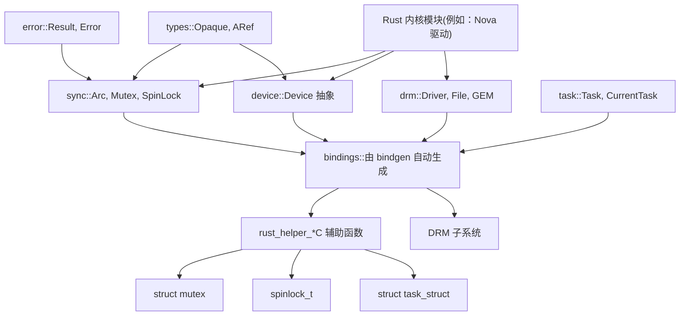
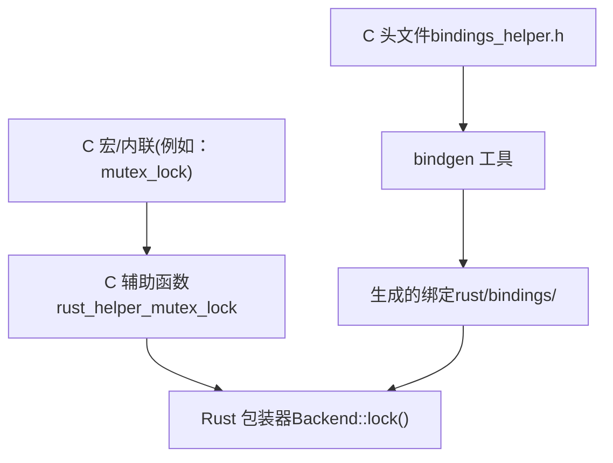
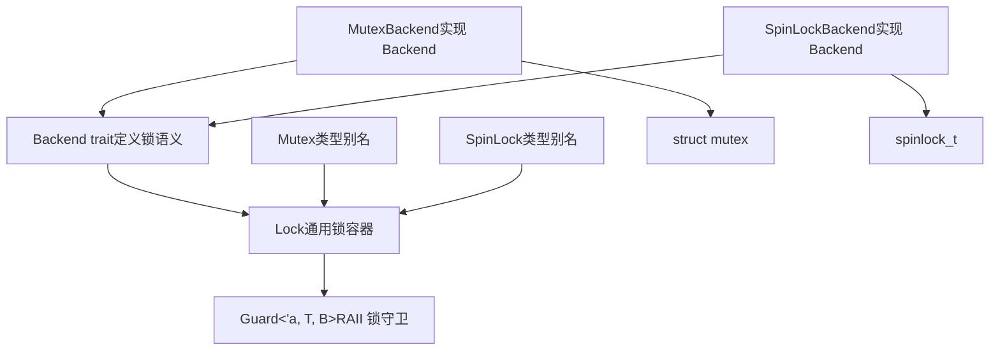
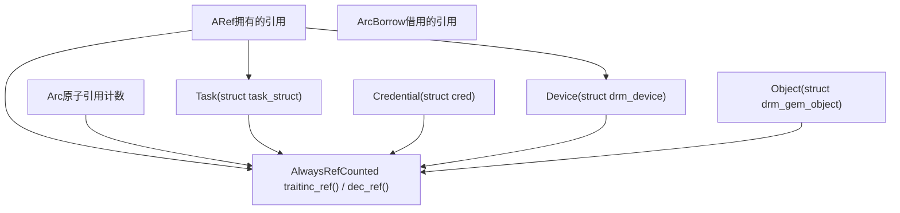
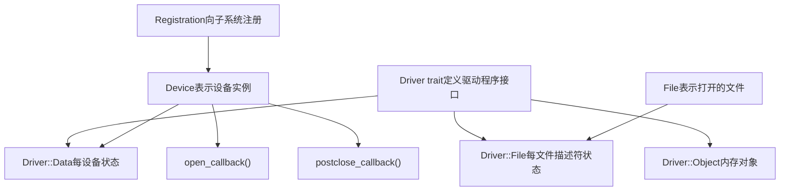
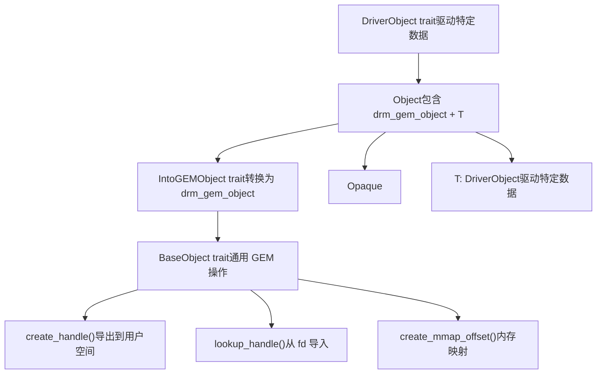

# Rust 内核 API 与抽象

相关源文件

-   [MAINTAINERS](https://github.com/torvalds/linux/blob/fcb70a56/MAINTAINERS)
-   [drivers/gpu/drm/drm\_panic\_qr.rs](https://github.com/torvalds/linux/blob/fcb70a56/drivers/gpu/drm/drm_panic_qr.rs)
-   [drivers/gpu/drm/nova/Kconfig](https://github.com/torvalds/linux/blob/fcb70a56/drivers/gpu/drm/nova/Kconfig)
-   [drivers/gpu/drm/nova/Makefile](https://github.com/torvalds/linux/blob/fcb70a56/drivers/gpu/drm/nova/Makefile)
-   [drivers/gpu/drm/nova/driver.rs](https://github.com/torvalds/linux/blob/fcb70a56/drivers/gpu/drm/nova/driver.rs)
-   [drivers/gpu/drm/nova/file.rs](https://github.com/torvalds/linux/blob/fcb70a56/drivers/gpu/drm/nova/file.rs)
-   [drivers/gpu/drm/nova/gem.rs](https://github.com/torvalds/linux/blob/fcb70a56/drivers/gpu/drm/nova/gem.rs)
-   [drivers/gpu/drm/nova/nova.rs](https://github.com/torvalds/linux/blob/fcb70a56/drivers/gpu/drm/nova/nova.rs)
-   [include/linux/rwlock\_rt.h](https://github.com/torvalds/linux/blob/fcb70a56/include/linux/rwlock_rt.h)
-   [include/linux/spinlock\_rt.h](https://github.com/torvalds/linux/blob/fcb70a56/include/linux/spinlock_rt.h)
-   [include/uapi/drm/nova\_drm.h](https://github.com/torvalds/linux/blob/fcb70a56/include/uapi/drm/nova_drm.h)
-   [rust/bindings/bindings\_helper.h](https://github.com/torvalds/linux/blob/fcb70a56/rust/bindings/bindings_helper.h)
-   [rust/helpers/barrier.c](https://github.com/torvalds/linux/blob/fcb70a56/rust/helpers/barrier.c)
-   [rust/helpers/bitmap.c](https://github.com/torvalds/linux/blob/fcb70a56/rust/helpers/bitmap.c)
-   [rust/helpers/bitops.c](https://github.com/torvalds/linux/blob/fcb70a56/rust/helpers/bitops.c)
-   [rust/helpers/drm.c](https://github.com/torvalds/linux/blob/fcb70a56/rust/helpers/drm.c)
-   [rust/helpers/helpers.c](https://github.com/torvalds/linux/blob/fcb70a56/rust/helpers/helpers.c)
-   [rust/helpers/mutex.c](https://github.com/torvalds/linux/blob/fcb70a56/rust/helpers/mutex.c)
-   [rust/helpers/pid\_namespace.c](https://github.com/torvalds/linux/blob/fcb70a56/rust/helpers/pid_namespace.c)
-   [rust/helpers/poll.c](https://github.com/torvalds/linux/blob/fcb70a56/rust/helpers/poll.c)
-   [rust/helpers/security.c](https://github.com/torvalds/linux/blob/fcb70a56/rust/helpers/security.c)
-   [rust/helpers/spinlock.c](https://github.com/torvalds/linux/blob/fcb70a56/rust/helpers/spinlock.c)
-   [rust/helpers/sync.c](https://github.com/torvalds/linux/blob/fcb70a56/rust/helpers/sync.c)
-   [rust/helpers/task.c](https://github.com/torvalds/linux/blob/fcb70a56/rust/helpers/task.c)
-   [rust/kernel/block/mq/tag\_set.rs](https://github.com/torvalds/linux/blob/fcb70a56/rust/kernel/block/mq/tag_set.rs)
-   [rust/kernel/cred.rs](https://github.com/torvalds/linux/blob/fcb70a56/rust/kernel/cred.rs)
-   [rust/kernel/drm/device.rs](https://github.com/torvalds/linux/blob/fcb70a56/rust/kernel/drm/device.rs)
-   [rust/kernel/drm/driver.rs](https://github.com/torvalds/linux/blob/fcb70a56/rust/kernel/drm/driver.rs)
-   [rust/kernel/drm/file.rs](https://github.com/torvalds/linux/blob/fcb70a56/rust/kernel/drm/file.rs)
-   [rust/kernel/drm/gem/mod.rs](https://github.com/torvalds/linux/blob/fcb70a56/rust/kernel/drm/gem/mod.rs)
-   [rust/kernel/drm/mod.rs](https://github.com/torvalds/linux/blob/fcb70a56/rust/kernel/drm/mod.rs)
-   [rust/kernel/lib.rs](https://github.com/torvalds/linux/blob/fcb70a56/rust/kernel/lib.rs)
-   [rust/kernel/pid\_namespace.rs](https://github.com/torvalds/linux/blob/fcb70a56/rust/kernel/pid_namespace.rs)
-   [rust/kernel/security.rs](https://github.com/torvalds/linux/blob/fcb70a56/rust/kernel/security.rs)
-   [rust/kernel/sync.rs](https://github.com/torvalds/linux/blob/fcb70a56/rust/kernel/sync.rs)
-   [rust/kernel/sync/barrier.rs](https://github.com/torvalds/linux/blob/fcb70a56/rust/kernel/sync/barrier.rs)
-   [rust/kernel/sync/condvar.rs](https://github.com/torvalds/linux/blob/fcb70a56/rust/kernel/sync/condvar.rs)
-   [rust/kernel/sync/lock.rs](https://github.com/torvalds/linux/blob/fcb70a56/rust/kernel/sync/lock.rs)
-   [rust/kernel/sync/lock/global.rs](https://github.com/torvalds/linux/blob/fcb70a56/rust/kernel/sync/lock/global.rs)
-   [rust/kernel/sync/lock/mutex.rs](https://github.com/torvalds/linux/blob/fcb70a56/rust/kernel/sync/lock/mutex.rs)
-   [rust/kernel/sync/lock/spinlock.rs](https://github.com/torvalds/linux/blob/fcb70a56/rust/kernel/sync/lock/spinlock.rs)
-   [rust/kernel/sync/poll.rs](https://github.com/torvalds/linux/blob/fcb70a56/rust/kernel/sync/poll.rs)
-   [rust/kernel/sync/set\_once.rs](https://github.com/torvalds/linux/blob/fcb70a56/rust/kernel/sync/set_once.rs)
-   [rust/kernel/task.rs](https://github.com/torvalds/linux/blob/fcb70a56/rust/kernel/task.rs)

## 目的与范围

本页面深入介绍了 Rust 内核抽象层，该层用安全、符合 Rust 惯用的接口包装了 C 内核 API。它涵盖了 Rust for Linux 项目中使用的同步原语、内存管理模式、设备驱动接口以及外部函数接口 (FFI) 架构。

有关 Rust 集成的高级动机和目标，请参阅 [Rust for Linux](/torvalds/linux/2-rust-for-linux)。有关使用这些抽象的完整驱动实现示例，请参阅 [Nova DRM 图形驱动](/torvalds/linux/2.2-nova-drm-graphics-driver)。

## 抽象层架构

Rust 内核抽象形成了一个分层架构，提供通往 C 内核功能的安全接口，同时保持零运行时开销。


**来源：** [rust/kernel/lib.rs1-369](https://github.com/torvalds/linux/blob/fcb70a56/rust/kernel/lib.rs#L1-L369) [rust/bindings/bindings\_helper.h1-152](https://github.com/torvalds/linux/blob/fcb70a56/rust/bindings/bindings_helper.h#L1-L152) [rust/helpers/helpers.c1-65](https://github.com/torvalds/linux/blob/fcb70a56/rust/helpers/helpers.c#L1-L65)

### 关键组件

抽象层由几个关键模块组成：

| 模块 | 用途 | 关键类型 |
| --- | --- | --- |
| `sync` | 同步原语 | `Arc`, `Mutex`, `SpinLock`, `CondVar` |
| `task` | 进程/线程管理 | `Task`, `CurrentTask`, `Kuid` |
| `device` | 设备模型抽象 | `Device`, 驱动注册 |
| `drm` | 图形子系统 | `Driver`, `Device`, `File`, GEM 对象 |
| `types` | 核心类型工具 | `Opaque`, `ARef`, `ForeignOwnable` |
| `error` | 错误处理 | `Result`, `Error`, 错误码 |

**来源：** [rust/kernel/lib.rs67-156](https://github.com/torvalds/linux/blob/fcb70a56/rust/kernel/lib.rs#L67-L156)

## FFI 架构与绑定生成

Rust 内核代码通过精心设计的 FFI 层与 C 代码交互，该层使用 `bindgen` 进行自动绑定生成，并对非平凡的 C 构造使用手动辅助函数。


**来源：** [rust/bindings/bindings\_helper.h1-152](https://github.com/torvalds/linux/blob/fcb70a56/rust/bindings/bindings_helper.h#L1-L152) [rust/helpers/helpers.c1-65](https://github.com/torvalds/linux/blob/fcb70a56/rust/helpers/helpers.c#L1-L65)

### Opaque 类型模式

C 结构使用 `Opaque<T>` 类型进行包装，提供对不透明 C 数据的安全接口：

-   `Opaque<T>` 表示一个不暴露其内部布局的 C 结构
-   提供返回 `*mut T` 的 `get()` 方法用于 FFI 调用
-   确保正确的对齐和大小
-   在整个内核中用于诸如 `bindings::mutex`, `bindings::spinlock_t`, `bindings::drm_device` 等结构

**示例用法：** [rust/kernel/sync/lock.rs108-109](https://github.com/torvalds/linux/blob/fcb70a56/rust/kernel/sync/lock.rs#L108-L109) 展示了用于锁状态的 `Opaque<B::State>`

**来源：** [rust/kernel/types.rs](https://github.com/torvalds/linux/blob/fcb70a56/rust/kernel/types.rs) (引用), [rust/kernel/sync/lock.rs106-120](https://github.com/torvalds/linux/blob/fcb70a56/rust/kernel/sync/lock.rs#L106-L120)

### 辅助函数惯例

复杂的 C 宏和内联函数被包装为带有 `rust_helper_*` 前缀的辅助函数：

| C 构造 | 辅助函数 | 位置 |
| --- | --- | --- |
| `mutex_lock()` | `rust_helper_mutex_lock()` | [rust/helpers/mutex.c5-8](https://github.com/torvalds/linux/blob/fcb70a56/rust/helpers/mutex.c#L5-L8) |
| `spin_lock()` | `rust_helper_spin_lock()` | [rust/helpers/spinlock.c19-22](https://github.com/torvalds/linux/blob/fcb70a56/rust/helpers/spinlock.c#L19-L22) |
| `__set_bit()` | `rust_helper___set_bit()` | [rust/helpers/bitops.c6-9](https://github.com/torvalds/linux/blob/fcb70a56/rust/helpers/bitops.c#L6-L9) |
| `get_task_struct()` | `rust_helper_get_task_struct()` | [rust/helpers/task.c16-19](https://github.com/torvalds/linux/blob/fcb70a56/rust/helpers/task.c#L16-L19) |

**来源：** [rust/helpers/mutex.c1-30](https://github.com/torvalds/linux/blob/fcb70a56/rust/helpers/mutex.c#L1-L30) [rust/helpers/spinlock.c1-38](https://github.com/torvalds/linux/blob/fcb70a56/rust/helpers/spinlock.c#L1-L38) [rust/helpers/task.c1-63](https://github.com/torvalds/linux/blob/fcb70a56/rust/helpers/task.c#L1-L63)

## 同步原语

`sync` 模块提供了围绕内核同步原语的安全包装器，具有编译时保证和通过 lockdep 集成进行的运行时锁验证。

### 锁架构


**来源：** [rust/kernel/sync.rs1-126](https://github.com/torvalds/linux/blob/fcb70a56/rust/kernel/sync.rs#L1-L126) [rust/kernel/sync/lock.rs1-318](https://github.com/torvalds/linux/blob/fcb70a56/rust/kernel/sync/lock.rs#L1-L318)

### Backend Trait

`Backend` trait 抽象了锁行为，实现了通用锁代码：

```
pub unsafe trait Backend {
    type State;           // C 锁结构 (例如：bindings::mutex)
    type GuardState;      // 锁定时维护的状态

    unsafe fn init(...);   // 初始化锁
    unsafe fn lock(...) -> Self::GuardState;
    unsafe fn unlock(...);
}
```
**关键方法：**

-   **`init()`**：使用名称和 lockdep 键初始化 C 锁结构
-   **`lock()`**：获取锁，返回守卫状态
-   **`unlock()`**：释放锁
-   **`try_lock()`**：尝试非阻塞获取
-   **`relock()`**：临时释放后重新获取（用于条件变量）

**来源：** [rust/kernel/sync/lock.rs22-98](https://github.com/torvalds/linux/blob/fcb70a56/rust/kernel/sync/lock.rs#L22-L98)

### Mutex 实现

Mutex 使用 C 内核中的 `struct mutex`：

| 属性 | 值 |
| --- | --- |
| Backend 类型 | `MutexBackend` |
| State | `bindings::mutex` |
| GuardState | `()` |
| 可睡眠 | 是 |
| 上下文 | 仅限非原子 |

**初始化：** [rust/kernel/sync/lock/mutex.rs101-126](https://github.com/torvalds/linux/blob/fcb70a56/rust/kernel/sync/lock/mutex.rs#L101-L126) - 使用带有 lockdep 键的 `__mutex_init()`

**锁定：** [rust/helpers/mutex.c5-13](https://github.com/torvalds/linux/blob/fcb70a56/rust/helpers/mutex.c#L5-L13) - 包装 `mutex_lock()` 和 `mutex_trylock()`

**来源：** [rust/kernel/sync/lock/mutex.rs1-174](https://github.com/torvalds/linux/blob/fcb70a56/rust/kernel/sync/lock/mutex.rs#L1-L174) [rust/helpers/mutex.c1-30](https://github.com/torvalds/linux/blob/fcb70a56/rust/helpers/mutex.c#L1-L30)

### SpinLock 实现

Spinlock 在原子上下文中使用 `spinlock_t`：

| 属性 | 值 |
| --- | --- |
| Backend 类型 | `SpinLockBackend` |
| State | `bindings::spinlock_t` |
| GuardState | `()` |
| 可睡眠 | 否 |
| 上下文 | 任何（原子安全） |

**初始化：** [rust/kernel/sync/lock/spinlock.rs104-113](https://github.com/torvalds/linux/blob/fcb70a56/rust/kernel/sync/lock/spinlock.rs#L104-L113) - 使用带有 lockdep 的 `__spin_lock_init()`

**锁定：** [rust/helpers/spinlock.c19-32](https://github.com/torvalds/linux/blob/fcb70a56/rust/helpers/spinlock.c#L19-L32) - 包装 `spin_lock()`、`spin_unlock()`、`spin_trylock()`

**来源：** [rust/kernel/sync/lock/spinlock.rs1-135](https://github.com/torvalds/linux/blob/fcb70a56/rust/kernel/sync/lock/spinlock.rs#L1-L135) [rust/helpers/spinlock.c1-38](https://github.com/torvalds/linux/blob/fcb70a56/rust/helpers/spinlock.c#L1-L38)

### 锁守卫模式

`Guard` 类型提供具有自动 drop 解锁功能的 RAII 语义：

**关键特性：**

-   **不可变访问**：`Deref` trait 提供 `&T`
-   **可变访问**：当 `T: Unpin` 时，`DerefMut` trait 提供 `&mut T`
-   **Pinned 访问**：对于 `!Unpin` 类型，`as_mut()` 返回 `Pin<&mut T>`
-   **临时解锁**：`do_unlocked()` 临时释放并重新获取

**示例：** [rust/kernel/sync/lock.rs238-247](https://github.com/torvalds/linux/blob/fcb70a56/rust/kernel/sync/lock.rs#L238-L247) 展示了 `do_unlocked()` 实现

**来源：** [rust/kernel/sync/lock.rs192-318](https://github.com/torvalds/linux/blob/fcb70a56/rust/kernel/sync/lock.rs#L192-L318)

### Lockdep 集成

所有锁都与内核的 lockdep 系统集成以进行死锁检测：

**LockClassKey：** [rust/kernel/sync.rs35-96](https://github.com/torvalds/linux/blob/fcb70a56/rust/kernel/sync.rs#L35-L96) - 表示一个 lockdep 类

**静态分配：** [rust/kernel/sync.rs98-112](https://github.com/torvalds/linux/blob/fcb70a56/rust/kernel/sync.rs#L98-L112) - 用于静态键的 `static_lock_class!()` 宏

**动态分配：** [rust/kernel/sync.rs48-82](https://github.com/torvalds/linux/blob/fcb70a56/rust/kernel/sync.rs#L48-L82) - 用于运行时的 `LockClassKey::new_dynamic()`

**来源：** [rust/kernel/sync.rs35-126](https://github.com/torvalds/linux/blob/fcb70a56/rust/kernel/sync.rs#L35-L126)

### 条件变量

`CondVar` 包装 `struct wait_queue_head` 以用于等待/通知模式：

**关键方法：**

-   `wait()`：原子地释放锁并睡眠（不可中断）
-   `wait_interruptible()`：可中断睡眠，如果有信号挂起则返回
-   `wait_interruptible_timeout()`：带超时支持
-   `notify_one()`：唤醒一个等待者
-   `notify_all()`：唤醒所有等待者
-   `notify_sync()`：对同一 CPU 唤醒的调度器提示

**实现细节：**

-   内部使用 `prepare_to_wait_exclusive()` / `finish_wait()`
-   与锁的 `do_unlocked()` 集成以进行原子释放/等待
-   返回带有超时/信号区分的 `CondVarTimeoutResult` 枚举

**来源：** [rust/kernel/sync/condvar.rs1-259](https://github.com/torvalds/linux/blob/fcb70a56/rust/kernel/sync/condvar.rs#L1-L259)

## 内存管理抽象

内核为引用计数对象提供了具有编译时安全保证的 Rust 抽象。

### 引用计数架构


**来源：** [rust/kernel/sync/arc.rs](https://github.com/torvalds/linux/blob/fcb70a56/rust/kernel/sync/arc.rs) (引用), [rust/kernel/sync/aref.rs](https://github.com/torvalds/linux/blob/fcb70a56/rust/kernel/sync/aref.rs) (引用)

### AlwaysRefCounted Trait

`AlwaysRefCounted` trait 连接了 Rust 所有权与 C 引用计数：

```
pub unsafe trait AlwaysRefCounted {
    fn inc_ref(&self);
    unsafe fn dec_ref(obj: NonNull<Self>);
}
```
**安全要求：**

-   当可从 Rust 访问时，类型必须始终被引用计数
-   在有效引用上调用 `inc_ref()` 会增加计数
-   `dec_ref()` 减少计数，并在计数达到零时可能释放

**Task 的示例实现：** [rust/kernel/task.rs350-363](https://github.com/torvalds/linux/blob/fcb70a56/rust/kernel/task.rs#L350-L363)

-   `inc_ref()` 调用 `get_task_struct()`
-   `dec_ref()` 调用 `put_task_struct()`

**来源：** [rust/kernel/types.rs](https://github.com/torvalds/linux/blob/fcb70a56/rust/kernel/types.rs) (引用), [rust/kernel/task.rs350-363](https://github.com/torvalds/linux/blob/fcb70a56/rust/kernel/task.rs#L350-L363) [rust/kernel/cred.rs78-92](https://github.com/torvalds/linux/blob/fcb70a56/rust/kernel/cred.rs#L78-L92)

### ARef 智能指针

`ARef<T>` 表示对引用计数对象的所有权引用：

**所有权语义：**

-   持有一个引用计数
-   Dropping 会减少引用计数
-   可以 Clone 以增加引用计数
-   可以与原始指针转换以进行 FFI 边界交互

**示例用法：** [rust/kernel/drm/gem/mod.rs148-151](https://github.com/torvalds/linux/blob/fcb70a56/rust/kernel/drm/gem/mod.rs#L148-L151) 从 `drm_gem_object_lookup()` 创建 `ARef`

**来源：** [rust/kernel/sync/aref.rs](https://github.com/torvalds/linux/blob/fcb70a56/rust/kernel/sync/aref.rs) (代码中引用)

### 用于分配的 Arc

`Arc<T>` 为内核分配的对象提供原子引用计数：

**特性：**

-   使用内核分配器（GFP 标志）进行分配
-   通过锁实现内部可变性
-   线程安全的引用计数
-   `UniqueArc` 用于共享前的独占所有权

**来源：** [rust/kernel/sync/arc.rs](https://github.com/torvalds/linux/blob/fcb70a56/rust/kernel/sync/arc.rs) (引用)

## 设备驱动框架

内核为设备驱动程序提供了通用抽象，并为诸如 DRM 之类的子系统提供了专门支持。

### Driver Trait 模式


**来源：** [rust/kernel/drm/driver.rs1-171](https://github.com/torvalds/linux/blob/fcb70a56/rust/kernel/drm/driver.rs#L1-L171) [rust/kernel/drm/device.rs1-230](https://github.com/torvalds/linux/blob/fcb70a56/rust/kernel/drm/device.rs#L1-L230)

### DRM Driver Trait

`drm::Driver` trait 定义了 DRM 驱动程序的接口：

**关联类型：**

-   `Data`：驱动程序特定的设备数据（例如，硬件状态）
-   `Object`：内存管理器实现（GEM 对象）
-   `File`：每个文件描述符状态

**常量：**

-   `INFO`：驱动程序元数据（名称、描述、版本）
-   `IOCTLS`：用户空间 API 的 IOCTL 定义

**示例：** [drivers/gpu/drm/nova/driver.rs11-68](https://github.com/torvalds/linux/blob/fcb70a56/drivers/gpu/drm/nova/driver.rs#L11-L68) 展示了 Nova 驱动程序实现

**来源：** [rust/kernel/drm/driver.rs96-116](https://github.com/torvalds/linux/blob/fcb70a56/rust/kernel/drm/driver.rs#L96-L116)

### 设备表示

`drm::Device<T: Driver>` 表示一个 DRM 设备实例：

**结构：**

-   包装 `Opaque<bindings::drm_device>`
-   包含用于驱动程序状态的 `T::Data`
-   始终通过 `AlwaysRefCounted` 进行引用计数

**创建：** [rust/kernel/drm/device.rs98-136](https://github.com/torvalds/linux/blob/fcb70a56/rust/kernel/drm/device.rs#L98-L136)

-   通过 `__drm_dev_alloc()` 分配
-   Pin 初始化驱动程序数据
-   返回 `ARef<Device<T>>`

**VTABLE：** [rust/kernel/drm/device.rs64-93](https://github.com/torvalds/linux/blob/fcb70a56/rust/kernel/drm/device.rs#L64-L93) - 用回调填充 `drm_driver`

**来源：** [rust/kernel/drm/device.rs50-230](https://github.com/torvalds/linux/blob/fcb70a56/rust/kernel/drm/device.rs#L50-L230)

### 文件操作

DRM 文件操作通过 `drm::file::DriverFile` trait 暴露：

**生命周期：**

-   `open()`：当设备文件打开时调用
-   `postclose()`：当文件关闭时调用

**回调：** [rust/kernel/drm/file.rs47-97](https://github.com/torvalds/linux/blob/fcb70a56/rust/kernel/drm/file.rs#L47-L97) 实现 FFI 回调，路由到 trait 方法

**示例实现：** [drivers/gpu/drm/nova/file.rs13-21](https://github.com/torvalds/linux/blob/fcb70a56/drivers/gpu/drm/nova/file.rs#L13-L21) 展示了简单的文件状态

**来源：** [rust/kernel/drm/file.rs1-121](https://github.com/torvalds/linux/blob/fcb70a56/rust/kernel/drm/file.rs#L1-L121) [drivers/gpu/drm/nova/file.rs1-70](https://github.com/torvalds/linux/blob/fcb70a56/drivers/gpu/drm/nova/file.rs#L1-L70)

### GEM 对象抽象

DRM 图形执行管理器 (GEM) 对象表示 GPU 内存：


**来源：** [rust/kernel/drm/gem/mod.rs1-316](https://github.com/torvalds/linux/blob/fcb70a56/rust/kernel/drm/gem/mod.rs#L1-L316)

### DriverObject Trait

驱动程序特定的 GEM 对象数据通过 `DriverObject` 定义：

**必需方法：**

-   `new()`：为给定大小创建驱动程序数据
-   `open()`：当句柄创建时调用（可选）
-   `close()`：当句柄销毁时调用（可选）

**类型参数：**

-   `Driver`：关联的驱动程序类型

**示例：** [drivers/gpu/drm/nova/gem.rs16-25](https://github.com/torvalds/linux/blob/fcb70a56/drivers/gpu/drm/nova/gem.rs#L16-L25) 展示了最小实现

**来源：** [rust/kernel/drm/gem/mod.rs25-40](https://github.com/torvalds/linux/blob/fcb70a56/rust/kernel/drm/gem/mod.rs#L25-L40) [drivers/gpu/drm/nova/gem.rs16-25](https://github.com/torvalds/linux/blob/fcb70a56/drivers/gpu/drm/nova/gem.rs#L16-L25)

### BaseObject 操作

所有对象上可用的通用 GEM 操作：

| 方法 | 用途 | C 等价物 |
| --- | --- | --- |
| `size()` | 获取对象大小（字节） | `drm_gem_object.size` |
| `create_handle()` | 导出到用户空间句柄 | `drm_gem_handle_create()` |
| `lookup_handle()` | 从句柄导入 | `drm_gem_object_lookup()` |
| `create_mmap_offset()` | 创建 mmap 偏移量 | `drm_gem_create_mmap_offset()` |

**句柄管理：** [rust/kernel/drm/gem/mod.rs109-151](https://github.com/torvalds/linux/blob/fcb70a56/rust/kernel/drm/gem/mod.rs#L109-L151) 实现句柄创建/查找

**来源：** [rust/kernel/drm/gem/mod.rs102-163](https://github.com/torvalds/linux/blob/fcb70a56/rust/kernel/drm/gem/mod.rs#L102-L163)

## 类型安全模式

Rust 内核抽象采用多种模式来确保类型安全并防止常见的 C 错误。

### Pin 和 PinInit

许多内核结构包含自引用指针，且初始化后不得移动：

**用法：**

-   `#[pin_data]` 宏标记需要 pinning 的结构
-   `pin_init!()` 宏创建 pinned 初始化器
-   锁、条件变量和设备结构使用 pinning

**示例：** [rust/kernel/sync/lock.rs104-115](https://github.com/torvalds/linux/blob/fcb70a56/rust/kernel/sync/lock.rs#L104-L115) - `Lock` 包含 `PhantomPinned`

**来源：** [rust/kernel/sync/lock.rs104-146](https://github.com/torvalds/linux/blob/fcb70a56/rust/kernel/sync/lock.rs#L104-L146) [rust/kernel/sync/condvar.rs81-92](https://github.com/torvalds/linux/blob/fcb70a56/rust/kernel/sync/condvar.rs#L81-L92)

### Opaque 类型

`Opaque<T>` 提供对 C 结构的安全访问：

**属性：**

-   如果 `T` 是零大小的，则为零大小
-   `T` 的正确对齐
-   提供返回 `*mut T` 的 `get()`
-   对于静态分配可以未初始化

**用法：** [rust/kernel/sync/lock.rs108-109](https://github.com/torvalds/linux/blob/fcb70a56/rust/kernel/sync/lock.rs#L108-L109) 包装锁后端状态

**来源：** [rust/kernel/types.rs](https://github.com/torvalds/linux/blob/fcb70a56/rust/kernel/types.rs) (引用), [rust/kernel/sync/lock.rs108-109](https://github.com/torvalds/linux/blob/fcb70a56/rust/kernel/sync/lock.rs#L108-L109)

### 类型状态模式

驱动程序使用类型参数在编译时编码状态：

**示例 - 设备绑定状态：**

-   `Device<Bound>` vs `Device<Unbound>`
-   某些操作仅在 `Device<Bound>` 上可用
-   防止初始化前使用错误

**来源：** [rust/kernel/device.rs](https://github.com/torvalds/linux/blob/fcb70a56/rust/kernel/device.rs) (引用)

### NotThreadSafe 标记

`CurrentTask` 使用 `NotThreadSafe` 防止跨线程使用：

**用途：** 确保任务上下文不会在线程上下文之间逃逸

**实现：** [rust/kernel/task.rs137](https://github.com/torvalds/linux/blob/fcb70a56/rust/kernel/task.rs#L137-L137) - 包含 `NotThreadSafe` 字段

**不变量：** [rust/kernel/task.rs116-136](https://github.com/torvalds/linux/blob/fcb70a56/rust/kernel/task.rs#L116-L136) 记录上下文限制

**来源：** [rust/kernel/task.rs110-146](https://github.com/torvalds/linux/blob/fcb70a56/rust/kernel/task.rs#L110-L146)

## 总结

Rust 内核抽象提供了通往 C 内核 API 的安全、符合人体工程学的接口，同时保持零运行时开销。关键设计原则包括：

1.  **FFI 边界**：通过 `bindgen` 和辅助函数清晰分离 Rust 抽象和 C 代码
2.  **通用抽象**：锁 `Backend` trait 支持跨 mutex/spinlock 的代码重用
3.  **引用计数**：`AlwaysRefCounted` trait 连接 Rust 所有权与 C 引用计数
4.  **类型安全**：Pin、Opaque 和类型状态模式防止常见的 C 错误
5.  **零成本**：所有抽象编译为与 C 等效物相同的机器代码

这些抽象在 Nova DRM 驱动程序（参见 [Nova DRM 图形驱动](/torvalds/linux/2.2-nova-drm-graphics-driver)）和其他 Rust 内核组件中得到广泛使用。

**来源：** [rust/kernel/lib.rs1-369](https://github.com/torvalds/linux/blob/fcb70a56/rust/kernel/lib.rs#L1-L369) [rust/kernel/sync.rs1-126](https://github.com/torvalds/linux/blob/fcb70a56/rust/kernel/sync.rs#L1-L126) [rust/kernel/drm/mod.rs1-20](https://github.com/torvalds/linux/blob/fcb70a56/rust/kernel/drm/mod.rs#L1-L20)
