# KVM x86 虚拟化

相关源文件

-   [Documentation/virt/kvm/api.rst](https://github.com/torvalds/linux/blob/fcb70a56/Documentation/virt/kvm/api.rst)
-   [Documentation/virt/kvm/locking.rst](https://github.com/torvalds/linux/blob/fcb70a56/Documentation/virt/kvm/locking.rst)
-   [Documentation/virt/kvm/x86/index.rst](https://github.com/torvalds/linux/blob/fcb70a56/Documentation/virt/kvm/x86/index.rst)
-   [Documentation/virt/kvm/x86/intel-tdx.rst](https://github.com/torvalds/linux/blob/fcb70a56/Documentation/virt/kvm/x86/intel-tdx.rst)
-   [arch/loongarch/kvm/Kconfig](https://github.com/torvalds/linux/blob/fcb70a56/arch/loongarch/kvm/Kconfig)
-   [arch/mips/kvm/Kconfig](https://github.com/torvalds/linux/blob/fcb70a56/arch/mips/kvm/Kconfig)
-   [arch/powerpc/kvm/Kconfig](https://github.com/torvalds/linux/blob/fcb70a56/arch/powerpc/kvm/Kconfig)
-   [arch/riscv/kvm/Kconfig](https://github.com/torvalds/linux/blob/fcb70a56/arch/riscv/kvm/Kconfig)
-   [arch/s390/kvm/Kconfig](https://github.com/torvalds/linux/blob/fcb70a56/arch/s390/kvm/Kconfig)
-   [arch/x86/coco/tdx/Makefile](https://github.com/torvalds/linux/blob/fcb70a56/arch/x86/coco/tdx/Makefile)
-   [arch/x86/coco/tdx/debug.c](https://github.com/torvalds/linux/blob/fcb70a56/arch/x86/coco/tdx/debug.c)
-   [arch/x86/coco/tdx/tdx.c](https://github.com/torvalds/linux/blob/fcb70a56/arch/x86/coco/tdx/tdx.c)
-   [arch/x86/include/asm/apic.h](https://github.com/torvalds/linux/blob/fcb70a56/arch/x86/include/asm/apic.h)
-   [arch/x86/include/asm/hw\_irq.h](https://github.com/torvalds/linux/blob/fcb70a56/arch/x86/include/asm/hw_irq.h)
-   [arch/x86/include/asm/irq\_remapping.h](https://github.com/torvalds/linux/blob/fcb70a56/arch/x86/include/asm/irq_remapping.h)
-   [arch/x86/include/asm/kvm-x86-ops.h](https://github.com/torvalds/linux/blob/fcb70a56/arch/x86/include/asm/kvm-x86-ops.h)
-   [arch/x86/include/asm/kvm\_host.h](https://github.com/torvalds/linux/blob/fcb70a56/arch/x86/include/asm/kvm_host.h)
-   [arch/x86/include/asm/posted\_intr.h](https://github.com/torvalds/linux/blob/fcb70a56/arch/x86/include/asm/posted_intr.h)
-   [arch/x86/include/asm/shared/tdx.h](https://github.com/torvalds/linux/blob/fcb70a56/arch/x86/include/asm/shared/tdx.h)
-   [arch/x86/include/asm/svm.h](https://github.com/torvalds/linux/blob/fcb70a56/arch/x86/include/asm/svm.h)
-   [arch/x86/include/asm/tdx.h](https://github.com/torvalds/linux/blob/fcb70a56/arch/x86/include/asm/tdx.h)
-   [arch/x86/include/asm/tdx\_global\_metadata.h](https://github.com/torvalds/linux/blob/fcb70a56/arch/x86/include/asm/tdx_global_metadata.h)
-   [arch/x86/include/asm/vmx.h](https://github.com/torvalds/linux/blob/fcb70a56/arch/x86/include/asm/vmx.h)
-   [arch/x86/include/uapi/asm/kvm.h](https://github.com/torvalds/linux/blob/fcb70a56/arch/x86/include/uapi/asm/kvm.h)
-   [arch/x86/include/uapi/asm/svm.h](https://github.com/torvalds/linux/blob/fcb70a56/arch/x86/include/uapi/asm/svm.h)
-   [arch/x86/include/uapi/asm/vmx.h](https://github.com/torvalds/linux/blob/fcb70a56/arch/x86/include/uapi/asm/vmx.h)
-   [arch/x86/kernel/apic/io\_apic.c](https://github.com/torvalds/linux/blob/fcb70a56/arch/x86/kernel/apic/io_apic.c)
-   [arch/x86/kernel/apic/msi.c](https://github.com/torvalds/linux/blob/fcb70a56/arch/x86/kernel/apic/msi.c)
-   [arch/x86/kernel/irq.c](https://github.com/torvalds/linux/blob/fcb70a56/arch/x86/kernel/irq.c)
-   [arch/x86/kvm/Kconfig](https://github.com/torvalds/linux/blob/fcb70a56/arch/x86/kvm/Kconfig)
-   [arch/x86/kvm/Makefile](https://github.com/torvalds/linux/blob/fcb70a56/arch/x86/kvm/Makefile)
-   [arch/x86/kvm/hyperv.c](https://github.com/torvalds/linux/blob/fcb70a56/arch/x86/kvm/hyperv.c)
-   [arch/x86/kvm/irq.c](https://github.com/torvalds/linux/blob/fcb70a56/arch/x86/kvm/irq.c)
-   [arch/x86/kvm/irq.h](https://github.com/torvalds/linux/blob/fcb70a56/arch/x86/kvm/irq.h)
-   [arch/x86/kvm/kvm\_onhyperv.c](https://github.com/torvalds/linux/blob/fcb70a56/arch/x86/kvm/kvm_onhyperv.c)
-   [arch/x86/kvm/lapic.c](https://github.com/torvalds/linux/blob/fcb70a56/arch/x86/kvm/lapic.c)
-   [arch/x86/kvm/lapic.h](https://github.com/torvalds/linux/blob/fcb70a56/arch/x86/kvm/lapic.h)
-   [arch/x86/kvm/mmu.h](https://github.com/torvalds/linux/blob/fcb70a56/arch/x86/kvm/mmu.h)
-   [arch/x86/kvm/mmu/mmu.c](https://github.com/torvalds/linux/blob/fcb70a56/arch/x86/kvm/mmu/mmu.c)
-   [arch/x86/kvm/mmu/mmu\_internal.h](https://github.com/torvalds/linux/blob/fcb70a56/arch/x86/kvm/mmu/mmu_internal.h)
-   [arch/x86/kvm/mmu/paging\_tmpl.h](https://github.com/torvalds/linux/blob/fcb70a56/arch/x86/kvm/mmu/paging_tmpl.h)
-   [arch/x86/kvm/mmu/spte.c](https://github.com/torvalds/linux/blob/fcb70a56/arch/x86/kvm/mmu/spte.c)
-   [arch/x86/kvm/mmu/spte.h](https://github.com/torvalds/linux/blob/fcb70a56/arch/x86/kvm/mmu/spte.h)
-   [arch/x86/kvm/mmu/tdp\_iter.c](https://github.com/torvalds/linux/blob/fcb70a56/arch/x86/kvm/mmu/tdp_iter.c)
-   [arch/x86/kvm/mmu/tdp\_iter.h](https://github.com/torvalds/linux/blob/fcb70a56/arch/x86/kvm/mmu/tdp_iter.h)
-   [arch/x86/kvm/mmu/tdp\_mmu.c](https://github.com/torvalds/linux/blob/fcb70a56/arch/x86/kvm/mmu/tdp_mmu.c)
-   [arch/x86/kvm/mmu/tdp\_mmu.h](https://github.com/torvalds/linux/blob/fcb70a56/arch/x86/kvm/mmu/tdp_mmu.h)
-   [arch/x86/kvm/pmu.c](https://github.com/torvalds/linux/blob/fcb70a56/arch/x86/kvm/pmu.c)
-   [arch/x86/kvm/pmu.h](https://github.com/torvalds/linux/blob/fcb70a56/arch/x86/kvm/pmu.h)
-   [arch/x86/kvm/smm.c](https://github.com/torvalds/linux/blob/fcb70a56/arch/x86/kvm/smm.c)
-   [arch/x86/kvm/smm.h](https://github.com/torvalds/linux/blob/fcb70a56/arch/x86/kvm/smm.h)
-   [arch/x86/kvm/svm/avic.c](https://github.com/torvalds/linux/blob/fcb70a56/arch/x86/kvm/svm/avic.c)
-   [arch/x86/kvm/svm/nested.c](https://github.com/torvalds/linux/blob/fcb70a56/arch/x86/kvm/svm/nested.c)
-   [arch/x86/kvm/svm/pmu.c](https://github.com/torvalds/linux/blob/fcb70a56/arch/x86/kvm/svm/pmu.c)
-   [arch/x86/kvm/svm/sev.c](https://github.com/torvalds/linux/blob/fcb70a56/arch/x86/kvm/svm/sev.c)
-   [arch/x86/kvm/svm/svm.c](https://github.com/torvalds/linux/blob/fcb70a56/arch/x86/kvm/svm/svm.c)
-   [arch/x86/kvm/svm/svm.h](https://github.com/torvalds/linux/blob/fcb70a56/arch/x86/kvm/svm/svm.h)
-   [arch/x86/kvm/svm/svm\_onhyperv.c](https://github.com/torvalds/linux/blob/fcb70a56/arch/x86/kvm/svm/svm_onhyperv.c)
-   [arch/x86/kvm/svm/svm\_onhyperv.h](https://github.com/torvalds/linux/blob/fcb70a56/arch/x86/kvm/svm/svm_onhyperv.h)
-   [arch/x86/kvm/vmx/capabilities.h](https://github.com/torvalds/linux/blob/fcb70a56/arch/x86/kvm/vmx/capabilities.h)
-   [arch/x86/kvm/vmx/common.h](https://github.com/torvalds/linux/blob/fcb70a56/arch/x86/kvm/vmx/common.h)
-   [arch/x86/kvm/vmx/main.c](https://github.com/torvalds/linux/blob/fcb70a56/arch/x86/kvm/vmx/main.c)
-   [arch/x86/kvm/vmx/nested.c](https://github.com/torvalds/linux/blob/fcb70a56/arch/x86/kvm/vmx/nested.c)
-   [arch/x86/kvm/vmx/nested.h](https://github.com/torvalds/linux/blob/fcb70a56/arch/x86/kvm/vmx/nested.h)
-   [arch/x86/kvm/vmx/pmu\_intel.c](https://github.com/torvalds/linux/blob/fcb70a56/arch/x86/kvm/vmx/pmu_intel.c)
-   [arch/x86/kvm/vmx/pmu\_intel.h](https://github.com/torvalds/linux/blob/fcb70a56/arch/x86/kvm/vmx/pmu_intel.h)
-   [arch/x86/kvm/vmx/posted\_intr.c](https://github.com/torvalds/linux/blob/fcb70a56/arch/x86/kvm/vmx/posted_intr.c)
-   [arch/x86/kvm/vmx/posted\_intr.h](https://github.com/torvalds/linux/blob/fcb70a56/arch/x86/kvm/vmx/posted_intr.h)
-   [arch/x86/kvm/vmx/tdx.c](https://github.com/torvalds/linux/blob/fcb70a56/arch/x86/kvm/vmx/tdx.c)
-   [arch/x86/kvm/vmx/tdx.h](https://github.com/torvalds/linux/blob/fcb70a56/arch/x86/kvm/vmx/tdx.h)
-   [arch/x86/kvm/vmx/tdx\_arch.h](https://github.com/torvalds/linux/blob/fcb70a56/arch/x86/kvm/vmx/tdx_arch.h)
-   [arch/x86/kvm/vmx/tdx\_errno.h](https://github.com/torvalds/linux/blob/fcb70a56/arch/x86/kvm/vmx/tdx_errno.h)
-   [arch/x86/kvm/vmx/vmx.c](https://github.com/torvalds/linux/blob/fcb70a56/arch/x86/kvm/vmx/vmx.c)
-   [arch/x86/kvm/vmx/vmx.h](https://github.com/torvalds/linux/blob/fcb70a56/arch/x86/kvm/vmx/vmx.h)
-   [arch/x86/kvm/vmx/x86\_ops.h](https://github.com/torvalds/linux/blob/fcb70a56/arch/x86/kvm/vmx/x86_ops.h)
-   [arch/x86/kvm/x86.c](https://github.com/torvalds/linux/blob/fcb70a56/arch/x86/kvm/x86.c)
-   [arch/x86/kvm/x86.h](https://github.com/torvalds/linux/blob/fcb70a56/arch/x86/kvm/x86.h)
-   [arch/x86/mm/mem\_encrypt.c](https://github.com/torvalds/linux/blob/fcb70a56/arch/x86/mm/mem_encrypt.c)
-   [arch/x86/platform/uv/uv\_irq.c](https://github.com/torvalds/linux/blob/fcb70a56/arch/x86/platform/uv/uv_irq.c)
-   [arch/x86/virt/vmx/tdx/seamcall.S](https://github.com/torvalds/linux/blob/fcb70a56/arch/x86/virt/vmx/tdx/seamcall.S)
-   [arch/x86/virt/vmx/tdx/tdx.c](https://github.com/torvalds/linux/blob/fcb70a56/arch/x86/virt/vmx/tdx/tdx.c)
-   [arch/x86/virt/vmx/tdx/tdx.h](https://github.com/torvalds/linux/blob/fcb70a56/arch/x86/virt/vmx/tdx/tdx.h)
-   [drivers/iommu/intel/irq\_remapping.c](https://github.com/torvalds/linux/blob/fcb70a56/drivers/iommu/intel/irq_remapping.c)
-   [drivers/xen/events/events\_base.c](https://github.com/torvalds/linux/blob/fcb70a56/drivers/xen/events/events_base.c)
-   [include/kvm/arm\_arch\_timer.h](https://github.com/torvalds/linux/blob/fcb70a56/include/kvm/arm_arch_timer.h)
-   [include/kvm/arm\_pmu.h](https://github.com/torvalds/linux/blob/fcb70a56/include/kvm/arm_pmu.h)
-   [include/linux/kvm\_dirty\_ring.h](https://github.com/torvalds/linux/blob/fcb70a56/include/linux/kvm_dirty_ring.h)
-   [include/linux/kvm\_host.h](https://github.com/torvalds/linux/blob/fcb70a56/include/linux/kvm_host.h)
-   [include/linux/misc\_cgroup.h](https://github.com/torvalds/linux/blob/fcb70a56/include/linux/misc_cgroup.h)
-   [include/uapi/linux/kvm.h](https://github.com/torvalds/linux/blob/fcb70a56/include/uapi/linux/kvm.h)
-   [include/uapi/linux/magic.h](https://github.com/torvalds/linux/blob/fcb70a56/include/uapi/linux/magic.h)
-   [kernel/cgroup/misc.c](https://github.com/torvalds/linux/blob/fcb70a56/kernel/cgroup/misc.c)
-   [tools/arch/arm64/include/asm/sysreg.h](https://github.com/torvalds/linux/blob/fcb70a56/tools/arch/arm64/include/asm/sysreg.h)
-   [tools/include/linux/kasan-tags.h](https://github.com/torvalds/linux/blob/fcb70a56/tools/include/linux/kasan-tags.h)
-   [tools/testing/selftests/kvm/guest\_memfd\_test.c](https://github.com/torvalds/linux/blob/fcb70a56/tools/testing/selftests/kvm/guest_memfd_test.c)
-   [tools/testing/selftests/kvm/include/test\_util.h](https://github.com/torvalds/linux/blob/fcb70a56/tools/testing/selftests/kvm/include/test_util.h)
-   [tools/testing/selftests/kvm/lib/test\_util.c](https://github.com/torvalds/linux/blob/fcb70a56/tools/testing/selftests/kvm/lib/test_util.c)
-   [virt/kvm/Kconfig](https://github.com/torvalds/linux/blob/fcb70a56/virt/kvm/Kconfig)
-   [virt/kvm/Makefile.kvm](https://github.com/torvalds/linux/blob/fcb70a56/virt/kvm/Makefile.kvm)
-   [virt/kvm/dirty\_ring.c](https://github.com/torvalds/linux/blob/fcb70a56/virt/kvm/dirty_ring.c)
-   [virt/kvm/guest\_memfd.c](https://github.com/torvalds/linux/blob/fcb70a56/virt/kvm/guest_memfd.c)
-   [virt/kvm/kvm\_main.c](https://github.com/torvalds/linux/blob/fcb70a56/virt/kvm/kvm_main.c)
-   [virt/kvm/kvm\_mm.h](https://github.com/torvalds/linux/blob/fcb70a56/virt/kvm/kvm_mm.h)

## 目的与范围

本文档涵盖了基于内核的虚拟机 (KVM) 管理程序在 x86 架构上的实现。它详细介绍了 Intel 和 AMD 处理器的核心虚拟化基础设施，包括硬件辅助虚拟化 (VMX/SVM)、内存管理单元 (MMU) 虚拟化、中断处理以及机密计算扩展。

有关 ARM64 虚拟化的实现，请参阅 [KVM ARM64 虚拟化](/torvalds/linux/3.2-kvm-arm64-virtualization)。有关架构无关的 KVM 核心，请参阅 [virt/kvm/kvm\_main.c1-6000](https://github.com/torvalds/linux/blob/fcb70a56/virt/kvm/kvm_main.c#L1-L6000)

## 架构概览

KVM x86 提供了一个利用硬件虚拟化扩展来运行客户机虚拟机的管理程序。该实现分为供应商特定代码（Intel VMX 和 AMD SVM）和通用 x86 虚拟化逻辑。

```mermaid
flowchart TD
    QEMU["QEMU/VMM用户空间设备模拟"]
    MGMT["管理工具libvirt"]
    KVM_DEV["/dev/kvm字符设备"]
    VM_FD["VM 文件描述符每个 VM 状态"]
    VCPU_FD["VCPU 文件描述符每个 vCPU 状态"]
    X86_CORE["x86.ckvm_x86_ops 分发MSR/CPUID 处理"]
    CPUID["cpuid.ckvm_find_cpuid_entry2CPUID 模拟"]
    EMULATE["emulate.cx86_emulate_ctxt指令模拟"]
    VMX_MAIN["vmx.cstruct vcpu_vmxvmx_vcpu_run"]
    VMX_NESTED["nested.c嵌套虚拟化vmcs12 处理"]
    VMX_TDX["tdx.cIntel TDXtdh_* SEAMCALLs"]
    SVM_MAIN["svm.cstruct vcpu_svmsvm_vcpu_run"]
    SVM_NESTED["nested.c嵌套 SVMvmcb 处理"]
    SVM_SEV["sev.cAMD SEV/SNPsev_guest_*"]
    MMU_CORE["mmu.ckvm_mmu_page影子页表"]
    TDP_MMU["tdp_mmu.cTDP MMUEPT/NPT 直接映射"]
    LAPIC["lapic.ckvm_lapic本地 APIC 模拟"]
    IOAPIC["ioapic.cI/O APIC 模拟"]

    QEMU --> KVM_DEV
    MGMT --> KVM_DEV
    KVM --> DEV_VM_FD
    VM --> FD_VCPU_FD
    VCPU --> FD_X86_CORE
    X86 --> CORE_CPUID
    X86 --> CORE_EMULATE
    X86 --> CORE_VMX_MAIN
    X86 --> CORE_SVM_MAIN
    VMX --> MAIN_VMX_NESTED
    VMX --> MAIN_VMX_TDX
    SVM --> MAIN_SVM_NESTED
    SVM --> MAIN_SVM_SEV
    VMX --> MAIN_MMU_CORE
    SVM --> MAIN_MMU_CORE
    MMU --> CORE_TDP_MMU
    X86 --> CORE_LAPIC
    X86 --> CORE_IOAPIC
```
来源：[arch/x86/kvm/x86.c1-100](https://github.com/torvalds/linux/blob/fcb70a56/arch/x86/kvm/x86.c#L1-L100) [arch/x86/kvm/vmx/vmx.c1-100](https://github.com/torvalds/linux/blob/fcb70a56/arch/x86/kvm/vmx/vmx.c#L1-L100) [arch/x86/kvm/svm/svm.c1-100](https://github.com/torvalds/linux/blob/fcb70a56/arch/x86/kvm/svm/svm.c#L1-L100) [arch/x86/kvm/mmu/mmu.c1-100](https://github.com/torvalds/linux/blob/fcb70a56/arch/x86/kvm/mmu/mmu.c#L1-L100)

## 核心数据结构

### VM 和 VCPU 状态

用于管理虚拟机和虚拟 CPU 的主要数据结构：

| 结构体 | 文件 | 用途 |
| --- | --- | --- |
| `struct kvm` | [include/linux/kvm\_host.h700-900](https://github.com/torvalds/linux/blob/fcb70a56/include/linux/kvm_host.h#L700-L900) | 每个 VM 的状态、内存槽、IRQ 路由 |
| `struct kvm_vcpu` | [include/linux/kvm\_host.h350-550](https://github.com/torvalds/linux/blob/fcb70a56/include/linux/kvm_host.h#L350-L550) | 每个 VCPU 的状态、寄存器、请求 |
| `struct kvm_x86_ops` | [arch/x86/kvm/x86.c141](https://github.com/torvalds/linux/blob/fcb70a56/arch/x86/kvm/x86.c#L141-L141) | 供应商特定的函数指针 |
| `struct vcpu_vmx` | [arch/x86/kvm/vmx/vmx.h200-400](https://github.com/torvalds/linux/blob/fcb70a56/arch/x86/kvm/vmx/vmx.h#L200-400) | VMX 特定的 VCPU 状态 |
| `struct vcpu_svm` | [arch/x86/kvm/svm/svm.h100-300](https://github.com/torvalds/linux/blob/fcb70a56/arch/x86/kvm/svm/svm.h#L100-L300) | SVM 特定的 VCPU 状态 |

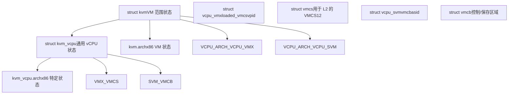
来源：[arch/x86/include/asm/kvm\_host.h700-1000](https://github.com/torvalds/linux/blob/fcb70a56/arch/x86/include/asm/kvm_host.h#L700-L1000) [arch/x86/kvm/vmx/vmx.h200-400](https://github.com/torvalds/linux/blob/fcb70a56/arch/x86/kvm/vmx/vmx.h#L200-L400) [arch/x86/kvm/svm/svm.h100-300](https://github.com/torvalds/linux/blob/fcb70a56/arch/x86/kvm/svm/svm.h#L100-L300)

## 供应商特定实现

### Intel VMX (虚拟机扩展)

VMX 是 Intel 的硬件虚拟化技术。实现围绕 VMCS (虚拟机控制结构) 和 VM 入口/退出机制展开。

**关键组件：**

-   **VMCS 管理**：[arch/x86/kvm/vmx/vmcs.c1-500](https://github.com/torvalds/linux/blob/fcb70a56/arch/x86/kvm/vmx/vmcs.c#L1-L500) 处理 VMCS 分配和切换
-   **VM 入口/退出**：[arch/x86/kvm/vmx/vmx.c7000-7500](https://github.com/torvalds/linux/blob/fcb70a56/arch/x86/kvm/vmx/vmx.c#L7000-L7500) 实现 `vmx_vcpu_run` 用于转换
-   **VPID**：用于 TLB 标记的虚拟处理器 ID [arch/x86/kvm/vmx/vmx.c478-479](https://github.com/torvalds/linux/blob/fcb70a56/arch/x86/kvm/vmx/vmx.c#L478-L479)
-   **EPT**：用于 MMU 虚拟化的扩展页表 [arch/x86/kvm/mmu/mmu.c100-200](https://github.com/torvalds/linux/blob/fcb70a56/arch/x86/kvm/mmu/mmu.c#L100-L200)

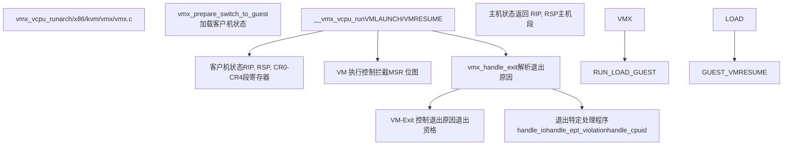
**模块参数：**

-   `enable_vpid`：启用虚拟处理器 ID (默认: 1) [arch/x86/kvm/vmx/vmx.c91-92](https://github.com/torvalds/linux/blob/fcb70a56/arch/x86/kvm/vmx/vmx.c#L91-L92)
-   `enable_ept`：启用扩展页表 (默认: 1) [arch/x86/kvm/vmx/vmx.c100-101](https://github.com/torvalds/linux/blob/fcb70a56/arch/x86/kvm/vmx/vmx.c#L100-L101)
-   `nested`：启用嵌套虚拟化 (默认: 1) [arch/x86/kvm/vmx/vmx.c126-127](https://github.com/torvalds/linux/blob/fcb70a56/arch/x86/kvm/vmx/vmx.c#L126-L127)

来源：[arch/x86/kvm/vmx/vmx.c1-1000](https://github.com/torvalds/linux/blob/fcb70a56/arch/x86/kvm/vmx/vmx.c#L1-L1000) [arch/x86/kvm/vmx/vmcs.c1-300](https://github.com/torvalds/linux/blob/fcb70a56/arch/x86/kvm/vmx/vmcs.c#L1-L300)

### AMD SVM (安全虚拟机)

SVM 是 AMD 基于 VMCB (虚拟机控制块) 的硬件虚拟化技术。

**关键组件：**

-   **VMCB 管理**：[arch/x86/kvm/svm/svm.c933-948](https://github.com/torvalds/linux/blob/fcb70a56/arch/x86/kvm/svm/svm.c#L933-L948) 初始化段和系统结构
-   **VM 入口/退出**：[arch/x86/kvm/svm/svm.c4000-5000](https://github.com/torvalds/linux/blob/fcb70a56/arch/x86/kvm/svm/svm.c#L4000-L5000) 实现 `svm_vcpu_run`
-   **ASID**：用于 TLB 标记的地址空间标识符 [arch/x86/kvm/svm/svm.c521-525](https://github.com/torvalds/linux/blob/fcb70a56/arch/x86/kvm/svm/svm.c#L521-L525)
-   **NPT**：用于 MMU 虚拟化的嵌套页表 [arch/x86/kvm/svm/svm.c135-136](https://github.com/torvalds/linux/blob/fcb70a56/arch/x86/kvm/svm/svm.c#L135-L136)

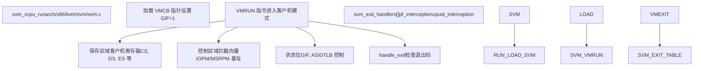
**模块参数：**

-   `npt`：启用嵌套页表 (默认: 1) [arch/x86/kvm/svm/svm.c135-136](https://github.com/torvalds/linux/blob/fcb70a56/arch/x86/kvm/svm/svm.c#L135-L136)
-   `nested`：启用嵌套虚拟化 (默认: 1) [arch/x86/kvm/svm/svm.c139-140](https://github.com/torvalds/linux/blob/fcb70a56/arch/x86/kvm/svm/svm.c#L139-L140)
-   `vls`：启用虚拟 VMLOAD/VMSAVE (默认: 1) [arch/x86/kvm/svm/svm.c147-148](https://github.com/torvalds/linux/blob/fcb70a56/arch/x86/kvm/svm/svm.c#L147-L148)

来源：[arch/x86/kvm/svm/svm.c1-2000](https://github.com/torvalds/linux/blob/fcb70a56/arch/x86/kvm/svm/svm.c#L1-L2000) [arch/x86/kvm/svm/svm.h1-200](https://github.com/torvalds/linux/blob/fcb70a56/arch/x86/kvm/svm/svm.h#L1-L200)

## MMU 虚拟化

KVM 提供了两种 MMU 虚拟化方法：影子页表和硬件辅助二维分页 (EPT/NPT)。

### 影子页表 vs TDP

| 方法 | 描述 | 文件 | 何时使用 |
| --- | --- | --- | --- |
| 影子 PT | 镜像客户机 PT 的软件维护页表 | [arch/x86/kvm/mmu/mmu.c1-8000](https://github.com/torvalds/linux/blob/fcb70a56/arch/x86/kvm/mmu/mmu.c#L1-L8000) | 旧版，无 EPT/NPT |
| TDP (EPT/NPT) | 硬件二维分页 | [arch/x86/kvm/mmu/tdp\_mmu.c1-2000](https://github.com/torvalds/linux/blob/fcb70a56/arch/x86/kvm/mmu/tdp_mmu.c#L1-L2000) | 现代处理器 |

```mermaid
flowchart TD
    GUEST_VA["客户机虚拟地址GVA"]
    GUEST_PT["客户机页表gCR3, gPTE"]
    GUEST_PA["客户机物理地址GPA"]
    SHADOW_PT["影子页表struct kvm_mmu_page"]
    SHADOW_SYNC["kvm_mmu_get_page与客户机 PT 同步"]
    HOST_PA_SHADOW["主机物理地址HPA"]
    EPT_NPT["EPT/NPT 表tdp_mmu_root"]
    GPA_TO_HPA["直接 GPA->HPA 映射无客户机 PT 遍历"]
    HOST_PA_TDP["主机物理地址HPA"]
    PF_HANDLER["kvm_mmu_page_fault处理 EPT violation/NPT fault"]
    SPTE_SET["mmu_spte_set安装 SPTE"]

    GUEST --> VA_GUEST_PT
    GUEST --> PT_GUEST_PA
    GUEST --> PT_SHADOW_SYNC
    SHADOW --> SYNC_SHADOW_PT
    SHADOW --> PT_HOST_PA_SHADOW
    GUEST --> PA_GPA_TO_HPA
    GPA --> TO_HPA_EPT_NPT
    EPT --> NPT_HOST_PA_TDP
    HOST --> PA_SHADOW_PF_HANDLER
    HOST --> PA_TDP_PF_HANDLER
    PF --> HANDLER_SPTE_SET
```
### 关键 MMU 结构

**struct kvm\_mmu\_page**：表示一页页表条目

-   字段：`role`, `gfn`, `spt`, `shadowed_translation`
-   文件：[arch/x86/include/asm/kvm\_host.h400-500](https://github.com/torvalds/linux/blob/fcb70a56/arch/x86/include/asm/kvm_host.h#L400-L500)

**影子页表条目 (SPTE)**：影子/EPT/NPT 表中的 64 位条目

-   编码：存在位、写位、可执行位、PFN
-   文件：[arch/x86/kvm/mmu/spte.h1-300](https://github.com/torvalds/linux/blob/fcb70a56/arch/x86/kvm/mmu/spte.h#L1-L300)

**MMU 操作：**

-   `kvm_mmu_page_fault`：处理缺页异常的入口点 [arch/x86/kvm/mmu/mmu.c5000-5100](https://github.com/torvalds/linux/blob/fcb70a56/arch/x86/kvm/mmu/mmu.c#L5000-L5100)
-   `kvm_mmu_get_page`：分配或查找现有影子页 [arch/x86/kvm/mmu/mmu.c2000-2200](https://github.com/torvalds/linux/blob/fcb70a56/arch/x86/kvm/mmu/mmu.c#L2000-L2200)
-   `mmu_spte_set`：原子地安装 SPTE [arch/x86/kvm/mmu/mmu.c482-486](https://github.com/torvalds/linux/blob/fcb70a56/arch/x86/kvm/mmu/mmu.c#L482-L486)

来源：[arch/x86/kvm/mmu/mmu.c1-1000](https://github.com/torvalds/linux/blob/fcb70a56/arch/x86/kvm/mmu/mmu.c#L1-L1000) [arch/x86/kvm/mmu/tdp\_mmu.c1-500](https://github.com/torvalds/linux/blob/fcb70a56/arch/x86/kvm/mmu/tdp_mmu.c#L1-L500) [arch/x86/kvm/mmu/spte.h1-200](https://github.com/torvalds/linux/blob/fcb70a56/arch/x86/kvm/mmu/spte.h#L1-L200)

## 中断处理

KVM 虚拟化了本地 APIC (每 CPU) 和 I/O APIC (系统范围的中断控制器)。

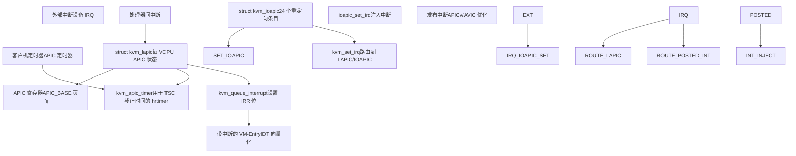
### 本地 APIC 虚拟化

**关键函数：**

-   `kvm_create_lapic`：分配并初始化 LAPIC [arch/x86/kvm/lapic.c2700-2800](https://github.com/torvalds/linux/blob/fcb70a56/arch/x86/kvm/lapic.c#L2700-L2800)
-   `kvm_apic_set_irq`：排队中断以进行投递 [arch/x86/kvm/lapic.c1000-1100](https://github.com/torvalds/linux/blob/fcb70a56/arch/x86/kvm/lapic.c#L1000-L1100)
-   `kvm_lapic_msr_write`：处理 APIC MSR 写操作 (x2APIC) [arch/x86/kvm/lapic.c82](https://github.com/torvalds/linux/blob/fcb70a56/arch/x86/kvm/lapic.c#L82-L82)

**APIC 寄存器：**

-   映射在 `APIC_BASE` (默认 0xFEE00000)
-   带有中断控制寄存器的 4KB MMIO 区域
-   通过 MMIO 或 MSR (x2APIC 模式) 访问

**APIC 定时器模式：**

-   One-shot (单次)：计数过期后产生单个中断
-   Periodic (周期)：重复中断
-   TSC-deadline：当 TSC 达到截止时间时产生中断 [arch/x86/kvm/lapic.c2000-2100](https://github.com/torvalds/linux/blob/fcb70a56/arch/x86/kvm/lapic.c#L2000-L2100)

来源：[arch/x86/kvm/lapic.c1-500](https://github.com/torvalds/linux/blob/fcb70a56/arch/x86/kvm/lapic.c#L1-L500) [arch/x86/kvm/lapic.h1-200](https://github.com/torvalds/linux/blob/fcb70a56/arch/x86/kvm/lapic.h#L1-L200)

## 机密计算扩展

### Intel TDX (信任域扩展)

TDX 使用 SEAM (安全仲裁模式) 和加密内存提供硬件隔离的机密 VM。

```mermaid
flowchart TD
    TD_INIT["tdx_vm_init分配 HKID"]
    TD_KEY["tdh_mng_key_config配置加密密钥"]
    TD_FINALIZE["tdh_mr_finalize锁定配置"]
    VCPU_INIT["tdx_vcpu_create分配 TDVPR"]
    VCPU_SETUP["tdh_vp_init初始化 TD VCPU"]
    VCPU_RUN["tdx_vcpu_runtdh_vp_enter SEAMCALL"]
    TDVMCALL["TDVMCALL 退出客户机->主机调用"]
    HANDLERS["handle_io_readhandle_mmio_writehandle_cpuid"]
    SEPT["安全 EPTTDX 私有内存"]
    TDX_SEPT_SET["tdh_mem_page_add添加客户机页面"]
    TDX_SEPT_ZAP["tdh_mem_page_remove移除页面"]

    TD --> INIT_TD_KEY
    TD --> KEY_TD_FINALIZE
    TD --> FINALIZE_VCPU_INIT
    VCPU --> INIT_VCPU_SETUP
    VCPU --> SETUP_VCPU_RUN
    VCPU --> RUN_TDVMCALL
    TDVMCALL --> HANDLERS
    VCPU --> SETUP_TDX_SEPT_SET
    TDX --> SEPT_SET_SEPT
    SEPT --> TDX_SEPT_ZAP
```
**关键 TDX 函数：**

-   `tdh_mng_create`：创建信任域 [arch/x86/kvm/vmx/tdx.c1000-1100](https://github.com/torvalds/linux/blob/fcb70a56/arch/x86/kvm/vmx/tdx.c#L1000-L1100)
-   `tdh_vp_enter`：进入 TD VCPU [arch/x86/kvm/vmx/tdx.c1500-1600](https://github.com/torvalds/linux/blob/fcb70a56/arch/x86/kvm/vmx/tdx.c#L1500-L1600)
-   `tdh_mem_page_add`：添加私有内存页 [arch/x86/kvm/vmx/tdx.c2000-2100](https://github.com/torvalds/linux/blob/fcb70a56/arch/x86/kvm/vmx/tdx.c#L2000-L2100)

**HKID (主机密钥 ID)：**

-   硬件加密密钥标识符
-   从有限池中分配 [arch/x86/kvm/vmx/tdx.c253-266](https://github.com/torvalds/linux/blob/fcb70a56/arch/x86/kvm/vmx/tdx.c#L253-L266)
-   必须通过缓存刷新回收 [arch/x86/kvm/vmx/tdx.c440-470](https://github.com/torvalds/linux/blob/fcb70a56/arch/x86/kvm/vmx/tdx.c#L440-L470)

来源：[arch/x86/kvm/vmx/tdx.c1-1000](https://github.com/torvalds/linux/blob/fcb70a56/arch/x86/kvm/vmx/tdx.c#L1-L1000) [arch/x86/kvm/vmx/tdx.h1-200](https://github.com/torvalds/linux/blob/fcb70a56/arch/x86/kvm/vmx/tdx.h#L1-L200)

### AMD SEV/SEV-ES/SEV-SNP

SEV 提供 VM 内存加密，SEV-ES 增加寄存器加密，SEV-SNP 增加完整性保护。

```mermaid
flowchart TD
    ASID_ALLOC["sev_asid_new分配 ASID"]
    SEV_INIT["sev_guest_initPSP 固件调用"]
    SEV_LAUNCH["LAUNCH_STARTLAUNCH_UPDATE_DATALAUNCH_FINISH"]
    SEV["SEV内存加密"]
    SEV_ES["SEV-ES+ 寄存器加密+ VMSA 保护"]
    SEV_SNP["SEV-SNP+ RMP 完整性+ VMPL"]
    RMP_TABLE["RMP 表页面元数据每页 ASID/VMPL"]
    RMP_CHECK["rmp_make_private分配给客户机"]
    RMP_RECLAIM["rmp_make_shared返回给主机"]
    VMGEXIT["VMGEXIT用于 I/O 的客户机退出"]
    GHCB_PAGE["GHCB 页面共享通信"]
    NAE_HANDLER["sev_handle_vmgexit处理请求"]

    SEV --> SEV_ES
    SEV --> ES_SEV_SNP
    SEV --> SNP_RMP_TABLE
    RMP --> TABLE_RMP_CHECK
    RMP --> CHECK_RMP_RECLAIM
    SEV --> ES_VMGEXIT
    VMGEXIT --> GHCB_PAGE
    GHCB --> PAGE_NAE_HANDLER
    ASID --> ALLOC_SEV_INIT
    SEV --> INIT_SEV_LAUNCH
```
**SEV 模块参数：**

-   `sev`：启用 SEV 支持 (默认: 1) [arch/x86/kvm/svm/sev.c45-46](https://github.com/torvalds/linux/blob/fcb70a56/arch/x86/kvm/svm/sev.c#L45-L46)
-   `sev_es`：启用 SEV-ES 支持 (默认: 1) [arch/x86/kvm/svm/sev.c48-50](https://github.com/torvalds/linux/blob/fcb70a56/arch/x86/kvm/svm/sev.c#L48-L50)
-   `sev_snp`：启用 SEV-SNP 支持 (默认: 1) [arch/x86/kvm/svm/sev.c52-54](https://github.com/torvalds/linux/blob/fcb70a56/arch/x86/kvm/svm/sev.c#L52-L54)

**PSP (平台安全处理器) 命令：**

-   `SEV_CMD_LAUNCH_START`：开始 VM 加密
-   `SEV_CMD_LAUNCH_UPDATE_DATA`：加密客户机内存
-   `SEV_CMD_LAUNCH_FINISH`：完成启动并生成度量

**RMP (反向映射表)：**

-   硬件维护的用于 SNP 页面验证的表
-   跟踪每页的 ASID 和 VMPL
-   防止未授权访问客户机内存

来源：[arch/x86/kvm/svm/sev.c1-1000](https://github.com/torvalds/linux/blob/fcb70a56/arch/x86/kvm/svm/sev.c#L1-L1000) [arch/x86/kvm/svm/svm.h200-400](https://github.com/torvalds/linux/blob/fcb70a56/arch/x86/kvm/svm/svm.h#L200-L400)

## VCPU 运行循环

运行虚拟 CPU 的主要执行循环涉及进入客户机模式、处理退出和重新进入。

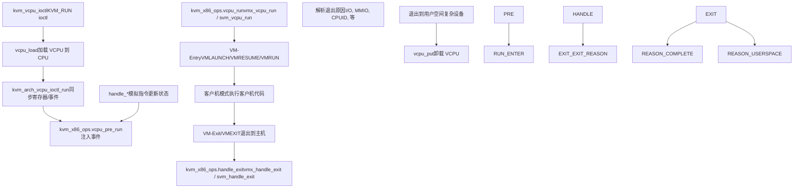
**关键运行循环函数：**

| 函数 | 用途 | 文件 |
| --- | --- | --- |
| `kvm_arch_vcpu_ioctl_run` | 主运行循环入口 | [arch/x86/kvm/x86.c10000-11000](https://github.com/torvalds/linux/blob/fcb70a56/arch/x86/kvm/x86.c#L10000-L11000) |
| `vmx_vcpu_run` | VMX 客户机入口/退出 | [arch/x86/kvm/vmx/vmx.c7000-7500](https://github.com/torvalds/linux/blob/fcb70a56/arch/x86/kvm/vmx/vmx.c#L7000-L7500) |
| `svm_vcpu_run` | SVM 客户机入口/退出 | [arch/x86/kvm/svm/svm.c4000-5000](https://github.com/torvalds/linux/blob/fcb70a56/arch/x86/kvm/svm/svm.c#L4000-L5000) |
| `vcpu_enter_guest` | 通用入口逻辑 | [arch/x86/kvm/x86.c11000-12000](https://github.com/torvalds/linux/blob/fcb70a56/arch/x86/kvm/x86.c#L11000-L12000) |

**退出原因：**

常见的 VM-Exit/VMEXIT 原因包括：

-   I/O 端口访问 (IN/OUT 指令)
-   CPUID 指令
-   MSR 读/写 (RDMSR/WRMSR)
-   EPT/NPT 缺页
-   中断窗口
-   HALT 指令

来源：[arch/x86/kvm/x86.c10000-12000](https://github.com/torvalds/linux/blob/fcb70a56/arch/x86/kvm/x86.c#L10000-L12000) [arch/x86/kvm/vmx/vmx.c5000-7500](https://github.com/torvalds/linux/blob/fcb70a56/arch/x86/kvm/vmx/vmx.c#L5000-L7500) [arch/x86/kvm/svm/svm.c3000-5000](https://github.com/torvalds/linux/blob/fcb70a56/arch/x86/kvm/svm/svm.c#L3000-L5000)

## MSR 和 CPUID 虚拟化

### MSR 处理

KVM 拦截特定型号寄存器 (Model-Specific Register) 访问，并进行模拟或透传给硬件。

```mermaid
flowchart TD
    RDMSR["RDMSR 指令"]
    WRMSR["WRMSR 指令"]
    MSR_BITMAP["MSR 权限位图4KB 读 + 4KB 写每 MSR 1 位"]
    INTERCEPT_CHECK["位 = 1: 拦截位 = 0: 透传"]
    VMX_MSR["vmx_get_msr / vmx_set_msr"]
    SVM_MSR["svm_get_msr / svm_set_msr"]
    COMMON_MSR["kvm_get_msr_commonkvm_set_msr_common"]
    EMULATED["模拟的 MSRMSR_IA32_TSC_ADJUSTMSR_KVM_*"]
    SAVED["保存/恢复的 MSRMSR_IA32_SYSENTER_*MSR_STAR"]
    PASSTHROUGH["透传的 MSRMSR_IA32_MISC_ENABLE架构 MSR"]

    RDMSR --> MSR_BITMAP
    WRMSR --> MSR_BITMAP
    MSR --> BITMAP_INTERCEPT_CHECK
    INTERCEPT --> CHECK_VMX_MSR
    INTERCEPT --> CHECK_SVM_MSR
    VMX --> MSR_COMMON_MSR
    SVM --> MSR_COMMON_MSR
    COMMON --> MSR_EMULATED
    COMMON --> MSR_SAVED
    COMMON --> MSR_PASSTHROUGH
```
**MSR 列表：**

-   `msrs_to_save[]`：需要主机支持的 MSR [arch/x86/kvm/x86.c329-383](https://github.com/torvalds/linux/blob/fcb70a56/arch/x86/kvm/x86.c#L329-L383)
-   `emulated_msrs[]`：由 KVM 模拟的 MSR [arch/x86/kvm/x86.c389-455](https://github.com/torvalds/linux/blob/fcb70a56/arch/x86/kvm/x86.c#L389-L455)
-   `msr_based_features[]`：暴露 CPU 特性的 MSR [arch/x86/kvm/x86.c465-474](https://github.com/torvalds/linux/blob/fcb70a56/arch/x86/kvm/x86.c#L465-L474)

### CPUID 虚拟化

CPUID 指令被拦截以控制 CPU 特性对客户机的可见性。

**CPUID 处理：**

1.  客户机执行 CPUID
2.  VM-Exit 到 KVM
3.  `kvm_emulate_cpuid` 查找缓存条目 [arch/x86/kvm/cpuid.c1100-1200](https://github.com/torvalds/linux/blob/fcb70a56/arch/x86/kvm/cpuid.c#L1100-L1200)
4.  返回 `kvm_cpuid_entry2` 数组中的值
5.  VM-Entry，结果在 EAX/EBX/ECX/EDX 中

**关键函数：**

-   `kvm_vcpu_ioctl_set_cpuid2`：从用户空间设置 CPUID 值 [arch/x86/kvm/cpuid.c400-500](https://github.com/torvalds/linux/blob/fcb70a56/arch/x86/kvm/cpuid.c#L400-L500)
-   `kvm_find_cpuid_entry2`：查找 CPUID 条目 [arch/x86/kvm/cpuid.c84-120](https://github.com/torvalds/linux/blob/fcb70a56/arch/x86/kvm/cpuid.c#L84-L120)
-   `kvm_update_cpuid_runtime`：更新运行时可变特性 [arch/x86/kvm/cpuid.c300-400](https://github.com/torvalds/linux/blob/fcb70a56/arch/x86/kvm/cpuid.c#L300-L400)

来源：[arch/x86/kvm/x86.c1000-2000](https://github.com/torvalds/linux/blob/fcb70a56/arch/x86/kvm/x86.c#L1000-L2000) [arch/x86/kvm/cpuid.c1-500](https://github.com/torvalds/linux/blob/fcb70a56/arch/x86/kvm/cpuid.c#L1-L500)

## 指令模拟

当 KVM 无法在客户机模式下直接执行指令时，它使用 x86 指令模拟器。

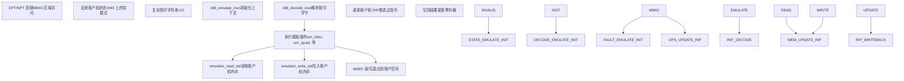
**模拟上下文：**

-   `struct x86_emulate_ctxt`：模拟状态 [arch/x86/kvm/emulate.c100-300](https://github.com/torvalds/linux/blob/fcb70a56/arch/x86/kvm/emulate.c#L100-L300)
-   `struct x86_emulate_ops`：内存访问回调 [arch/x86/kvm/x86.c8000-9000](https://github.com/torvalds/linux/blob/fcb70a56/arch/x86/kvm/x86.c#L8000-L9000)

**模拟操作：**

-   `em_cpuid`：CPUID 模拟 [arch/x86/kvm/emulate.c4000-4100](https://github.com/torvalds/linux/blob/fcb70a56/arch/x86/kvm/emulate.c#L4000-L4100)
-   `em_rdtsc`：RDTSC 模拟 [arch/x86/kvm/emulate.c4100-4200](https://github.com/torvalds/linux/blob/fcb70a56/arch/x86/kvm/emulate.c#L4100-L4200)
-   `em_io_read`/`em_io_write`：I/O 端口模拟 [arch/x86/kvm/emulate.c6000-7000](https://github.com/torvalds/linux/blob/fcb70a56/arch/x86/kvm/emulate.c#L6000-L7000)

来源：[arch/x86/kvm/emulate.c1-5000](https://github.com/torvalds/linux/blob/fcb70a56/arch/x86/kvm/emulate.c#L1-L5000) [arch/x86/kvm/x86.c8000-9000](https://github.com/torvalds/linux/blob/fcb70a56/arch/x86/kvm/x86.c#L8000-L9000)

## 模块参数与能力

### 全局模块参数

| 参数 | 默认值 | 描述 | 文件 |
| --- | --- | --- | --- |
| `kvm_caps` | N/A | 硬件能力 | [arch/x86/kvm/x86.c98](https://github.com/torvalds/linux/blob/fcb70a56/arch/x86/kvm/x86.c#L98-L98) |
| `ignore_msrs` | 0 | 忽略未知的 MSR 访问 | [arch/x86/kvm/x86.c152](https://github.com/torvalds/linux/blob/fcb70a56/arch/x86/kvm/x86.c#L152-L152) |
| `enable_pmu` | 1 | 启用 PMU 虚拟化 | [arch/x86/kvm/x86.c185-187](https://github.com/torvalds/linux/blob/fcb70a56/arch/x86/kvm/x86.c#L185-L187) |
| `enable_apicv` | 1 | 启用 APICv/AVIC | [arch/x86/kvm/x86.c234-235](https://github.com/torvalds/linux/blob/fcb70a56/arch/x86/kvm/x86.c#L234-L235) |
| `tdp_enabled` | (auto) | 二维分页 | [arch/x86/kvm/mmu/mmu.c106](https://github.com/torvalds/linux/blob/fcb70a56/arch/x86/kvm/mmu/mmu.c#L106-L106) |

### KVM 能力结构

`kvm_caps` 结构体跟踪硬件虚拟化能力：

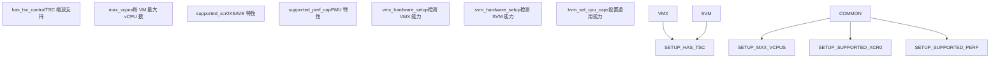
来源：[arch/x86/kvm/x86.c1-200](https://github.com/torvalds/linux/blob/fcb70a56/arch/x86/kvm/x86.c#L1-L200) [arch/x86/kvm/vmx/vmx.c8000-9000](https://github.com/torvalds/linux/blob/fcb70a56/arch/x86/kvm/vmx/vmx.c#L8000-L9000) [arch/x86/kvm/svm/svm.c4500-5500](https://github.com/torvalds/linux/blob/fcb70a56/arch/x86/kvm/svm/svm.c#L4500-L5500)

## 嵌套虚拟化

KVM 支持在 VM 内运行管理程序（L1 管理程序运行 L2 客户机）。

```mermaid
flowchart TD
    L0_KVM["KVM 主机管理程序"]
    L1_VM["L1 VM启用嵌套 VMX/SVM"]
    L1_VMCS["vmcs12L1 为 L2 准备的 VMCS"]
    L1_VMCB["L1 为 L2 准备的 VMCB"]
    L2_VM["L2 VM运行在 L1 下"]
    VMCS02["vmcs02影子 VMCSL0 看到的 L2"]
    VMCS_MERGE["prepare_vmcs02合并 vmcs12 + vmcs01"]
    NESTED_RUN["nested_vmx_run进入 L2"]
    NESTED_VMCB["嵌套 VMCBL0 看到的 L2"]
    VMCB_MERGE["nested_svm_vmrun合并 VMCB"]
    NESTED_SVM_RUN["在 SVM 中进入 L2"]

    L0 --> KVM_L1_VM
    L1 --> VM_L1_VMCS
    L1 --> VM_L1_VMCB
    L1 --> VMCS_VMCS_MERGE
    VMCS --> MERGE_VMCS02
    VMCS02 --> NESTED_RUN
    NESTED --> RUN_L2_VM
    L1 --> VMCB_VMCB_MERGE
    VMCB --> MERGE_NESTED_VMCB
    NESTED --> VMCB_NESTED_SVM_RUN
    NESTED --> SVM_RUN_L2_VM
```
**嵌套 VMX：**

-   L1 VMCS 存储在 `vmcs12` 中 [arch/x86/kvm/vmx/vmcs12.h1-200](https://github.com/torvalds/linux/blob/fcb70a56/arch/x86/kvm/vmx/vmcs12.h#L1-L200)
-   影子 VMCS `vmcs02` 由 L0 维护
-   `prepare_vmcs02`：合并 L1 和 L0 控制 [arch/x86/kvm/vmx/nested.c2000-3000](https://github.com/torvalds/linux/blob/fcb70a56/arch/x86/kvm/vmx/nested.c#L2000-L3000)
-   `nested_vmx_run`：处理来自 L1 的 VMLAUNCH/VMRESUME [arch/x86/kvm/vmx/nested.c3000-4000](https://github.com/torvalds/linux/blob/fcb70a56/arch/x86/kvm/vmx/nested.c#L3000-L4000)

**嵌套 SVM：**

-   L1 VMCB 可在客户机内存中直接访问
-   `nested_svm_vmrun`：处理来自 L1 的 VMRUN [arch/x86/kvm/svm/nested.c500-700](https://github.com/torvalds/linux/blob/fcb70a56/arch/x86/kvm/svm/nested.c#L500-L700)
-   `nested_svm_vmexit`：合成 VMEXIT 到 L1 [arch/x86/kvm/svm/nested.c700-900](https://github.com/torvalds/linux/blob/fcb70a56/arch/x86/kvm/svm/nested.c#L700-L900)

来源：[arch/x86/kvm/vmx/nested.c1-5000](https://github.com/torvalds/linux/blob/fcb70a56/arch/x86/kvm/vmx/nested.c#L1-L5000) [arch/x86/kvm/svm/nested.c1-2000](https://github.com/torvalds/linux/blob/fcb70a56/arch/x86/kvm/svm/nested.c#L1-L2000)

## 性能优化

### APICv/AVIC (高级中断虚拟化)

无需 VM 退出即可进行硬件加速中断投递：

-   **Posted Interrupts (Intel)**：直接向客户机投递中断 [arch/x86/kvm/vmx/posted\_intr.c1-500](https://github.com/torvalds/linux/blob/fcb70a56/arch/x86/kvm/vmx/posted_intr.c#L1-L500)
-   **AVIC (AMD)**：高级虚拟中断控制器 [arch/x86/kvm/svm/avic.c1-1000](https://github.com/torvalds/linux/blob/fcb70a56/arch/x86/kvm/svm/avic.c#L1-L1000)

### Pause Loop Exiting (PLE)

检测并处理自旋锁争用：

-   **ple\_gap**：两次 PAUSE 执行之间的时间 [arch/x86/kvm/vmx/vmx.c180](https://github.com/torvalds/linux/blob/fcb70a56/arch/x86/kvm/vmx/vmx.c#L180-L180)
-   **ple\_window**：PAUSE 循环中的最长时间 [arch/x86/kvm/vmx/vmx.c183](https://github.com/torvalds/linux/blob/fcb70a56/arch/x86/kvm/vmx/vmx.c#L183-L183)

### 脏页跟踪

有效地跟踪修改过的页面：

-   **PML (页面修改日志)**：硬件脏页跟踪 [arch/x86/kvm/vmx/vmx.c129-130](https://github.com/torvalds/linux/blob/fcb70a56/arch/x86/kvm/vmx/vmx.c#L129-L130)
-   **写保护 SPTE**：通过 MMU 进行软件脏页跟踪

来源：[arch/x86/kvm/vmx/posted\_intr.c1-300](https://github.com/torvalds/linux/blob/fcb70a56/arch/x86/kvm/vmx/posted_intr.c#L1-L300) [arch/x86/kvm/svm/avic.c1-500](https://github.com/torvalds/linux/blob/fcb70a56/arch/x86/kvm/svm/avic.c#L1-L500)
