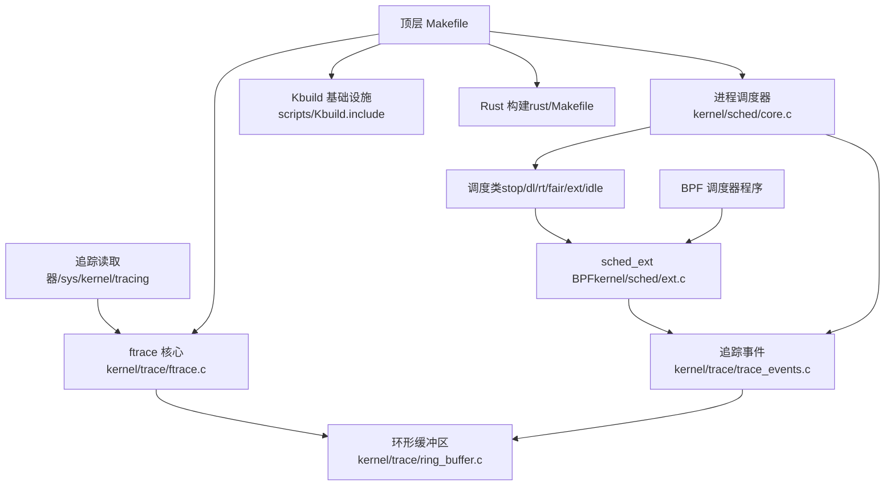
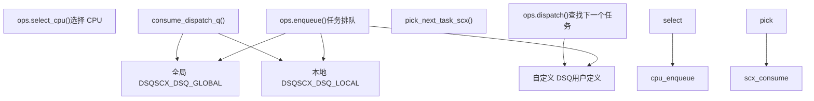
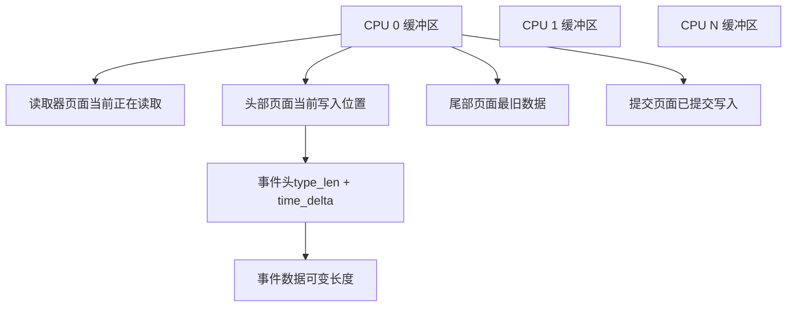
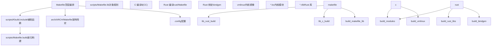
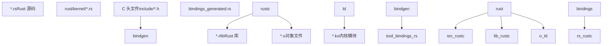

# 核心内核基础设施

相关源文件

-   [.gitignore](https://github.com/torvalds/linux/blob/fcb70a56/.gitignore)
-   [Documentation/kbuild/reproducible-builds.rst](https://github.com/torvalds/linux/blob/fcb70a56/Documentation/kbuild/reproducible-builds.rst)
-   [Documentation/scheduler/sched-debug.rst](https://github.com/torvalds/linux/blob/fcb70a56/Documentation/scheduler/sched-debug.rst)
-   [Documentation/scheduler/sched-design-CFS.rst](https://github.com/torvalds/linux/blob/fcb70a56/Documentation/scheduler/sched-design-CFS.rst)
-   [Documentation/scheduler/sched-domains.rst](https://github.com/torvalds/linux/blob/fcb70a56/Documentation/scheduler/sched-domains.rst)
-   [Documentation/scheduler/sched-ext.rst](https://github.com/torvalds/linux/blob/fcb70a56/Documentation/scheduler/sched-ext.rst)
-   [Documentation/scheduler/sched-stats.rst](https://github.com/torvalds/linux/blob/fcb70a56/Documentation/scheduler/sched-stats.rst)
-   [Documentation/trace/events.rst](https://github.com/torvalds/linux/blob/fcb70a56/Documentation/trace/events.rst)
-   [Documentation/trace/ftrace.rst](https://github.com/torvalds/linux/blob/fcb70a56/Documentation/trace/ftrace.rst)
-   [Documentation/translations/sp\_SP/scheduler/sched-design-CFS.rst](https://github.com/torvalds/linux/blob/fcb70a56/Documentation/translations/sp_SP/scheduler/sched-design-CFS.rst)
-   [Makefile](https://github.com/torvalds/linux/blob/fcb70a56/Makefile)
-   [arch/arm64/include/asm/ftrace.h](https://github.com/torvalds/linux/blob/fcb70a56/arch/arm64/include/asm/ftrace.h)
-   [arch/arm64/kernel/ftrace.c](https://github.com/torvalds/linux/blob/fcb70a56/arch/arm64/kernel/ftrace.c)
-   [arch/loongarch/include/asm/ftrace.h](https://github.com/torvalds/linux/blob/fcb70a56/arch/loongarch/include/asm/ftrace.h)
-   [arch/loongarch/kernel/ftrace\_dyn.c](https://github.com/torvalds/linux/blob/fcb70a56/arch/loongarch/kernel/ftrace_dyn.c)
-   [arch/mips/Makefile.postlink](https://github.com/torvalds/linux/blob/fcb70a56/arch/mips/Makefile.postlink)
-   [arch/powerpc/include/asm/ftrace.h](https://github.com/torvalds/linux/blob/fcb70a56/arch/powerpc/include/asm/ftrace.h)
-   [arch/powerpc/kernel/trace/ftrace.c](https://github.com/torvalds/linux/blob/fcb70a56/arch/powerpc/kernel/trace/ftrace.c)
-   [arch/powerpc/kernel/trace/ftrace\_64\_pg.c](https://github.com/torvalds/linux/blob/fcb70a56/arch/powerpc/kernel/trace/ftrace_64_pg.c)
-   [arch/powerpc/kernel/trace/ftrace\_entry.S](https://github.com/torvalds/linux/blob/fcb70a56/arch/powerpc/kernel/trace/ftrace_entry.S)
-   [arch/riscv/Makefile.postlink](https://github.com/torvalds/linux/blob/fcb70a56/arch/riscv/Makefile.postlink)
-   [arch/riscv/boot/Makefile](https://github.com/torvalds/linux/blob/fcb70a56/arch/riscv/boot/Makefile)
-   [arch/s390/Makefile.postlink](https://github.com/torvalds/linux/blob/fcb70a56/arch/s390/Makefile.postlink)
-   [arch/s390/include/asm/ftrace.h](https://github.com/torvalds/linux/blob/fcb70a56/arch/s390/include/asm/ftrace.h)
-   [arch/x86/boot/startup/Makefile](https://github.com/torvalds/linux/blob/fcb70a56/arch/x86/boot/startup/Makefile)
-   [arch/x86/include/asm/ftrace.h](https://github.com/torvalds/linux/blob/fcb70a56/arch/x86/include/asm/ftrace.h)
-   [arch/x86/include/asm/setup.h](https://github.com/torvalds/linux/blob/fcb70a56/arch/x86/include/asm/setup.h)
-   [arch/x86/kernel/ftrace.c](https://github.com/torvalds/linux/blob/fcb70a56/arch/x86/kernel/ftrace.c)
-   [arch/x86/kernel/ftrace\_64.S](https://github.com/torvalds/linux/blob/fcb70a56/arch/x86/kernel/ftrace_64.S)
-   [arch/x86/mm/mem\_encrypt\_boot.S](https://github.com/torvalds/linux/blob/fcb70a56/arch/x86/mm/mem_encrypt_boot.S)
-   [include/linux/fprobe.h](https://github.com/torvalds/linux/blob/fcb70a56/include/linux/fprobe.h)
-   [include/linux/ftrace.h](https://github.com/torvalds/linux/blob/fcb70a56/include/linux/ftrace.h)
-   [include/linux/ftrace\_regs.h](https://github.com/torvalds/linux/blob/fcb70a56/include/linux/ftrace_regs.h)
-   [include/linux/ring\_buffer.h](https://github.com/torvalds/linux/blob/fcb70a56/include/linux/ring_buffer.h)
-   [include/linux/sched.h](https://github.com/torvalds/linux/blob/fcb70a56/include/linux/sched.h)
-   [include/linux/sched/sd\_flags.h](https://github.com/torvalds/linux/blob/fcb70a56/include/linux/sched/sd_flags.h)
-   [include/linux/sched/topology.h](https://github.com/torvalds/linux/blob/fcb70a56/include/linux/sched/topology.h)
-   [include/linux/string.h](https://github.com/torvalds/linux/blob/fcb70a56/include/linux/string.h)
-   [include/linux/trace\_events.h](https://github.com/torvalds/linux/blob/fcb70a56/include/linux/trace_events.h)
-   [include/trace/events/block.h](https://github.com/torvalds/linux/blob/fcb70a56/include/trace/events/block.h)
-   [include/trace/stages/stage3\_trace\_output.h](https://github.com/torvalds/linux/blob/fcb70a56/include/trace/stages/stage3_trace_output.h)
-   [include/trace/stages/stage7\_class\_define.h](https://github.com/torvalds/linux/blob/fcb70a56/include/trace/stages/stage7_class_define.h)
-   [kernel/sched/autogroup.c](https://github.com/torvalds/linux/blob/fcb70a56/kernel/sched/autogroup.c)
-   [kernel/sched/build\_utility.c](https://github.com/torvalds/linux/blob/fcb70a56/kernel/sched/build_utility.c)
-   [kernel/sched/core.c](https://github.com/torvalds/linux/blob/fcb70a56/kernel/sched/core.c)
-   [kernel/sched/core\_sched.c](https://github.com/torvalds/linux/blob/fcb70a56/kernel/sched/core_sched.c)
-   [kernel/sched/deadline.c](https://github.com/torvalds/linux/blob/fcb70a56/kernel/sched/deadline.c)
-   [kernel/sched/debug.c](https://github.com/torvalds/linux/blob/fcb70a56/kernel/sched/debug.c)
-   [kernel/sched/ext.c](https://github.com/torvalds/linux/blob/fcb70a56/kernel/sched/ext.c)
-   [kernel/sched/ext.h](https://github.com/torvalds/linux/blob/fcb70a56/kernel/sched/ext.h)
-   [kernel/sched/ext\_idle.c](https://github.com/torvalds/linux/blob/fcb70a56/kernel/sched/ext_idle.c)
-   [kernel/sched/ext\_idle.h](https://github.com/torvalds/linux/blob/fcb70a56/kernel/sched/ext_idle.h)
-   [kernel/sched/fair.c](https://github.com/torvalds/linux/blob/fcb70a56/kernel/sched/fair.c)
-   [kernel/sched/idle.c](https://github.com/torvalds/linux/blob/fcb70a56/kernel/sched/idle.c)
-   [kernel/sched/pelt.c](https://github.com/torvalds/linux/blob/fcb70a56/kernel/sched/pelt.c)
-   [kernel/sched/pelt.h](https://github.com/torvalds/linux/blob/fcb70a56/kernel/sched/pelt.h)
-   [kernel/sched/rt.c](https://github.com/torvalds/linux/blob/fcb70a56/kernel/sched/rt.c)
-   [kernel/sched/sched.h](https://github.com/torvalds/linux/blob/fcb70a56/kernel/sched/sched.h)
-   [kernel/sched/stats.c](https://github.com/torvalds/linux/blob/fcb70a56/kernel/sched/stats.c)
-   [kernel/sched/stats.h](https://github.com/torvalds/linux/blob/fcb70a56/kernel/sched/stats.h)
-   [kernel/sched/stop\_task.c](https://github.com/torvalds/linux/blob/fcb70a56/kernel/sched/stop_task.c)
-   [kernel/sched/syscalls.c](https://github.com/torvalds/linux/blob/fcb70a56/kernel/sched/syscalls.c)
-   [kernel/sched/topology.c](https://github.com/torvalds/linux/blob/fcb70a56/kernel/sched/topology.c)
-   [kernel/trace/Kconfig](https://github.com/torvalds/linux/blob/fcb70a56/kernel/trace/Kconfig)
-   [kernel/trace/Makefile](https://github.com/torvalds/linux/blob/fcb70a56/kernel/trace/Makefile)
-   [kernel/trace/blktrace.c](https://github.com/torvalds/linux/blob/fcb70a56/kernel/trace/blktrace.c)
-   [kernel/trace/fgraph.c](https://github.com/torvalds/linux/blob/fcb70a56/kernel/trace/fgraph.c)
-   [kernel/trace/fprobe.c](https://github.com/torvalds/linux/blob/fcb70a56/kernel/trace/fprobe.c)
-   [kernel/trace/ftrace.c](https://github.com/torvalds/linux/blob/fcb70a56/kernel/trace/ftrace.c)
-   [kernel/trace/pid\_list.c](https://github.com/torvalds/linux/blob/fcb70a56/kernel/trace/pid_list.c)
-   [kernel/trace/pid\_list.h](https://github.com/torvalds/linux/blob/fcb70a56/kernel/trace/pid_list.h)
-   [kernel/trace/ring\_buffer.c](https://github.com/torvalds/linux/blob/fcb70a56/kernel/trace/ring_buffer.c)
-   [kernel/trace/trace.c](https://github.com/torvalds/linux/blob/fcb70a56/kernel/trace/trace.c)
-   [kernel/trace/trace.h](https://github.com/torvalds/linux/blob/fcb70a56/kernel/trace/trace.h)
-   [kernel/trace/trace\_dynevent.c](https://github.com/torvalds/linux/blob/fcb70a56/kernel/trace/trace_dynevent.c)
-   [kernel/trace/trace\_dynevent.h](https://github.com/torvalds/linux/blob/fcb70a56/kernel/trace/trace_dynevent.h)
-   [kernel/trace/trace\_entries.h](https://github.com/torvalds/linux/blob/fcb70a56/kernel/trace/trace_entries.h)
-   [kernel/trace/trace\_eprobe.c](https://github.com/torvalds/linux/blob/fcb70a56/kernel/trace/trace_eprobe.c)
-   [kernel/trace/trace\_events.c](https://github.com/torvalds/linux/blob/fcb70a56/kernel/trace/trace_events.c)
-   [kernel/trace/trace\_events\_hist.c](https://github.com/torvalds/linux/blob/fcb70a56/kernel/trace/trace_events_hist.c)
-   [kernel/trace/trace\_events\_synth.c](https://github.com/torvalds/linux/blob/fcb70a56/kernel/trace/trace_events_synth.c)
-   [kernel/trace/trace\_events\_trigger.c](https://github.com/torvalds/linux/blob/fcb70a56/kernel/trace/trace_events_trigger.c)
-   [kernel/trace/trace\_fprobe.c](https://github.com/torvalds/linux/blob/fcb70a56/kernel/trace/trace_fprobe.c)
-   [kernel/trace/trace\_functions.c](https://github.com/torvalds/linux/blob/fcb70a56/kernel/trace/trace_functions.c)
-   [kernel/trace/trace\_functions\_graph.c](https://github.com/torvalds/linux/blob/fcb70a56/kernel/trace/trace_functions_graph.c)
-   [kernel/trace/trace\_irqsoff.c](https://github.com/torvalds/linux/blob/fcb70a56/kernel/trace/trace_irqsoff.c)
-   [kernel/trace/trace\_kdb.c](https://github.com/torvalds/linux/blob/fcb70a56/kernel/trace/trace_kdb.c)
-   [kernel/trace/trace\_kprobe.c](https://github.com/torvalds/linux/blob/fcb70a56/kernel/trace/trace_kprobe.c)
-   [kernel/trace/trace\_output.c](https://github.com/torvalds/linux/blob/fcb70a56/kernel/trace/trace_output.c)
-   [kernel/trace/trace\_output.h](https://github.com/torvalds/linux/blob/fcb70a56/kernel/trace/trace_output.h)
-   [kernel/trace/trace\_probe.c](https://github.com/torvalds/linux/blob/fcb70a56/kernel/trace/trace_probe.c)
-   [kernel/trace/trace\_probe.h](https://github.com/torvalds/linux/blob/fcb70a56/kernel/trace/trace_probe.h)
-   [kernel/trace/trace\_probe\_tmpl.h](https://github.com/torvalds/linux/blob/fcb70a56/kernel/trace/trace_probe_tmpl.h)
-   [kernel/trace/trace\_sched\_switch.c](https://github.com/torvalds/linux/blob/fcb70a56/kernel/trace/trace_sched_switch.c)
-   [kernel/trace/trace\_sched\_wakeup.c](https://github.com/torvalds/linux/blob/fcb70a56/kernel/trace/trace_sched_wakeup.c)
-   [kernel/trace/trace\_selftest.c](https://github.com/torvalds/linux/blob/fcb70a56/kernel/trace/trace_selftest.c)
-   [kernel/trace/trace\_uprobe.c](https://github.com/torvalds/linux/blob/fcb70a56/kernel/trace/trace_uprobe.c)
-   [lib/tests/string\_kunit.c](https://github.com/torvalds/linux/blob/fcb70a56/lib/tests/string_kunit.c)
-   [mm/kasan/Makefile](https://github.com/torvalds/linux/blob/fcb70a56/mm/kasan/Makefile)
-   [rust/Makefile](https://github.com/torvalds/linux/blob/fcb70a56/rust/Makefile)
-   [rust/helpers/bug.c](https://github.com/torvalds/linux/blob/fcb70a56/rust/helpers/bug.c)
-   [rust/helpers/jump\_label.c](https://github.com/torvalds/linux/blob/fcb70a56/rust/helpers/jump_label.c)
-   [rust/kernel/.gitignore](https://github.com/torvalds/linux/blob/fcb70a56/rust/kernel/.gitignore)
-   [rust/kernel/bug.rs](https://github.com/torvalds/linux/blob/fcb70a56/rust/kernel/bug.rs)
-   [rust/kernel/generated\_arch\_reachable\_asm.rs.S](https://github.com/torvalds/linux/blob/fcb70a56/rust/kernel/generated_arch_reachable_asm.rs.S)
-   [rust/kernel/generated\_arch\_static\_branch\_asm.rs.S](https://github.com/torvalds/linux/blob/fcb70a56/rust/kernel/generated_arch_static_branch_asm.rs.S)
-   [rust/kernel/generated\_arch\_warn\_asm.rs.S](https://github.com/torvalds/linux/blob/fcb70a56/rust/kernel/generated_arch_warn_asm.rs.S)
-   [rust/kernel/jump\_label.rs](https://github.com/torvalds/linux/blob/fcb70a56/rust/kernel/jump_label.rs)
-   [samples/fprobe/fprobe\_example.c](https://github.com/torvalds/linux/blob/fcb70a56/samples/fprobe/fprobe_example.c)
-   [samples/trace\_events/trace-events-sample.h](https://github.com/torvalds/linux/blob/fcb70a56/samples/trace_events/trace-events-sample.h)
-   [scripts/Makefile.build](https://github.com/torvalds/linux/blob/fcb70a56/scripts/Makefile.build)
-   [scripts/Makefile.lib](https://github.com/torvalds/linux/blob/fcb70a56/scripts/Makefile.lib)
-   [scripts/generate\_rust\_analyzer.py](https://github.com/torvalds/linux/blob/fcb70a56/scripts/generate_rust_analyzer.py)
-   [scripts/livepatch/fix-patch-lines](https://github.com/torvalds/linux/blob/fcb70a56/scripts/livepatch/fix-patch-lines)
-   [scripts/livepatch/klp-build](https://github.com/torvalds/linux/blob/fcb70a56/scripts/livepatch/klp-build)
-   [scripts/misc-check](https://github.com/torvalds/linux/blob/fcb70a56/scripts/misc-check)
-   [tools/objtool/klp-diff.c](https://github.com/torvalds/linux/blob/fcb70a56/tools/objtool/klp-diff.c)
-   [tools/power/cpupower/.gitignore](https://github.com/torvalds/linux/blob/fcb70a56/tools/power/cpupower/.gitignore)
-   [tools/sched\_ext/include/scx/common.bpf.h](https://github.com/torvalds/linux/blob/fcb70a56/tools/sched_ext/include/scx/common.bpf.h)
-   [tools/sched\_ext/include/scx/common.h](https://github.com/torvalds/linux/blob/fcb70a56/tools/sched_ext/include/scx/common.h)
-   [tools/sched\_ext/include/scx/compat.bpf.h](https://github.com/torvalds/linux/blob/fcb70a56/tools/sched_ext/include/scx/compat.bpf.h)
-   [tools/sched\_ext/include/scx/compat.h](https://github.com/torvalds/linux/blob/fcb70a56/tools/sched_ext/include/scx/compat.h)
-   [tools/sched\_ext/include/scx/enum\_defs.autogen.h](https://github.com/torvalds/linux/blob/fcb70a56/tools/sched_ext/include/scx/enum_defs.autogen.h)
-   [tools/sched\_ext/include/scx/enums.autogen.bpf.h](https://github.com/torvalds/linux/blob/fcb70a56/tools/sched_ext/include/scx/enums.autogen.bpf.h)
-   [tools/sched\_ext/include/scx/enums.autogen.h](https://github.com/torvalds/linux/blob/fcb70a56/tools/sched_ext/include/scx/enums.autogen.h)
-   [tools/sched\_ext/include/scx/enums.bpf.h](https://github.com/torvalds/linux/blob/fcb70a56/tools/sched_ext/include/scx/enums.bpf.h)
-   [tools/sched\_ext/include/scx/enums.h](https://github.com/torvalds/linux/blob/fcb70a56/tools/sched_ext/include/scx/enums.h)
-   [tools/sched\_ext/include/scx/user\_exit\_info.h](https://github.com/torvalds/linux/blob/fcb70a56/tools/sched_ext/include/scx/user_exit_info.h)
-   [tools/sched\_ext/scx\_central.bpf.c](https://github.com/torvalds/linux/blob/fcb70a56/tools/sched_ext/scx_central.bpf.c)
-   [tools/sched\_ext/scx\_central.c](https://github.com/torvalds/linux/blob/fcb70a56/tools/sched_ext/scx_central.c)
-   [tools/sched\_ext/scx\_flatcg.bpf.c](https://github.com/torvalds/linux/blob/fcb70a56/tools/sched_ext/scx_flatcg.bpf.c)
-   [tools/sched\_ext/scx\_qmap.bpf.c](https://github.com/torvalds/linux/blob/fcb70a56/tools/sched_ext/scx_qmap.bpf.c)
-   [tools/sched\_ext/scx\_qmap.c](https://github.com/torvalds/linux/blob/fcb70a56/tools/sched_ext/scx_qmap.c)
-   [tools/sched\_ext/scx\_simple.bpf.c](https://github.com/torvalds/linux/blob/fcb70a56/tools/sched_ext/scx_simple.bpf.c)

## 目的与范围

本页面记录了支持所有其他内核功能的基础内核基础设施系统。它涵盖了三个关键子系统：

1.  **进程调度** - 核心调度器和可扩展调度框架 (sched\_ext)
2.  **追踪与可观测性** - 函数追踪 (ftrace)、事件跟踪和调试基础设施
3.  **构建系统** - 支持 C 和 Rust 编译的 Kbuild 基础设施

有关详细信息：

-   有关基于 BPF 的可扩展调度策略和自定义调度器，请参阅 [进程调度与 sched\_ext](/torvalds/linux/4.1-process-scheduling-and-sched_ext)
-   有关综合追踪机制、动态探针和直方图分析，请参阅 [追踪与可观测性](/torvalds/linux/4.2-tracing-and-observability)
-   有关构建配置、交叉编译和热补丁，请参阅 [构建系统与 Kbuild](/torvalds/linux/4.3-build-system-and-kbuild)

## 架构概览

核心内核基础设施提供了所有其他内核子系统所依赖的最底层机制。调度器决定哪些任务在何时何地执行。追踪基础设施为调试和性能分析提供了对内核操作的可见性。构建系统编排跨多种架构和语言的整个内核代码库的编译。


**来源：** [kernel/sched/core.c1-100](https://github.com/torvalds/linux/blob/fcb70a56/kernel/sched/core.c#L1-L100) [kernel/sched/ext.c1-50](https://github.com/torvalds/linux/blob/fcb70a56/kernel/sched/ext.c#L1-L50) [kernel/trace/trace.c1-100](https://github.com/torvalds/linux/blob/fcb70a56/kernel/trace/trace.c#L1-L100) [Makefile1-100](https://github.com/torvalds/linux/blob/fcb70a56/Makefile#L1-L100)

## 核心调度基础设施

Linux 调度器被组织成调度类的层次结构，每个类实现特定的调度策略。任务根据其策略（`SCHED_NORMAL`、`SCHED_FIFO`、`SCHED_DEADLINE`、`SCHED_EXT` 等）分配给调度类。

### 调度类层次结构

| 优先级 | 类 | 策略 | 描述 | 实现 |
| --- | --- | --- | --- | --- |
| 最高 | `stop_sched_class` | N/A | 用于关键操作的每 CPU 停止任务 | 内置 |
| 2 | `dl_sched_class` | `SCHED_DEADLINE` | 最早截止时间优先实时 | [kernel/sched/deadline.c](https://github.com/torvalds/linux/blob/fcb70a56/kernel/sched/deadline.c) |
| 3 | `rt_sched_class` | `SCHED_FIFO`, `SCHED_RR` | 固定优先级实时 | [kernel/sched/rt.c](https://github.com/torvalds/linux/blob/fcb70a56/kernel/sched/rt.c) |
| 4 | `ext_sched_class` | `SCHED_EXT` | BPF 可扩展自定义调度 | [kernel/sched/ext.c](https://github.com/torvalds/linux/blob/fcb70a56/kernel/sched/ext.c) |
| 5 | `fair_sched_class` | `SCHED_NORMAL`, `SCHED_BATCH` | 完全公平调度器 (CFS) | [kernel/sched/fair.c](https://github.com/torvalds/linux/blob/fcb70a56/kernel/sched/fair.c) |
| 最低 | `idle_sched_class` | N/A | 无工作可用时的空闲任务 | [kernel/sched/idle.c](https://github.com/torvalds/linux/blob/fcb70a56/kernel/sched/idle.c) |

**来源：** [kernel/sched/sched.h1-100](https://github.com/torvalds/linux/blob/fcb70a56/kernel/sched/sched.h#L1-L100) [kernel/sched/core.c190-210](https://github.com/torvalds/linux/blob/fcb70a56/kernel/sched/core.c#L190-L210)

### 核心调度器操作

```mermaid
flowchart TD
    schedule["schedule()kernel/sched/core.c"]
    preempt["preempt_schedule()"]
    yield["sched_yield()"]
    __schedule["__schedule()主调度函数"]
    pick_next["pick_next_task()选择下一个任务"]
    context_switch["context_switch()切换地址空间"]
    pick_dl["pick_next_task_dl()"]
    pick_rt["pick_next_task_rt()"]
    pick_ext["pick_next_task_scx()"]
    pick_fair["pick_next_task_fair()"]
    rq["struct rq每 CPU 运行队列"]
    cfs_rq["struct cfs_rqCFS 运行队列"]
    rt_rq["struct rt_rqRT 运行队列"]
    dl_rq["struct dl_rqDL 运行队列"]
    scx_rq["struct scx_rqSCX 队列"]

    schedule --> __schedule
    preempt --> __schedule
    yield --> __schedule
    _ --> schedule_pick_next
    pick --> next_pick_dl
    pick --> next_pick_rt
    pick --> next_pick_ext
    pick --> next_pick_fair
    _ --> schedule_context_switch
    pick --> dl_dl_rq
    pick --> rt_rt_rq
    pick --> ext_scx_rq
    pick --> fair_cfs_rq
    rq --> cfs_rq
    rq --> rt_rq
    rq --> dl_rq
    rq --> scx_rq
```


**来源：** [kernel/sched/core.c6300-6500](https://github.com/torvalds/linux/blob/fcb70a56/kernel/sched/core.c#L6300-L6500) [kernel/sched/sched.h1000-1200](https://github.com/torvalds/linux/blob/fcb70a56/kernel/sched/sched.h#L1000-L1200)

核心调度器维护一个每 CPU `struct rq` ([kernel/sched/sched.h1000-1100](https://github.com/torvalds/linux/blob/fcb70a56/kernel/sched/sched.h#L1000-L1100))，其中包含多个运行队列，每个调度类一个。`pick_next_task()` 函数 ([kernel/sched/core.c5500-5700](https://github.com/torvalds/linux/blob/fcb70a56/kernel/sched/core.c#L5500-L5700)) 按优先级顺序遍历调度类，直到找到一个可运行的任务。

### 关键调度器数据结构

**`struct rq` - 每 CPU 运行队列**

```
struct rq {
    raw_spinlock_t __lock;              // 保护运行队列状态
    unsigned int nr_running;             // 可运行任务数
    struct cfs_rq cfs;                  // CFS 运行队列
    struct rt_rq rt;                    // 实时运行队列
    struct dl_rq dl;                    // 截止时间运行队列
    struct scx_rq scx;                  // sched_ext 运行队列
    struct task_struct *curr;           // 当前正在运行的任务
    u64 clock;                          // 运行队列时钟
    // ... 附加字段
};
```
**来源：** [kernel/sched/sched.h1000-1200](https://github.com/torvalds/linux/blob/fcb70a56/kernel/sched/sched.h#L1000-L1200)

**`struct task_struct` - 进程控制块**

调度器操作嵌入在 `struct task_struct` ([include/linux/sched.h700-1500](https://github.com/torvalds/linux/blob/fcb70a56/include/linux/sched.h#L700-L1500)) 中的 `sched_class`、`policy` 和调度特定数据：

-   `task_struct->sched_class` - 指向调度类操作的指针
-   `task_struct->policy` - 调度策略 (SCHED\_NORMAL, SCHED\_FIFO 等)
-   `task_struct->se` - 公平调度实体 (CFS)
-   `task_struct->rt` - 实时调度实体
-   `task_struct->dl` - 截止时间调度实体
-   `task_struct->scx` - sched\_ext 调度实体

### sched\_ext: 可扩展调度

`sched_ext` 框架 ([kernel/sched/ext.c](https://github.com/torvalds/linux/blob/fcb70a56/kernel/sched/ext.c)) 允许在 BPF 程序中实现自定义调度策略，并在运行时加载，无需内核修改。这是相对于传统调度类开发的革命性变化。

**核心 sched\_ext 组件：**

| 组件 | 用途 | 代码位置 |
| --- | --- | --- |
| `struct scx_sched` | 带有 ops 表的调度器实例 | [kernel/sched/ext.c20-50](https://github.com/torvalds/linux/blob/fcb70a56/kernel/sched/ext.c#L20-L50) |
| `struct sched_ext_ops` | BPF 操作回调 | [include/linux/sched/ext.h](https://github.com/torvalds/linux/blob/fcb70a56/include/linux/sched/ext.h) |
| `struct scx_dispatch_q` | 分发队列 (全局/本地) | [kernel/sched/ext.c100-150](https://github.com/torvalds/linux/blob/fcb70a56/kernel/sched/ext.c#L100-L150) |
| `scx_bpf_*` kfuncs | BPF 辅助函数 | [kernel/sched/ext.c2000-5000](https://github.com/torvalds/linux/blob/fcb70a56/kernel/sched/ext.c#L2000-L5000) |

sched\_ext 实现使用分发队列作为任务选择和执行之间的中介。BPF 调度器将任务分发到队列，核心调度器从这些队列中消费。


**来源：** [kernel/sched/ext.c1000-1300](https://github.com/torvalds/linux/blob/fcb70a56/kernel/sched/ext.c#L1000-L1300) [kernel/sched/ext.c3000-3500](https://github.com/torvalds/linux/blob/fcb70a56/kernel/sched/ext.c#L3000-L3500)

有关 sched\_ext 架构、BPF 集成和调度器开发的全面详细信息，请参阅 [进程调度与 sched\_ext](/torvalds/linux/4.1-process-scheduling-and-sched_ext)。

## 追踪与可观测性基础设施

内核追踪基础设施通过多种机制提供对内核操作的全面可见性：函数追踪 (ftrace)、追踪事件、动态探针和用于高效事件存储的环形缓冲区。

### 追踪架构概览

```mermaid
flowchart TD
    ftrace["ftrace 函数追踪kernel/trace/ftrace.c"]
    events["追踪事件kernel/trace/trace_events.c"]
    fprobe["fprobekernel/trace/fprobe.c"]
    kprobe["kprobes动态探针"]
    trace_core["追踪核心kernel/trace/trace.c"]
    ringbuf["环形缓冲区kernel/trace/ring_buffer.c"]
    trace_array["struct trace_array每实例状态"]
    tracefs["tracefs/sys/kernel/tracing"]
    hist["直方图触发器trace_events_hist.c"]
    graph_trace["函数图trace_functions_graph.c"]

    ftrace --> trace_core
    events --> trace_core
    fprobe --> trace_core
    kprobe --> trace_core
    trace --> core_ringbuf
    trace --> core_trace_array
    ringbuf --> tracefs
    hist --> events
    graph --> trace_ftrace
```
**来源：** [kernel/trace/trace.c1-200](https://github.com/torvalds/linux/blob/fcb70a56/kernel/trace/trace.c#L1-L200) [kernel/trace/ftrace.c1-100](https://github.com/torvalds/linux/blob/fcb70a56/kernel/trace/ftrace.c#L1-L100) [kernel/trace/ring\_buffer.c1-200](https://github.com/torvalds/linux/blob/fcb70a56/kernel/trace/ring_buffer.c#L1-L200)

### 函数追踪 (ftrace)

ftrace 子系统 ([kernel/trace/ftrace.c](https://github.com/torvalds/linux/blob/fcb70a56/kernel/trace/ftrace.c)) 通过将函数入口点替换为对追踪代码的调用来对内核函数进行插桩。这允许在禁用时以极小的运行时开销进行动态函数调用追踪。

**关键 ftrace 组件：**

| 组件 | 用途 | 文件 |
| --- | --- | --- |
| `ftrace_ops` | 函数追踪操作和过滤器 | [kernel/trace/ftrace.c88-92](https://github.com/torvalds/linux/blob/fcb70a56/kernel/trace/ftrace.c#L88-L92) |
| `ftrace_enabled` | 全局启用/禁用控制 | [kernel/trace/ftrace.c95](https://github.com/torvalds/linux/blob/fcb70a56/kernel/trace/ftrace.c#L95-L95) |
| `ftrace_trace_function` | 当前追踪函数指针 | [kernel/trace/ftrace.c126](https://github.com/torvalds/linux/blob/fcb70a56/kernel/trace/ftrace.c#L126-L126) |
| `function_trace_op` | 活动追踪操作 | [kernel/trace/ftrace.c99](https://github.com/torvalds/linux/blob/fcb70a56/kernel/trace/ftrace.c#L99-L99) |

**ftrace 操作模式：**

1.  **函数追踪器** - 追踪每个函数调用
2.  **函数图追踪器** - 显示带有入口/出口的调用图 ([kernel/trace/trace\_functions\_graph.c](https://github.com/torvalds/linux/blob/fcb70a56/kernel/trace/trace_functions_graph.c))
3.  **动态 Ftrace** - 逐个函数启用/禁用追踪
4.  **函数分析** - 收集每函数统计信息

### 环形缓冲区架构

环形缓冲区 ([kernel/trace/ring\_buffer.c](https://github.com/torvalds/linux/blob/fcb70a56/kernel/trace/ring_buffer.c)) 是一个无锁的、每 CPU 循环缓冲区，用于高效存储追踪事件。它支持：

-   每 CPU 缓冲区以避免争用
-   读取器/写入器页面以启用无锁读取
-   覆盖或丢弃最新模式
-   带有增量压缩的时间戳

**环形缓冲区结构：**


**来源：** [kernel/trace/ring\_buffer.c89-154](https://github.com/torvalds/linux/blob/fcb70a56/kernel/trace/ring_buffer.c#L89-L154) [kernel/trace/ring\_buffer.c160-200](https://github.com/torvalds/linux/blob/fcb70a56/kernel/trace/ring_buffer.c#L160-L200)

环形缓冲区实现了一个巧妙的页面交换机制：读取器页面与环分离，当读取器完成读取时，它将读取器页面与环中的下一页交换。这允许在没有锁的情况下并发读写。

### 追踪事件

追踪事件 ([kernel/trace/trace\_events.c](https://github.com/torvalds/linux/blob/fcb70a56/kernel/trace/trace_events.c)) 在整个内核中提供结构化的追踪点。它们是静态定义的，但可以动态启用/禁用。

**事件基础设施：**

-   `TRACE_EVENT()` 宏在编译时定义事件
-   事件编译为二进制中的追踪点
-   通过 tracefs 进行运行时启用/禁用
-   格式文件描述事件结构以供用户空间解析

**示例事件定义：**

```
TRACE_EVENT(sched_switch,
    TP_PROTO(bool preempt, struct task_struct *prev, struct task_struct *next),
    TP_ARGS(preempt, prev, next),
    TP_STRUCT__entry(
        __array(char, prev_comm, TASK_COMM_LEN)
        __field(pid_t, prev_pid)
        __field(int, prev_prio)
        // ...
    ),
    // ...
);
```
**来源：** [include/trace/events/sched.h](https://github.com/torvalds/linux/blob/fcb70a56/include/trace/events/sched.h)

### 动态探针

动态探针允许在运行时追踪任意内核函数和内存位置：

-   **kprobes** - 插桩任何内核指令
-   **fprobes** - 使用 ftrace 的函数入口/出口探针 ([kernel/trace/fprobe.c](https://github.com/torvalds/linux/blob/fcb70a56/kernel/trace/fprobe.c))
-   **uprobes** - 用户空间探针
-   **trace\_fprobe** - 基于 fprobe 的追踪事件 ([kernel/trace/trace\_fprobe.c](https://github.com/torvalds/linux/blob/fcb70a56/kernel/trace/trace_fprobe.c))

有关追踪机制、探针类型和直方图分析的完整详细信息，请参阅 [追踪与可观测性](/torvalds/linux/4.2-tracing-and-observability)。

## 构建系统架构

内核构建系统 (Kbuild) 编排跨多种架构的整个内核编译，支持 C 和 Rust 代码、模块以及各种输出格式。

### 构建系统结构


**来源：** [Makefile1-100](https://github.com/torvalds/linux/blob/fcb70a56/Makefile#L1-L100) [Makefile376-750](https://github.com/torvalds/linux/blob/fcb70a56/Makefile#L376-L750) [rust/Makefile1-50](https://github.com/torvalds/linux/blob/fcb70a56/rust/Makefile#L1-L50)

### 构建系统组件

| 组件 | 用途 | 位置 |
| --- | --- | --- |
| 顶层 Makefile | 入口点、配置、架构选择 | [Makefile](https://github.com/torvalds/linux/blob/fcb70a56/Makefile) |
| `scripts/Kbuild.include` | 通用 make 函数和实用程序 | scripts/Kbuild.include |
| `scripts/Makefile.build` | 目录的递归构建规则 | scripts/Makefile.build |
| `scripts/Makefile.lib` | 对象文件生成规则 | scripts/Makefile.lib |
| `arch/*/Makefile` | 架构特定构建配置 | arch/x86/Makefile, arch/arm64/Makefile |
| `rust/Makefile` | Rust 特定构建规则 | [rust/Makefile1-150](https://github.com/torvalds/linux/blob/fcb70a56/rust/Makefile#L1-L150) |

### 关键构建变量

构建系统使用大量变量来控制编译：

**编译器配置：**

```
CC          = $(CROSS_COMPILE)gcc      # C 编译器
RUSTC       = rustc                     # Rust 编译器
LD          = $(CROSS_COMPILE)ld       # 链接器
AR          = $(CROSS_COMPILE)ar       # 归档器
```
**来源：** [Makefile509-530](https://github.com/torvalds/linux/blob/fcb70a56/Makefile#L509-L530)

**构建标志：**

```
KBUILD_CFLAGS     # 内核的 C 编译器标志
KBUILD_RUSTFLAGS  # 内核的 Rust 编译器标志
KBUILD_AFLAGS     # 汇编器标志
KBUILD_LDFLAGS    # 链接器标志
```
**来源：** [Makefile584-641](https://github.com/torvalds/linux/blob/fcb70a56/Makefile#L584-L641)

### Rust 集成

内核支持 Rust 作为驱动程序和子系统开发的一等语言。Rust 构建系统 ([rust/Makefile](https://github.com/torvalds/linux/blob/fcb70a56/rust/Makefile)) 处理：

-   将 Rust crate 编译为 `.rlib` 库
-   通过 `bindgen` 生成 C 内核 API 的 Rust 绑定
-   构建 Rust 内核模块 (`.ko` 文件)
-   通过 `rustdoc` 生成文档

**Rust 构建目标：**

| 目标 | 用途 | 输出 |
| --- | --- | --- |
| `core.o` | 核心 Rust 库 | [rust/Makefile6](https://github.com/torvalds/linux/blob/fcb70a56/rust/Makefile#L6-L6) |
| `kernel.o` | 内核抽象 | [rust/Makefile15](https://github.com/torvalds/linux/blob/fcb70a56/rust/Makefile#L15-L15) |
| `bindings.o` | C API 绑定 | [rust/Makefile15](https://github.com/torvalds/linux/blob/fcb70a56/rust/Makefile#L15-L15) |
| `libmacros.so` | 过程宏 | [rust/Makefile52](https://github.com/torvalds/linux/blob/fcb70a56/rust/Makefile#L52-L52) |

Rust 构建使用 `bindgen` ([Makefile534](https://github.com/torvalds/linux/blob/fcb70a56/Makefile#L534-L534)) 从 C 头文件自动生成 Rust FFI 绑定，使安全的 Rust 代码能够调用 C 内核函数。

**Rust 编译流程：**


**来源：** [rust/Makefile1-150](https://github.com/torvalds/linux/blob/fcb70a56/rust/Makefile#L1-L150) [Makefile445-634](https://github.com/torvalds/linux/blob/fcb70a56/Makefile#L445-L634)

### 模块构建

内核模块可以在树内或树外构建：

**树内模块：**

-   通过 `.config` 中的 `CONFIG_*` 选项配置
-   作为内核构建的一部分自动构建
-   `obj-y` 用于内置，`obj-m` 用于模块

**树外模块：**

-   外部模块开发
-   使用 `make M=<module_dir>` 对照内核树进行构建
-   支持 C 和 Rust 模块

有关构建配置、交叉编译和热补丁支持的全面信息，请参阅 [构建系统与 Kbuild](/torvalds/linux/4.3-build-system-and-kbuild)。

## 跨子系统集成

核心基础设施组件广泛交互：

### 调度器-追踪集成

调度器在关键点发出追踪事件：

-   `sched_switch` - 任务上下文切换
-   `sched_wakeup` - 任务唤醒
-   `sched_migrate_task` - 任务迁移
-   `sched_ext_*` - sched\_ext 特定事件

**来源：** [include/trace/events/sched.h](https://github.com/torvalds/linux/blob/fcb70a56/include/trace/events/sched.h) [kernel/sched/ext.c193-194](https://github.com/torvalds/linux/blob/fcb70a56/kernel/sched/ext.c#L193-L194)

### 构建-调度器集成

构建系统编译所有调度器组件：

-   调度器核心 ([kernel/sched/core.c](https://github.com/torvalds/linux/blob/fcb70a56/kernel/sched/core.c)) 编译为 `kernel/sched/core.o`
-   每个调度类单独编译
-   sched\_ext 可以选择性地支持 Rust 扩展
-   BPF 调度器程序使用特殊工具构建

### 追踪-构建集成

追踪事件使用在编译时生成代码的宏定义：

-   事件定义由构建系统处理
-   自动生成追踪点代码
-   为用户空间解析创建格式文件

**来源：** [kernel/trace/trace\_events.c1-100](https://github.com/torvalds/linux/blob/fcb70a56/kernel/trace/trace_events.c#L1-L100)

## 系统初始化

核心基础设施在启动过程的早期初始化：

1.  **构建系统** - 在启动前运行，创建内核镜像
2.  **调度器** - 通过 `sched_init()` 初始化 ([kernel/sched/core.c](https://github.com/torvalds/linux/blob/fcb70a56/kernel/sched/core.c))
3.  **追踪** - 通过 `tracer_init_tracefs()` 初始化 ([kernel/trace/trace.c](https://github.com/torvalds/linux/blob/fcb70a56/kernel/trace/trace.c))

初始化顺序确保追踪可用于调试调度器初始化，并且调度器在大多数其他子系统需要它之前就绪。

**来源：** [kernel/sched/core.c9000-9500](https://github.com/torvalds/linux/blob/fcb70a56/kernel/sched/core.c#L9000-L9500) [kernel/trace/trace.c9000-9500](https://github.com/torvalds/linux/blob/fcb70a56/kernel/trace/trace.c#L9000-L9500)
