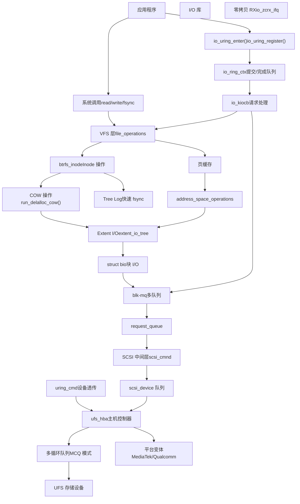
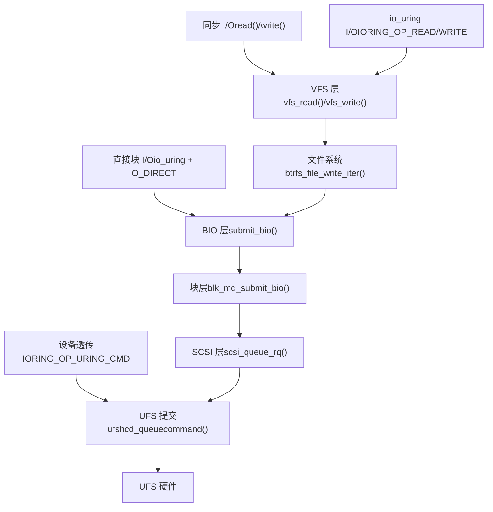
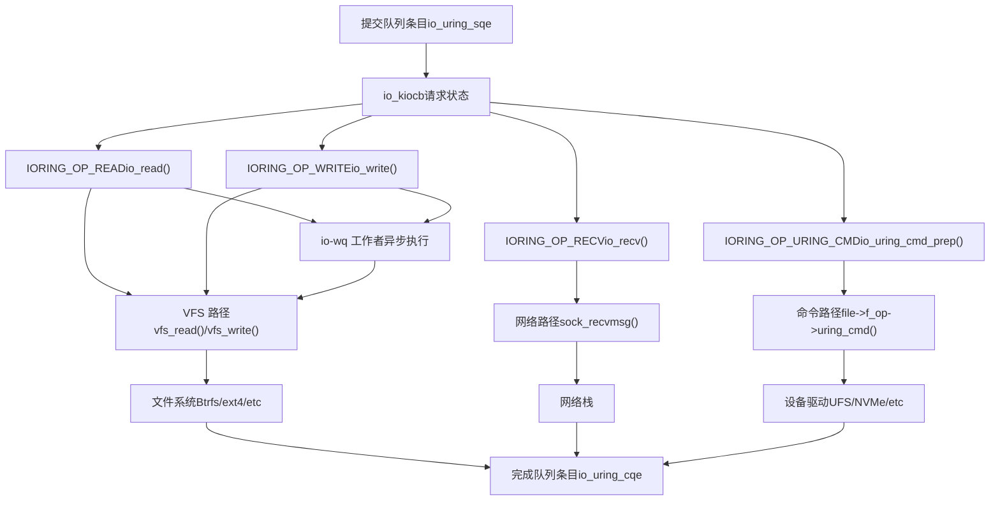
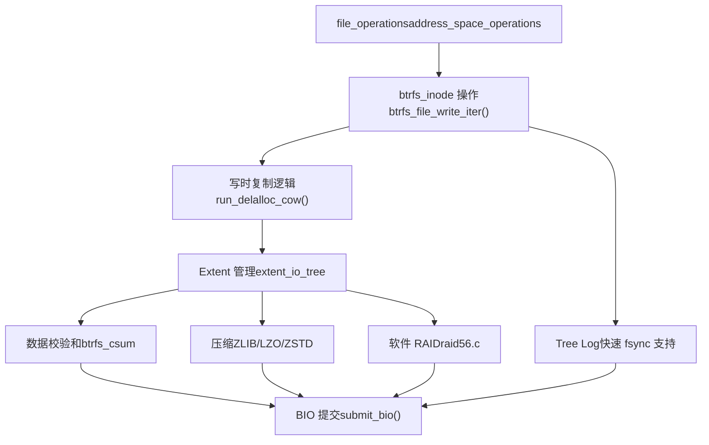
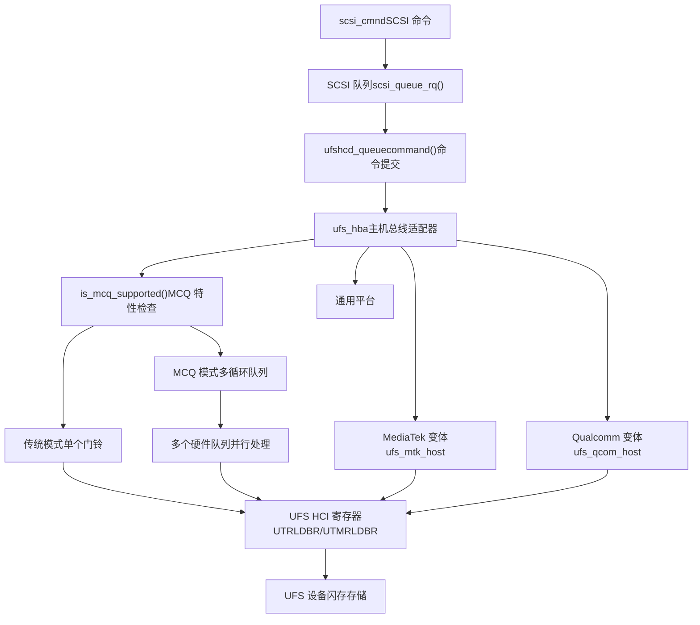
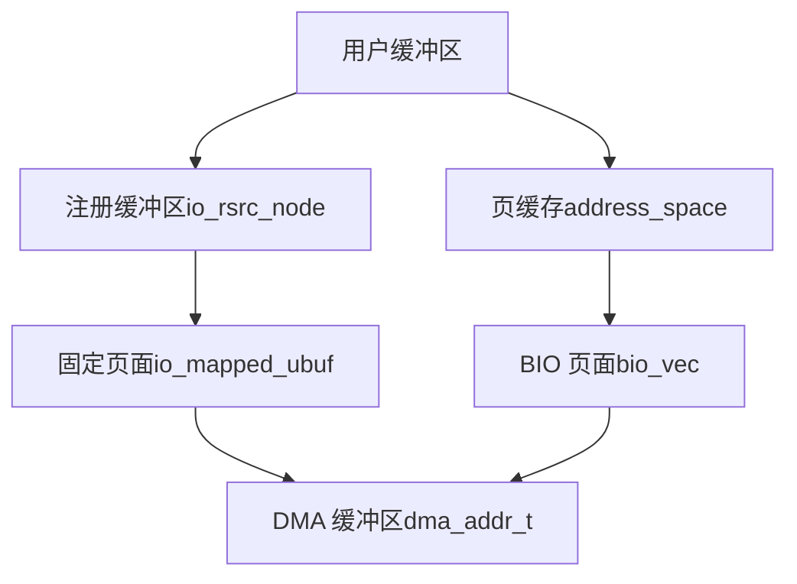

# 存储与 I/O

相关源文件

-   [Documentation/ABI/testing/sysfs-driver-ufs](https://github.com/torvalds/linux/blob/fcb70a56/Documentation/ABI/testing/sysfs-driver-ufs)
-   [Documentation/networking/iou-zcrx.rst](https://github.com/torvalds/linux/blob/fcb70a56/Documentation/networking/iou-zcrx.rst)
-   [drivers/nvme/host/ioctl.c](https://github.com/torvalds/linux/blob/fcb70a56/drivers/nvme/host/ioctl.c)
-   [drivers/ufs/core/ufs-mcq.c](https://github.com/torvalds/linux/blob/fcb70a56/drivers/ufs/core/ufs-mcq.c)
-   [drivers/ufs/core/ufs-sysfs.c](https://github.com/torvalds/linux/blob/fcb70a56/drivers/ufs/core/ufs-sysfs.c)
-   [drivers/ufs/core/ufs-sysfs.h](https://github.com/torvalds/linux/blob/fcb70a56/drivers/ufs/core/ufs-sysfs.h)
-   [drivers/ufs/core/ufs\_bsg.c](https://github.com/torvalds/linux/blob/fcb70a56/drivers/ufs/core/ufs_bsg.c)
-   [drivers/ufs/core/ufs\_trace.h](https://github.com/torvalds/linux/blob/fcb70a56/drivers/ufs/core/ufs_trace.h)
-   [drivers/ufs/core/ufs\_trace\_types.h](https://github.com/torvalds/linux/blob/fcb70a56/drivers/ufs/core/ufs_trace_types.h)
-   [drivers/ufs/core/ufshcd-crypto.c](https://github.com/torvalds/linux/blob/fcb70a56/drivers/ufs/core/ufshcd-crypto.c)
-   [drivers/ufs/core/ufshcd-crypto.h](https://github.com/torvalds/linux/blob/fcb70a56/drivers/ufs/core/ufshcd-crypto.h)
-   [drivers/ufs/core/ufshcd-priv.h](https://github.com/torvalds/linux/blob/fcb70a56/drivers/ufs/core/ufshcd-priv.h)
-   [drivers/ufs/core/ufshcd.c](https://github.com/torvalds/linux/blob/fcb70a56/drivers/ufs/core/ufshcd.c)
-   [drivers/ufs/host/Kconfig](https://github.com/torvalds/linux/blob/fcb70a56/drivers/ufs/host/Kconfig)
-   [drivers/ufs/host/Makefile](https://github.com/torvalds/linux/blob/fcb70a56/drivers/ufs/host/Makefile)
-   [drivers/ufs/host/cdns-pltfrm.c](https://github.com/torvalds/linux/blob/fcb70a56/drivers/ufs/host/cdns-pltfrm.c)
-   [drivers/ufs/host/tc-dwc-g210-pci.c](https://github.com/torvalds/linux/blob/fcb70a56/drivers/ufs/host/tc-dwc-g210-pci.c)
-   [drivers/ufs/host/tc-dwc-g210-pltfrm.c](https://github.com/torvalds/linux/blob/fcb70a56/drivers/ufs/host/tc-dwc-g210-pltfrm.c)
-   [drivers/ufs/host/ti-j721e-ufs.c](https://github.com/torvalds/linux/blob/fcb70a56/drivers/ufs/host/ti-j721e-ufs.c)
-   [drivers/ufs/host/ufs-amd-versal2.c](https://github.com/torvalds/linux/blob/fcb70a56/drivers/ufs/host/ufs-amd-versal2.c)
-   [drivers/ufs/host/ufs-exynos.c](https://github.com/torvalds/linux/blob/fcb70a56/drivers/ufs/host/ufs-exynos.c)
-   [drivers/ufs/host/ufs-exynos.h](https://github.com/torvalds/linux/blob/fcb70a56/drivers/ufs/host/ufs-exynos.h)
-   [drivers/ufs/host/ufs-hisi.c](https://github.com/torvalds/linux/blob/fcb70a56/drivers/ufs/host/ufs-hisi.c)
-   [drivers/ufs/host/ufs-mediatek.c](https://github.com/torvalds/linux/blob/fcb70a56/drivers/ufs/host/ufs-mediatek.c)
-   [drivers/ufs/host/ufs-mediatek.h](https://github.com/torvalds/linux/blob/fcb70a56/drivers/ufs/host/ufs-mediatek.h)
-   [drivers/ufs/host/ufs-qcom.c](https://github.com/torvalds/linux/blob/fcb70a56/drivers/ufs/host/ufs-qcom.c)
-   [drivers/ufs/host/ufs-qcom.h](https://github.com/torvalds/linux/blob/fcb70a56/drivers/ufs/host/ufs-qcom.h)
-   [drivers/ufs/host/ufs-renesas.c](https://github.com/torvalds/linux/blob/fcb70a56/drivers/ufs/host/ufs-renesas.c)
-   [drivers/ufs/host/ufs-sprd.c](https://github.com/torvalds/linux/blob/fcb70a56/drivers/ufs/host/ufs-sprd.c)
-   [drivers/ufs/host/ufshcd-dwc.h](https://github.com/torvalds/linux/blob/fcb70a56/drivers/ufs/host/ufshcd-dwc.h)
-   [drivers/ufs/host/ufshcd-pci.c](https://github.com/torvalds/linux/blob/fcb70a56/drivers/ufs/host/ufshcd-pci.c)
-   [drivers/ufs/host/ufshcd-pltfrm.c](https://github.com/torvalds/linux/blob/fcb70a56/drivers/ufs/host/ufshcd-pltfrm.c)
-   [drivers/ufs/host/ufshcd-pltfrm.h](https://github.com/torvalds/linux/blob/fcb70a56/drivers/ufs/host/ufshcd-pltfrm.h)
-   [fs/afs/callback.c](https://github.com/torvalds/linux/blob/fcb70a56/fs/afs/callback.c)
-   [fs/btrfs/accessors.h](https://github.com/torvalds/linux/blob/fcb70a56/fs/btrfs/accessors.h)
-   [fs/btrfs/backref.c](https://github.com/torvalds/linux/blob/fcb70a56/fs/btrfs/backref.c)
-   [fs/btrfs/bio.c](https://github.com/torvalds/linux/blob/fcb70a56/fs/btrfs/bio.c)
-   [fs/btrfs/bio.h](https://github.com/torvalds/linux/blob/fcb70a56/fs/btrfs/bio.h)
-   [fs/btrfs/block-group.c](https://github.com/torvalds/linux/blob/fcb70a56/fs/btrfs/block-group.c)
-   [fs/btrfs/block-group.h](https://github.com/torvalds/linux/blob/fcb70a56/fs/btrfs/block-group.h)
-   [fs/btrfs/btrfs\_inode.h](https://github.com/torvalds/linux/blob/fcb70a56/fs/btrfs/btrfs_inode.h)
-   [fs/btrfs/compression.c](https://github.com/torvalds/linux/blob/fcb70a56/fs/btrfs/compression.c)
-   [fs/btrfs/compression.h](https://github.com/torvalds/linux/blob/fcb70a56/fs/btrfs/compression.h)
-   [fs/btrfs/ctree.c](https://github.com/torvalds/linux/blob/fcb70a56/fs/btrfs/ctree.c)
-   [fs/btrfs/defrag.c](https://github.com/torvalds/linux/blob/fcb70a56/fs/btrfs/defrag.c)
-   [fs/btrfs/delayed-inode.c](https://github.com/torvalds/linux/blob/fcb70a56/fs/btrfs/delayed-inode.c)
-   [fs/btrfs/delayed-inode.h](https://github.com/torvalds/linux/blob/fcb70a56/fs/btrfs/delayed-inode.h)
-   [fs/btrfs/delayed-ref.c](https://github.com/torvalds/linux/blob/fcb70a56/fs/btrfs/delayed-ref.c)
-   [fs/btrfs/delayed-ref.h](https://github.com/torvalds/linux/blob/fcb70a56/fs/btrfs/delayed-ref.h)
-   [fs/btrfs/dev-replace.c](https://github.com/torvalds/linux/blob/fcb70a56/fs/btrfs/dev-replace.c)
-   [fs/btrfs/dir-item.c](https://github.com/torvalds/linux/blob/fcb70a56/fs/btrfs/dir-item.c)
-   [fs/btrfs/direct-io.c](https://github.com/torvalds/linux/blob/fcb70a56/fs/btrfs/direct-io.c)
-   [fs/btrfs/disk-io.c](https://github.com/torvalds/linux/blob/fcb70a56/fs/btrfs/disk-io.c)
-   [fs/btrfs/disk-io.h](https://github.com/torvalds/linux/blob/fcb70a56/fs/btrfs/disk-io.h)
-   [fs/btrfs/extent-tree.c](https://github.com/torvalds/linux/blob/fcb70a56/fs/btrfs/extent-tree.c)
-   [fs/btrfs/extent-tree.h](https://github.com/torvalds/linux/blob/fcb70a56/fs/btrfs/extent-tree.h)
-   [fs/btrfs/extent\_io.c](https://github.com/torvalds/linux/blob/fcb70a56/fs/btrfs/extent_io.c)
-   [fs/btrfs/extent\_io.h](https://github.com/torvalds/linux/blob/fcb70a56/fs/btrfs/extent_io.h)
-   [fs/btrfs/file-item.c](https://github.com/torvalds/linux/blob/fcb70a56/fs/btrfs/file-item.c)
-   [fs/btrfs/file-item.h](https://github.com/torvalds/linux/blob/fcb70a56/fs/btrfs/file-item.h)
-   [fs/btrfs/file.c](https://github.com/torvalds/linux/blob/fcb70a56/fs/btrfs/file.c)
-   [fs/btrfs/free-space-cache.c](https://github.com/torvalds/linux/blob/fcb70a56/fs/btrfs/free-space-cache.c)
-   [fs/btrfs/free-space-cache.h](https://github.com/torvalds/linux/blob/fcb70a56/fs/btrfs/free-space-cache.h)
-   [fs/btrfs/free-space-tree.c](https://github.com/torvalds/linux/blob/fcb70a56/fs/btrfs/free-space-tree.c)
-   [fs/btrfs/fs.h](https://github.com/torvalds/linux/blob/fcb70a56/fs/btrfs/fs.h)
-   [fs/btrfs/inode-item.c](https://github.com/torvalds/linux/blob/fcb70a56/fs/btrfs/inode-item.c)
-   [fs/btrfs/inode.c](https://github.com/torvalds/linux/blob/fcb70a56/fs/btrfs/inode.c)
-   [fs/btrfs/ioctl.c](https://github.com/torvalds/linux/blob/fcb70a56/fs/btrfs/ioctl.c)
-   [fs/btrfs/messages.c](https://github.com/torvalds/linux/blob/fcb70a56/fs/btrfs/messages.c)
-   [fs/btrfs/messages.h](https://github.com/torvalds/linux/blob/fcb70a56/fs/btrfs/messages.h)
-   [fs/btrfs/misc.h](https://github.com/torvalds/linux/blob/fcb70a56/fs/btrfs/misc.h)
-   [fs/btrfs/ordered-data.c](https://github.com/torvalds/linux/blob/fcb70a56/fs/btrfs/ordered-data.c)
-   [fs/btrfs/qgroup.c](https://github.com/torvalds/linux/blob/fcb70a56/fs/btrfs/qgroup.c)
-   [fs/btrfs/raid-stripe-tree.c](https://github.com/torvalds/linux/blob/fcb70a56/fs/btrfs/raid-stripe-tree.c)
-   [fs/btrfs/raid56.c](https://github.com/torvalds/linux/blob/fcb70a56/fs/btrfs/raid56.c)
-   [fs/btrfs/raid56.h](https://github.com/torvalds/linux/blob/fcb70a56/fs/btrfs/raid56.h)
-   [fs/btrfs/ref-verify.c](https://github.com/torvalds/linux/blob/fcb70a56/fs/btrfs/ref-verify.c)
-   [fs/btrfs/reflink.c](https://github.com/torvalds/linux/blob/fcb70a56/fs/btrfs/reflink.c)
-   [fs/btrfs/relocation.c](https://github.com/torvalds/linux/blob/fcb70a56/fs/btrfs/relocation.c)
-   [fs/btrfs/relocation.h](https://github.com/torvalds/linux/blob/fcb70a56/fs/btrfs/relocation.h)
-   [fs/btrfs/root-tree.c](https://github.com/torvalds/linux/blob/fcb70a56/fs/btrfs/root-tree.c)
-   [fs/btrfs/scrub.c](https://github.com/torvalds/linux/blob/fcb70a56/fs/btrfs/scrub.c)
-   [fs/btrfs/send.c](https://github.com/torvalds/linux/blob/fcb70a56/fs/btrfs/send.c)
-   [fs/btrfs/space-info.c](https://github.com/torvalds/linux/blob/fcb70a56/fs/btrfs/space-info.c)
-   [fs/btrfs/space-info.h](https://github.com/torvalds/linux/blob/fcb70a56/fs/btrfs/space-info.h)
-   [fs/btrfs/subpage.c](https://github.com/torvalds/linux/blob/fcb70a56/fs/btrfs/subpage.c)
-   [fs/btrfs/subpage.h](https://github.com/torvalds/linux/blob/fcb70a56/fs/btrfs/subpage.h)
-   [fs/btrfs/super.c](https://github.com/torvalds/linux/blob/fcb70a56/fs/btrfs/super.c)
-   [fs/btrfs/transaction.c](https://github.com/torvalds/linux/blob/fcb70a56/fs/btrfs/transaction.c)
-   [fs/btrfs/tree-checker.c](https://github.com/torvalds/linux/blob/fcb70a56/fs/btrfs/tree-checker.c)
-   [fs/btrfs/tree-log.c](https://github.com/torvalds/linux/blob/fcb70a56/fs/btrfs/tree-log.c)
-   [fs/btrfs/tree-log.h](https://github.com/torvalds/linux/blob/fcb70a56/fs/btrfs/tree-log.h)
-   [fs/btrfs/volumes.c](https://github.com/torvalds/linux/blob/fcb70a56/fs/btrfs/volumes.c)
-   [fs/btrfs/volumes.h](https://github.com/torvalds/linux/blob/fcb70a56/fs/btrfs/volumes.h)
-   [fs/btrfs/xattr.c](https://github.com/torvalds/linux/blob/fcb70a56/fs/btrfs/xattr.c)
-   [fs/btrfs/zoned.c](https://github.com/torvalds/linux/blob/fcb70a56/fs/btrfs/zoned.c)
-   [include/linux/io\_uring/cmd.h](https://github.com/torvalds/linux/blob/fcb70a56/include/linux/io_uring/cmd.h)
-   [include/linux/io\_uring\_types.h](https://github.com/torvalds/linux/blob/fcb70a56/include/linux/io_uring_types.h)
-   [include/uapi/linux/btrfs.h](https://github.com/torvalds/linux/blob/fcb70a56/include/uapi/linux/btrfs.h)
-   [include/uapi/linux/io\_uring.h](https://github.com/torvalds/linux/blob/fcb70a56/include/uapi/linux/io_uring.h)
-   [include/uapi/linux/io\_uring/query.h](https://github.com/torvalds/linux/blob/fcb70a56/include/uapi/linux/io_uring/query.h)
-   [include/ufs/ufs.h](https://github.com/torvalds/linux/blob/fcb70a56/include/ufs/ufs.h)
-   [include/ufs/ufs\_quirks.h](https://github.com/torvalds/linux/blob/fcb70a56/include/ufs/ufs_quirks.h)
-   [include/ufs/ufshcd.h](https://github.com/torvalds/linux/blob/fcb70a56/include/ufs/ufshcd.h)
-   [include/ufs/ufshci.h](https://github.com/torvalds/linux/blob/fcb70a56/include/ufs/ufshci.h)
-   [include/ufs/unipro.h](https://github.com/torvalds/linux/blob/fcb70a56/include/ufs/unipro.h)
-   [io\_uring/Makefile](https://github.com/torvalds/linux/blob/fcb70a56/io_uring/Makefile)
-   [io\_uring/advise.c](https://github.com/torvalds/linux/blob/fcb70a56/io_uring/advise.c)
-   [io\_uring/alloc\_cache.c](https://github.com/torvalds/linux/blob/fcb70a56/io_uring/alloc_cache.c)
-   [io\_uring/alloc\_cache.h](https://github.com/torvalds/linux/blob/fcb70a56/io_uring/alloc_cache.h)
-   [io\_uring/cancel.c](https://github.com/torvalds/linux/blob/fcb70a56/io_uring/cancel.c)
-   [io\_uring/cancel.h](https://github.com/torvalds/linux/blob/fcb70a56/io_uring/cancel.h)
-   [io\_uring/cmd\_net.c](https://github.com/torvalds/linux/blob/fcb70a56/io_uring/cmd_net.c)
-   [io\_uring/epoll.c](https://github.com/torvalds/linux/blob/fcb70a56/io_uring/epoll.c)
-   [io\_uring/epoll.h](https://github.com/torvalds/linux/blob/fcb70a56/io_uring/epoll.h)
-   [io\_uring/fdinfo.c](https://github.com/torvalds/linux/blob/fcb70a56/io_uring/fdinfo.c)
-   [io\_uring/filetable.c](https://github.com/torvalds/linux/blob/fcb70a56/io_uring/filetable.c)
-   [io\_uring/filetable.h](https://github.com/torvalds/linux/blob/fcb70a56/io_uring/filetable.h)
-   [io\_uring/fs.c](https://github.com/torvalds/linux/blob/fcb70a56/io_uring/fs.c)
-   [io\_uring/futex.c](https://github.com/torvalds/linux/blob/fcb70a56/io_uring/futex.c)
-   [io\_uring/io-wq.c](https://github.com/torvalds/linux/blob/fcb70a56/io_uring/io-wq.c)
-   [io\_uring/io\_uring.c](https://github.com/torvalds/linux/blob/fcb70a56/io_uring/io_uring.c)
-   [io\_uring/io\_uring.h](https://github.com/torvalds/linux/blob/fcb70a56/io_uring/io_uring.h)
-   [io\_uring/kbuf.c](https://github.com/torvalds/linux/blob/fcb70a56/io_uring/kbuf.c)
-   [io\_uring/kbuf.h](https://github.com/torvalds/linux/blob/fcb70a56/io_uring/kbuf.h)
-   [io\_uring/memmap.c](https://github.com/torvalds/linux/blob/fcb70a56/io_uring/memmap.c)
-   [io\_uring/memmap.h](https://github.com/torvalds/linux/blob/fcb70a56/io_uring/memmap.h)
-   [io\_uring/msg\_ring.c](https://github.com/torvalds/linux/blob/fcb70a56/io_uring/msg_ring.c)
-   [io\_uring/net.c](https://github.com/torvalds/linux/blob/fcb70a56/io_uring/net.c)
-   [io\_uring/net.h](https://github.com/torvalds/linux/blob/fcb70a56/io_uring/net.h)
-   [io\_uring/nop.c](https://github.com/torvalds/linux/blob/fcb70a56/io_uring/nop.c)
-   [io\_uring/notif.c](https://github.com/torvalds/linux/blob/fcb70a56/io_uring/notif.c)
-   [io\_uring/opdef.c](https://github.com/torvalds/linux/blob/fcb70a56/io_uring/opdef.c)
-   [io\_uring/openclose.c](https://github.com/torvalds/linux/blob/fcb70a56/io_uring/openclose.c)
-   [io\_uring/poll.c](https://github.com/torvalds/linux/blob/fcb70a56/io_uring/poll.c)
-   [io\_uring/poll.h](https://github.com/torvalds/linux/blob/fcb70a56/io_uring/poll.h)
-   [io\_uring/query.c](https://github.com/torvalds/linux/blob/fcb70a56/io_uring/query.c)
-   [io\_uring/query.h](https://github.com/torvalds/linux/blob/fcb70a56/io_uring/query.h)
-   [io\_uring/register.c](https://github.com/torvalds/linux/blob/fcb70a56/io_uring/register.c)
-   [io\_uring/rsrc.c](https://github.com/torvalds/linux/blob/fcb70a56/io_uring/rsrc.c)
-   [io\_uring/rsrc.h](https://github.com/torvalds/linux/blob/fcb70a56/io_uring/rsrc.h)
-   [io\_uring/rw.c](https://github.com/torvalds/linux/blob/fcb70a56/io_uring/rw.c)
-   [io\_uring/rw.h](https://github.com/torvalds/linux/blob/fcb70a56/io_uring/rw.h)
-   [io\_uring/splice.c](https://github.com/torvalds/linux/blob/fcb70a56/io_uring/splice.c)
-   [io\_uring/sqpoll.c](https://github.com/torvalds/linux/blob/fcb70a56/io_uring/sqpoll.c)
-   [io\_uring/sqpoll.h](https://github.com/torvalds/linux/blob/fcb70a56/io_uring/sqpoll.h)
-   [io\_uring/tctx.c](https://github.com/torvalds/linux/blob/fcb70a56/io_uring/tctx.c)
-   [io\_uring/timeout.c](https://github.com/torvalds/linux/blob/fcb70a56/io_uring/timeout.c)
-   [io\_uring/uring\_cmd.c](https://github.com/torvalds/linux/blob/fcb70a56/io_uring/uring_cmd.c)
-   [io\_uring/uring\_cmd.h](https://github.com/torvalds/linux/blob/fcb70a56/io_uring/uring_cmd.h)
-   [io\_uring/waitid.c](https://github.com/torvalds/linux/blob/fcb70a56/io_uring/waitid.c)
-   [io\_uring/zcrx.c](https://github.com/torvalds/linux/blob/fcb70a56/io_uring/zcrx.c)
-   [io\_uring/zcrx.h](https://github.com/torvalds/linux/blob/fcb70a56/io_uring/zcrx.h)

## 目的与范围

本文档提供了 Linux 内核存储和 I/O 子系统的概览，涵盖了从用户空间 I/O 操作到物理存储设备的路径。文档主要介绍了三个组件：

1.  **io\_uring** - 提供低延迟、高吞吐量 I/O 操作的现代异步 I/O 接口
2.  **Btrfs** - 具有快照、校验和以及软件 RAID 等特性的高级写时复制 (COW) 文件系统
3.  **UFS** - 用于移动和嵌入式存储设备的通用闪存存储主机控制器驱动程序

有关每个子系统的详细信息：

-   io\_uring 实现细节：参见 [io\_uring 异步 I/O](/torvalds/linux/5.1-io_uring-asynchronous-io)
-   Btrfs 文件系统内部：参见 [Btrfs 写时复制文件系统](/torvalds/linux/5.2-btrfs-copy-on-write-filesystem)
-   UFS 硬件控制器详情：参见 [UFS 存储控制器](/torvalds/linux/5.3-ufs-storage-controller)

本页面重点介绍这些子系统如何在更广泛的 Linux 存储栈中集成及其架构关系。

## 存储栈架构

Linux 存储栈分层组织，每一层都为上一层提供抽象和服务。下图显示了主要组件及其关系：

**来源：** [io\_uring/io\_uring.c1-1500](https://github.com/torvalds/linux/blob/fcb70a56/io_uring/io_uring.c#L1-1500) [fs/btrfs/inode.c1-500](https://github.com/torvalds/linux/blob/fcb70a56/fs/btrfs/inode.c#L1-500) [drivers/ufs/core/ufshcd.c1-500](https://github.com/torvalds/linux/blob/fcb70a56/drivers/ufs/core/ufshcd.c#L1-500)

## I/O 请求流

根据所使用的接口和操作类型，存在不同的 I/O 路径。下图显示了主要的数据流路径：

**来源：** [io\_uring/rw.c1-200](https://github.com/torvalds/linux/blob/fcb70a56/io_uring/rw.c#L1-200) [fs/btrfs/file.c1-500](https://github.com/torvalds/linux/blob/fcb70a56/fs/btrfs/file.c#L1-500) [drivers/ufs/core/ufshcd.c1-500](https://github.com/torvalds/linux/blob/fcb70a56/drivers/ufs/core/ufshcd.c#L1-500)

## 关键数据结构及其角色

下表将主要数据结构映射到它们在存储栈中的角色：

| 层级 | 结构体 | 用途 | 文件引用 |
| --- | --- | --- | --- |
| **io\_uring** | `struct io_ring_ctx` | 每环上下文，管理提交/完成队列 | [io\_uring/io\_uring.c284-366](https://github.com/torvalds/linux/blob/fcb70a56/io_uring/io_uring.c#L284-366) |
| **io\_uring** | `struct io_kiocb` | 单个 I/O 请求控制块 | [include/linux/io\_uring\_types.h](https://github.com/torvalds/linux/blob/fcb70a56/include/linux/io_uring_types.h) |
| **io\_uring** | `struct io_zcrx_ifq` | 零拷贝接收接口队列 | [io\_uring/zcrx.c479-493](https://github.com/torvalds/linux/blob/fcb70a56/io_uring/zcrx.c#L479-493) |
| **VFS** | `struct file_operations` | 文件系统特定的文件操作 | 遍布 VFS |
| **Btrfs** | `struct btrfs_inode` | Btrfs 特定的 inode 结构 | [fs/btrfs/inode.c80-83](https://github.com/torvalds/linux/blob/fcb70a56/fs/btrfs/inode.c#L80-83) |
| **Btrfs** | `struct extent_io_tree` | 跟踪 extent 状态 (delalloc, dirty 等) | [fs/btrfs/extent\_io.c](https://github.com/torvalds/linux/blob/fcb70a56/fs/btrfs/extent_io.c) |
| **Btrfs** | `struct btrfs_ordered_extent` | 管理有序写入以确保持致性 | [fs/btrfs/inode.c401-427](https://github.com/torvalds/linux/blob/fcb70a56/fs/btrfs/inode.c#L401-427) |
| **Block** | `struct bio` | 块 I/O 请求描述符 | 遍布块层 |
| **Block** | `struct request_queue` | 块设备队列管理 | 遍布块层 |
| **SCSI** | `struct scsi_cmnd` | SCSI 命令描述符 | [drivers/ufs/core/ufshcd.c28](https://github.com/torvalds/linux/blob/fcb70a56/drivers/ufs/core/ufshcd.c#L28-28) |
| **UFS** | `struct ufs_hba` | UFS 主机总线适配器状态 | [include/ufs/ufshcd.h](https://github.com/torvalds/linux/blob/fcb70a56/include/ufs/ufshcd.h) |
| **UFS** | `struct utp_transfer_req_desc` | UFS 传输请求描述符 | [drivers/ufs/core/ufshcd.c616](https://github.com/torvalds/linux/blob/fcb70a56/drivers/ufs/core/ufshcd.c#L616-616) |

**来源：** [io\_uring/io\_uring.c284-366](https://github.com/torvalds/linux/blob/fcb70a56/io_uring/io_uring.c#L284-366) [fs/btrfs/inode.c1-200](https://github.com/torvalds/linux/blob/fcb70a56/fs/btrfs/inode.c#L1-200) [drivers/ufs/core/ufshcd.c1-200](https://github.com/torvalds/linux/blob/fcb70a56/drivers/ufs/core/ufshcd.c#L1-200) [include/ufs/ufshcd.h1-100](https://github.com/torvalds/linux/blob/fcb70a56/include/ufs/ufshcd.h#L1-100)

## io\_uring 集成点

io\_uring 提供了多种与存储栈交互的路径，提供了灵活性和性能优化：

**来源：** [io\_uring/io\_uring.c138-505](https://github.com/torvalds/linux/blob/fcb70a56/io_uring/io_uring.c#L138-505) [io\_uring/rw.c1-300](https://github.com/torvalds/linux/blob/fcb70a56/io_uring/rw.c#L1-300) [io\_uring/net.c1-200](https://github.com/torvalds/linux/blob/fcb70a56/io_uring/net.c#L1-200) [io\_uring/uring\_cmd.c1-200](https://github.com/torvalds/linux/blob/fcb70a56/io_uring/uring_cmd.c#L1-200)

### 零拷贝网络

io\_uring 包含一个零拷贝接收路径 (`ZCRX`)，它绕过了传统的内核缓冲，以实现高性能网络：

-   **接口队列管理**：`struct io_zcrx_ifq` 管理每队列状态 [io\_uring/zcrx.c479-493](https://github.com/torvalds/linux/blob/fcb70a56/io_uring/zcrx.c#L479-493)
-   **内存区域**：`struct io_zcrx_area` 表示支持 DMA 的内存区域 [io\_uring/zcrx.c409-478](https://github.com/torvalds/linux/blob/fcb70a56/io_uring/zcrx.c#L409-478)
-   **网络集成**：直接与 `page_pool` 集成以实现零拷贝数据包接收 [io\_uring/zcrx.c35-56](https://github.com/torvalds/linux/blob/fcb70a56/io_uring/zcrx.c#L35-56)

**来源：** [io\_uring/zcrx.c1-850](https://github.com/torvalds/linux/blob/fcb70a56/io_uring/zcrx.c#L1-850)

## Btrfs 文件系统层

Btrfs 位于 VFS 层和块层之间，实现了高级文件系统特性：

**来源：** [fs/btrfs/inode.c1-1000](https://github.com/torvalds/linux/blob/fcb70a56/fs/btrfs/inode.c#L1-1000) [fs/btrfs/extent\_io.c1-500](https://github.com/torvalds/linux/blob/fcb70a56/fs/btrfs/extent_io.c#L1-500) [fs/btrfs/tree-log.c1-500](https://github.com/torvalds/linux/blob/fcb70a56/fs/btrfs/tree-log.c#L1-500)

### Btrfs 中的写入路径

Btrfs 写入路径实现了具有多种优化策略的写时复制语义：

1.  **内联 Extent**：小文件直接存储在 B-tree 元数据中 [fs/btrfs/inode.c458-566](https://github.com/torvalds/linux/blob/fcb70a56/fs/btrfs/inode.c#L458-566)
2.  **Delalloc**：延迟分配以获得更好的连续分配 [fs/btrfs/inode.c401-427](https://github.com/torvalds/linux/blob/fcb70a56/fs/btrfs/inode.c#L401-427)
3.  **压缩**：写入期间的透明压缩 [fs/btrfs/inode.c521-538](https://github.com/torvalds/linux/blob/fcb70a56/fs/btrfs/inode.c#L521-538)
4.  **COW 处理**：`run_delalloc_cow()` 处理实际的写时复制 [fs/btrfs/inode.c123-126](https://github.com/torvalds/linux/blob/fcb70a56/fs/btrfs/inode.c#L123-126)

### 用于快速 fsync 的 Tree Logging

Btrfs 提供通过 tree logging 机制实现的快速 fsync，该机制避免了完整的事务提交：

-   **Log Tree**：用于跟踪更改的单独 B-tree [fs/btrfs/tree-log.c111-170](https://github.com/torvalds/linux/blob/fcb70a56/fs/btrfs/tree-log.c#L111-170)
-   **日志重放**：崩溃后的恢复过程 [fs/btrfs/tree-log.c99-104](https://github.com/torvalds/linux/blob/fcb70a56/fs/btrfs/tree-log.c#L99-104)
-   **优化**：仅记录更改的 inode 和目录 [fs/btrfs/tree-log.c228-235](https://github.com/torvalds/linux/blob/fcb70a56/fs/btrfs/tree-log.c#L228-235)

**来源：** [fs/btrfs/tree-log.c1-500](https://github.com/torvalds/linux/blob/fcb70a56/fs/btrfs/tree-log.c#L1-500) [fs/btrfs/inode.c123-753](https://github.com/torvalds/linux/blob/fcb70a56/fs/btrfs/inode.c#L123-753)

## UFS 存储控制器

UFS (通用闪存存储) 驱动程序管理移动和嵌入式设备中的高性能闪存存储：

**来源：** [drivers/ufs/core/ufshcd.c1-500](https://github.com/torvalds/linux/blob/fcb70a56/drivers/ufs/core/ufshcd.c#L1-500) [drivers/ufs/host/ufs-mediatek.c1-300](https://github.com/torvalds/linux/blob/fcb70a56/drivers/ufs/host/ufs-mediatek.c#L1-300) [drivers/ufs/host/ufs-qcom.c1-300](https://github.com/torvalds/linux/blob/fcb70a56/drivers/ufs/host/ufs-qcom.c#L1-300)

### 多循环队列 (MCQ) 模式

现代 UFS 控制器支持 MCQ 模式以提高并行性：

-   **特性检测**：`is_mcq_supported()` 检查控制器能力 [drivers/ufs/core/ufshcd.c113-116](https://github.com/torvalds/linux/blob/fcb70a56/drivers/ufs/core/ufshcd.c#L113-116)
-   **模块参数**：`use_mcq_mode` 控制 MCQ 使用 [drivers/ufs/core/ufshcd.c111-119](https://github.com/torvalds/linux/blob/fcb70a56/drivers/ufs/core/ufshcd.c#L111-119)
-   **多队列**：每个队列具有独立的提交和完成处理
-   **队列配置**：平台特定的队列配置 [drivers/ufs/host/ufs-mediatek.c31-40](https://github.com/torvalds/linux/blob/fcb70a56/drivers/ufs/host/ufs-mediatek.c#L31-40)

### 平台特定实现

UFS 驱动程序使用变体接口进行平台特定行为：

| 平台 | 变体结构 | 关键特性 | 文件 |
| --- | --- | --- | --- |
| MediaTek | `struct ufs_mtk_host` | 时钟缩放，加密引擎，电源控制 | [drivers/ufs/host/ufs-mediatek.c96-153](https://github.com/torvalds/linux/blob/fcb70a56/drivers/ufs/host/ufs-mediatek.c#L96-153) |
| Qualcomm | `struct ufs_qcom_host` | ICE 加密，互连带宽，PHY 管理 | [drivers/ufs/host/ufs-qcom.c1-150](https://github.com/torvalds/linux/blob/fcb70a56/drivers/ufs/host/ufs-qcom.c#L1-150) |
| Generic | 标准 UFSHCI | 基本 UFS 规范合规 | [drivers/ufs/core/ufshcd.c](https://github.com/torvalds/linux/blob/fcb70a56/drivers/ufs/core/ufshcd.c) |

**来源：** [drivers/ufs/host/ufs-mediatek.c1-500](https://github.com/torvalds/linux/blob/fcb70a56/drivers/ufs/host/ufs-mediatek.c#L1-500) [drivers/ufs/host/ufs-qcom.c1-200](https://github.com/torvalds/linux/blob/fcb70a56/drivers/ufs/host/ufs-qcom.c#L1-200)

## 性能优化模式

几种常见模式优化了跨存储栈的 I/O 性能：

### 1\. 批处理与聚合

-   **io\_uring**：在提交队列中批处理多个操作 [io\_uring/io\_uring.c123-124](https://github.com/torvalds/linux/blob/fcb70a56/io_uring/io_uring.c#L123-124)
-   **Block Layer**：`blk-mq` 将请求聚合到硬件队列
-   **UFS**：中断聚合减少中断开销 [drivers/ufs/core/ufshcd.c89-90](https://github.com/torvalds/linux/blob/fcb70a56/drivers/ufs/core/ufshcd.c#L89-90)

### 2\. 零拷贝技术

-   **io\_uring ZCRX**：用于网络的零拷贝接收 [io\_uring/zcrx.c1-850](https://github.com/torvalds/linux/blob/fcb70a56/io_uring/zcrx.c#L1-850)
-   **Direct I/O**：使用 `O_DIRECT` 标志绕过页缓存
-   **DMA Buffers**：用于 UFS 传输的直接内存访问 [io\_uring/zcrx.c58-87](https://github.com/torvalds/linux/blob/fcb70a56/io_uring/zcrx.c#L58-87)

### 3\. 异步执行

-   **io\_uring**：具有完成通知的原生异步 I/O [io\_uring/io\_uring.c467-505](https://github.com/torvalds/linux/blob/fcb70a56/io_uring/io_uring.c#L467-505)
-   **io-wq**：用于阻塞操作的工作线程 [io\_uring/io\_uring.c467-493](https://github.com/torvalds/linux/blob/fcb70a56/io_uring/io_uring.c#L467-493)
-   **Btrfs**：延迟分配和异步回写 [fs/btrfs/inode.c401-427](https://github.com/torvalds/linux/blob/fcb70a56/fs/btrfs/inode.c#L401-427)

### 4\. 硬件并行

-   **blk-mq**：多硬件队列支持
-   **UFS MCQ**：用于并发命令的多循环队列 [drivers/ufs/core/ufshcd.c111-119](https://github.com/torvalds/linux/blob/fcb70a56/drivers/ufs/core/ufshcd.c#L111-119)
-   **io\_uring**：每 CPU 提交队列减少争用

**来源：** [io\_uring/io\_uring.c1-500](https://github.com/torvalds/linux/blob/fcb70a56/io_uring/io_uring.c#L1-500) [io\_uring/zcrx.c1-300](https://github.com/torvalds/linux/blob/fcb70a56/io_uring/zcrx.c#L1-300) [drivers/ufs/core/ufshcd.c1-300](https://github.com/torvalds/linux/blob/fcb70a56/drivers/ufs/core/ufshcd.c#L1-300)

## 资源管理

存储栈实施复杂的资源管理以平衡性能和内存使用：

### 内存核算

-   **io\_uring**：用户内存固定和核算 [io\_uring/rsrc.c39-84](https://github.com/torvalds/linux/blob/fcb70a56/io_uring/rsrc.c#L39-84)
-   **Btrfs**：页缓存和 extent 缓冲区管理 [fs/btrfs/extent\_io.c1-200](https://github.com/torvalds/linux/blob/fcb70a56/fs/btrfs/extent_io.c#L1-200)
-   **UFS**：DMA 缓冲区分配和映射 [drivers/ufs/core/ufshcd.c155-198](https://github.com/torvalds/linux/blob/fcb70a56/drivers/ufs/core/ufshcd.c#L155-198)

### 缓冲区管理

**来源：** [io\_uring/rsrc.c1-500](https://github.com/torvalds/linux/blob/fcb70a56/io_uring/rsrc.c#L1-500) [fs/btrfs/extent\_io.c1-200](https://github.com/torvalds/linux/blob/fcb70a56/fs/btrfs/extent_io.c#L1-200)

### 缓存策略

| 组件 | 缓存类型 | 用途 | 引用 |
| --- | --- | --- | --- |
| io\_uring | `io_alloc_cache` | 重用频繁分配的结构 | [io\_uring/io\_uring.c274-282](https://github.com/torvalds/linux/blob/fcb70a56/io_uring/io_uring.c#L274-282) |
| Btrfs | Extent 缓冲区缓存 | 缓存 B-tree 节点 | [fs/btrfs/extent\_io.c38](https://github.com/torvalds/linux/blob/fcb70a56/fs/btrfs/extent_io.c#L38-38) |
| Btrfs | Inode 缓存 | 缓存频繁访问的 inode | [fs/btrfs/inode.c118](https://github.com/torvalds/linux/blob/fcb70a56/fs/btrfs/inode.c#L118-118) |
| VFS | 页缓存 | 缓存文件数据页 | 遍布 VFS |
| UFS | 命令描述符缓存 | 重用传输描述符 | [drivers/ufs/core/ufshcd.c600-639](https://github.com/torvalds/linux/blob/fcb70a56/drivers/ufs/core/ufshcd.c#L600-639) |

**来源：** [io\_uring/io\_uring.c274-366](https://github.com/torvalds/linux/blob/fcb70a56/io_uring/io_uring.c#L274-366) [fs/btrfs/extent\_io.c1-100](https://github.com/torvalds/linux/blob/fcb70a56/fs/btrfs/extent_io.c#L1-100) [drivers/ufs/core/ufshcd.c600-700](https://github.com/torvalds/linux/blob/fcb70a56/drivers/ufs/core/ufshcd.c#L600-700)

## 错误处理与恢复

每一层都实现了适合其抽象级别的错误处理：

### io\_uring 错误处理

-   **CQE 结果**：在完成队列条目中返回的错误 [io\_uring/io\_uring.c846-849](https://github.com/torvalds/linux/blob/fcb70a56/io_uring/io_uring.c#L846-849)
-   **请求取消**：用于活动请求的 `io_uring_try_cancel_uring_cmd()` [io\_uring/uring\_cmd.c49-75](https://github.com/torvalds/linux/blob/fcb70a56/io_uring/uring_cmd.c#L49-75)
-   **超时处理**：每请求超时支持

### Btrfs 错误处理

-   **校验和验证**：检测数据损坏 [fs/btrfs/inode.c310-339](https://github.com/torvalds/linux/blob/fcb70a56/fs/btrfs/inode.c#L310-339)
-   **事务中止**：在错误时安全失败 [fs/btrfs/tree-log.c172-217](https://github.com/torvalds/linux/blob/fcb70a56/fs/btrfs/tree-log.c#L172-217)
-   **RAID 恢复**：从设备故障中恢复 [fs/btrfs/extent\_io.c](https://github.com/torvalds/linux/blob/fcb70a56/fs/btrfs/extent_io.c)

### UFS 错误处理

-   **错误恢复**：主机重置和恢复流程 [drivers/ufs/core/ufshcd.c321-331](https://github.com/torvalds/linux/blob/fcb70a56/drivers/ufs/core/ufshcd.c#L321-331)
-   **超时处理**：命令超时检测和恢复 [drivers/ufs/core/ufshcd.c50-84](https://github.com/torvalds/linux/blob/fcb70a56/drivers/ufs/core/ufshcd.c#L50-84)
-   **UIC 错误**：处理 UniPro 互连错误 [drivers/ufs/host/ufs-mediatek.c61-94](https://github.com/torvalds/linux/blob/fcb70a56/drivers/ufs/host/ufs-mediatek.c#L61-94)

**来源：** [io\_uring/io\_uring.c999-1007](https://github.com/torvalds/linux/blob/fcb70a56/io_uring/io_uring.c#L999-1007) [fs/btrfs/inode.c310-339](https://github.com/torvalds/linux/blob/fcb70a56/fs/btrfs/inode.c#L310-339) [drivers/ufs/core/ufshcd.c200-350](https://github.com/torvalds/linux/blob/fcb70a56/drivers/ufs/core/ufshcd.c#L200-350)

## 总结

Linux 存储和 I/O 子系统提供了一个灵活、高性能的栈：

-   **io\_uring** 提供具有最小系统调用开销和零拷贝能力的现代异步 I/O
-   **Btrfs** 提供具有写时复制语义和强数据完整性的高级文件系统特性
-   **UFS** 支持具有多队列支持和平台特定优化的高性能移动存储

这些子系统通过定义良好的接口 (VFS, 块层, SCSI) 集成，同时各自针对其特定领域进行优化。有关每个子系统实现的详细信息，请参阅其专用页面：[io\_uring](/torvalds/linux/5.1-io_uring-asynchronous-io)，[Btrfs](/torvalds/linux/5.2-btrfs-copy-on-write-filesystem)，和 [UFS](/torvalds/linux/5.3-ufs-storage-controller)。
